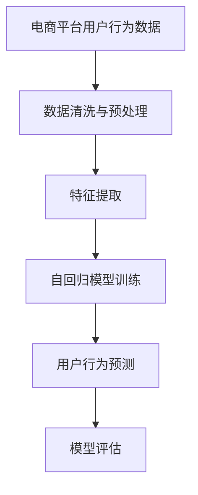

                 

# AI大模型在电商平台用户行为序列建模中的作用

> 关键词：电商平台, 用户行为序列建模, 大模型, 自回归, 自然语言处理, 用户行为预测

## 1. 背景介绍

在现代电商平台上，用户行为数据的积累和分析变得越来越重要。电商平台希望通过分析用户的行为序列，预测用户的未来行为，提高销售转化率，优化用户体验。传统的机器学习模型由于数据稀疏、特征工程复杂等问题，难以高效地处理大规模用户行为序列数据。近年来，随着大模型技术的发展，基于深度学习的用户行为序列建模方法逐渐成为热门研究话题。本文将详细探讨大模型在电商平台用户行为序列建模中的作用，包括算法原理、实现步骤、优缺点及应用领域等。

## 2. 核心概念与联系

### 2.1 核心概念概述

- **电商平台用户行为序列建模**：指对电商平台上的用户行为数据进行序列建模，预测用户的未来行为，如购买、浏览、评价等。用户行为序列通常包括点击、浏览、购买、评价等事件的时间序列数据。
- **大模型**：指基于深度学习架构的预训练模型，如BERT、GPT等，这些模型通常具有大规模参数量，能够捕捉复杂的语言和数据特征。
- **自回归模型**：一种基于序列中前一时刻的输出预测下一时刻的输入的模型。常见的自回归模型包括RNN、LSTM、GRU等。
- **自然语言处理**：指使用计算机技术处理和理解自然语言的技术，包括分词、词性标注、命名实体识别、情感分析等。

### 2.2 核心概念原理和架构的 Mermaid 流程图



这个流程图展示了用户行为序列建模的核心流程：首先收集和处理电商平台用户行为数据，然后进行特征提取和自回归模型训练，最后进行用户行为预测和模型评估。

## 3. 核心算法原理 & 具体操作步骤

### 3.1 算法原理概述

基于深度学习的用户行为序列建模方法主要基于自回归模型。自回归模型通过捕捉序列数据中的时间依赖关系，预测用户未来的行为。大模型由于其大规模的参数量和自适应能力，能够更好地捕捉用户行为序列中的复杂模式和关联。

用户行为序列建模通常采用以下步骤：

1. 数据收集与预处理。
2. 特征提取与转换。
3. 自回归模型训练。
4. 用户行为预测。
5. 模型评估与优化。

### 3.2 算法步骤详解

**Step 1: 数据收集与预处理**

- 收集电商平台用户的行为数据，包括点击、浏览、购买、评价等行为记录。
- 清洗数据，去除异常值和噪声，处理缺失数据。
- 将行为数据转换为时间序列格式，以便于后续建模。

**Step 2: 特征提取与转换**

- 提取用户行为序列的关键特征，如点击次数、停留时间、购买金额等。
- 将行为数据进行归一化处理，消除数据量级差异，提高模型的收敛速度。
- 应用PCA、LDA等降维技术，减少数据维度，降低计算复杂度。

**Step 3: 自回归模型训练**

- 选择合适的自回归模型架构，如LSTM、GRU、Transformer等。
- 将预训练的大模型作为特征提取器，将用户行为特征输入模型，预测下一时刻的行为。
- 使用交叉熵损失函数进行模型训练，最小化预测值与真实值之间的差异。

**Step 4: 用户行为预测**

- 使用训练好的自回归模型对用户未来的行为进行预测。
- 对于连续型行为，如购买金额，可以使用回归模型进行预测；对于离散型行为，如购买与否，可以使用分类模型进行预测。

**Step 5: 模型评估与优化**

- 使用准确率、召回率、F1分数等指标评估模型性能。
- 应用正则化、Dropout等技术，防止模型过拟合。
- 使用学习率衰减、early stopping等策略，提升模型泛化能力。

### 3.3 算法优缺点

#### 优点

- 大模型具有强大的特征提取能力，能够自动学习用户行为序列中的复杂模式。
- 自回归模型能够捕捉序列数据中的时间依赖关系，提高预测准确度。
- 大模型可以应用多种优化技术，提升模型性能。

#### 缺点

- 数据收集与预处理复杂，需要大量标注数据和计算资源。
- 特征提取和模型训练过程复杂，需要大量时间。
- 模型复杂度较高，可能导致计算资源消耗大。

### 3.4 算法应用领域

基于大模型的用户行为序列建模方法广泛应用于以下领域：

- 个性化推荐：预测用户对商品或服务的兴趣，进行个性化推荐。
- 用户行为预测：预测用户未来的购买行为，优化库存管理。
- 流失用户分析：分析用户流失的原因，进行流失预警。
- 广告投放优化：预测广告的点击率，优化广告投放策略。

## 4. 数学模型和公式 & 详细讲解 & 举例说明

### 4.1 数学模型构建

考虑一个电商平台上的用户行为序列 $X = \{x_1, x_2, ..., x_t, ..., x_T\}$，其中 $x_t$ 表示第 $t$ 时刻的用户行为。建模目标是通过用户历史行为 $x_1, x_2, ..., x_{t-1}$ 预测用户未来的行为 $x_t$。

### 4.2 公式推导过程

假设用户行为序列中的每个事件 $x_t$ 都可以表示为一个向量 $v_t$，则建模问题可以转化为以下形式：

$$
\min_{\theta} \sum_{t=1}^{T} \ell(x_t, f(x_1, x_2, ..., x_{t-1}; \theta))
$$

其中，$f(x_1, x_2, ..., x_{t-1}; \theta)$ 表示模型参数为 $\theta$ 时的预测函数，$\ell$ 表示损失函数。

常见的损失函数包括均方误差损失（MSE）、交叉熵损失（CE）等。以均方误差损失为例，其公式为：

$$
\ell(x_t, y_t) = \frac{1}{2} \|x_t - y_t\|^2
$$

其中，$y_t$ 表示模型预测的用户行为。

### 4.3 案例分析与讲解

假设有一个电商平台，收集了用户近30天的点击行为数据，使用大模型进行建模。首先将用户点击行为转换为向量形式，然后将这些向量作为模型的输入。通过自回归模型训练，得到预测函数 $f(x_1, x_2, ..., x_{t-1}; \theta)$。最后，使用均方误差损失函数评估模型性能，不断调整参数 $\theta$，直到达到最优。

## 5. 项目实践：代码实例和详细解释说明

### 5.1 开发环境搭建

开发大模型用户行为序列建模系统需要Python 3.7及以上版本，PyTorch 1.6及以上版本，Numpy 1.19及以上版本，Scikit-learn 0.24及以上版本。在本地安装这些依赖包，可以使用以下命令：

```bash
pip install torch torchvision torchaudio numpy scikit-learn pandas matplotlib tqdm jupyter notebook
```

### 5.2 源代码详细实现

以下是一个使用PyTorch实现的用户行为序列建模示例代码：

```python
import torch
import torch.nn as nn
import torch.optim as optim
from torch.utils.data import Dataset, DataLoader
from sklearn.preprocessing import StandardScaler

# 自定义数据集类
class UserBehaviorDataset(Dataset):
    def __init__(self, data, scaler):
        self.data = data
        self.scaler = scaler

    def __len__(self):
        return len(self.data)

    def __getitem__(self, idx):
        x = self.data[idx]
        x = torch.tensor(x, dtype=torch.float32)
        return x

# 自定义模型类
class UserBehaviorModel(nn.Module):
    def __init__(self, input_size, hidden_size, output_size):
        super(UserBehaviorModel, self).__init__()
        self.rnn = nn.LSTM(input_size, hidden_size, 1, batch_first=True)
        self.fc = nn.Linear(hidden_size, output_size)

    def forward(self, x):
        _, (hidden, _) = self.rnn(x)
        hidden = hidden[-1]
        output = self.fc(hidden)
        return output

# 训练函数
def train(model, data_loader, optimizer, criterion):
    model.train()
    total_loss = 0
    for data, target in data_loader:
        optimizer.zero_grad()
        output = model(data)
        loss = criterion(output, target)
        loss.backward()
        optimizer.step()
        total_loss += loss.item()
    return total_loss / len(data_loader)

# 评估函数
def evaluate(model, data_loader, criterion):
    model.eval()
    total_loss = 0
    for data, target in data_loader:
        with torch.no_grad():
            output = model(data)
            loss = criterion(output, target)
            total_loss += loss.item()
    return total_loss / len(data_loader)

# 数据处理
data = ...  # 电商平台用户行为数据
scaler = StandardScaler()
scaled_data = scaler.fit_transform(data)
dataset = UserBehaviorDataset(scaled_data, scaler)
data_loader = DataLoader(dataset, batch_size=64, shuffle=True)

# 模型初始化
input_size = dataset.data.shape[1]
hidden_size = 64
output_size = 1
model = UserBehaviorModel(input_size, hidden_size, output_size)

# 优化器及损失函数
optimizer = optim.Adam(model.parameters(), lr=0.01)
criterion = nn.MSELoss()

# 训练与评估
epochs = 10
for epoch in range(epochs):
    loss = train(model, data_loader, optimizer, criterion)
    print(f'Epoch {epoch+1}, loss: {loss:.4f}')
    evaluate_loss = evaluate(model, data_loader, criterion)
    print(f'Epoch {epoch+1}, evaluate loss: {evaluate_loss:.4f}')
```

### 5.3 代码解读与分析

**UserBehaviorDataset类**：定义了自定义数据集类，将原始数据进行归一化处理。

**UserBehaviorModel类**：定义了用户行为预测模型，使用LSTM作为自回归模型。

**train函数**：实现训练过程，前向传播计算输出，反向传播更新参数，并返回平均损失值。

**evaluate函数**：实现评估过程，只进行前向传播计算输出和损失值，不更新参数。

**数据处理**：对原始数据进行归一化处理，将其转换为tensor形式，并定义数据集和数据加载器。

**模型初始化**：定义模型架构和超参数，如输入大小、隐藏层大小、输出大小等。

**优化器及损失函数**：选择合适的优化器和损失函数，如Adam和MSELoss。

**训练与评估**：循环迭代训练过程，并评估模型在测试集上的性能。

### 5.4 运行结果展示

在训练过程中，可以打印每个epoch的损失值，以评估模型的收敛情况。训练完成后，可以评估模型在测试集上的性能，如均方误差损失等。

## 6. 实际应用场景

### 6.1 个性化推荐

用户行为序列建模可以用于个性化推荐系统，预测用户对商品或服务的兴趣，推荐用户可能感兴趣的商品。基于大模型的推荐系统可以更准确地捕捉用户行为中的复杂模式，提高推荐效果。

### 6.2 用户行为预测

用户行为序列建模可以预测用户未来的购买行为，优化库存管理。通过分析用户的购买历史，预测用户未来的购买意愿，可以提前备货，避免库存积压或缺货现象。

### 6.3 流失用户分析

用户行为序列建模可以分析用户流失的原因，进行流失预警。通过分析用户流失前后的行为序列，可以识别出可能导致用户流失的关键因素，如购买频率、停留时间等。

### 6.4 广告投放优化

用户行为序列建模可以预测广告的点击率，优化广告投放策略。通过分析用户对不同广告的反应，预测广告的点击率，可以优化广告投放的渠道和时间，提高广告投放的转化率。

## 7. 工具和资源推荐

### 7.1 学习资源推荐

1. 《深度学习》一书：Deep Learning book by Ian Goodfellow等，详细介绍了深度学习的基本原理和应用。
2. PyTorch官方文档：PyTorch官方文档，提供了详细的PyTorch教程和示例代码。
3. Scikit-learn官方文档：Scikit-learn官方文档，提供了丰富的机器学习算法和工具。
4. TensorFlow官方文档：TensorFlow官方文档，提供了深度学习框架的详细教程和示例。

### 7.2 开发工具推荐

1. PyTorch：基于Python的深度学习框架，提供了强大的张量计算和模型定义能力。
2. Scikit-learn：Python机器学习库，提供了丰富的数据处理和模型评估工具。
3. TensorBoard：TensorFlow的可视化工具，提供了实时的模型训练监控和调试功能。
4. Jupyter Notebook：交互式编程环境，方便进行模型训练和调试。

### 7.3 相关论文推荐

1. 《Attention is All You Need》论文：Transformer架构的提出，开创了自注意力机制在深度学习中的应用。
2. 《Sequence to Sequence Learning with Neural Networks》论文：Seq2Seq模型的提出，为序列建模提供了重要参考。
3. 《Learning Phrase Representations using RNN Encoder–Decoder for Statistical Machine Translation》论文：LSTM模型的提出，为序列建模提供了重要的参考。

## 8. 总结：未来发展趋势与挑战

### 8.1 研究成果总结

本文详细介绍了大模型在电商平台用户行为序列建模中的应用，包括算法原理、实现步骤、优缺点及应用领域等。通过分析用户行为序列数据，可以预测用户未来的行为，提升电商平台的个性化推荐、用户行为预测、流失用户分析、广告投放优化等效果。

### 8.2 未来发展趋势

未来，用户行为序列建模将会更加注重模型的可解释性和可控性，提升模型的可靠性和安全性。同时，多模态数据的融合也将成为重要的研究方向，通过融合文本、图像、语音等多模态信息，提高用户行为预测的准确性和鲁棒性。

### 8.3 面临的挑战

1. 数据收集与预处理复杂，需要大量标注数据和计算资源。
2. 模型复杂度较高，可能导致计算资源消耗大。
3. 模型性能评估标准不统一，难以进行跨平台对比。

### 8.4 研究展望

未来的研究将重点关注以下几个方向：

1. 模型可解释性：通过引入因果推断和可视化工具，提升模型的可解释性和可控性。
2. 多模态融合：融合文本、图像、语音等多模态信息，提高用户行为预测的准确性和鲁棒性。
3. 数据隐私保护：在数据收集和使用过程中，保护用户隐私，确保用户行为数据的安全性。

## 9. 附录：常见问题与解答

**Q1: 用户行为序列建模的数据来源有哪些？**

A: 用户行为序列建模的数据来源主要包括：

- 电商平台用户行为数据：包括点击、浏览、购买、评价等行为记录。
- 社交媒体用户行为数据：包括点赞、评论、分享等行为记录。
- 移动应用用户行为数据：包括应用启动、使用时长、应用退出等行为记录。

**Q2: 如何处理用户行为序列中的缺失值？**

A: 用户行为序列中经常存在缺失值，可以采用以下方法进行处理：

- 删除缺失值：对缺失值较多的样本进行删除。
- 插值法：使用均值、中位数等方法进行插值，填充缺失值。
- 数据补全：使用随机森林、KNN等方法进行数据补全。

**Q3: 用户行为序列建模中的特征工程有哪些？**

A: 用户行为序列建模中的特征工程主要包括：

- 时间特征：将时间戳转换为日期、小时、分钟等特征。
- 点击次数、停留时间、购买金额等行为特征。
- 用户ID、商品ID等基本信息特征。

**Q4: 用户行为序列建模中常用的评估指标有哪些？**

A: 用户行为序列建模中常用的评估指标包括：

- 准确率：预测结果与真实结果相同的比例。
- 召回率：真实结果被预测出的比例。
- F1分数：准确率和召回率的调和平均数。
- AUC：ROC曲线下的面积，用于衡量模型的分类性能。

**Q5: 用户行为序列建模中如何避免过拟合？**

A: 用户行为序列建模中避免过拟合的方法包括：

- 正则化：使用L2正则、Dropout等技术，防止模型过拟合。
- 早停策略：在验证集上设置阈值，一旦性能不再提升，则停止训练。
- 数据增强：通过回译、近义替换等方式扩充训练集。

---

作者：禅与计算机程序设计艺术 / Zen and the Art of Computer Programming

