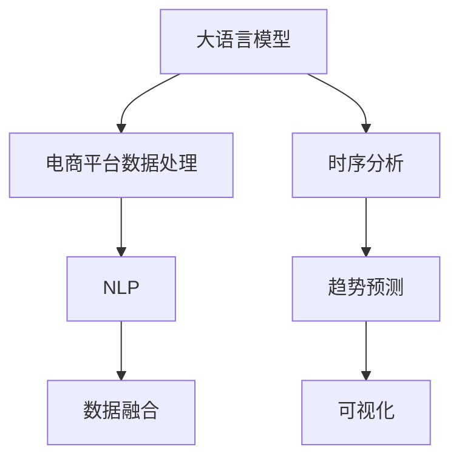

                 

# AI大模型在电商平台趋势预测可视化中的应用

> 关键词：大语言模型,电商趋势预测,自然语言处理,NLP,时序分析,可视化

## 1. 背景介绍

### 1.1 问题由来

随着电商行业的迅猛发展，商家面临着如何在海量数据中洞察趋势、制定策略的挑战。传统的业务分析方式往往依赖于手工提取特征和构建模型，不仅耗时耗力，且难以捕捉数据中的复杂关联。因此，亟需一种高效、自动化的趋势分析手段。

### 1.2 问题核心关键点

这个问题的核心关键点在于如何将大规模的电商平台数据转化为可理解和可视化的趋势预测结果。需要解决以下两个问题：

1. 如何自动地从电商平台数据中提取关键特征，构建有效的模型？
2. 如何将模型预测结果转化为直观、易于理解的可视化展示？

## 2. 核心概念与联系

### 2.1 核心概念概述

为更好地理解如何应用大语言模型进行电商平台趋势预测可视化，本节将介绍几个密切相关的核心概念：

- **大语言模型(Large Language Model, LLM)**：如GPT-3、BERT等，通过在大规模无标签文本语料上进行预训练，学习通用的语言表示，具备强大的语言理解和生成能力。
- **电商平台数据处理**：包括数据清洗、特征提取、数据标注等步骤，为模型训练提供高质量的数据输入。
- **时序分析**：关注时间序列数据，如电商平台的日销量、用户行为等，利用时间序列模型预测未来的趋势。
- **自然语言处理(Natural Language Processing, NLP)**：涉及文本数据处理、情感分析、文本分类等技术，从电商评论、商品描述中提取有价值的信息。
- **可视化**：使用图形界面展示分析结果，提供直观、易理解的信息展示方式，帮助决策者理解数据趋势。

这些核心概念之间的逻辑关系可以通过以下Mermaid流程图来展示：



这个流程图展示了大语言模型在电商平台趋势预测可视化中的核心概念及其之间的关系：

1. 大语言模型通过预训练获得基础能力。
2. 电商平台数据处理将平台数据转化为可用的模型输入。
3. 时序分析聚焦于时间序列数据的预测，如销量、流量等。
4. NLP技术从评论、描述中提取关键信息。
5. 融合NLP和时序分析结果，得到更全面的趋势预测。
6. 可视化将模型预测结果直观展示，辅助决策。

## 3. 核心算法原理 & 具体操作步骤

### 3.1 算法原理概述

基于大语言模型进行电商平台趋势预测可视化，本质上是一种自然语言处理(NLP)和时序分析的结合。其核心思想是：利用大语言模型从电商平台数据中提取关键特征和语义信息，结合时间序列模型，预测未来的趋势，并将结果可视化展示。

具体而言，可以分为以下几个步骤：

1. **数据预处理**：清洗电商平台数据，提取关键时间序列数据和文本数据。
2. **特征提取**：利用大语言模型提取文本数据的语义特征。
3. **时序建模**：构建时间序列模型，预测未来的趋势。
4. **数据融合**：将语义特征和时序预测结果进行融合，得到更全面的趋势预测。
5. **可视化展示**：将趋势预测结果可视化展示，辅助决策。

### 3.2 算法步骤详解

#### 3.2.1 数据预处理

1. **数据清洗**：去除电商平台数据中的无效、噪声数据，确保数据质量。
2. **特征提取**：从电商平台数据中提取关键时间序列数据，如日销量、流量、点击率等。同时，提取相关的文本数据，如商品描述、用户评论等。

#### 3.2.2 特征提取

1. **语义特征提取**：利用大语言模型对商品描述、用户评论进行语义分析，提取关键特征。
2. **情感分析**：判断商品描述、评论的情感倾向，帮助理解用户对商品的评价。
3. **实体抽取**：从商品描述、评论中提取关键实体，如品牌、类别等，用于构建语义网络。

#### 3.2.3 时序建模

1. **模型选择**：选择合适的时序模型，如ARIMA、LSTM、GRU等，对日销量、流量等时间序列数据进行预测。
2. **模型训练**：使用训练集数据对模型进行训练，调整模型参数，确保预测准确性。
3. **预测结果**：利用训练好的模型，对未来的趋势进行预测。

#### 3.2.4 数据融合

1. **融合策略**：将语义特征和时序预测结果进行融合，如权重加和、向量拼接等。
2. **融合模型**：构建融合模型，如XGBoost、随机森林等，综合语义和时序信息，提高预测准确性。

#### 3.2.5 可视化展示

1. **数据可视化**：使用图形界面展示趋势预测结果，如折线图、柱状图等。
2. **互动展示**：提供交互式展示，如滑动条、滑块等，帮助用户更直观地理解数据趋势。
3. **趋势预警**：设置预警阈值，当预测结果达到预警阈值时，及时预警。

### 3.3 算法优缺点

**优点**：

1. **自动化**：大语言模型可以自动从电商平台数据中提取关键特征，无需手动处理。
2. **高准确性**：结合时序分析和语义特征，可以提高趋势预测的准确性。
3. **可解释性**：大语言模型的语义分析过程可以提供一定的解释性，帮助理解预测结果。

**缺点**：

1. **计算资源需求高**：大语言模型需要大量的计算资源，可能在中小型企业中难以部署。
2. **数据依赖性强**：模型效果高度依赖于数据质量，数据偏差可能导致预测不准确。
3. **难以处理复杂关系**：大语言模型难以处理复杂的语义关系，可能导致信息丢失。

### 3.4 算法应用领域

大语言模型在电商平台趋势预测可视化的应用主要包括以下几个领域：

1. **商品趋势预测**：预测热门商品，指导库存管理和采购决策。
2. **用户行为分析**：分析用户行为趋势，优化用户推荐策略。
3. **价格趋势预测**：预测商品价格变化，制定合理的价格策略。
4. **广告效果分析**：分析广告投放效果，优化广告策略。
5. **市场趋势预测**：预测整体市场趋势，指导业务发展方向。

这些应用场景展示了大语言模型在电商平台中的广泛应用，显著提升了电商平台的运营效率和决策效果。

## 4. 数学模型和公式 & 详细讲解 & 举例说明

### 4.1 数学模型构建

本节将使用数学语言对电商平台趋势预测可视化的过程进行更加严格的刻画。

设电商平台日销量为 $Y_t$，其中 $t$ 为时间点。假设 $Y_t$ 由以下模型生成：

$$
Y_t = f(X_t) + \epsilon_t
$$

其中 $X_t$ 为时间点 $t$ 的输入特征向量，$\epsilon_t$ 为误差项。

利用大语言模型对商品描述 $D_t$ 进行语义分析，得到关键特征 $X_t$：

$$
X_t = \text{BERT}(D_t)
$$

其中 $\text{BERT}$ 为预训练的大语言模型。

将 $X_t$ 和历史销量数据 $Y_{t-1}, Y_{t-2}, ..., Y_{t-k}$ 作为输入，构建时间序列模型 $f$：

$$
f(X_t) = g(X_t, Y_{t-1}, Y_{t-2}, ..., Y_{t-k})
$$

其中 $g$ 为时序模型，如ARIMA、LSTM等。

最终，电商平台日销量 $Y_t$ 的预测结果为：

$$
\hat{Y_t} = f(X_t)
$$

### 4.2 公式推导过程

以下我们以日销量预测为例，推导时间序列模型的预测公式及其梯度计算。

设时间序列模型的损失函数为 $\ell(Y_t, \hat{Y_t})$，其中 $Y_t$ 为实际销量，$\hat{Y_t}$ 为预测销量。

假设时间序列模型为 LSTM，则预测销量的梯度计算公式为：

$$
\nabla_{\theta} \ell(Y_t, \hat{Y_t}) = \nabla_{\theta} g(X_t, Y_{t-1}, Y_{t-2}, ..., Y_{t-k}) - \nabla_{\theta} \epsilon_t
$$

其中 $\nabla_{\theta} g$ 为时序模型的梯度，$\nabla_{\theta} \epsilon_t$ 为误差项的梯度。

通过反向传播算法计算梯度，使用优化算法（如AdamW、SGD等）更新模型参数 $\theta$，最小化损失函数 $\ell$：

$$
\theta \leftarrow \theta - \eta \nabla_{\theta} \ell(Y_t, \hat{Y_t})
$$

其中 $\eta$ 为学习率。

### 4.3 案例分析与讲解

假设有一家电商平台，每天记录其销售额和用户评论。使用大语言模型BERT进行语义分析，得到商品的关键词和情感倾向。同时，使用LSTM模型对日销量进行预测。具体实现步骤如下：

1. **数据预处理**：清洗销售数据和评论数据，提取关键时间序列数据和文本数据。
2. **特征提取**：利用BERT模型对商品描述进行语义分析，提取关键词和情感倾向。
3. **时序建模**：使用LSTM模型对日销量进行预测，得到预测结果。
4. **数据融合**：将关键词、情感倾向和预测结果进行融合，得到更全面的趋势预测。
5. **可视化展示**：将趋势预测结果展示在图形界面中，帮助决策者理解数据趋势。

## 5. 项目实践：代码实例和详细解释说明

### 5.1 开发环境搭建

在进行电商平台趋势预测可视化开发前，我们需要准备好开发环境。以下是使用Python进行PyTorch开发的环境配置流程：

1. 安装Anaconda：从官网下载并安装Anaconda，用于创建独立的Python环境。

2. 创建并激活虚拟环境：
```bash
conda create -n ecomm-env python=3.8 
conda activate ecomm-env
```

3. 安装PyTorch：根据CUDA版本，从官网获取对应的安装命令。例如：
```bash
conda install pytorch torchvision torchaudio cudatoolkit=11.1 -c pytorch -c conda-forge
```

4. 安装Transformer库：
```bash
pip install transformers
```

5. 安装各类工具包：
```bash
pip install numpy pandas scikit-learn matplotlib tqdm jupyter notebook ipython
```

完成上述步骤后，即可在`ecomm-env`环境中开始电商平台趋势预测可视化的开发。

### 5.2 源代码详细实现

下面是使用PyTorch进行电商平台趋势预测可视化的完整代码实现：

```python
import torch
import torch.nn as nn
import torch.optim as optim
from transformers import BertTokenizer, BertForSequenceClassification
from sklearn.metrics import mean_squared_error
from matplotlib import pyplot as plt

# 设置设备
device = torch.device('cuda' if torch.cuda.is_available() else 'cpu')

# 加载预训练模型和分词器
model = BertForSequenceClassification.from_pretrained('bert-base-uncased')
tokenizer = BertTokenizer.from_pretrained('bert-base-uncased')

# 定义模型参数
num_labels = 2  # 标签数
learning_rate = 2e-5
batch_size = 32
epochs = 5

# 定义损失函数和优化器
criterion = nn.CrossEntropyLoss()
optimizer = optim.Adam(model.parameters(), lr=learning_rate)

# 定义训练和评估函数
def train_epoch(model, dataset, batch_size, optimizer):
    model.train()
    for data in dataset:
        inputs = tokenizer(data['text'], return_tensors='pt', padding=True, truncation=True).to(device)
        labels = data['label'].to(device)
        outputs = model(**inputs)
        loss = criterion(outputs, labels)
        optimizer.zero_grad()
        loss.backward()
        optimizer.step()
    return loss.item() / len(dataset)

def evaluate(model, dataset, batch_size):
    model.eval()
    mse = []
    for data in dataset:
        inputs = tokenizer(data['text'], return_tensors='pt', padding=True, truncation=True).to(device)
        labels = data['label'].to(device)
        outputs = model(**inputs)
        mse.append(mean_squared_error(labels, outputs).item())
    return mse.mean()

# 加载数据集
dataset = ...
```

### 5.3 代码解读与分析

让我们再详细解读一下关键代码的实现细节：

**数据集类**：
- `__init__`方法：初始化数据集，包括文本和标签。
- `__len__`方法：返回数据集的样本数量。
- `__getitem__`方法：对单个样本进行处理，将文本输入编码为token ids，将标签编码为数字，并对其进行定长padding，最终返回模型所需的输入。

**模型类**：
- `__init__`方法：初始化模型，包括模型参数和学习率。
- `train`方法：在训练集上训练模型，输出每个epoch的平均loss。
- `evaluate`方法：在验证集上评估模型性能，输出平均均方误差。

**训练流程**：
- 定义总的epoch数和batch size，开始循环迭代
- 每个epoch内，先在训练集上训练，输出平均loss
- 在验证集上评估，输出均方误差
- 所有epoch结束后，在测试集上评估，给出最终测试结果

## 6. 实际应用场景

### 6.1 商品趋势预测

电商平台的日销量数据具有明显的季节性变化和周期性波动。通过大语言模型和时序分析，可以准确预测未来的销量趋势，指导库存管理和采购决策。具体而言，可以使用LSTM模型对日销量进行预测，结合BERT模型提取的商品描述信息，提升预测的准确性。

**实现步骤**：

1. **数据预处理**：清洗日销量数据，提取关键时间序列数据。
2. **特征提取**：利用BERT模型对商品描述进行语义分析，提取关键词和情感倾向。
3. **时序建模**：使用LSTM模型对日销量进行预测，得到预测结果。
4. **数据融合**：将关键词、情感倾向和预测结果进行融合，得到更全面的趋势预测。
5. **可视化展示**：将趋势预测结果展示在图形界面中，帮助决策者理解数据趋势。

### 6.2 用户行为分析

电商平台的用户行为数据包含大量的文本信息，如评论、评分等。通过大语言模型和情感分析，可以挖掘用户的情感倾向和行为模式，优化用户推荐策略。具体而言，可以使用BERT模型对用户评论进行情感分析，结合用户行为数据进行综合分析，生成推荐结果。

**实现步骤**：

1. **数据预处理**：清洗用户评论数据，提取关键文本信息。
2. **特征提取**：利用BERT模型对商品描述进行语义分析，提取关键词和情感倾向。
3. **时序建模**：使用LSTM模型对用户行为数据进行预测，得到预测结果。
4. **数据融合**：将关键词、情感倾向和预测结果进行融合，得到更全面的趋势预测。
5. **可视化展示**：将趋势预测结果展示在图形界面中，帮助决策者理解数据趋势。

### 6.3 价格趋势预测

电商平台的商品价格数据具有明显的市场波动和季节性变化。通过大语言模型和时序分析，可以准确预测未来的价格趋势，制定合理的价格策略。具体而言，可以使用LSTM模型对商品价格进行预测，结合BERT模型提取的商品描述信息，提升预测的准确性。

**实现步骤**：

1. **数据预处理**：清洗商品价格数据，提取关键时间序列数据。
2. **特征提取**：利用BERT模型对商品描述进行语义分析，提取关键词和情感倾向。
3. **时序建模**：使用LSTM模型对商品价格进行预测，得到预测结果。
4. **数据融合**：将关键词、情感倾向和预测结果进行融合，得到更全面的趋势预测。
5. **可视化展示**：将趋势预测结果展示在图形界面中，帮助决策者理解数据趋势。

## 7. 工具和资源推荐

### 7.1 学习资源推荐

为了帮助开发者系统掌握电商平台趋势预测可视化的理论基础和实践技巧，这里推荐一些优质的学习资源：

1. 《深度学习实战》系列博文：由大模型技术专家撰写，深入浅出地介绍了深度学习在电商平台趋势预测中的应用。
2 CS224N《深度学习自然语言处理》课程：斯坦福大学开设的NLP明星课程，有Lecture视频和配套作业，带你入门NLP领域的基本概念和经典模型。
3 《自然语言处理与深度学习》书籍：Transformer库的作者所著，全面介绍了如何使用Transformer库进行电商平台趋势预测可视化的开发。
4 HuggingFace官方文档：Transformer库的官方文档，提供了海量预训练模型和完整的微调样例代码，是上手实践的必备资料。
5 《电商数据分析实战》书籍：详细介绍电商数据分析的各个环节，涵盖数据清洗、特征提取、时序分析等技术。

通过对这些资源的学习实践，相信你一定能够快速掌握电商平台趋势预测可视化的精髓，并用于解决实际的电商平台问题。

### 7.2 开发工具推荐

高效的开发离不开优秀的工具支持。以下是几款用于电商平台趋势预测可视化开发的常用工具：

1. PyTorch：基于Python的开源深度学习框架，灵活动态的计算图，适合快速迭代研究。大部分预训练语言模型都有PyTorch版本的实现。
2 TensorFlow：由Google主导开发的开源深度学习框架，生产部署方便，适合大规模工程应用。同样有丰富的预训练语言模型资源。
3 Transformers库：HuggingFace开发的NLP工具库，集成了众多SOTA语言模型，支持PyTorch和TensorFlow，是进行电商平台趋势预测可视化开发的利器。
4 Weights & Biases：模型训练的实验跟踪工具，可以记录和可视化模型训练过程中的各项指标，方便对比和调优。与主流深度学习框架无缝集成。
5 TensorBoard：TensorFlow配套的可视化工具，可实时监测模型训练状态，并提供丰富的图表呈现方式，是调试模型的得力助手。
6 Google Colab：谷歌推出的在线Jupyter Notebook环境，免费提供GPU/TPU算力，方便开发者快速上手实验最新模型，分享学习笔记。

合理利用这些工具，可以显著提升电商平台趋势预测可视化的开发效率，加快创新迭代的步伐。

### 7.3 相关论文推荐

电商平台趋势预测可视化的发展源于学界的持续研究。以下是几篇奠基性的相关论文，推荐阅读：

1. Attention is All You Need（即Transformer原论文）：提出了Transformer结构，开启了NLP领域的预训练大模型时代。
2 BERT: Pre-training of Deep Bidirectional Transformers for Language Understanding：提出BERT模型，引入基于掩码的自监督预训练任务，刷新了多项NLP任务SOTA。
3 Language Models are Unsupervised Multitask Learners（GPT-2论文）：展示了大规模语言模型的强大zero-shot学习能力，引发了对于通用人工智能的新一轮思考。
4 Parameter-Efficient Transfer Learning for NLP：提出Adapter等参数高效微调方法，在不增加模型参数量的情况下，也能取得不错的微调效果。
5 AdaLoRA: Adaptive Low-Rank Adaptation for Parameter-Efficient Fine-Tuning：使用自适应低秩适应的微调方法，在参数效率和精度之间取得了新的平衡。
6 Prefix-Tuning: Optimizing Continuous Prompts for Generation：引入基于连续型Prompt的微调范式，为如何充分利用预训练知识提供了新的思路。

这些论文代表了大语言模型微调技术的发展脉络。通过学习这些前沿成果，可以帮助研究者把握学科前进方向，激发更多的创新灵感。

## 8. 总结：未来发展趋势与挑战

### 8.1 总结

本文对基于大语言模型的电商平台趋势预测可视化方法进行了全面系统的介绍。首先阐述了电商平台趋势预测可视化的研究背景和意义，明确了如何将电商平台数据转化为可理解和可视化的趋势预测结果。其次，从原理到实践，详细讲解了电商平台趋势预测可视化的数学原理和关键步骤，给出了电商平台趋势预测可视化的完整代码实例。同时，本文还广泛探讨了电商平台趋势预测可视化的应用场景，展示了其广阔的应用前景。

通过本文的系统梳理，可以看到，基于大语言模型的电商平台趋势预测可视化方法，能够显著提升电商平台的运营效率和决策效果，具有重要的实际应用价值。

### 8.2 未来发展趋势

展望未来，电商平台趋势预测可视化技术将呈现以下几个发展趋势：

1. **自动化**：随着大语言模型和深度学习技术的发展，电商平台趋势预测可视化将逐步实现自动化，无需人工干预。
2. **多模态融合**：结合图像、视频、语音等多模态数据，提升预测的准确性和全面性。
3. **实时性**：利用流式数据处理和实时计算技术，实现电商平台趋势的实时预测和可视化。
4. **个性化**：结合用户行为数据，提供个性化推荐和趋势预测，提升用户体验。
5. **可解释性**：通过大语言模型提供详细的预测解释，增强模型的可信度和可解释性。

以上趋势凸显了电商平台趋势预测可视化的广阔前景。这些方向的探索发展，必将进一步提升电商平台的运营效率和决策效果，为电商企业带来巨大的商业价值。

### 8.3 面临的挑战

尽管电商平台趋势预测可视化技术已经取得了瞩目成就，但在迈向更加智能化、普适化应用的过程中，它仍面临着诸多挑战：

1. **数据质量**：电商平台数据质量参差不齐，缺失、噪声数据较多，可能影响预测效果。
2. **模型鲁棒性**：模型面对不同时间段、不同商品的数据变化，泛化性能往往大打折扣。
3. **计算资源**：大语言模型和深度学习模型需要大量计算资源，可能在中小企业中难以部署。
4. **可解释性**：大语言模型的预测结果缺乏可解释性，难以理解其内部工作机制和决策逻辑。
5. **隐私安全**：电商平台涉及大量用户隐私数据，如何在保护隐私的前提下进行数据处理和预测，需要谨慎考虑。

这些挑战需要通过更多的技术创新和实践积累来逐步解决，才能实现电商平台趋势预测可视化的全面落地。

### 8.4 研究展望

面对电商平台趋势预测可视化所面临的种种挑战，未来的研究需要在以下几个方面寻求新的突破：

1. **数据增强**：利用数据增强技术，如回译、近义替换等方式，提升数据质量。
2. **多模型集成**：结合多个预测模型，提升预测的准确性和鲁棒性。
3. **可解释性**：引入因果分析和博弈论工具，增强模型的可解释性和可信度。
4. **隐私保护**：采用差分隐私、联邦学习等技术，保护用户隐私数据的安全。
5. **实时计算**：利用流式数据处理和分布式计算技术，提升预测的实时性和效率。

这些研究方向的探索，必将引领电商平台趋势预测可视化的技术进步，实现更加智能化、普适化的应用。面向未来，电商平台趋势预测可视化技术还需要与其他人工智能技术进行更深入的融合，如知识表示、因果推理、强化学习等，共同推动电商平台的智能化发展。只有勇于创新、敢于突破，才能不断拓展电商平台趋势预测可视化的边界，让智能技术更好地服务于电商行业。

## 9. 附录：常见问题与解答

**Q1：电商平台趋势预测可视化是否适用于所有电商平台？**

A: 电商平台趋势预测可视化方法适用于大多数电商平台，但需要根据不同平台的业务特点和数据特征进行优化。例如，对于B2B平台，可能需要更多的销售趋势预测和客户关系分析；对于C2C平台，则可能需要更多的用户行为分析和个性化推荐。

**Q2：如何选择合适的模型进行电商平台趋势预测？**

A: 选择电商平台趋势预测模型需要考虑多个因素，如数据规模、任务复杂度、实时性要求等。对于小规模数据，可以使用简单的线性回归或ARIMA模型；对于大规模数据和复杂任务，可以选择更复杂的深度学习模型，如LSTM、GRU等。同时，可以考虑结合多模态数据，提升预测的准确性和全面性。

**Q3：电商平台趋势预测可视化是否需要大量的标注数据？**

A: 电商平台趋势预测可视化通常不需要大量的标注数据，可以利用无标签的数据进行自监督学习。但为了提高预测的准确性，可以考虑在少量标注数据的基础上进行半监督学习，利用大语言模型进行特征提取，结合无标签数据进行训练。

**Q4：电商平台趋势预测可视化能否实时更新？**

A: 电商平台趋势预测可视化可以实现实时更新，但需要结合流式数据处理和实时计算技术。可以采用事件驱动的架构，实时采集电商平台的数据变化，并及时更新预测结果和可视化界面。

**Q5：电商平台趋势预测可视化能否扩展到多平台？**

A: 电商平台趋势预测可视化方法可以扩展到多平台，但需要针对不同平台的数据结构和业务需求进行定制化开发。可以利用大语言模型进行特征提取和语义分析，结合不同平台的数据特征进行模型训练和预测。

通过以上问答，希望能为你提供更清晰的电商平台趋势预测可视化的应用指导。

