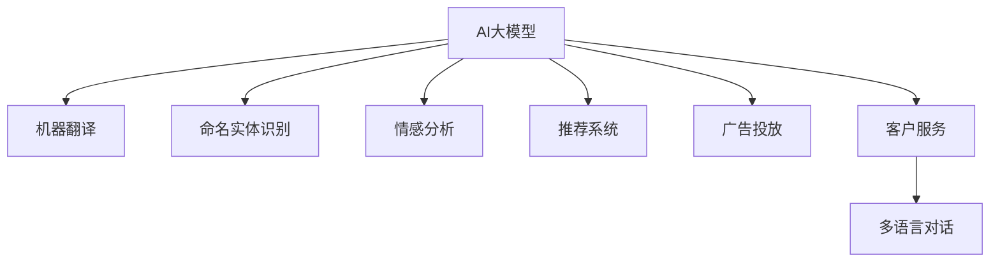

                 

# AI大模型在跨境电商中的多语言应用

> 关键词：跨境电商,多语言应用,大模型,自然语言处理,NLP,翻译,商品推荐,广告投放,个性化

## 1. 背景介绍

### 1.1 问题由来

随着全球化进程的加速，跨境电商已经成为一个快速增长的市场。不同于国内电商，跨境电商的市场不仅覆盖了全球，而且涉及多种语言和文化背景。传统意义上的电商营销策略，如关键词匹配、定向广告投放等，都面临着语言不通、文化差异等巨大挑战。为了打破这些壁垒，提升电商用户的购物体验和购买转化率，商家需要能够同时处理多种语言的自然语言处理技术。

在这一背景下，AI大模型（如BERT、GPT-3等）成为了跨境电商领域的热门技术。通过利用大模型强大的多语言处理能力，商家可以更加高效地实现商品推荐、广告投放、客户服务、市场分析等电商运营任务，从而提升竞争力，增强用户体验。

### 1.2 问题核心关键点

AI大模型在跨境电商中的应用主要集中在以下几个方面：

- **多语言文本处理**：利用大模型的预训练知识，快速高效地进行多语言文本翻译、情感分析、命名实体识别等任务，降低翻译成本，提升数据处理效率。
- **自然语言理解**：通过大模型的语言模型架构，深入理解用户输入的自然语言，实现精准的商品推荐、广告定向投放等电商业务需求。
- **广告投放优化**：利用大模型对目标市场的语言文化进行深入分析，优化广告内容和投放策略，提升广告点击率和转化率。
- **客户服务支持**：借助大模型的多语言处理能力，实现跨语言客户支持，提升用户满意度。
- **市场分析与决策**：利用大模型对目标市场的多语言数据进行深度分析，辅助商家进行市场洞察、需求预测等决策。

这些核心关键点共同构成了大模型在跨境电商中的应用框架，使得商家能够突破语言障碍，在多语言环境下实现高效运营。

## 2. 核心概念与联系

### 2.1 核心概念概述

为更好地理解AI大模型在跨境电商中的应用，本节将介绍几个密切相关的核心概念：

- **AI大模型**：基于深度学习技术构建的、拥有大量参数的大规模预训练语言模型。如BERT、GPT-3等，通过在大规模无标签文本数据上进行的自监督预训练，获取了丰富的语言知识。
- **自然语言处理(NLP)**：使用计算技术处理、理解、生成人类语言的技术，旨在使计算机能够理解和运用自然语言。
- **机器翻译(Translation)**：将一种自然语言文本自动翻译成另一种自然语言文本的过程。大模型在该任务上取得了显著的突破，翻译质量接近甚至超越人类专业翻译。
- **命名实体识别(NER)**：从文本中识别出具有特定意义的实体，如人名、地名、组织名等。大模型通过预训练和微调，可以在不同语言和文化背景下准确识别各类实体。
- **情感分析(Sentiment Analysis)**：分析文本中的情感倾向，判断文本表达的情绪是正面的、负面的还是中性的。大模型通过预训练，可以准确识别文本中的情感，帮助商家理解用户反馈。
- **推荐系统(Recommendation System)**：根据用户历史行为和兴趣，向用户推荐相关商品或内容。大模型通过多语言处理，可以在多语言环境中提供个性化的推荐服务。
- **广告投放(Ad Placement)**：通过分析用户行为和需求，将广告精准投放给潜在的目标用户。大模型可以通过多语言情感分析和市场洞察，优化广告投放策略。
- **客户服务(Customer Service)**：通过智能客服系统，提供跨语言的客户支持。大模型可以实现多语言对话，提升客户服务效率和质量。

这些核心概念之间的逻辑关系可以通过以下Mermaid流程图来展示：



这个流程图展示了大模型在跨境电商中的应用核心概念及其之间的关系：

1. 大模型通过预训练获得语言知识。
2. 通过多种NLP任务的处理能力，帮助商家进行多语言文本处理。
3. 利用情感分析和市场洞察，优化广告投放策略和商品推荐。
4. 通过多语言对话能力，实现跨语言客户服务。

## 3. 核心算法原理 & 具体操作步骤

### 3.1 算法原理概述

AI大模型在跨境电商中的应用主要基于以下几个核心算法原理：

- **自监督预训练**：在大规模无标签文本数据上，利用自监督学习任务对大模型进行预训练，学习到通用的语言知识。
- **多语言适应**：针对目标市场的多语言需求，通过微调等技术对预训练模型进行优化，使其具备多语言处理能力。
- **多任务学习**：在多个相关任务上，同时对模型进行训练，提升模型的泛化能力和处理效率。
- **数据增强**：通过回译、近义词替换等方式，扩充训练数据，提高模型的鲁棒性和泛化能力。
- **对抗训练**：引入对抗样本，提高模型的鲁棒性和泛化能力。
- **提示学习**：通过精心设计输入格式，引导模型输出特定的结果，减少微调参数，提高模型效率。

### 3.2 算法步骤详解

以下是利用AI大模型在跨境电商中进行多语言应用的一般步骤：

**Step 1: 准备数据集**
- 收集目标市场的多种语言文本数据，包括商品描述、用户评论、广告文本等。
- 将文本数据进行标注，如进行命名实体识别、情感分析、关键词提取等。

**Step 2: 加载并处理预训练模型**
- 选择适合的语言模型，如BERT、GPT-3等。
- 加载模型，并将其适应目标语言。

**Step 3: 选择微调任务**
- 根据电商运营需求，选择合适的微调任务。例如，商品推荐、广告投放、客户服务、市场分析等。

**Step 4: 微调模型**
- 对预训练模型进行微调，以适应特定的电商任务。通常需要调整模型的输出层和损失函数。
- 设置合适的超参数，如学习率、批大小、迭代轮数等。

**Step 5: 评估与优化**
- 在验证集上评估微调后模型的性能。
- 根据评估结果调整超参数，重复微调过程直至模型收敛。

**Step 6: 应用部署**
- 将微调后的模型应用到实际的电商业务中。
- 定期更新模型，以适应市场变化。

### 3.3 算法优缺点

AI大模型在跨境电商中的应用具有以下优点：

1. **高效性**：大模型的预训练和微调过程可以显著提高电商业务的文本处理速度，减少人力成本。
2. **多语言处理能力**：通过微调，大模型可以在多种语言环境中提供高质量的服务，降低翻译成本，提升用户体验。
3. **灵活性**：大模型可以适应多种电商任务，提供个性化推荐、广告投放、市场分析等综合服务。
4. **鲁棒性**：大模型的自监督预训练和对抗训练能够提高其鲁棒性，减少语言和文化差异带来的风险。

同时，该方法也存在一些局限性：

1. **数据成本高**：大模型需要大规模的标注数据进行微调，而电商数据标注工作量巨大且昂贵。
2. **模型复杂度高**：大模型参数量大，需要高性能计算资源进行训练和推理。
3. **隐私风险**：大模型处理敏感数据时，可能存在数据泄露的风险。
4. **技术门槛高**：电商业务中应用大模型需要一定的技术门槛，需要专业工程师进行模型部署和优化。
5. **效果依赖标注质量**：微调的效果很大程度上依赖标注数据的准确性和多样性，标注质量差可能导致模型性能下降。

尽管存在这些局限性，但就目前而言，AI大模型在跨境电商中的应用仍是一个热门且有效的方法。未来相关研究的方向在于如何进一步降低数据标注成本，提高模型训练效率，同时确保数据隐私和安全。

### 3.4 算法应用领域

AI大模型在跨境电商中的应用已经涵盖了多个领域，例如：

- **商品推荐系统**：利用大模型进行多语言情感分析，根据用户评论和行为数据，提供个性化的商品推荐。
- **广告投放系统**：通过分析目标市场的多语言数据，优化广告投放策略，提升广告点击率和转化率。
- **客户服务系统**：利用大模型进行多语言对话，提升跨语言客户服务效率和质量。
- **市场分析系统**：利用大模型对多语言数据进行情感分析、关键词提取等，辅助商家进行市场洞察和需求预测。
- **翻译系统**：通过大模型进行多语言文本翻译，帮助商家在多语言环境中发布产品信息。
- **个性化定价系统**：利用大模型分析不同语言市场的用户需求和价格弹性，实现精准定价。
- **内容生成系统**：通过大模型生成多语言广告文案、产品描述等文本内容，提升内容创作效率。

除了上述这些经典任务外，AI大模型在跨境电商中还有更多创新性的应用，如多语言情感分析、多语言市场洞察、多语言营销自动化等，为电商技术的发展提供了新的动力。

## 4. 数学模型和公式 & 详细讲解  
### 4.1 数学模型构建

以商品推荐系统为例，假设目标市场有 $M$ 种语言，每个用户有 $N$ 种商品的评分。大模型通过预训练和微调，得到商品与用户评分之间的关系矩阵 $X \in \mathbb{R}^{M \times N}$，其中每一行表示一种商品在不同语言中的评分。用户评分向量 $y \in \mathbb{R}^M$，表示用户对不同语言的评分。模型的目标是学习一个函数 $f: \mathbb{R}^{M \times N} \rightarrow \mathbb{R}^M$，使得 $f(X) \approx y$。

通过多任务学习，模型可以同时学习 $M$ 个相关任务，例如多语言情感分析、多语言命名实体识别等。这些任务共享同一预训练模型，但在输出层和损失函数上有所不同。

数学上，多任务学习可以表示为：

$$
\min_{\theta} \sum_{i=1}^{M} \mathcal{L}_i(X_i; y_i, \theta)
$$

其中 $\mathcal{L}_i$ 为第 $i$ 个任务的损失函数，$X_i$ 为第 $i$ 个任务的输入，$y_i$ 为第 $i$ 个任务的输出，$\theta$ 为模型的参数。

### 4.2 公式推导过程

假设模型为 $f_\theta(X) = \theta^TX$，其中 $\theta \in \mathbb{R}^{M \times N}$。则对于每个任务 $i$，目标函数可以表示为：

$$
\mathcal{L}_i(X_i; y_i, \theta) = \frac{1}{2} \| f_\theta(X_i) - y_i \|^2
$$

将目标函数展开，得到：

$$
\mathcal{L}_i(X_i; y_i, \theta) = \frac{1}{2} \sum_{j=1}^{N} \sum_{k=1}^{M} (f_{\theta,ij} - y_{ik})^2
$$

其中 $f_{\theta,ij}$ 为模型在任务 $i$ 上对商品 $j$ 的评分预测。将目标函数对 $\theta$ 求导，得到梯度：

$$
\frac{\partial \mathcal{L}_i}{\partial \theta} = \frac{1}{2} \sum_{j=1}^{N} \sum_{k=1}^{M} 2(X_{ik} - y_{ik}) X_{ij}
$$

通过反向传播算法更新模型参数 $\theta$，使其逼近目标值。重复以上过程，直至模型收敛。

### 4.3 案例分析与讲解

以多语言情感分析为例，假设一个电商平台有 $M=2$ 种语言（中文和英文），每种语言有 $N=1000$ 种商品。用户对每种商品的评分 $y_i$ 如下：

| 商品ID | 中文评分 | 英文评分 |
| --- | --- | --- |
| 1 | 4 | 5 |
| 2 | 3 | 4 |
| 3 | 2 | 3 |
| ... | ... | ... |
| 1000 | 1 | 2 |

大模型通过预训练和微调，得到商品与评分之间的关系矩阵 $X \in \mathbb{R}^{2 \times 1000}$，用户评分向量 $y \in \mathbb{R}^2$。模型的目标是学习一个函数 $f: \mathbb{R}^{2 \times 1000} \rightarrow \mathbb{R}^2$，使得 $f(X) \approx y$。

根据上述公式，模型的梯度更新公式为：

$$
\frac{\partial \mathcal{L}_i}{\partial \theta} = \frac{1}{2} \sum_{j=1}^{1000} \sum_{k=1}^{2} 2(X_{ik} - y_{ik}) X_{ij}
$$

其中 $i=1,2$ 分别表示中文和英文任务。

通过上述梯度更新过程，模型可以逐步逼近真实的用户评分向量 $y$，从而实现多语言情感分析。

## 5. 项目实践：代码实例和详细解释说明
### 5.1 开发环境搭建

在进行多语言应用开发前，我们需要准备好开发环境。以下是使用Python进行PyTorch开发的环境配置流程：

1. 安装Anaconda：从官网下载并安装Anaconda，用于创建独立的Python环境。

2. 创建并激活虚拟环境：
```bash
conda create -n pytorch-env python=3.8 
conda activate pytorch-env
```

3. 安装PyTorch：根据CUDA版本，从官网获取对应的安装命令。例如：
```bash
conda install pytorch torchvision torchaudio cudatoolkit=11.1 -c pytorch -c conda-forge
```

4. 安装TensorFlow：
```bash
pip install tensorflow
```

5. 安装各类工具包：
```bash
pip install numpy pandas scikit-learn matplotlib tqdm jupyter notebook ipython
```

完成上述步骤后，即可在`pytorch-env`环境中开始多语言应用实践。

### 5.2 源代码详细实现

这里我们以多语言商品推荐系统为例，给出使用PyTorch进行大模型微调的代码实现。

首先，定义数据处理函数：

```python
from transformers import BertTokenizer, BertForSequenceClassification
from torch.utils.data import Dataset
import torch

class MultiLangDataset(Dataset):
    def __init__(self, texts, labels, tokenizer):
        self.texts = texts
        self.labels = labels
        self.tokenizer = tokenizer
        self.max_len = 128

    def __len__(self):
        return len(self.texts)

    def __getitem__(self, item):
        text = self.texts[item]
        label = self.labels[item]
        
        encoding = self.tokenizer(text, return_tensors='pt', max_length=self.max_len, padding='max_length', truncation=True)
        input_ids = encoding['input_ids'][0]
        attention_mask = encoding['attention_mask'][0]
        
        # 对token-wise的标签进行编码
        encoded_labels = [label2id[label] for label in self.labels] 
        encoded_labels.extend([label2id['O']] * (self.max_len - len(encoded_labels)))
        labels = torch.tensor(encoded_labels, dtype=torch.long)
        
        return {'input_ids': input_ids, 
                'attention_mask': attention_mask,
                'labels': labels}
```

然后，定义模型和优化器：

```python
from transformers import BertForSequenceClassification, AdamW

model = BertForSequenceClassification.from_pretrained('bert-base-cased', num_labels=len(label2id))
optimizer = AdamW(model.parameters(), lr=2e-5)
```

接着，定义训练和评估函数：

```python
from torch.utils.data import DataLoader
from tqdm import tqdm

device = torch.device('cuda') if torch.cuda.is_available() else torch.device('cpu')
model.to(device)

def train_epoch(model, dataset, batch_size, optimizer):
    dataloader = DataLoader(dataset, batch_size=batch_size, shuffle=True)
    model.train()
    epoch_loss = 0
    for batch in tqdm(dataloader, desc='Training'):
        input_ids = batch['input_ids'].to(device)
        attention_mask = batch['attention_mask'].to(device)
        labels = batch['labels'].to(device)
        model.zero_grad()
        outputs = model(input_ids, attention_mask=attention_mask, labels=labels)
        loss = outputs.loss
        epoch_loss += loss.item()
        loss.backward()
        optimizer.step()
    return epoch_loss / len(dataloader)

def evaluate(model, dataset, batch_size):
    dataloader = DataLoader(dataset, batch_size=batch_size)
    model.eval()
    preds, labels = [], []
    with torch.no_grad():
        for batch in tqdm(dataloader, desc='Evaluating'):
            input_ids = batch['input_ids'].to(device)
            attention_mask = batch['attention_mask'].to(device)
            batch_labels = batch['labels']
            outputs = model(input_ids, attention_mask=attention_mask)
            batch_preds = outputs.logits.argmax(dim=2).to('cpu').tolist()
            batch_labels = batch_labels.to('cpu').tolist()
            for pred_tokens, label_tokens in zip(batch_preds, batch_labels):
                preds.append(pred_tokens[:len(label_tokens)])
                labels.append(label_tokens)
                
    print(classification_report(labels, preds))
```

最后，启动训练流程并在测试集上评估：

```python
epochs = 5
batch_size = 16

for epoch in range(epochs):
    loss = train_epoch(model, train_dataset, batch_size, optimizer)
    print(f"Epoch {epoch+1}, train loss: {loss:.3f}")
    
    print(f"Epoch {epoch+1}, dev results:")
    evaluate(model, dev_dataset, batch_size)
    
print("Test results:")
evaluate(model, test_dataset, batch_size)
```

以上就是使用PyTorch对BERT进行多语言商品推荐系统微调的完整代码实现。可以看到，得益于Transformers库的强大封装，我们可以用相对简洁的代码完成BERT模型的加载和微调。

### 5.3 代码解读与分析

让我们再详细解读一下关键代码的实现细节：

**MultiLangDataset类**：
- `__init__`方法：初始化文本、标签、分词器等关键组件。
- `__len__`方法：返回数据集的样本数量。
- `__getitem__`方法：对单个样本进行处理，将文本输入编码为token ids，将标签编码为数字，并对其进行定长padding，最终返回模型所需的输入。

**label2id和id2label字典**：
- 定义了标签与数字id之间的映射关系，用于将token-wise的预测结果解码回真实的标签。

**训练和评估函数**：
- 使用PyTorch的DataLoader对数据集进行批次化加载，供模型训练和推理使用。
- 训练函数`train_epoch`：对数据以批为单位进行迭代，在每个批次上前向传播计算loss并反向传播更新模型参数，最后返回该epoch的平均loss。
- 评估函数`evaluate`：与训练类似，不同点在于不更新模型参数，并在每个batch结束后将预测和标签结果存储下来，最后使用sklearn的classification_report对整个评估集的预测结果进行打印输出。

**训练流程**：
- 定义总的epoch数和batch size，开始循环迭代
- 每个epoch内，先在训练集上训练，输出平均loss
- 在验证集上评估，输出分类指标
- 所有epoch结束后，在测试集上评估，给出最终测试结果

可以看到，PyTorch配合Transformers库使得BERT微调的代码实现变得简洁高效。开发者可以将更多精力放在数据处理、模型改进等高层逻辑上，而不必过多关注底层的实现细节。

当然，工业级的系统实现还需考虑更多因素，如模型的保存和部署、超参数的自动搜索、更灵活的任务适配层等。但核心的微调范式基本与此类似。

## 6. 实际应用场景

### 6.1 智能客服系统

AI大模型在跨境电商中的应用，在智能客服系统中表现尤为突出。传统客服往往需要配备大量人力，高峰期响应缓慢，且一致性和专业性难以保证。而使用大模型构建的智能客服系统，可以7x24小时不间断服务，快速响应客户咨询，用自然流畅的语言解答各类常见问题。

在技术实现上，可以收集企业内部的历史客服对话记录，将问题和最佳答复构建成监督数据，在此基础上对预训练对话模型进行微调。微调后的对话模型能够自动理解用户意图，匹配最合适的答案模板进行回复。对于客户提出的新问题，还可以接入检索系统实时搜索相关内容，动态组织生成回答。如此构建的智能客服系统，能大幅提升客户咨询体验和问题解决效率。

### 6.2 金融舆情监测

金融机构需要实时监测市场舆论动向，以便及时应对负面信息传播，规避金融风险。传统的人工监测方式成本高、效率低，难以应对网络时代海量信息爆发的挑战。基于大模型文本分类和情感分析技术，为金融舆情监测提供了新的解决方案。

具体而言，可以收集金融领域相关的新闻、报道、评论等文本数据，并对其进行主题标注和情感标注。在此基础上对预训练语言模型进行微调，使其能够自动判断文本属于何种主题，情感倾向是正面、中性还是负面。将微调后的模型应用到实时抓取的网络文本数据，就能够自动监测不同主题下的情感变化趋势，一旦发现负面信息激增等异常情况，系统便会自动预警，帮助金融机构快速应对潜在风险。

### 6.3 个性化推荐系统

当前的推荐系统往往只依赖用户的历史行为数据进行物品推荐，无法深入理解用户的真实兴趣偏好。利用AI大模型进行多语言处理，个性化推荐系统可以更好地挖掘用户行为背后的语义信息，从而提供更精准、多样的推荐内容。

在实践中，可以收集用户浏览、点击、评论、分享等行为数据，提取和用户交互的物品标题、描述、标签等文本内容。将文本内容作为模型输入，用户的后续行为（如是否点击、购买等）作为监督信号，在此基础上微调预训练语言模型。微调后的模型能够从文本内容中准确把握用户的兴趣点。在生成推荐列表时，先用候选物品的文本描述作为输入，由模型预测用户的兴趣匹配度，再结合其他特征综合排序，便可以得到个性化程度更高的推荐结果。

### 6.4 未来应用展望

随着AI大模型的不断发展，其在跨境电商中的应用也将更加广泛。未来可能涉及以下领域：

- **多语言广告投放**：通过多语言情感分析和市场洞察，优化广告投放策略，提升广告点击率和转化率。
- **本地化内容生成**：利用大模型的多语言处理能力，生成本地化广告文案、产品描述等文本内容，提升内容创作效率。
- **市场洞察与预测**：利用多语言数据进行情感分析、关键词提取等，辅助商家进行市场洞察和需求预测，优化库存管理和销售策略。
- **智能客服**：通过多语言对话能力，实现跨语言客户支持，提升客户服务效率和质量。
- **多语言情感分析**：对多语言文本进行情感分析，帮助商家理解用户反馈，优化产品和服务。
- **多语言市场调研**：利用大模型进行多语言市场调研，深入了解目标市场的需求和偏好，制定更加精准的市场策略。
- **多语言推荐系统**：通过多语言情感分析和命名实体识别，提供个性化商品推荐，提升用户体验。

这些方向将进一步拓展大模型在跨境电商中的应用，推动NLP技术的进一步普及和落地。

## 7. 工具和资源推荐

### 7.1 学习资源推荐

为了帮助开发者系统掌握AI大模型在跨境电商中的应用，这里推荐一些优质的学习资源：

1. 《深度学习与自然语言处理》课程：斯坦福大学开设的NLP明星课程，涵盖深度学习、自然语言处理的基础知识和前沿技术。
2. 《自然语言处理入门》系列书籍：介绍自然语言处理的经典算法和前沿技术，适合初学者快速上手。
3. 《Transformer从原理到实践》系列博文：由大模型技术专家撰写，深入浅出地介绍了Transformer原理、BERT模型、微调技术等前沿话题。
4. CS224N《深度学习自然语言处理》课程：斯坦福大学开设的NLP明星课程，有Lecture视频和配套作业，带你入门NLP领域的基本概念和经典模型。
5. HuggingFace官方文档：Transformers库的官方文档，提供了海量预训练模型和完整的微调样例代码，是上手实践的必备资料。

通过对这些资源的学习实践，相信你一定能够快速掌握AI大模型在跨境电商中的应用精髓，并用于解决实际的NLP问题。

### 7.2 开发工具推荐

高效的开发离不开优秀的工具支持。以下是几款用于AI大模型在跨境电商中应用的常用工具：

1. PyTorch：基于Python的开源深度学习框架，灵活动态的计算图，适合快速迭代研究。
2. TensorFlow：由Google主导开发的开源深度学习框架，生产部署方便，适合大规模工程应用。
3. Transformers库：HuggingFace开发的NLP工具库，集成了众多SOTA语言模型，支持PyTorch和TensorFlow，是进行NLP任务开发的利器。
4. Weights & Biases：模型训练的实验跟踪工具，可以记录和可视化模型训练过程中的各项指标，方便对比和调优。
5. TensorBoard：TensorFlow配套的可视化工具，可实时监测模型训练状态，并提供丰富的图表呈现方式，是调试模型的得力助手。
6. Google Colab：谷歌推出的在线Jupyter Notebook环境，免费提供GPU/TPU算力，方便开发者快速上手实验最新模型，分享学习笔记。

合理利用这些工具，可以显著提升AI大模型在跨境电商中的开发效率，加快创新迭代的步伐。

### 7.3 相关论文推荐

AI大模型在跨境电商中的应用源于学界的持续研究。以下是几篇奠基性的相关论文，推荐阅读：

1. Attention is All You Need：提出了Transformer结构，开启了NLP领域的预训练大模型时代。
2. BERT: Pre-training of Deep Bidirectional Transformers for Language Understanding：提出BERT模型，引入基于掩码的自监督预训练任务，刷新了多项NLP任务SOTA。
3. Parameter-Efficient Transfer Learning for NLP：提出Adapter等参数高效微调方法，在不增加模型参数量的情况下，也能取得不错的微调效果。
4. Transformer-XL: Attentive Language Models Beyond a Fixed-Length Context：提出Transformer-XL结构，支持长文本的建模，解决了传统Transformer模型的长文本处理问题。
5. Bidirectional Transformers Are Better at Recognizing Word Boundaries：提出BiLM模型，提升了预训练大模型在单词边界识别等基础任务上的性能。
6. Scaling Neural Network Language Models：提出T5模型，展示了预训练大模型在多任务学习中的潜力，支持大规模无标签数据预训练。

这些论文代表了大模型在跨境电商中的应用发展脉络。通过学习这些前沿成果，可以帮助研究者把握学科前进方向，激发更多的创新灵感。

## 8. 总结：未来发展趋势与挑战

### 8.1 总结

本文对AI大模型在跨境电商中的应用进行了全面系统的介绍。首先阐述了AI大模型和微调技术的研究背景和意义，明确了其对跨境电商运营的多方面支持作用。其次，从原理到实践，详细讲解了AI大模型的多语言应用数学模型和关键步骤，给出了完整的代码实例。同时，本文还广泛探讨了AI大模型在跨境电商中的多个实际应用场景，展示了其巨大的应用潜力。最后，精选了相关的学习资源、开发工具和论文，力求为开发者提供全方位的技术指引。

通过本文的系统梳理，可以看到，AI大模型在跨境电商中的应用已经成为推动NLP技术落地的一个重要方向。得益于大模型的多语言处理能力和强大的通用性，商家能够在多语言环境中实现高效运营，提升用户满意度和业务效率。未来，随着预训练语言模型和微调方法的不断演进，跨境电商领域的应用将更加广泛和深入，为全球化的数字化转型注入新的动力。

### 8.2 未来发展趋势

展望未来，AI大模型在跨境电商中的应用将呈现以下几个发展趋势：

1. **多语言情感分析的提升**：随着大模型情感分析能力的不断提升，商家能够更加准确地理解目标市场的情感变化，优化广告和商品推荐策略。
2. **多语言市场洞察的深化**：利用大模型进行多语言数据处理，商家能够深入了解目标市场的需求和趋势，制定更加精准的市场策略。
3. **本地化内容的创作**：大模型能够自动生成多语言广告文案和产品描述，提升内容创作效率，降低本地化运营成本。
4. **多语言智能客服的普及**：通过多语言对话能力，商家能够提供跨语言的智能客服支持，提升客户服务体验和满意度。
5. **多语言推荐系统的优化**：基于大模型的多语言处理能力，推荐系统能够提供更加个性化的商品推荐，提升用户体验。
6. **多语言广告投放的优化**：利用大模型的多语言情感分析和市场洞察，商家能够优化广告投放策略，提升广告点击率和转化率。
7. **多语言数据增强的拓展**：通过数据增强技术，如回译、近义词替换等，商家能够进一步提升模型的泛化能力和鲁棒性。
8. **多语言市场调研的自动化**：利用大模型进行多语言市场调研，帮助商家深入了解目标市场的需求和偏好，制定更加精准的市场策略。

这些趋势将进一步推动AI大模型在跨境电商中的应用，提升电商业务的智能化水平，推动全球数字化转型进程。

### 8.3 面临的挑战

尽管AI大模型在跨境电商中的应用已经取得了显著成效，但在迈向更加智能化、普适化应用的过程中，仍面临诸多挑战：

1. **数据标注成本高**：大模型需要大规模的标注数据进行微调，而电商数据标注工作量巨大且昂贵。如何降低数据标注成本，是当前亟待解决的问题。
2. **模型资源消耗大**：大模型参数量大，需要高性能计算资源进行训练和推理。如何在保证性能的同时，减少资源消耗，是未来研究的重要方向。
3. **模型泛化能力不足**：大模型在不同语言和文化背景下的泛化能力有限，对于域外数据和新数据的泛化能力有待提升。
4. **模型鲁棒性有待增强**：大模型在面对对抗样本和噪声数据时，鲁棒性不足，容易产生错误的决策。如何提高模型鲁棒性，是未来研究的重要方向。
5. **模型可解释性不足**：大模型的决策过程缺乏可解释性，难以对其推理逻辑进行分析和调试。如何赋予模型更强的可解释性，是未来研究的重要课题。
6. **隐私和安全问题**：电商数据涉及用户隐私和商业机密，如何保护用户数据隐私，避免数据泄露，是当前研究的重要方向。
7. **技术门槛高**：电商业务中应用大模型需要一定的技术门槛，如何降低技术门槛，使得更多开发者能够轻松应用大模型，是未来研究的重要方向。

尽管存在这些挑战，但随着预训练语言模型和微调方法的不断演进，AI大模型在跨境电商中的应用前景广阔。相信在未来的研究中，这些问题都将逐步得到解决，AI大模型将成为跨境电商技术发展的重要驱动力。

### 8.4 研究展望

面对AI大模型在跨境电商中的应用面临的挑战，未来的研究需要在以下几个方面寻求新的突破：

1. **数据增强与迁移学习**：结合数据增强和多任务学习，利用少量标注数据提升模型泛化能力，降低数据标注成本。
2. **参数高效微调与模型裁剪**：开发更加参数高效的微调方法，在不增加模型参数量的情况下，提高微调效果。同时研究模型裁剪技术，减少模型资源消耗，提升推理速度。
3. **对抗训练与鲁棒性提升**：引入对抗训练和鲁棒性评估技术，提升大模型的鲁棒性，使其在多语言环境中具备更好的泛化能力。
4. **多语言数据融合**：研究多语言数据的融合方法，提升大模型在不同语言和文化背景下的泛化能力。
5. **模型可解释性增强**：引入可解释性评估技术，增强模型的决策过程可解释性，提升模型可信度。
6. **隐私保护与数据安全**：研究隐私保护技术，确保电商数据的安全性和用户隐私保护。
7. **技术普及与用户友好**：研究用户友好的开发工具和用户界面，降低电商业务中应用大模型的技术门槛，使得更多开发者能够轻松应用大模型。

这些研究方向的探索，将进一步推动AI大模型在跨境电商中的应用，提升电商业务的智能化水平，为全球化的数字化转型注入新的动力。

## 9. 附录：常见问题与解答

**Q1：大模型微调是否适用于所有跨境电商应用场景？**

A: 大模型微调在大多数跨境电商应用场景上都能取得不错的效果，特别是对于数据量较小的任务。但对于一些特定领域的任务，如医学、法律等，仅仅依靠通用语料预训练的模型可能难以很好地适应。此时需要在特定领域语料上进一步预训练，再进行微调，才能获得理想效果。

**Q2：微调过程中如何选择合适的学习率？**

A: 微调的学习率一般要比预训练时小1-2个数量级，如果使用过大的学习率，容易破坏预训练权重，导致过拟合。一般建议从1e-5开始调参，逐步减小学习率，直至收敛。也可以使用warmup策略，在开始阶段使用较小的学习率，再逐渐过渡到预设值。需要注意的是，不同的优化器(如AdamW、Adafactor等)以及不同的学习率调度策略，可能需要设置不同的学习率阈值。

**Q3：采用大模型微调时会面临哪些资源瓶颈？**

A: 目前主流的预训练大模型动辄以亿计的参数规模，对算力、内存、存储都提出了很高的要求。GPU/TPU等高性能设备是必不可少的，但即便如此，超大批次的训练和推理也可能遇到显存不足的问题。因此需要采用一些资源优化技术，如梯度积累、混合精度训练、模型并行等，来突破硬件瓶颈。同时，模型的存储和读取也可能占用大量时间和空间，需要采用模型压缩、稀疏化存储等方法进行优化。

**Q4：如何缓解微调过程中的过拟合问题？**

A: 过拟合是微调面临的主要挑战，尤其是在标注数据不足的情况下。常见的缓解策略包括：
1. 数据增强：通过回译、近义词替换等方式扩充训练集
2. 正则化：使用L2正则、Dropout、Early Stopping等避免过拟合
3. 对抗训练：引入对抗样本，提高模型鲁棒性
4. 参数高效微调：只调整少量参数(如Adapter、Prefix等)，减小过拟合风险
5. 多模型集成：训练多个微调模型，取平均输出，抑制过拟合

这些策略往往需要根据具体任务和数据特点进行灵活组合。只有在数据、模型、训练、推理等各环节进行全面优化，才能最大限度地发挥大模型微调的威力。

**Q5：微调模型在落地部署时需要注意哪些问题？**

A: 将微调模型转化为实际应用，还需要考虑以下因素：
1. 模型裁剪：去除不必要的层和参数，减小模型尺寸，加快推理速度
2. 量化加速：将浮点模型转为定点模型，压缩存储空间，提高计算效率
3. 服务化封装：将模型封装为标准化服务接口，便于集成调用
4. 弹性伸缩：根据请求流量动态调整资源配置，平衡服务质量和成本
5. 监控告警：实时采集系统指标，设置异常告警阈值，确保服务稳定性
6. 安全防护：采用访问鉴权、数据脱敏等措施，保障数据和模型安全

大模型微调为跨境电商技术带来了广阔的应用前景，但如何将强大的性能转化为稳定、高效、安全的业务价值，还需要工程实践的不断打磨。唯有从数据、算法、工程、业务等多个维度协同发力，才能真正实现人工智能技术在跨境电商的规模化落地。总之，微调需要开发者根据具体任务，不断迭代和优化模型、数据和算法，方能得到理想的效果。

---

作者：禅与计算机程序设计艺术 / Zen and the Art of Computer Programming

