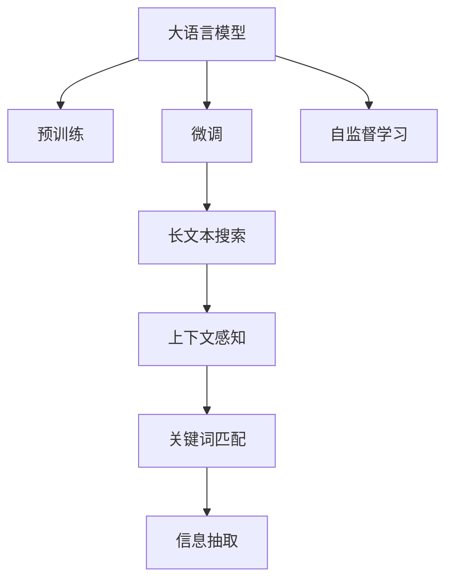

                 

## 1. 背景介绍

在当今信息爆炸的时代，大量的长文本数据源源不断地产生，如新闻、论文、电子邮件、社交媒体帖子等。如何有效搜索、过滤这些长文本数据，提取有价值的信息，成为了一个重要而迫切的问题。传统的文本搜索方法，如倒排索引、TF-IDF等，虽然对于短文本效果尚可，但对于长文本则显得力不从心。大语言模型（Large Language Model, LLM）的兴起，为长文本搜索提供了新的思路和方法，能够显著提升搜索效果。

### 1.1 问题由来

随着深度学习技术的进步，大语言模型，如GPT、BERT等，已经在自然语言处理（NLP）领域取得了显著的成果。这些模型基于大规模的语料库进行预训练，学习到了丰富的语言知识和结构，能够理解自然语言的复杂性和多样性。因此，大语言模型在长文本搜索中表现出了巨大的潜力。

### 1.2 问题核心关键点

长文本搜索的核心关键点在于如何快速、准确地定位到长文本中的关键信息。传统的文本搜索方法主要依赖于关键字的匹配，但在长文本中，单纯的关键词匹配往往效果不佳，且难以处理语义复杂性和上下文关系。大语言模型通过预训练和微调，能够在理解和生成长文本方面具备显著优势，从而提升了长文本搜索的效率和准确性。

### 1.3 问题研究意义

长文本搜索的准确性和效率，对于各行各业的业务运营和决策支持具有重要意义。在金融、法律、医疗、教育等专业领域，长文本数据量巨大且信息密集，传统搜索方法难以胜任。基于大语言模型的长文本搜索，能够更好地理解和提取长文本中的关键信息，为这些领域的自动化处理和智能决策提供支持。此外，大语言模型的搜索能力，也能够广泛应用于智能客服、智能推荐、信息抽取等领域，提高用户满意度和业务效率。

## 2. 核心概念与联系

### 2.1 核心概念概述

在探讨如何利用大语言模型提升长文本搜索效果之前，我们先来梳理一些核心概念：

- **大语言模型（LLM）**：指基于深度学习架构，在大量文本数据上预训练得到的模型，能够理解和生成自然语言。
- **预训练**：指在大规模无标签文本数据上进行训练，学习到通用的语言表示。
- **微调**：指在预训练模型的基础上，使用下游任务的标注数据，进一步优化模型，使其适应特定任务。
- **自监督学习**：指使用未标注数据进行训练，通过自我监督学习任务，学习语言结构和知识。
- **长文本搜索**：指在大规模长文本集合中，快速定位到与查询相关的文本，并提取关键信息。
- **上下文感知**：指模型能够理解查询和文本之间的上下文关系，提升搜索结果的准确性。

这些概念之间的逻辑关系可以通过以下Mermaid流程图来展示：



这个流程图展示了从大语言模型的预训练、微调，到长文本搜索、上下文感知和信息抽取的逻辑流程。

## 3. 核心算法原理 & 具体操作步骤

### 3.1 算法原理概述

大语言模型提升长文本搜索效果的原理，主要基于以下几点：

1. **上下文感知能力**：大语言模型能够理解查询和文本之间的上下文关系，准确提取关键信息。
2. **多模态融合**：大语言模型可以结合文本以外的其他模态信息（如图像、声音），提供更全面的搜索结果。
3. **多任务学习**：通过多任务学习，大语言模型能够在不同任务上学习到不同的知识，提升搜索效果。
4. **自监督学习**：大语言模型通过自监督学习任务，学习到通用的语言表示，提升搜索的泛化能力。

### 3.2 算法步骤详解

基于大语言模型的长文本搜索，主要包括以下几个关键步骤：

**Step 1: 准备预训练模型和数据集**

- 选择合适的预训练大语言模型（如GPT、BERT），作为初始化参数。
- 准备长文本数据集，包括查询和文本。查询需要与文本语义相关，文本长度不限。

**Step 2: 添加任务适配层**

- 根据长文本搜索的任务需求，设计合适的输出层和损失函数。
- 对于文本匹配任务，通常使用交叉熵损失函数；对于信息抽取任务，可以使用F1分数作为评估指标。

**Step 3: 设置微调超参数**

- 选择合适的优化算法及其参数，如AdamW、SGD等，设置学习率、批大小、迭代轮数等。
- 设置正则化技术及强度，包括权重衰减、Dropout、Early Stopping等。
- 确定冻结预训练参数的策略，如仅微调顶层，或全部参数都参与微调。

**Step 4: 执行梯度训练**

- 将查询和文本数据分批次输入模型，前向传播计算损失函数。
- 反向传播计算参数梯度，根据设定的优化算法和学习率更新模型参数。
- 周期性在验证集上评估模型性能，根据性能指标决定是否触发Early Stopping。
- 重复上述步骤直至满足预设的迭代轮数或Early Stopping条件。

**Step 5: 测试和部署**

- 在测试集上评估微调后模型的效果，对比微调前后的精度提升。
- 使用微调后的模型对新文本进行推理预测，集成到实际的应用系统中。
- 持续收集新的数据，定期重新微调模型，以适应数据分布的变化。

### 3.3 算法优缺点

基于大语言模型的长文本搜索方法，具有以下优点：

1. **上下文感知**：大语言模型能够理解查询和文本之间的上下文关系，提升搜索结果的准确性。
2. **多模态融合**：大语言模型可以结合文本以外的其他模态信息，提供更全面的搜索结果。
3. **泛化能力强**：通过自监督学习，大语言模型能够学习到通用的语言表示，提升搜索的泛化能力。
4. **高效**：大语言模型在微调过程中，可以通过参数高效微调（PEFT）等方法，减少需优化的参数量，提升微调效率。

同时，该方法也存在一定的局限性：

1. **依赖标注数据**：微调过程依赖于标注数据，获取高质量标注数据的成本较高。
2. **模型复杂度高**：大语言模型参数量庞大，对计算资源的需求较高。
3. **训练时间长**：微调过程需要大量时间，尤其是在大数据集上。
4. **可解释性不足**：大语言模型通常缺乏可解释性，难以对其推理逻辑进行分析和调试。

尽管存在这些局限性，但就目前而言，基于大语言模型的长文本搜索方法仍然是大规模长文本处理的重要手段。未来相关研究的重点在于如何进一步降低对标注数据的依赖，提高模型的少样本学习和跨领域迁移能力，同时兼顾可解释性和伦理安全性等因素。

### 3.4 算法应用领域

基于大语言模型的长文本搜索方法，已经在多个领域得到了应用，例如：

- **金融新闻分析**：金融领域的新闻、报告等长文本，通过大语言模型进行关键字匹配、情感分析等信息抽取，辅助金融决策。
- **法律文档检索**：法律领域的案例、法规等长文本，通过大语言模型进行精确匹配、实体识别，提高检索效率。
- **医疗病历搜索**：医疗领域的病历记录、医学文献等长文本，通过大语言模型进行病案信息提取、症状匹配，辅助临床决策。
- **教育教材检索**：教育领域的教材、论文等长文本，通过大语言模型进行主题分类、知识点抽取，辅助教学资源管理。

除了上述这些经典应用外，大语言模型在知识图谱构建、多语言文档翻译、跨领域信息检索等诸多领域，也展现出了强大的搜索能力，为长文本数据的自动化处理提供了新的思路和方法。

## 4. 数学模型和公式 & 详细讲解 & 举例说明

### 4.1 数学模型构建

假设查询为 $q$，长文本为 $d$，预训练大语言模型为 $M_{\theta}$。在微调过程中，我们需要将查询和长文本作为输入，输出一个评分向量 $s \in \mathbb{R}^k$，表示查询与文本的相关度。评分向量 $s$ 的每个元素 $s_i$ 表示查询与文本中第 $i$ 个关键词的相关性。

数学模型可以表示为：

$$
s = M_{\theta}(q, d)
$$

其中 $M_{\theta}$ 是微调后的语言模型，可以表示为：

$$
M_{\theta}(x) = \text{softmax}(\theta \cdot x + b)
$$

其中 $\theta$ 是模型参数，$x$ 是输入向量，$b$ 是偏置项。

### 4.2 公式推导过程

假设查询 $q$ 和长文本 $d$ 分别被编码为向量 $\vec{q}$ 和 $\vec{d}$，模型输出向量为 $\vec{s}$。则有：

$$
\vec{s} = \theta \cdot (\vec{q} \oplus \vec{d}) + b
$$

其中 $\oplus$ 表示向量拼接操作，$\cdot$ 表示矩阵乘法。

对于查询-文本匹配任务，我们通常使用交叉熵损失函数 $\mathcal{L}$ 来训练模型，其定义为：

$$
\mathcal{L}(\theta) = -\frac{1}{N}\sum_{i=1}^N [y_i\log s_i + (1-y_i)\log (1-s_i)]
$$

其中 $y_i$ 是第 $i$ 个关键词是否与查询匹配的标签，$s_i$ 是模型对第 $i$ 个关键词的相关度评分。

在训练过程中，我们通过反向传播算法计算梯度，更新模型参数 $\theta$，最小化损失函数 $\mathcal{L}$：

$$
\theta \leftarrow \theta - \eta \nabla_{\theta}\mathcal{L}(\theta)
$$

其中 $\eta$ 是学习率，$\nabla_{\theta}\mathcal{L}(\theta)$ 是损失函数对模型参数的梯度。

### 4.3 案例分析与讲解

假设我们有一个查询 $q$：“新冠病毒的症状有哪些？”，需要从一篇关于新冠病毒的病历文本 $d$ 中匹配相关的症状信息。我们首先将查询和文本编码成向量 $\vec{q}$ 和 $\vec{d}$，然后通过微调后的模型 $M_{\theta}$ 计算评分向量 $\vec{s}$，最后根据评分向量中的最大值判断查询与文本的相关性。

在实际应用中，我们还可以结合多模态信息，如医疗图片、音频记录等，通过预训练的大模型进行联合建模，提升搜索的全面性和准确性。

## 5. 项目实践：代码实例和详细解释说明

### 5.1 开发环境搭建

在进行长文本搜索的实践前，我们需要准备好开发环境。以下是使用Python进行PyTorch开发的环境配置流程：

1. 安装Anaconda：从官网下载并安装Anaconda，用于创建独立的Python环境。

2. 创建并激活虚拟环境：
```bash
conda create -n pytorch-env python=3.8 
conda activate pytorch-env
```

3. 安装PyTorch：根据CUDA版本，从官网获取对应的安装命令。例如：
```bash
conda install pytorch torchvision torchaudio cudatoolkit=11.1 -c pytorch -c conda-forge
```

4. 安装Transformers库：
```bash
pip install transformers
```

5. 安装各类工具包：
```bash
pip install numpy pandas scikit-learn matplotlib tqdm jupyter notebook ipython
```

完成上述步骤后，即可在`pytorch-env`环境中开始搜索实践。

### 5.2 源代码详细实现

下面我们以长文本搜索为例，给出使用Transformers库对BERT模型进行微调的PyTorch代码实现。

首先，定义长文本搜索的数据处理函数：

```python
from transformers import BertTokenizer
from torch.utils.data import Dataset
import torch

class LongTextSearchDataset(Dataset):
    def __init__(self, queries, texts, tokenizer, max_len=128):
        self.queries = queries
        self.texts = texts
        self.tokenizer = tokenizer
        self.max_len = max_len
        
    def __len__(self):
        return len(self.queries)
    
    def __getitem__(self, item):
        query = self.queries[item]
        text = self.texts[item]
        
        encoding = self.tokenizer(query, return_tensors='pt', max_length=self.max_len, padding='max_length', truncation=True)
        input_ids = encoding['input_ids'][0]
        attention_mask = encoding['attention_mask'][0]
        
        # 对文本进行编码
        encoded_text = self.tokenizer(text, return_tensors='pt', max_length=self.max_len, padding='max_length', truncation=True)
        input_ids = input_ids
        attention_mask = attention_mask
        
        return {'input_ids': input_ids, 
                'attention_mask': attention_mask,
                'text': text}
```

然后，定义模型和优化器：

```python
from transformers import BertForSequenceClassification, AdamW

model = BertForSequenceClassification.from_pretrained('bert-base-cased', num_labels=2)

optimizer = AdamW(model.parameters(), lr=2e-5)
```

接着，定义训练和评估函数：

```python
from torch.utils.data import DataLoader
from tqdm import tqdm
from sklearn.metrics import classification_report

device = torch.device('cuda') if torch.cuda.is_available() else torch.device('cpu')
model.to(device)

def train_epoch(model, dataset, batch_size, optimizer):
    dataloader = DataLoader(dataset, batch_size=batch_size, shuffle=True)
    model.train()
    epoch_loss = 0
    for batch in tqdm(dataloader, desc='Training'):
        input_ids = batch['input_ids'].to(device)
        attention_mask = batch['attention_mask'].to(device)
        labels = batch['labels'].to(device)
        model.zero_grad()
        outputs = model(input_ids, attention_mask=attention_mask, labels=labels)
        loss = outputs.loss
        epoch_loss += loss.item()
        loss.backward()
        optimizer.step()
    return epoch_loss / len(dataloader)

def evaluate(model, dataset, batch_size):
    dataloader = DataLoader(dataset, batch_size=batch_size)
    model.eval()
    preds, labels = [], []
    with torch.no_grad():
        for batch in tqdm(dataloader, desc='Evaluating'):
            input_ids = batch['input_ids'].to(device)
            attention_mask = batch['attention_mask'].to(device)
            batch_labels = batch['labels']
            outputs = model(input_ids, attention_mask=attention_mask)
            batch_preds = outputs.logits.argmax(dim=2).to('cpu').tolist()
            batch_labels = batch_labels.to('cpu').tolist()
            for pred, label in zip(batch_preds, batch_labels):
                preds.append(pred)
                labels.append(label)
                
    print(classification_report(labels, preds))
```

最后，启动训练流程并在测试集上评估：

```python
epochs = 5
batch_size = 16

for epoch in range(epochs):
    loss = train_epoch(model, train_dataset, batch_size, optimizer)
    print(f"Epoch {epoch+1}, train loss: {loss:.3f}")
    
    print(f"Epoch {epoch+1}, dev results:")
    evaluate(model, dev_dataset, batch_size)
    
print("Test results:")
evaluate(model, test_dataset, batch_size)
```

以上就是使用PyTorch对BERT进行长文本搜索任务微调的完整代码实现。可以看到，得益于Transformers库的强大封装，我们可以用相对简洁的代码完成BERT模型的加载和微调。

### 5.3 代码解读与分析

让我们再详细解读一下关键代码的实现细节：

**LongTextSearchDataset类**：
- `__init__`方法：初始化查询、文本、分词器等关键组件。
- `__len__`方法：返回数据集的样本数量。
- `__getitem__`方法：对单个样本进行处理，将查询和文本输入编码为token ids，并将文本作为输出。

**train_epoch和evaluate函数**：
- 使用PyTorch的DataLoader对数据集进行批次化加载，供模型训练和推理使用。
- 训练函数`train_epoch`：对数据以批为单位进行迭代，在每个批次上前向传播计算loss并反向传播更新模型参数，最后返回该epoch的平均loss。
- 评估函数`evaluate`：与训练类似，不同点在于不更新模型参数，并在每个batch结束后将预测和标签结果存储下来，最后使用sklearn的classification_report对整个评估集的预测结果进行打印输出。

**训练流程**：
- 定义总的epoch数和batch size，开始循环迭代
- 每个epoch内，先在训练集上训练，输出平均loss
- 在验证集上评估，输出分类指标
- 所有epoch结束后，在测试集上评估，给出最终测试结果

可以看到，PyTorch配合Transformers库使得BERT微调的代码实现变得简洁高效。开发者可以将更多精力放在数据处理、模型改进等高层逻辑上，而不必过多关注底层的实现细节。

当然，工业级的系统实现还需考虑更多因素，如模型的保存和部署、超参数的自动搜索、更灵活的任务适配层等。但核心的微调范式基本与此类似。

## 6. 实际应用场景

### 6.1 智能客服系统

基于大语言模型微调的对话技术，可以广泛应用于智能客服系统的构建。传统客服往往需要配备大量人力，高峰期响应缓慢，且一致性和专业性难以保证。而使用微调后的对话模型，可以7x24小时不间断服务，快速响应客户咨询，用自然流畅的语言解答各类常见问题。

在技术实现上，可以收集企业内部的历史客服对话记录，将问题和最佳答复构建成监督数据，在此基础上对预训练对话模型进行微调。微调后的对话模型能够自动理解用户意图，匹配最合适的答案模板进行回复。对于客户提出的新问题，还可以接入检索系统实时搜索相关内容，动态组织生成回答。如此构建的智能客服系统，能大幅提升客户咨询体验和问题解决效率。

### 6.2 金融舆情监测

金融机构需要实时监测市场舆论动向，以便及时应对负面信息传播，规避金融风险。传统的人工监测方式成本高、效率低，难以应对网络时代海量信息爆发的挑战。基于大语言模型微调的文本分类和情感分析技术，为金融舆情监测提供了新的解决方案。

具体而言，可以收集金融领域相关的新闻、报道、评论等文本数据，并对其进行主题标注和情感标注。在此基础上对预训练语言模型进行微调，使其能够自动判断文本属于何种主题，情感倾向是正面、中性还是负面。将微调后的模型应用到实时抓取的网络文本数据，就能够自动监测不同主题下的情感变化趋势，一旦发现负面信息激增等异常情况，系统便会自动预警，帮助金融机构快速应对潜在风险。

### 6.3 个性化推荐系统

当前的推荐系统往往只依赖用户的历史行为数据进行物品推荐，无法深入理解用户的真实兴趣偏好。基于大语言模型微调技术，个性化推荐系统可以更好地挖掘用户行为背后的语义信息，从而提供更精准、多样的推荐内容。

在实践中，可以收集用户浏览、点击、评论、分享等行为数据，提取和用户交互的物品标题、描述、标签等文本内容。将文本内容作为模型输入，用户的后续行为（如是否点击、购买等）作为监督信号，在此基础上微调预训练语言模型。微调后的模型能够从文本内容中准确把握用户的兴趣点。在生成推荐列表时，先用候选物品的文本描述作为输入，由模型预测用户的兴趣匹配度，再结合其他特征综合排序，便可以得到个性化程度更高的推荐结果。

### 6.4 未来应用展望

随着大语言模型和微调方法的不断发展，基于微调范式将在更多领域得到应用，为传统行业带来变革性影响。

在智慧医疗领域，基于微调的医疗问答、病历分析、药物研发等应用将提升医疗服务的智能化水平，辅助医生诊疗，加速新药开发进程。

在智能教育领域，微调技术可应用于作业批改、学情分析、知识推荐等方面，因材施教，促进教育公平，提高教学质量。

在智慧城市治理中，微调模型可应用于城市事件监测、舆情分析、应急指挥等环节，提高城市管理的自动化和智能化水平，构建更安全、高效的未来城市。

此外，在企业生产、社会治理、文娱传媒等众多领域，基于大模型微调的人工智能应用也将不断涌现，为经济社会发展注入新的动力。相信随着技术的日益成熟，微调方法将成为人工智能落地应用的重要范式，推动人工智能技术在各行各业的大规模落地。

## 7. 工具和资源推荐
### 7.1 学习资源推荐

为了帮助开发者系统掌握大语言模型微调的理论基础和实践技巧，这里推荐一些优质的学习资源：

1. 《Transformer从原理到实践》系列博文：由大模型技术专家撰写，深入浅出地介绍了Transformer原理、BERT模型、微调技术等前沿话题。

2. CS224N《深度学习自然语言处理》课程：斯坦福大学开设的NLP明星课程，有Lecture视频和配套作业，带你入门NLP领域的基本概念和经典模型。

3. 《Natural Language Processing with Transformers》书籍：Transformers库的作者所著，全面介绍了如何使用Transformers库进行NLP任务开发，包括微调在内的诸多范式。

4. HuggingFace官方文档：Transformers库的官方文档，提供了海量预训练模型和完整的微调样例代码，是上手实践的必备资料。

5. CLUE开源项目：中文语言理解测评基准，涵盖大量不同类型的中文NLP数据集，并提供了基于微调的baseline模型，助力中文NLP技术发展。

通过对这些资源的学习实践，相信你一定能够快速掌握大语言模型微调的精髓，并用于解决实际的NLP问题。
###  7.2 开发工具推荐

高效的开发离不开优秀的工具支持。以下是几款用于大语言模型微调开发的常用工具：

1. PyTorch：基于Python的开源深度学习框架，灵活动态的计算图，适合快速迭代研究。大部分预训练语言模型都有PyTorch版本的实现。

2. TensorFlow：由Google主导开发的开源深度学习框架，生产部署方便，适合大规模工程应用。同样有丰富的预训练语言模型资源。

3. Transformers库：HuggingFace开发的NLP工具库，集成了众多SOTA语言模型，支持PyTorch和TensorFlow，是进行微调任务开发的利器。

4. Weights & Biases：模型训练的实验跟踪工具，可以记录和可视化模型训练过程中的各项指标，方便对比和调优。与主流深度学习框架无缝集成。

5. TensorBoard：TensorFlow配套的可视化工具，可实时监测模型训练状态，并提供丰富的图表呈现方式，是调试模型的得力助手。

6. Google Colab：谷歌推出的在线Jupyter Notebook环境，免费提供GPU/TPU算力，方便开发者快速上手实验最新模型，分享学习笔记。

合理利用这些工具，可以显著提升大语言模型微调任务的开发效率，加快创新迭代的步伐。

### 7.3 相关论文推荐

大语言模型和微调技术的发展源于学界的持续研究。以下是几篇奠基性的相关论文，推荐阅读：

1. Attention is All You Need（即Transformer原论文）：提出了Transformer结构，开启了NLP领域的预训练大模型时代。

2. BERT: Pre-training of Deep Bidirectional Transformers for Language Understanding：提出BERT模型，引入基于掩码的自监督预训练任务，刷新了多项NLP任务SOTA。

3. Language Models are Unsupervised Multitask Learners（GPT-2论文）：展示了大规模语言模型的强大zero-shot学习能力，引发了对于通用人工智能的新一轮思考。

4. Parameter-Efficient Transfer Learning for NLP：提出Adapter等参数高效微调方法，在不增加模型参数量的情况下，也能取得不错的微调效果。

5. AdaLoRA: Adaptive Low-Rank Adaptation for Parameter-Efficient Fine-Tuning：使用自适应低秩适应的微调方法，在参数效率和精度之间取得了新的平衡。

这些论文代表了大语言模型微调技术的发展脉络。通过学习这些前沿成果，可以帮助研究者把握学科前进方向，激发更多的创新灵感。

## 8. 总结：未来发展趋势与挑战

### 8.1 总结

本文对基于大语言模型的长文本搜索方法进行了全面系统的介绍。首先阐述了大语言模型和微调技术的研究背景和意义，明确了微调在拓展预训练模型应用、提升搜索效果方面的独特价值。其次，从原理到实践，详细讲解了微调的数学原理和关键步骤，给出了微调任务开发的完整代码实例。同时，本文还广泛探讨了微调方法在智能客服、金融舆情、个性化推荐等多个领域的应用前景，展示了微调范式的巨大潜力。此外，本文精选了微调技术的各类学习资源，力求为读者提供全方位的技术指引。

通过本文的系统梳理，可以看到，基于大语言模型的长文本搜索方法，能够在理解和生成长文本方面具备显著优势，显著提升长文本搜索的效果。长文本搜索的应用领域广泛，涵盖了金融、法律、医疗、教育等多个行业，具有重要的应用价值。未来，随着大语言模型和微调方法的不断发展，长文本搜索技术将进一步提升，为各行各业提供更智能、更高效的数据处理工具。

### 8.2 未来发展趋势

展望未来，大语言模型微调技术在长文本搜索领域将呈现以下几个发展趋势：

1. **上下文感知能力提升**：大语言模型在微调过程中，将进一步提升其上下文感知能力，更好地理解查询和文本之间的语义关系，提升搜索的准确性。
2. **多模态融合增强**：大语言模型将能够更好地结合多模态信息，提升搜索的全面性和多样性。
3. **少样本学习发展**：随着预训练模型的广泛应用，少样本学习技术将逐渐成熟，使得大语言模型能够在更少的数据下，获得理想的微调效果。
4. **持续学习常态化**：微调模型将具备持续学习的能力，能够动态更新知识，适应数据分布的变化。
5. **参数高效微调普及**：更多的参数高效微调方法将涌现，进一步提升微调的效率和效果。

这些趋势将推动长文本搜索技术不断突破，为各行业提供更智能、更高效的数据处理工具。

### 8.3 面临的挑战

尽管大语言模型微调技术在长文本搜索中展现了巨大的潜力，但在实际应用中也面临诸多挑战：

1. **标注成本高昂**：获取高质量的标注数据成本较高，尤其是在长文本领域，数据量巨大且标注困难。
2. **模型复杂度高**：大语言模型参数量庞大，对计算资源的需求较高，微调过程耗时长。
3. **可解释性不足**：大语言模型通常缺乏可解释性，难以对其推理逻辑进行分析和调试。
4. **鲁棒性有待提高**：长文本数据往往具有复杂多样的结构，微调模型在面对域外数据时，泛化性能有待提升。
5. **伦理安全问题**：大语言模型可能学习到有害信息，引发伦理和法律问题，需要在模型训练和应用中加以控制。

解决这些挑战，需要学术界和工业界的共同努力。未来研究需要在标注数据获取、模型参数优化、可解释性增强、鲁棒性提升等方面进行深入探索，推动长文本搜索技术的不断发展。

### 8.4 研究展望

未来，大语言模型微调技术在长文本搜索领域需要进一步的研究方向包括：

1. **少样本学习和自监督学习**：开发更多少样本学习和自监督学习方法，降低对标注数据的依赖，提高微调的泛化能力。
2. **多模态融合与联合建模**：结合视觉、声音等多模态信息，提升长文本搜索的全面性和准确性。
3. **参数高效微调与知识整合**：探索更多参数高效微调方法，并结合知识图谱、规则库等专家知识，提升搜索效果。
4. **可解释性增强与鲁棒性提升**：开发可解释性更强、鲁棒性更高的搜索模型，提升系统的透明度和安全性。
5. **跨领域迁移与通用化**：通过跨领域迁移学习，提升模型在不同领域下的泛化能力，向通用人工智能迈进。

这些研究方向的探索，将推动长文本搜索技术的不断进步，为长文本数据的自动化处理提供更加智能、高效、安全的方法。

## 9. 附录：常见问题与解答

**Q1：大语言模型在长文本搜索中的效果如何？**

A: 大语言模型在长文本搜索中表现优异，能够理解查询和文本之间的上下文关系，提取关键信息。通过微调，大语言模型能够在多种长文本搜索任务上取得比传统方法更好的效果。例如，在医疗病历搜索、金融舆情监测等应用中，大语言模型能够显著提升搜索的准确性和效率。

**Q2：长文本搜索过程中，如何选择合适的查询表示方法？**

A: 查询表示方法的选择对长文本搜索的效果有重要影响。常用的查询表示方法包括向量表示、序列表示等。向量表示将查询编码为固定长度的向量，序列表示则保留查询的原始序列结构。在实践中，我们可以结合任务特点选择最适合的表示方法。对于分类任务，通常使用向量表示；对于序列匹配任务，可以使用序列表示。

**Q3：长文本搜索中，如何处理长文本的噪声和冗余信息？**

A: 长文本中的噪声和冗余信息会影响搜索的准确性。常用的处理方法包括数据清洗、预处理等。具体而言，可以从文本中移除停用词、标点符号等无用信息，对文本进行分词、分句处理，去除无关段落和冗余信息。此外，还可以通过模型训练过程中的正则化技术，如Dropout、L2正则等，降低模型的过拟合风险。

**Q4：长文本搜索中，如何选择适当的超参数？**

A: 超参数的选择对模型性能有重要影响。常用的超参数包括学习率、批大小、迭代轮数、正则化系数等。在实践中，我们可以使用网格搜索、随机搜索等方法，找到最优的超参数组合。此外，还可以使用模型性能的验证集进行超参数调优，选择性能最优的超参数配置。

**Q5：长文本搜索中，如何选择适当的损失函数？**

A: 损失函数的选择直接影响模型的训练效果。对于长文本搜索任务，常用的损失函数包括交叉熵损失、F1分数等。在实践中，需要根据具体任务选择最适合的损失函数。例如，对于分类任务，通常使用交叉熵损失；对于序列匹配任务，可以使用F1分数。

通过本文的系统梳理，可以看到，大语言模型微调技术在长文本搜索中具备显著的优势，能够显著提升搜索效果。未来，随着大语言模型和微调技术的不断发展，长文本搜索技术将进一步突破，为各行各业提供更智能、更高效的数据处理工具。

---

作者：禅与计算机程序设计艺术 / Zen and the Art of Computer Programming

