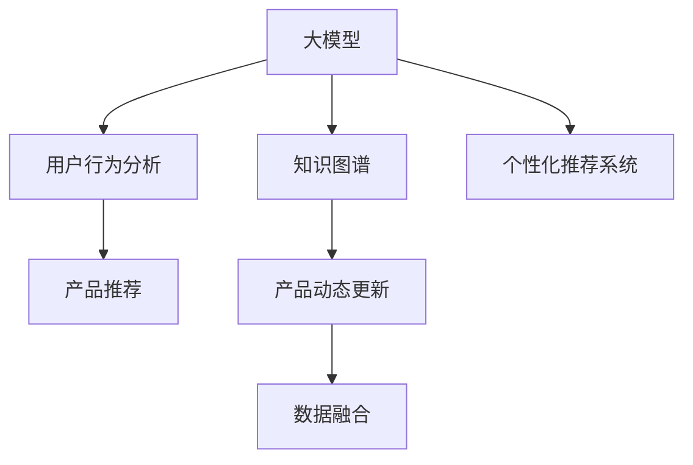

                 

# AI大模型视角下电商搜索推荐的技术创新知识分享机制设计与实现

> 关键词：电商搜索推荐, 大模型, 知识分享, 技术创新, 产品推荐, 用户行为分析, 个性化推荐, 数据融合

## 1. 背景介绍

### 1.1 问题由来

随着电子商务的迅猛发展，电商平台在激烈的市场竞争中不断追求提升用户体验，优化产品推荐系统成为重中之重。传统推荐系统大多基于用户的历史行为数据进行物品推荐，存在一定的局限性。首先，传统的推荐系统无法精准捕捉用户的潜在兴趣和需求，导致推荐结果与用户真实偏好不符。其次，随着用户行为的多样化和个性化加深，传统推荐系统在面对个性化需求时表现出显著的模型拟合不足问题。而通过引入AI大模型，利用其庞大的数据量和强大的学习能力，可以更精准地挖掘用户潜在的兴趣，实现更有效的个性化推荐，从而提升电商平台的竞争力。

### 1.2 问题核心关键点

为了解决上述问题，当前电商搜索推荐技术在AI大模型的驱动下，主要从以下几个方向进行技术创新：

1. **知识图谱融合**：将传统知识图谱与AI大模型相结合，利用知识图谱的逻辑推理能力，提升AI大模型的语义理解水平。
2. **用户行为分析**：利用大模型在自然语言处理领域的优势，分析用户评论、文本等数据，深入挖掘用户潜在需求和偏好。
3. **个性化推荐系统**：在知识图谱和用户行为分析的基础上，结合大模型的学习能力和用户画像，实现更加精准的个性化推荐。
4. **产品动态更新**：利用大模型的学习能力，实时更新和优化推荐模型，保持推荐结果的时效性和准确性。

## 2. 核心概念与联系

### 2.1 核心概念概述

为了更好地理解电商搜索推荐技术，本节将介绍几个密切相关的核心概念：

1. **大模型**：以自回归（如GPT-3）或自编码（如BERT）模型为代表的大规模预训练语言模型。通过在大规模无标签文本语料上进行预训练，学习通用的语言表示，具备强大的语言理解和生成能力。

2. **知识图谱**：通过实体、关系、属性等组成的图形结构，表示现实世界中的知识和信息。常用于增强AI模型的语义理解能力。

3. **用户行为分析**：对用户的历史行为数据进行分析和挖掘，预测用户的未来行为和需求，以提升推荐系统的准确性和个性化程度。

4. **个性化推荐系统**：根据用户的历史行为、兴趣偏好、社会关系等信息，为用户提供个性化的产品推荐，提升用户满意度。

5. **产品推荐**：基于用户画像和行为数据，推荐用户可能感兴趣的产品，是电商搜索推荐系统的核心功能。

6. **数据融合**：将多种来源的数据，如文本、图像、行为等进行整合，提升推荐系统的全面性和准确性。

这些核心概念之间的逻辑关系可以通过以下Mermaid流程图来展示：



这个流程图展示了大模型推荐系统的核心概念及其之间的关系：

1. 大模型通过预训练获得基础能力。
2. 知识图谱增强模型的语义理解。
3. 用户行为分析深入挖掘用户兴趣。
4. 个性化推荐系统实现精准推荐。
5. 产品推荐通过数据分析实现。
6. 产品动态更新提升推荐的时效性。
7. 数据融合提升推荐的全面性。

这些概念共同构成了电商搜索推荐系统的学习框架，使其能够更好地实现个性化推荐。

## 3. 核心算法原理 & 具体操作步骤

### 3.1 算法原理概述

基于大模型的电商搜索推荐系统，本质上是一个多任务的协同学习过程。其核心思想是：将大模型的语言理解和生成能力，与电商平台的商品信息、用户行为等数据进行融合，通过协同学习优化推荐模型，使其能够准确匹配用户需求和产品信息，从而实现个性化推荐。

形式化地，假设电商平台商品集合为 $\mathcal{P}$，用户集合为 $\mathcal{U}$，推荐系统在给定用户 $u$ 的情况下，预测用户购买产品 $p$ 的概率为 $P(p|u)$。则推荐系统的优化目标是最小化预测误差，即找到最优概率模型：

$$
\theta^* = \mathop{\arg\min}_{\theta} \mathcal{L}(P_{\theta}(u), \hat{P}(u))
$$

其中 $\mathcal{L}$ 为预测误差损失函数，$\hat{P}(u)$ 为真实购买概率，$P_{\theta}(u)$ 为模型预测的概率。

通过梯度下降等优化算法，推荐系统不断更新模型参数 $\theta$，最小化预测误差损失函数，使得模型输出逼近真实购买概率。由于大模型已经通过预训练获得了较强的语义理解能力，因此即便在数据量较小的场景下，也能快速收敛到理想的推荐模型参数 $\theta^*$。

### 3.2 算法步骤详解

基于大模型的电商搜索推荐系统一般包括以下几个关键步骤：

**Step 1: 准备预训练模型和数据集**
- 选择合适的预训练语言模型 $M_{\theta}$ 作为初始化参数，如 GPT-3、BERT 等。
- 准备电商平台的商品数据集 $D_{\text{item}}$，包含商品ID、名称、描述、价格、类别等属性。
- 准备用户行为数据集 $D_{\text{user}}$，包含用户ID、浏览历史、购买历史、评分、评论等。

**Step 2: 添加任务适配层**
- 根据电商平台的需求，设计任务适配层，将商品数据和用户数据输入大模型，生成推荐向量。
- 设计交叉熵损失函数，用于衡量推荐模型预测结果与真实购买行为之间的差异。
- 添加正则化技术，如 L2 正则、Dropout、Early Stopping 等，防止模型过度适应小规模训练集。

**Step 3: 设置微调超参数**
- 选择合适的优化算法及其参数，如 Adam、SGD 等，设置学习率、批大小、迭代轮数等。
- 确定冻结预训练参数的策略，如仅微调顶层，或全部参数都参与微调。
- 定义模型评估指标，如准确率、召回率、F1 值等，评估模型性能。

**Step 4: 执行梯度训练**
- 将训练集数据分批次输入模型，前向传播计算损失函数。
- 反向传播计算参数梯度，根据设定的优化算法和学习率更新模型参数。
- 周期性在验证集上评估模型性能，根据性能指标决定是否触发 Early Stopping。
- 重复上述步骤直到满足预设的迭代轮数或 Early Stopping 条件。

**Step 5: 测试和部署**
- 在测试集上评估微调后模型 $M_{\hat{\theta}}$ 的性能，对比微调前后的精度提升。
- 使用微调后的模型对新商品进行推荐，集成到实际的应用系统中。
- 持续收集新的数据，定期重新微调模型，以适应数据分布的变化。

以上是基于大模型电商推荐系统的完整流程。在实际应用中，还需要根据具体电商平台的业务需求，对微调过程的各个环节进行优化设计，如改进训练目标函数，引入更多的正则化技术，搜索最优的超参数组合等，以进一步提升模型性能。

### 3.3 算法优缺点

基于大模型的电商搜索推荐系统具有以下优点：
1. 提升推荐准确性：通过大模型的学习能力，能够深入挖掘用户行为背后的语义信息，从而提升推荐系统的准确性。
2. 增强推荐全面性：融合多模态数据，如商品图片、用户评论、社交网络信息等，实现更全面的推荐。
3. 动态更新推荐结果：通过实时更新模型参数，保持推荐结果的时效性和准确性。
4. 提升用户满意度：个性化推荐能够满足用户的多样化需求，提升用户购物体验和满意度。
5. 降低推荐成本：减少对人工干预的需求，自动化推荐系统的建设，降低推荐成本。

同时，该方法也存在一定的局限性：
1. 数据质量要求高：推荐系统的效果很大程度上取决于输入数据的质量和数量，数据采集和处理成本较高。
2. 模型复杂度高：大模型参数量巨大，训练和推理成本高，需要高效的硬件支持。
3. 泛化能力有限：当数据分布与预训练数据差异较大时，推荐系统的效果可能不佳。
4. 可解释性不足：大模型作为黑盒模型，其内部决策过程难以解释，不利于模型调试和优化。
5. 依赖标注数据：推荐系统的训练需要大量的标注数据，而这些数据的获取和处理成本较高。

尽管存在这些局限性，但就目前而言，基于大模型的电商搜索推荐系统仍然是大数据时代推荐技术的主流范式。未来相关研究的重点在于如何进一步降低数据采集和处理的成本，提高模型的泛化能力和可解释性，同时兼顾推荐系统的效率和效果。

### 3.4 算法应用领域

基于大模型的电商搜索推荐技术，在电商平台的实际应用中，已经被广泛应用于以下几个领域：

1. **商品推荐**：根据用户的历史购买行为、浏览记录、评分、评论等，为用户推荐可能感兴趣的商品。
2. **个性化营销**：利用大模型对用户行为进行深入分析，制定个性化的营销策略，提升用户粘性和购买率。
3. **搜索优化**：通过大模型对用户查询进行理解，提升搜索结果的相关性和个性化程度，提升用户体验。
4. **新商品推荐**：根据用户的行为数据，推荐用户可能感兴趣的新商品，加速商品迭代和创新。
5. **社交电商**：利用大模型对用户社交行为进行分析，推荐用户感兴趣的商品和内容，促进社交分享和推荐。

除了上述这些经典应用外，大模型推荐技术还被创新性地应用到更多场景中，如推荐系统公平性优化、推荐系统对抗性攻击防御等，为电商平台的推荐技术带来了全新的突破。随着大模型和推荐技术的不断进步，相信电商平台的推荐系统将更具个性化和智能化，为电商用户的购物体验带来新的提升。

## 4. 数学模型和公式 & 详细讲解 & 举例说明

### 4.1 数学模型构建

本节将使用数学语言对基于大模型的电商搜索推荐系统进行更加严格的刻画。

记电商平台商品集合为 $\mathcal{P}$，用户集合为 $\mathcal{U}$，推荐系统在给定用户 $u$ 的情况下，预测用户购买产品 $p$ 的概率为 $P(p|u)$。假设用户行为数据集为 $D_{\text{user}}=\{(x_i, y_i)\}_{i=1}^N, x_i \in \mathcal{X}, y_i \in \{0, 1\}$，其中 $y_i=1$ 表示用户购买了商品 $x_i$。

定义推荐系统在数据样本 $(x,y)$ 上的损失函数为 $\ell(P_{\theta}(x),y)$，则在数据集 $D$ 上的经验风险为：

$$
\mathcal{L}(\theta) = \frac{1}{N} \sum_{i=1}^N \ell(P_{\theta}(x_i),y_i)
$$

其中 $\mathcal{X}$ 为用户行为数据空间，$\{0, 1\}$ 为标签空间，$\theta$ 为模型参数。常见的损失函数包括交叉熵损失、均方误差损失等。

通过梯度下降等优化算法，推荐系统不断更新模型参数 $\theta$，最小化损失函数 $\mathcal{L}$，使得模型输出逼近真实标签。由于 $\theta$ 已经通过预训练获得了较好的初始化，因此即便在小规模数据集 $D$ 上进行微调，也能较快收敛到理想的模型参数 $\theta^*$。

### 4.2 公式推导过程

以下我们以商品推荐为例，推导交叉熵损失函数及其梯度的计算公式。

假设推荐系统 $P_{\theta}(u)$ 在用户 $u$ 上的输出为 $\hat{y}=M_{\theta}(u) \in [0,1]$，表示商品 $u$ 被购买的概率。真实标签 $y \in \{0,1\}$。则交叉熵损失函数定义为：

$$
\ell(P_{\theta}(u),y) = -[y\log \hat{y} + (1-y)\log (1-\hat{y})]
$$

将其代入经验风险公式，得：

$$
\mathcal{L}(\theta) = -\frac{1}{N}\sum_{i=1}^N [y_i\log P_{\theta}(x_i)+(1-y_i)\log(1-P_{\theta}(x_i))]
$$

根据链式法则，损失函数对参数 $\theta_k$ 的梯度为：

$$
\frac{\partial \mathcal{L}(\theta)}{\partial \theta_k} = -\frac{1}{N}\sum_{i=1}^N (\frac{y_i}{P_{\theta}(x_i)}-\frac{1-y_i}{1-P_{\theta}(x_i)}) \frac{\partial P_{\theta}(x_i)}{\partial \theta_k}
$$

其中 $\frac{\partial P_{\theta}(x_i)}{\partial \theta_k}$ 可进一步递归展开，利用自动微分技术完成计算。

在得到损失函数的梯度后，即可带入参数更新公式，完成模型的迭代优化。重复上述过程直至收敛，最终得到适应电商平台推荐任务的最优模型参数 $\theta^*$。

## 5. 项目实践：代码实例和详细解释说明

### 5.1 开发环境搭建

在进行推荐系统微调实践前，我们需要准备好开发环境。以下是使用Python进行PyTorch开发的环境配置流程：

1. 安装Anaconda：从官网下载并安装Anaconda，用于创建独立的Python环境。

2. 创建并激活虚拟环境：
```bash
conda create -n pytorch-env python=3.8 
conda activate pytorch-env
```

3. 安装PyTorch：根据CUDA版本，从官网获取对应的安装命令。例如：
```bash
conda install pytorch torchvision torchaudio cudatoolkit=11.1 -c pytorch -c conda-forge
```

4. 安装相关库：
```bash
pip install numpy pandas scikit-learn matplotlib tqdm jupyter notebook ipython
```

完成上述步骤后，即可在`pytorch-env`环境中开始推荐系统微调实践。

### 5.2 源代码详细实现

下面我们以商品推荐为例，给出使用PyTorch对推荐系统进行微调的PyTorch代码实现。

首先，定义推荐系统数据处理函数：

```python
from transformers import BertTokenizer
from torch.utils.data import Dataset
import torch

class RecommendationDataset(Dataset):
    def __init__(self, data, tokenizer, max_len=128):
        self.data = data
        self.tokenizer = tokenizer
        self.max_len = max_len
        
    def __len__(self):
        return len(self.data)
    
    def __getitem__(self, item):
        query = self.data[item]['query']
        target = self.data[item]['target']
        
        encoding = self.tokenizer(query, return_tensors='pt', max_length=self.max_len, padding='max_length', truncation=True)
        input_ids = encoding['input_ids'][0]
        attention_mask = encoding['attention_mask'][0]
        
        target_ids = [int(target)] * self.max_len
        labels = torch.tensor(target_ids, dtype=torch.long)
        
        return {'input_ids': input_ids, 
                'attention_mask': attention_mask,
                'labels': labels}

# 加载预训练模型和分词器
tokenizer = BertTokenizer.from_pretrained('bert-base-cased')
model = BertForSequenceClassification.from_pretrained('bert-base-cased', num_labels=2)
```

然后，定义优化器和训练参数：

```python
from transformers import AdamW

optimizer = AdamW(model.parameters(), lr=2e-5)
```

接着，定义训练和评估函数：

```python
from torch.utils.data import DataLoader
from tqdm import tqdm
from sklearn.metrics import classification_report

device = torch.device('cuda') if torch.cuda.is_available() else torch.device('cpu')
model.to(device)

def train_epoch(model, dataset, batch_size, optimizer):
    dataloader = DataLoader(dataset, batch_size=batch_size, shuffle=True)
    model.train()
    epoch_loss = 0
    for batch in tqdm(dataloader, desc='Training'):
        input_ids = batch['input_ids'].to(device)
        attention_mask = batch['attention_mask'].to(device)
        labels = batch['labels'].to(device)
        model.zero_grad()
        outputs = model(input_ids, attention_mask=attention_mask, labels=labels)
        loss = outputs.loss
        epoch_loss += loss.item()
        loss.backward()
        optimizer.step()
    return epoch_loss / len(dataloader)

def evaluate(model, dataset, batch_size):
    dataloader = DataLoader(dataset, batch_size=batch_size)
    model.eval()
    preds, labels = [], []
    with torch.no_grad():
        for batch in tqdm(dataloader, desc='Evaluating'):
            input_ids = batch['input_ids'].to(device)
            attention_mask = batch['attention_mask'].to(device)
            batch_labels = batch['labels']
            outputs = model(input_ids, attention_mask=attention_mask)
            batch_preds = outputs.logits.argmax(dim=2).to('cpu').tolist()
            batch_labels = batch_labels.to('cpu').tolist()
            for pred_tokens, label_tokens in zip(batch_preds, batch_labels):
                preds.append(pred_tokens[:len(label_tokens)])
                labels.append(label_tokens)
                
    print(classification_report(labels, preds))
```

最后，启动训练流程并在测试集上评估：

```python
epochs = 5
batch_size = 16

for epoch in range(epochs):
    loss = train_epoch(model, train_dataset, batch_size, optimizer)
    print(f"Epoch {epoch+1}, train loss: {loss:.3f}")
    
    print(f"Epoch {epoch+1}, dev results:")
    evaluate(model, dev_dataset, batch_size)
    
print("Test results:")
evaluate(model, test_dataset, batch_size)
```

以上就是使用PyTorch对推荐系统进行商品推荐任务微调的完整代码实现。可以看到，得益于Transformers库的强大封装，我们可以用相对简洁的代码完成推荐系统的加载和微调。

### 5.3 代码解读与分析

让我们再详细解读一下关键代码的实现细节：

**RecommendationDataset类**：
- `__init__`方法：初始化查询和目标数据，并进行token编码。
- `__len__`方法：返回数据集的样本数量。
- `__getitem__`方法：对单个样本进行处理，将查询输入编码为token ids，同时将目标标签转换为数字，并进行定长padding，最终返回模型所需的输入。

**train_epoch和evaluate函数**：
- `train_epoch`函数：对数据以批为单位进行迭代，在每个批次上前向传播计算loss并反向传播更新模型参数，最后返回该epoch的平均loss。
- `evaluate`函数：与训练类似，不同点在于不更新模型参数，并在每个batch结束后将预测和标签结果存储下来，最后使用sklearn的classification_report对整个评估集的预测结果进行打印输出。

**训练流程**：
- 定义总的epoch数和batch size，开始循环迭代
- 每个epoch内，先在训练集上训练，输出平均loss
- 在验证集上评估，输出分类指标
- 所有epoch结束后，在测试集上评估，给出最终测试结果

可以看到，PyTorch配合Transformers库使得推荐系统的微调代码实现变得简洁高效。开发者可以将更多精力放在数据处理、模型改进等高层逻辑上，而不必过多关注底层的实现细节。

当然，工业级的系统实现还需考虑更多因素，如模型的保存和部署、超参数的自动搜索、更灵活的任务适配层等。但核心的微调范式基本与此类似。

## 6. 实际应用场景

### 6.1 智能客服系统

基于大模型推荐系统的智能客服系统，可以广泛应用于电商平台的客户服务中。传统的客服系统需要配备大量人力，高峰期响应缓慢，且一致性和专业性难以保证。而使用推荐系统构建的智能客服系统，可以7x24小时不间断服务，快速响应客户咨询，用自然流畅的语言解答各类常见问题。

在技术实现上，可以收集企业内部的历史客服对话记录，将问题和最佳答复构建成监督数据，在此基础上对预训练推荐系统进行微调。微调后的推荐系统能够自动理解用户意图，匹配最合适的答复模板进行回复。对于客户提出的新问题，还可以接入检索系统实时搜索相关内容，动态组织生成回答。如此构建的智能客服系统，能大幅提升客户咨询体验和问题解决效率。

### 6.2 金融舆情监测

金融机构需要实时监测市场舆论动向，以便及时应对负面信息传播，规避金融风险。传统的人工监测方式成本高、效率低，难以应对网络时代海量信息爆发的挑战。基于大模型推荐系统的文本分类和情感分析技术，为金融舆情监测提供了新的解决方案。

具体而言，可以收集金融领域相关的新闻、报道、评论等文本数据，并对其进行主题标注和情感标注。在此基础上对预训练推荐系统进行微调，使其能够自动判断文本属于何种主题，情感倾向是正面、中性还是负面。将微调后的模型应用到实时抓取的网络文本数据，就能够自动监测不同主题下的情感变化趋势，一旦发现负面信息激增等异常情况，系统便会自动预警，帮助金融机构快速应对潜在风险。

### 6.3 个性化推荐系统

当前的推荐系统往往只依赖用户的历史行为数据进行物品推荐，无法深入理解用户的真实兴趣偏好。基于大模型推荐系统的个性化推荐系统，可以更好地挖掘用户潜在兴趣，实现更有效的个性化推荐。

在实践中，可以收集用户浏览、点击、评论、分享等行为数据，提取和商品交互的物品标题、描述、标签等文本内容。将文本内容作为模型输入，用户的后续行为（如是否点击、购买等）作为监督信号，在此基础上微调预训练推荐系统。微调后的推荐系统能够从文本内容中准确把握用户的兴趣点。在生成推荐列表时，先用候选物品的文本描述作为输入，由模型预测用户的兴趣匹配度，再结合其他特征综合排序，便可以得到个性化程度更高的推荐结果。

### 6.4 未来应用展望

随着大模型推荐技术和电商搜索推荐系统的不断发展，未来的推荐系统将在更多领域得到应用，为传统行业带来变革性影响。

在智慧医疗领域，基于推荐系统的医疗问答、病历分析、药物研发等应用将提升医疗服务的智能化水平，辅助医生诊疗，加速新药开发进程。

在智能教育领域，推荐系统可应用于作业批改、学情分析、知识推荐等方面，因材施教，促进教育公平，提高教学质量。

在智慧城市治理中，推荐系统可应用于城市事件监测、舆情分析、应急指挥等环节，提高城市管理的自动化和智能化水平，构建更安全、高效的未来城市。

此外，在企业生产、社会治理、文娱传媒等众多领域，基于大模型推荐系统的智能推荐系统也将不断涌现，为经济社会发展注入新的动力。相信随着技术的日益成熟，推荐系统必将在更广阔的应用领域大放异彩，深刻影响人类的生产生活方式。

## 7. 工具和资源推荐
### 7.1 学习资源推荐

为了帮助开发者系统掌握大模型推荐系统的理论基础和实践技巧，这里推荐一些优质的学习资源：

1. 《Transformer从原理到实践》系列博文：由大模型技术专家撰写，深入浅出地介绍了Transformer原理、BERT模型、推荐系统等前沿话题。

2. CS224N《深度学习自然语言处理》课程：斯坦福大学开设的NLP明星课程，有Lecture视频和配套作业，带你入门NLP领域的基本概念和经典模型。

3. 《Natural Language Processing with Transformers》书籍：Transformers库的作者所著，全面介绍了如何使用Transformers库进行NLP任务开发，包括推荐系统的微调在内的诸多范式。

4. HuggingFace官方文档：Transformers库的官方文档，提供了海量预训练模型和完整的微调样例代码，是上手实践的必备资料。

5. Kaggle竞赛：参与推荐系统相关的Kaggle竞赛，积累推荐系统开发的实战经验，提升解决实际问题能力。

通过对这些资源的学习实践，相信你一定能够快速掌握大模型推荐系统的精髓，并用于解决实际的NLP问题。
###  7.2 开发工具推荐

高效的开发离不开优秀的工具支持。以下是几款用于大模型推荐系统微调开发的常用工具：

1. PyTorch：基于Python的开源深度学习框架，灵活动态的计算图，适合快速迭代研究。大部分预训练语言模型都有PyTorch版本的实现。

2. TensorFlow：由Google主导开发的开源深度学习框架，生产部署方便，适合大规模工程应用。同样有丰富的预训练语言模型资源。

3. Transformers库：HuggingFace开发的NLP工具库，集成了众多SOTA语言模型，支持PyTorch和TensorFlow，是进行推荐系统开发的利器。

4. Weights & Biases：模型训练的实验跟踪工具，可以记录和可视化模型训练过程中的各项指标，方便对比和调优。与主流深度学习框架无缝集成。

5. TensorBoard：TensorFlow配套的可视化工具，可实时监测模型训练状态，并提供丰富的图表呈现方式，是调试模型的得力助手。

6. Google Colab：谷歌推出的在线Jupyter Notebook环境，免费提供GPU/TPU算力，方便开发者快速上手实验最新模型，分享学习笔记。

合理利用这些工具，可以显著提升大模型推荐系统的开发效率，加快创新迭代的步伐。

### 7.3 相关论文推荐

大模型推荐技术的发展源于学界的持续研究。以下是几篇奠基性的相关论文，推荐阅读：

1. Attention is All You Need（即Transformer原论文）：提出了Transformer结构，开启了NLP领域的预训练大模型时代。

2. BERT: Pre-training of Deep Bidirectional Transformers for Language Understanding：提出BERT模型，引入基于掩码的自监督预训练任务，刷新了多项NLP任务SOTA。

3. Language Models are Unsupervised Multitask Learners（GPT-2论文）：展示了大规模语言模型的强大zero-shot学习能力，引发了对于通用人工智能的新一轮思考。

4. Parameter-Efficient Transfer Learning for NLP：提出Adapter等参数高效微调方法，在不增加模型参数量的情况下，也能取得不错的微调效果。

5. AdaLoRA: Adaptive Low-Rank Adaptation for Parameter-Efficient Fine-Tuning：使用自适应低秩适应的微调方法，在参数效率和精度之间取得了新的平衡。

6. Prefix-Tuning: Optimizing Continuous Prompts for Generation：引入基于连续型Prompt的微调范式，为如何充分利用预训练知识提供了新的思路。

这些论文代表了大模型推荐技术的发展脉络。通过学习这些前沿成果，可以帮助研究者把握学科前进方向，激发更多的创新灵感。

## 8. 总结：未来发展趋势与挑战

### 8.1 总结

本文对基于大模型的电商搜索推荐技术进行了全面系统的介绍。首先阐述了电商搜索推荐技术的研究背景和意义，明确了推荐系统在大模型驱动下的技术创新方向。其次，从原理到实践，详细讲解了基于大模型的电商推荐系统数学模型和关键步骤，给出了推荐系统微调的完整代码实现。同时，本文还广泛探讨了推荐系统在智能客服、金融舆情、个性化推荐等多个领域的应用前景，展示了推荐系统的巨大潜力。此外，本文精选了推荐系统的各类学习资源，力求为读者提供全方位的技术指引。

通过本文的系统梳理，可以看到，基于大模型的电商搜索推荐系统在大数据时代推荐技术的主流范式。其强大的学习能力使得推荐系统能够深入挖掘用户兴趣，实现精准推荐，极大地提升了电商平台的竞争力。未来，伴随大模型推荐技术的持续演进，推荐系统将在更多领域得到应用，为传统行业带来变革性影响。

### 8.2 未来发展趋势

展望未来，大模型推荐技术将呈现以下几个发展趋势：

1. **模型规模持续增大**：随着算力成本的下降和数据规模的扩张，预训练语言模型的参数量还将持续增长。超大规模语言模型蕴含的丰富语言知识，有望支撑更加复杂多变的推荐任务。

2. **推荐方法日趋多样**：除了传统的全参数微调外，未来会涌现更多参数高效的微调方法，如Prefix-Tuning、LoRA等，在节省计算资源的同时也能保证推荐精度。

3. **持续学习成为常态**：随着数据分布的不断变化，推荐系统也需要持续学习新知识以保持性能。如何在不遗忘原有知识的同时，高效吸收新样本信息，将成为重要的研究课题。

4. **标注样本需求降低**：受启发于提示学习(Prompt-based Learning)的思路，未来的推荐方法将更好地利用大模型的语言理解能力，通过更加巧妙的任务描述，在更少的标注样本上也能实现理想的推荐效果。

5. **多模态推荐崛起**：当前的推荐主要聚焦于纯文本数据，未来会进一步拓展到图像、视频、语音等多模态数据推荐。多模态信息的融合，将显著提升推荐系统的全面性和准确性。

6. **推荐系统公平性优化**：推荐系统面临的公平性问题，如何通过算法和数据处理手段，减少推荐系统的偏见，实现公平推荐，将是未来的重要研究方向。

以上趋势凸显了大模型推荐技术的广阔前景。这些方向的探索发展，必将进一步提升推荐系统的性能和应用范围，为电商平台的推荐技术带来新的突破。

### 8.3 面临的挑战

尽管大模型推荐技术已经取得了瞩目成就，但在迈向更加智能化、普适化应用的过程中，它仍面临着诸多挑战：

1. **数据质量要求高**：推荐系统的效果很大程度上取决于输入数据的质量和数量，数据采集和处理成本较高。如何构建高质量的数据集，提升数据清洗和预处理的效率，将是一大难题。

2. **模型鲁棒性不足**：当前推荐系统面对域外数据时，泛化性能往往大打折扣。对于测试样本的微小扰动，推荐模型的预测也容易发生波动。如何提高推荐模型的鲁棒性，避免灾难性遗忘，还需要更多理论和实践的积累。

3. **推理效率有待提高**：大规模语言模型虽然精度高，但在实际部署时往往面临推理速度慢、内存占用大等效率问题。如何在保证性能的同时，简化模型结构，提升推理速度，优化资源占用，将是重要的优化方向。

4. **可解释性亟需加强**：当前推荐模型作为黑盒模型，其内部决策过程难以解释，不利于模型调试和优化。如何赋予推荐模型更强的可解释性，将是亟待攻克的难题。

5. **安全性有待保障**：预训练语言模型难免会学习到有偏见、有害的信息，通过推荐系统传递到用户端，产生误导性、歧视性的输出，给实际应用带来安全隐患。如何从数据和算法层面消除推荐系统的偏见，避免恶意用途，确保推荐系统的安全性，也将是重要的研究课题。

6. **知识整合能力不足**：现有的推荐模型往往局限于任务内数据，难以灵活吸收和运用更广泛的先验知识。如何让推荐过程更好地与外部知识库、规则库等专家知识结合，形成更加全面、准确的信息整合能力，还有很大的想象空间。

正视推荐系统面临的这些挑战，积极应对并寻求突破，将是大模型推荐技术走向成熟的必由之路。相信随着学界和产业界的共同努力，这些挑战终将一一被克服，大模型推荐技术必将在构建人机协同的智能推荐系统中扮演越来越重要的角色。

### 8.4 未来突破

面对大模型推荐系统所面临的种种挑战，未来的研究需要在以下几个方面寻求新的突破：

1. **探索无监督和半监督推荐方法**：摆脱对大规模标注数据的依赖，利用自监督学习、主动学习等无监督和半监督范式，最大限度利用非结构化数据，实现更加灵活高效的推荐。

2. **研究参数高效和计算高效的推荐范式**：开发更加参数高效的推荐方法，在固定大部分预训练参数的同时，只更新极少量的任务相关参数。同时优化推荐模型的计算图，减少前向传播和反向传播的资源消耗，实现更加轻量级、实时性的部署。

3. **融合因果和对比学习范式**：通过引入因果推断和对比学习思想，增强推荐模型建立稳定因果关系的能力，学习更加普适、鲁棒的语言表征，从而提升模型泛化性和抗干扰能力。

4. **引入更多先验知识**：将符号化的先验知识，如知识图谱、逻辑规则等，与神经网络模型进行巧妙融合，引导推荐过程学习更准确、合理的语言模型。同时加强不同模态数据的整合，实现视觉、语音等多模态信息与文本信息的协同建模。

5. **结合因果分析和博弈论工具**：将因果分析方法引入推荐模型，识别出推荐模型决策的关键特征，增强推荐结果的因果性和逻辑性。借助博弈论工具刻画人机交互过程，主动探索并规避推荐系统的脆弱点，提高系统稳定性。

6. **纳入伦理道德约束**：在推荐模型训练目标中引入伦理导向的评估指标，过滤和惩罚有偏见、有害的输出倾向。同时加强人工干预和审核，建立推荐系统的监管机制，确保推荐结果符合人类价值观和伦理道德。

这些研究方向的探索，必将引领大模型推荐技术迈向更高的台阶，为构建安全、可靠、可解释、可控的智能推荐系统铺平道路。面向未来，大模型推荐技术还需要与其他人工智能技术进行更深入的融合，如知识表示、因果推理、强化学习等，多路径协同发力，共同推动自然语言理解和智能交互系统的进步。只有勇于创新、敢于突破，才能不断拓展推荐系统的边界，让智能技术更好地造福人类社会。

## 9. 附录：常见问题与解答

**Q1：大模型推荐系统是否适用于所有推荐任务？**

A: 大模型推荐系统在大多数推荐任务上都能取得不错的效果，特别是对于数据量较小的任务。但对于一些特定领域的任务，如医学、法律等，仅仅依靠通用语料预训练的模型可能难以很好地适应。此时需要在特定领域语料上进一步预训练，再进行微调，才能获得理想效果。此外，对于一些需要时效性、个性化很强的任务，如对话、推荐等，推荐方法也需要针对性的改进优化。

**Q2：推荐系统如何降低标注数据的需求？**

A: 推荐系统可以利用无监督学习、半监督学习等方法，尽量减少对标注数据的依赖。例如，通过用户行为数据和文本数据，利用自监督学习任务，如文本预测、用户行为预测等，训练推荐系统。此外，可以引入对抗样本训练、主动学习等技术，提升推荐系统的泛化能力，减少标注数据的需求。

**Q3：推荐系统如何提高模型的鲁棒性？**

A: 推荐系统可以通过引入对抗训练、多模态融合、知识图谱增强等技术，提高模型的鲁棒性。对抗训练可以增强推荐系统的鲁棒性和泛化能力，多模态融合可以丰富推荐系统的信息来源，知识图谱增强可以提高推荐系统的语义理解能力。这些技术可以相互结合，进一步提升推荐系统的鲁棒性。

**Q4：推荐系统如何提高推理效率？**

A: 推荐系统可以通过参数高效微调、模型压缩、模型剪枝等技术，提高推理效率。参数高效微调可以减少模型的参数量，降低计算成本。模型压缩和剪枝可以去除冗余参数和冗余结构，提高模型的推理速度。此外，可以利用分布式训练、GPU/TPU加速等技术，提升推荐系统的计算效率。

**Q5：推荐系统如何增强可解释性？**

A: 推荐系统可以利用可解释性技术，如特征重要性分析、模型可视化等，提高模型的可解释性。特征重要性分析可以解释模型中各个特征对推荐结果的影响，模型可视化可以展示模型的内部决策过程。此外，可以引入因果分析、博弈论等方法，从逻辑和因果角度解释推荐模型的行为，增强可解释性。

这些问题的解答，展示了推荐系统在大规模应用中面临的挑战和应对策略。通过不断优化和改进推荐系统，可以更好地应对实际应用中的各种问题，提升推荐系统的性能和应用价值。

