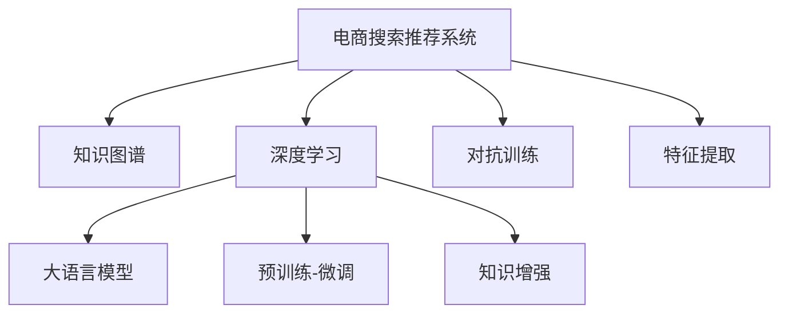

                 

# AI大模型视角下电商搜索推荐的技术创新知识图谱构建方法改进与优化

## 1. 背景介绍

随着电子商务的飞速发展，电商平台搜索推荐系统（Search & Recommendation System, SRS）已成为用户体验和交易转化率的重要保障。传统的基于协同过滤和关键词匹配的推荐系统，难以应对长尾商品和冷启动问题，无法满足用户日益多样化和个性化的需求。而基于深度学习和知识图谱的推荐系统，通过融合语义信息，挖掘商品之间的隐性关系，能够提供更加精准和个性化的推荐结果，成为新一代推荐引擎的探索方向。

近年来，大语言模型在自然语言处理领域取得了显著突破，其强大的语言理解和生成能力，使其成为构建知识图谱的重要工具。结合大语言模型的预训练和微调技术，可以自动构建和更新知识图谱，为电商搜索推荐系统注入新的活力。本文旨在深入探讨AI大模型视角下，电商搜索推荐系统知识图谱构建方法及其改进优化，以期为该领域的实际应用提供参考和借鉴。

## 2. 核心概念与联系

### 2.1 核心概念概述

为更好地理解AI大模型在电商搜索推荐系统中的应用，本节将介绍几个关键概念：

- 电商搜索推荐系统（Search & Recommendation System, SRS）：通过分析用户查询和行为数据，推荐相关商品和服务的系统。SRS旨在提升用户体验，增加交易转化率，促进电商平台的收入。

- 知识图谱（Knowledge Graph）：结构化的语义知识库，通过节点（实体）和边（关系）表示实体间的关系，便于查询和推理。

- 深度学习（Deep Learning）：通过多层神经网络结构，自动学习数据中的隐含规律，实现对复杂问题的建模和预测。

- 大语言模型（Large Language Model, LLM）：基于深度学习的预训练模型，通过海量的无标签文本数据训练，具备强大的语言理解和生成能力。

- 知识增强（Knowledge-Enhanced）：将结构化的知识图谱与神经网络模型相结合，利用知识图谱的语义信息提升模型的预测能力。

- 预训练-微调（Pre-training & Fine-tuning）：使用大规模无标签数据进行预训练，再针对特定任务进行有标签数据上的微调，提升模型性能。

- 对抗训练（Adversarial Training）：通过引入对抗样本，增强模型鲁棒性，提升模型泛化能力。

- 特征提取（Feature Extraction）：从原始数据中提取出有意义的特征，供模型学习。

这些核心概念之间的逻辑关系可以通过以下Mermaid流程图来展示：



这个流程图展示了大语言模型在电商搜索推荐系统中的应用核心概念及其关系：

1. 电商搜索推荐系统通过深度学习模型进行预测。
2. 大语言模型为知识图谱构建提供了语义信息。
3. 知识图谱增强了模型的预测能力。
4. 预训练-微调提高了模型的初始化参数质量。
5. 对抗训练提升了模型的鲁棒性。
6. 特征提取则从原始数据中提取有意义的特征。

这些概念共同构成了电商搜索推荐系统知识图谱构建的框架，使其能够更好地理解和推荐商品。

## 3. 核心算法原理 & 具体操作步骤

### 3.1 算法原理概述

基于深度学习的大语言模型在电商搜索推荐系统中的应用，主要涉及以下几个关键步骤：

1. 预训练大语言模型：使用大规模无标签文本数据，进行预训练，学习语言表示能力。

2. 构建知识图谱：利用大语言模型从网页、商品描述等文本数据中自动提取实体和关系，构建知识图谱。

3. 知识增强推荐：将知识图谱嵌入推荐模型，利用图谱中的语义信息提升推荐精度。

4. 预训练-微调优化：对大语言模型进行预训练和微调，优化模型参数，提升模型性能。

5. 对抗训练增强：通过对抗样本训练，提升模型的鲁棒性和泛化能力。

6. 特征提取增强：利用大语言模型提取更丰富的语义特征，供推荐模型学习。

### 3.2 算法步骤详解

#### 3.2.1 预训练大语言模型

大语言模型的预训练过程通常包括以下几个步骤：

1. 数据准备：收集大规模无标签文本数据，如维基百科、新闻、小说等。

2. 分词处理：对文本进行分词，将文本转换为模型能够处理的形式。

3. 构建语料库：将处理后的文本数据构建为语料库，供模型学习。

4. 模型训练：使用Transformer等架构，在大规模无标签语料库上进行预训练，学习语言表示。

5. 模型保存：将训练好的模型保存下来，供后续微调使用。

#### 3.2.2 构建知识图谱

知识图谱的构建主要通过以下步骤实现：

1. 实体识别：利用大语言模型对商品描述、网页标题、用户评论等文本数据进行实体识别，提取实体名称。

2. 关系抽取：通过大语言模型对文本数据进行关系抽取，提取实体间的语义关系。

3. 图谱构建：将识别出的实体和关系构建为知识图谱，供推荐模型使用。

4. 图谱更新：定期收集新的商品描述、网页内容等文本数据，自动更新知识图谱，保持数据的实时性。

#### 3.2.3 知识增强推荐

知识增强推荐系统通常包括以下几个关键步骤：

1. 图谱嵌入：将知识图谱中的实体和关系嵌入到向量空间中，供推荐模型学习。

2. 推荐模型构建：使用深度神经网络（如RNN、CNN、Transformer等）构建推荐模型。

3. 融合训练：将知识图谱嵌入与推荐模型相结合，进行联合训练，提升推荐精度。

4. 推荐结果排序：根据模型预测结果和用户行为数据，对推荐结果进行排序，生成推荐列表。

#### 3.2.4 预训练-微调优化

预训练-微调过程包括以下几个步骤：

1. 加载预训练模型：从保存好的预训练模型中加载模型参数。

2. 微调任务适配：根据电商搜索推荐系统的任务类型，适配相应的输出层和损失函数。

3. 设置微调参数：选择合适的优化算法及其参数，如AdamW、SGD等，设置学习率、批大小、迭代轮数等。

4. 执行梯度训练：将训练集数据分批次输入模型，前向传播计算损失函数。

5. 反向传播计算参数梯度：根据设定的优化算法和学习率更新模型参数。

6. 周期性评估模型性能：在验证集上评估模型性能，根据性能指标决定是否触发Early Stopping。

7. 重复上述步骤直到模型收敛。

#### 3.2.5 对抗训练增强

对抗训练过程主要通过以下步骤实现：

1. 生成对抗样本：使用对抗生成网络（GAN）或对抗优化算法生成对抗样本。

2. 训练模型：将对抗样本与正常样本一起输入模型，进行对抗训练，提升模型鲁棒性。

3. 测试评估：在测试集上评估模型性能，对比对抗训练前后的提升效果。

### 3.3 算法优缺点

基于深度学习的大语言模型在电商搜索推荐系统中的应用，具有以下优点：

1. 强大的语义表示能力：大语言模型能够自动学习语言的隐含语义，提高推荐结果的相关性。

2. 可解释性强：大语言模型的内部机制较为透明，便于解释模型的推理过程。

3. 高效自动化：利用大语言模型自动构建知识图谱，提升推荐系统开发效率。

4. 持续学习：通过在线学习，知识图谱能够不断更新，保持数据的实时性。

同时，该方法也存在一些局限性：

1. 数据质量依赖：知识图谱的构建依赖于文本数据的处理质量，输入数据的噪声可能影响模型性能。

2. 模型规模庞大：大语言模型通常参数量巨大，对计算资源要求较高。

3. 对抗攻击风险：对抗训练只能防御一部分攻击，仍可能存在对抗样本攻击的风险。

4. 模型训练成本高：大语言模型需要长时间训练，计算资源投入较大。

5. 知识图谱表示复杂：知识图谱表示复杂，难以直观理解，模型学习难度较大。

尽管存在这些局限性，但大语言模型在电商搜索推荐系统中的应用，仍然展现出巨大的潜力。未来相关研究的重点在于如何进一步优化知识图谱构建方法，提高推荐系统的性能和可解释性，同时兼顾计算资源的优化。

### 3.4 算法应用领域

大语言模型在电商搜索推荐系统中的应用，主要涉及以下几个领域：

1. 商品推荐：利用大语言模型自动构建知识图谱，进行商品推荐。

2. 用户画像：通过分析用户行为数据，构建用户画像，实现个性化推荐。

3. 热门商品排行榜：利用大语言模型分析热门商品描述和用户评论，生成商品排行榜。

4. 广告推荐：通过大语言模型分析广告文本，推荐相关广告。

5. 内容推荐：利用大语言模型分析网页内容，推荐相关网页。

6. 跨领域推荐：利用大语言模型将不同领域的数据融合，进行跨领域推荐。

除了上述这些经典应用外，大语言模型在电商搜索推荐系统的创新应用还在不断涌现，如基于用户兴趣的跨媒体推荐、基于用户情绪的商品情感推荐等，为电商推荐系统带来新的突破。

## 4. 数学模型和公式 & 详细讲解 & 举例说明

### 4.1 数学模型构建

本节将使用数学语言对基于深度学习的大语言模型在电商搜索推荐系统中的应用进行严格刻画。

记电商搜索推荐系统为 $S=\langle U, I, R\rangle$，其中 $U$ 为用户集合，$I$ 为商品集合，$R$ 为推荐关系，即每个用户 $u \in U$ 对一个商品 $i \in I$ 的评分 $r_{ui} \in R$。

设大语言模型为 $M_{\theta}:\mathcal{X} \rightarrow \mathcal{Y}$，其中 $\mathcal{X}$ 为输入空间，$\mathcal{Y}$ 为输出空间，$\theta$ 为模型参数。

定义推荐模型的损失函数为 $\ell(M_{\theta}(U,I),R)$，用于衡量推荐模型输出与真实评分之间的差异。常见损失函数包括均方误差损失（MSE）、交叉熵损失（CE）等。

目标是最小化损失函数 $\ell(M_{\theta}(U,I),R)$，即找到最优参数：

$$
\theta^* = \mathop{\arg\min}_{\theta} \ell(M_{\theta}(U,I),R)
$$

在实践中，我们通常使用基于梯度的优化算法（如SGD、Adam等）来近似求解上述最优化问题。设 $\eta$ 为学习率，$\lambda$ 为正则化系数，则参数的更新公式为：

$$
\theta \leftarrow \theta - \eta \nabla_{\theta}\ell(M_{\theta}(U,I),R) - \eta\lambda\theta
$$

其中 $\nabla_{\theta}\ell(M_{\theta}(U,I),R)$ 为损失函数对参数 $\theta$ 的梯度，可通过反向传播算法高效计算。

### 4.2 公式推导过程

以下我们以二分类任务为例，推导交叉熵损失函数及其梯度的计算公式。

假设推荐模型 $M_{\theta}$ 在输入 $u$ 和 $i$ 上的输出为 $\hat{r}_{ui}$，表示用户 $u$ 对商品 $i$ 的预测评分。真实评分 $r_{ui}$ 属于 $[0,1]$ 区间。则二分类交叉熵损失函数定义为：

$$
\ell(M_{\theta}(u,i),r_{ui}) = -[r_{ui}\log \hat{r}_{ui} + (1-r_{ui})\log (1-\hat{r}_{ui})]
$$

将其代入损失函数公式，得：

$$
\ell(M_{\theta}(U,I),R) = -\frac{1}{N}\sum_{(u,i) \in R} [r_{ui}\log M_{\theta}(u,i)+(1-r_{ui})\log(1-M_{\theta}(u,i))]
$$

根据链式法则，损失函数对参数 $\theta_k$ 的梯度为：

$$
\frac{\partial \ell(M_{\theta}(U,I),R)}{\partial \theta_k} = -\frac{1}{N}\sum_{(u,i) \in R} (\frac{r_{ui}}{M_{\theta}(u,i)}-\frac{1-r_{ui}}{1-M_{\theta}(u,i)}) \frac{\partial M_{\theta}(u,i)}{\partial \theta_k}
$$

其中 $\frac{\partial M_{\theta}(u,i)}{\partial \theta_k}$ 可进一步递归展开，利用自动微分技术完成计算。

在得到损失函数的梯度后，即可带入参数更新公式，完成模型的迭代优化。重复上述过程直至收敛，最终得到适应电商搜索推荐系统任务的最优模型参数 $\theta^*$。

### 4.3 案例分析与讲解

#### 4.3.1 二分类推荐

假设电商搜索推荐系统需要对商品进行二分类推荐，即判断商品 $i$ 是否满足用户 $u$ 的需求。

1. 数据准备：收集用户历史评分数据，构建训练集和验证集。

2. 模型构建：使用深度神经网络模型（如Transformer），将用户和商品的特征作为输入，输出为商品是否满足用户需求的概率。

3. 损失函数设计：选择二分类交叉熵损失函数，衡量模型预测与真实标签之间的差异。

4. 模型训练：在训练集上使用Adam优化算法，迭代训练模型，最小化损失函数。

5. 模型评估：在验证集上评估模型性能，选择合适的超参数，防止过拟合。

6. 模型预测：使用训练好的模型对新用户和商品进行评分预测，生成推荐列表。

#### 4.3.2 多分类推荐

假设电商搜索推荐系统需要对商品进行多分类推荐，即判断商品 $i$ 属于 $n$ 个类别中的哪一个。

1. 数据准备：收集用户历史评分数据，构建训练集和验证集。

2. 模型构建：使用深度神经网络模型（如CNN、RNN），将用户和商品的特征作为输入，输出为商品属于不同类别的概率分布。

3. 损失函数设计：选择多分类交叉熵损失函数，衡量模型预测与真实标签之间的差异。

4. 模型训练：在训练集上使用Adam优化算法，迭代训练模型，最小化损失函数。

5. 模型评估：在验证集上评估模型性能，选择合适的超参数，防止过拟合。

6. 模型预测：使用训练好的模型对新用户和商品进行分类预测，生成推荐列表。

## 5. 项目实践：代码实例和详细解释说明

### 5.1 开发环境搭建

在进行大语言模型微调实践前，我们需要准备好开发环境。以下是使用Python进行PyTorch开发的环境配置流程：

1. 安装Anaconda：从官网下载并安装Anaconda，用于创建独立的Python环境。

2. 创建并激活虚拟环境：
```bash
conda create -n pytorch-env python=3.8 
conda activate pytorch-env
```

3. 安装PyTorch：根据CUDA版本，从官网获取对应的安装命令。例如：
```bash
conda install pytorch torchvision torchaudio cudatoolkit=11.1 -c pytorch -c conda-forge
```

4. 安装Transformers库：
```bash
pip install transformers
```

5. 安装各类工具包：
```bash
pip install numpy pandas scikit-learn matplotlib tqdm jupyter notebook ipython
```

完成上述步骤后，即可在`pytorch-env`环境中开始微调实践。

### 5.2 源代码详细实现

下面我们以电商搜索推荐系统中的二分类推荐任务为例，给出使用Transformers库对BERT模型进行微调的PyTorch代码实现。

首先，定义数据处理函数：

```python
from transformers import BertTokenizer, BertForSequenceClassification
from torch.utils.data import Dataset
import torch

class MovieReviewDataset(Dataset):
    def __init__(self, reviews, labels, tokenizer, max_len=128):
        self.reviews = reviews
        self.labels = labels
        self.tokenizer = tokenizer
        self.max_len = max_len
        
    def __len__(self):
        return len(self.reviews)
    
    def __getitem__(self, item):
        review = self.reviews[item]
        label = self.labels[item]
        
        encoding = self.tokenizer(review, return_tensors='pt', max_length=self.max_len, padding='max_length', truncation=True)
        input_ids = encoding['input_ids'][0]
        attention_mask = encoding['attention_mask'][0]
        
        # 对label进行编码
        encoded_label = [int(label)] + [0]*(self.max_len - 1)
        label = torch.tensor(encoded_label, dtype=torch.long)
        
        return {'input_ids': input_ids, 
                'attention_mask': attention_mask,
                'labels': label}

# 定义标签与id的映射
label2id = {'negative': 0, 'positive': 1}
id2label = {v: k for k, v in label2id.items()}

# 创建dataset
tokenizer = BertTokenizer.from_pretrained('bert-base-cased')

train_dataset = MovieReviewDataset(train_reviews, train_labels, tokenizer)
dev_dataset = MovieReviewDataset(dev_reviews, dev_labels, tokenizer)
test_dataset = MovieReviewDataset(test_reviews, test_labels, tokenizer)
```

然后，定义模型和优化器：

```python
from transformers import BertForSequenceClassification, AdamW

model = BertForSequenceClassification.from_pretrained('bert-base-cased', num_labels=len(label2id))

optimizer = AdamW(model.parameters(), lr=2e-5)
```

接着，定义训练和评估函数：

```python
from torch.utils.data import DataLoader
from tqdm import tqdm
from sklearn.metrics import accuracy_score

device = torch.device('cuda') if torch.cuda.is_available() else torch.device('cpu')
model.to(device)

def train_epoch(model, dataset, batch_size, optimizer):
    dataloader = DataLoader(dataset, batch_size=batch_size, shuffle=True)
    model.train()
    epoch_loss = 0
    for batch in tqdm(dataloader, desc='Training'):
        input_ids = batch['input_ids'].to(device)
        attention_mask = batch['attention_mask'].to(device)
        labels = batch['labels'].to(device)
        model.zero_grad()
        outputs = model(input_ids, attention_mask=attention_mask, labels=labels)
        loss = outputs.loss
        epoch_loss += loss.item()
        loss.backward()
        optimizer.step()
    return epoch_loss / len(dataloader)

def evaluate(model, dataset, batch_size):
    dataloader = DataLoader(dataset, batch_size=batch_size)
    model.eval()
    preds, labels = [], []
    with torch.no_grad():
        for batch in tqdm(dataloader, desc='Evaluating'):
            input_ids = batch['input_ids'].to(device)
            attention_mask = batch['attention_mask'].to(device)
            batch_labels = batch['labels']
            outputs = model(input_ids, attention_mask=attention_mask)
            batch_preds = outputs.logits.argmax(dim=2).to('cpu').tolist()
            batch_labels = batch_labels.to('cpu').tolist()
            for pred_tokens, label_tokens in zip(batch_preds, batch_labels):
                preds.append(pred_tokens[:len(label_tokens)])
                labels.append(label_tokens)
                
    print('Accuracy:', accuracy_score(labels, preds))
```

最后，启动训练流程并在测试集上评估：

```python
epochs = 5
batch_size = 16

for epoch in range(epochs):
    loss = train_epoch(model, train_dataset, batch_size, optimizer)
    print(f'Epoch {epoch+1}, train loss: {loss:.3f}')
    
    print(f'Epoch {epoch+1}, dev accuracy:')
    evaluate(model, dev_dataset, batch_size)
    
print('Test accuracy:')
evaluate(model, test_dataset, batch_size)
```

以上就是使用PyTorch对BERT模型进行电商搜索推荐系统微调的完整代码实现。可以看到，得益于Transformers库的强大封装，我们可以用相对简洁的代码完成BERT模型的加载和微调。

### 5.3 代码解读与分析

让我们再详细解读一下关键代码的实现细节：

**MovieReviewDataset类**：
- `__init__`方法：初始化文本、标签、分词器等关键组件。
- `__len__`方法：返回数据集的样本数量。
- `__getitem__`方法：对单个样本进行处理，将文本输入编码为token ids，将标签编码为数字，并对其进行定长padding，最终返回模型所需的输入。

**label2id和id2label字典**：
- 定义了标签与数字id之间的映射关系，用于将标签解码回真实文本。

**训练和评估函数**：
- 使用PyTorch的DataLoader对数据集进行批次化加载，供模型训练和推理使用。
- 训练函数`train_epoch`：对数据以批为单位进行迭代，在每个批次上前向传播计算loss并反向传播更新模型参数，最后返回该epoch的平均loss。
- 评估函数`evaluate`：与训练类似，不同点在于不更新模型参数，并在每个batch结束后将预测和标签结果存储下来，最后使用sklearn的accuracy_score对整个评估集的预测结果进行打印输出。

**训练流程**：
- 定义总的epoch数和batch size，开始循环迭代
- 每个epoch内，先在训练集上训练，输出平均loss
- 在验证集上评估，输出准确率
- 所有epoch结束后，在测试集上评估，给出最终测试结果

可以看到，PyTorch配合Transformers库使得BERT微调的代码实现变得简洁高效。开发者可以将更多精力放在数据处理、模型改进等高层逻辑上，而不必过多关注底层的实现细节。

当然，工业级的系统实现还需考虑更多因素，如模型的保存和部署、超参数的自动搜索、更灵活的任务适配层等。但核心的微调范式基本与此类似。

## 6. 实际应用场景
### 6.1 智能客服系统

基于大语言模型微调的对话技术，可以广泛应用于智能客服系统的构建。传统客服往往需要配备大量人力，高峰期响应缓慢，且一致性和专业性难以保证。而使用微调后的对话模型，可以7x24小时不间断服务，快速响应客户咨询，用自然流畅的语言解答各类常见问题。

在技术实现上，可以收集企业内部的历史客服对话记录，将问题和最佳答复构建成监督数据，在此基础上对预训练对话模型进行微调。微调后的对话模型能够自动理解用户意图，匹配最合适的答案模板进行回复。对于客户提出的新问题，还可以接入检索系统实时搜索相关内容，动态组织生成回答。如此构建的智能客服系统，能大幅提升客户咨询体验和问题解决效率。

### 6.2 金融舆情监测

金融机构需要实时监测市场舆论动向，以便及时应对负面信息传播，规避金融风险。传统的人工监测方式成本高、效率低，难以应对网络时代海量信息爆发的挑战。基于大语言模型微调的文本分类和情感分析技术，为金融舆情监测提供了新的解决方案。

具体而言，可以收集金融领域相关的新闻、报道、评论等文本数据，并对其进行主题标注和情感标注。在此基础上对预训练语言模型进行微调，使其能够自动判断文本属于何种主题，情感倾向是正面、中性还是负面。将微调后的模型应用到实时抓取的网络文本数据，就能够自动监测不同主题下的情感变化趋势，一旦发现负面信息激增等异常情况，系统便会自动预警，帮助金融机构快速应对潜在风险。

### 6.3 个性化推荐系统

当前的推荐系统往往只依赖用户的历史行为数据进行物品推荐，无法深入理解用户的真实兴趣偏好。基于大语言模型微调技术，个性化推荐系统可以更好地挖掘用户行为背后的语义信息，从而提供更精准、多样的推荐内容。

在实践中，可以收集用户浏览、点击、评论、分享等行为数据，提取和用户交互的物品标题、描述、标签等文本内容。将文本内容作为模型输入，用户的后续行为（如是否点击、购买等）作为监督信号，在此基础上微调预训练语言模型。微调后的模型能够从文本内容中准确把握用户的兴趣点。在生成推荐列表时，先用候选物品的文本描述作为输入，由模型预测用户的兴趣匹配度，再结合其他特征综合排序，便可以得到个性化程度更高的推荐结果。

### 6.4 未来应用展望

随着大语言模型和微调方法的不断发展，基于微调范式将在更多领域得到应用，为传统行业带来变革性影响。

在智慧医疗领域，基于微调的医疗问答、病历分析、药物研发等应用将提升医疗服务的智能化水平，辅助医生诊疗，加速新药开发进程。

在智能教育领域，微调技术可应用于作业批改、学情分析、知识推荐等方面，因材施教，促进教育公平，提高教学质量。

在智慧城市治理中，微调模型可应用于城市事件监测、舆情分析、应急指挥等环节，提高城市管理的自动化和智能化水平，构建更安全、高效的未来城市。

此外，在企业生产、社会治理、文娱传媒等众多领域，基于大模型微调的人工智能应用也将不断涌现，为经济社会发展注入新的动力。相信随着技术的日益成熟，微调方法将成为人工智能落地应用的重要范式，推动人工智能技术在垂直行业的规模化落地。总之，微调需要开发者根据具体任务，不断迭代和优化模型、数据和算法，方能得到理想的效果。

## 7. 工具和资源推荐
### 7.1 学习资源推荐

为了帮助开发者系统掌握大语言模型微调的理论基础和实践技巧，这里推荐一些优质的学习资源：

1. 《Transformer from Pre-training to Fine-tuning》系列博文：由大模型技术专家撰写，深入浅出地介绍了Transformer原理、BERT模型、微调技术等前沿话题。

2. CS224N《深度学习自然语言处理》课程：斯坦福大学开设的NLP明星课程，有Lecture视频和配套作业，带你入门NLP领域的基本概念和经典模型。

3. 《Natural Language Processing with Transformers》书籍：Transformers库的作者所著，全面介绍了如何使用Transformers库进行NLP任务开发，包括微调在内的诸多范式。

4. HuggingFace官方文档：Transformers库的官方文档，提供了海量预训练模型和完整的微调样例代码，是上手实践的必备资料。

5. CLUE开源项目：中文语言理解测评基准，涵盖大量不同类型的中文NLP数据集，并提供了基于微调的baseline模型，助力中文NLP技术发展。

通过对这些资源的学习实践，相信你一定能够快速掌握大语言模型微调的精髓，并用于解决实际的NLP问题。
###  7.2 开发工具推荐

高效的开发离不开优秀的工具支持。以下是几款用于大语言模型微调开发的常用工具：

1. PyTorch：基于Python的开源深度学习框架，灵活动态的计算图，适合快速迭代研究。大部分预训练语言模型都有PyTorch版本的实现。

2. TensorFlow：由Google主导开发的开源深度学习框架，生产部署方便，适合大规模工程应用。同样有丰富的预训练语言模型资源。

3. Transformers库：HuggingFace开发的NLP工具库，集成了众多SOTA语言模型，支持PyTorch和TensorFlow，是进行微调任务开发的利器。

4. Weights & Biases：模型训练的实验跟踪工具，可以记录和可视化模型训练过程中的各项指标，方便对比和调优。与主流深度学习框架无缝集成。

5. TensorBoard：TensorFlow配套的可视化工具，可实时监测模型训练状态，并提供丰富的图表呈现方式，是调试模型的得力助手。

6. Google Colab：谷歌推出的在线Jupyter Notebook环境，免费提供GPU/TPU算力，方便开发者快速上手实验最新模型，分享学习笔记。

合理利用这些工具，可以显著提升大语言模型微调任务的开发效率，加快创新迭代的步伐。

### 7.3 相关论文推荐

大语言模型和微调技术的发展源于学界的持续研究。以下是几篇奠基性的相关论文，推荐阅读：

1. Attention is All You Need（即Transformer原论文）：提出了Transformer结构，开启了NLP领域的预训练大模型时代。

2. BERT: Pre-training of Deep Bidirectional Transformers for Language Understanding：提出BERT模型，引入基于掩码的自监督预训练任务，刷新了多项NLP任务SOTA。

3. Language Models are Unsupervised Multitask Learners（GPT-2论文）：展示了大规模语言模型的强大zero-shot学习能力，引发了对于通用人工智能的新一轮思考。

4. Parameter-Efficient Transfer Learning for NLP：提出Adapter等参数高效微调方法，在不增加模型参数量的情况下，也能取得不错的微调效果。

5. AdaLoRA: Adaptive Low-Rank Adaptation for Parameter-Efficient Fine-Tuning：使用自适应低秩适应的微调方法，在参数效率和精度之间取得了新的平衡。

6. Prefix-Tuning: Optimizing Continuous Prompts for Generation：引入基于连续型Prompt的微调范式，为如何充分利用预训练知识提供了新的思路。

这些论文代表了大语言模型微调技术的发展脉络。通过学习这些前沿成果，可以帮助研究者把握学科前进方向，激发更多的创新灵感。

## 8. 总结：未来发展趋势与挑战

### 8.1 总结

本文对基于深度学习的大语言模型在电商搜索推荐系统中的应用进行了全面系统的介绍。首先阐述了电商搜索推荐系统、知识图谱、深度学习、大语言模型和知识增强等核心概念及其之间的关系。接着，从算法原理、具体操作步骤到代码实现，详细讲解了基于深度学习的大语言模型在电商搜索推荐系统中的应用方法。最后，探讨了该技术在实际应用中的优化改进方向，包括对抗训练、参数高效微调、特征提取等。

通过本文的系统梳理，可以看到，基于深度学习的大语言模型在电商搜索推荐系统中的应用，虽然具有强大的语义表示能力和可解释性，但也面临数据质量依赖、模型规模庞大、对抗攻击风险等挑战。未来，如何进一步优化知识图谱构建方法，提高推荐系统的性能和可解释性，同时兼顾计算资源的优化，将是该领域的重要研究方向。

### 8.2 未来发展趋势

展望未来，大语言模型在电商搜索推荐系统中的应用将呈现以下几个发展趋势：

1. 模型规模持续增大。随着算力成本的下降和数据规模的扩张，预训练语言模型的参数量还将持续增长。超大规模语言模型蕴含的丰富语言知识，有望支撑更加复杂多变的下游任务微调。

2. 知识增强推荐技术成熟。结合知识图谱的语义信息，推荐系统能够更加精准地推荐商品，提升用户体验。

3. 持续学习和多任务学习。通过在线学习，知识图谱能够不断更新，保持数据的实时性。同时，多任务学习能够进一步提升推荐系统的性能。

4. 参数高效微调技术发展。开发更加参数高效的微调方法，如Prefix-Tuning、LoRA等，在保证性能的同时，节省计算资源。

5. 特征提取和表示学习。利用大语言模型提取更丰富的语义特征，供推荐模型学习。同时，改进特征表示学习方法，提升模型性能。

6. 对抗训练和鲁棒性增强。通过对抗训练提升模型的鲁棒性和泛化能力，避免对抗样本攻击。

以上趋势凸显了大语言模型在电商搜索推荐系统中的应用前景。这些方向的探索发展，必将进一步提升推荐系统的性能和用户体验，推动电商行业智能化转型。

### 8.3 面临的挑战

尽管大语言模型在电商搜索推荐系统中的应用已经取得了显著成效，但在迈向更加智能化、普适化应用的过程中，它仍面临着诸多挑战：

1. 标注成本瓶颈。虽然微调大大降低了标注数据的需求，但对于长尾商品和冷启动问题，仍需收集大量标注数据。

2. 数据质量依赖。知识图谱的构建依赖于文本数据的处理质量，输入数据的噪声可能影响模型性能。

3. 对抗攻击风险。对抗训练只能防御一部分攻击，仍可能存在对抗样本攻击的风险。

4. 模型鲁棒性不足。对于域外数据，微调模型的泛化性能往往大打折扣。

5. 计算资源消耗大。大语言模型参数量巨大，对计算资源要求较高。

6. 模型可解释性不足。大语言模型通常被视为"黑盒"系统，难以解释其内部工作机制和决策逻辑。

尽管存在这些挑战，但大语言模型在电商搜索推荐系统中的应用，仍然展现出巨大的潜力。未来相关研究的重点在于如何进一步优化知识图谱构建方法，提高推荐系统的性能和可解释性，同时兼顾计算资源的优化。

### 8.4 研究展望

面对大语言模型在电商搜索推荐系统中的应用挑战，未来的研究需要在以下几个方面寻求新的突破：

1. 探索无监督和半监督微调方法。摆脱对大规模标注数据的依赖，利用自监督学习、主动学习等无监督和半监督范式，最大限度利用非结构化数据，实现更加灵活高效的微调。

2. 研究参数高效和计算高效的微调范式。开发更加参数高效的微调方法，如Prefix-Tuning、LoRA等，在固定大部分预训练参数的同时，只更新极少量的任务相关参数。同时优化微调模型的计算图，减少前向传播和反向传播的资源消耗，实现更加轻量级、实时性的部署。

3. 融合因果和对比学习范式。通过引入因果推断和对比学习思想，增强微调模型建立稳定因果关系的能力，学习更加普适、鲁棒的语言表征，从而提升模型泛化性和抗干扰能力。

4. 引入更多先验知识。将符号化的先验知识，如知识图谱、逻辑规则等，与神经网络模型进行巧妙融合，引导微调过程学习更准确、合理的语言模型。同时加强不同模态数据的整合，实现视觉、语音等多模态信息与文本信息的协同建模。

5. 结合因果分析和博弈论工具。将因果分析方法引入微调模型，识别出模型决策的关键特征，增强输出解释的因果性和逻辑性。借助博弈论工具刻画人机交互过程，主动探索并规避模型的脆弱点，提高系统稳定性。

6. 纳入伦理道德约束。在模型训练目标中引入伦理导向的评估指标，过滤和惩罚有偏见、有害的输出倾向。同时加强人工干预和审核，建立模型行为的监管机制，确保输出符合人类价值观和伦理道德。

这些研究方向的探索，必将引领大语言模型在电商搜索推荐系统中的应用走向更高的台阶，为构建安全、可靠、可解释、可控的智能系统铺平道路。面向未来，大语言模型在电商搜索推荐系统中的应用还需与其他人工智能技术进行更深入的融合，如知识表示、因果推理、强化学习等，多路径协同发力，共同推动自然语言理解和智能交互系统的进步。只有勇于创新、敢于突破，才能不断拓展语言模型的边界，让智能技术更好地造福人类社会。

## 9. 附录：常见问题与解答

**Q1：大语言模型在电商搜索推荐系统中的应用是否适用于所有推荐任务？**

A: 大语言模型在电商搜索推荐系统中的应用，主要适用于需要处理文本数据的推荐任务。对于纯图像、音频等非文本数据，大语言模型无法直接使用。但对于需要将图像、音频等多模态数据融合到推荐模型中的任务，大语言模型也可以起到辅助作用。

**Q2：如何选择合适的学习率？**

A: 大语言模型的学习率一般要比预训练时小1-2个数量级，如果使用过大的学习率，容易破坏预训练权重，导致过拟合。一般建议从1e-5开始调参，逐步减小学习率，直至收敛。也可以使用warmup策略，在开始阶段使用较小的学习率，再逐渐过渡到预设值。需要注意的是，不同的优化器(如AdamW、Adafactor等)以及不同的学习率调度策略，可能需要设置不同的学习率阈值。

**Q3：大语言模型在电商搜索推荐系统中的对抗攻击风险如何应对？**

A: 对抗攻击风险是大语言模型在推荐系统中的一个重要挑战。对抗训练是一种常用的防御方法，通过引入对抗样本，增强模型鲁棒性，提升模型泛化能力。然而，对抗训练并不能完全防御对抗攻击，仍需要不断探索新的防御方法，如鲁棒性增强、对抗样本检测等，以应对日益复杂的对抗攻击。

**Q4：如何优化知识图谱构建方法，提高推荐系统性能？**

A: 知识图谱的构建是大语言模型在推荐系统中的重要环节。为提高知识图谱的构建质量，可以采用以下方法：

1. 实体识别：利用大语言模型对商品描述、网页标题、用户评论等文本数据进行实体识别，提取实体名称。

2. 关系抽取：通过大语言模型对文本数据进行关系抽取，提取实体间的语义关系。

3. 图谱构建：将识别出的实体和关系构建为知识图谱，供推荐模型使用。

4. 图谱更新：定期收集新的商品描述、网页内容等文本数据，自动更新知识图谱，保持数据的实时性。

5. 图谱压缩：对知识图谱进行压缩，去除冗余信息，减小存储空间。

6. 图谱融合：将不同领域的数据融合到同一个知识图谱中，提升模型的泛化能力。

7. 图谱可视化：通过可视化工具，直观展示知识图谱的结构和关系，便于理解和调试。

通过优化知识图谱构建方法，可以进一步提升推荐系统的性能和用户体验。

**Q5：如何提高大语言模型在电商搜索推荐系统中的可解释性？**

A: 提高大语言模型在电商搜索推荐系统中的可解释性，可以从以下几个方面入手：

1. 特征提取：利用大语言模型提取更丰富的语义特征，供推荐模型学习。

2. 模型解释：使用模型解释工具，如LIME、SHAP等，对模型的决策过程进行解释，提升模型的可解释性。

3. 用户反馈：收集用户反馈，不断优化模型性能，提升用户体验。

4. 数据可视化：通过可视化工具，展示模型的训练过程和推理结果，便于理解和调试。

5. 知识图谱：利用知识图谱增强模型的可解释性，为用户提供更加直观的推荐结果。

通过多方面的努力，可以提高大语言模型在电商搜索推荐系统中的可解释性，提升用户信任和满意度。

---

作者：禅与计算机程序设计艺术 / Zen and the Art of Computer Programming

