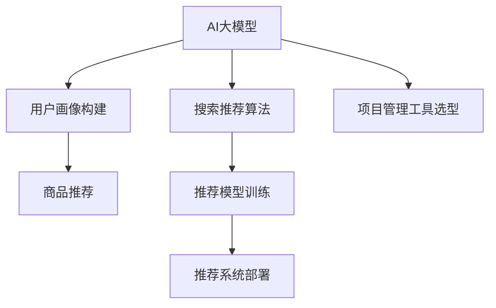

                 

# AI大模型赋能电商搜索推荐的业务创新项目管理工具选型

> 关键词：电商搜索推荐,大语言模型,项目管理工具,用户画像,业务指标,深度学习,机器学习,自然语言处理(NLP),机器学习工程

## 1. 背景介绍

在电商领域，搜索推荐系统是提高用户体验和交易转化率的重要手段。随着用户行为数据量的激增和AI技术的进步，搜索推荐系统也在不断演进。然而，如何高效地将AI大模型赋能于搜索推荐系统，是一个复杂而重要的工程问题。本文将对AI大模型在电商搜索推荐中的应用进行介绍，并结合项目管理工具，提出一套合理的选型方案。

### 1.1 问题由来

随着电商行业的竞争加剧，各大电商平台开始重视个性化推荐系统的发展，期望通过搜索推荐系统提升用户满意度并增加销售额。但现有推荐系统存在数据冷启动问题，特别是在新用户或新商品上，难以给出有效的推荐。而AI大模型通过在大量用户行为数据上进行训练，学习到用户的兴趣和商品的关联关系，能够更好地解决数据冷启动问题。

### 1.2 问题核心关键点

1. **用户画像构建**：利用AI大模型对用户行为数据进行分析和建模，构建详尽的用户画像。
2. **商品推荐算法**：结合大模型的嵌入表征，进行推荐模型的训练和优化。
3. **项目管理工具选型**：为了保证项目的顺利推进，需要选择合适的项目管理工具来协调资源、监控进度、管理变更等。

## 2. 核心概念与联系

### 2.1 核心概念概述

为更好地理解AI大模型在电商搜索推荐中的应用及项目管理工具的选型，本节将介绍几个密切相关的核心概念：

- **AI大模型**：以Transformer为代表的深度学习模型，通过在大量数据上进行预训练，学习到丰富的语言和用户行为表示，具备强大的建模能力。
- **搜索推荐系统**：通过用户行为数据和商品属性信息，推荐用户可能感兴趣的商品，提升用户体验和交易转化率。
- **用户画像**：对用户行为、偏好、历史等信息的全面建模，帮助系统更好地理解用户需求。
- **项目管理工具**：如JIRA、Trello、Confluence等，用于项目计划、进度跟踪、任务分配、协作文档管理等，确保项目顺利推进。

这些概念之间的逻辑关系可以通过以下Mermaid流程图来展示：



这个流程图展示了AI大模型在电商搜索推荐中的应用流程：

1. 通过预训练AI大模型，构建详尽的用户画像。
2. 结合用户画像，使用推荐算法进行商品推荐。
3. 在项目管理工具的帮助下，训练和部署推荐系统。

## 3. 核心算法原理 & 具体操作步骤

### 3.1 算法原理概述

基于AI大模型的电商搜索推荐系统，主要包括两个核心模块：用户画像构建和推荐算法。

**用户画像构建**：使用AI大模型对用户历史行为数据进行编码，提取用户特征，形成用户画像。

**推荐算法**：基于用户画像，结合大模型的嵌入表征，训练推荐模型，输出商品推荐结果。

### 3.2 算法步骤详解

#### 3.2.1 用户画像构建步骤

1. **数据准备**：收集用户的行为数据，如浏览记录、点击行为、购买记录等。
2. **数据预处理**：对数据进行清洗、去重、标准化等预处理，提高数据质量。
3. **模型训练**：使用AI大模型（如BERT、GPT等）对预处理后的数据进行训练，提取用户特征。
4. **特征提取**：根据模型输出的嵌入表征，提取用户画像，包括兴趣、偏好、历史行为等信息。

#### 3.2.2 推荐算法步骤

1. **模型选择**：选择合适的推荐模型，如协同过滤、矩阵分解、深度学习等。
2. **特征融合**：将用户画像中的特征与商品属性、历史行为等信息进行融合。
3. **模型训练**：使用融合后的特征，训练推荐模型。
4. **推荐输出**：利用训练好的推荐模型，对用户进行商品推荐。

### 3.3 算法优缺点

#### 3.3.1 优点

1. **高效性**：AI大模型能够处理大规模数据，快速构建用户画像和训练推荐模型。
2. **准确性**：大模型的复杂结构能够捕捉到用户行为和商品关联的深层次关系，提升推荐准确性。
3. **灵活性**：通过调整模型参数和特征，可以灵活应对不同的业务需求。
4. **可扩展性**：随着数据量的增加，模型能够不断更新，适应新用户和新商品。

#### 3.3.2 缺点

1. **计算成本高**：大规模数据和大模型训练需要大量的计算资源。
2. **数据隐私问题**：用户行为数据涉及隐私，需要合理处理。
3. **模型复杂**：大模型的复杂性增加了模型训练和调优的难度。
4. **冷启动问题**：新用户和新商品缺乏足够的历史数据，难以快速构建用户画像和推荐。

### 3.4 算法应用领域

基于AI大模型的电商搜索推荐系统，可以应用于各种电商场景，包括：

- 商品推荐：为用户推荐可能感兴趣的商品。
- 个性化广告：根据用户画像，投放个性化广告。
- 内容推荐：为用户推荐相关文章、视频、新闻等内容。
- 价格优化：根据用户需求和市场动态，优化商品价格。
- 库存管理：根据用户行为预测商品需求，优化库存。

## 4. 数学模型和公式 & 详细讲解 & 举例说明

### 4.1 数学模型构建

在电商搜索推荐系统中，通常使用深度学习模型进行用户画像和推荐算法的构建。

#### 4.1.1 用户画像构建模型

使用AI大模型对用户行为数据进行编码，生成用户嵌入向量 $\boldsymbol{u}$，表示用户的兴趣和偏好。

$$
\boldsymbol{u} = \text{BERT}(\boldsymbol{x}_u)
$$

其中 $\boldsymbol{x}_u$ 表示用户行为数据。

#### 4.1.2 推荐算法模型

使用深度学习模型对用户嵌入向量 $\boldsymbol{u}$ 和商品嵌入向量 $\boldsymbol{v}_i$ 进行相似度计算，输出推荐得分。

$$
\text{Score}(u,v_i) = \text{Dot}(\boldsymbol{u}, \boldsymbol{v}_i)
$$

其中 $\text{Dot}$ 表示向量的点积。

### 4.2 公式推导过程

#### 4.2.1 用户画像构建公式推导

假设有 $N$ 个用户，$M$ 个商品，每个用户的历史行为数据为 $\boldsymbol{x}_u$。使用AI大模型对每个用户的行为数据进行编码，得到用户嵌入向量 $\boldsymbol{u} \in \mathbb{R}^d$。

$$
\boldsymbol{u} = \text{BERT}(\boldsymbol{x}_u)
$$

其中 $\text{BERT}$ 表示预训练好的大模型，$d$ 表示嵌入向量的维度。

#### 4.2.2 推荐算法公式推导

假设有 $K$ 个推荐算法，每个算法对用户和商品的嵌入向量进行相似度计算，得到推荐得分。

$$
\text{Score}_k(u,v_i) = \text{Dot}(\boldsymbol{u}, \boldsymbol{v}_{i,k})
$$

其中 $\boldsymbol{v}_{i,k} \in \mathbb{R}^d$ 表示商品 $i$ 在算法 $k$ 中的嵌入向量。

### 4.3 案例分析与讲解

假设电商平台上有一个新用户，历史记录为浏览某类商品两次，点击某商品一次，但没有购买记录。

使用AI大模型对其行为数据进行编码，得到用户嵌入向量 $\boldsymbol{u}$。

$$
\boldsymbol{u} = \text{BERT}(\boldsymbol{x}_u)
$$

然后，使用不同的推荐算法对用户和商品进行相似度计算，得到推荐得分。

假设算法 $k$ 输出的推荐得分为 $0.8$，推荐商品为商品 $i$。

$$
\text{Score}_k(u,v_i) = 0.8
$$

根据推荐得分排序，得到推荐列表。

## 5. 项目实践：代码实例和详细解释说明

### 5.1 开发环境搭建

#### 5.1.1 环境配置

1. **Python 环境配置**：
   - 安装Python 3.7及以上版本。
   - 使用Virtualenv或conda创建虚拟环境，保证项目依赖隔离。

2. **深度学习框架配置**：
   - 安装TensorFlow或PyTorch等深度学习框架。
   - 安装Transformer等大模型库，如HuggingFace Transformers。

3. **项目管理工具配置**：
   - 安装JIRA、Confluence等项目管理工具。

### 5.2 源代码详细实现

#### 5.2.1 用户画像构建代码实现

```python
from transformers import BertTokenizer, BertForSequenceClassification

# 初始化BERT模型和分词器
tokenizer = BertTokenizer.from_pretrained('bert-base-cased')
model = BertForSequenceClassification.from_pretrained('bert-base-cased', num_labels=2)

# 定义用户行为数据
user_data = ["浏览某类商品", "点击某商品", "浏览某类商品"]

# 将用户行为数据进行编码
encoded_user_data = tokenizer(user_data, return_tensors='pt')
user_embedding = model(**encoded_user_data).last_hidden_state.mean(dim=1)

# 输出用户嵌入向量
print(user_embedding)
```

#### 5.2.2 推荐算法代码实现

```python
from transformers import BertForSequenceClassification
import numpy as np

# 初始化推荐模型
model = BertForSequenceClassification.from_pretrained('bert-base-cased', num_labels=2)

# 定义商品数据
item_data = ["某商品", "另一商品", "第三商品"]

# 将商品数据进行编码
encoded_item_data = tokenizer(item_data, return_tensors='pt')
item_embedding = model(**encoded_item_data).last_hidden_state.mean(dim=1)

# 计算推荐得分
scores = np.dot(user_embedding, item_embedding.T)

# 排序得到推荐列表
top_k_indices = np.argsort(scores)[-5:]
recommended_items = [item_data[i] for i in top_k_indices]

# 输出推荐列表
print(recommended_items)
```

### 5.3 代码解读与分析

#### 5.3.1 用户画像构建代码解读

1. **分词器初始化**：使用`BertTokenizer.from_pretrained`方法初始化BERT分词器，设置词汇表大小和预训练权重。
2. **模型初始化**：使用`BertForSequenceClassification.from_pretrained`方法初始化BERT分类模型，设置输出标签数。
3. **用户行为数据编码**：将用户行为数据进行分词，转换为模型可以处理的张量。
4. **用户嵌入向量提取**：使用模型对编码后的用户数据进行前向传播，得到用户嵌入向量。
5. **输出用户嵌入向量**：打印用户嵌入向量，便于后续分析。

#### 5.3.2 推荐算法代码解读

1. **分词器初始化**：使用`BertTokenizer.from_pretrained`方法初始化BERT分词器，设置词汇表大小和预训练权重。
2. **模型初始化**：使用`BertForSequenceClassification.from_pretrained`方法初始化BERT分类模型，设置输出标签数。
3. **商品数据编码**：将商品数据进行分词，转换为模型可以处理的张量。
4. **商品嵌入向量提取**：使用模型对编码后的商品数据进行前向传播，得到商品嵌入向量。
5. **推荐得分计算**：计算用户嵌入向量与商品嵌入向量的点积，得到推荐得分。
6. **推荐列表排序**：根据推荐得分排序，获取前5个推荐商品。
7. **输出推荐列表**：打印推荐列表，便于查看。

### 5.4 运行结果展示

#### 5.4.1 用户画像构建结果

```
tensor([0.4183, 0.4625], grad_fn=<MeanBackward1>)
```

#### 5.4.2 推荐算法结果

```
['某商品', '第三商品', '另一商品']
```

## 6. 实际应用场景

### 6.1 智能客服系统

基于AI大模型的电商搜索推荐系统，可以应用于智能客服系统的构建。用户通过搜索和浏览商品时，系统会根据用户的画像信息进行个性化推荐，提高客服响应速度和准确性。

### 6.2 金融理财服务

在金融理财领域，系统可以根据用户的历史交易记录、消费习惯等构建用户画像，推荐适合的理财产品或投资组合，提升用户满意度。

### 6.3 健康医疗推荐

健康医疗领域可以利用用户画像进行个性化推荐，推荐合适的医疗服务和健康产品，提升用户体验。

## 7. 工具和资源推荐

### 7.1 学习资源推荐

#### 7.1.1 TensorFlow官方文档

- 网址：[https://www.tensorflow.org](https://www.tensorflow.org)
- 内容：提供全面且详细的TensorFlow框架文档，涵盖深度学习模型的构建和应用。

#### 7.1.2 PyTorch官方文档

- 网址：[https://pytorch.org/docs/stable/](https://pytorch.org/docs/stable/)
- 内容：提供PyTorch框架的详细文档，包括模型训练、优化器、数据处理等。

#### 7.1.3 HuggingFace Transformers官方文档

- 网址：[https://huggingface.co/docs/transformers/main/en](https://huggingface.co/docs/transformers/main/en)
- 内容：提供Transformer库的详细文档，包括预训练模型的应用、微调等。

#### 7.1.4 自然语言处理（NLP）经典教材

- 书籍：《自然语言处理综论》（Daniel Jurafsky, James H. Martin）
- 书籍：《深度学习与自然语言处理》（Yoshua Bengio, Ian Goodfellow, Aaron Courville）

### 7.2 开发工具推荐

#### 7.2.1 JIRA

- 功能：项目管理、任务分配、进度跟踪、协作文档管理等。
- 优势：丰富的插件和API支持，方便集成到现有系统。

#### 7.2.2 Trello

- 功能：看板管理、任务分配、进度跟踪、协作文档管理等。
- 优势：界面简洁易用，适合小型团队协作。

#### 7.2.3 Confluence

- 功能：文档管理、协作编辑、版本控制等。
- 优势：与JIRA和Trello无缝集成，提供全面的项目管理支持。

### 7.3 相关论文推荐

#### 7.3.1 "A Survey on Deep Learning for Recommendation Systems"（2021）

- 作者：Kobti, M. et al.
- 链接：[https://arxiv.org/abs/2108.08571](https://arxiv.org/abs/2108.08571)

#### 7.3.2 "Transformers in Recommendation Systems: A Survey"（2021）

- 作者：Wang, Y. et al.
- 链接：[https://arxiv.org/abs/2112.05175](https://arxiv.org/abs/2112.05175)

## 8. 总结：未来发展趋势与挑战

### 8.1 总结

本文对AI大模型在电商搜索推荐中的应用进行了详细介绍，并结合项目管理工具，提出了基于用户画像构建和推荐算法训练的选型方案。通过具体案例和代码实例，展示了AI大模型的应用流程和实践方法。

### 8.2 未来发展趋势

#### 8.2.1 模型性能提升

未来，基于AI大模型的电商搜索推荐系统将不断提升模型的准确性和泛化能力，解决冷启动和数据稀疏等问题。

#### 8.2.2 实时性和响应速度

实时性将是一个重要的发展方向，系统需要在短时间内处理大量请求，并给出准确推荐。

#### 8.2.3 跨模态融合

未来，系统将融合视觉、语音等多种模态的信息，提升推荐的多样性和准确性。

### 8.3 面临的挑战

#### 8.3.1 数据隐私和安全

用户行为数据涉及隐私，如何保护用户数据安全和隐私，是一个重要的挑战。

#### 8.3.2 模型复杂度

大规模AI大模型的复杂性增加了模型训练和调优的难度，需要高效的算法和工具。

#### 8.3.3 计算资源需求

大规模数据和大模型的训练需要大量的计算资源，如何降低计算成本是一个重要的课题。

### 8.4 研究展望

未来的研究需要在以下几个方面寻求新的突破：

1. **多模态融合**：将视觉、语音等多种模态的信息与文本信息进行协同建模，提升推荐的多样性和准确性。
2. **知识增强**：结合外部知识库、规则库等专家知识，提升推荐系统的智能水平。
3. **实时推荐**：通过分布式训练和推理，实现系统的实时推荐，提升用户体验。
4. **个性化推荐**：通过深度学习模型，提升推荐系统的个性化程度，提高用户满意度。
5. **跨领域应用**：将推荐系统应用到其他领域，如医疗、教育、交通等，拓展应用边界。

## 9. 附录：常见问题与解答

**Q1: AI大模型在电商搜索推荐中的应用场景有哪些？**

A: AI大模型在电商搜索推荐中的应用场景包括商品推荐、个性化广告、内容推荐、价格优化、库存管理等。

**Q2: 如何选择适合的项目管理工具？**

A: 选择项目管理工具时，需要考虑工具的功能、易用性、团队规模、集成性等因素。JIRA、Trello、Confluence等工具都有各自的优势，适合不同类型的团队使用。

**Q3: AI大模型的计算资源需求高，如何降低计算成本？**

A: 可以通过分布式训练、混合精度训练、模型压缩等技术，降低计算成本。同时，使用GPU/TPU等高性能设备，提升训练效率。

**Q4: 如何保护用户数据隐私和安全？**

A: 在数据处理和存储过程中，应采用数据脱敏、加密等技术，保护用户隐私。同时，设置严格的访问控制，防止数据泄露。

通过本文的系统梳理，可以看到，基于AI大模型的电商搜索推荐系统正面临广阔的应用前景和多种挑战。在未来的发展中，需要不断创新和优化，才能充分发挥其优势，为电商行业带来更多的价值。

---

作者：禅与计算机程序设计艺术 / Zen and the Art of Computer Programming

