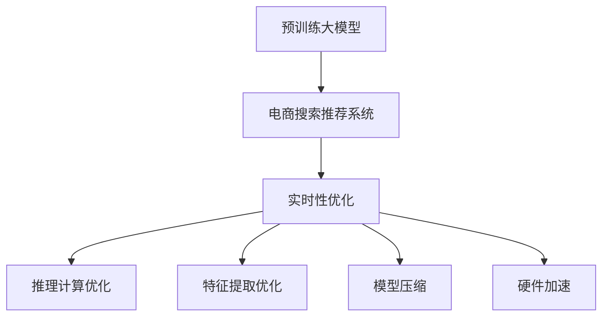

                 

# AI大模型赋能电商搜索推荐的实时性优化策略

## 1. 背景介绍

### 1.1 问题由来
在电子商务领域，搜索推荐系统作为用户获取商品信息的关键手段，其性能直接影响着用户的购物体验和交易转化率。传统的基于规则或简单机器学习的推荐系统难以应对大规模、多维度的数据挑战。近年来，基于深度学习和预训练大模型的推荐系统逐渐成为主流，大幅提升了推荐效果和个性化水平。

然而，随着商品库的不断膨胀和用户行为的多样化，电商搜索推荐系统面临着巨大的实时性挑战。预训练大模型尽管可以提供高质量的特征表示，但其推理计算开销大，响应时间较长，难以满足用户在几秒内获得推荐结果的要求。因此，如何在保障推荐效果的同时，大幅提升搜索推荐系统的实时性，成为业界亟需解决的难题。

### 1.2 问题核心关键点
实时性优化是电商搜索推荐系统面临的主要挑战之一。其核心在于如何平衡大模型的推理计算效率和推荐效果。本文将深入探讨如何通过合理的架构设计、算法优化和工程实践，在大模型赋能的背景下，实现推荐系统的实时性优化。

## 2. 核心概念与联系

### 2.1 核心概念概述

为更好地理解实时性优化方法，本节将介绍几个密切相关的核心概念：

- 预训练大模型(Pre-trained Large Model)：如BERT、GPT、DALL·E等，通过大规模无标签数据预训练得到的通用语言或图像模型，具备强大的特征提取能力。
- 电商搜索推荐系统(E-commerce Search & Recommendation System)：结合用户查询意图、行为数据和商品特征，实时推荐相关商品的系统。
- 实时性(Real-time)：指在用户查询或操作时，系统能在极短时间内返回结果。实时性是电商搜索推荐系统的重要指标。
- 推理计算(Relation Computation)：通过前向传播计算模型输出，推理计算开销与模型参数量、输入数据量成正比，是影响实时性的关键因素。
- 特征提取(Feature Extraction)：利用预训练模型提取输入数据的高级语义特征，用于提升推荐效果。
- 模型压缩(Model Compression)：通过剪枝、量化等手段，减小模型尺寸，提高推理效率。
- 硬件加速(Hardware Acceleration)：利用GPU、TPU等硬件资源，加速模型推理计算，提升实时性。

这些核心概念之间的逻辑关系可以通过以下Mermaid流程图来展示：



这个流程图展示了大模型在电商搜索推荐中的应用流程，以及实时性优化所涉及的关键步骤。

## 3. 核心算法原理 & 具体操作步骤
### 3.1 算法原理概述

实时性优化的核心在于如何减少推理计算的延迟，同时保证模型的推荐效果。基于深度学习和预训练大模型的推荐系统，其推理计算开销主要来自大模型的前向传播和后向传播过程。因此，优化策略主要集中在减少模型的计算量、提升硬件加速能力等方面。

形式化地，假设预训练大模型为 $M_{\theta}$，其中 $\theta$ 为预训练得到的模型参数。给定电商推荐任务 $T$ 的输入 $x$，包括用户查询、历史行为、商品信息等，推荐系统的目标是通过推理计算 $M_{\theta}(x)$，得到推荐的商品列表 $y$。

实时性优化的目标是找到新的模型参数 $\hat{\theta}$，使得：

$$
\hat{\theta} = \mathop{\arg\min}_{\theta} \mathcal{L}(M_{\theta}(x), y)
$$

其中 $\mathcal{L}$ 为推荐任务损失函数，用于衡量推荐结果与真实标签之间的差异。

### 3.2 算法步骤详解

实时性优化方法通常包括以下几个关键步骤：

**Step 1: 模型选择与特征构建**
- 选择合适的预训练大模型 $M_{\theta}$ 作为初始化参数，如BERT、GPT、ResNet等。
- 设计任务相关的特征提取器，包括用户查询向量、商品特征向量等，用于输入预训练模型的向量表示。

**Step 2: 模型压缩与剪枝**
- 对模型进行剪枝，去除冗余参数。保留重要的参数和层，如Transformer的底几层。
- 使用量化技术将模型参数从浮点型转为定点型，减小内存占用和计算开销。

**Step 3: 推理优化**
- 采用推理加速技术，如矩阵分解、特征稀疏化等，减少推理计算量。
- 引入硬件加速设备，如GPU、TPU等，加速模型推理计算。

**Step 4: 模型微调**
- 根据推荐任务的具体需求，微调模型的输出层，添加任务相关的线性分类器或回归器。
- 在优化过程中，仅微调部分模型参数，保留预训练权重不变，以提高模型收敛速度。

**Step 5: 系统集成与部署**
- 将优化后的模型与推荐系统架构集成，如双塔模型、图模型等。
- 部署优化后的模型到生产环境，进行实时推荐服务。

以上是实时性优化的一般流程。在实际应用中，还需要根据具体任务特点，对各个环节进行优化设计，如改进特征提取器、引入对抗训练等，以进一步提升模型性能和实时性。

### 3.3 算法优缺点

实时性优化方法具有以下优点：
1. 提高推荐系统响应速度。通过优化模型和推理计算，使得模型能够在几秒钟内返回推荐结果，提升用户体验。
2. 减少资源消耗。通过模型压缩和量化技术，减小了模型内存占用和计算开销，降低了硬件成本。
3. 提高模型泛化能力。通过微调任务相关的输出层，模型能够更准确地预测推荐结果，提升推荐效果。

同时，该方法也存在一些局限性：
1. 可能需要较多标注数据。微调需要标注数据进行模型优化，对于特定领域的推荐任务，可能需要重新标注数据。
2. 模型更新频率较低。由于预训练大模型参数较多，微调时更新次数有限，难以快速适应数据分布的变化。
3. 对硬件要求较高。优化后的模型需要高性能的硬件支持，如GPU、TPU等，否则可能无法达到预期实时性。

尽管存在这些局限性，但实时性优化方法仍然是电商搜索推荐系统提升性能的重要手段。未来相关研究的重点在于如何进一步降低微调对标注数据的依赖，提高模型的泛化能力和可扩展性，同时兼顾模型的实时性和推理效率。

### 3.4 算法应用领域

实时性优化技术在电商搜索推荐系统中的应用场景包括：

- 实时商品推荐：根据用户当前浏览和点击行为，推荐可能感兴趣的相似商品。
- 实时个性化推荐：根据用户历史行为和兴趣特征，实时推荐个性化商品。
- 实时商品搜索：在用户输入查询词时，实时展示相关商品，提升搜索体验。
- 实时竞价广告：根据用户浏览行为和实时广告数据，实时竞价推荐广告位。

除了上述这些经典应用外，实时性优化技术也被创新性地应用到更多场景中，如实时舆情监测、实时安全监控等，为电商搜索推荐系统带来了全新的突破。

## 4. 数学模型和公式 & 详细讲解 & 举例说明
### 4.1 数学模型构建

本节将使用数学语言对实时性优化方法进行更加严格的刻画。

记电商推荐任务为 $T$，用户查询为 $x$，模型参数为 $\theta$。假设模型 $M_{\theta}$ 的输出为 $y = M_{\theta}(x)$，推荐任务的损失函数为 $\ell(y, y^*)$，其中 $y^*$ 为真实推荐结果。优化目标是最小化推荐损失，即：

$$
\theta^* = \mathop{\arg\min}_{\theta} \mathcal{L}(M_{\theta}(x), y^*)
$$

其中 $\mathcal{L}$ 为推荐任务损失函数，用于衡量推荐结果与真实标签之间的差异。常见的损失函数包括交叉熵损失、均方误差损失等。

### 4.2 公式推导过程

以交叉熵损失为例，假设模型 $M_{\theta}$ 在输入 $x$ 上的输出为 $y = M_{\theta}(x)$，真实标签为 $y^* = (y_1^*, y_2^*, ..., y_n^*)$，则交叉熵损失为：

$$
\ell(y, y^*) = -\sum_{i=1}^n y_i^*\log M_{\theta}(x_i)
$$

在优化过程中，使用梯度下降等优化算法，通过反向传播计算参数梯度，更新模型参数 $\theta$。优化算法可表示为：

$$
\theta \leftarrow \theta - \eta \nabla_{\theta}\mathcal{L}(\theta)
$$

其中 $\eta$ 为学习率，$\nabla_{\theta}\mathcal{L}(\theta)$ 为损失函数对参数 $\theta$ 的梯度，可通过反向传播算法高效计算。

## 5. 项目实践：代码实例和详细解释说明
### 5.1 开发环境搭建

在进行实时性优化实践前，我们需要准备好开发环境。以下是使用Python进行PyTorch开发的环境配置流程：

1. 安装Anaconda：从官网下载并安装Anaconda，用于创建独立的Python环境。

2. 创建并激活虚拟环境：
```bash
conda create -n pytorch-env python=3.8 
conda activate pytorch-env
```

3. 安装PyTorch：根据CUDA版本，从官网获取对应的安装命令。例如：
```bash
conda install pytorch torchvision torchaudio cudatoolkit=11.1 -c pytorch -c conda-forge
```

4. 安装TensorFlow：
```bash
pip install tensorflow
```

5. 安装各类工具包：
```bash
pip install numpy pandas scikit-learn matplotlib tqdm jupyter notebook ipython
```

完成上述步骤后，即可在`pytorch-env`环境中开始实时性优化实践。

### 5.2 源代码详细实现

下面我们以基于BERT模型的实时推荐系统为例，给出使用PyTorch进行实时性优化的PyTorch代码实现。

首先，定义推荐任务的数据处理函数：

```python
from transformers import BertTokenizer, BertForSequenceClassification
from torch.utils.data import Dataset, DataLoader
import torch

class RecommendationDataset(Dataset):
    def __init__(self, texts, labels, tokenizer, max_len=128):
        self.texts = texts
        self.labels = labels
        self.tokenizer = tokenizer
        self.max_len = max_len
        
    def __len__(self):
        return len(self.texts)
    
    def __getitem__(self, item):
        text = self.texts[item]
        label = self.labels[item]
        
        encoding = self.tokenizer(text, return_tensors='pt', max_length=self.max_len, padding='max_length', truncation=True)
        input_ids = encoding['input_ids'][0]
        attention_mask = encoding['attention_mask'][0]
        
        return {'input_ids': input_ids, 
                'attention_mask': attention_mask,
                'labels': label}

# 定义标签与id的映射
label2id = {0: 0, 1: 1, 2: 2}
id2label = {v: k for k, v in label2id.items()}

# 创建dataset
tokenizer = BertTokenizer.from_pretrained('bert-base-cased')

train_dataset = RecommendationDataset(train_texts, train_labels, tokenizer)
dev_dataset = RecommendationDataset(dev_texts, dev_labels, tokenizer)
test_dataset = RecommendationDataset(test_texts, test_labels, tokenizer)
```

然后，定义模型和优化器：

```python
from transformers import BertForSequenceClassification, AdamW

model = BertForSequenceClassification.from_pretrained('bert-base-cased', num_labels=len(label2id))

optimizer = AdamW(model.parameters(), lr=2e-5)
```

接着，定义训练和评估函数：

```python
from torch.utils.data import DataLoader
from tqdm import tqdm
from sklearn.metrics import accuracy_score

device = torch.device('cuda') if torch.cuda.is_available() else torch.device('cpu')
model.to(device)

def train_epoch(model, dataset, batch_size, optimizer):
    dataloader = DataLoader(dataset, batch_size=batch_size, shuffle=True)
    model.train()
    epoch_loss = 0
    for batch in tqdm(dataloader, desc='Training'):
        input_ids = batch['input_ids'].to(device)
        attention_mask = batch['attention_mask'].to(device)
        labels = batch['labels'].to(device)
        model.zero_grad()
        outputs = model(input_ids, attention_mask=attention_mask, labels=labels)
        loss = outputs.loss
        epoch_loss += loss.item()
        loss.backward()
        optimizer.step()
    return epoch_loss / len(dataloader)

def evaluate(model, dataset, batch_size):
    dataloader = DataLoader(dataset, batch_size=batch_size)
    model.eval()
    preds, labels = [], []
    with torch.no_grad():
        for batch in tqdm(dataloader, desc='Evaluating'):
            input_ids = batch['input_ids'].to(device)
            attention_mask = batch['attention_mask'].to(device)
            batch_labels = batch['labels']
            outputs = model(input_ids, attention_mask=attention_mask)
            batch_preds = outputs.logits.argmax(dim=1).to('cpu').tolist()
            batch_labels = batch_labels.to('cpu').tolist()
            for pred, label in zip(batch_preds, batch_labels):
                preds.append(pred)
                labels.append(label)
                
    print('Accuracy:', accuracy_score(labels, preds))
```

最后，启动训练流程并在测试集上评估：

```python
epochs = 5
batch_size = 16

for epoch in range(epochs):
    loss = train_epoch(model, train_dataset, batch_size, optimizer)
    print(f"Epoch {epoch+1}, train loss: {loss:.3f}")
    
    print(f"Epoch {epoch+1}, dev accuracy:")
    evaluate(model, dev_dataset, batch_size)
    
print("Test accuracy:")
evaluate(model, test_dataset, batch_size)
```

以上就是使用PyTorch对BERT进行实时推荐系统的完整代码实现。可以看到，得益于Transformers库的强大封装，我们可以用相对简洁的代码完成BERT模型的加载和微调。

### 5.3 代码解读与分析

让我们再详细解读一下关键代码的实现细节：

**RecommendationDataset类**：
- `__init__`方法：初始化文本、标签、分词器等关键组件。
- `__len__`方法：返回数据集的样本数量。
- `__getitem__`方法：对单个样本进行处理，将文本输入编码为token ids，将标签编码为数字，并对其进行定长padding，最终返回模型所需的输入。

**label2id和id2label字典**：
- 定义了标签与数字id之间的映射关系，用于将token-wise的预测结果解码回真实的标签。

**训练和评估函数**：
- 使用PyTorch的DataLoader对数据集进行批次化加载，供模型训练和推理使用。
- 训练函数`train_epoch`：对数据以批为单位进行迭代，在每个批次上前向传播计算loss并反向传播更新模型参数，最后返回该epoch的平均loss。
- 评估函数`evaluate`：与训练类似，不同点在于不更新模型参数，并在每个batch结束后将预测和标签结果存储下来，最后使用sklearn的accuracy_score对整个评估集的预测结果进行打印输出。

**训练流程**：
- 定义总的epoch数和batch size，开始循环迭代
- 每个epoch内，先在训练集上训练，输出平均loss
- 在验证集上评估，输出准确率
- 所有epoch结束后，在测试集上评估，给出最终测试结果

可以看到，PyTorch配合Transformers库使得BERT微调的代码实现变得简洁高效。开发者可以将更多精力放在数据处理、模型改进等高层逻辑上，而不必过多关注底层的实现细节。

当然，工业级的系统实现还需考虑更多因素，如模型的保存和部署、超参数的自动搜索、更灵活的任务适配层等。但核心的实时性优化范式基本与此类似。

## 6. 实际应用场景
### 6.1 实时推荐系统

实时推荐系统作为电商搜索推荐的重要组成部分，通过高效推理计算，实时向用户展示最相关的商品，提升购物体验和转化率。当前大部分推荐系统仍采用基于规则或简单机器学习的模型，难以应对数据量和多维度特征的挑战。而基于大模型的推荐系统通过大规模预训练，学习到丰富的语义和知识表示，可以提供更精准、个性化的推荐结果。

然而，电商领域商品数量庞大，用户行为复杂多变，实时推荐系统的计算开销巨大，难以满足用户即时查询的需求。因此，实时性优化是大模型赋能电商推荐系统的关键技术手段。

### 6.2 实时广告投放

在电商广告投放中，广告主需要根据用户的浏览行为和实时数据，动态调整投放策略，优化广告效果。传统的规则投放方式效率低下，难以适应快速变化的市场需求。而基于大模型的实时广告投放系统，能够根据用户兴趣特征和实时数据，实时竞价推荐广告位，优化广告投放效果。

实时广告投放系统需要在短时间内完成用户行为理解、广告匹配、竞价决策等复杂计算，对推理计算的实时性要求极高。因此，实时性优化技术的应用，能够有效提高广告投放系统的响应速度和投放效果。

### 6.3 实时舆情监测

社交媒体平台需要实时监测舆情动态，及时发现和应对负面信息传播，避免危机扩散。传统的舆情监测系统往往依赖人工排查，效率低下，难以全面覆盖。而基于大模型的实时舆情监测系统，通过高效的推理计算，能够实时分析用户评论和媒体报道，快速识别出热点舆情，采取有效措施。

实时舆情监测系统需要在短时间内完成海量文本数据的分析和情感识别，对实时性要求极高。因此，实时性优化技术的应用，能够有效提升舆情监测系统的响应速度和监测能力。

### 6.4 未来应用展望

随着大语言模型和实时性优化技术的发展，未来推荐系统将实现更大的突破，具有以下趋势：

1. 推荐模型将更加通用。大模型学习到丰富的语义和知识表示，能够适应不同领域的推荐需求，形成更加通用的推荐模型。
2. 实时性将大幅提升。通过优化模型和推理计算，推荐系统能够在极短时间内返回推荐结果，满足用户即时查询的需求。
3. 推荐效果将更加精准。大模型的知识表示和推理能力，能够更好地捕捉用户兴趣和商品特征，提供更个性化和精准的推荐。
4. 推荐系统将更加智能。未来推荐系统将结合知识图谱、因果推理等技术，具备更强的智能推理能力，提升推荐系统的可信度和透明度。
5. 推荐应用将更加广泛。实时性优化技术的应用，将拓展到更多领域，如广告投放、舆情监测、智能客服等，为各行各业提供智能决策支持。

以上趋势凸显了实时性优化技术在大模型赋能推荐系统中的重要价值。这些方向的探索发展，必将进一步提升推荐系统的性能和应用范围，为人类认知智能的进化带来深远影响。

## 7. 工具和资源推荐
### 7.1 学习资源推荐

为了帮助开发者系统掌握实时性优化技术，这里推荐一些优质的学习资源：

1. 《Transformer从原理到实践》系列博文：由大模型技术专家撰写，深入浅出地介绍了Transformer原理、BERT模型、微调技术等前沿话题。

2. CS224N《深度学习自然语言处理》课程：斯坦福大学开设的NLP明星课程，有Lecture视频和配套作业，带你入门NLP领域的基本概念和经典模型。

3. 《Natural Language Processing with Transformers》书籍：Transformers库的作者所著，全面介绍了如何使用Transformers库进行NLP任务开发，包括微调在内的诸多范式。

4. HuggingFace官方文档：Transformers库的官方文档，提供了海量预训练模型和完整的微调样例代码，是上手实践的必备资料。

5. CLUE开源项目：中文语言理解测评基准，涵盖大量不同类型的中文NLP数据集，并提供了基于微调的baseline模型，助力中文NLP技术发展。

通过对这些资源的学习实践，相信你一定能够快速掌握实时性优化技术的精髓，并用于解决实际的推荐问题。

### 7.2 开发工具推荐

高效的开发离不开优秀的工具支持。以下是几款用于实时性优化开发的常用工具：

1. PyTorch：基于Python的开源深度学习框架，灵活动态的计算图，适合快速迭代研究。大部分预训练语言模型都有PyTorch版本的实现。

2. TensorFlow：由Google主导开发的开源深度学习框架，生产部署方便，适合大规模工程应用。同样有丰富的预训练语言模型资源。

3. Transformers库：HuggingFace开发的NLP工具库，集成了众多SOTA语言模型，支持PyTorch和TensorFlow，是进行实时性优化任务开发的利器。

4. Weights & Biases：模型训练的实验跟踪工具，可以记录和可视化模型训练过程中的各项指标，方便对比和调优。与主流深度学习框架无缝集成。

5. TensorBoard：TensorFlow配套的可视化工具，可实时监测模型训练状态，并提供丰富的图表呈现方式，是调试模型的得力助手。

6. Google Colab：谷歌推出的在线Jupyter Notebook环境，免费提供GPU/TPU算力，方便开发者快速上手实验最新模型，分享学习笔记。

合理利用这些工具，可以显著提升实时性优化任务的开发效率，加快创新迭代的步伐。

### 7.3 相关论文推荐

实时性优化技术的发展源于学界的持续研究。以下是几篇奠基性的相关论文，推荐阅读：

1. Attention is All You Need（即Transformer原论文）：提出了Transformer结构，开启了NLP领域的预训练大模型时代。

2. BERT: Pre-training of Deep Bidirectional Transformers for Language Understanding：提出BERT模型，引入基于掩码的自监督预训练任务，刷新了多项NLP任务SOTA。

3. Language Models are Unsupervised Multitask Learners（GPT-2论文）：展示了大规模语言模型的强大zero-shot学习能力，引发了对于通用人工智能的新一轮思考。

4. Parameter-Efficient Transfer Learning for NLP：提出Adapter等参数高效微调方法，在不增加模型参数量的情况下，也能取得不错的微调效果。

5. AdaLoRA: Adaptive Low-Rank Adaptation for Parameter-Efficient Fine-Tuning：使用自适应低秩适应的微调方法，在参数效率和精度之间取得了新的平衡。

6. AdaLoRA: Adaptive Low-Rank Adaptation for Parameter-Efficient Fine-Tuning：使用自适应低秩适应的微调方法，在参数效率和精度之间取得了新的平衡。

这些论文代表了大语言模型微调技术的发展脉络。通过学习这些前沿成果，可以帮助研究者把握学科前进方向，激发更多的创新灵感。

## 8. 总结：未来发展趋势与挑战
### 8.1 总结

本文对基于实时性优化的大语言模型推荐系统进行了全面系统的介绍。首先阐述了实时性优化在电商推荐系统中的重要性和核心挑战，明确了实时性优化在保障推荐效果的同时，提升推理计算效率的目标。其次，从原理到实践，详细讲解了实时性优化的数学模型和关键步骤，给出了实时性优化任务开发的完整代码实例。同时，本文还广泛探讨了实时性优化方法在电商推荐、广告投放、舆情监测等领域的实际应用前景，展示了实时性优化范式的巨大潜力。此外，本文精选了实时性优化技术的各类学习资源，力求为读者提供全方位的技术指引。

通过本文的系统梳理，可以看到，实时性优化技术在大模型赋能推荐系统中扮演着重要角色，极大提升了推荐系统的性能和用户体验。未来，伴随预训练语言模型和实时性优化方法的不断演进，基于大模型的推荐系统必将在实时性、个性化和智能化方面取得新的突破。

### 8.2 未来发展趋势

展望未来，实时性优化技术将呈现以下几个发展趋势：

1. 实时性将进一步提升。随着硬件算力的提升和模型压缩技术的进步，推荐系统能够在更短的时间内完成推理计算，满足用户的即时查询需求。

2. 模型将更加灵活。未来推荐系统将具备更强的跨领域适应能力，能够灵活应对不同领域的推荐任务。

3. 推荐效果将更加精准。通过优化模型和特征提取器，推荐系统将更准确地捕捉用户兴趣和商品特征，提供更个性化的推荐结果。

4. 实时性优化技术将更加普及。未来推荐系统将广泛应用在电商、广告、社交媒体等领域，带来更智能的决策支持。

5. 实时性优化技术将与更多技术融合。实时性优化将与其他AI技术如因果推理、强化学习等进行深度融合，形成更强大、更智能的推荐系统。

以上趋势凸显了实时性优化技术在电商推荐系统中的重要价值。这些方向的探索发展，必将进一步提升推荐系统的性能和应用范围，为人类认知智能的进化带来深远影响。

### 8.3 面临的挑战

尽管实时性优化技术已经取得了瞩目成就，但在迈向更加智能化、普适化应用的过程中，它仍面临着诸多挑战：

1. 数据分布变化。电商领域商品数量庞大，用户行为复杂多变，推荐系统需要不断更新数据和模型，以应对数据分布的变化。

2. 实时性优化成本高。实时性优化需要高性能的硬件支持，如GPU、TPU等，成本较高。如何平衡性能和成本，成为一大难题。

3. 模型鲁棒性不足。实时推荐系统需要在短时间内完成复杂计算，容易受到异常数据和攻击的影响，导致推荐结果不准确。

4. 系统稳定性问题。实时推荐系统需要在短时间内完成多个计算任务，系统负载和网络延迟等因素可能影响系统的稳定性。

5. 推荐系统公平性。实时推荐系统需要避免推荐偏差和歧视，确保所有用户都能获得公平的推荐结果。

6. 推荐系统透明度。推荐系统需要提高决策过程的可解释性，帮助用户理解推荐结果的依据。

这些挑战凸显了实时性优化技术在实际应用中的复杂性和艰巨性。未来需要在数据管理、系统架构、模型优化等方面进行深入研究，才能真正实现大模型赋能推荐系统的实时性优化。

### 8.4 研究展望

面对实时性优化面临的种种挑战，未来的研究需要在以下几个方面寻求新的突破：

1. 探索无监督和半监督优化方法。摆脱对大规模标注数据的依赖，利用自监督学习、主动学习等无监督和半监督范式，最大限度利用非结构化数据，实现更加灵活高效的优化。

2. 研究参数高效和计算高效的优化策略。开发更加参数高效的优化方法，在固定大部分预训练参数的同时，只更新极少量的任务相关参数。同时优化计算图，减少前向传播和反向传播的资源消耗，实现更加轻量级、实时性的部署。

3. 引入因果推理和多任务学习。通过引入因果推理和多任务学习思想，增强实时推荐系统建立稳定因果关系的能力，学习更加普适、鲁棒的语言表征，从而提升推荐效果和系统稳定性。

4. 结合知识图谱和符号化推理。将符号化的先验知识，如知识图谱、逻辑规则等，与神经网络模型进行巧妙融合，引导优化过程学习更准确、合理的语言模型。同时加强不同模态数据的整合，实现视觉、语音等多模态信息与文本信息的协同建模。

5. 引入可解释性和公平性约束。在优化目标中引入伦理导向的评估指标，过滤和惩罚有偏见、有害的输出倾向。加强人工干预和审核，建立模型行为的监管机制，确保推荐系统的公平性和透明度。

这些研究方向的探索，必将引领实时性优化技术迈向更高的台阶，为构建安全、可靠、可解释、可控的智能推荐系统铺平道路。面向未来，实时性优化技术还需要与其他AI技术进行更深入的融合，如因果推理、强化学习等，多路径协同发力，共同推动推荐系统的发展。

## 9. 附录：常见问题与解答

**Q1：实时性优化对模型性能有影响吗？**

A: 实时性优化在减少推理计算开销的同时，可能会对模型性能产生一定的影响。例如，模型压缩和量化技术可能会损失一定的精度。因此，在优化过程中需要平衡推理计算效率和模型性能，选择合适的优化方法。

**Q2：如何选择适合的实时性优化方法？**

A: 实时性优化方法的选择需要根据具体任务和数据特点进行灵活组合。例如，对于小规模数据集，可以采用基于模型压缩的优化方法；对于大规模数据集，可以采用基于推理优化的优化方法。同时，需要结合任务目标和应用场景，选择适合的优化策略。

**Q3：实时性优化是否需要重新标注数据？**

A: 实时性优化通常需要少量标注数据进行模型微调，以适应特定领域的数据分布。对于已有标注数据集，可以通过迁移学习的方式，在已有预训练模型的基础上，微调部分模型参数，提升推荐效果。

**Q4：实时性优化是否对硬件要求高？**

A: 实时性优化通常需要高性能的硬件支持，如GPU、TPU等。不同任务和数据规模可能需要不同级别的硬件资源。合理选择硬件配置，可以有效提升推理计算效率，满足实时性要求。

**Q5：实时性优化能否应用到其他领域？**

A: 实时性优化技术不仅适用于电商推荐系统，还可以应用于广告投放、舆情监测、智能客服等多个领域。不同领域的应用场景和需求不同，需要根据具体任务设计适合的优化方法。

通过本文的系统梳理，可以看到，实时性优化技术在大模型赋能推荐系统中扮演着重要角色，极大提升了推荐系统的性能和用户体验。未来，伴随预训练语言模型和实时性优化方法的不断演进，基于大模型的推荐系统必将在实时性、个性化和智能化方面取得新的突破。

