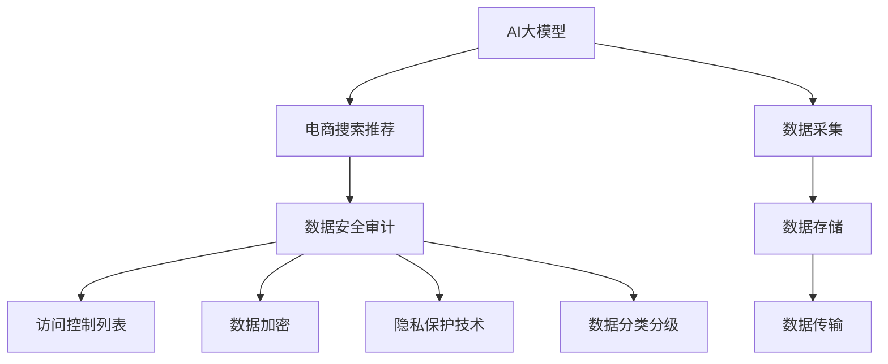

                 

# AI大模型重构电商搜索推荐的数据安全审计方案

## 1. 背景介绍

### 1.1 问题由来
随着AI大模型技术在电商搜索推荐系统的广泛应用，数据安全问题逐渐成为行业关注的焦点。各大电商平台不断扩充用户画像、行为记录等数据，以便为个性化推荐提供精准依据。然而，这些数据通常涉及用户的隐私和商业秘密，一旦泄露或被恶意利用，将给企业带来巨大的经济损失和声誉风险。因此，如何在充分利用AI大模型优势的同时，确保数据的安全性，是电商行业亟需解决的重大课题。

### 1.2 问题核心关键点
数据安全审计的本质是对电商搜索推荐系统进行系统性的风险评估和防护，确保其遵守数据隐私法规、实现数据使用授权和保护数据完整性。这涉及对系统架构、数据流向、访问权限等关键环节进行详细审查，同时建立完善的安全监控和响应机制，以保障数据安全和用户隐私。

### 1.3 问题研究意义
数据安全审计对于构建可信、安全的电商搜索推荐系统至关重要。通过严格的数据安全审计，可以：

- **保障用户隐私**：确保用户数据在使用过程中不被滥用或泄露，维护用户对电商平台的信任。
- **防范数据安全风险**：识别和修复潜在的安全漏洞，避免因数据泄露导致的法律和经济损失。
- **增强合规性**：确保系统符合各国数据隐私法律法规，避免因违规导致的罚款和声誉损害。
- **提升系统可靠性**：通过审计发现和修复系统缺陷，提高系统的稳定性和可靠性。

## 2. 核心概念与联系

### 2.1 核心概念概述

为更好地理解数据安全审计方案，本节将介绍几个密切相关的核心概念：

- **AI大模型**：指通过深度学习技术训练出的庞大神经网络模型，如BERT、GPT-3等。这些模型具有强大的自然语言处理能力，被广泛应用于电商搜索推荐系统。
- **电商搜索推荐系统**：指利用AI大模型对用户搜索、浏览和购买行为进行分析，为用户提供个性化推荐服务的技术系统。
- **数据安全审计**：指对电商搜索推荐系统进行全面细致的检查，评估其数据流向、访问权限、数据保护措施等，以确保系统符合数据隐私法规，降低数据安全风险。
- **访问控制列表(ACL)**：记录系统资源（如文件、数据库、API等）的访问权限，控制谁可以访问以及如何访问。
- **数据加密**：通过加密算法将数据转换为难以解读的格式，确保数据在传输和存储过程中的安全性。
- **隐私保护技术**：包括差分隐私、联邦学习等技术，用于在保护隐私的前提下进行数据分析和模型训练。
- **数据分类分级**：将数据按照敏感程度分为不同等级，根据等级采取不同的保护措施。

这些核心概念之间的逻辑关系可以通过以下Mermaid流程图来展示：



这个流程图展示了大模型、电商推荐系统、安全审计之间的核心关系：

1. AI大模型从数据采集环节获取用户行为数据，存储在数据仓库中。
2. 电商推荐系统通过大模型对数据进行处理，生成推荐结果。
3. 数据安全审计对推荐系统进行全面审查，包括访问控制、数据加密、隐私保护、数据分级等关键环节。
4. 最终保障大模型和推荐系统的数据安全，防范潜在风险。

## 3. 核心算法原理 & 具体操作步骤
### 3.1 算法原理概述

数据安全审计的核心是确保电商搜索推荐系统遵循数据隐私法规，保护用户数据免受未经授权的访问和泄露。这涉及到系统架构、数据流向、访问权限等多个层面。本文将从这些方面详细阐述数据安全审计的算法原理。

### 3.2 算法步骤详解

数据安全审计一般包括以下几个关键步骤：

**Step 1: 准备审计数据和工具**
- 收集电商搜索推荐系统的架构文档、数据流向图、访问权限日志、加密策略等审计资料。
- 选择适合的安全审计工具，如开源审计工具Nessus、Metasploit等，或第三方审计服务。

**Step 2: 评估系统架构**
- 检查系统的架构设计，评估其安全性。重点关注数据流的起点、路径、终点，确保数据未经过不安全的中间节点。
- 审查系统的冗余设计，评估其高可用性和容错能力。

**Step 3: 审查数据流向**
- 分析数据流的路径，识别数据泄露的风险点。
- 检查数据传输过程中的加密措施，确保敏感数据在传输过程中得到保护。

**Step 4: 访问权限审查**
- 验证访问控制列表(ACL)的设置，确保每个资源（如数据库、API）只能被授权用户访问。
- 检查权限粒度，确保最小权限原则得到遵守，避免权限滥用。

**Step 5: 数据加密和隐私保护**
- 检查数据存储和传输过程中的加密措施，确保敏感数据在存储和传输时无法被未授权者获取。
- 评估隐私保护技术的应用，如差分隐私、联邦学习等，确保数据隐私在分析和使用过程中得到保护。

**Step 6: 数据分类分级**
- 根据数据的敏感程度进行分类和分级，确定不同等级的数据应采取的防护措施。
- 检查数据的标签管理，确保数据分类和分级符合隐私法规的要求。

**Step 7: 审计报告与改进建议**
- 汇总审计结果，生成详细的审计报告。报告应包括系统的安全状况、存在的风险点和改进建议。
- 根据审计报告，制定和实施改进措施，确保系统安全性和合规性。

### 3.3 算法优缺点

数据安全审计的优势在于：
- **全面性**：覆盖系统架构、数据流向、访问权限、数据加密、隐私保护等多个环节，全面评估系统的安全性。
- **合规性**：确保系统符合数据隐私法规，规避法律风险。
- **前瞻性**：通过定期审计，及时发现和修复潜在的安全漏洞，提升系统的安全性。

然而，该方法也存在一定的局限性：
- **成本高**：需要投入大量人力、时间和资源进行审计，对中小型企业可能不具备经济性。
- **技术门槛高**：需要具备较高的技术能力，对非技术人员而言难以独立完成。
- **依赖工具**：审计工具的选择和配置需要专业知识，可能影响审计效果。

### 3.4 算法应用领域

数据安全审计在多个领域都有广泛应用，包括：

- **金融领域**：金融机构需对用户的财务数据进行严格保护，防止数据泄露导致的经济损失。
- **医疗领域**：医疗机构需保护患者隐私，确保医疗数据的安全性和合规性。
- **政府部门**：政府部门需保护公民个人信息，防范数据泄露带来的社会风险。
- **电商行业**：电商平台需保护用户行为数据，防范数据泄露和滥用风险。
- **互联网服务**：社交媒体、即时通讯等平台需保护用户隐私，防范数据泄露和滥用。

## 4. 数学模型和公式 & 详细讲解 & 举例说明
### 4.1 数学模型构建

本节将使用数学语言对数据安全审计的审计模型进行详细描述。

记电商搜索推荐系统为 $S$，其中包含多个数据流 $D_1, D_2, \ldots, D_n$，每个数据流对应的敏感度为 $s_i$。系统架构由多个组件 $C_1, C_2, \ldots, C_m$ 组成。每个组件的访问权限记录为 $ACL_i$，其中 $i$ 表示组件编号。

假设审计人员已经获取了系统的架构文档 $Arch$ 和数据流向图 $Flow$，需要构建一个审计模型 $M$，用于评估系统的安全性。

### 4.2 公式推导过程

审计模型 $M$ 包括多个子模块，每个子模块对应一个审计任务。假设每个子模块 $M_k$ 对应的审计任务为 $Task_k$，其评分函数为 $Sc_k$，则审计模型的总评分 $Sc$ 可以表示为：

$$
Sc = \sum_{k=1}^K Sc_k
$$

其中 $K$ 为审计任务的总数。

以访问权限审查为例，其评分函数 $Sc_{ACL}$ 可以表示为：

$$
Sc_{ACL} = \sum_{i=1}^m \frac{1}{2^{ACL_i}} s_i
$$

其中 $ACL_i$ 表示组件 $C_i$ 的访问权限，$s_i$ 表示数据流 $D_i$ 的敏感度。

### 4.3 案例分析与讲解

假设某电商平台的架构由以下组件构成：

- 用户画像生成器
- 推荐算法
- 数据库存储
- 数据处理API

每个组件对应的访问权限记录如下：

| 组件编号 | 组件名称 | 访问权限 |
| -------- | -------- | -------- |
| 1        | 用户画像生成器 | 用户ID:r,员工ID:r |
| 2        | 推荐算法       | 用户ID:w,员工ID:w |
| 3        | 数据库存储      | 数据库ID:r,员工ID:w |
| 4        | 数据处理API     | 用户ID:w,员工ID:w |

审计人员对每个组件的访问权限进行检查，发现以下问题：

- 用户画像生成器只能被授权用户访问，但推荐算法和数据处理API也能访问，存在潜在的安全风险。
- 推荐算法和数据处理API只能被授权员工访问，但用户ID也具有写入权限，不符合最小权限原则。

根据审计模型的评分函数，可以计算出系统的总评分：

$$
Sc_{ACL} = \frac{1}{2^{r}} s_{user画像生成器} + \frac{1}{2^{w}} s_{推荐算法} + \frac{1}{2^{w}} s_{数据库存储} + \frac{1}{2^{w}} s_{数据处理API}
$$

其中 $s_{user画像生成器}$ 为高敏感度数据流，$s_{推荐算法}$ 和 $s_{数据处理API}$ 为中等敏感度数据流，$s_{数据库存储}$ 为低敏感度数据流。

根据审计结果，审计人员建议限制推荐算法和数据处理API对用户ID的写入权限，进一步细化访问控制策略，提升系统的安全性。

## 5. 项目实践：代码实例和详细解释说明
### 5.1 开发环境搭建

在进行数据安全审计项目开发前，我们需要准备好开发环境。以下是使用Python进行Kali Linux开发的流程：

1. 安装Kali Linux：从官网下载并安装Kali Linux发行版。
2. 安装Python和相关依赖：
```bash
apt-get update
apt-get install python3-pip
pip3 install requests beautifulsoup4
```
3. 安装数据安全审计工具：
```bash
apt-get install nmap nmap-zenmap
```
4. 配置环境变量：
```bash
export PYTHONPATH=$PYTHONPATH:/path/to/project
```

完成上述步骤后，即可在Kali Linux环境下进行数据安全审计实践。

### 5.2 源代码详细实现

这里我们以构建一个简单的数据流审计模型为例，展示如何用Python实现数据安全审计。

首先，定义数据流和组件的基本结构：

```python
class DataFlow:
    def __init__(self, name, sensitivity):
        self.name = name
        self.sensitivity = sensitivity
        self.accesses = []
        
    def add_access(self, access):
        self.accesses.append(access)
        
class Component:
    def __init__(self, name):
        self.name = name
        self.accesses = []
        self.acl = None
        
    def add_access(self, access):
        self.accesses.append(access)
        
    def set_acl(self, acl):
        self.acl = acl
```

然后，实现一个简单的评分函数，用于计算数据流的安全评分：

```python
def compute_score(df, acl):
    score = 0
    for access in df.accesses:
        if acl[access] == 'r':
            score += 1
    return score
```

接着，构造一个审计模型，并使用上述评分函数计算系统的总评分：

```python
def audit_system(system, acl):
    score = 0
    for c in system.components:
        if c.acl:
            score += compute_score(c.accesses, acl)
    return score
```

最后，进行实际的审计测试：

```python
# 构建系统架构
user_profile = DataFlow('user_profile', 1)
recommender = DataFlow('recommender', 0.5)
db = DataFlow('db', 0.2)
api = DataFlow('api', 0.5)

user_profile.add_access('user_id')
recommender.add_access('user_id')
db.add_access('user_id')
db.add_access('db_id')
api.add_access('user_id')
api.add_access('db_id')

components = [
    Component('user_profile'),
    Component('recommender'),
    Component('db'),
    Component('api')
]

# 设置访问控制列表
components[0].add_access('user_id')
components[0].set_acl({'user_id': 'r'})
components[1].add_access('user_id')
components[1].set_acl({'user_id': 'r', 'db_id': 'w'})
components[2].add_access('user_id')
components[2].set_acl({'user_id': 'r', 'db_id': 'r'})
components[3].add_access('user_id')
components[3].set_acl({'user_id': 'r', 'db_id': 'r'})

# 计算系统的总评分
acl = {'user_id': 'r', 'db_id': 'w'}
score = audit_system(components, acl)
print(f"Total Score: {score}")
```

以上就是构建数据流审计模型的Python代码实现。通过简单的数据流结构定义和评分函数计算，我们展示了如何对电商搜索推荐系统的数据流向进行安全审计。

### 5.3 代码解读与分析

让我们再详细解读一下关键代码的实现细节：

**DataFlow类**：
- 定义了数据流的名称、敏感度、访问权限等属性。
- 提供添加访问权限的方法，用于表示数据流被哪些组件访问。

**Component类**：
- 定义了组件的名称、访问权限、ACL等属性。
- 提供添加访问权限和设置ACL的方法，用于记录组件的访问权限。

**compute_score函数**：
- 计算数据流的安全评分，具体为访问权限数量与敏感度的乘积。

**audit_system函数**：
- 计算系统的总评分，遍历所有组件，使用compute_score函数计算每个组件的安全评分，并累加得到系统的总评分。

**审计测试代码**：
- 构建数据流和组件的基本结构，并设置访问控制列表。
- 使用audit_system函数计算系统的总评分，并输出结果。

通过这段代码，我们展示了如何使用Python实现简单的数据流审计模型。尽管这只是一个基本示例，但它能够很好地帮助我们理解数据安全审计的基本流程和方法。

## 6. 实际应用场景
### 6.1 智能客服系统

在智能客服系统中，数据安全审计可以保障用户对话记录的安全性和隐私性。智能客服系统通常存储大量的用户对话数据，这些数据一旦泄露，将对用户隐私造成严重威胁。通过数据安全审计，可以确保对话数据的存储、传输和处理过程符合数据隐私法规，防止未授权的访问和泄露。

### 6.2 个性化推荐系统

个性化推荐系统需要收集和处理用户的浏览记录、购买行为等敏感数据，这些数据一旦被滥用，将对用户造成严重伤害。通过数据安全审计，可以确保推荐系统的数据流向和访问权限控制符合最小权限原则，避免数据滥用和泄露。

### 6.3 医疗健康系统

医疗健康系统涉及大量的患者隐私数据，如病历、诊断报告等。通过数据安全审计，可以确保这些敏感数据在使用过程中得到严格保护，防止数据泄露和滥用。同时，审计系统还可以帮助医疗机构合规化数据处理流程，确保数据符合医疗法规和隐私要求。

### 6.4 未来应用展望

随着AI大模型在电商搜索推荐、智能客服、医疗健康等领域的广泛应用，数据安全审计也将发挥越来越重要的作用。未来，数据安全审计可能在以下几个方面有新的突破：

1. **自动化审计**：开发智能化的审计工具，自动化地进行数据流向和访问权限的审查，提高审计效率。
2. **区块链技术**：引入区块链技术，确保数据的安全性和透明性，防止数据篡改和未授权访问。
3. **联邦学习**：利用联邦学习技术，在不共享数据的前提下进行模型训练和优化，保护用户隐私。
4. **零信任架构**：采用零信任安全策略，对所有数据和访问请求进行严格审查和控制，确保系统的安全性。
5. **人工智能伦理**：引入人工智能伦理审查机制，确保系统的决策过程符合伦理道德要求，防止算法偏见和歧视。

这些技术手段的引入，将进一步提升数据安全审计的效果和可靠性，为AI大模型在电商搜索推荐等领域的安全应用提供坚实保障。

## 7. 工具和资源推荐
### 7.1 学习资源推荐

为了帮助开发者系统掌握数据安全审计的理论基础和实践技巧，这里推荐一些优质的学习资源：

1. 《网络安全基础》系列博文：由网络安全专家撰写，涵盖网络安全基础理论、常见威胁与防护、入侵检测与防御等核心内容。
2. 《数据隐私保护》课程：由国际知名大学开设的在线课程，深入浅出地介绍了数据隐私保护的基本概念和先进技术。
3. 《数据安全审计》书籍：详细介绍数据安全审计的基本方法、工具和实践技巧，是数据安全领域从业者的必备读物。
4. OWASP网站：提供大量开源的安全审计工具和审计指南，是安全审计从业者的重要参考资料。
5. GitHub开源项目：收集了众多安全审计的代码和工具，提供丰富的学习资源和实战案例。

通过对这些资源的学习实践，相信你一定能够快速掌握数据安全审计的精髓，并用于解决实际的安全问题。

### 7.2 开发工具推荐

高效的开发离不开优秀的工具支持。以下是几款用于数据安全审计开发的常用工具：

1. Kali Linux：开源的安全审计操作系统，内置丰富的安全工具和漏洞扫描程序。
2. Nessus：开源的安全审计工具，支持大规模的主机和服务扫描，提供详细的审计报告。
3. Metasploit：开源的渗透测试框架，提供丰富的攻击和漏洞利用模块，用于测试和修复安全漏洞。
4. Nmap：网络扫描工具，用于发现目标网络的开放端口和服务。
5. Wireshark：网络流量分析工具，用于分析和记录网络通信数据。

合理利用这些工具，可以显著提升数据安全审计的开发效率，加快安全问题的排查和修复。

### 7.3 相关论文推荐

数据安全审计的研究源于学界的持续研究。以下是几篇奠基性的相关论文，推荐阅读：

1. 《数据安全审计方法研究》：提出了一套基于规则和统计的数据安全审计方法，用于评估系统安全性。
2. 《网络安全审计技术进展》：综述了网络安全审计的最新进展，包括基于机器学习和人工智能的安全审计技术。
3. 《基于区块链的数据安全审计》：介绍区块链技术在数据安全审计中的应用，提升了数据的安全性和透明性。
4. 《联邦学习中的隐私保护》：研究如何在联邦学习中保护用户隐私，确保数据隐私性。
5. 《零信任安全架构》：提出零信任安全策略，对所有数据和访问请求进行严格审查和控制。

这些论文代表了大数据安全审计技术的发展脉络。通过学习这些前沿成果，可以帮助研究者把握学科前进方向，激发更多的创新灵感。

## 8. 总结：未来发展趋势与挑战
### 8.1 总结

本文对基于AI大模型的电商搜索推荐系统进行数据安全审计进行了全面系统的介绍。首先阐述了数据安全审计的背景和意义，明确了审计在保障数据安全和用户隐私中的重要作用。其次，从原理到实践，详细讲解了数据安全审计的数学模型和关键步骤，给出了审计任务开发的完整代码实例。同时，本文还探讨了数据安全审计在电商搜索推荐系统中的应用场景，展示了其在保障数据安全方面的巨大潜力。最后，本文精选了数据安全审计的学习资源、开发工具和相关论文，力求为读者提供全方位的技术指引。

通过本文的系统梳理，可以看到，基于AI大模型的电商搜索推荐系统在数据安全审计方面的应用前景广阔。伴随着大数据、人工智能等技术的不断发展，数据安全审计技术也需不断进步，以应对新的安全挑战和需求。

### 8.2 未来发展趋势

展望未来，数据安全审计技术将呈现以下几个发展趋势：

1. **自动化审计**：随着人工智能和机器学习技术的发展，自动化审计将逐步取代人工审计，提高审计效率和准确性。
2. **联邦学习审计**：结合联邦学习技术，在不共享数据的前提下进行安全审计，保护用户隐私。
3. **区块链审计**：引入区块链技术，确保数据的安全性和透明性，防止数据篡改和未授权访问。
4. **多层次审计**：结合多种审计技术，如区块链、联邦学习、自动化等，实现多层次、综合性的安全审计。
5. **AI伦理审计**：引入AI伦理审查机制，确保系统的决策过程符合伦理道德要求，防止算法偏见和歧视。

这些趋势凸显了数据安全审计技术的广阔前景。这些方向的探索发展，必将进一步提升数据安全审计的效果和可靠性，为AI大模型在电商搜索推荐等领域的安全应用提供坚实保障。

### 8.3 面临的挑战

尽管数据安全审计技术已经取得了长足进展，但在迈向更加智能化、普适化应用的过程中，仍面临诸多挑战：

1. **技术复杂性**：数据安全审计涉及多个领域的知识，需要跨学科的合作和技术支持。
2. **数据隐私保护**：如何在保护数据隐私的前提下进行安全审计，是一个复杂而关键的难题。
3. **资源消耗**：自动化审计和联邦学习等技术需要大量计算资源和隐私保护技术支持，可能面临资源限制。
4. **法规遵从**：不同国家和地区的法律法规各异，如何在全球范围内实现数据安全审计的合规性，是一个巨大挑战。
5. **用户接受度**：审计过程可能涉及用户的敏感信息，如何平衡隐私保护和审计需求，提升用户接受度，是一个重要问题。

### 8.4 研究展望

面对数据安全审计面临的这些挑战，未来的研究需要在以下几个方面寻求新的突破：

1. **跨学科合作**：加强网络安全、数据隐私、人工智能等多领域的合作，综合运用多种技术手段，提升数据安全审计的全面性和有效性。
2. **隐私保护技术**：开发更加高效、安全的隐私保护技术，如差分隐私、联邦学习等，确保数据在审计过程中的隐私保护。
3. **自动化工具**：开发智能化、自动化安全审计工具，减少人工干预，提高审计效率和准确性。
4. **法规遵从技术**：研发适应全球不同法律法规的合规性技术，确保数据安全审计的合法性和合规性。
5. **用户教育**：加强对用户隐私和数据安全的教育，提升用户的安全意识和接受度，促进数据安全审计的应用。

这些研究方向的探索，必将引领数据安全审计技术迈向更高的台阶，为AI大模型在电商搜索推荐等领域的安全应用提供坚实保障。面向未来，数据安全审计技术还需要与其他人工智能技术进行更深入的融合，如知识表示、因果推理、强化学习等，多路径协同发力，共同推动安全审计技术的进步。只有勇于创新、敢于突破，才能不断拓展数据安全审计的边界，让AI大模型在实际应用中更加安全可靠。

## 9. 附录：常见问题与解答
**Q1：如何进行数据安全审计？**

A: 数据安全审计主要包括以下步骤：
1. 收集系统的架构文档、数据流向图、访问权限日志、加密策略等审计资料。
2. 选择适合的安全审计工具，如Nessus、Metasploit等。
3. 评估系统架构设计，确保数据流向符合最小权限原则。
4. 审查数据流向，检查加密措施和隐私保护技术的应用。
5. 检查访问控制列表(ACL)的设置，确保每个资源只能被授权用户访问。
6. 汇总审计结果，生成审计报告，制定和实施改进措施。

**Q2：数据安全审计需要投入大量资源，是否值得？**

A: 数据安全审计投入虽然较大，但可以显著提升系统的安全性和合规性，降低潜在风险。特别是对于涉及敏感数据的应用场景，数据安全审计必不可少。投入的资源主要用于安全工具的采购、技术人员的培训和审计工具的开发，这些投入在未来将产生巨大的回报。

**Q3：自动化审计和人工审计哪个更好？**

A: 自动化审计可以大幅提升审计效率和准确性，减少人工干预，适用于大规模、复杂的系统。但人工审计能够更加灵活地处理特殊情况和异常事件，适用于小规模、复杂的系统。最佳实践是结合自动化审计和人工审计，综合利用两者的优势。

**Q4：如何在保护数据隐私的前提下进行安全审计？**

A: 引入差分隐私、联邦学习等技术，在不共享数据的前提下进行安全审计。这些技术可以确保数据在审计过程中的隐私保护，避免敏感数据的泄露。同时，采用区块链技术，确保数据的安全性和透明性，防止数据篡改和未授权访问。

**Q5：数据安全审计是否适用于所有行业？**

A: 数据安全审计适用于涉及敏感数据的所有行业，如金融、医疗、政府、电商等。通过数据安全审计，可以确保系统符合数据隐私法规，保护用户隐私，降低安全风险。

通过这些常见问题的解答，相信你对数据安全审计有了更全面的理解，能够在实际应用中有效地进行安全审计，保障数据安全。

---

作者：禅与计算机程序设计艺术 / Zen and the Art of Computer Programming

