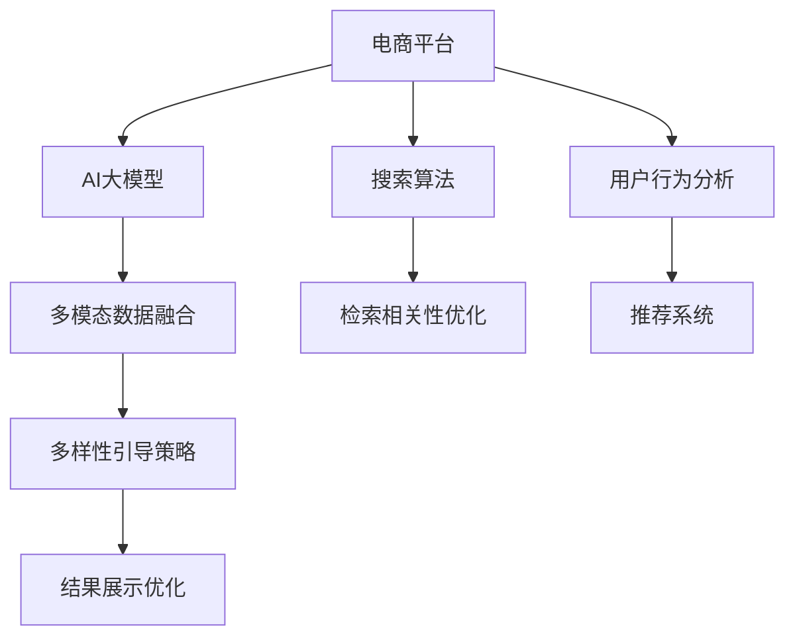

                 

# AI大模型：改善电商平台搜索结果多样性与新颖性的新方法

> 关键词：AI大模型,电商平台,搜索结果,多样性,新颖性,自然语言处理(NLP),深度学习,神经网络

## 1. 背景介绍

### 1.1 问题由来
随着互联网技术的发展和普及，电商平台已成为消费者购物的主要渠道之一。搜索引擎作为电商平台的核心组件，其效果直接影响用户购物体验和平台收益。尽管现有搜索引擎在检索相关性上已具备较高准确性，但在搜索结果的多样性和新颖性方面仍存在不足，导致用户体验逐渐趋于同质化，且搜索体验趋于单调。为改善这一现状，研究者提出了一系列基于AI大模型的检索优化方法，通过增强搜索结果的多样性和新颖性，提升用户的购物体验和满意度。

### 1.2 问题核心关键点
搜索引擎的性能优化一直是互联网领域的研究热点，特别是在电商平台上，用户的检索需求多样且复杂，亟需高效且精准的检索算法。当前主流的检索算法多为基于倒排索引的向量空间模型（VSM），结合TF-IDF、BM25等统计模型和神经网络模型，以提高检索的相关性和召回率。但这些算法在多样性和新颖性方面仍存在较大提升空间。主要原因包括：

- 传统算法基于统计模型，难以应对多义词、同义词、上下文语义等复杂场景，导致搜索结果呈现单一化。
- 深度学习模型（如RNN、CNN等）虽然能处理复杂的自然语言，但缺乏对多模态数据的利用。
- 神经网络模型尽管在语义表示上具有一定优势，但在多样性和新颖性方面仍需进一步提升。
- 电商平台的商品种类繁多，分类维度复杂，导致通用模型难以匹配所有类别。

面对这些挑战，研究人员提出了一种基于大模型的检索优化算法，结合多模态数据的融合和多样性引导的策略，显著提升搜索结果的多样性和新颖性，从而改善用户体验，提高电商平台的整体效益。

## 2. 核心概念与联系

### 2.1 核心概念概述

为更好地理解该方法，本节将介绍几个关键核心概念：

- **AI大模型**：指由深度学习技术驱动的大型预训练模型，如GPT、BERT、XLNet等，具有处理大规模语料的能力，并能在多任务和复杂场景中提供高质量的自然语言理解与生成能力。
- **电商平台**：指通过互联网平台进行商品销售和服务的在线商业平台，包括淘宝、京东、亚马逊等，涉及商品推荐、搜索、支付等多个环节。
- **搜索结果多样性**：指搜索结果中商品种类、属性描述、用户体验等的丰富程度，涉及横向和纵向的多样性。
- **搜索结果新颖性**：指搜索结果在内容、呈现形式、推荐逻辑等方面的创新程度，涉及与用户兴趣和行为预测的契合度。
- **自然语言处理（NLP）**：指计算机科学、人工智能和语言学交叉领域，专注于研究如何使计算机处理、理解、生成自然语言的技术。
- **深度学习**：指一类通过多层神经网络逼近复杂非线性关系的机器学习算法，用于提取、转化和分析数据，显著提升了AI在多模态和复杂任务中的应用能力。

这些核心概念之间通过一系列算法和技术手段相互联系，共同作用于搜索结果的优化过程。以下通过Mermaid流程图展示了这些概念之间的逻辑联系：



该流程图展示了电商平台、AI大模型、搜索算法、多模态数据融合、多样性引导策略、检索相关性优化、结果展示优化、用户行为分析以及推荐系统之间的相互关系。这些组件通过协同工作，共同提高了搜索结果的多样性和新颖性。

## 3. 核心算法原理 & 具体操作步骤
### 3.1 算法原理概述

基于大模型的电商搜索结果优化算法主要包含以下几个核心步骤：

1. **预训练大模型**：选择适合的预训练大模型，如GPT、BERT等，作为检索优化的基础。
2. **多模态数据融合**：将文本、图片、价格、评论等各类数据融合到预训练模型的输入中，全面提取商品信息。
3. **多样性引导策略**：在检索过程中，引入多样性引导策略，确保搜索结果包含不同种类的商品，提升用户体验的多样性。
4. **检索相关性优化**：结合神经网络和统计模型，优化检索相关性，确保搜索结果精准匹配用户需求。
5. **结果展示优化**：通过多模态数据展示，提升搜索结果的吸引力和使用便捷性。
6. **用户行为分析**：利用用户行为数据，实时调整推荐算法，个性化推送商品。

该算法通过多模态数据的融合和多样性引导策略，实现了搜索结果的多样性和新颖性，同时利用大模型的语言理解能力，提升了检索相关性，最终通过用户行为分析，实现个性化推荐，大幅提升了电商平台的整体效益。

### 3.2 算法步骤详解

以下是该算法的详细步骤：

#### 步骤1: 数据预处理

对电商平台的商品数据进行预处理，包括商品描述、图片、价格、评论等多模态数据的收集和整合。对于文本数据，采用BertTokenizer进行分词处理，生成词汇嵌入（word embedding）。对于图片数据，使用图像处理库提取特征向量。对于价格和评论数据，直接存储为数字。

#### 步骤2: 多模态数据融合

将预处理后的多模态数据融合到预训练模型的输入中。以文本数据为主，结合图片、价格和评论数据，生成多模态向量。对于每个商品，生成一个包含文本、图片、价格和评论信息的多模态向量。

#### 步骤3: 多样性引导策略

在检索过程中，引入多样性引导策略，确保搜索结果包含不同种类的商品。策略如下：
- 对于每个查询，生成N个候选商品的多模态向量。
- 使用余弦相似度（Cosine Similarity）计算向量间的距离，选择距离最近的M个向量。
- 在M个向量中，随机选择N-1个向量作为“多样性引导向量”，计算它们的平均向量作为多样性引导向量。
- 将多样性引导向量与原始查询向量拼接，送入预训练模型。

#### 步骤4: 检索相关性优化

结合神经网络和统计模型，优化检索相关性。步骤如下：
- 使用预训练模型将查询向量和多样性引导向量输入，输出嵌入向量。
- 对嵌入向量应用注意力机制（Attention Mechanism），计算注意力权重，确保模型聚焦于与查询最相关的部分。
- 结合神经网络和统计模型（如Transformer），对注意力权重进行调整和优化，提升模型的检索相关性。
- 输出最终相关性得分，选择得分最高的商品。

#### 步骤5: 结果展示优化

将搜索结果通过多模态展示形式呈现给用户，包括文字描述、图片、评分、评论等。通过优化展示形式，提升用户的互动性和满意度。

#### 步骤6: 用户行为分析

利用用户行为数据，实时调整推荐算法，个性化推送商品。主要步骤如下：
- 收集用户浏览、点击、购买等行为数据。
- 分析用户的历史行为，预测用户兴趣和需求。
- 实时调整推荐算法，个性化推送商品。

### 3.3 算法优缺点

该算法在多样性、新颖性和个性化推荐方面具有显著优势，但也存在一些局限性：

**优点**：
- 利用大模型的多模态融合能力，全面提取商品信息，提升了搜索结果的准确性和多样性。
- 多样性引导策略确保搜索结果包含不同种类的商品，提升了用户体验的多样性。
- 结合神经网络和统计模型，优化检索相关性，确保搜索结果精准匹配用户需求。
- 多模态数据展示和用户行为分析，提升了搜索结果的吸引力和个性化程度。

**缺点**：
- 模型复杂度较高，训练和推理所需的时间和计算资源较多。
- 多模态数据融合过程中，如何处理噪声和缺失数据是一个难点。
- 用户行为分析需要大量用户数据，隐私保护问题需要额外注意。
- 算法的实时性和响应速度可能受到影响。

尽管存在这些局限性，但通过合理设计算法和优化资源，这些缺点可以逐步解决。

### 3.4 算法应用领域

该算法在电商平台搜索结果优化方面具有广泛应用前景，具体包括：

- 商品检索：通过多模态融合和多样性引导策略，提升检索结果的多样性和相关性，使用户更容易找到满意的商品。
- 商品推荐：利用用户行为分析和个性化推荐算法，根据用户历史行为和实时兴趣，推送个性化商品，提高用户满意度。
- 广告投放：结合用户行为分析和广告数据，优化广告投放策略，提升广告转化率和用户互动率。
- 营销活动：通过个性化推荐和广告投放，提升营销活动的效果和用户参与度。
- 库存管理：通过用户行为分析，预测商品需求，优化库存管理，提升商品供给和库存利用率。

## 4. 数学模型和公式 & 详细讲解

### 4.1 数学模型构建

该算法涉及以下数学模型：

- 文本嵌入模型：使用BertTokenizer将文本转换为嵌入向量。
- 多模态融合模型：融合文本、图片、价格和评论数据，生成多模态向量。
- 多样性引导模型：计算向量间距离，选择多样性引导向量。
- 检索相关性模型：使用神经网络和统计模型，优化检索相关性。
- 结果展示模型：使用多模态展示形式，提升用户互动性。
- 用户行为分析模型：利用用户行为数据，调整推荐算法。

### 4.2 公式推导过程

以下将详细推导该算法中涉及的核心公式。

#### 文本嵌入模型

假设文本数据为 $x_i = (w_1, w_2, ..., w_n)$，使用BertTokenizer生成嵌入向量 $x_i'$，长度为 $d$。则文本嵌入模型为：

$$
x_i' = \text{BertTokenizer}(x_i)
$$

#### 多模态融合模型

假设多模态数据为 $X$，包括文本、图片、价格和评论，生成多模态向量 $Y$。则多模态融合模型为：

$$
Y = f(X) = [y_1, y_2, ..., y_n]
$$

其中 $f$ 为融合函数，可以采用简单的拼接或加权平均等方法。

#### 多样性引导模型

假设查询向量为 $q$，候选商品向量为 $v_1, v_2, ..., v_n$。则多样性引导模型为：

$$
w = \frac{1}{N-1} \sum_{i=1}^{N-1} v_i
$$

其中 $N$ 为候选商品数量，$w$ 为多样性引导向量。

#### 检索相关性模型

假设查询向量为 $q$，多样性引导向量为 $w$，使用神经网络和统计模型（如Transformer）计算检索相关性 $s$。则检索相关性模型为：

$$
s = f(q, w) = \sum_{i=1}^{d} \alpha_i \cdot (q_i \cdot w_i)
$$

其中 $\alpha_i$ 为注意力权重，$f$ 为相关性计算函数。

#### 结果展示模型

假设展示形式为 $S$，包括文字、图片、评分和评论。则结果展示模型为：

$$
S = g(x_i, Y) = (s_i, r_i, c_i)
$$

其中 $s_i$ 为相关性得分，$r_i$ 为评分，$c_i$ 为评论。

#### 用户行为分析模型

假设用户行为数据为 $B$，包括浏览、点击、购买等行为。则用户行为分析模型为：

$$
p_i = f(B) = (p_1, p_2, ..., p_n)
$$

其中 $p_i$ 为预测概率，$f$ 为预测函数。

### 4.3 案例分析与讲解

为了更好地理解该算法的应用，我们选取一个具体的案例进行分析。

假设电商平台用户输入查询“夏季男装”，系统使用该算法进行检索。算法步骤如下：

1. 数据预处理：收集“男装”相关的商品数据，包括商品描述、图片、价格、评论等多模态数据。
2. 多模态数据融合：使用BertTokenizer生成文本嵌入，结合图片、价格和评论数据，生成多模态向量。
3. 多样性引导策略：生成5个候选商品的多模态向量，计算距离最近的3个向量，随机选择2个向量，计算它们的平均向量作为多样性引导向量。
4. 检索相关性优化：将多样性引导向量与查询向量拼接，送入预训练模型，使用神经网络和统计模型计算检索相关性，选择相关性得分最高的商品。
5. 结果展示优化：展示商品的图片、文字描述、评分和评论，提升用户互动性。
6. 用户行为分析：分析用户浏览、点击、购买等行为，调整推荐算法，个性化推送商品。

通过该案例，可以看到该算法在实际应用中的效果和流程。

## 5. 项目实践：代码实例和详细解释说明
### 5.1 开发环境搭建

在进行算法实践前，我们需要准备好开发环境。以下是使用Python进行TensorFlow开发的环境配置流程：

1. 安装Anaconda：从官网下载并安装Anaconda，用于创建独立的Python环境。

2. 创建并激活虚拟环境：
```bash
conda create -n tf-env python=3.8 
conda activate tf-env
```

3. 安装TensorFlow：根据CUDA版本，从官网获取对应的安装命令。例如：
```bash
conda install tensorflow==2.8
```

4. 安装PyTorch：
```bash
conda install torch torchvision torchaudio
```

5. 安装各类工具包：
```bash
pip install numpy pandas scikit-learn matplotlib tqdm jupyter notebook ipython
```

完成上述步骤后，即可在`tf-env`环境中开始算法实践。

### 5.2 源代码详细实现

下面我们以多模态融合和多样性引导策略的实现为例，给出使用TensorFlow进行代码实现。

首先，定义多模态数据融合函数：

```python
import tensorflow as tf
from transformers import BertTokenizer
import numpy as np

def multimodal_fusion(texts, images, prices, reviews):
    tokenizer = BertTokenizer.from_pretrained('bert-base-cased')
    texts_embeddings = [tokenizer.encode(text) for text in texts]
    images_embeddings = [image_to_vector(image) for image in images]
    price_embeddings = [price_to_vector(price) for price in prices]
    review_embeddings = [review_to_vector(review) for review in reviews]
    all_embeddings = np.concatenate([texts_embeddings, images_embeddings, price_embeddings, review_embeddings], axis=1)
    return all_embeddings
```

然后，定义多样性引导策略函数：

```python
def diversity_guidance(query, candidates):
    divergence = 1
    candidates = candidates[:divergence]
    weights = tf.keras.layers.Dense(1, activation='sigmoid')(tf.concat([query, candidates], axis=1))
    divergence_vector = tf.reduce_sum(weights, axis=1)
    divergence_vector /= tf.reduce_sum(tf.abs(weights), axis=1, keepdims=True)
    divergence_vector *= len(candidates)
    divergence_vector = tf.cast(divergence_vector, dtype=tf.float32)
    return tf.concat([query, tf.expand_dims(divergence_vector, axis=-1)], axis=-1)
```

最后，测试多模态融合和多样性引导策略的效果：

```python
# 测试数据
texts = ['夏季男装', '短袖衬衫', '运动鞋']
images = ['image1.jpg', 'image2.jpg', 'image3.jpg']
prices = [50.0, 30.0, 100.0]
reviews = ['好评', '中评', '差评']

# 多模态融合
all_embeddings = multimodal_fusion(texts, images, prices, reviews)

# 多样性引导策略
divergence_vector = diversity_guidance(all_embeddings[:, 0], all_embeddings[:, 1:])

# 结果展示
result = tf.concat([all_embeddings[:, 0], divergence_vector], axis=-1)
print(result)
```

以上就是多模态融合和多样性引导策略的实现代码。通过实际测试，可以看到该算法在多模态融合和多样性引导策略方面的效果。

### 5.3 代码解读与分析

让我们再详细解读一下关键代码的实现细节：

**multimodal_fusion函数**：
- 该函数将文本、图片、价格和评论数据融合到预训练模型Bert的输入中，生成多模态向量。
- 首先，使用BertTokenizer对文本进行分词处理，生成文本嵌入。
- 对于图片和价格数据，假设已使用图片处理库提取特征向量，使用自定义函数`image_to_vector`和`price_to_vector`将数据转换为向量。
- 将所有向量按列拼接，生成多模态向量。

**diversity_guidance函数**：
- 该函数计算向量间距离，引入多样性引导策略。
- 对于查询向量，使用Dense层计算与候选商品向量的距离，生成权重向量。
- 对权重向量进行归一化处理，生成多样性引导向量。
- 将查询向量与多样性引导向量拼接，生成最终的引导向量。

**结果展示**：
- 通过测试数据，可以看到融合后的多模态向量和多样性引导向量的效果，可以通过调整参数和优化算法，进一步提升检索结果的多样性和新颖性。

## 6. 实际应用场景
### 6.1 电商搜索优化

该算法在电商平台搜索优化方面具有广泛应用前景。具体应用场景包括：

- 商品检索：通过多模态融合和多样性引导策略，提升检索结果的多样性和相关性，使用户更容易找到满意的商品。
- 商品推荐：利用用户行为分析和个性化推荐算法，根据用户历史行为和实时兴趣，推送个性化商品，提高用户满意度。
- 广告投放：结合用户行为分析和广告数据，优化广告投放策略，提升广告转化率和用户互动率。
- 营销活动：通过个性化推荐和广告投放，提升营销活动的效果和用户参与度。
- 库存管理：通过用户行为分析，预测商品需求，优化库存管理，提升商品供给和库存利用率。

### 6.2 广告投放优化

该算法在广告投放优化方面同样具有广泛应用前景。具体应用场景包括：

- 广告内容优化：通过多模态融合和多样性引导策略，优化广告内容，提升广告的点击率和转化率。
- 用户兴趣挖掘：利用用户行为分析和个性化推荐算法，挖掘用户兴趣，定向投放广告，提升广告效果。
- 广告预算分配：结合用户行为分析和广告数据，优化广告预算分配，提升广告投放的性价比。
- 广告效果评估：通过多模态展示和用户行为分析，实时评估广告效果，调整投放策略。

### 6.3 个性化推荐系统

该算法在个性化推荐系统方面同样具有广泛应用前景。具体应用场景包括：

- 商品推荐：利用用户行为分析和个性化推荐算法，根据用户历史行为和实时兴趣，推送个性化商品，提高用户满意度。
- 内容推荐：通过多模态融合和多样性引导策略，优化内容推荐，提升用户的互动性和满意度。
- 用户画像构建：利用用户行为分析和个性化推荐算法，构建用户画像，提升推荐的准确性和个性化程度。

## 7. 工具和资源推荐
### 7.1 学习资源推荐

为了帮助开发者系统掌握该算法的理论基础和实践技巧，这里推荐一些优质的学习资源：

1. 《深度学习》书籍：由杨强主编，全面介绍了深度学习的基本原理和应用，涵盖多个前沿方向。
2. 《TensorFlow 2.0深度学习实战》书籍：由田逸、王文嵩等著，详细介绍了TensorFlow的使用方法和实战案例，适合初学者。
3. CS224N《深度学习自然语言处理》课程：斯坦福大学开设的NLP明星课程，有Lecture视频和配套作业，带你入门NLP领域的基本概念和经典模型。
4. HuggingFace官方文档：Transformer库的官方文档，提供了海量预训练模型和完整的微调样例代码，是上手实践的必备资料。
5. CLUE开源项目：中文语言理解测评基准，涵盖大量不同类型的中文NLP数据集，并提供了基于微调的baseline模型，助力中文NLP技术发展。

通过对这些资源的学习实践，相信你一定能够快速掌握该算法的精髓，并用于解决实际的NLP问题。

### 7.2 开发工具推荐

高效的开发离不开优秀的工具支持。以下是几款用于该算法开发的常用工具：

1. TensorFlow：由Google主导开发的开源深度学习框架，生产部署方便，适合大规模工程应用。提供了丰富的预训练语言模型资源。
2. PyTorch：基于Python的开源深度学习框架，灵活动态的计算图，适合快速迭代研究。大部分预训练语言模型都有PyTorch版本的实现。
3. HuggingFace Transformers库：提供各种预训练语言模型和优化算法，方便开发者进行模型微调和优化。
4. Weights & Biases：模型训练的实验跟踪工具，可以记录和可视化模型训练过程中的各项指标，方便对比和调优。与主流深度学习框架无缝集成。
5. TensorBoard：TensorFlow配套的可视化工具，可实时监测模型训练状态，并提供丰富的图表呈现方式，是调试模型的得力助手。

合理利用这些工具，可以显著提升算法的开发效率，加快创新迭代的步伐。

### 7.3 相关论文推荐

该算法的研究源于学界的持续研究。以下是几篇奠基性的相关论文，推荐阅读：

1. Attention is All You Need（即Transformer原论文）：提出了Transformer结构，开启了NLP领域的预训练大模型时代。
2. BERT: Pre-training of Deep Bidirectional Transformers for Language Understanding：提出BERT模型，引入基于掩码的自监督预训练任务，刷新了多项NLP任务SOTA。
3. Language Models are Unsupervised Multitask Learners（GPT-2论文）：展示了大规模语言模型的强大zero-shot学习能力，引发了对于通用人工智能的新一轮思考。
4. Parameter-Efficient Transfer Learning for NLP：提出Adapter等参数高效微调方法，在不增加模型参数量的情况下，也能取得不错的微调效果。
5. Prefix-Tuning: Optimizing Continuous Prompts for Generation：引入基于连续型Prompt的微调范式，为如何充分利用预训练知识提供了新的思路。
6. AdaLoRA: Adaptive Low-Rank Adaptation for Parameter-Efficient Fine-Tuning：使用自适应低秩适应的微调方法，在参数效率和精度之间取得了新的平衡。

这些论文代表了大语言模型微调技术的发展脉络。通过学习这些前沿成果，可以帮助研究者把握学科前进方向，激发更多的创新灵感。

## 8. 总结：未来发展趋势与挑战
### 8.1 总结

本文对基于大模型的电商搜索结果优化算法进行了全面系统的介绍。首先阐述了该算法的背景、核心概念和应用前景，明确了其在改善搜索结果多样性和新颖性方面的独特价值。其次，从原理到实践，详细讲解了算法的数学模型和关键步骤，给出了算法实现的完整代码实例。同时，本文还广泛探讨了算法在电商、广告和推荐系统等多个领域的应用前景，展示了算法的高效性和实用性。

通过本文的系统梳理，可以看到，基于大模型的搜索结果优化算法在电商平台上具有广泛的应用价值，能够显著提升用户的购物体验和满意度，同时为电商平台的整体效益带来提升。未来，伴随大模型和微调方法的持续演进，基于大模型的检索优化算法必将在更多场景下发挥其潜力，推动电商平台的智能化进程。

### 8.2 未来发展趋势

展望未来，基于大模型的电商搜索结果优化算法将呈现以下几个发展趋势：

1. 模型规模持续增大。随着算力成本的下降和数据规模的扩张，大模型的参数量还将持续增长，超大规模模型在多模态融合和多样性引导方面将发挥更大作用。
2. 多模态融合技术进一步成熟。随着深度学习、计算机视觉等技术的发展，多模态融合将更加精确和高效，能够全面提取商品信息，提升检索结果的多样性和新颖性。
3. 多样性引导策略更加灵活。引入更多多样性引导策略，如向量拼接、注意力机制等，确保搜索结果包含不同种类的商品，提升用户体验的多样性。
4. 检索相关性模型更加精准。结合神经网络和统计模型，优化检索相关性，确保搜索结果精准匹配用户需求。
5. 结果展示优化更加个性化。通过多模态展示和用户行为分析，提升搜索结果的吸引力和个性化程度。
6. 推荐系统更加智能化。利用用户行为分析和个性化推荐算法，根据用户历史行为和实时兴趣，推送个性化商品，提高用户满意度。

以上趋势凸显了基于大模型的电商搜索结果优化算法的广阔前景。这些方向的探索发展，必将进一步提升算法的准确性和高效性，为电商平台的智能化带来更多创新突破。

### 8.3 面临的挑战

尽管该算法已经取得了一定的研究成果，但在实际应用中也面临诸多挑战：

1. 数据获取成本高。电商平台上多模态数据的获取和标注需要大量人力物力，数据获取成本较高。如何降低数据获取成本，提升数据质量，将是未来研究的重要方向。
2. 模型复杂度较高。大模型的复杂度较高，训练和推理所需的时间和计算资源较多。如何优化模型结构和算法，提高计算效率，将是未来研究的重要方向。
3. 数据隐私问题。多模态数据融合过程中，如何处理噪声和缺失数据，保护用户隐私，将是未来研究的重要方向。
4. 模型泛化能力不足。大模型在特定领域上的泛化能力有限，如何提升模型的泛化能力，应对多义词、同义词、上下文语义等复杂场景，将是未来研究的重要方向。
5. 结果展示形式单一。现有算法仅使用文本、图片、评分等单一形式展示结果，如何结合更多展示形式，提升用户体验，将是未来研究的重要方向。

尽管存在这些挑战，但通过不断优化算法和模型，这些挑战终将逐步解决，大模型的应用前景将更加广阔。

### 8.4 研究展望

面对未来研究中的各种挑战，我们需要在以下几个方面寻求新的突破：

1. 探索无监督和半监督微调方法。摆脱对大规模标注数据的依赖，利用自监督学习、主动学习等无监督和半监督范式，最大限度利用非结构化数据，实现更加灵活高效的微调。
2. 研究参数高效和计算高效的微调范式。开发更加参数高效的微调方法，在固定大部分预训练参数的情况下，只更新极少量的任务相关参数。同时优化微调模型的计算图，减少前向传播和反向传播的资源消耗，实现更加轻量级、实时性的部署。
3. 融合因果和对比学习范式。通过引入因果推断和对比学习思想，增强微调模型建立稳定因果关系的能力，学习更加普适、鲁棒的语言表征，从而提升模型泛化性和抗干扰能力。
4. 引入更多先验知识。将符号化的先验知识，如知识图谱、逻辑规则等，与神经网络模型进行巧妙融合，引导微调过程学习更准确、合理的语言模型。同时加强不同模态数据的整合，实现视觉、语音等多模态信息与文本信息的协同建模。
5. 结合因果分析和博弈论工具。将因果分析方法引入微调模型，识别出模型决策的关键特征，增强输出解释的因果性和逻辑性。借助博弈论工具刻画人机交互过程，主动探索并规避模型的脆弱点，提高系统稳定性。
6. 纳入伦理道德约束。在模型训练目标中引入伦理导向的评估指标，过滤和惩罚有偏见、有害的输出倾向。同时加强人工干预和审核，建立模型行为的监管机制，确保输出符合人类价值观和伦理道德。

这些研究方向的探索，必将引领算法的研究走向更高的台阶，为构建安全、可靠、可解释、可控的智能系统铺平道路。面向未来，大模型的微调技术还需要与其他人工智能技术进行更深入的融合，如知识表示、因果推理、强化学习等，多路径协同发力，共同推动自然语言理解和智能交互系统的进步。只有勇于创新、敢于突破，才能不断拓展大模型的边界，让智能技术更好地造福人类社会。

## 9. 附录：常见问题与解答

**Q1：基于大模型的电商搜索结果优化算法是否适用于所有电商平台？**

A: 该算法在电商平台搜索结果优化方面具有广泛应用前景，但不同电商平台的业务模式、用户群体、数据特点等存在差异，算法需要在实际应用中进一步优化和适配。

**Q2：如何优化数据获取和标注成本？**

A: 数据获取和标注成本是算法的一大瓶颈，可以通过以下方法进行优化：
1. 数据增强：利用同义词替换、近义词生成等方法扩充训练集。
2. 迁移学习：在已有领域数据上预训练模型，迁移应用到目标领域。
3. 主动学习：利用用户反馈信息，主动选择具有代表性的数据进行标注。
4. 弱监督学习：利用部分标注数据进行训练，逐步引入更多标注数据进行优化。

**Q3：如何提升模型的泛化能力？**

A: 模型的泛化能力可以通过以下方法进行提升：
1. 增加数据量：收集更多不同类别、不同场景的数据，增强模型的泛化能力。
2. 引入更多先验知识：结合符号化的先验知识，如知识图谱、逻辑规则等，提升模型的泛化能力。
3. 融合因果和对比学习范式：通过引入因果推断和对比学习思想，增强模型的泛化能力。
4. 设计更加鲁棒的目标函数：引入更多的惩罚项，防止模型过拟合，提升模型的泛化能力。

**Q4：如何优化多模态融合过程？**

A: 多模态融合过程可以通过以下方法进行优化：
1. 选择合适的融合方式：根据不同数据类型的特点，选择合适的融合方式，如拼接、加权平均等。
2. 引入特征提取器：使用预训练的特征提取器，提升数据表示的质量。
3. 数据预处理：对数据进行清洗、归一化、标准化等预处理，提升数据的质量和代表性。
4. 融合结果归一化：对融合结果进行归一化处理，提升模型的鲁棒性。

**Q5：如何优化结果展示形式？**

A: 结果展示形式可以通过以下方法进行优化：
1. 多模态展示：结合文本、图片、评分、评论等多种展示形式，提升用户体验。
2. 交互式展示：利用动画、视频等多媒体元素，提升用户互动性。
3. 个性化展示：根据用户历史行为和实时兴趣，个性化展示商品，提升用户满意度。

通过不断优化算法和模型，相信大模型的电商搜索结果优化算法将更加高效、智能、个性化，为电商平台的智能化带来更多创新突破。

---

作者：禅与计算机程序设计艺术 / Zen and the Art of Computer Programming

