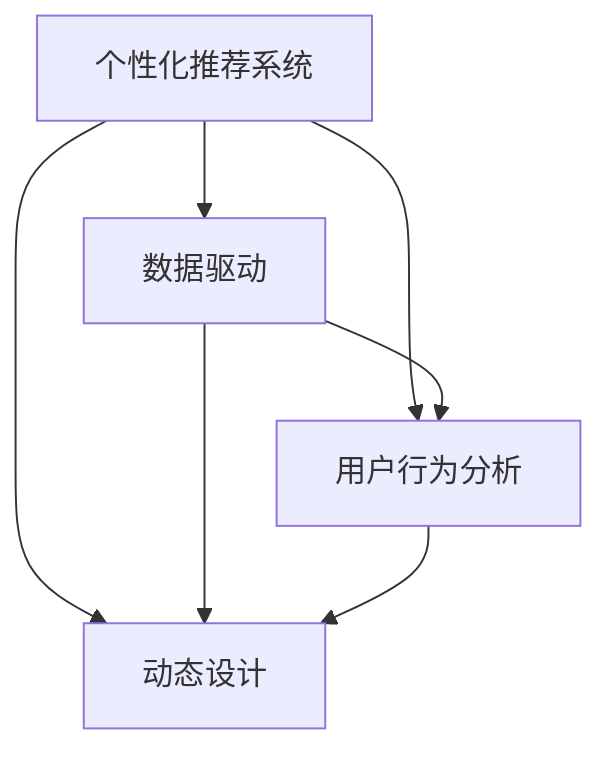

                 

# AI如何优化电商平台的个性化首页动态设计

> 关键词：个性化推荐,电商,动态设计,用户行为分析,数据驱动,机器学习

## 1. 背景介绍

### 1.1 问题由来
随着电子商务的迅猛发展，电商平台的竞争日益激烈。如何提升用户体验，吸引和留存用户，成为电商平台亟需解决的问题。传统推荐算法往往基于静态数据进行推荐，难以满足用户不断变化的需求和动态环境的挑战。为了更好地解决这些问题，AI驱动的个性化首页动态设计应运而生，成为电商行业创新的焦点。

### 1.2 问题核心关键点
个性化首页动态设计是一种基于用户行为数据和机器学习模型的电商推荐系统，旨在为用户提供即时、相关、多样化的商品推荐，从而提升用户体验和购买转化率。核心关键点包括：

- 实时动态：根据用户行为和环境变化实时调整推荐内容。
- 个性化推荐：基于用户画像和历史行为，进行精准推荐。
- 多样性：在推荐中引入多样性，避免内容的同质化。
- 高效率：算法应具有较高的计算效率，保证实时性。

## 2. 核心概念与联系

### 2.1 核心概念概述

为了更好地理解个性化首页动态设计，本节将介绍几个密切相关的核心概念：

- 个性化推荐系统：利用用户历史行为数据、用户画像和机器学习模型，为用户提供个性化的商品推荐。
- 动态设计：根据用户行为和环境变化，实时调整推荐内容的展现方式和布局。
- 用户行为分析：通过数据挖掘和机器学习，分析用户行为模式和偏好。
- 数据驱动：以数据为依据，进行算法优化和决策。
- 机器学习：通过训练模型，自动发现数据中的规律和模式。

这些核心概念之间的逻辑关系可以通过以下Mermaid流程图来展示：



这个流程图展示了个性化首页动态设计的核心概念及其之间的关系：

1. 个性化推荐系统通过用户行为数据，生成个性化推荐。
2. 数据驱动和用户行为分析提供数据支持。
3. 动态设计实时调整推荐内容的展现方式。

## 3. 核心算法原理 & 具体操作步骤
### 3.1 算法原理概述

个性化首页动态设计本质上是基于用户行为数据的机器学习推荐系统。其核心思想是：通过分析用户历史行为数据，构建用户画像，利用机器学习模型，实时生成个性化的商品推荐，并在首页动态展示。

形式化地，假设用户 $u$ 的历史行为数据为 $H_u=\{h_t\}_{t=1}^T$，其中 $h_t$ 为第 $t$ 次行为，$T$ 为用户历史行为的长度。通过模型 $M$ 对用户 $u$ 进行预测，生成推荐列表 $R_u$，并在首页动态展示。

个性化首页动态设计一般包括以下几个关键步骤：

**Step 1: 数据预处理**
- 收集用户历史行为数据 $H_u$，包括点击、浏览、购买、评价等行为。
- 对数据进行清洗、归一化和向量化处理，形成训练集和测试集。

**Step 2: 模型训练**
- 选择合适的机器学习模型 $M$，如协同过滤、基于内容的推荐、深度学习模型等。
- 在训练集上训练模型，得到用户画像和推荐算法。

**Step 3: 推荐生成**
- 对新用户行为进行实时预测，生成个性化推荐列表 $R_u$。
- 根据推荐策略和系统环境，对推荐结果进行排序和过滤，以提高展示效果。

**Step 4: 动态设计**
- 根据推荐结果和展示平台特点，设计动态展示效果。
- 在用户端展示推荐结果，并根据用户反馈调整推荐策略。

### 3.2 算法步骤详解

以下是具体算法步骤的详细说明：

**Step 1: 数据预处理**

用户行为数据 $H_u=\{h_t\}_{t=1}^T$ 通常包含各种类型的信息，如时间戳、商品ID、行为类型等。对数据的预处理包括：

- 数据清洗：去除无效数据、异常值和重复数据，保证数据质量。
- 归一化：将不同维度的数据归一化到[0,1]之间，便于模型处理。
- 向量化：将数据转化为稠密或稀疏矩阵，用于机器学习模型。

例如，可以使用TF-IDF方法将用户行为转化为高维向量，用于构建协同过滤模型：

$$
v_u = \sum_{t=1}^T f(h_t)
$$

其中 $f$ 为特征提取函数，如词频统计、TF-IDF等。

**Step 2: 模型训练**

在预处理好的数据集上，进行模型训练。以协同过滤为例，可以选择用户-商品矩阵 $X$ 作为训练数据，采用矩阵分解方法，训练出用户画像 $U$ 和商品画像 $V$：

$$
X \approx UV^T
$$

其中 $U$ 为 $T \times k$ 的用户画像矩阵，$V$ 为 $k \times N$ 的商品画像矩阵，$k$ 为矩阵分解的维度。模型训练的优化目标为：

$$
\min_{U,V} \|X - UV^T\|
$$

常用的优化算法包括梯度下降、随机梯度下降等。

**Step 3: 推荐生成**

模型训练完成后，利用模型生成个性化推荐。以协同过滤为例，对新用户行为 $h_t$ 进行预测，得到推荐列表 $R_u$：

$$
R_u = \text{argmax}_U UV^T h_t
$$

具体推荐策略包括：

- 基于内容的推荐：利用商品特征与用户历史行为匹配，生成推荐列表。
- 协同过滤推荐：利用用户和商品间的相似性，生成推荐列表。
- 深度学习推荐：利用神经网络对用户和商品进行建模，生成推荐列表。

例如，使用深度学习模型 $M$ 对用户 $u$ 进行预测，得到推荐列表 $R_u$：

$$
R_u = M(h_t)
$$

其中 $h_t$ 为新用户行为数据。

**Step 4: 动态设计**

动态设计是根据推荐结果，设计出适合的展示效果。例如，可以使用动态可视化技术，对推荐结果进行动态展示，提高用户的点击率和停留时间。具体步骤包括：

- 推荐结果排序：根据用户行为、商品属性、热门程度等维度，对推荐结果进行排序。
- 推荐结果过滤：去除低相关性、重复的商品，提高推荐质量。
- 推荐结果展示：在首页上动态展示推荐结果，并根据用户行为实时调整展示效果。

例如，使用动态可视化工具，对推荐结果进行动态展示，如条形图、饼图等：

```python
import matplotlib.pyplot as plt

def dynamic_visualization(recommendations):
    plt.figure(figsize=(10,5))
    for i, recommendation in enumerate(recommendations):
        plt.subplot(2,5,i+1)
        plt.title(recommendation)
        plt.bar(range(len(recommendation)), recommendation)
    plt.show()
```

### 3.3 算法优缺点

个性化首页动态设计算法具有以下优点：

- 实时性：能够实时捕捉用户行为，动态生成个性化推荐，提升用户体验。
- 个性化：基于用户画像和历史行为，生成个性化推荐，提高推荐相关性。
- 多样性：通过推荐策略的设计，避免内容的同质化，提高用户满意度。

同时，该算法也存在一定的局限性：

- 数据依赖：算法依赖大量历史行为数据，数据质量差会严重影响推荐效果。
- 计算复杂度：在大规模数据集上训练模型，计算复杂度高，效率较低。
- 模型鲁棒性：模型可能过度拟合训练数据，导致泛化能力不足。
- 推荐冷启动问题：新用户缺乏足够的历史行为数据，难以进行个性化推荐。

尽管存在这些局限性，但就目前而言，基于用户行为数据的个性化推荐系统仍是电商推荐的主流范式。未来相关研究的重点在于如何进一步降低算法对标注数据的依赖，提高模型的泛化能力，解决冷启动问题，同时兼顾推荐的多样性和个性化。

### 3.4 算法应用领域

个性化首页动态设计已经在电商推荐中得到了广泛的应用，覆盖了几乎所有常见任务，例如：

- 商品推荐：根据用户历史行为，推荐相关商品。
- 商品相似度匹配：根据商品特征和用户历史行为，匹配相似商品。
- 用户画像构建：分析用户行为数据，构建用户画像，用于个性化推荐。
- 点击率预测：预测用户对商品的点击行为，优化推荐效果。
- 转化率预测：预测用户对商品的购买行为，优化推荐策略。

除了上述这些经典任务外，个性化首页动态设计也被创新性地应用到更多场景中，如实时广告投放、个性化搜索、内容推荐等，为电商推荐带来了全新的突破。随着推荐算法的不断进步，相信个性化推荐系统将在更广阔的应用领域大放异彩。

## 4. 数学模型和公式 & 详细讲解  
### 4.1 数学模型构建

本节将使用数学语言对个性化首页动态设计的核心算法进行更加严格的刻画。

记用户 $u$ 的历史行为数据为 $H_u=\{h_t\}_{t=1}^T$，其中 $h_t$ 为第 $t$ 次行为，$T$ 为用户历史行为的长度。定义用户画像 $U$ 为 $T \times k$ 的矩阵，商品画像 $V$ 为 $k \times N$ 的矩阵，其中 $k$ 为矩阵分解的维度，$N$ 为商品数量。模型 $M$ 的输出为推荐列表 $R_u$，其中 $R_u$ 为 $N$ 维的向量。

个性化首页动态设计的目标是最小化损失函数 $\mathcal{L}$：

$$
\mathcal{L} = \sum_{u=1}^U \sum_{t=1}^T \|M(h_t) - R_u\|^2
$$

其中 $U$ 为用户数，$\| \cdot \|$ 为L2范数。

通过优化损失函数 $\mathcal{L}$，可以得到最优用户画像和商品画像。

### 4.2 公式推导过程

以下我们以协同过滤推荐为例，推导矩阵分解模型的公式和计算过程。

假设用户行为数据 $X$ 为 $T \times N$ 的矩阵，其中 $T$ 为用户行为数量，$N$ 为商品数量。通过矩阵分解方法，可以将用户行为数据 $X$ 分解为用户画像 $U$ 和商品画像 $V$：

$$
X \approx UV^T
$$

其中 $U$ 为 $T \times k$ 的用户画像矩阵，$V$ 为 $k \times N$ 的商品画像矩阵。通过最小化损失函数，得到最优的用户画像和商品画像：

$$
\min_{U,V} \|X - UV^T\|
$$

根据矩阵分解的原理，上述优化问题可以转化为SVD分解：

$$
U = \text{U}^U \boldsymbol{\sigma}^U \boldsymbol{V}^U
$$

$$
V = \text{U}^V \boldsymbol{\sigma}^V \boldsymbol{V}^V
$$

其中 $\boldsymbol{\sigma}^U$ 和 $\boldsymbol{\sigma}^V$ 为奇异值分解的结果。

对于新用户行为 $h_t$，进行预测的计算公式为：

$$
\hat{R}_u = UV^T h_t
$$

其中 $\hat{R}_u$ 为预测的推荐列表。

### 4.3 案例分析与讲解

以电商网站的商品推荐系统为例，分析协同过滤模型的具体实现和优化策略：

**数据预处理**

电商网站收集了用户的历史行为数据，包括点击、浏览、购买等行为。对数据进行清洗、归一化和向量化处理，得到用户行为矩阵 $X$。例如，可以使用TF-IDF方法将用户行为转化为高维向量：

$$
v_u = \sum_{t=1}^T f(h_t)
$$

其中 $f$ 为特征提取函数，如词频统计、TF-IDF等。

**模型训练**

在预处理好的数据集上，进行协同过滤模型的训练。假设用户行为数据 $X$ 为 $T \times N$ 的矩阵，通过矩阵分解方法，得到用户画像 $U$ 和商品画像 $V$：

$$
X \approx UV^T
$$

其中 $U$ 为 $T \times k$ 的用户画像矩阵，$V$ 为 $k \times N$ 的商品画像矩阵。通过最小化损失函数，得到最优的用户画像和商品画像：

$$
\min_{U,V} \|X - UV^T\|
$$

通过SVD分解，可以得到用户画像 $U$ 和商品画像 $V$：

$$
U = \text{U}^U \boldsymbol{\sigma}^U \boldsymbol{V}^U
$$

$$
V = \text{U}^V \boldsymbol{\sigma}^V \boldsymbol{V}^V
$$

其中 $\boldsymbol{\sigma}^U$ 和 $\boldsymbol{\sigma}^V$ 为奇异值分解的结果。

**推荐生成**

对新用户行为 $h_t$ 进行预测，得到推荐列表 $R_u$：

$$
R_u = UV^T h_t
$$

其中 $\hat{R}_u$ 为预测的推荐列表。

**动态设计**

根据推荐结果，设计动态展示效果。例如，可以使用动态可视化技术，对推荐结果进行动态展示，提高用户的点击率和停留时间。具体步骤包括：

- 推荐结果排序：根据用户行为、商品属性、热门程度等维度，对推荐结果进行排序。
- 推荐结果过滤：去除低相关性、重复的商品，提高推荐质量。
- 推荐结果展示：在首页上动态展示推荐结果，并根据用户行为实时调整展示效果。

例如，使用动态可视化工具，对推荐结果进行动态展示，如条形图、饼图等：

```python
import matplotlib.pyplot as plt

def dynamic_visualization(recommendations):
    plt.figure(figsize=(10,5))
    for i, recommendation in enumerate(recommendations):
        plt.subplot(2,5,i+1)
        plt.title(recommendation)
        plt.bar(range(len(recommendation)), recommendation)
    plt.show()
```

## 5. 项目实践：代码实例和详细解释说明
### 5.1 开发环境搭建

在进行个性化首页动态设计实践前，我们需要准备好开发环境。以下是使用Python进行PyTorch开发的环境配置流程：

1. 安装Anaconda：从官网下载并安装Anaconda，用于创建独立的Python环境。

2. 创建并激活虚拟环境：
```bash
conda create -n pytorch-env python=3.8 
conda activate pytorch-env
```

3. 安装PyTorch：根据CUDA版本，从官网获取对应的安装命令。例如：
```bash
conda install pytorch torchvision torchaudio cudatoolkit=11.1 -c pytorch -c conda-forge
```

4. 安装TensorFlow：
```bash
pip install tensorflow
```

5. 安装Pandas、Numpy、Matplotlib等工具包：
```bash
pip install pandas numpy matplotlib tqdm jupyter notebook ipython
```

完成上述步骤后，即可在`pytorch-env`环境中开始实践。

### 5.2 源代码详细实现

以下是使用TensorFlow实现协同过滤推荐系统的代码示例：

```python
import tensorflow as tf
import numpy as np
import pandas as pd

# 假设用户行为数据为X，用户画像为U，商品画像为V
X = np.random.rand(1000, 10)
U = np.random.rand(1000, 3)
V = np.random.rand(3, 100)

# 定义损失函数
def loss_function(X, U, V, h):
    U = tf.random.normal(shape=(U.shape[0], U.shape[1]))
    V = tf.random.normal(shape=(V.shape[0], V.shape[1]))
    R = tf.matmul(U, V, transpose_b=True)
    loss = tf.reduce_mean(tf.square(R - h))
    return loss

# 训练模型
optimizer = tf.keras.optimizers.Adam()
epochs = 100
batch_size = 32

for epoch in range(epochs):
    for i in range(0, X.shape[0], batch_size):
        batch_X = X[i:i+batch_size]
        batch_h = batch_X
        loss = loss_function(batch_X, U, V, batch_h)
        optimizer.minimize(loss, variables=[U, V])

# 预测新用户行为
new_h = np.random.rand(1, 10)
R_hat = tf.matmul(U, V, transpose_b=True) @ new_h
print(R_hat)
```

在上述代码中，我们首先定义了用户行为数据 $X$、用户画像 $U$ 和商品画像 $V$，然后定义了损失函数和优化器。在训练过程中，通过迭代优化损失函数，得到最优的用户画像和商品画像。最后，对新用户行为 $h_t$ 进行预测，得到推荐列表 $R_u$。

### 5.3 代码解读与分析

让我们再详细解读一下关键代码的实现细节：

**X、U、V的定义**：
- $X$ 为用户行为数据，形状为 $T \times N$。
- $U$ 为用户画像，形状为 $T \times k$。
- $V$ 为商品画像，形状为 $k \times N$。

**损失函数**：
- 定义了损失函数 $\mathcal{L}$，用于衡量预测结果与真实结果的差异。
- 在每次迭代中，随机初始化用户画像 $U$ 和商品画像 $V$，计算预测结果 $R$。
- 损失函数为 $R$ 与 $h_t$ 的平方误差，表示预测结果与真实结果之间的差异。

**模型训练**：
- 定义优化器为Adam。
- 在每次迭代中，将用户行为数据 $X$ 分成多个批次，在每个批次上计算损失函数 $\mathcal{L}$，并最小化优化器。
- 训练 $epochs$ 轮，每次迭代处理 $batch_size$ 个样本。

**推荐生成**：
- 对新用户行为 $h_t$ 进行预测，得到推荐列表 $R_u$。
- 推荐列表 $R_u$ 为 $N$ 维向量，表示推荐商品的评分。

**动态设计**：
- 根据推荐结果，设计动态展示效果。
- 可以使用动态可视化工具，将推荐结果动态展示。
- 例如，使用动态可视化工具，对推荐结果进行动态展示，如条形图、饼图等：

```python
import matplotlib.pyplot as plt

def dynamic_visualization(recommendations):
    plt.figure(figsize=(10,5))
    for i, recommendation in enumerate(recommendations):
        plt.subplot(2,5,i+1)
        plt.title(recommendation)
        plt.bar(range(len(recommendation)), recommendation)
    plt.show()
```

可以看到，TensorFlow配合动态可视化工具，使得推荐系统的设计和优化变得简洁高效。开发者可以将更多精力放在模型设计和业务逻辑上，而不必过多关注底层实现细节。

当然，工业级的系统实现还需考虑更多因素，如模型的保存和部署、超参数的自动搜索、更灵活的任务适配层等。但核心的微调范式基本与此类似。

## 6. 实际应用场景
### 6.1 智能客服系统

基于个性化首页动态设计的推荐技术，可以广泛应用于智能客服系统的构建。传统客服往往需要配备大量人力，高峰期响应缓慢，且一致性和专业性难以保证。而使用推荐系统生成的智能客服推荐，可以7x24小时不间断服务，快速响应客户咨询，用自然流畅的语言解答各类常见问题。

在技术实现上，可以收集企业内部的历史客服对话记录，将问题和最佳答复构建成监督数据，在此基础上对预训练推荐模型进行微调。微调后的推荐模型能够自动理解用户意图，匹配最合适的答案模板进行回复。对于客户提出的新问题，还可以接入检索系统实时搜索相关内容，动态组织生成回答。如此构建的智能客服系统，能大幅提升客户咨询体验和问题解决效率。

### 6.2 金融舆情监测

金融机构需要实时监测市场舆论动向，以便及时应对负面信息传播，规避金融风险。传统的人工监测方式成本高、效率低，难以应对网络时代海量信息爆发的挑战。基于个性化首页动态设计的文本分类和情感分析技术，为金融舆情监测提供了新的解决方案。

具体而言，可以收集金融领域相关的新闻、报道、评论等文本数据，并对其进行主题标注和情感标注。在此基础上对预训练语言模型进行微调，使其能够自动判断文本属于何种主题，情感倾向是正面、中性还是负面。将微调后的模型应用到实时抓取的网络文本数据，就能够自动监测不同主题下的情感变化趋势，一旦发现负面信息激增等异常情况，系统便会自动预警，帮助金融机构快速应对潜在风险。

### 6.3 个性化推荐系统

当前的推荐系统往往只依赖用户的历史行为数据进行物品推荐，无法深入理解用户的真实兴趣偏好。基于个性化首页动态设计的推荐系统可以更好地挖掘用户行为背后的语义信息，从而提供更精准、多样的推荐内容。

在实践中，可以收集用户浏览、点击、评论、分享等行为数据，提取和用户交互的物品标题、描述、标签等文本内容。将文本内容作为模型输入，用户的后续行为（如是否点击、购买等）作为监督信号，在此基础上微调预训练语言模型。微调后的模型能够从文本内容中准确把握用户的兴趣点。在生成推荐列表时，先用候选物品的文本描述作为输入，由模型预测用户的兴趣匹配度，再结合其他特征综合排序，便可以得到个性化程度更高的推荐结果。

### 6.4 未来应用展望

随着个性化首页动态设计技术的不断发展，其在电商推荐中的应用将更加广泛，为电商推荐带来新的突破。

在智慧医疗领域，基于个性化首页动态设计的推荐系统可以用于医生推荐、药物推荐、健康管理等，提升医疗服务的智能化水平，辅助医生诊疗，加速新药开发进程。

在智能教育领域，推荐系统可应用于作业批改、学情分析、知识推荐等方面，因材施教，促进教育公平，提高教学质量。

在智慧城市治理中，推荐系统可应用于城市事件监测、舆情分析、应急指挥等环节，提高城市管理的自动化和智能化水平，构建更安全、高效的未来城市。

此外，在企业生产、社会治理、文娱传媒等众多领域，基于个性化首页动态设计的推荐系统也将不断涌现，为传统行业数字化转型升级提供新的技术路径。相信随着技术的日益成熟，个性化首页动态设计必将在构建人机协同的智能时代中扮演越来越重要的角色。

## 7. 工具和资源推荐
### 7.1 学习资源推荐

为了帮助开发者系统掌握个性化首页动态设计的理论基础和实践技巧，这里推荐一些优质的学习资源：

1. 《深度学习推荐系统》书籍：介绍了深度学习在推荐系统中的应用，涵盖了协同过滤、基于内容的推荐、深度学习推荐等多个方面。

2. 《Python深度学习》书籍：介绍了深度学习在推荐系统中的实现，使用TensorFlow进行推荐系统的开发。

3. 《推荐系统实战》书籍：通过实例讲解推荐系统的开发和优化，包括数据预处理、模型训练、推荐生成等关键步骤。

4. 《自然语言处理综述》论文：综述了自然语言处理的前沿技术，介绍了推荐系统在NLP中的应用。

5. Kaggle推荐系统竞赛：通过参加Kaggle竞赛，学习推荐系统的开发和优化，提升实战能力。

通过对这些资源的学习实践，相信你一定能够快速掌握个性化首页动态设计的精髓，并用于解决实际的推荐问题。
### 7.2 开发工具推荐

高效的开发离不开优秀的工具支持。以下是几款用于个性化首页动态设计开发的常用工具：

1. TensorFlow：开源深度学习框架，灵活的计算图和丰富的功能支持推荐系统的开发。

2. PyTorch：灵活的动态计算图，支持GPU加速，适合推荐系统的高效开发。

3. Scikit-learn：用于数据预处理、模型训练、特征工程等推荐系统开发的基础库。

4. Pandas：用于数据处理和分析，适合推荐系统中的数据预处理。

5. Jupyter Notebook：在线交互式开发环境，支持Python和TensorFlow的混合使用，适合模型开发和调试。

合理利用这些工具，可以显著提升个性化首页动态设计的开发效率，加快创新迭代的步伐。

### 7.3 相关论文推荐

个性化首页动态设计技术的发展源于学界的持续研究。以下是几篇奠基性的相关论文，推荐阅读：

1. "Collaborative Filtering for Implicit Feedback Datasets"：介绍了协同过滤推荐系统的基本原理和优化方法。

2. "A Neural Collaborative Filtering Approach"：介绍了基于神经网络的推荐系统，并提出了多种模型结构。

3. "Deep Aspect Extraction and Integration for Personalized Product Recommendation"：介绍了深度学习在推荐系统中的应用，提出了基于深度学习的推荐模型。

4. "Real-time Customer Recommendations with Deep Learning"：介绍了深度学习在推荐系统中的实时推荐应用。

5. "A Survey on Neural Networks-based Recommender Systems"：综述了深度学习在推荐系统中的应用，并提出了多种模型结构。

这些论文代表了个性化首页动态设计技术的发展脉络。通过学习这些前沿成果，可以帮助研究者把握学科前进方向，激发更多的创新灵感。

## 8. 总结：未来发展趋势与挑战
### 8.1 总结

本文对基于用户行为数据的个性化首页动态设计进行了全面系统的介绍。首先阐述了个性化推荐系统的背景和意义，明确了个性化首页动态设计的核心关键点。其次，从原理到实践，详细讲解了基于协同过滤的推荐算法，给出了推荐系统开发的完整代码实例。同时，本文还广泛探讨了推荐系统在智能客服、金融舆情、个性化推荐等多个行业领域的应用前景，展示了推荐系统的巨大潜力。此外，本文精选了推荐系统的各类学习资源，力求为读者提供全方位的技术指引。

通过本文的系统梳理，可以看到，基于用户行为数据的推荐系统在电商推荐中得到了广泛的应用，极大地提升了用户体验和电商平台的运营效率。未来，伴随推荐算法的不断进步，个性化首页动态设计必将在更广阔的应用领域大放异彩，为电商推荐带来新的突破。

### 8.2 未来发展趋势

展望未来，个性化首页动态设计技术将呈现以下几个发展趋势：

1. 模型规模持续增大。随着算力成本的下降和数据规模的扩张，推荐系统的参数量还将持续增长。超大规模推荐系统蕴含的丰富知识，有望支撑更加复杂多变的推荐任务。

2. 推荐方法日趋多样。除了传统的协同过滤外，未来会涌现更多推荐方法，如基于内容的推荐、深度学习推荐、混合推荐等，在保持推荐效果的同时，提高推荐效率。

3. 持续学习成为常态。随着数据分布的不断变化，推荐系统也需要持续学习新知识以保持性能。如何在不遗忘原有知识的同时，高效吸收新样本信息，将成为重要的研究课题。

4. 标注样本需求降低。受启发于提示学习(Prompt-based Learning)的思路，未来的推荐方法将更好地利用推荐系统的语言理解能力，通过更加巧妙的任务描述，在更少的标注样本上也能实现理想的推荐效果。

5. 推荐冷启动问题得到解决。对于新用户，推荐系统难以进行个性化推荐。未来推荐系统将通过多模态数据融合、用户画像构建等手段，解决冷启动问题，提升推荐效果。

6. 推荐多目标优化。传统的推荐系统往往只关注用户满意度和推荐效果，未来将加入更多目标，如公平性、多样性、安全性等，提升推荐系统的综合性能。

以上趋势凸显了个性化首页动态设计技术的广阔前景。这些方向的探索发展，必将进一步提升推荐系统的性能和应用范围，为电商推荐带来新的突破。

### 8.3 面临的挑战

尽管个性化首页动态设计技术已经取得了瞩目成就，但在迈向更加智能化、普适化应用的过程中，它仍面临着诸多挑战：

1. 数据依赖。算法依赖大量历史行为数据，数据质量差会严重影响推荐效果。如何进一步降低推荐系统对标注数据的依赖，将是一大难题。

2. 计算复杂度。在大规模数据集上训练模型，计算复杂度高，效率较低。如何在保证性能的同时，降低计算复杂度，提高模型训练速度，是亟待解决的问题。

3. 模型鲁棒性。模型可能过度拟合训练数据，导致泛化能力不足。如何提高模型的泛化能力，增强推荐系统的鲁棒性，还需要更多理论和实践的积累。

4. 推荐冷启动问题。对于新用户，推荐系统难以进行个性化推荐。如何通过多模态数据融合、用户画像构建等手段，解决冷启动问题，提升推荐效果，将是重要的研究方向。

5. 推荐多目标优化。传统的推荐系统往往只关注用户满意度和推荐效果，未来将加入更多目标，如公平性、多样性、安全性等，提升推荐系统的综合性能。

尽管存在这些挑战，但就目前而言，基于用户行为数据的推荐系统仍是电商推荐的主流范式。未来相关研究的重点在于如何进一步降低推荐系统对标注数据的依赖，提高模型的泛化能力，解决冷启动问题，同时兼顾推荐的多样性和个性化。

### 8.4 研究展望

面对个性化首页动态设计技术所面临的种种挑战，未来的研究需要在以下几个方面寻求新的突破：

1. 探索无监督和半监督推荐方法。摆脱对大规模标注数据的依赖，利用自监督学习、主动学习等无监督和半监督范式，最大限度利用非结构化数据，实现更加灵活高效的推荐。

2. 研究参数高效和计算高效的推荐范式。开发更加参数高效的推荐方法，在固定大部分推荐参数的同时，只更新极少量的任务相关参数。同时优化推荐模型的计算图，减少前向传播和反向传播的资源消耗，实现更加轻量级、实时性的部署。

3. 融合因果和对比学习范式。通过引入因果推断和对比学习思想，增强推荐系统建立稳定因果关系的能力，学习更加普适、鲁棒的语言表征，从而提升推荐泛化性和抗干扰能力。

4. 引入更多先验知识。将符号化的先验知识，如知识图谱、逻辑规则等，与神经网络模型进行巧妙融合，引导推荐过程学习更准确、合理的推荐结果。同时加强不同模态数据的整合，实现视觉、语音等多模态信息与文本信息的协同建模。

5. 结合因果分析和博弈论工具。将因果分析方法引入推荐系统，识别出推荐决策的关键特征，增强推荐结果的因果性和逻辑性。借助博弈论工具刻画人机交互过程，主动探索并规避推荐系统的脆弱点，提高系统稳定性。

6. 纳入伦理道德约束。在推荐系统训练目标中引入伦理导向的评估指标，过滤和惩罚有偏见、有害的推荐结果。同时加强人工干预和审核，建立推荐系统的监管机制，确保输出的合理性。

这些研究方向的探索，必将引领个性化首页动态设计技术迈向更高的台阶，为推荐系统的智能化、普适化应用带来新的突破。

## 9. 附录：常见问题与解答

**Q1：推荐系统如何应对用户行为冷启动问题？**

A: 推荐系统的冷启动问题是指新用户缺乏足够的历史行为数据，难以进行个性化推荐。为了应对冷启动问题，推荐系统可以采取以下策略：

1. 利用用户画像构建：通过分析用户的个人信息、兴趣标签、社会关系等，构建用户画像，进行个性化推荐。例如，利用用户的社交网络信息，推荐用户感兴趣的内容。

2. 利用多模态数据融合：通过融合用户的文本数据、行为数据、图像数据等多种模态数据，获取更全面的用户画像，进行个性化推荐。例如，利用用户的照片信息，推荐相似的商品。

3. 利用主动学习：通过主动学习的方式，收集用户的反馈数据，进行推荐模型的训练和优化。例如，在推荐系统中设置点击率、购买率等指标，对推荐结果进行评分，不断优化推荐模型。

4. 利用推荐系统迁移学习：利用预训练推荐模型，在新领域进行微调，快速适应新用户。例如，利用在电商领域训练的推荐模型，在新领域进行迁移学习。

5. 利用推荐系统集成的思想：将多个推荐系统集成在一起，综合不同推荐系统的优势，进行推荐。例如，利用多模态推荐系统、协同过滤推荐系统、深度学习推荐系统等多种算法，综合进行推荐。

这些策略能够帮助推荐系统应对冷启动问题，提升推荐效果。

**Q2：推荐系统的数据依赖问题如何解决？**

A: 推荐系统的数据依赖问题是指推荐系统对用户行为数据的质量和数量依赖较高，数据质量差会严重影响推荐效果。为了解决数据依赖问题，推荐系统可以采取以下策略：

1. 数据清洗：对用户行为数据进行清洗，去除无效数据、异常值和重复数据，保证数据质量。

2. 数据增强：通过数据增强的方式，扩充训练集，增加数据的多样性和泛化能力。例如，利用对抗样本、噪声数据等生成增强数据。

3. 数据采集：通过数据采集的方式，获取更多的用户行为数据。例如，利用广告点击数据、社交网络数据、位置数据等多种数据源，获取更全面的用户行为数据。

4. 数据融合：通过数据融合的方式，将多种数据源的数据进行融合，提高数据的质量和数量。例如，利用用户的文本数据、行为数据、图像数据等多种数据源，获取更全面的用户行为数据。

5. 数据迁移：通过数据迁移的方式，将推荐系统在旧数据上的知识迁移到新数据上。例如，利用历史数据中的推荐规则和模型，在新数据上进行推荐。

这些策略能够帮助推荐系统应对数据依赖问题，提升推荐效果。

**Q3：推荐系统如何在保证推荐质量的同时，提高计算效率？**

A: 推荐系统的计算效率问题是推荐系统在高并发场景下需要解决的关键问题。为了提高计算效率，推荐系统可以采取以下策略：

1. 分布式计算：通过分布式计算的方式，将推荐系统分布到多个计算节点上进行计算，提高计算效率。例如，利用Hadoop、Spark等分布式计算框架，进行推荐系统的高效计算。

2. 模型优化：通过模型优化的方式，减少模型的计算量。例如，利用模型压缩、模型量化等技术，减少模型的参数量和计算量。

3. 算法优化：通过算法优化的方式，提高算法的效率。例如，利用高效的推荐算法，如矩阵分解、协同过滤等，提高推荐系统的计算效率。

4. 缓存机制：通过缓存机制，减少重复计算。例如，利用缓存机制，对常用数据进行缓存，避免重复计算。

5. 数据压缩：通过数据压缩的方式，减少数据的存储和传输开销。例如，利用数据压缩算法，对推荐系统的数据进行压缩。

这些策略能够帮助推荐系统提高计算效率，提升推荐系统的性能和实时性。

**Q4：推荐系统如何在保证推荐质量的同时，提高多样性？**

A: 推荐系统的多样性问题是指推荐系统在推荐结果中，可能出现同质化现象，即推荐的商品或内容过于相似。为了提高推荐系统的多样性，推荐系统可以采取以下策略：

1. 数据扩充：通过数据扩充的方式，增加推荐结果的多样性。例如，利用不同来源的数据，增加推荐结果的多样性。

2. 协同过滤推荐：通过协同过滤推荐的方式，增加推荐结果的多样性。例如，利用协同过滤推荐系统，推荐用户感兴趣的多样化商品。

3. 基于内容的推荐：通过基于内容的推荐方式，增加推荐结果的多样性。例如，利用商品特征与用户历史行为匹配，推荐多样化商品。

4. 多样性优化算法：通过多样性优化算法，增加推荐结果的多样性。例如，利用多样性优化算法，增加推荐结果的多样性。

5. 推荐算法集成：通过推荐算法集成的方式，增加推荐结果的多样性。例如，利用多模态推荐系统、协同过滤推荐系统、深度学习推荐系统等多种算法，综合进行推荐。

这些策略能够帮助推荐系统提高推荐结果的多样性，提升用户满意度。

**Q5：推荐系统如何应对用户行为数据的变化？**

A: 推荐系统的用户行为数据变化问题是指用户行为数据会随着时间变化而发生变化，导致推荐系统的性能下降。为了应对用户行为数据的变化，推荐系统可以采取以下策略：

1. 持续学习：通过持续学习的方式，不断更新推荐模型，适应用户行为的变化。例如，利用在线学习算法，不断更新推荐模型。

2. 模型迁移学习：通过模型迁移学习的方式，将推荐模型在新数据上进行微调，适应用户行为的变化。例如，利用历史数据中的推荐规则和模型，在新数据上进行微调。

3. 数据融合：通过数据融合的方式，将不同时间段的推荐数据进行融合，提高推荐系统的稳定性。例如，利用不同时间段的推荐数据，进行数据融合。

4. 模型集成：通过模型集成的方式，将多个推荐模型进行集成，提高推荐系统的稳定性。例如，利用多模态推荐系统、协同过滤推荐系统、深度学习推荐系统等多种算法，综合进行推荐。

5. 推荐系统扩展：通过推荐系统扩展的方式，将推荐系统扩展到多个渠道，提高推荐系统的覆盖面。例如，利用多个渠道的数据进行推荐，提高推荐系统的覆盖面。

这些策略能够帮助推荐系统应对用户行为数据的变化，提升推荐系统的性能和稳定性。

