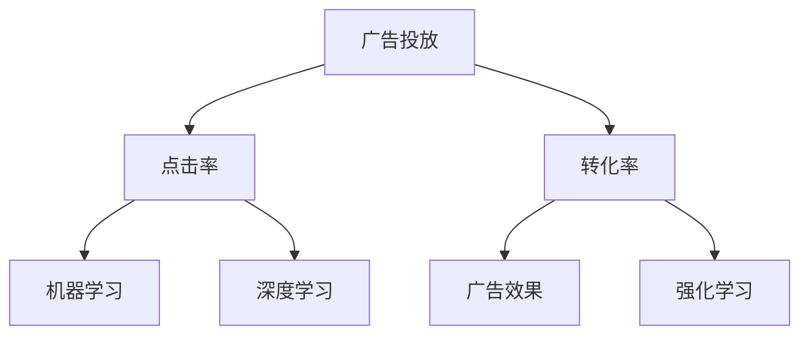

                 

# AI如何优化电商平台的搜索广告投放

> 关键词：AI广告投放,电商平台,搜索优化,点击率(CTR),转化率,用户行为分析,机器学习

## 1. 背景介绍

### 1.1 问题由来

随着电子商务平台的迅速崛起，广告投放已成为各电商企业营销策略的重要组成部分。传统的广告投放往往基于人工经验，存在效率低、成本高、转化率低等诸多问题。而随着人工智能技术的不断进步，基于AI的广告投放系统逐步成为电商平台的标配。通过大数据分析和机器学习算法，AI广告投放系统可以实时分析用户行为，精确匹配目标用户，实现广告投放的自动化和智能化。

然而，尽管AI广告投放系统已经在电商广告投放中得到了广泛应用，但仍存在一些挑战：如何高效利用海量数据，优化广告投放策略？如何精准定位用户，提升广告点击率和转化率？如何在控制成本的同时，实现广告投放的最大化收益？本文将围绕这些问题，探讨AI如何优化电商平台的搜索广告投放。

### 1.2 问题核心关键点

AI优化电商广告投放的核心在于：
- 高效利用数据，提升广告投放效果。
- 精准定位用户，实现个性化广告投放。
- 控制广告成本，提升广告ROI。
- 实时分析用户行为，优化广告投放策略。
- 动态调整广告投放，保持竞争优势。

## 2. 核心概念与联系

### 2.1 核心概念概述

为更好地理解AI优化电商平台搜索广告投放的方法，本节将介绍几个密切相关的核心概念：

- 广告投放(Ad Placement)：通过选择合适的广告位和目标受众，在合适的时机投放广告，吸引用户点击和转化。
- 点击率(CTR)：用户看到广告后点击的比例。
- 转化率(Conversion Rate)：点击广告后，用户完成转化（如购买、注册等）的比例。
- 机器学习(Machine Learning)：通过训练模型，自动从数据中学习规律，用于优化广告投放策略。
- 深度学习(Deep Learning)：一种特殊的机器学习算法，通过多层神经网络，实现更加复杂的模型训练和特征提取。
- 强化学习(Reinforcement Learning)：通过模拟环境与智能体交互，逐步优化广告投放策略，提升投放效果。

这些核心概念之间的逻辑关系可以通过以下Mermaid流程图来展示：



这个流程图展示了大广告投放的核心概念及其之间的关系：

1. 广告投放是广告投放策略的执行环节，目标是通过合适的广告位和用户定位，实现广告的最大化效果。
2. 点击率和转化率是广告效果的重要指标，衡量广告的吸引力和转化效果。
3. 机器学习、深度学习和强化学习是广告优化的方法，通过训练模型自动学习优化广告投放策略。

## 3. 核心算法原理 & 具体操作步骤

### 3.1 算法原理概述

AI优化电商平台搜索广告投放，本质上是利用机器学习和深度学习技术，基于广告历史数据和用户行为数据，自动学习并优化广告投放策略的过程。其核心思想是：通过对用户行为数据的分析，识别用户兴趣和行为模式，精准匹配用户与广告，提升广告投放效果。

形式化地，假设广告投放的输入为用户的兴趣特征和行为特征，输出为最优的广告位和用户定位策略。设 $\theta$ 为模型的参数，通过监督学习或强化学习，寻找最优参数 $\theta^*$，使得模型在广告投放任务上的性能指标最大化。常见的性能指标包括点击率、转化率、平均点击成本(CPC)等。

### 3.2 算法步骤详解

AI优化电商平台搜索广告投放的过程主要包括以下几个步骤：

**Step 1: 数据预处理**
- 收集广告投放数据、用户行为数据、商品信息等。
- 对数据进行清洗、去重、归一化等预处理操作，准备用于模型训练。

**Step 2: 特征工程**
- 提取用户兴趣特征，如浏览记录、搜索历史、购买记录等。
- 提取商品特征，如商品名称、描述、价格、销量等。
- 构建广告投放的特征向量，涵盖用户和商品的综合信息。

**Step 3: 模型训练**
- 选择合适的机器学习算法，如线性回归、随机森林、梯度提升树等。
- 训练模型，使用历史广告投放数据和用户行为数据，学习广告投放的规律和用户行为模式。
- 评估模型性能，使用交叉验证等方法，确保模型泛化能力。

**Step 4: 广告投放优化**
- 使用训练好的模型，预测用户对不同广告位的兴趣和转化倾向。
- 实时优化广告投放策略，动态调整广告位、广告创意和投放预算。
- 实时监控广告效果，及时调整策略，保持最优投放效果。

**Step 5: 反馈循环**
- 收集用户反馈数据，进行广告投放效果的评估。
- 将反馈数据用于模型迭代，不断优化广告投放策略。
- 定期重新训练模型，确保模型始终保持最新的投放策略。

以上是AI优化电商平台搜索广告投放的一般流程。在实际应用中，还需要针对具体电商平台的业务场景，对各个环节进行优化设计，如引入实时推荐系统、利用用户行为预测未来趋势等。

### 3.3 算法优缺点

AI优化电商平台搜索广告投放方法具有以下优点：
1. 自动化高效率。通过模型自动学习，减少了人工干预，提升了广告投放的效率和效果。
2. 个性化精准投放。基于用户行为和兴趣的精准分析，实现个性化广告投放，提升广告点击率和转化率。
3. 实时调整优化。通过实时监控和反馈，动态调整广告投放策略，保持最优投放效果。
4. 适应多样场景。可应用于多种电商广告投放场景，如搜索广告、推荐广告、横幅广告等。

同时，该方法也存在一定的局限性：
1. 数据需求量大。需要大量历史数据和用户行为数据，数据收集成本较高。
2. 模型复杂度高。深度学习模型参数众多，训练和推理计算复杂。
3. 模型黑盒问题。深度学习模型难以解释其内部决策机制，不利于调试和优化。
4. 用户隐私问题。广告投放需要收集用户行为数据，如何保护用户隐私，成为重要的伦理问题。

尽管存在这些局限性，但就目前而言，AI优化电商平台搜索广告投放方法仍是目前电商广告投放的主要范式。未来相关研究的重点在于如何进一步降低数据需求，提高模型效率，同时兼顾用户隐私保护和模型可解释性等因素。

### 3.4 算法应用领域

AI优化电商平台搜索广告投放方法在多个电商广告投放场景中都有广泛应用，例如：

- 搜索广告优化：基于用户搜索记录和点击行为，实时优化广告位和广告创意。
- 推荐广告优化：根据用户历史行为和商品特征，推荐相关商品广告，提高转化率。
- 横幅广告优化：根据用户浏览行为和广告展示时间，实时调整横幅广告的展示位置和内容。
- 视频广告优化：分析用户观看视频广告的行为，优化广告内容和时间，提升广告效果。
- 动态广告优化：基于用户实时行为，动态调整广告投放策略，提升广告点击率和转化率。

除了这些常见的广告投放场景外，AI广告投放技术还在新兴的电商场景中得到了创新应用，如社交电商、直播电商、内容电商等，为电商广告投放带来了全新的突破。随着AI广告投放技术的不断进步，相信电商广告投放将迎来更大的智能化升级，提升用户体验和电商平台运营效率。

## 4. 数学模型和公式 & 详细讲解

### 4.1 数学模型构建

本节将使用数学语言对AI优化电商平台搜索广告投放过程进行更加严格的刻画。

记广告投放的数据集为 $D=\{(x_i,y_i)\}_{i=1}^N$，其中 $x_i$ 表示用户特征向量，$y_i$ 表示广告投放效果（如点击率、转化率等）。假设广告投放的效果函数为 $f(x,\theta)$，其中 $\theta$ 为模型参数。则广告投放的效果函数可以表示为：

$$
f(x,\theta) = f(x) + \theta^T x
$$

其中 $f(x)$ 为广告投放的效果基础模型，$\theta^T x$ 为模型参数对广告投放效果的增强。目标是最小化广告投放的平均损失函数：

$$
\min_{\theta} \mathcal{L}(\theta) = \frac{1}{N}\sum_{i=1}^N \ell(f(x_i,\theta),y_i)
$$

其中 $\ell(\cdot,\cdot)$ 为损失函数，如均方误差损失、交叉熵损失等。通过梯度下降等优化算法，最小化损失函数，得到最优参数 $\theta^*$。

### 4.2 公式推导过程

以点击率优化为例，假设用户特征向量 $x$ 和广告效果 $y$ 均已归一化，点击率优化问题可以表示为：

$$
\min_{\theta} \mathcal{L}(\theta) = \frac{1}{N}\sum_{i=1}^N (y_i - f(x_i,\theta))^2
$$

其中 $f(x,\theta)$ 为广告投放的效果基础模型，如线性回归模型：

$$
f(x,\theta) = \theta^T x
$$

则点击率优化问题变为：

$$
\min_{\theta} \mathcal{L}(\theta) = \frac{1}{N}\sum_{i=1}^N (y_i - \theta^T x_i)^2
$$

对损失函数求导，得到：

$$
\frac{\partial \mathcal{L}(\theta)}{\partial \theta} = \frac{2}{N}\sum_{i=1}^N (y_i - \theta^T x_i)x_i
$$

设 $W = \sum_{i=1}^N y_i x_i$，则：

$$
\frac{\partial \mathcal{L}(\theta)}{\partial \theta} = \frac{2}{N}(W - \theta \sum_{i=1}^N x_i^2)
$$

通过求解上述导数方程，得到最优参数 $\theta^*$。在实际应用中，由于数据规模较大，通常使用随机梯度下降等近似方法，迭代求解。

### 4.3 案例分析与讲解

以淘宝搜索广告优化为例，我们分析如何使用AI优化搜索广告的投放策略。

假设淘宝用户 $x$ 浏览的商品特征向量为 $x_1, x_2, ..., x_n$，点击率历史数据为 $y_1, y_2, ..., y_n$，目标是最小化平均点击率损失函数：

$$
\min_{\theta} \mathcal{L}(\theta) = \frac{1}{N}\sum_{i=1}^N (y_i - \theta^T x_i)^2
$$

其中 $y_i$ 表示第 $i$ 次点击率，$x_i$ 表示第 $i$ 次浏览的商品特征向量。

假设使用线性回归模型作为基础模型，则有：

$$
f(x,\theta) = \theta^T x
$$

根据公式推导，得到：

$$
\frac{\partial \mathcal{L}(\theta)}{\partial \theta} = \frac{2}{N}\sum_{i=1}^N (y_i - \theta^T x_i)x_i
$$

设 $W = \sum_{i=1}^N y_i x_i$，则：

$$
\frac{\partial \mathcal{L}(\theta)}{\partial \theta} = \frac{2}{N}(W - \theta \sum_{i=1}^N x_i^2)
$$

求解上述方程，得到最优参数 $\theta^*$。通过训练好的模型，可以实时预测用户对不同广告位的兴趣和点击率，动态调整广告位和广告创意，提升广告投放效果。

## 5. 项目实践：代码实例和详细解释说明

### 5.1 开发环境搭建

在进行广告投放优化实践前，我们需要准备好开发环境。以下是使用Python进行TensorFlow开发的环境配置流程：

1. 安装Anaconda：从官网下载并安装Anaconda，用于创建独立的Python环境。

2. 创建并激活虚拟环境：
```bash
conda create -n tf-env python=3.8 
conda activate tf-env
```

3. 安装TensorFlow：根据CUDA版本，从官网获取对应的安装命令。例如：
```bash
pip install tensorflow==2.4
```

4. 安装各类工具包：
```bash
pip install numpy pandas scikit-learn matplotlib tqdm jupyter notebook ipython
```

完成上述步骤后，即可在`tf-env`环境中开始广告投放优化的实践。

### 5.2 源代码详细实现

下面以淘宝搜索广告优化为例，给出使用TensorFlow进行广告投放优化的Python代码实现。

首先，定义广告投放的数据集：

```python
import tensorflow as tf
import pandas as pd

# 读取广告投放数据
data = pd.read_csv('ad_data.csv')
# 数据预处理
features = data[['feature1', 'feature2', 'feature3', ...]]
labels = data['click_rate']

# 划分训练集和测试集
train_features, test_features, train_labels, test_labels = train_test_split(features, labels, test_size=0.2, random_state=42)
```

然后，定义线性回归模型：

```python
# 定义模型
model = tf.keras.Sequential([
    tf.keras.layers.Dense(units=32, activation='relu', input_shape=(features.shape[1],)),
    tf.keras.layers.Dense(units=1, activation='sigmoid')
])

# 编译模型
model.compile(optimizer=tf.keras.optimizers.Adam(learning_rate=0.01),
              loss='binary_crossentropy',
              metrics=['accuracy'])
```

接着，定义训练和评估函数：

```python
# 定义训练函数
def train(model, train_features, train_labels):
    model.fit(train_features, train_labels, epochs=100, batch_size=32, verbose=0)

# 定义评估函数
def evaluate(model, test_features, test_labels):
    test_loss, test_accuracy = model.evaluate(test_features, test_labels, verbose=0)
    print(f'Test Loss: {test_loss:.4f}, Test Accuracy: {test_accuracy:.4f}')
```

最后，启动广告投放优化流程：

```python
# 训练模型
train(model, train_features, train_labels)

# 评估模型
evaluate(model, test_features, test_labels)
```

以上就是使用TensorFlow对淘宝搜索广告进行优化的完整代码实现。可以看到，TensorFlow提供的高级API使得广告投放优化的实现变得简单高效。

### 5.3 代码解读与分析

让我们再详细解读一下关键代码的实现细节：

**广告数据集定义**：
- 通过Pandas库读取广告投放数据集。
- 将数据集分为特征和标签两部分，并进行数据预处理。

**模型定义**：
- 使用TensorFlow的Keras API定义线性回归模型，包含两个全连接层。
- 编译模型，设置优化器、损失函数和评估指标。

**训练和评估函数**：
- 定义训练函数，使用训练集数据进行模型训练，设置训练轮数和批次大小。
- 定义评估函数，使用测试集数据评估模型性能，输出损失和准确率。

**广告投放优化流程**：
- 使用训练函数训练模型，优化广告投放的效果。
- 使用评估函数评估模型性能，确保模型泛化能力。

可以看到，TensorFlow使得广告投放优化的代码实现变得简洁高效。开发者可以将更多精力放在模型选择、数据处理等高层逻辑上，而不必过多关注底层的实现细节。

当然，工业级的系统实现还需考虑更多因素，如模型的保存和部署、超参数的自动搜索、更灵活的任务适配层等。但核心的广告投放优化范式基本与此类似。

## 6. 实际应用场景

### 6.1 智能推荐系统

智能推荐系统是AI优化电商平台广告投放的重要应用场景。通过智能推荐系统，电商平台可以根据用户历史行为和兴趣，实时推荐相关商品广告，提升广告点击率和转化率。

在技术实现上，可以收集用户浏览、点击、购买等行为数据，提取和商品相关的特征，如商品名称、描述、价格、销量等。通过训练推荐模型，预测用户对商品的兴趣，动态调整推荐内容，实现个性化广告投放。智能推荐系统能够显著提高广告投放的转化率，降低广告成本，提升用户体验。

### 6.2 实时广告优化

实时广告优化系统是另一大应用场景。通过实时广告优化系统，电商平台能够根据用户实时行为，动态调整广告投放策略，确保广告效果最大化。

在技术实现上，可以实时收集用户浏览、搜索、点击等行为数据，分析用户行为模式，实时预测用户对不同广告的兴趣和点击率，动态调整广告位和广告创意，提升广告效果。实时广告优化系统能够快速响应市场变化，及时调整广告投放策略，保持竞争优势。

### 6.3 跨平台广告投放

跨平台广告投放是电商平台广告投放的另一重要场景。通过跨平台广告投放，电商平台可以将广告投放覆盖更多渠道，提升广告曝光率。

在技术实现上，可以收集用户在不同平台（如PC、移动、社交媒体等）的行为数据，统一建模和训练广告投放模型。通过跨平台广告投放，能够实现广告效果的最大化，提升用户覆盖率和广告收益。

## 7. 工具和资源推荐

### 7.1 学习资源推荐

为了帮助开发者系统掌握AI优化电商平台广告投放的理论基础和实践技巧，这里推荐一些优质的学习资源：

1. 《深度学习与人工智能》系列博文：由大模型技术专家撰写，深入浅出地介绍了深度学习与人工智能的基本概念和前沿话题。

2. 《机器学习实战》书籍：提供了大量实际项目案例，涵盖机器学习算法和应用开发，适合实战型学习。

3. 《TensorFlow实战》书籍：提供了TensorFlow框架的详细使用教程和案例，适合TensorFlow入门和进阶学习。

4. Kaggle平台：提供了大量NLP和广告投放领域的竞赛项目，可动手实践，积累实战经验。

5. 学习社区：如GitHub、Stack Overflow、Kaggle等，提供了丰富的学习资源和社区支持，助力开发者解决实际问题。

通过对这些资源的学习实践，相信你一定能够快速掌握AI优化电商平台广告投放的精髓，并用于解决实际的广告投放问题。

### 7.2 开发工具推荐

高效的开发离不开优秀的工具支持。以下是几款用于AI广告投放优化的常用工具：

1. TensorFlow：基于Python的开源深度学习框架，灵活高效，适合大规模工程应用。

2. PyTorch：基于Python的开源深度学习框架，灵活动态，适合快速原型开发。

3. Keras：基于TensorFlow和Theano等后端的高级API，简洁易用，适合快速上手。

4. Weights & Biases：模型训练的实验跟踪工具，可以记录和可视化模型训练过程中的各项指标，方便对比和调优。

5. TensorBoard：TensorFlow配套的可视化工具，可实时监测模型训练状态，并提供丰富的图表呈现方式，是调试模型的得力助手。

6. Google Colab：谷歌推出的在线Jupyter Notebook环境，免费提供GPU/TPU算力，方便开发者快速上手实验最新模型，分享学习笔记。

合理利用这些工具，可以显著提升AI广告投放优化的开发效率，加快创新迭代的步伐。

### 7.3 相关论文推荐

AI优化电商平台广告投放的研究源于学界的持续研究。以下是几篇奠基性的相关论文，推荐阅读：

1. Deep Learning for Ad Placement in Online Advertising（IEEE 2019）：提出使用深度学习优化广告投放的问题和解决方案。

2. Algorithmic Marketplaces in Online Advertising（KDD 2015）：研究了广告投放算法的核心问题和优化方法。

3. On-the-fly Budget Allocation for Online Display Advertising（KDD 2014）：提出在线广告预算分配的算法框架和优化方法。

4. Modeling User Behavior in Online Advertising（ECIR 2017）：研究了用户行为建模在广告投放中的作用和优化方法。

5. Multi-Armed Bandit Problem in Online Advertising（INFORMS Journal on Computing 2016）：研究了多臂土匪问题在广告投放中的应用和优化方法。

这些论文代表了大广告投放领域的研究进展，通过学习这些前沿成果，可以帮助研究者把握学科前进方向，激发更多的创新灵感。

## 8. 总结：未来发展趋势与挑战

### 8.1 总结

本文对AI优化电商平台搜索广告投放方法进行了全面系统的介绍。首先阐述了广告投放的背景和意义，明确了AI优化广告投放的核心目标。其次，从原理到实践，详细讲解了广告优化模型的数学原理和关键步骤，给出了广告投放优化的完整代码实例。同时，本文还广泛探讨了广告优化方法在智能推荐、实时优化、跨平台投放等多个应用场景中的应用前景，展示了AI广告投放技术的广泛应用。此外，本文精选了广告投放技术的各类学习资源，力求为读者提供全方位的技术指引。

通过本文的系统梳理，可以看到，AI优化电商平台搜索广告投放技术正在成为广告投放的主要范式，极大地提升了广告投放的自动化、个性化和智能化水平，显著提升了广告效果和用户体验。未来，伴随AI技术的发展和算力的提升，广告投放优化将更加智能化、自动化，为电商平台带来更大的商业价值。

### 8.2 未来发展趋势

展望未来，AI优化电商平台搜索广告投放技术将呈现以下几个发展趋势：

1. 深度学习模型的应用将更加广泛。深度学习模型在广告投放优化中的效果将更加显著，模型的参数量和复杂度也将不断提升。

2. 强化学习技术将逐步引入。通过强化学习技术，实现动态广告投放，实时调整投放策略，提升广告效果。

3. 跨领域数据融合将更加深入。结合多种数据来源，如用户行为数据、社交媒体数据等，实现跨领域的广告投放优化。

4. 用户隐私保护将得到重视。如何平衡广告投放的效果和用户隐私保护，成为未来广告投放技术的重要研究方向。

5. 多模态广告投放将得到应用。结合文本、图像、视频等多模态数据，实现更全面、精准的广告投放。

以上趋势凸显了AI优化广告投放技术的广阔前景。这些方向的探索发展，必将进一步提升广告投放的智能化、自动化和效果化水平，为电商平台带来更大的商业价值。

### 8.3 面临的挑战

尽管AI优化电商平台搜索广告投放技术已经取得了瞩目成就，但在迈向更加智能化、普适化应用的过程中，它仍面临着诸多挑战：

1. 数据需求量大。广告投放优化需要大量的用户行为数据和广告投放数据，数据收集和处理成本较高。

2. 模型复杂度高。深度学习模型参数众多，训练和推理计算复杂。

3. 模型黑盒问题。深度学习模型难以解释其内部决策机制，不利于调试和优化。

4. 用户隐私问题。广告投放需要收集用户行为数据，如何保护用户隐私，成为重要的伦理问题。

5. 广告效果波动大。广告投放效果受到市场变化、用户行为等多种因素的影响，难以完全控制。

尽管存在这些挑战，但就目前而言，AI优化电商平台搜索广告投放技术仍是目前广告投放的主要范式。未来相关研究的重点在于如何进一步降低数据需求，提高模型效率，同时兼顾用户隐私保护和模型可解释性等因素。

### 8.4 未来突破

面对广告投放优化所面临的种种挑战，未来的研究需要在以下几个方面寻求新的突破：

1. 探索无监督和半监督优化方法。摆脱对大规模标注数据的依赖，利用自监督学习、主动学习等无监督和半监督范式，最大限度利用非结构化数据，实现更加灵活高效的广告投放优化。

2. 研究参数高效和计算高效的优化方法。开发更加参数高效的优化方法，在固定大部分模型参数的情况下，只更新极少量的任务相关参数。同时优化广告投放模型的计算图，减少前向传播和反向传播的资源消耗，实现更加轻量级、实时性的部署。

3. 引入更多先验知识。将符号化的先验知识，如知识图谱、逻辑规则等，与神经网络模型进行巧妙融合，引导广告投放过程学习更准确、合理的广告投放策略。同时加强不同模态数据的整合，实现视觉、语音等多模态信息与文本信息的协同建模。

4. 结合因果分析和博弈论工具。将因果分析方法引入广告投放模型，识别出模型决策的关键特征，增强广告投放模型的可解释性和鲁棒性。借助博弈论工具刻画人机交互过程，主动探索并规避模型的脆弱点，提高系统稳定性。

5. 纳入伦理道德约束。在广告投放目标中引入伦理导向的评估指标，过滤和惩罚有偏见、有害的输出倾向。同时加强人工干预和审核，建立广告投放行为的监管机制，确保投放效果符合人类价值观和伦理道德。

这些研究方向的探索，必将引领广告投放优化技术迈向更高的台阶，为构建智能、公正、可持续的广告投放系统铺平道路。面向未来，广告投放优化技术还需要与其他人工智能技术进行更深入的融合，如知识表示、因果推理、强化学习等，多路径协同发力，共同推动广告投放优化技术的进步。只有勇于创新、敢于突破，才能不断拓展广告投放的边界，让智能技术更好地造福人类社会。

## 9. 附录：常见问题与解答

**Q1：AI广告投放的原理是什么？**

A: AI广告投放的原理是通过机器学习算法，基于历史广告投放数据和用户行为数据，自动学习并优化广告投放策略的过程。目标是最小化广告投放的平均损失函数，实现广告效果的最大化。

**Q2：AI广告投放的优势有哪些？**

A: AI广告投放的优势包括自动化高效率、个性化精准投放、实时调整优化等。通过AI算法，广告投放可以自动学习优化投放策略，减少人工干预，提升广告效果。同时，AI可以实时分析用户行为，精准匹配用户与广告，提升广告点击率和转化率。

**Q3：AI广告投放面临哪些挑战？**

A: AI广告投放面临的主要挑战包括数据需求量大、模型复杂度高、用户隐私问题等。这些挑战需要从数据收集、模型优化、隐私保护等多个方面进行综合考虑和解决。

**Q4：如何提高广告投放的效果？**

A: 提高广告投放的效果可以从以下几个方面入手：
1. 数据质量：收集高质量的广告投放数据和用户行为数据，提升模型训练的准确性。
2. 特征工程：提取用户兴趣特征和商品特征，构建高质高效的广告投放特征向量。
3. 模型选择：选择合适的广告投放模型，如线性回归、深度学习、强化学习等，实现最优化投放效果。
4. 实时优化：实时监测广告投放效果，动态调整广告策略，保持最优投放效果。

**Q5：AI广告投放如何平衡用户隐私保护？**

A: 在广告投放过程中，如何保护用户隐私是一个重要的伦理问题。以下是几种平衡用户隐私保护的方法：
1. 匿名化处理：对用户行为数据进行匿名化处理，去除用户身份信息，保护用户隐私。
2. 数据最小化：只收集必要的数据，最小化数据收集范围，降低隐私泄露风险。
3. 用户同意：在收集用户数据前，获得用户的明确同意，并告知数据使用目的。
4. 数据加密：对收集的数据进行加密处理，防止数据泄露和恶意攻击。

这些方法可以结合使用，在保障广告投放效果的同时，保护用户隐私权益。

---

作者：禅与计算机程序设计艺术 / Zen and the Art of Computer Programming

