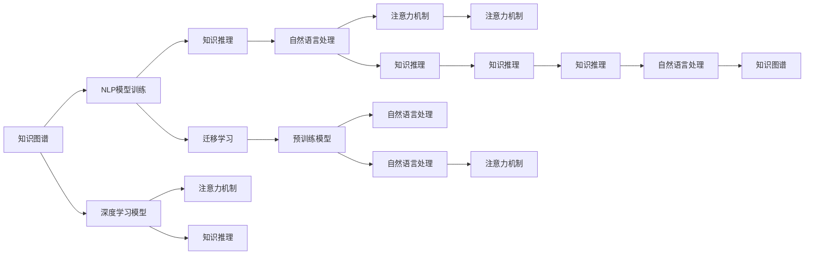

                 

# AI如何改变我们提问和思考的方式

## 1. 背景介绍

### 1.1 问题由来

随着人工智能(AI)技术的迅猛发展，特别是在自然语言处理(NLP)领域的突破，AI开始深刻改变我们的提问和思考方式。从传统的搜索引擎、智能助手，到现代化的个性化推荐系统、知识图谱构建，AI正以其强大的分析和理解能力，助力我们更高效地获取信息、处理问题。

### 1.2 问题核心关键点

AI改变提问和思考方式的核心在于其能够理解和执行自然语言，通过深度学习和大数据分析，AI可以从海量数据中学习语言模式，构建知识图谱，理解语义，甚至能够进行推理和预测。具体而言：

- **知识图谱构建**：AI能够自动构建大规模知识图谱，捕捉实体、关系和属性，为问答、推荐等应用提供基础。
- **自然语言处理**：通过语言模型和文本分析，AI能够理解和生成自然语言，实现机器翻译、文本摘要等任务。
- **语义理解**：AI不仅能理解字面意思，还能理解隐含语义和上下文，提升问答系统等应用效果。
- **推理和预测**：基于大量数据和复杂算法，AI能进行因果推断和预测，解决许多传统上需要人类直觉和经验的问题。

这些能力使得AI在辅助我们提出问题、理解问题、回答问题等方面，展现出了巨大的潜力。

## 2. 核心概念与联系

### 2.1 核心概念概述

要深刻理解AI如何改变我们的提问和思考方式，首先需要梳理相关核心概念：

- **知识图谱**：一种结构化的语义知识表示形式，用于存储、检索和推理实体和关系。
- **自然语言处理(NLP)**：涉及文本和语音信号的自动处理，包括分词、词性标注、句法分析、语义理解等。
- **深度学习模型**：如RNN、LSTM、Transformer等，用于处理序列数据，捕捉语言中的复杂模式。
- **知识推理**：基于知识图谱，进行因果推断、逻辑推理等，以获得新知识或验证已有知识。
- **迁移学习**：通过预训练模型在特定任务上的微调，提升模型的泛化能力。
- **预训练模型**：如BERT、GPT等，在大规模无标签数据上进行预训练，获得通用语言知识。
- **注意力机制**：一种使模型能够关注输入序列中重要部分的技术，显著提升了模型处理序列数据的能力。

这些概念之间通过深度学习技术紧密联系，共同构成了解决复杂自然语言处理问题的基石。

### 2.2 核心概念原理和架构的 Mermaid 流程图



该图展示了知识图谱构建与NLP模型训练之间的联系，以及深度学习、注意力机制和知识推理在这些过程中所起的作用。

## 3. 核心算法原理 & 具体操作步骤

### 3.1 算法原理概述

AI改变我们提问和思考方式的根本在于其强大的自然语言处理能力。深度学习模型如BERT、GPT等，通过在大规模无标签数据上进行预训练，学习到丰富的语言知识和语义信息。在此基础上，AI系统通过迁移学习、微调等技术，对特定任务进行优化，提升其在具体场景中的应用效果。

### 3.2 算法步骤详解

1. **数据准备**：收集和标注相关领域的文本数据，如新闻、评论、问答等。

2. **预训练模型选择**：选择合适的预训练模型，如BERT、GPT等，作为初始化参数。

3. **任务适配层设计**：根据具体任务需求，设计并添加合适的任务适配层，如分类器、解码器等。

4. **微调训练**：在少量标注数据上，对预训练模型进行微调，通过梯度下降等优化算法更新模型参数。

5. **评估与部署**：在测试集上评估模型性能，满足要求后部署到实际应用中。

6. **持续学习**：模型部署后，持续收集新数据，定期重新微调模型，保持模型性能。

### 3.3 算法优缺点

#### 优点：

- **高效性**：使用预训练模型，可以在较短时间内构建高效、准确的知识处理系统。
- **通用性**：预训练模型在各种自然语言处理任务中都有优异表现，可以应用于广泛领域。
- **泛化能力**：通过迁移学习，模型可以在新领域迅速适应，提升模型泛化能力。

#### 缺点：

- **数据依赖**：高质量的标注数据对微调效果至关重要，数据获取成本较高。
- **过拟合风险**：微调过程中，模型容易过拟合小样本数据，影响泛化性能。
- **计算资源消耗大**：大模型和深度学习训练需要大量计算资源，对硬件要求高。
- **可解释性不足**：深度学习模型的决策过程难以解释，缺乏透明性。

### 3.4 算法应用领域

AI在提问和思考方式改变方面，应用领域广泛，主要包括：

- **智能搜索和问答系统**：如Google的搜索、IBM的Watson问答系统，能够快速回答问题，提供相关信息。
- **个性化推荐系统**：如Netflix的推荐系统、Amazon的产品推荐，能够根据用户兴趣提供个性化内容。
- **情感分析与舆情监测**：利用NLP技术分析用户评论、社交媒体，监测情感变化和社会舆情。
- **对话系统**：如微软的Cortana、Google Assistant，能够与用户进行自然语言交互。
- **自然语言生成**：如OpenAI的GPT-3，能够生成逼真的文本，应用于自动写作、内容创作等场景。
- **机器翻译**：如Google Translate、DeepL，能够实现高效、准确的跨语言翻译。

## 4. 数学模型和公式 & 详细讲解 & 举例说明

### 4.1 数学模型构建

AI改变提问和思考方式的核心数学模型包括：

- **知识图谱模型**：通常使用图结构表示，包括节点表示实体，边表示关系，用于知识存储和推理。
- **自然语言处理模型**：如循环神经网络(RNN)、长短时记忆网络(LSTM)、Transformer等，用于处理序列数据。
- **深度学习模型**：如BERT、GPT等，通过自监督学习预训练，学习语言模式。

### 4.2 公式推导过程

**知识图谱构建**：

- 节点表示实体$N = \{n_1, n_2, ..., n_k\}$，每条边表示实体间的关系$R = \{r_1, r_2, ..., r_m\}$。
- 节点和关系嵌入向量表示：$E = \{e_i\}_{i=1}^k$，$F = \{f_j\}_{j=1}^m$。
- 推理过程：$P = \{p_k\}_{k=1}^n$，$P = e_i \cdot f_j$。

**自然语言处理模型**：

- 序列数据：$x = \{x_1, x_2, ..., x_t\}$，$t$为序列长度。
- 输出：$y = \{y_1, y_2, ..., y_t\}$。
- 损失函数：$L = \frac{1}{N} \sum_{i=1}^N l(y_i, \hat{y}_i)$。
- 优化目标：$\theta = \mathop{\arg\min}_{\theta} L(\theta)$。

**深度学习模型**：

- BERT预训练目标：$L_{MLM} = \frac{1}{N} \sum_{i=1}^N \sum_{j=1}^N -y_{ij} \log P_{ij}$。
- Transformer模型：$L = \frac{1}{N} \sum_{i=1}^N \sum_{j=1}^N \log \frac{p_{ij}}{\sum_{k=1}^K p_{ik}}$。

### 4.3 案例分析与讲解

以BERT为例，其通过掩码语言模型(MLM)和下一句预测任务(NSP)进行预训练。其中MLM目标为：

- $x = \{x_1, x_2, ..., x_t\}$，$x_i$表示掩码后的序列片段。
- $y = \{y_1, y_2, ..., y_t\}$，$y_i = \{0, 1\}$，$y_i = 1$表示对应位置的掩码字符。
- 目标函数：$L = -\frac{1}{N} \sum_{i=1}^N \sum_{j=1}^t (\log P_{ij} + \log P_{i'j})$。

其中$P_{ij} = \frac{\exp(p_{ij})}{\sum_{k=1}^K \exp(p_{ik})}$，$p_{ij}$为模型在输入$x$上的预测概率。

通过以上模型和公式，我们可以训练出高质量的BERT模型，从而提升其在各种NLP任务中的应用效果。

## 5. 项目实践：代码实例和详细解释说明

### 5.1 开发环境搭建

1. **安装依赖**：
   ```bash
   pip install torch torchvision transformers
   ```

2. **下载预训练模型**：
   ```bash
   wget https://huggingface.co/bert-base-uncased
   ```

3. **构建数据集**：
   ```python
   from transformers import BertTokenizer, BertForMaskedLM
   from torch.utils.data import Dataset, DataLoader
   import torch
   import json
   
   # 加载数据集
   with open('train.json', 'r') as f:
       data = json.load(f)
   
   # 分词器
    tokenizer = BertTokenizer.from_pretrained('bert-base-uncased')
   
   # 构造数据集
   class MaskedLMDataset(Dataset):
       def __init__(self, data):
           self.data = data
           
       def __len__(self):
           return len(self.data)
           
       def __getitem__(self, idx):
           sentence = self.data[idx]['sentence']
           masks = self.data[idx]['masked_tokens']
           
           encoding = tokenizer.encode_plus(sentence, add_special_tokens=True,
                                          token_type_ids=None, attention_mask=masks, padding='max_length', max_length=128)
           input_ids = encoding['input_ids']
           attention_mask = encoding['attention_mask']
           
           return {'input_ids': input_ids, 
                   'attention_mask': attention_mask}
   
   # 加载数据集
   dataset = MaskedLMDataset(data)
   dataloader = DataLoader(dataset, batch_size=16)
   ```

### 5.2 源代码详细实现

```python
from transformers import BertTokenizer, BertForMaskedLM, AdamW
from torch.utils.data import Dataset, DataLoader
import torch

# 加载数据集
with open('train.json', 'r') as f:
    data = json.load(f)

# 分词器
tokenizer = BertTokenizer.from_pretrained('bert-base-uncased')

# 构造数据集
class MaskedLMDataset(Dataset):
    def __init__(self, data):
        self.data = data
            
    def __len__(self):
        return len(self.data)
    
    def __getitem__(self, idx):
        sentence = self.data[idx]['sentence']
        masks = self.data[idx]['masked_tokens']
        
        encoding = tokenizer.encode_plus(sentence, add_special_tokens=True,
                                       max_length=128, padding='max_length',
                                       return_tensors='pt', truncation=True)
        input_ids = encoding['input_ids']
        attention_mask = encoding['attention_mask']
        
        return {'input_ids': input_ids, 
                'attention_mask': attention_mask}

# 加载数据集
dataset = MaskedLMDataset(data)
dataloader = DataLoader(dataset, batch_size=16)

# 模型
model = BertForMaskedLM.from_pretrained('bert-base-uncased')

# 优化器
optimizer = AdamW(model.parameters(), lr=2e-5)

# 训练过程
for epoch in range(3):
    model.train()
    epoch_loss = 0
    
    for batch in dataloader:
        input_ids = batch['input_ids'].to(device)
        attention_mask = batch['attention_mask'].to(device)
        
        loss = model(input_ids, attention_mask=attention_mask)
        epoch_loss += loss.item()
        optimizer.zero_grad()
        loss.backward()
        optimizer.step()
        
    print(f"Epoch {epoch+1}, train loss: {epoch_loss/len(dataloader):.4f}")
```

### 5.3 代码解读与分析

- **分词器**：使用BertTokenizer将句子分词，转换为模型所需的输入格式。
- **数据集**：构造一个MaskedLMDataset，用于加载和处理训练数据。
- **模型和优化器**：使用BertForMaskedLM模型和AdamW优化器。
- **训练过程**：通过循环迭代训练数据，更新模型参数，实现预训练模型的微调。

## 6. 实际应用场景

### 6.1 智能搜索和问答系统

智能搜索和问答系统是AI改变提问和思考方式的典型应用。如Google搜索、IBM Watson等，通过自然语言理解和知识图谱构建，能够快速回答用户问题，提供相关搜索结果。

在技术实现上，可以使用预训练语言模型（如BERT、GPT）进行微调，增加相关领域的实体和关系。通过构建领域知识图谱，提高查询的准确性和相关性，提升用户体验。

### 6.2 个性化推荐系统

个性化推荐系统利用用户的查询历史、点击行为等数据，通过深度学习模型（如DNN、RNN、Transformer）进行特征提取和模式识别，预测用户感兴趣的内容。

例如，Netflix使用BERT模型对用户行为数据进行微调，构建用户兴趣图谱，实现个性化内容推荐。Amazon也使用相似技术，提升产品推荐效果。

### 6.3 情感分析与舆情监测

情感分析与舆情监测是AI在处理自然语言数据时的重要应用。通过NLP技术，AI能够自动分析用户评论、社交媒体等文本数据，识别情感倾向，监测情感变化。

例如，社交媒体监控系统可以实时监测用户情感变化，预测市场趋势，辅助企业决策。金融市场舆情监测系统，通过分析新闻、评论等数据，识别市场情绪，及时预警风险。

### 6.4 未来应用展望

未来，AI在提问和思考方式的改变上，有望进一步扩展应用场景，例如：

- **虚拟助手**：通过构建更智能的对话模型，虚拟助手能够提供更自然、更个性化的服务，如智能家居、智能客服等。
- **自动摘要与内容生成**：通过自动摘要技术和内容生成模型，AI能够自动生成新闻摘要、科技文章等高质量文本，提高信息获取效率。
- **多模态交互**：结合视觉、语音等多种模态数据，AI能够进行多模态交互，提升用户体验。
- **深度知识图谱**：构建更深度、更全面的知识图谱，利用知识推理技术，提供更准确的信息服务。

## 7. 工具和资源推荐

### 7.1 学习资源推荐

- **《深度学习与自然语言处理》**：斯坦福大学NLP课程，涵盖NLP基础和前沿技术。
- **《自然语言处理综述》**：涵盖NLP各领域经典模型和技术，适合深入学习。
- **《NLP实战》**：提供大量实战案例，帮助你快速上手NLP技术。
- **《NLP源码解读》**：通过深入分析NLP框架源码，了解NLP核心技术实现。
- **HuggingFace官方文档**：提供预训练模型的下载、微调和部署方法，是学习NLP技术的必备资源。

### 7.2 开发工具推荐

- **PyTorch**：灵活的深度学习框架，支持动态计算图。
- **TensorFlow**：开源深度学习框架，适合大规模工程应用。
- **Transformers库**：HuggingFace提供的NLP工具库，包含大量预训练模型和微调方法。
- **Weights & Biases**：模型实验跟踪工具，提供丰富的图表和分析功能。
- **TensorBoard**：TensorFlow配套的可视化工具，用于监测模型训练状态。

### 7.3 相关论文推荐

- **Attention is All You Need**：Transformer的原始论文，介绍了Transformer结构和自注意力机制。
- **BERT: Pre-training of Deep Bidirectional Transformers for Language Understanding**：BERT模型，通过掩码语言模型和下一句预测任务进行预训练。
- **Towards a Unified Theory of Translation and Language Generation**：Transformer模型，通过自注意力机制实现高效的序列处理。
- **GPT-3: Language Models are Unsupervised Multitask Learners**：GPT-3模型，展示了大规模语言模型的零样本学习能力。

## 8. 总结：未来发展趋势与挑战

### 8.1 研究成果总结

本文对AI改变提问和思考方式的技术进行了全面介绍，包括核心概念、算法原理和具体操作步骤。通过实际应用案例，展示了AI在智能搜索、个性化推荐、情感分析等领域的广泛应用。

### 8.2 未来发展趋势

未来，AI在自然语言处理和认知智能方面有望继续突破：

- **自监督学习**：通过自监督学习，大规模数据利用变得更加高效，无需标注数据即可提升模型效果。
- **多模态融合**：结合视觉、语音等多种模态数据，实现更加全面、准确的信息处理。
- **深度知识图谱**：构建深度知识图谱，实现更复杂、精确的知识推理和关系抽取。
- **多领域迁移学习**：在多个领域内进行迁移学习，提升模型泛化能力和应用范围。

### 8.3 面临的挑战

AI在改变提问和思考方式的过程中，也面临诸多挑战：

- **数据隐私和伦理**：如何确保数据隐私和伦理，避免滥用AI技术。
- **模型偏见和公平性**：如何减少模型偏见，确保AI系统公正。
- **可解释性和透明性**：如何提升AI系统的可解释性和透明性，确保决策合理。
- **计算资源限制**：如何提升AI模型的计算效率，降低资源消耗。
- **跨领域应用难度**：如何在不同领域内，保持AI系统的稳定性和适用性。

### 8.4 研究展望

未来，在解决以上挑战的基础上，AI有望进一步推动认知智能的发展，具体展望包括：

- **通用认知智能**：构建通用认知智能系统，解决各种复杂问题。
- **人机协同**：实现人与AI系统的深度协同，提升人类认知能力。
- **AI伦理和社会影响**：研究AI伦理和社会影响，制定相关规范和政策。

## 9. 附录：常见问题与解答

### 9.1 问题与解答

**Q1：AI是否会替代人类智能？**

A: AI能够通过深度学习和自然语言处理，在特定领域实现高效信息处理和复杂任务解决，但无法完全替代人类智能。人类具有情感、直觉等AI难以复制的认知能力，AI更多是辅助人类智能的工具。

**Q2：AI技术安全性如何保障？**

A: AI技术的安全性保障需要从数据隐私、模型透明、伦理审查等多个方面进行考虑。通过制定严格的法律法规和技术标准，确保AI系统的安全性。

**Q3：AI如何应用于教育领域？**

A: AI在教育领域可以用于个性化教学、智能辅导、学习行为分析等。通过构建知识图谱，实现智能推荐和智能评估，提升教育质量。

**Q4：AI技术在医疗领域的应用前景？**

A: AI在医疗领域可以用于病历分析、医学图像处理、疾病预测等。通过构建医疗知识图谱，实现智能诊断和个性化治疗，提升医疗服务质量。

**Q5：AI技术对社会的影响？**

A: AI技术的普及将带来更高效的信息获取、更精准的医疗诊断、更智能的教育辅导等，推动社会进步。但也需要关注AI技术的公平性、伦理性和安全性，避免负面影响。

**Q6：AI技术的未来发展方向？**

A: AI技术的发展方向包括自动化、智能化、通用化、伦理化等。通过多领域、多模态、多任务的学习和应用，推动AI技术的全面进步。

---

作者：禅与计算机程序设计艺术 / Zen and the Art of Computer Programming

