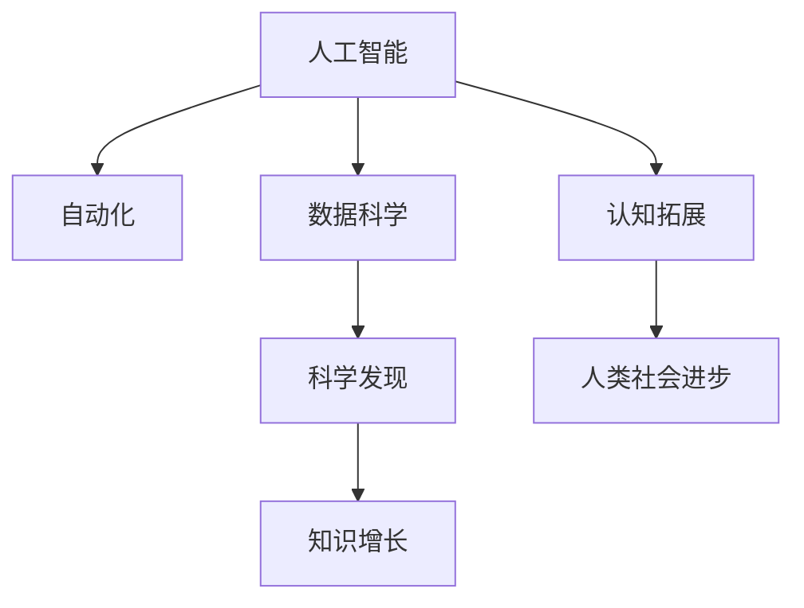

                 

# AI对人类知识增长的贡献

> 关键词：人工智能,知识增长,人类认知,自动化,数据科学,科学发现

## 1. 背景介绍

在21世纪的今天，人工智能（AI）技术已成为推动知识增长的重要力量。AI不仅在各个领域内实现了自动化，还在不断扩展人类的认知边界。从数据科学到科学发现，AI正在引领一场知识革命。本文将从多个角度深入探讨AI如何为知识增长做出贡献。

## 2. 核心概念与联系

### 2.1 核心概念概述

为了更好地理解AI对知识增长的贡献，我们先来介绍几个关键概念及其相互联系。

- **人工智能（AI）**：广义上讲，AI是指使计算机系统能够执行类似于人类智能的任务。其核心包含机器学习、深度学习、自然语言处理等技术。
- **知识增长**：指人类知识体系在时间维度上的扩展和深化。这不仅包括新的科学发现，也包括技术进步、文化积累等方面。
- **自动化**：指通过程序化、算法化手段替代人工劳动，提高效率，减少错误。
- **数据科学**：利用数学和统计学方法，从数据中提取有价值的信息，进行预测和决策。
- **科学发现**：指通过实验、观察、分析等手段揭示自然界的规律和现象，推动人类认知的进步。

这些概念之间存在着紧密的联系。AI通过自动化和数据科学方法，提高了科学发现和知识增长的效率，为人类知识的扩展提供了有力支持。

### 2.2 核心概念原理和架构的 Mermaid 流程图



这个流程图展示了AI与其他概念之间的内在联系。自动化和数据科学是AI的两大支柱，通过提高效率和提取知识，为科学发现和认知拓展提供了手段。而科学发现和认知拓展的成果，反过来促进了知识增长和人类社会的进步。

## 3. 核心算法原理 & 具体操作步骤

### 3.1 算法原理概述

AI通过机器学习等算法，实现了对数据的高效处理和分析，进而驱动科学发现和知识增长。其核心原理包括以下几个方面：

- **监督学习（Supervised Learning）**：通过给定输入数据和输出标签，机器学习模型自动学习输入与输出之间的关系，用于预测和分类等任务。
- **无监督学习（Unsupervised Learning）**：在无标签数据上，机器学习模型自动发现数据的内在结构，如聚类、降维等。
- **强化学习（Reinforcement Learning）**：通过与环境交互，机器学习模型学习最优决策策略，用于控制和规划等任务。

### 3.2 算法步骤详解

以监督学习为例，其基本步骤包括数据准备、模型训练、验证与测试、模型评估和应用部署。具体步骤详述如下：

1. **数据准备**：收集和预处理数据集，包括数据清洗、标准化、分训练集和测试集等。
2. **模型训练**：选择合适的模型和参数，使用训练集对模型进行迭代训练，以最小化预测误差。
3. **验证与测试**：在验证集上评估模型性能，调整模型参数以避免过拟合。测试集用于最终模型性能的评估。
4. **模型评估**：通过损失函数、准确率、召回率等指标评估模型效果。
5. **应用部署**：将训练好的模型部署到实际应用场景中，进行预测或决策。

### 3.3 算法优缺点

**监督学习的优点**：
- **准确性高**：通过大量标注数据，模型能够学习输入与输出之间的映射关系。
- **可解释性强**：通过查看权重和特征，可以理解模型的工作原理。
- **泛化能力强**：在大规模数据集上进行训练，模型具有较强的泛化能力。

**监督学习的缺点**：
- **数据依赖性强**：需要大量标注数据，成本较高。
- **模型复杂度高**：模型结构和参数较多，训练和推理较慢。
- **过拟合风险高**：模型容易出现过拟合，需要额外的正则化技术。

**无监督学习的优点**：
- **数据需求少**：不需要标注数据，适用于数据稀缺场景。
- **发现新模式**：自动发现数据中的潜在模式和结构。

**无监督学习的缺点**：
- **结果可解释性差**：结果往往难以解释，缺乏明确性。
- **泛化能力弱**：通常只适用于局部数据，泛化性能差。

**强化学习的优点**：
- **适应性强**：通过与环境交互，适应各种复杂环境。
- **自主学习能力**：模型能够自主学习最优策略，无需大量标注数据。

**强化学习的缺点**：
- **样本效率低**：需要大量试错过程，训练时间较长。
- **环境建模难**：环境模型的准确性直接影响模型性能。

### 3.4 算法应用领域

AI的算法广泛应用于各个领域，其中对知识增长的贡献尤为显著。以下列举几个典型应用领域：

1. **医学**：通过医学影像分析、基因组学研究、个性化治疗等，AI推动了医疗知识的大幅增长。
2. **科学研究**：通过自动数据分析、科学发现和预测，AI加速了各个学科的进展。
3. **金融**：通过风险管理、交易策略、智能投顾等，AI推动了金融知识的更新。
4. **教育**：通过个性化学习、智能辅导、教育数据挖掘等，AI改善了教育效果。
5. **环境科学**：通过气候预测、生态监测、资源管理等，AI为环境保护和可持续发展提供了新思路。
6. **社会治理**：通过数据分析、预测预警、智能决策等，AI提升了政府管理和社会治理的效率和水平。

## 4. 数学模型和公式 & 详细讲解

### 4.1 数学模型构建

AI的算法原理涉及大量数学模型，以监督学习为例，基本模型包括线性回归、逻辑回归、决策树、支持向量机、神经网络等。这里以神经网络模型为例，构建数学模型。

假设有一个输入向量 $x \in \mathbb{R}^n$，输出向量 $y \in \mathbb{R}^m$，神经网络模型的参数为 $\theta$。神经网络模型可以表示为：

$$
y = h(x; \theta)
$$

其中 $h(x; \theta)$ 是神经网络的映射函数。神经网络通常由多个层组成，包括输入层、隐藏层和输出层。

### 4.2 公式推导过程

以多层感知器（MLP）为例，其核心公式为：

$$
h^{(l)}(z^{(l-1)}) = g(\mathbf{W}^{(l)}z^{(l-1)} + b^{(l)})
$$

其中 $g$ 为激活函数，$\mathbf{W}^{(l)}$ 为权重矩阵，$b^{(l)}$ 为偏置向量。$z^{(l)}$ 为第 $l$ 层的输入向量。

### 4.3 案例分析与讲解

以手写数字识别为例，使用监督学习算法训练一个神经网络模型。通过给定大量带有标签的手写数字图像，神经网络学习如何将像素点映射到手写数字类别。具体步骤如下：

1. **数据准备**：收集并预处理手写数字图像数据集，包括数据清洗、标准化、分训练集和测试集等。
2. **模型设计**：设计一个包含多个隐藏层的神经网络模型，选择合适的网络结构和激活函数。
3. **模型训练**：使用训练集对模型进行迭代训练，最小化预测误差。
4. **验证与测试**：在验证集上评估模型性能，调整模型参数以避免过拟合。测试集用于最终模型性能的评估。
5. **模型应用**：将训练好的模型部署到实际应用场景中，进行手写数字识别。

## 5. 项目实践：代码实例和详细解释说明

### 5.1 开发环境搭建

在进行AI项目实践前，我们需要准备好开发环境。以下是使用Python进行TensorFlow开发的详细环境配置流程：

1. 安装Anaconda：从官网下载并安装Anaconda，用于创建独立的Python环境。

2. 创建并激活虚拟环境：
```bash
conda create -n tensorflow-env python=3.7 
conda activate tensorflow-env
```

3. 安装TensorFlow：根据CUDA版本，从官网获取对应的安装命令。例如：
```bash
conda install tensorflow -c tf -c conda-forge
```

4. 安装其他必要的工具包：
```bash
pip install numpy pandas scikit-learn matplotlib tensorflow-datasets
```

完成上述步骤后，即可在`tensorflow-env`环境中开始AI项目实践。

### 5.2 源代码详细实现

下面以手写数字识别为例，给出使用TensorFlow进行神经网络模型训练的Python代码实现。

```python
import tensorflow as tf
from tensorflow.keras.datasets import mnist
from tensorflow.keras.models import Sequential
from tensorflow.keras.layers import Dense, Flatten
from tensorflow.keras.utils import to_categorical

# 加载手写数字数据集
(x_train, y_train), (x_test, y_test) = mnist.load_data()

# 数据预处理
x_train = x_train.reshape(-1, 784) / 255.0
x_test = x_test.reshape(-1, 784) / 255.0
y_train = to_categorical(y_train, num_classes=10)
y_test = to_categorical(y_test, num_classes=10)

# 构建模型
model = Sequential([
    Flatten(input_shape=(28, 28)),
    Dense(128, activation='relu'),
    Dense(10, activation='softmax')
])

# 编译模型
model.compile(optimizer='adam', loss='categorical_crossentropy', metrics=['accuracy'])

# 训练模型
model.fit(x_train, y_train, epochs=10, batch_size=32, validation_data=(x_test, y_test))

# 评估模型
loss, accuracy = model.evaluate(x_test, y_test)
print(f'Test accuracy: {accuracy:.2f}')
```

以上代码实现了手写数字识别的神经网络模型训练和评估。通过使用TensorFlow的Keras API，可以快速搭建和训练神经网络模型。

### 5.3 代码解读与分析

让我们详细解读一下关键代码的实现细节：

**数据加载与预处理**：
```python
import tensorflow as tf
from tensorflow.keras.datasets import mnist
from tensorflow.keras.models import Sequential
from tensorflow.keras.layers import Dense, Flatten
from tensorflow.keras.utils import to_categorical

# 加载手写数字数据集
(x_train, y_train), (x_test, y_test) = mnist.load_data()

# 数据预处理
x_train = x_train.reshape(-1, 784) / 255.0
x_test = x_test.reshape(-1, 784) / 255.0
y_train = to_categorical(y_train, num_classes=10)
y_test = to_categorical(y_test, num_classes=10)
```

**模型构建与编译**：
```python
# 构建模型
model = Sequential([
    Flatten(input_shape=(28, 28)),
    Dense(128, activation='relu'),
    Dense(10, activation='softmax')
])

# 编译模型
model.compile(optimizer='adam', loss='categorical_crossentropy', metrics=['accuracy'])
```

**模型训练与评估**：
```python
# 训练模型
model.fit(x_train, y_train, epochs=10, batch_size=32, validation_data=(x_test, y_test))

# 评估模型
loss, accuracy = model.evaluate(x_test, y_test)
print(f'Test accuracy: {accuracy:.2f}')
```

可以看到，TensorFlow提供了Keras API，使得模型的搭建、训练和评估过程变得简单高效。开发者可以专注于业务逻辑，而不必过多关注底层实现细节。

## 6. 实际应用场景

### 6.1 医疗影像分析

在医疗领域，AI可以通过对大量医学影像数据进行分析和处理，帮助医生进行诊断和治疗。例如，通过深度学习算法，对X光片、CT、MRI等影像进行自动分割和标注，辅助医生识别病变区域和病灶。这不仅可以提高诊断的准确性和效率，还能减轻医生的工作负担，为患者提供更好的医疗服务。

### 6.2 智能推荐系统

在电商和在线平台上，AI可以通过对用户行为数据的分析，为用户推荐个性化的商品和服务。通过机器学习算法，对用户的历史浏览记录、购买记录和评分数据进行分析，模型能够自动发现用户的兴趣偏好，从而提供精准的推荐结果。这不仅提升了用户体验，还增加了平台的销售额。

### 6.3 金融风险管理

在金融领域，AI可以通过对海量数据的分析，预测市场走势和风险，帮助金融机构进行投资决策和风险控制。例如，通过机器学习算法，对历史交易数据进行分析，预测股票市场的涨跌趋势，提供智能投顾服务。这不仅能够提高投资收益，还能降低投资风险。

### 6.4 自然灾害预警

在环境保护领域，AI可以通过对气象数据的分析，预测自然灾害的发生和影响范围。例如，通过深度学习算法，对卫星遥感数据和气象数据进行分析，预测飓风、地震等自然灾害的发生和影响范围。这不仅能够提前预警，还能减少灾害造成的损失。

### 6.5 自动驾驶

在自动驾驶领域，AI可以通过对传感器数据和地图数据的分析，实现车辆的自动驾驶。通过深度学习算法，对道路环境、交通标志和行人等信息进行分析和识别，模型能够自动驾驶车辆。这不仅能够提高交通安全，还能降低驾驶成本。

## 7. 工具和资源推荐

### 7.1 学习资源推荐

为了帮助开发者系统掌握AI的理论基础和实践技巧，这里推荐一些优质的学习资源：

1. 《深度学习》系列书籍：由Yoshua Bengio等顶级专家编写，全面介绍了深度学习的基本概念和前沿技术。
2. 《机器学习实战》书籍：通过案例驱动，介绍了机器学习算法的实现和应用。
3. Coursera《深度学习》课程：由Andrew Ng教授开设，涵盖深度学习的各个方面，适合初学者学习。
4. Udacity《深度学习》纳米学位：通过实践项目和项目评审，全面学习深度学习技术。
5. Kaggle：数据科学竞赛平台，提供大量开源数据集和竞赛，适合实践和挑战自我。

通过对这些资源的学习实践，相信你一定能够快速掌握AI技术的精髓，并用于解决实际的业务问题。

### 7.2 开发工具推荐

高效的开发离不开优秀的工具支持。以下是几款用于AI开发的常用工具：

1. TensorFlow：由Google主导开发的深度学习框架，生产部署方便，适合大规模工程应用。
2. PyTorch：由Facebook主导开发的深度学习框架，灵活动态，适合研究型应用。
3. Jupyter Notebook：交互式编程环境，适合快速迭代和实验。
4. Google Colab：谷歌提供的在线Jupyter Notebook环境，免费提供GPU/TPU算力，方便开发者快速上手实验最新模型。
5. Weights & Biases：模型训练的实验跟踪工具，可以记录和可视化模型训练过程中的各项指标，方便对比和调优。

合理利用这些工具，可以显著提升AI项目开发的效率，加快创新迭代的步伐。

### 7.3 相关论文推荐

AI的算法研究源于学界的持续研究。以下是几篇奠基性的相关论文，推荐阅读：

1. "Deep Learning" by Ian Goodfellow, Yoshua Bengio, and Aaron Courville：全面介绍了深度学习的基本概念、算法和应用。
2. "ImageNet Classification with Deep Convolutional Neural Networks" by Alex Krizhevsky, Ilya Sutskever, and Geoffrey Hinton：提出深度卷积神经网络，开启了计算机视觉领域的深度学习时代。
3. "Attention is All You Need" by Ashish Vaswani et al.：提出Transformer结构，开启了自然语言处理领域的预训练大模型时代。
4. "Generative Adversarial Nets" by Ian Goodfellow, Jean Pouget-Abadie, and Aaron Courville：提出生成对抗网络，为生成模型提供了新思路。
5. "Reinforcement Learning: An Introduction" by Richard S. Sutton and Andrew G. Barto：全面介绍了强化学习的基本概念、算法和应用。

这些论文代表了大AI技术的发展脉络。通过学习这些前沿成果，可以帮助研究者把握学科前进方向，激发更多的创新灵感。

## 8. 总结：未来发展趋势与挑战

### 8.1 总结

本文对AI对人类知识增长的贡献进行了全面系统的介绍。首先阐述了AI在各个领域的应用，强调了其在提高效率、推动创新方面的重要价值。其次，从理论到实践，详细讲解了AI算法的基本原理和操作步骤，给出了具体的代码实例。最后，展望了AI未来的发展趋势和面临的挑战，提出了相关的学习资源、开发工具和研究论文。

通过本文的系统梳理，可以看到，AI通过自动化和数据科学方法，显著提升了科学发现和知识增长的效率。未来，随着AI技术的不断演进，其在各个领域的深入应用，必将继续推动人类认知的进步，为知识增长贡献更多力量。

### 8.2 未来发展趋势

展望未来，AI的发展趋势包括以下几个方面：

1. **多模态融合**：AI将突破单一模态的限制，实现图像、文本、语音等多模态数据的协同处理，提高信息的完整性和准确性。
2. **自动化水平提升**：随着自动化的深入发展，AI将进一步替代人工劳动，提高效率，降低成本。
3. **知识图谱应用**：知识图谱的构建和应用，将帮助AI更准确地理解和处理知识，为科学发现和决策提供支撑。
4. **智能决策系统**：通过深度学习和强化学习，AI将构建更加智能、可靠的决策系统，提高决策的准确性和效率。
5. **隐私保护和安全**：随着数据隐私和安全问题日益突出，AI将探索更好的隐私保护和数据安全策略，保护用户隐私。
6. **伦理和社会责任**：随着AI的广泛应用，伦理和社会责任问题将受到更多关注，研究者和开发者需要共同探讨，制定相关规范。

### 8.3 面临的挑战

尽管AI在知识增长方面取得了显著进展，但仍然面临诸多挑战：

1. **数据质量问题**：高质量的数据是AI算法效果的关键，但数据采集和处理成本较高，数据质量难以保证。
2. **算法复杂性**：AI算法通常较复杂，模型结构和参数较多，训练和推理效率较低。
3. **可解释性问题**：许多AI算法缺乏可解释性，难以理解其决策过程和内部机制。
4. **伦理和安全问题**：AI在应用过程中可能存在偏见和歧视，数据安全和隐私保护问题亟待解决。
5. **资源消耗问题**：大规模数据和模型需要大量的计算资源，训练和推理过程对硬件要求较高。

### 8.4 研究展望

为了应对未来AI面临的挑战，需要从以下几个方面进行研究：

1. **提高数据质量**：通过数据增强、数据清洗和标注等技术，提高数据的质量和可用性。
2. **简化算法结构**：研究轻量级、高效的AI算法，减少计算资源消耗。
3. **增强可解释性**：引入可解释性技术，如规则引擎、符号推理等，提高AI的透明度和可信度。
4. **强化伦理和责任**：制定伦理规范和责任机制，确保AI的应用符合社会价值观和法律法规。
5. **优化资源消耗**：研究模型压缩、分布式训练等技术，提高AI模型的可扩展性和可部署性。

这些研究方向的探索，将有助于推动AI技术的进一步发展，使其更好地服务于人类知识增长和社会进步。总之，AI技术的发展前景广阔，但要充分发挥其潜力，仍需跨学科、跨领域的协同努力。

## 9. 附录：常见问题与解答

**Q1：AI如何提高知识增长的效率？**

A: AI通过自动化和数据科学方法，显著提高了知识增长的效率。自动化技术替代了大量人工劳动，提高了效率和准确性。数据科学方法通过对大规模数据的分析，揭示了隐藏的知识和模式，加速了科学发现和技术进步。

**Q2：AI在医疗领域的应用有哪些？**

A: AI在医疗领域的应用包括医学影像分析、疾病预测、个性化治疗、药物研发等。通过深度学习算法，对医学影像进行自动分割和标注，辅助医生进行诊断和治疗。

**Q3：AI在电商推荐系统中的作用是什么？**

A: AI在电商推荐系统中的作用是进行个性化推荐。通过机器学习算法，对用户行为数据进行分析，自动发现用户的兴趣偏好，从而提供精准的推荐结果。

**Q4：AI在金融风险管理中的应用有哪些？**

A: AI在金融风险管理中的应用包括市场预测、风险评估、智能投顾等。通过深度学习算法，对历史交易数据进行分析，预测市场走势和风险，提供智能投顾服务。

**Q5：AI在自动驾驶中的应用有哪些？**

A: AI在自动驾驶中的应用包括环境感知、路径规划、决策控制等。通过深度学习算法，对传感器数据和地图数据进行分析，实现车辆的自动驾驶。

---

作者：禅与计算机程序设计艺术 / Zen and the Art of Computer Programming

