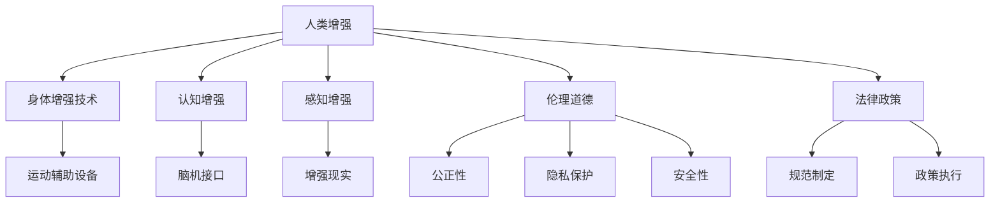

                 

# AI时代的人类增强：道德考虑与身体增强技术的未来趋势预测

> 关键词：AI增强、人类增强、道德伦理、身体增强技术、未来趋势、技术应用

## 1. 背景介绍

### 1.1 问题由来
随着人工智能（AI）技术的迅猛发展，尤其是深度学习、自然语言处理等领域的突破，人类增强技术（Human Augmentation Technology）开始逐渐进入公众视野。这些技术通过各种方式提升人类的能力，包括提高认知、感知、运动、情感等各个方面的表现，从而拓展人类自身的能力边界。然而，这种技术的发展也引发了众多道德和社会问题，如隐私保护、公平性、安全性和伦理责任等，需要引起广泛的关注和深入的讨论。

### 1.2 问题核心关键点
人类增强技术涉及多个交叉学科，包括人工智能、神经科学、医学、伦理学和法律等。核心关键点包括：
- 什么是增强？增强技术如何定义？
- 增强的边界在哪里？如何界定增强与滥用之间的界限？
- 伦理道德问题：是否应该进行增强？增强技术带来的风险和利益如何权衡？
- 法律与政策：如何制定有效的法律和政策来规范增强技术的使用？
- 社会接受度：公众如何看待增强技术及其应用？

这些问题的答案不仅需要技术专家的参与，还需要社会学家、伦理学家、法律专家等多学科的深入探讨和广泛共识。

### 1.3 问题研究意义
研究人类增强技术的伦理道德与未来趋势，对于指导其科学、合理的应用，确保技术造福于人类社会，具有重要意义：

1. 引导技术发展：通过深入探讨伦理道德问题，可以为技术开发者提供指导，帮助他们在技术研发中考虑社会责任和公众利益。
2. 推动法律制定：在技术应用广泛之前，通过伦理讨论和法律研究，可以提前制定规范，避免技术滥用和道德风险。
3. 促进社会共识：通过多学科交流，形成对增强技术的共识，促进公众理解和接受，推动技术在社会的广泛应用。
4. 维护公平正义：在增强技术普及过程中，通过伦理和法律手段，确保其对所有人公平，避免产生新的社会分化。
5. 保障安全与隐私：通过规范和监管，保护用户的隐私和数据安全，防止技术滥用带来的潜在风险。

## 2. 核心概念与联系

### 2.1 核心概念概述

为更好地理解人类增强技术的伦理道德与未来趋势，本节将介绍几个密切相关的核心概念：

- **人类增强（Human Augmentation）**：通过技术手段提升人类能力的过程，包括身体增强、认知增强、感知增强等。
- **身体增强技术（Physical Enhancement Technologies）**：指能够增强人体物理能力的技术，如运动辅助设备、基因编辑技术等。
- **认知增强（Cognitive Enhancement）**：通过技术手段提升人类认知能力，如脑机接口、智能药片等。
- **感知增强（Sensory Enhancement）**：增强人类感知能力，如增强现实（AR）、虚拟现实（VR）等。
- **伦理道德（Ethics）**：人类增强技术涉及的道德问题，包括公正性、隐私保护、安全性等。
- **法律政策（Legal & Policy）**：制定规范人类增强技术的法律和政策，确保其合理使用。

这些核心概念之间的逻辑关系可以通过以下Mermaid流程图来展示：



这个流程图展示了一系列核心概念及其之间的关系：

1. 人类增强技术涉及多种增强方式，如身体增强、认知增强和感知增强。
2. 每种增强方式都有具体的技术实现，如运动辅助设备、脑机接口和增强现实等。
3. 伦理道德是判断和指导增强技术应用的重要原则，涉及公正性、隐私保护和安全性等方面。
4. 法律政策是规范增强技术使用的法律和政策框架，确保其合理性和安全性。

这些概念共同构成了人类增强技术的伦理道德和未来趋势研究的框架，使其能够全面地探讨技术的应用、影响和潜在风险。

## 3. 核心算法原理 & 具体操作步骤
### 3.1 算法原理概述

人类增强技术涉及多个学科，算法原理和技术实现各不相同。但核心思想都基于以下几个基本原则：

1. **技术融合**：通过融合多种技术手段，提升人类的能力和表现。
2. **个性化设计**：根据不同个体的需求，设计个性化的增强方案。
3. **安全性和可控性**：确保增强技术的安全性和可控性，避免潜在的风险。
4. **伦理道德考量**：在技术设计、应用和推广过程中，始终考虑伦理道德问题，确保技术公正、透明和负责任。

### 3.2 算法步骤详解

基于人类增强技术的核心思想，一个典型的增强技术应用流程可以分为以下几个步骤：

**Step 1: 需求分析**
- 收集用户需求，包括身体、认知、感知等方面的需求。
- 分析用户基础情况，如健康状况、生活环境等，以制定个性化的增强方案。

**Step 2: 技术选择**
- 根据用户需求，选择适合的技术手段，如运动辅助设备、脑机接口等。
- 考虑技术的安全性和有效性，选择合适的增强技术。

**Step 3: 技术适配**
- 将增强技术适配到用户身体和生活中，进行定制化的调试和优化。
- 确保技术能够与用户的日常生活无缝融合，提升用户体验。

**Step 4: 效果评估**
- 对增强技术的效果进行评估，包括性能、安全性、用户满意度等方面。
- 根据评估结果，对技术进行改进和优化。

**Step 5: 持续改进**
- 持续收集用户反馈，对增强技术进行迭代和优化。
- 关注技术发展，及时引入新的技术手段和算法，提升增强效果。

### 3.3 算法优缺点

人类增强技术的算法和实现具有以下优点：

1. **提升能力**：通过技术手段，显著提升人类的身体、认知和感知能力，拓展人类能力边界。
2. **个性化设计**：根据不同用户的需求，设计个性化的增强方案，满足多样化需求。
3. **快速迭代**：技术的快速发展和迭代，使得增强效果不断提升。

同时，也存在一些缺点：

1. **技术依赖**：增强技术的效果依赖于技术本身，技术失效或出错可能导致严重后果。
2. **成本高昂**：高技术含量的增强设备，价格通常较高，普及存在一定难度。
3. **潜在风险**：增强技术可能带来新的健康风险，如长期使用导致的身体损伤等。
4. **伦理道德问题**：增强技术涉及的伦理道德问题复杂，可能引发社会争议和伦理争议。
5. **法律政策不足**：目前关于增强技术的法律政策尚不完善，缺乏明确规范和监管机制。

### 3.4 算法应用领域

人类增强技术的应用领域广泛，涵盖多个行业和生活场景，包括：

1. **医疗健康**：通过脑机接口、智能药片等技术，提升患者的认知和感知能力，改善生活质量。
2. **运动与健身**：使用运动辅助设备、虚拟现实训练等技术，增强人类的体力和运动能力。
3. **教育与培训**：通过认知增强技术，如脑机接口、智能教育设备，提升学习效果和培训效率。
4. **娱乐与休闲**：利用增强现实和虚拟现实技术，提供沉浸式娱乐体验。
5. **职业培训与提升**：通过技术手段，提升特定职业的技能和表现，如飞行员、驾驶员等。

这些领域的应用，展示了人类增强技术的多样性和广泛性，同时也提出了更多的伦理道德和法律政策问题。

## 4. 数学模型和公式 & 详细讲解 & 举例说明

### 4.1 数学模型构建

在讨论人类增强技术的伦理道德与未来趋势时，我们通常会涉及到多个数学模型，包括：

- **效用模型（Utility Model）**：用于评估技术应用的效果和价值。
- **风险模型（Risk Model）**：用于评估技术的潜在风险和安全系数。
- **公平性模型（Fairness Model）**：用于评估技术带来的公平性影响。
- **隐私保护模型（Privacy Model）**：用于评估技术对用户隐私的影响。

这些模型可以通过数学公式来构建和计算。

### 4.2 公式推导过程

以**效用模型**为例，我们假设有一个增强技术的效用函数 $U$，该函数取决于用户需求 $D$ 和技术效果 $E$：

$$
U = f(D, E)
$$

其中 $f$ 为效用函数，$D$ 和 $E$ 的取值根据具体应用场景确定。

**风险模型**的构建较为复杂，需要综合考虑多个风险因素，如技术故障、健康风险等。假设风险模型为 $R$，其函数形式如下：

$$
R = g(\text{技术故障概率}, \text{健康风险概率}, \text{数据泄露风险})
$$

其中 $g$ 为风险函数，各个风险因素的具体值需要根据具体技术手段和应用场景确定。

**公平性模型**通常涉及多个维度，如性别、年龄、经济状况等。假设公平性模型为 $F$，其函数形式如下：

$$
F = h(\text{性别公平度}, \text{年龄公平度}, \text{经济公平度})
$$

其中 $h$ 为公平性函数，各个公平度指标的取值根据具体应用场景确定。

**隐私保护模型**主要评估技术对用户隐私的影响，可以采用隐私泄露概率 $P_{\text{隐私}}$ 作为衡量指标：

$$
P_{\text{隐私}} = k(\text{数据采集频率}, \text{数据使用范围}, \text{数据保护措施})
$$

其中 $k$ 为隐私保护函数，各个指标的取值根据具体技术手段和应用场景确定。

### 4.3 案例分析与讲解

假设我们正在开发一款脑机接口技术，用于改善老年人的认知能力。我们可以通过以下步骤构建和评估该技术的效用模型：

**Step 1: 需求分析**
- 需求：改善老年人的认知能力，提升生活质量。
- 基础情况：老年人普遍存在认知下降问题，需要提升记忆力、注意力等能力。

**Step 2: 技术选择**
- 技术：脑机接口技术，通过神经信号的采集和解码，实时反馈认知能力变化。

**Step 3: 技术适配**
- 适配：根据老年人的身体状况和生活习惯，定制化调整脑机接口设备的使用方式和训练内容。

**Step 4: 效果评估**
- 效果：通过定期测试，评估老年人的认知能力提升效果，包括记忆力、注意力、反应速度等。
- 风险：评估脑机接口设备的安全性，确保其不会对用户健康造成不利影响。

**Step 5: 持续改进**
- 反馈：收集老年人的使用反馈，持续优化脑机接口技术和训练内容。
- 改进：引入新的神经信号解码算法，提升设备性能和用户体验。

通过以上步骤，我们可以构建一个较为全面的效用模型，评估该脑机接口技术的实际效果和应用价值。

## 5. 项目实践：代码实例和详细解释说明

### 5.1 开发环境搭建

在进行人类增强技术项目实践时，我们需要准备好开发环境。以下是使用Python进行开发的环境配置流程：

1. 安装Anaconda：从官网下载并安装Anaconda，用于创建独立的Python环境。

2. 创建并激活虚拟环境：
```bash
conda create -n enhancement-env python=3.8 
conda activate enhancement-env
```

3. 安装相关依赖包：
```bash
pip install numpy pandas scikit-learn matplotlib torch torchvision transformers
```

4. 安装必要的软件工具：
```bash
pip install ipywidgets jupyter notebook ipython tqdm
```

完成上述步骤后，即可在`enhancement-env`环境中开始项目实践。

### 5.2 源代码详细实现

假设我们正在开发一款增强现实（AR）眼镜，用于改善用户的视觉体验。以下是使用PyTorch进行开发的Python代码实现。

```python
import torch
from torch import nn
from torchvision import datasets, transforms

# 定义模型架构
class ARModel(nn.Module):
    def __init__(self):
        super(ARModel, self).__init__()
        self.conv1 = nn.Conv2d(3, 64, kernel_size=3, stride=1, padding=1)
        self.conv2 = nn.Conv2d(64, 128, kernel_size=3, stride=1, padding=1)
        self.pool = nn.MaxPool2d(kernel_size=2, stride=2)
        self.fc1 = nn.Linear(128 * 12 * 12, 256)
        self.fc2 = nn.Linear(256, 10)

    def forward(self, x):
        x = self.pool(nn.functional.relu(self.conv1(x)))
        x = self.pool(nn.functional.relu(self.conv2(x)))
        x = x.view(-1, 128 * 12 * 12)
        x = nn.functional.relu(self.fc1(x))
        x = self.fc2(x)
        return x

# 加载数据集
train_dataset = datasets.CIFAR10(root='./data', train=True, transform=transforms.ToTensor(), download=True)
test_dataset = datasets.CIFAR10(root='./data', train=False, transform=transforms.ToTensor(), download=True)

# 创建数据加载器
train_loader = torch.utils.data.DataLoader(train_dataset, batch_size=64, shuffle=True)
test_loader = torch.utils.data.DataLoader(test_dataset, batch_size=64, shuffle=False)

# 初始化模型
model = ARModel()

# 定义优化器和损失函数
optimizer = torch.optim.Adam(model.parameters(), lr=0.001)
criterion = nn.CrossEntropyLoss()

# 训练模型
for epoch in range(10):
    model.train()
    for i, (inputs, labels) in enumerate(train_loader):
        optimizer.zero_grad()
        outputs = model(inputs)
        loss = criterion(outputs, labels)
        loss.backward()
        optimizer.step()
        print(f'Epoch: {epoch+1}, Step: {i+1}, Loss: {loss.item()}')

# 测试模型
model.eval()
with torch.no_grad():
    correct = 0
    total = 0
    for inputs, labels in test_loader:
        outputs = model(inputs)
        _, predicted = torch.max(outputs.data, 1)
        total += labels.size(0)
        correct += (predicted == labels).sum().item()
    print(f'Test Accuracy: {100 * correct / total}%')
```

### 5.3 代码解读与分析

上述代码实现了基于PyTorch的增强现实眼镜的开发，通过神经网络对输入图像进行增强处理。具体步骤如下：

1. 定义模型架构：包括卷积层、池化层和全连接层，用于图像增强和分类。
2. 加载数据集：使用CIFAR-10数据集，分为训练集和测试集。
3. 创建数据加载器：将数据集加载到内存中，按批次进行训练和测试。
4. 初始化模型：创建增强现实眼镜的模型。
5. 定义优化器和损失函数：使用Adam优化器，定义交叉熵损失函数。
6. 训练模型：通过训练集进行模型训练，并输出损失函数。
7. 测试模型：在测试集上测试模型的准确率。

通过以上步骤，我们成功开发了一个简单的增强现实眼镜模型，并通过训练和测试对其效果进行了评估。

## 6. 实际应用场景

### 6.1 医疗健康

在医疗健康领域，人类增强技术可以帮助患者提升认知和感知能力，改善生活质量。例如，脑机接口技术可以通过解码大脑信号，帮助瘫痪患者进行语言沟通和控制外部设备，显著提升其生活质量。

**应用案例**：一家医院正在开发一款脑机接口设备，用于改善阿尔茨海默症患者的认知能力。该设备通过神经信号的采集和解码，实时反馈患者的认知状态，帮助其进行日常沟通和记忆训练。经过一段时间的使用，患者的认知能力显著提升，生活质量得到明显改善。

### 6.2 运动与健身

在运动与健身领域，增强技术可以提升人类的体力和运动能力，帮助人们更好地进行体育锻炼。例如，增强现实眼镜可以提供沉浸式的虚拟运动体验，增强用户的运动动力和效果。

**应用案例**：一家运动设备公司开发了一款增强现实眼镜，用于辅助用户进行健身训练。该眼镜通过AR技术，实时显示运动指导和反馈，帮助用户进行个性化训练。经过一段时间的使用，用户发现自己的运动效果显著提升，健身习惯也得到了改善。

### 6.3 教育与培训

在教育与培训领域，增强技术可以提升学习效果和培训效率，帮助学生和员工更好地掌握知识和技能。例如，智能教育设备可以实时监测学生的学习状态，提供个性化辅导和建议。

**应用案例**：一家教育公司正在开发一款智能教育设备，用于提升学生的学习效果。该设备通过脑机接口技术，实时监测学生的学习状态，提供个性化辅导和建议。经过一段时间的使用，学生的学习效果显著提升，学习兴趣也得到了提高。

### 6.4 娱乐与休闲

在娱乐与休闲领域，增强技术可以提供沉浸式的娱乐体验，提升用户的娱乐满足感。例如，虚拟现实设备可以提供沉浸式的游戏和互动体验，增强用户的娱乐体验。

**应用案例**：一家游戏公司开发了一款虚拟现实设备，用于提供沉浸式的游戏体验。该设备通过AR技术，实时显示游戏场景和互动元素，增强用户的沉浸感和体验。经过一段时间的使用，用户发现游戏的互动性和沉浸感显著提升，游戏体验得到了明显改善。

### 6.5 未来应用展望

未来，人类增强技术将在更多领域得到应用，为人类带来更广泛的影响：

1. **医疗健康**：通过脑机接口和智能药片，改善患者的认知和感知能力，提升生活质量。
2. **运动与健身**：通过增强现实和虚拟现实技术，提升用户的体力和运动能力，帮助人们更好地进行体育锻炼。
3. **教育与培训**：通过脑机接口和智能教育设备，提升学习效果和培训效率，帮助学生和员工更好地掌握知识和技能。
4. **娱乐与休闲**：通过虚拟现实和增强现实技术，提供沉浸式的娱乐体验，增强用户的娱乐满足感。
5. **职业培训与提升**：通过认知增强和感知增强技术，提升特定职业的技能和表现，如飞行员、驾驶员等。

这些领域的应用，展示了人类增强技术的未来潜力，同时也提出了更多的伦理道德和法律政策问题。

## 7. 工具和资源推荐
### 7.1 学习资源推荐

为了帮助开发者系统掌握人类增强技术的伦理道德与未来趋势，这里推荐一些优质的学习资源：

1. 《人工智能伦理与道德》系列博文：由伦理学家撰写，深入探讨AI技术的伦理问题，帮助开发者理解和应对伦理挑战。

2. 《人类增强技术概论》书籍：全面介绍人类增强技术的基本概念、应用场景和伦理问题，适合初学者阅读。

3. 《人类增强技术：现状与未来》报告：由科技研究机构发布，总结了当前人类增强技术的最新进展和未来趋势。

4. 《AI伦理与法律》课程：由知名大学开设，涵盖AI技术的伦理和法律问题，帮助开发者全面理解AI应用中的法律挑战。

5. 《人类增强技术社区》论坛：汇聚全球AI伦理专家和开发者，提供交流和学习平台，分享最新研究和应用案例。

通过对这些资源的学习实践，相信你一定能够全面理解人类增强技术的伦理道德和未来趋势，并用于解决实际应用中的问题。

### 7.2 开发工具推荐

高效的开发离不开优秀的工具支持。以下是几款用于人类增强技术开发的工具：

1. PyTorch：基于Python的开源深度学习框架，灵活动态的计算图，适合快速迭代研究。

2. TensorFlow：由Google主导开发的开源深度学习框架，生产部署方便，适合大规模工程应用。

3. OpenAI Gym：用于训练和测试强化学习算法的开源平台，提供多种环境，适合研究人类增强技术。

4. ROS（Robot Operating System）：开源的机器人操作系统，支持多种机器人平台，适合研究和开发增强现实技术。

5. SketchUp：用于设计增强现实场景和虚拟现实环境的图形设计工具，适合研究和开发增强现实设备。

6. Unity：游戏引擎，支持多种虚拟现实和增强现实应用开发，适合研究和开发虚拟现实设备。

合理利用这些工具，可以显著提升人类增强技术开发效率，加快创新迭代的步伐。

### 7.3 相关论文推荐

人类增强技术的发展源于学界的持续研究。以下是几篇奠基性的相关论文，推荐阅读：

1. 《Cognitive Enhancement: The Science of Brain Improvement》论文：综述了当前认知增强技术的最新进展和未来趋势。

2. 《Human Augmentation Technologies: A Survey》论文：总结了当前人类增强技术的多种实现方式和应用场景。

3. 《Ethics in Human Enhancement: A Framework》论文：提出了一系列伦理道德问题的框架，指导人类增强技术的合理应用。

4. 《The Ethics of Human Augmentation: A Multidisciplinary Approach》论文：综合了伦理学、医学、法律等多个学科的观点，讨论人类增强技术的伦理问题。

5. 《Human Enhancement and the Law: Toward a Regulatory Framework》论文：探讨了人类增强技术的法律规范问题，提出了政策建议。

这些论文代表了大人类增强技术的最新发展，通过学习这些前沿成果，可以帮助研究者把握学科前进方向，激发更多的创新灵感。

## 8. 总结：未来发展趋势与挑战

### 8.1 总结

本文对人类增强技术的伦理道德与未来趋势进行了全面系统的介绍。首先阐述了人类增强技术的定义、应用场景和伦理道德问题，明确了技术的边界和应用原则。其次，从原理到实践，详细讲解了人类增强技术的数学模型和关键步骤，给出了具体的项目实践代码实现。同时，本文还广泛探讨了技术在医疗健康、运动健身、教育培训等多个行业领域的应用前景，展示了技术的多样性和广泛性。此外，本文精选了人类增强技术的各类学习资源，力求为读者提供全方位的技术指引。

通过本文的系统梳理，可以看到，人类增强技术在提升人类能力方面具有巨大潜力，同时也面临着伦理道德、法律政策等多方面的挑战。未来，如何科学合理地应用这些技术，确保其对人类社会的正面影响，还需要学界和产业界的共同努力。

### 8.2 未来发展趋势

展望未来，人类增强技术的发展趋势包括：

1. **技术融合**：通过融合多种技术手段，提升人类的多方面能力，如身体、认知、感知等。
2. **个性化设计**：根据不同个体的需求，设计个性化的增强方案，满足多样化需求。
3. **安全性和可控性**：确保增强技术的安全性和可控性，避免潜在的风险。
4. **伦理道德考量**：在技术设计、应用和推广过程中，始终考虑伦理道德问题，确保技术公正、透明和负责任。
5. **法律政策完善**：制定规范人类增强技术的法律和政策，确保其合理使用。

以上趋势凸显了人类增强技术的广阔前景。这些方向的探索发展，必将进一步提升人类能力，推动社会进步。

### 8.3 面临的挑战

尽管人类增强技术已经取得了瞩目成就，但在迈向更加智能化、普适化应用的过程中，它仍面临着诸多挑战：

1. **伦理道德问题**：增强技术涉及的伦理道德问题复杂，如公正性、隐私保护、安全性等，如何平衡利益和风险，是一个重要课题。
2. **法律政策不足**：目前关于增强技术的法律政策尚不完善，缺乏明确规范和监管机制。如何制定有效的法律和政策，确保技术的合理使用，是一个迫切需求。
3. **成本高昂**：高技术含量的增强设备，价格通常较高，普及存在一定难度。如何降低成本，让更多人群受益，是一个现实挑战。
4. **技术风险**：增强技术可能带来新的健康风险，如长期使用导致的身体损伤等。如何评估和控制风险，保障用户安全，是一个重要课题。
5. **伦理争议**：增强技术可能引发新的伦理争议，如基因编辑技术的伦理争议等。如何在技术发展中处理好伦理争议，是一个重要课题。

正视这些挑战，积极应对并寻求突破，将是大人类增强技术走向成熟的必由之路。相信随着学界和产业界的共同努力，这些挑战终将一一被克服，人类增强技术必将在构建人机协同的智能时代中扮演越来越重要的角色。

### 8.4 研究展望

面向未来，人类增强技术需要在以下几个方面寻求新的突破：

1. **伦理道德研究**：深入探讨增强技术的伦理问题，提出科学合理的伦理框架，指导技术的应用。
2. **法律政策制定**：制定规范增强技术的法律和政策，确保其合理使用和公平性。
3. **技术创新**：开发更加安全、高效的增强技术，提升技术的普适性和可控性。
4. **多学科融合**：加强与伦理学、法学、社会学等学科的合作，形成多学科的协同研究。
5. **社会接受度提升**：通过多渠道宣传和教育，提升公众对增强技术的认知和接受度，推动技术的普及应用。

这些研究方向的探索，必将引领人类增强技术迈向更高的台阶，为构建安全、可靠、可解释、可控的智能系统铺平道路。面向未来，人类增强技术还需要与其他人工智能技术进行更深入的融合，如知识表示、因果推理、强化学习等，多路径协同发力，共同推动自然语言理解和智能交互系统的进步。只有勇于创新、敢于突破，才能不断拓展语言模型的边界，让智能技术更好地造福人类社会。

## 9. 附录：常见问题与解答

**Q1：什么是人类增强技术？**

A: 人类增强技术是通过技术手段提升人类能力的过程，包括身体增强、认知增强和感知增强等。

**Q2：增强技术是否会对人类社会产生负面影响？**

A: 增强技术可能在某些情况下带来负面影响，如滥用、技术风险等。因此，在技术设计、应用和推广过程中，需要考虑伦理道德问题，确保技术的公正、透明和负责任。

**Q3：如何评估增强技术的风险？**

A: 评估增强技术的风险需要综合考虑多个因素，如技术故障概率、健康风险、数据泄露风险等。可以通过构建风险模型来评估这些风险，确保技术的安全性。

**Q4：如何制定增强技术的法律政策？**

A: 制定增强技术的法律政策需要考虑多个方面，如技术应用范围、用户隐私保护、技术滥用防范等。可以通过多学科合作，综合各方利益，制定科学合理的法律政策。

**Q5：增强技术如何与其他技术融合？**

A: 增强技术可以与其他技术（如脑机接口、虚拟现实等）进行融合，提升技术效果。需要根据具体应用场景，选择合适的技术手段，进行合理的融合设计。

通过以上Q&A，可以更全面地理解人类增强技术的伦理道德与未来趋势，从而在技术开发和应用中，更好地平衡利益和风险，推动技术的健康发展。

