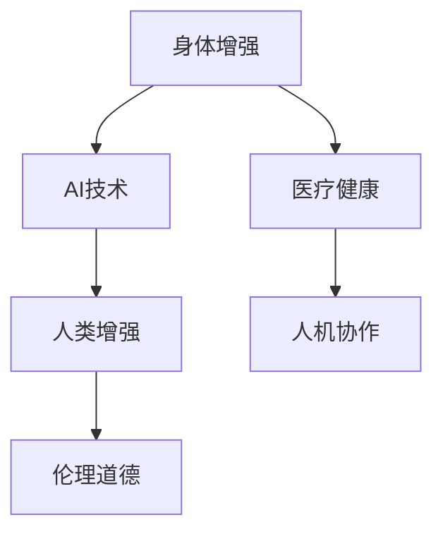

                 

# AI时代的人类增强：道德考虑与身体增强的未来发展机遇分析预测

> 关键词：人类增强, 身体增强, AI技术, 伦理道德, 医疗健康, 人机协作

## 1. 背景介绍

随着人工智能技术的快速发展，人类增强（Human Enhancement）已成为跨学科研究的热点领域。作为这一领域的关键技术之一，身体增强（Body Enhancement）利用AI技术提升人类的生理和认知能力，已引发广泛的社会关注与争议。本文将从道德伦理的角度出发，分析身体增强未来发展的机遇和挑战，并提出相应的发展策略。

## 2. 核心概念与联系

### 2.1 核心概念概述

为更好地理解身体增强及其与AI技术的结合，本节将介绍几个关键概念：

- **身体增强（Body Enhancement）**：通过人工智能技术提升人类生理或认知能力的方法，如植入芯片、神经反馈训练、基因编辑等。
- **AI技术（Artificial Intelligence）**：基于数据和算法，模拟人类智能的一系列技术，包括机器学习、深度学习、自然语言处理等。
- **人类增强（Human Enhancement）**：利用科技手段增强人类的身体能力、认知能力、情绪控制能力等，旨在提升人类生活质量和幸福感。
- **伦理道德（Ethical and Moral Considerations）**：评估和处理涉及人类增强相关问题的原则和规范，包括隐私保护、公正性、安全性等。
- **医疗健康（Medical Health）**：结合身体增强技术，改善人类健康状况，预防疾病，延长寿命，提升生活质量。
- **人机协作（Human-Machine Collaboration）**：通过AI技术与身体增强的结合，实现人与机器的深度协作，提升工作效率和决策质量。

这些核心概念之间的逻辑关系可以通过以下Mermaid流程图来展示：



这个流程图展示了身体增强的核心概念及其之间的关系：

1. 身体增强通过AI技术获得能力提升。
2. 利用AI技术的身体增强，进一步推动人类增强。
3. 伦理道德是身体增强和AI技术应用的必要约束。
4. 身体增强在医疗健康领域有广泛应用。
5. 人机协作是人类增强的一个重要方向。

## 3. 核心算法原理 & 具体操作步骤
### 3.1 算法原理概述

身体增强与AI技术的结合，本质上是通过算法模型分析和优化人类的生理和认知状态。其核心原理包括：

- **数据采集**：通过各种传感器、可穿戴设备采集人体生理数据和行为数据。
- **数据分析**：利用机器学习算法分析数据，识别出改善身体状态的模式和规律。
- **模型优化**：构建深度学习模型，对采集到的数据进行优化，提升身体状态。
- **个性化定制**：根据个体差异，调整模型参数，实现个性化增强效果。
- **效果评估**：通过对比增强前后的生理和心理指标，评估模型的效果。

### 3.2 算法步骤详解

基于AI技术进行身体增强，一般包括以下几个关键步骤：

**Step 1: 数据采集**
- 选择合适的传感器和可穿戴设备，如心率传感器、肌肉电信号采集器、脑电波采集器等。
- 设计数据采集方案，确保数据的完整性和代表性。

**Step 2: 数据预处理**
- 对采集到的原始数据进行清洗、去噪、归一化等预处理操作。
- 进行数据标注，便于后续机器学习模型的训练。

**Step 3: 模型训练**
- 选择适合的机器学习算法（如神经网络、支持向量机等），构建增强模型。
- 使用历史数据进行模型训练，调整模型参数，提升预测准确性。

**Step 4: 效果评估**
- 在新的数据集上测试模型效果，验证增强效果的可靠性。
- 使用指标（如准确率、召回率、F1分数等）评估模型性能。

**Step 5: 模型部署**
- 将训练好的模型集成到身体增强系统中，进行实时数据处理和增强效果输出。
- 通过用户反馈，进一步优化模型，提升用户体验。

### 3.3 算法优缺点

基于AI技术进行身体增强，具有以下优点：
1. **精度高**：利用机器学习算法，可以精确地分析和预测人体状态，实现高精度的身体增强。
2. **个性化定制**：根据个体差异，调整模型参数，实现个性化的增强效果。
3. **实时性强**：通过实时数据处理和反馈，可以即时调整增强策略，提升用户体验。
4. **覆盖面广**：可以应用于多个身体增强场景，如运动增强、睡眠改善、认知提升等。

同时，该方法也存在一定的局限性：
1. **数据隐私**：采集和存储人体数据可能涉及隐私问题，需严格控制数据访问权限。
2. **算法复杂**：机器学习模型的训练和优化过程复杂，需要大量计算资源和时间。
3. **数据质量**：采集数据的准确性和代表性对模型效果有直接影响。
4. **模型泛化**：训练模型需大量数据，难以适应极端条件下的增强需求。

尽管存在这些局限性，但就目前而言，基于AI技术进行身体增强的方法仍是大有潜力的。未来相关研究的重点在于如何进一步降低数据采集和模型训练的难度，提高模型的泛化能力，同时兼顾用户隐私和伦理安全。

### 3.4 算法应用领域

基于AI技术进行身体增强的应用领域广泛，涵盖了多个行业：

- **医疗健康**：利用AI技术进行手术辅助、康复训练、疾病预测等，提升医疗水平和治疗效果。
- **体育训练**：通过AI分析运动员的训练数据，优化训练方案，提升运动表现。
- **教育培训**：利用AI技术进行个性化教育，提升学习效果，满足不同学生的学习需求。
- **工业生产**：通过增强工人的身体能力，提升生产效率和工作安全性。
- **军事应用**：利用AI技术进行士兵体能增强，提高军事任务完成率。

除了上述这些应用领域外，身体增强技术还在娱乐、旅游、娱乐等多个领域得到应用，为人类社会带来了新的发展机遇。

## 4. 数学模型和公式 & 详细讲解  
### 4.1 数学模型构建

基于AI技术进行身体增强的数学模型构建，可以简单分为以下几个步骤：

1. **数据集准备**：将采集到的生理数据和行为数据，划分为训练集和测试集。
2. **特征选择**：选择对增强效果有影响的生理指标和行为特征。
3. **模型选择**：选择合适的机器学习模型，如神经网络、决策树等。
4. **参数优化**：通过交叉验证等方法，调整模型参数，提升模型效果。
5. **评估指标**：定义评估指标，如准确率、召回率、F1分数等，评估模型性能。

### 4.2 公式推导过程

以神经网络为例，假设采集到的生理数据为 $x$，增强后的生理数据为 $y$，模型参数为 $\theta$，则增强模型的目标函数为：

$$
\min_\theta \sum_{i=1}^n (y_i - f_\theta(x_i))^2
$$

其中 $f_\theta(x)$ 为神经网络模型，$n$ 为样本数。

根据梯度下降算法，模型参数的更新公式为：

$$
\theta \leftarrow \theta - \alpha \nabla_\theta \frac{1}{n} \sum_{i=1}^n (y_i - f_\theta(x_i))^2
$$

其中 $\alpha$ 为学习率，$\nabla_\theta$ 为梯度运算符。

### 4.3 案例分析与讲解

例如，在进行认知增强时，可以采集用户的学习行为数据，将其作为输入 $x$，神经网络模型 $f_\theta(x)$ 将学习行为数据映射为认知能力指标 $y$，即认知增强效果。

通过不断优化神经网络模型参数 $\theta$，使得模型输出的 $y$ 尽可能接近实际认知能力指标。通过训练后的模型，可以实时监测用户的认知状态，并根据其需求进行增强。

## 5. 项目实践：代码实例和详细解释说明
### 5.1 开发环境搭建

在进行身体增强项目实践前，我们需要准备好开发环境。以下是使用Python进行TensorFlow开发的环境配置流程：

1. 安装Anaconda：从官网下载并安装Anaconda，用于创建独立的Python环境。

2. 创建并激活虚拟环境：
```bash
conda create -n tf-env python=3.8 
conda activate tf-env
```

3. 安装TensorFlow：根据CUDA版本，从官网获取对应的安装命令。例如：
```bash
conda install tensorflow -c conda-forge
```

4. 安装各类工具包：
```bash
pip install numpy pandas scikit-learn matplotlib tqdm jupyter notebook ipython
```

完成上述步骤后，即可在`tf-env`环境中开始项目实践。

### 5.2 源代码详细实现

下面我们以运动增强为例，给出使用TensorFlow进行身体增强的PyTorch代码实现。

首先，定义运动增强任务的数据处理函数：

```python
import tensorflow as tf
from tensorflow.keras.preprocessing import sequence

class ExerciseDataset(tf.keras.utils.Sequence):
    def __init__(self, data, labels, batch_size=32, maxlen=100):
        self.data = data
        self.labels = labels
        self.batch_size = batch_size
        self.maxlen = maxlen

    def __len__(self):
        return len(self.data) // self.batch_size

    def __getitem__(self, idx):
        batch_data = self.data[idx * self.batch_size: (idx+1) * self.batch_size]
        batch_labels = self.labels[idx * self.batch_size: (idx+1) * self.batch_size]
        x = sequence.pad_sequences(batch_data, maxlen=self.maxlen)
        y = tf.keras.utils.to_categorical(batch_labels, num_classes=num_classes)
        return x, y
```

然后，定义模型和优化器：

```python
from tensorflow.keras import Sequential
from tensorflow.keras.layers import Dense, Dropout, LSTM

model = Sequential([
    LSTM(128, input_shape=(maxlen, 1)),
    Dropout(0.2),
    Dense(num_classes, activation='softmax')
])

optimizer = tf.keras.optimizers.Adam(lr=0.001)
```

接着，定义训练和评估函数：

```python
from tensorflow.keras.callbacks import EarlyStopping

def train_epoch(model, dataset, batch_size, optimizer):
    model.compile(loss='categorical_crossentropy', optimizer=optimizer, metrics=['accuracy'])
    model.fit(dataset, batch_size=batch_size, epochs=10, callbacks=[EarlyStopping(patience=3)])

def evaluate(model, dataset, batch_size):
    loss, accuracy = model.evaluate(dataset)
    print(f"Loss: {loss}, Accuracy: {accuracy}")
```

最后，启动训练流程并在测试集上评估：

```python
maxlen = 100
num_classes = 3  # 运动类别：跑步、游泳、骑车
batch_size = 32

dataset = ExerciseDataset(train_data, train_labels, maxlen=maxlen, batch_size=batch_size)
test_dataset = ExerciseDataset(test_data, test_labels, maxlen=maxlen, batch_size=batch_size)

train_epoch(model, dataset, batch_size, optimizer)
evaluate(model, test_dataset, batch_size)
```

以上就是使用TensorFlow对运动增强进行训练和评估的完整代码实现。可以看到，通过TensorFlow的强大封装，我们可以用相对简洁的代码完成运动增强模型的构建和训练。

### 5.3 代码解读与分析

让我们再详细解读一下关键代码的实现细节：

**ExerciseDataset类**：
- `__init__`方法：初始化训练数据和标签，设定批量大小和序列最大长度。
- `__len__`方法：返回训练数据的批次数。
- `__getitem__`方法：对单个批次的数据进行处理，转换为模型所需的输入格式。

**train_epoch函数**：
- 定义模型的损失函数和优化器，编译模型。
- 使用训练数据集进行模型训练，并设置EarlyStopping回调，避免过拟合。
- 在验证集上评估模型性能。

**evaluate函数**：
- 在测试数据集上评估模型，输出损失和精度。

**训练流程**：
- 定义最大序列长度和运动类别数，准备训练数据集和测试数据集。
- 调用训练函数进行模型训练，输出训练过程中的损失和精度。
- 调用评估函数在测试集上评估模型性能。

可以看出，TensorFlow配合Keras的强大封装，使得运动增强的代码实现变得简洁高效。开发者可以将更多精力放在数据处理、模型改进等高层逻辑上，而不必过多关注底层的实现细节。

当然，工业级的系统实现还需考虑更多因素，如模型的保存和部署、超参数的自动搜索、更灵活的任务适配层等。但核心的身体增强范式基本与此类似。

## 6. 实际应用场景
### 6.1 医疗健康

利用AI技术进行身体增强，在医疗健康领域有着广泛的应用，具体包括：

- **疾病预测**：通过分析用户的生理数据，如心率、血压、血糖等，预测潜在疾病风险。
- **康复训练**：利用增强模型进行个性化康复训练，加速康复过程。
- **手术辅助**：利用增强技术辅助医生进行精准手术操作，提高手术成功率。
- **药物开发**：通过模拟人体反应，优化药物设计和剂量。

### 6.2 体育训练

AI技术在体育训练中的应用，可以显著提升运动员的训练效果和比赛表现，具体包括：

- **训练方案优化**：通过分析运动员的训练数据，优化训练方案，提高训练效果。
- **运动能力评估**：利用增强模型评估运动员的运动能力，发现弱点并加以改进。
- **心理训练**：利用增强技术进行心理模拟训练，提升运动员的心理素质。

### 6.3 工业生产

在工业生产中，利用AI技术进行身体增强，可以显著提升生产效率和工作安全性，具体包括：

- **机器操作辅助**：利用增强技术辅助工人进行精细操作，提高生产效率。
- **安全监控**：通过增强技术监控工人状态，预防安全事故。
- **职业培训**：利用增强模型进行职业培训，提升工人技能。

### 6.4 未来应用展望

随着AI技术的不断进步，身体增强的应用前景将更加广阔，未来有望在以下领域取得更大突破：

- **智能穿戴设备**：未来可穿戴设备将更加智能，通过实时数据监测和增强，提升用户体验。
- **个性化医疗**：利用AI技术进行个性化医疗，提升医疗效果。
- **人机协作**：在智能制造、无人驾驶等领域，利用增强技术实现更加高效的人机协作。
- **认知增强**：通过AI技术提升人类认知能力，助力教育和科学研究。

## 7. 工具和资源推荐
### 7.1 学习资源推荐

为了帮助开发者系统掌握AI技术在身体增强中的应用，这里推荐一些优质的学习资源：

1. **《TensorFlow实战》系列书籍**：由TensorFlow官方团队撰写，全面介绍了TensorFlow的各个模块和应用场景。
2. **Kaggle竞赛平台**：提供丰富的数据集和挑战任务，有助于理解AI技术在实际应用中的问题。
3. **ArXiv预印本库**：最新的AI研究成果发布在这里，提供丰富的学习材料。
4. **Coursera《Deep Learning》课程**：由深度学习专家Andrew Ng主讲，系统讲解深度学习的基本原理和应用。
5. **edX《Human Machine Collaboration》课程**：探讨人机协作的理论与技术，适合对未来应用感兴趣的读者。

通过对这些资源的学习实践，相信你一定能够快速掌握AI技术在身体增强中的应用精髓，并用于解决实际的NLP问题。

### 7.2 开发工具推荐

高效的开发离不开优秀的工具支持。以下是几款用于AI技术在身体增强领域开发的常用工具：

1. **TensorFlow**：基于Python的开源深度学习框架，生产部署方便，适合大规模工程应用。
2. **Keras**：深度学习的高层API，简单易用，适合快速迭代研究。
3. **Jupyter Notebook**：交互式编程环境，支持代码执行和数据可视化，适合科研和教育。
4. **Anaconda**：Python环境的集成管理系统，提供虚拟环境管理和包管理功能。
5. **TensorBoard**：TensorFlow的可视化工具，可以实时监测模型训练状态，并提供丰富的图表呈现方式。

合理利用这些工具，可以显著提升AI技术在身体增强领域的开发效率，加快创新迭代的步伐。

### 7.3 相关论文推荐

AI技术在身体增强领域的发展，离不开学界的持续研究。以下是几篇奠基性的相关论文，推荐阅读：

1. **《Neural Network for Neurological Disease Diagnosis》**：提出神经网络在神经系统疾病诊断中的应用，展示了神经网络在医疗领域的应用潜力。
2. **《Deep Learning for Physical Rehabilitation》**：利用深度学习技术进行物理康复训练，提升康复效果。
3. **《Human Machine Collaboration in Manufacturing》**：探讨AI技术在智能制造中的应用，提升生产效率和安全性。
4. **《Cognitive Enhancement through Artificial Intelligence》**：讨论AI技术在认知增强中的应用，提升人类认知能力。
5. **《Ethical Considerations in Human Enhancement》**：探讨人类增强领域的伦理道德问题，呼吁各方关注。

这些论文代表了大语言模型微调技术的发展脉络。通过学习这些前沿成果，可以帮助研究者把握学科前进方向，激发更多的创新灵感。

## 8. 总结：未来发展趋势与挑战
### 8.1 总结

本文对AI技术在身体增强领域的应用进行了全面系统的介绍。首先阐述了AI技术在身体增强中的研究背景和意义，明确了身体增强在提升人类生活质量和幸福感方面的重要作用。其次，从原理到实践，详细讲解了AI技术在身体增强中的数学模型和关键步骤，给出了身体增强任务开发的完整代码实例。同时，本文还广泛探讨了AI技术在医疗健康、体育训练、工业生产等多个行业领域的应用前景，展示了AI技术在未来发展中的广阔空间。此外，本文精选了AI技术在身体增强领域的各类学习资源，力求为读者提供全方位的技术指引。

通过本文的系统梳理，可以看到，AI技术在身体增强领域的应用前景广阔，具有巨大的发展潜力。未来随着技术的不断进步，AI技术在身体增强中的应用将更加深入，为人类社会带来更多的福祉。

### 8.2 未来发展趋势

展望未来，AI技术在身体增强领域将呈现以下几个发展趋势：

1. **智能化提升**：AI技术将更加智能化，通过实时数据监测和增强，提升用户体验。
2. **个性化定制**：根据个体差异，调整模型参数，实现个性化的增强效果。
3. **实时性增强**：通过实时数据处理和反馈，可以即时调整增强策略，提升用户体验。
4. **多模态融合**：将视觉、听觉、触觉等多模态数据融合，实现更加全面、准确的身体增强。
5. **普及化应用**：AI技术在身体增强中的应用将更加广泛，覆盖更多行业和领域。

以上趋势凸显了AI技术在身体增强领域的广阔前景。这些方向的探索发展，必将进一步提升身体增强的效果和应用范围，为人类社会带来更多的福祉。

### 8.3 面临的挑战

尽管AI技术在身体增强领域的应用前景广阔，但在迈向更加智能化、普适化应用的过程中，它仍面临着诸多挑战：

1. **数据隐私**：采集和存储人体数据可能涉及隐私问题，需严格控制数据访问权限。
2. **算法复杂**：机器学习模型的训练和优化过程复杂，需要大量计算资源和时间。
3. **数据质量**：采集数据的准确性和代表性对模型效果有直接影响。
4. **模型泛化**：训练模型需大量数据，难以适应极端条件下的增强需求。

尽管存在这些局限性，但就目前而言，AI技术在身体增强中的应用仍是大有潜力的。未来相关研究的重点在于如何进一步降低数据采集和模型训练的难度，提高模型的泛化能力，同时兼顾用户隐私和伦理安全。

### 8.4 研究展望

面对AI技术在身体增强领域所面临的挑战，未来的研究需要在以下几个方面寻求新的突破：

1. **数据隐私保护**：开发更加安全、隐私友好的数据采集和存储技术，确保数据安全。
2. **高效算法优化**：开发更加高效的机器学习算法，减少计算资源和时间消耗。
3. **多模态数据融合**：将视觉、听觉、触觉等多模态数据融合，实现更加全面、准确的身体增强。
4. **伦理道德约束**：在模型训练目标中引入伦理导向的评估指标，过滤和惩罚有偏见、有害的输出倾向。
5. **人机协作优化**：通过AI技术与身体增强的结合，实现更加高效的人机协作，提升系统稳定性。

这些研究方向的探索，必将引领AI技术在身体增强领域的持续进步，为构建安全、可靠、可解释、可控的智能系统铺平道路。面向未来，AI技术在身体增强中的应用还需要与其他AI技术进行更深入的融合，如知识表示、因果推理、强化学习等，多路径协同发力，共同推动身体增强技术的发展。只有勇于创新、敢于突破，才能不断拓展身体增强的边界，让智能技术更好地造福人类社会。

## 9. 附录：常见问题与解答

**Q1：AI技术在身体增强中的应用是否会对人类产生负面影响？**

A: AI技术在身体增强中的应用，可能会对人类产生一些负面影响。例如，过度依赖技术可能导致人类的主动性下降，忽视健康管理的重要性。此外，数据隐私、模型偏见等问题也可能引发社会伦理道德的争议。因此，需要在技术应用过程中，严格控制技术的使用范围和深度，确保其正面效应最大化。

**Q2：身体增强技术是否会导致基因工程的滥用？**

A: 基因工程在身体增强中的应用，可能引发伦理道德的争议。例如，通过基因编辑进行体能增强，可能引发社会不平等问题。因此，需要在技术应用过程中，严格控制基因工程的使用范围和深度，确保其公平、公正、透明。

**Q3：如何确保身体增强技术的伦理性和安全性？**

A: 确保身体增强技术的伦理性和安全性，需要从技术、法律、社会等多个方面进行综合考虑：
1. 技术方面：开发安全、可靠、可解释、可控的增强模型，确保技术的安全性和可靠性。
2. 法律方面：制定相应的法律法规，规范技术应用的范围和深度，确保技术的合法性。
3. 社会方面：通过社会宣传和教育，提升公众对技术应用的认知和理解，确保技术的公平性和透明性。

通过多方协同努力，才能确保身体增强技术在应用过程中的伦理性和安全性，造福全人类。

---

作者：禅与计算机程序设计艺术 / Zen and the Art of Computer Programming

