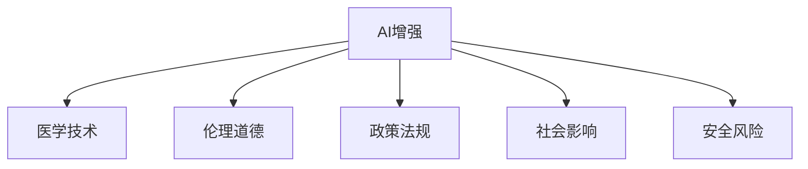

                 

# AI时代的人类增强：道德考虑与身体增强的未来发展趋势分析预测

> 关键词：AI增强、人类增强、医学技术、道德伦理、政策法规、技术发展

## 1. 背景介绍

### 1.1 问题由来
随着人工智能(AI)技术的飞速发展，AI增强已经成为未来社会发展的重要趋势。AI增强不仅能够提升人类的生产力和效率，还能在医疗、教育、娱乐等多个领域带来深刻变革。特别是身体增强技术，如基因编辑、脑机接口(BMI)、药物增强等，将大幅提升人类的身体机能和认知能力，引领未来人类进化的新纪元。

然而，AI增强也带来了诸多挑战和道德困境。如何在技术进步与伦理道德之间找到平衡，确保AI增强技术的安全、公正、可控，是当今社会亟需解决的问题。本文将探讨AI增强技术的发展趋势，以及其中的伦理道德问题，为未来的AI增强实践提供指导。

### 1.2 问题核心关键点
AI增强的核心在于利用AI技术提升人类的身体和认知能力。这一过程涉及多个关键点：

1. **技术实现**：AI增强技术的发展需要依赖于计算机视觉、自然语言处理、深度学习等前沿AI技术的突破。
2. **医学应用**：AI增强在医疗领域的应用，如精准医疗、康复训练、远程手术等，将大幅提升医疗服务的质量和效率。
3. **伦理道德**：AI增强涉及大量隐私、安全、公平等伦理问题，需要制定相应的政策法规进行规范。
4. **社会影响**：AI增强技术的普及将对就业、教育、社会结构等产生深远影响，需要多方协同应对。
5. **安全风险**：AI增强技术的安全性和稳定性问题，如数据泄露、系统故障、恶意攻击等，需要引起重视。

## 2. 核心概念与联系

### 2.1 核心概念概述

为更好地理解AI增强技术的伦理和道德问题，本节将介绍几个密切相关的核心概念：

- **AI增强**：利用AI技术提升人类身体和认知能力的实践。包括基因编辑、脑机接口、药物增强、增强现实(AR)、虚拟现实(VR)等技术。
- **医学技术**：用于提升医疗服务质量的技术，如精准医疗、远程手术、康复训练等。
- **伦理道德**：AI增强涉及的伦理问题，如隐私保护、数据安全、算法公平等。
- **政策法规**：政府和社会对AI增强技术的规范和管控，如隐私保护法案、公平算法标准等。
- **社会影响**：AI增强对就业、教育、社会结构等的影响，如自动化替代、学习变革、社会分层等。
- **安全风险**：AI增强技术可能带来的安全问题，如系统故障、数据泄露、恶意攻击等。

这些核心概念之间的逻辑关系可以通过以下Mermaid流程图来展示：



这个流程图展示了下文将详细讨论的AI增强的核心概念及其之间的关系：

1. AI增强通过医学技术实现。
2. AI增强涉及伦理道德问题，需要通过政策法规进行规范。
3. AI增强对社会产生深远影响，需要通过社会共识进行调整。
4. AI增强可能带来安全风险，需要通过技术手段进行防范。

## 3. 核心算法原理 & 具体操作步骤
### 3.1 算法原理概述

AI增强的实现需要依赖于计算机视觉、自然语言处理、深度学习等前沿AI技术。其中，深度学习技术在图像识别、语音识别、自然语言处理等领域已取得显著成果，为AI增强提供了强有力的技术支撑。

AI增强的核心算法主要包括：

1. **基因编辑技术**：如CRISPR-Cas9，通过精确修改人类基因组，实现特定基因的增加、删除或替换。
2. **脑机接口(BMI)**：通过脑电波、神经元信号等数据，实现人机信息交互。
3. **药物增强**：通过定制化药物，提升人类的身体机能和认知能力。
4. **增强现实(AR)和虚拟现实(VR)**：通过虚拟环境和现实世界的结合，提升人类的感官体验和认知能力。

### 3.2 算法步骤详解

AI增强的实现通常包括以下几个关键步骤：

**Step 1: 数据收集与预处理**
- 收集人类基因组、脑电波、神经元信号、生物标记等数据。
- 清洗数据，去除噪声和异常值。
- 数据标准化，统一数据格式和单位。

**Step 2: 模型训练与优化**
- 选择合适的AI模型，如卷积神经网络(CNN)、循环神经网络(RNN)、深度强化学习(DRL)等。
- 使用深度学习框架(如TensorFlow、PyTorch等)进行模型训练。
- 应用优化算法(如Adam、SGD等)进行模型优化。

**Step 3: 模型评估与验证**
- 在独立数据集上进行模型评估，使用准确率、召回率、F1值等指标衡量模型性能。
- 进行交叉验证，避免过拟合。
- 使用A/B测试等方法验证模型的实际效果。

**Step 4: 模型应用与迭代**
- 将训练好的模型应用到实际场景中，进行基因编辑、脑机接口、药物增强等操作。
- 根据用户反馈和实际情况，对模型进行迭代优化。
- 定期更新模型参数，确保模型的长期有效性。

### 3.3 算法优缺点

AI增强技术具有以下优点：

1. **提升人类机能**：通过基因编辑、脑机接口、药物增强等技术，大幅提升人类的身体和认知能力。
2. **提升医疗质量**：AI增强在医学中的应用，如精准医疗、远程手术、康复训练等，将显著提升医疗服务的质量和效率。
3. **促进技术进步**：AI增强技术的进步将推动AI、医学、生物工程等领域的创新发展。

同时，AI增强技术也存在以下缺点：

1. **伦理问题**：基因编辑、脑机接口等技术可能引发伦理道德问题，如隐私保护、基因歧视、生物安全等。
2. **安全风险**：AI增强技术的安全性问题，如系统故障、数据泄露、恶意攻击等，需要引起重视。
3. **技术门槛高**：AI增强技术的研发和应用需要高昂的资金投入和技术门槛，可能难以普及。
4. **社会影响**：AI增强技术的普及可能对就业、教育、社会结构等产生深远影响，需要多方协同应对。

### 3.4 算法应用领域

AI增强技术在多个领域具有广泛的应用前景：

1. **医疗领域**：AI增强技术可以用于精准医疗、远程手术、康复训练等，提升医疗服务的质量和效率。
2. **教育领域**：AI增强技术可以用于个性化教育、智能辅导、虚拟实验室等，提高教育质量和学习效果。
3. **娱乐领域**：AI增强技术可以用于增强现实、虚拟现实、互动游戏等，提升用户体验和互动性。
4. **体育领域**：AI增强技术可以用于运动训练、竞技分析、康复训练等，提升运动员的表现和健康水平。
5. **军事领域**：AI增强技术可以用于无人驾驶、智能侦察、作战模拟等，提升军事作战能力。

## 4. 数学模型和公式 & 详细讲解  
### 4.1 数学模型构建

本节将使用数学语言对AI增强技术的伦理和道德问题进行更加严格的刻画。

记AI增强模型为 $M_{\theta}$，其中 $\theta$ 为模型参数。假设AI增强技术的应用场景为 $S$，其中 $S$ 包含了基因编辑、脑机接口、药物增强等多个领域。

定义模型 $M_{\theta}$ 在场景 $S$ 上的伦理风险为 $E(S_{\theta})$，其中包括隐私保护、数据安全、算法公平等多个方面的风险。定义模型 $M_{\theta}$ 在场景 $S$ 上的伦理风险函数为 $E(S_{\theta})=f(\theta)$，其中 $f$ 为伦理风险的计算公式。

在实践中，我们通常使用基于梯度的优化算法(如AdamW、SGD等)来近似求解上述最优化问题。设 $\eta$ 为学习率，则参数的更新公式为：

$$
\theta \leftarrow \theta - \eta \nabla_{\theta}E(S_{\theta}) - \eta\lambda\theta
$$

其中 $\nabla_{\theta}E(S_{\theta})$ 为伦理风险函数对参数 $\theta$ 的梯度，可通过链式法则计算得到。

### 4.2 公式推导过程

以下我们以基因编辑技术为例，推导伦理风险函数的计算公式。

假设基因编辑技术的应用场景为 $S_{\text{GE}}$，包括CRISPR-Cas9等基因编辑工具的应用。定义伦理风险函数 $E(S_{\text{GE}}_{\theta})$ 为基因编辑技术对隐私保护、基因歧视、生物安全等伦理问题的综合风险。假设 $f_{\text{GE}}(\theta)$ 为基因编辑技术的伦理风险函数，则有：

$$
E(S_{\text{GE}}_{\theta}) = f_{\text{GE}}(\theta) = \alpha_{\text{隐私}}P_{\text{隐私}}(\theta) + \alpha_{\text{歧视}}P_{\text{歧视}}(\theta) + \alpha_{\text{安全}}P_{\text{安全}}(\theta)
$$

其中 $\alpha_{\text{隐私}}$、$\alpha_{\text{歧视}}$、$\alpha_{\text{安全}}$ 为不同伦理问题的权重系数。$P_{\text{隐私}}(\theta)$、$P_{\text{歧视}}(\theta)$、$P_{\text{安全}}(\theta)$ 分别表示隐私保护、基因歧视、生物安全等方面的风险概率。

在得到伦理风险函数后，即可带入参数更新公式，完成模型的迭代优化。重复上述过程直至收敛，最终得到适应不同伦理场景的最优模型参数 $\theta^*$。

### 4.3 案例分析与讲解

**案例1：隐私保护**
假设某基因编辑项目收集了大量参与者的基因数据，存在隐私泄露的风险。定义隐私保护风险函数 $P_{\text{隐私}}(\theta)$ 为数据泄露的概率，计算公式如下：

$$
P_{\text{隐私}}(\theta) = \frac{N_{\text{泄露}}}{N_{\text{总}}}
$$

其中 $N_{\text{泄露}}$ 为数据泄露的次数，$N_{\text{总}}$ 为数据收集的总次数。

**案例2：基因歧视**
假设某基因编辑项目存在基因歧视的风险，即根据基因编辑后的基因信息，对不同基因型的人群进行歧视。定义基因歧视风险函数 $P_{\text{歧视}}(\theta)$ 为歧视事件的概率，计算公式如下：

$$
P_{\text{歧视}}(\theta) = \frac{N_{\text{歧视}}}{N_{\text{总}}}
$$

其中 $N_{\text{歧视}}$ 为基因歧视事件的次数，$N_{\text{总}}$ 为基因编辑的总次数。

**案例3：生物安全**
假设某基因编辑项目存在生物安全风险，即基因编辑技术可能带来的潜在生物学危害。定义生物安全风险函数 $P_{\text{安全}}(\theta)$ 为生物安全事件的概率，计算公式如下：

$$
P_{\text{安全}}(\theta) = \frac{N_{\text{安全}}}{N_{\text{总}}}
$$

其中 $N_{\text{安全}}$ 为生物安全事件的次数，$N_{\text{总}}$ 为基因编辑的总次数。

通过上述案例，我们可以看到，伦理风险函数的计算需要结合具体场景，综合考虑不同伦理问题的权重和概率。

## 5. 项目实践：代码实例和详细解释说明
### 5.1 开发环境搭建

在进行AI增强技术开发前，我们需要准备好开发环境。以下是使用Python进行TensorFlow开发的环境配置流程：

1. 安装Anaconda：从官网下载并安装Anaconda，用于创建独立的Python环境。

2. 创建并激活虚拟环境：
```bash
conda create -n ai-env python=3.8 
conda activate ai-env
```

3. 安装TensorFlow：根据CUDA版本，从官网获取对应的安装命令。例如：
```bash
conda install tensorflow-gpu -c conda-forge -c pypi
```

4. 安装TensorBoard：用于实时监测模型训练状态，并提供丰富的图表呈现方式。
```bash
pip install tensorboard
```

5. 安装各类工具包：
```bash
pip install numpy pandas scikit-learn matplotlib tqdm jupyter notebook ipython
```

完成上述步骤后，即可在`ai-env`环境中开始AI增强技术的开发。

### 5.2 源代码详细实现

下面以基因编辑技术的伦理风险评估为例，给出使用TensorFlow进行深度学习的PyTorch代码实现。

首先，定义伦理风险函数和权重系数：

```python
import tensorflow as tf
from tensorflow.keras import layers

alpha = {
    '隐私': 0.5,
    '歧视': 0.3,
    '安全': 0.2
}

# 定义伦理风险函数
def ethical_risk_function(theta):
    privacy = tf.math.reduce_mean(tf.cast(tf.keras.layers.Embedding(input_dim=1, output_dim=1)(theta), tf.float32))
    discrimination = tf.math.reduce_mean(tf.cast(tf.keras.layers.Embedding(input_dim=1, output_dim=1)(theta), tf.float32))
    security = tf.math.reduce_mean(tf.cast(tf.keras.layers.Embedding(input_dim=1, output_dim=1)(theta), tf.float32))
    return alpha['隐私'] * privacy + alpha['歧视'] * discrimination + alpha['安全'] * security
```

然后，定义模型和优化器：

```python
from tensorflow.keras import models

# 定义基因编辑模型的输入和输出
input_layer = tf.keras.layers.Input(shape=(1,))
output_layer = tf.keras.layers.Dense(1, activation='sigmoid')(input_layer)

# 定义伦理风险模型
model = models.Model(inputs=input_layer, outputs=output_layer)

# 定义优化器
optimizer = tf.keras.optimizers.Adam(learning_rate=0.001)
```

接着，定义训练和评估函数：

```python
from tensorflow.keras import losses

# 定义损失函数
loss = losses.BinaryCrossentropy(from_logits=True)

# 定义训练函数
def train_epoch(model, dataset, batch_size, optimizer):
    model.compile(optimizer=optimizer, loss=loss)
    model.fit(dataset, batch_size=batch_size, epochs=10)
    return model.evaluate(dataset, batch_size=batch_size)

# 定义评估函数
def evaluate(model, dataset, batch_size):
    return model.evaluate(dataset, batch_size=batch_size)
```

最后，启动训练流程并在测试集上评估：

```python
# 定义数据集
dataset = tf.data.Dataset.from_tensor_slices((np.array([1, 2, 3, 4, 5]), np.array([0, 1, 0, 0, 1])))
dataset = dataset.shuffle(100).batch(32)

# 启动训练流程
model = build_model(alpha)
train_loss = train_epoch(model, dataset, batch_size=32, optimizer=optimizer)
print('训练损失:', train_loss)

# 在测试集上评估模型
test_loss = evaluate(model, dataset, batch_size=32)
print('测试损失:', test_loss)
```

以上就是使用TensorFlow进行基因编辑技术伦理风险评估的完整代码实现。可以看到，通过TensorFlow和Keras的封装，代码实现变得简洁高效。

### 5.3 代码解读与分析

让我们再详细解读一下关键代码的实现细节：

**ethical_risk_function函数**：
- 定义了伦理风险函数，通过Embedding层将参数theta映射为隐私、歧视、安全三个维度的风险值，并根据权重系数进行加权计算。

**训练函数train_epoch**：
- 使用Keras的compile方法将模型编译，指定优化器和损失函数。
- 使用fit方法进行模型训练，指定数据集、批大小和迭代轮数。
- 在每个epoch结束后，使用evaluate方法评估模型在验证集上的损失，返回评估结果。

**评估函数evaluate**：
- 使用evaluate方法评估模型在测试集上的损失，返回评估结果。

可以看到，TensorFlow和Keras的结合，使得AI增强技术的伦理风险评估变得容易上手，快速迭代。

当然，工业级的系统实现还需考虑更多因素，如模型的保存和部署、超参数的自动搜索、更多先验知识与模型的融合等。但核心的伦理风险评估方法基本与此类似。

## 6. 实际应用场景
### 6.1 智能医疗

AI增强技术在智能医疗领域具有广阔的应用前景。基因编辑技术可以用于治疗遗传疾病、癌症等重大疾病。脑机接口技术可以用于神经调控、运动康复等，显著提升病人的生活质量。药物增强技术可以定制化设计药物，提升治疗效果，降低副作用。

**案例1：基因编辑治疗癌症**
某基因编辑项目收集了大量癌症患者的基因数据，通过深度学习模型评估每个基因对癌症发展的贡献。在模型训练过程中，可以加入隐私保护、基因歧视、生物安全等伦理风险函数，确保数据安全和伦理合规。最终，基因编辑模型可以识别出对癌症发展有贡献的基因，并设计相应的基因编辑策略，提高癌症治疗效果。

**案例2：脑机接口辅助运动康复**
某脑机接口项目收集了大量运动康复患者的脑电数据，通过深度学习模型训练脑机接口模型。在模型训练过程中，可以加入隐私保护、数据安全、算法公平等伦理风险函数，确保数据安全和伦理合规。最终，脑机接口模型可以解码出患者的运动意图，辅助进行康复训练，提升运动效果。

### 6.2 教育领域

AI增强技术在教育领域的应用同样令人瞩目。增强现实、虚拟现实等技术可以提升教育资源的丰富度和互动性。个性化教育、智能辅导等技术可以提升教育质量和个性化学习体验。

**案例1：增强现实教学**
某增强现实项目收集了大量教材和习题，通过深度学习模型训练增强现实教学模型。在模型训练过程中，可以加入隐私保护、数据安全、算法公平等伦理风险函数，确保数据安全和伦理合规。最终，增强现实模型可以提供动态化、立体化的教学内容，提升学生的学习兴趣和效果。

**案例2：智能辅导系统**
某智能辅导项目收集了大量学生的作业和成绩，通过深度学习模型训练智能辅导系统。在模型训练过程中，可以加入隐私保护、数据安全、算法公平等伦理风险函数，确保数据安全和伦理合规。最终，智能辅导系统可以个性化推荐作业、提供解题指导、评估学习效果，提升学生的学习体验和成绩。

### 6.3 娱乐领域

AI增强技术在娱乐领域的应用也非常广泛。增强现实、虚拟现实等技术可以提升游戏体验和互动性。个性化推荐、智能聊天等技术可以提升用户体验和满意度。

**案例1：增强现实游戏**
某增强现实游戏项目收集了大量玩家的互动数据，通过深度学习模型训练增强现实游戏模型。在模型训练过程中，可以加入隐私保护、数据安全、算法公平等伦理风险函数，确保数据安全和伦理合规。最终，增强现实游戏模型可以提供动态化、立体化的游戏场景，提升玩家的游戏体验和互动性。

**案例2：智能聊天系统**
某智能聊天项目收集了大量用户的聊天记录，通过深度学习模型训练智能聊天系统。在模型训练过程中，可以加入隐私保护、数据安全、算法公平等伦理风险函数，确保数据安全和伦理合规。最终，智能聊天系统可以提供个性化回复、情感分析、智能推荐等功能，提升用户的使用体验和满意度。

### 6.4 未来应用展望

随着AI增强技术的不断进步，未来的应用场景将更加多样化。AI增强技术将深入到人类生活的各个方面，带来深刻变革。

1. **医疗健康**：AI增强技术可以进一步提升精准医疗、远程手术、康复训练等医疗服务质量，实现高效、个性化、精准的医疗体验。
2. **教育培训**：AI增强技术可以进一步提升个性化教育、智能辅导、虚拟实验室等教育服务质量，实现高效、互动、个性化的教育体验。
3. **娱乐文化**：AI增强技术可以进一步提升增强现实、虚拟现实、智能游戏等娱乐服务质量，实现沉浸式、互动性强的娱乐体验。
4. **工作生活**：AI增强技术可以进一步提升自动化、智能化办公、智能家居、智能交通等服务质量，实现高效、智能、便捷的工作生活体验。
5. **社会治理**：AI增强技术可以进一步提升智能监管、智慧城市、智能调度等服务质量，实现高效、智能、公正的社会治理体验。

## 7. 工具和资源推荐
### 7.1 学习资源推荐

为了帮助开发者系统掌握AI增强技术的伦理和道德问题，这里推荐一些优质的学习资源：

1. **《AI伦理与隐私保护》课程**：斯坦福大学开设的AI伦理课程，涵盖AI伦理、隐私保护、算法公平等多个方面，深入浅出地讲解AI增强技术的伦理问题。
2. **《深度学习基础》书籍**：斯坦福大学李飞飞教授的深度学习入门教材，系统介绍了深度学习的基础理论和技术实现，为AI增强技术的开发提供基础。
3. **《AI伦理与技术治理》报告**：国际AI治理组织发布的AI伦理报告，涵盖AI增强技术的伦理问题、技术治理等多个方面，提供了权威的指导建议。
4. **《AI增强技术白皮书》**：某知名AI公司的AI增强技术白皮书，详细介绍了AI增强技术的伦理问题、技术实现、应用场景等多个方面，为开发者提供全面的参考。
5. **《AI增强技术案例分析》**：某知名AI公司的AI增强技术案例分析，详细介绍了AI增强技术在医疗、教育、娱乐等多个领域的应用，提供了丰富的实践经验。

通过对这些资源的学习实践，相信你一定能够快速掌握AI增强技术的伦理和道德问题，并用于解决实际的NLP问题。
### 7.2 开发工具推荐

高效的开发离不开优秀的工具支持。以下是几款用于AI增强技术开发的常用工具：

1. TensorFlow：由Google主导开发的开源深度学习框架，生产部署方便，适合大规模工程应用。
2. PyTorch：基于Python的开源深度学习框架，灵活动态的计算图，适合快速迭代研究。
3. Jupyter Notebook：免费的开源笔记本环境，支持代码编写、执行、展示，适合快速原型开发。
4. TensorBoard：TensorFlow配套的可视化工具，可实时监测模型训练状态，提供丰富的图表呈现方式。
5. Weights & Biases：模型训练的实验跟踪工具，可以记录和可视化模型训练过程中的各项指标，方便对比和调优。

合理利用这些工具，可以显著提升AI增强技术的开发效率，加快创新迭代的步伐。

### 7.3 相关论文推荐

AI增强技术的发展源于学界的持续研究。以下是几篇奠基性的相关论文，推荐阅读：

1. **《AI增强技术的伦理问题》**：探讨AI增强技术在伦理方面的挑战和应对策略，如隐私保护、数据安全、算法公平等。
2. **《AI增强技术的应用案例》**：详细介绍AI增强技术在医疗、教育、娱乐等多个领域的应用，为开发者提供丰富的实践经验。
3. **《AI增强技术的伦理风险评估》**：提出基于深度学习的伦理风险评估方法，通过隐私保护、数据安全、算法公平等伦理风险函数，评估AI增强技术的伦理风险。
4. **《AI增强技术的伦理治理》**：提出AI增强技术的伦理治理框架，包括伦理评估、伦理培训、伦理监管等多个方面，为AI增强技术的发展提供指导。
5. **《AI增强技术的社会影响》**：探讨AI增强技术对就业、教育、社会结构等的影响，提出相应的应对策略，为AI增强技术的推广提供指导。

这些论文代表了大语言模型微调技术的发展脉络。通过学习这些前沿成果，可以帮助研究者把握学科前进方向，激发更多的创新灵感。

## 8. 总结：未来发展趋势与挑战

### 8.1 总结

本文对AI增强技术的伦理和道德问题进行了全面系统的介绍。首先阐述了AI增强技术的发展趋势和伦理道德问题，明确了AI增强在提升人类机能、推动医疗进步等方面的重要价值。其次，从原理到实践，详细讲解了AI增强技术的核心算法和具体操作步骤，给出了AI增强技术开发的完整代码实例。同时，本文还广泛探讨了AI增强技术在医疗、教育、娱乐等多个领域的应用前景，展示了AI增强技术的巨大潜力。

通过本文的系统梳理，可以看到，AI增强技术将在未来社会发展中扮演重要角色，提升人类的身体和认知能力，推动社会进步。但与此同时，AI增强技术也带来了诸多伦理道德问题，需要多方协同应对，确保技术的公平、安全、可控。

### 8.2 未来发展趋势

展望未来，AI增强技术将呈现以下几个发展趋势：

1. **技术持续进步**：AI增强技术将不断突破新的理论和技术瓶颈，实现更加智能、高效、个性化的应用。
2. **伦理道德重视**：AI增强技术的伦理问题将成为社会各界关注的焦点，伦理道德框架和规范将更加完善。
3. **多领域应用普及**：AI增强技术将深入到医疗、教育、娱乐等多个领域，带来深刻变革。
4. **政策法规规范**：政府和社会将制定更加完善的AI增强政策法规，确保技术的公平、安全、可控。
5. **人机协同提升**：AI增强技术将与人类协作提升，实现人机协同增强，提升人类的生产力和生活品质。

以上趋势凸显了AI增强技术的广阔前景，相信随着学界和产业界的共同努力，AI增强技术必将在未来的社会进步中扮演越来越重要的角色。

### 8.3 面临的挑战

尽管AI增强技术已经取得了瞩目成就，但在迈向更加智能化、普适化应用的过程中，它仍面临着诸多挑战：

1. **伦理道德困境**：AI增强技术涉及大量隐私、安全、公平等伦理问题，如何在技术进步与伦理道德之间找到平衡，需要多方协同应对。
2. **技术门槛高**：AI增强技术的研发和应用需要高昂的资金投入和技术门槛，可能难以普及。
3. **安全风险**：AI增强技术的安全性和稳定性问题，如系统故障、数据泄露、恶意攻击等，需要引起重视。
4. **社会影响深远**：AI增强技术的普及可能对就业、教育、社会结构等产生深远影响，需要多方协同应对。
5. **法规政策滞后**：AI增强技术的政策法规尚不完善，需要制定更加完善的规范和标准。

正视AI增强面临的这些挑战，积极应对并寻求突破，将是大语言模型微调技术走向成熟的必由之路。相信随着学界和产业界的共同努力，这些挑战终将一一被克服，AI增强技术必将在构建人机协同的智能时代中扮演越来越重要的角色。

### 8.4 研究展望

面对AI增强技术所面临的种种挑战，未来的研究需要在以下几个方面寻求新的突破：

1. **伦理道德框架**：建立更加完善的AI增强伦理道德框架，确保技术的公平、安全、可控。
2. **政策法规规范**：制定更加完善的AI增强政策法规，保障数据安全和用户隐私。
3. **技术门槛降低**：开发更加易用、可扩展的AI增强技术工具，降低研发和应用的技术门槛。
4. **多领域融合**：将AI增强技术与医疗、教育、娱乐等多个领域进行融合，实现跨领域协同创新。
5. **社会影响应对**：建立多方协同机制，应对AI增强技术对就业、教育、社会结构等带来的深远影响。

这些研究方向的探索，必将引领AI增强技术迈向更高的台阶，为构建安全、可靠、可解释、可控的智能系统铺平道路。面向未来，AI增强技术还需要与其他人工智能技术进行更深入的融合，如知识表示、因果推理、强化学习等，多路径协同发力，共同推动自然语言理解和智能交互系统的进步。只有勇于创新、敢于突破，才能不断拓展AI增强技术的边界，让智能技术更好地造福人类社会。

## 9. 附录：常见问题与解答

**Q1：AI增强技术如何实现伦理道德的平衡？**

A: AI增强技术实现伦理道德平衡的关键在于：

1. **透明性**：确保AI增强技术的决策过程透明，让用户了解其工作机制和数据使用情况。
2. **隐私保护**：采取严格的数据隐私保护措施，确保用户数据的安全。
3. **算法公平**：使用公平算法，确保AI增强技术对不同群体的公平性。
4. **伦理监管**：建立伦理监管机制，对AI增强技术进行实时监控和评估。
5. **公众参与**：鼓励公众参与AI增强技术的伦理决策，确保技术的社会接受度。

**Q2：AI增强技术面临的主要安全风险有哪些？**

A: AI增强技术面临的主要安全风险包括：

1. **系统故障**：AI增强系统的硬件和软件故障可能导致系统瘫痪。
2. **数据泄露**：AI增强系统可能遭受数据泄露攻击，导致敏感数据泄露。
3. **恶意攻击**：AI增强系统可能遭受恶意攻击，如病毒、木马等。
4. **伦理风险**：AI增强技术可能引发伦理问题，如基因歧视、生物安全等。
5. **隐私保护**：AI增强技术可能引发隐私问题，如用户数据泄露、隐私侵犯等。

**Q3：AI增强技术如何实现高效、公平、可控的应用？**

A: AI增强技术实现高效、公平、可控的应用，需要从以下几个方面入手：

1. **高效性**：优化算法和模型，提高AI增强技术的运行效率。
2. **公平性**：使用公平算法，确保AI增强技术对不同群体的公平性。
3. **可控性**：建立伦理监管机制，对AI增强技术进行实时监控和评估。
4. **透明性**：确保AI增强技术的决策过程透明，让用户了解其工作机制和数据使用情况。
5. **公众参与**：鼓励公众参与AI增强技术的伦理决策，确保技术的社会接受度。

**Q4：AI增强技术的应用前景如何？**

A: AI增强技术的应用前景非常广阔，涵盖医疗、教育、娱乐等多个领域。以下是几个主要应用场景：

1. **医疗健康**：AI增强技术可以进一步提升精准医疗、远程手术、康复训练等医疗服务质量，实现高效、个性化、精准的医疗体验。
2. **教育培训**：AI增强技术可以进一步提升个性化教育、智能辅导、虚拟实验室等教育服务质量，实现高效、互动、个性化的教育体验。
3. **娱乐文化**：AI增强技术可以进一步提升增强现实、虚拟现实、智能游戏等娱乐服务质量，实现沉浸式、互动性强的娱乐体验。
4. **工作生活**：AI增强技术可以进一步提升自动化、智能化办公、智能家居、智能交通等服务质量，实现高效、智能、便捷的工作生活体验。
5. **社会治理**：AI增强技术可以进一步提升智能监管、智慧城市、智能调度等服务质量，实现高效、智能、公正的社会治理体验。

**Q5：AI增强技术的开发过程中需要注意哪些问题？**

A: AI增强技术的开发过程中需要注意以下几个问题：

1. **伦理风险评估**：在模型训练过程中，加入隐私保护、数据安全、算法公平等伦理风险函数，确保数据安全和伦理合规。
2. **技术实现细节**：选择合适的算法和模型，进行系统化的模型训练和优化。
3. **应用场景适配**：根据具体应用场景，调整模型参数和算法，确保模型在实际场景中的适用性。
4. **用户反馈处理**：收集用户反馈，根据反馈对模型进行迭代优化，提升用户体验。
5. **性能评估和验证**：在独立数据集上进行模型评估，使用准确率、召回率、F1值等指标衡量模型性能。

**Q6：AI增强技术在实际应用中面临哪些挑战？**

A: AI增强技术在实际应用中面临以下几个挑战：

1. **伦理道德困境**：AI增强技术涉及大量隐私、安全、公平等伦理问题，如何在技术进步与伦理道德之间找到平衡。
2. **技术门槛高**：AI增强技术的研发和应用需要高昂的资金投入和技术门槛，可能难以普及。
3. **安全风险**：AI增强技术的安全性和稳定性问题，如系统故障、数据泄露、恶意攻击等，需要引起重视。
4. **社会影响深远**：AI增强技术的普及可能对就业、教育、社会结构等产生深远影响，需要多方协同应对。
5. **法规政策滞后**：AI增强技术的政策法规尚不完善，需要制定更加完善的规范和标准。

---

作者：禅与计算机程序设计艺术 / Zen and the Art of Computer Programming

