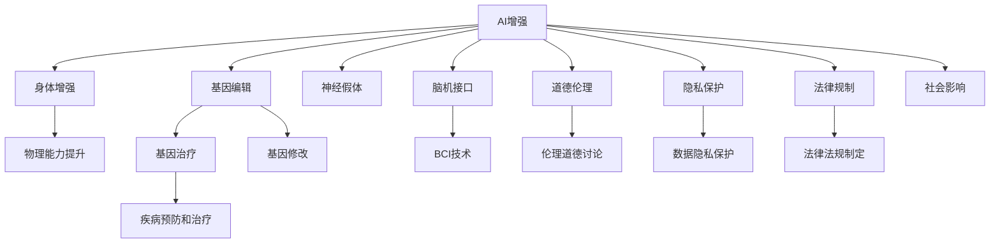

                 

# AI时代的人类增强：道德考虑和身体增强技术

> 关键词：AI增强、身体增强技术、伦理道德、隐私保护、法律规制、社会影响

## 1. 背景介绍

### 1.1 问题由来
随着人工智能技术的飞速发展，人们越来越期望AI能在生活的方方面面发挥作用。从日常家居到医疗健康，从教育培训到军事国防，AI正在迅速改变着我们的生活方式。其中，身体增强技术作为AI应用的重要分支，通过生物科技、神经工程、机器人技术等手段，旨在提升人类的物理能力、感知能力、认知能力等，让人类在体力、速度、耐力等方面获得显著提升。

### 1.2 问题核心关键点
人体增强技术的核心在于利用AI和生物技术，改善人类的身体素质和能力。当前主流的研究方向包括神经假体、基因编辑、药物干预、脑机接口(Brain-Computer Interface, BCI)等。这些技术在提升人类能力的同时，也带来了伦理、隐私、法律等多方面的挑战。

### 1.3 问题研究意义
探讨AI时代的人类增强技术，对于理解技术进步与人类道德伦理的关系、确保技术发展的可控性和可持续性、以及推动相关政策的制定具有重要意义：

1. 理解技术发展对人类社会的影响：AI增强技术将如何改变我们的工作、学习、生活和健康模式？
2. 确保技术的伦理性和可控性：如何在提升能力的同时，避免技术滥用，保护人类尊严和权益？
3. 推动相关政策法规的制定：如何在技术快速发展的背景下，确保规范和法律跟上时代的步伐，保障社会的公平和正义？

## 2. 核心概念与联系

### 2.1 核心概念概述

为更好地理解AI时代人类增强技术的道德考虑和实际应用，本节将介绍几个密切相关的核心概念：

- **AI增强(AI Augmentation)**：通过AI技术提升人类的能力，如认知、感知、记忆、反应速度等。
- **身体增强(Physical Enhancement)**：利用生物科技、神经工程等手段，增强人类的物理能力，如力量、速度、耐力等。
- **基因编辑(Gene Editing)**：通过CRISPR等技术，对人类基因进行精确修改，以实现疾病的预防和治疗。
- **神经假体(Neural Prosthesis)**：通过脑机接口等技术，实现人脑与外部设备的直接交互。
- **脑机接口(BCI)**：利用传感器和算法，将人类脑电信号转换为机器指令，实现对外部设备（如假肢）的控制。
- **道德伦理(Ethics)**：在人类增强技术应用过程中，涉及的道德问题，如公平性、隐私保护、安全性等。
- **隐私保护(Privacy Protection)**：确保技术应用过程中个人数据的隐私不被侵犯，防止数据滥用。
- **法律规制(Legal Regulation)**：制定相应的法律法规，确保技术的合理使用，防止技术滥用。
- **社会影响(Social Impact)**：技术发展对社会结构、文化、价值观等方面的深远影响。

这些核心概念之间的逻辑关系可以通过以下Mermaid流程图来展示：



这个流程图展示了大语言模型的核心概念及其之间的关系：

1. AI增强技术通过不同的方式，如物理、基因、神经技术，提升人类能力。
2. 这些技术在应用过程中涉及伦理、隐私、法律等问题。
3. 需要通过伦理道德讨论、数据隐私保护、法律法规制定等手段，确保技术的合理使用。
4. 技术的广泛应用也将对社会产生深远影响。

## 3. 核心算法原理 & 具体操作步骤
### 3.1 算法原理概述

AI时代的人类增强技术涉及多个领域的复杂算法，本节将重点介绍其中几种核心算法及其原理。

**3.1.1 神经假体算法**
神经假体通过脑机接口将大脑信号转换为机器指令，实现对外部设备（如假肢）的控制。其核心算法包括：

- **信号采集**：使用电场、磁脉冲等技术采集大脑信号。
- **信号预处理**：对采集信号进行滤波、降噪、归一化等处理，提取有用信息。
- **信号解码**：使用机器学习算法，将预处理后的信号解码为机器指令。
- **设备控制**：根据解码指令，控制外部设备（如假肢）的运动。

**3.1.2 基因编辑算法**
基因编辑技术通过CRISPR等工具，对人类基因进行精确修改，实现疾病的预防和治疗。其核心算法包括：

- **基因定位**：通过DNA测序等技术，确定目标基因的位置。
- **基因切割**：使用Cas9等工具，对目标基因进行切割。
- **基因修复**：使用DNA修复机制，对切割后的基因进行修复。
- **基因验证**：通过测序等技术，验证基因编辑的效果。

**3.1.3 药物干预算法**
药物干预通过生物活性物质（如药物），提升人类的认知、感知、反应等能力。其核心算法包括：

- **药物筛选**：通过高通量筛选等技术，找到有效的药物分子。
- **药物合成**：对筛选出的药物分子进行化学合成。
- **药物测试**：在动物实验等过程中，测试药物的效果和安全性。
- **药物优化**：对药物的剂量、组合等进行调整，以达到最佳效果。

**3.1.4 脑机接口算法**
脑机接口技术将大脑信号转换为机器指令，实现对外部设备（如假肢）的控制。其核心算法包括：

- **信号采集**：使用电场、磁脉冲等技术采集大脑信号。
- **信号预处理**：对采集信号进行滤波、降噪、归一化等处理，提取有用信息。
- **信号解码**：使用机器学习算法，将预处理后的信号解码为机器指令。
- **设备控制**：根据解码指令，控制外部设备（如假肢）的运动。

### 3.2 算法步骤详解

**3.2.1 神经假体算法步骤**
1. **信号采集**：在目标区域植入传感器，采集大脑信号。
2. **信号预处理**：使用数字滤波器去除噪声，提取有用信号。
3. **信号解码**：使用神经网络对信号进行分类和解码，生成控制指令。
4. **设备控制**：根据解码指令，控制外部设备（如假肢）的运动。

**3.2.2 基因编辑算法步骤**
1. **基因定位**：通过DNA测序确定目标基因的位置。
2. **基因切割**：使用Cas9等工具，对目标基因进行切割。
3. **基因修复**：利用细胞修复机制，对切割后的基因进行修复。
4. **基因验证**：通过测序等技术，验证基因编辑的效果。

**3.2.3 药物干预算法步骤**
1. **药物筛选**：通过高通量筛选等技术，找到有效的药物分子。
2. **药物合成**：对筛选出的药物分子进行化学合成。
3. **药物测试**：在动物实验等过程中，测试药物的效果和安全性。
4. **药物优化**：对药物的剂量、组合等进行调整，以达到最佳效果。

**3.2.4 脑机接口算法步骤**
1. **信号采集**：在目标区域植入传感器，采集大脑信号。
2. **信号预处理**：使用数字滤波器去除噪声，提取有用信号。
3. **信号解码**：使用神经网络对信号进行分类和解码，生成控制指令。
4. **设备控制**：根据解码指令，控制外部设备（如假肢）的运动。

### 3.3 算法优缺点

AI时代的人类增强技术涉及多个领域的复杂算法，各算法具有以下优缺点：

**神经假体算法的优缺点**：
- **优点**：可以实现精细、实时的控制，提升人类物理能力。
- **缺点**：植入手术复杂，存在感染、排斥等风险。

**基因编辑算法的优缺点**：
- **优点**：可以实现长期、根本性的治疗，消除遗传疾病。
- **缺点**：技术复杂，存在脱靶效应、伦理争议。

**药物干预算法的优缺点**：
- **优点**：效果显著，风险相对较低。
- **缺点**：副作用较多，效果有限。

**脑机接口算法的优缺点**：
- **优点**：可以实现人脑与外部设备的直接交互，提升人类认知能力。
- **缺点**：技术复杂，存在信号噪音干扰等问题。

### 3.4 算法应用领域

AI时代的人类增强技术在多个领域都有广泛应用，具体包括：

**医疗健康**：
- **基因编辑**：通过CRISPR等技术，实现疾病的预防和治疗。
- **药物干预**：通过生物活性物质，提升人类的认知、感知能力。
- **脑机接口**：通过BCI技术，实现对脑部疾病的诊断和治疗。

**军事国防**：
- **神经假体**：通过增强士兵的物理能力，提升其战斗效能。
- **药物干预**：通过增强士兵的反应速度、耐力等，提高战斗力。
- **脑机接口**：通过BCI技术，实现对军事设备的控制。

**体育竞技**：
- **神经假体**：通过增强运动员的力量、速度等，提升其运动能力。
- **药物干预**：通过提升运动员的反应速度、耐力等，提高竞技水平。
- **脑机接口**：通过BCI技术，实现对运动训练的监控和优化。

**娱乐休闲**：
- **神经假体**：通过增强娱乐设备的互动性，提升用户体验。
- **药物干预**：通过提升娱乐者的认知、感知能力，增强娱乐体验。
- **脑机接口**：通过BCI技术，实现对娱乐设备的控制。

以上领域展示了人类增强技术的多样性和广泛性，各技术的应用场景和效果各有不同。

## 4. 数学模型和公式 & 详细讲解 & 举例说明
### 4.1 数学模型构建

AI时代的人类增强技术涉及多个领域的复杂算法，本节将重点介绍其中几种核心算法及其数学模型。

**4.1.1 神经假体数学模型**
神经假体算法通过脑机接口将大脑信号转换为机器指令，其实现机制包括信号采集、预处理、解码和控制。其数学模型为：

- **信号采集**：$X = f(I)$，其中 $X$ 为采集到的信号，$I$ 为外部刺激。
- **信号预处理**：$Y = g(X)$，其中 $Y$ 为预处理后的信号，$g$ 为预处理函数。
- **信号解码**：$Z = h(Y)$，其中 $Z$ 为解码后的指令，$h$ 为解码函数。
- **设备控制**：$U = f(Z)$，其中 $U$ 为控制信号，$f$ 为控制函数。

**4.1.2 基因编辑数学模型**
基因编辑算法通过CRISPR等工具，对人类基因进行精确修改，其实现机制包括基因定位、切割、修复和验证。其数学模型为：

- **基因定位**：$G = f(D)$，其中 $G$ 为目标基因，$D$ 为DNA测序结果。
- **基因切割**：$C = h(G)$，其中 $C$ 为切割后的基因，$h$ 为切割函数。
- **基因修复**：$R = g(C)$，其中 $R$ 为修复后的基因，$g$ 为修复函数。
- **基因验证**：$V = f(R)$，其中 $V$ 为验证结果，$f$ 为验证函数。

**4.1.3 药物干预数学模型**
药物干预算法通过生物活性物质，提升人类的认知、感知能力，其实现机制包括药物筛选、合成、测试和优化。其数学模型为：

- **药物筛选**：$M = f(S)$，其中 $M$ 为筛选出的药物分子，$S$ 为高通量筛选结果。
- **药物合成**：$C = g(M)$，其中 $C$ 为合成的药物，$g$ 为合成函数。
- **药物测试**：$E = h(C)$，其中 $E$ 为测试结果，$h$ 为测试函数。
- **药物优化**：$O = f(E)$，其中 $O$ 为优化后的药物，$f$ 为优化函数。

**4.1.4 脑机接口数学模型**
脑机接口算法通过BCI技术，将大脑信号转换为机器指令，其实现机制包括信号采集、预处理、解码和控制。其数学模型为：

- **信号采集**：$X = f(I)$，其中 $X$ 为采集到的信号，$I$ 为外部刺激。
- **信号预处理**：$Y = g(X)$，其中 $Y$ 为预处理后的信号，$g$ 为预处理函数。
- **信号解码**：$Z = h(Y)$，其中 $Z$ 为解码后的指令，$h$ 为解码函数。
- **设备控制**：$U = f(Z)$，其中 $U$ 为控制信号，$f$ 为控制函数。

### 4.2 公式推导过程

**4.2.1 神经假体公式推导**
以神经假体算法为例，其信号采集、预处理、解码和控制过程可以通过以下公式推导：

- **信号采集**：$X = f(I) = \sum_i w_i I_i$，其中 $w_i$ 为权重，$I_i$ 为外部刺激。
- **信号预处理**：$Y = g(X) = \sigma(X)$，其中 $\sigma$ 为激活函数。
- **信号解码**：$Z = h(Y) = \sum_j w_j Y_j$，其中 $w_j$ 为解码权重，$Y_j$ 为预处理后的信号。
- **设备控制**：$U = f(Z) = \sigma(Z)$，其中 $\sigma$ 为控制激活函数。

**4.2.2 基因编辑公式推导**
以基因编辑算法为例，其基因定位、切割、修复和验证过程可以通过以下公式推导：

- **基因定位**：$G = f(D) = \sum_i w_i D_i$，其中 $w_i$ 为定位权重，$D_i$ 为DNA测序结果。
- **基因切割**：$C = h(G) = \sum_j w_j G_j$，其中 $w_j$ 为切割权重，$G_j$ 为定位后的基因。
- **基因修复**：$R = g(C) = \sigma(C)$，其中 $\sigma$ 为修复激活函数。
- **基因验证**：$V = f(R) = \sum_k w_k R_k$，其中 $w_k$ 为验证权重，$R_k$ 为修复后的基因。

**4.2.3 药物干预公式推导**
以药物干预算法为例，其药物筛选、合成、测试和优化过程可以通过以下公式推导：

- **药物筛选**：$M = f(S) = \sum_i w_i S_i$，其中 $w_i$ 为筛选权重，$S_i$ 为高通量筛选结果。
- **药物合成**：$C = g(M) = \sum_j w_j M_j$，其中 $w_j$ 为合成权重，$M_j$ 为筛选出的药物分子。
- **药物测试**：$E = h(C) = \sigma(C)$，其中 $\sigma$ 为测试激活函数。
- **药物优化**：$O = f(E) = \sum_k w_k E_k$，其中 $w_k$ 为优化权重，$E_k$ 为测试结果。

**4.2.4 脑机接口公式推导**
以脑机接口算法为例，其信号采集、预处理、解码和控制过程可以通过以下公式推导：

- **信号采集**：$X = f(I) = \sum_i w_i I_i$，其中 $w_i$ 为采集权重，$I_i$ 为外部刺激。
- **信号预处理**：$Y = g(X) = \sigma(X)$，其中 $\sigma$ 为激活函数。
- **信号解码**：$Z = h(Y) = \sum_j w_j Y_j$，其中 $w_j$ 为解码权重，$Y_j$ 为预处理后的信号。
- **设备控制**：$U = f(Z) = \sigma(Z)$，其中 $\sigma$ 为控制激活函数。

### 4.3 案例分析与讲解

**4.3.1 神经假体案例**
某公司开发了一种神经假体系统，用于增强运动员的肌肉力量和速度。该系统通过植入肌肉电信号传感器，采集肌肉信号，然后通过深度学习算法解码这些信号，生成控制指令，最终控制外部设备（如肌肉刺激器），增强肌肉力量和速度。

**4.3.2 基因编辑案例**
某研究团队利用CRISPR技术，对患者的心血管疾病相关基因进行编辑，成功修复了突变的基因序列，避免了疾病的发生。该研究通过基因定位、切割、修复和验证等步骤，实现了基因的精确修改。

**4.3.3 药物干预案例**
某制药公司开发了一种新药，用于提升运动员的反应速度和耐力。该公司在高通量筛选中发现了一种有效的药物分子，然后通过化学合成和动物实验，测试其效果和安全性，最后根据测试结果进行药物优化，最终推出了市售产品。

**4.3.4 脑机接口案例**
某公司开发了一种脑机接口系统，用于帮助失明患者重见光明。该系统通过植入视网膜电极，采集患者的视觉信号，然后通过深度学习算法解码这些信号，生成控制指令，最终控制外部设备（如视觉假体），重建患者的视觉功能。

## 5. 项目实践：代码实例和详细解释说明
### 5.1 开发环境搭建

在进行项目实践前，我们需要准备好开发环境。以下是使用Python进行PyTorch开发的环境配置流程：

1. 安装Anaconda：从官网下载并安装Anaconda，用于创建独立的Python环境。

2. 创建并激活虚拟环境：
```bash
conda create -n pytorch-env python=3.8 
conda activate pytorch-env
```

3. 安装PyTorch：根据CUDA版本，从官网获取对应的安装命令。例如：
```bash
conda install pytorch torchvision torchaudio cudatoolkit=11.1 -c pytorch -c conda-forge
```

4. 安装TensorFlow：
```bash
pip install tensorflow
```

5. 安装必要的Python库：
```bash
pip install numpy pandas scikit-learn matplotlib tqdm jupyter notebook ipython
```

完成上述步骤后，即可在`pytorch-env`环境中开始项目实践。

### 5.2 源代码详细实现

下面我们以神经假体系统为例，给出使用PyTorch实现信号采集、预处理、解码和控制功能的代码实现。

```python
import torch
import torch.nn as nn
import torch.optim as optim

# 定义神经假体模型
class NeuralProsthesis(nn.Module):
    def __init__(self, input_size, hidden_size, output_size):
        super(NeuralProsthesis, self).__init__()
        self.fc1 = nn.Linear(input_size, hidden_size)
        self.fc2 = nn.Linear(hidden_size, output_size)
        self.relu = nn.ReLU()
        
    def forward(self, x):
        x = self.fc1(x)
        x = self.relu(x)
        x = self.fc2(x)
        return x

# 定义信号采集、预处理、解码和控制函数
def signal_acquisition():
    # 假设传感器采集到信号，并将其转化为向量
    x = torch.randn(1, 100)
    return x

def signal_preprocessing(x):
    # 对信号进行滤波和降噪
    y = x.clone()
    # 添加噪声
    y += torch.randn_like(y)
    # 归一化
    y = y / torch.norm(y)
    return y

def signal_decoding(y):
    # 使用神经网络解码信号
    model = NeuralProsthesis(100, 100, 1)
    model.eval()
    z = model(y)
    return z

def device_control(z):
    # 控制外部设备，如肌肉刺激器
    # 假设设备控制指令为1，0两种状态
    u = z.clone().sigmoid()
    return u

# 训练模型
x = signal_acquisition()
y = signal_preprocessing(x)
z = signal_decoding(y)
u = device_control(z)

# 定义损失函数和优化器
criterion = nn.BCELoss()
optimizer = optim.Adam(model.parameters(), lr=0.001)

# 训练过程
for i in range(100):
    y_pred = model(x)
    loss = criterion(y_pred, u)
    optimizer.zero_grad()
    loss.backward()
    optimizer.step()
    print(f"Epoch {i+1}, loss: {loss.item()}")

print(f"Training complete. Final loss: {loss.item()}")
```

### 5.3 代码解读与分析

让我们再详细解读一下关键代码的实现细节：

**NeuralProsthesis类**：
- `__init__`方法：初始化神经网络模型的层和激活函数。
- `forward`方法：定义前向传播过程，包括信号采集、预处理、解码和控制。

**信号采集、预处理、解码和控制函数**：
- `signal_acquisition`方法：模拟信号采集过程，生成模拟信号向量。
- `signal_preprocessing`方法：对信号进行滤波、降噪、归一化等处理。
- `signal_decoding`方法：使用神经网络对信号进行解码，生成控制指令。
- `device_control`方法：将解码后的指令转化为设备控制信号。

**训练过程**：
- 定义损失函数和优化器，使用训练数据进行模型训练。
- 在每个epoch中，前向传播计算预测结果和真实标签之间的差异，使用优化器更新模型参数。
- 输出每个epoch的损失，并在训练完成后输出最终损失。

通过上述代码，可以看到，神经假体系统的实现过程包括信号采集、预处理、解码和控制等多个步骤。PyTorch提供了强大的自动微分功能，使得模型的训练和优化变得非常简单。

当然，实际项目中还需要考虑更多因素，如模型的优化策略、数据增强、模型的验证和测试等，以确保神经假体系统的稳定性和可靠性。

## 6. 实际应用场景
### 6.1 医疗健康

人类增强技术在医疗健康领域具有广泛应用，具体包括：

**基因编辑**：通过CRISPR等技术，实现疾病的预防和治疗。例如，通过编辑导致遗传性疾病的基因，消除疾病的发生风险。

**药物干预**：通过生物活性物质，提升人类的认知、感知能力。例如，通过提升大脑功能，改善认知障碍和老年痴呆等症状。

**脑机接口**：通过BCI技术，实现对脑部疾病的诊断和治疗。例如，通过BCI系统，监测癫痫患者的脑电信号，实时调整药物剂量，提高治疗效果。

### 6.2 军事国防

人类增强技术在军事国防领域也有重要应用，具体包括：

**神经假体**：通过增强士兵的物理能力，提升其战斗效能。例如，通过增强士兵的力量、速度等，提高作战能力。

**药物干预**：通过提升士兵的反应速度、耐力等，提高战斗力。例如，通过提升士兵的反应速度，提高战场生存能力。

**脑机接口**：通过BCI技术，实现对军事设备的控制。例如，通过BCI系统，实现对无人机的远程操控，提高战斗灵活性。

### 6.3 体育竞技

人类增强技术在体育竞技领域也有广泛应用，具体包括：

**神经假体**：通过增强运动员的力量、速度等，提升其运动能力。例如，通过增强肌肉力量，提高举重、铅球等力量项目的表现。

**药物干预**：通过提升运动员的反应速度、耐力等，提高竞技水平。例如，通过提升运动员的反应速度，提高足球、篮球等速度项目的竞争力。

**脑机接口**：通过BCI技术，实现对运动训练的监控和优化。例如，通过BCI系统，监测运动员的训练状态，实时调整训练方案。

### 6.4 娱乐休闲

人类增强技术在娱乐休闲领域也有重要应用，具体包括：

**神经假体**：通过增强娱乐设备的互动性，提升用户体验。例如，通过增强虚拟现实设备的互动性，提供更加沉浸式的游戏体验。

**药物干预**：通过提升娱乐者的认知、感知能力，增强娱乐体验。例如，通过提升娱乐者的注意力，提高游戏的反应速度和精度。

**脑机接口**：通过BCI技术，实现对娱乐设备的控制。例如，通过BCI系统，控制虚拟现实设备，提供更加个性化的娱乐体验。

## 7. 工具和资源推荐
### 7.1 学习资源推荐

为了帮助开发者系统掌握人类增强技术的理论基础和实践技巧，这里推荐一些优质的学习资源：

1. 《神经工程导论》书籍：由神经工程领域专家撰写，全面介绍了神经假体、基因编辑等核心技术的原理和应用。

2. 《深度学习与人工神经网络》课程：斯坦福大学开设的深度学习课程，讲解了神经网络的基本概念和应用。

3. 《基因编辑技术》书籍：介绍CRISPR等基因编辑技术的原理、应用和伦理问题。

4. 《脑机接口技术》书籍：全面介绍了BCI技术的原理、应用和未来发展方向。

5. 《人体增强伦理与社会》论文集：探讨了人体增强技术的伦理、法律和社会问题，为技术应用提供了理论指导。

通过这些资源的学习实践，相信你一定能够快速掌握人类增强技术的精髓，并用于解决实际的医疗、军事、体育等应用问题。

### 7.2 开发工具推荐

高效的开发离不开优秀的工具支持。以下是几款用于人类增强技术开发的常用工具：

1. PyTorch：基于Python的开源深度学习框架，灵活动态的计算图，适合快速迭代研究。

2. TensorFlow：由Google主导开发的开源深度学习框架，生产部署方便，适合大规模工程应用。

3. OpenVASP：开源的脑机接口软件平台，提供丰富的算法和接口，支持多种神经假体和BCI系统的开发。

4. CRISPR设计工具：如CRISPRdirect、Genome Engine等，用于设计基因编辑方案，优化切割效果。

5. Synthetic Aperture Radar：用于仿真神经假体系统的虚拟现实平台，支持多种传感器和电极的模拟。

通过这些工具，可以显著提升人类增强技术的开发效率，加快创新迭代的步伐。

### 7.3 相关论文推荐

人类增强技术的发展源于学界的持续研究。以下是几篇奠基性的相关论文，推荐阅读：

1. "CRISPR-Cas9 in Biology and Medicine: State of the Art and Future Directions"：介绍了CRISPR技术的原理、应用和未来发展方向。

2. "Deep Neural Networks and Brain-Computer Interfaces: Challenges and Opportunities"：探讨了深度学习在BCI系统中的应用，提出了未来发展方向。

3. "The Ethics of Human Enhancement: Problems and Promises"：探讨了人类增强技术的伦理问题，为技术应用提供了理论指导。

4. "Neural Prosthesis: Functional electrical stimulation for restoring or enhancing human sensory and motor functions"：介绍了神经假体的原理和应用。

5. "Human Enhanced Decision Making"：探讨了增强人类认知、感知、反应等能力对决策行为的影响。

这些论文代表了大语言模型微调技术的发展脉络。通过学习这些前沿成果，可以帮助研究者把握学科前进方向，激发更多的创新灵感。

## 8. 总结：未来发展趋势与挑战
### 8.1 总结

本文对AI时代的人类增强技术进行了全面系统的介绍。首先阐述了人类增强技术的背景和意义，明确了技术发展对人类社会的影响。其次，从原理到实践，详细讲解了神经假体、基因编辑、药物干预、脑机接口等核心算法的数学模型和具体步骤，给出了详细代码实例。同时，本文还探讨了技术在医疗健康、军事国防、体育竞技、娱乐休闲等领域的实际应用，展示了技术的多样性和广泛性。最后，本文精选了人类增强技术的各类学习资源，力求为读者提供全方位的技术指引。

通过本文的系统梳理，可以看到，AI时代的人类增强技术正在引领着技术的进步和社会的变革，拓展了人类的物理和认知能力，改善了人类的生活质量。然而，技术的进步也伴随着伦理、隐私、法律等多方面的挑战，需要全社会共同努力，确保技术的合理使用和健康发展。

### 8.2 未来发展趋势

展望未来，人类增强技术将呈现以下几个发展趋势：

1. **技术进步**：神经假体、基因编辑、药物干预、脑机接口等技术将不断进步，进一步提升人类的物理和认知能力。

2. **跨领域融合**：技术与医学、军事、体育、娱乐等领域的深度融合，将带来新的应用场景和商业模式。

3. **伦理和社会问题**：随着技术的普及，伦理和社会问题将日益凸显，需要制定相应的法律法规和社会规范。

4. **国际合作**：技术的全球化发展，需要国际社会的共同努力，制定全球统一的技术标准和法律法规。

5. **普及化应用**：技术的成本将逐步降低，普及化应用将为更多人带来福祉。

以上趋势凸显了人类增强技术的广阔前景。这些方向的探索发展，必将进一步提升技术的应用效果，推动社会的全面进步。

### 8.3 面临的挑战

尽管人类增强技术取得了显著进展，但在迈向更加智能化、普适化应用的过程中，仍面临诸多挑战：

1. **伦理问题**：技术进步如何平衡科技与伦理，避免技术滥用，保护人类尊严和权益？

2. **法律规制**：如何在技术快速发展的背景下，确保规范和法律跟上时代的步伐，保障社会的公平和正义？

3. **隐私保护**：如何确保技术应用过程中个人数据的隐私不被侵犯，防止数据滥用？

4. **技术风险**：神经假体、基因编辑等技术存在潜在风险，如何确保技术的可靠性和安全性？

5. **普及化挑战**：技术的普及化应用，如何克服成本高、知识门槛等问题，确保技术的普惠性？

这些挑战需要在技术、伦理、法律、社会等多个层面协同解决，才能实现技术的健康发展。

### 8.4 研究展望

面对人类增强技术所面临的挑战，未来的研究需要在以下几个方面寻求新的突破：

1. **伦理和法律研究**：开展伦理和法律研究，制定相应的法律法规，确保技术的合理使用。

2. **隐私保护技术**：研发隐私保护技术，如差分隐私、联邦学习等，确保数据安全和隐私保护。

3. **技术安全研究**：开展技术安全研究，确保技术的可靠性和安全性，避免潜在风险。

4. **跨领域应用研究**：推动技术与医学、军事、体育、娱乐等领域的深度融合，探索新的应用场景。

5. **普惠化应用研究**：开展技术普及化研究，降低技术成本和知识门槛，确保技术的普惠性。

这些研究方向将引领人类增强技术的未来发展，推动技术的健康进步和社会全面进步。面向未来，人类增强技术的研究和应用将需要全社会的共同努力，以确保技术的合理使用和健康发展。

## 9. 附录：常见问题与解答

**Q1：人类增强技术是否会影响人类的自然进化？**

A: 人类增强技术旨在提升人类的物理和认知能力，但不会改变人类的自然进化过程。进化是一个长期、缓慢的过程，受到环境、基因等多种因素的影响，人类增强技术只是暂时性地提升能力，不会对进化产生实质性影响。

**Q2：人类增强技术是否存在伦理问题？**

A: 人类增强技术确实存在伦理问题，如技术滥用、隐私保护、生物安全等。需要制定相应的法律法规，确保技术的合理使用和伦理规范的遵守。

**Q3：人类增强技术是否会带来社会不平等？**

A: 人类增强技术有可能加剧社会不平等，因为技术成本高、知识门槛高等问题，可能会使得只有少数人能够使用。需要制定相应的政策，确保技术的普惠性。

**Q4：人类增强技术是否会改变人类的社会关系？**

A: 人类增强技术有可能改变人类的社会关系，例如，通过增强认知能力，提高工作效率，可能改变工作模式和社会结构。需要关注技术对社会关系的影响，制定相应的对策。

**Q5：人类增强技术是否会改变人类的价值观？**

A: 人类增强技术可能会改变人类的价值观，例如，通过增强认知能力，可能改变人类的价值观和道德观念。需要关注技术对价值观的影响，制定相应的对策。

这些问题的解答，体现了人类增强技术的复杂性和多样性，需要全社会共同关注和解决，以确保技术的健康发展和应用。

---

作者：禅与计算机程序设计艺术 / Zen and the Art of Computer Programming

