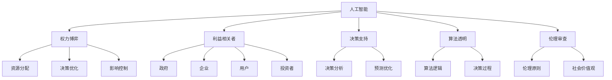

                 

# AI时代的权力博弈:平衡不同利益相关者的诉求

> 关键词：人工智能, 权力博弈, 利益相关者, 决策支持, 算法透明, 伦理审查

## 1. 背景介绍

### 1.1 问题由来
在当今高速发展的AI时代，人工智能（AI）技术正逐步渗透到各个行业和领域，从金融、医疗、教育到交通、物流、制造，AI的应用无所不在。AI技术的普及和发展，不仅带来了前所未有的效率提升和创新，也引发了一系列复杂的社会、经济和伦理问题。例如，在自动化、数据隐私、就业替代等方面，不同利益相关者（包括企业、政府、用户、投资者等）的诉求如何平衡？如何在AI技术的普及应用中，既实现技术进步，又保障各方的权益？这些问题逐渐成为了公众关注和学术界研究的热点。

### 1.2 问题核心关键点
AI时代的权力博弈，本质上是在技术进步和伦理道德、经济利益、社会公平之间寻找平衡的过程。不同利益相关者的诉求各不相同，如何在技术开发、应用部署、社会影响等各个环节，构建一个包容、透明、公正的AI生态系统，是当前AI发展面临的核心挑战。

### 1.3 问题研究意义
研究AI时代的权力博弈，对于理解AI技术发展的内在动力和外部约束，制定有效的政策和规范，推动AI技术的健康发展，具有重要意义：

1. 提供决策支持：通过分析不同利益相关者的诉求，可以为政府和企业提供制定政策、优化管理决策的依据，推动AI技术更好地服务于社会。
2. 保障各方权益：在AI技术应用的各个环节中，通过多方参与和监督，确保各方的合法利益不受侵犯，构建公平透明的AI生态。
3. 推动伦理审查：通过伦理审查机制，确保AI技术的开发和应用遵循伦理原则，避免潜在的道德风险。
4. 促进技术进步：平衡不同利益相关者的诉求，可以协调各方资源，促进AI技术的快速发展和应用，推动社会进步。
5. 构建社会共识：通过多方对话和合作，建立社会对AI技术的广泛共识，促进AI技术的良性发展。

## 2. 核心概念与联系

### 2.1 核心概念概述

为更好地理解AI时代的权力博弈，本节将介绍几个密切相关的核心概念：

- 人工智能(AI)：通过计算机系统模拟人类智能行为的技术，包括机器学习、深度学习、自然语言处理等子领域。
- 权力博弈(Power Politics)：指不同利益相关者在资源、决策、影响等权力层面上的竞争和合作，通常涉及多方复杂的利益冲突和协调。
- 利益相关者(Stakeholders)：指对AI技术应用有直接或间接利益影响的各类主体，包括政府、企业、用户、投资者等。
- 决策支持(Decision Support)：通过AI技术提供决策分析、预测和优化，支持决策者的决策过程。
- 算法透明(Algorithm Transparency)：指AI系统的算法逻辑和决策过程应是可解释和可追溯的，确保算法的透明性和可信度。
- 伦理审查(Ethical Review)：通过伦理委员会对AI技术应用的伦理问题进行审查，确保符合伦理原则和社会价值观。

这些核心概念之间的逻辑关系可以通过以下Mermaid流程图来展示：



这个流程图展示了一系列核心概念之间的相互作用关系：

1. 人工智能技术通过权力博弈，在不同利益相关者之间分配资源、优化决策、控制影响。
2. 利益相关者通过决策支持和算法透明，参与到AI技术的开发和应用中，保障自身权益。
3. 决策支持依赖算法透明和伦理审查，确保决策的科学性和公正性。
4. 算法透明和伦理审查共同维护算法的可信度和伦理道德，促进AI技术的健康发展。

这些概念共同构成了AI技术发展和应用的基础框架，对于理解AI时代权力博弈具有重要意义。

## 3. 核心算法原理 & 具体操作步骤
### 3.1 算法原理概述

AI时代的权力博弈，通常涉及多个利益相关者之间的资源分配、决策优化、影响控制等复杂过程。其核心在于通过算法和模型，预测、分析和优化这些博弈过程，以达到多方共赢的目标。

形式化地，假设利益相关者集合为 $S=\{j\}_{j=1}^J$，其中 $j$ 表示不同的利益相关者。设每个利益相关者 $j$ 的诉求为 $V_j$，目标为 $O_j$。AI技术作为决策工具，目标是最大化整体诉求 $V=\sum_{j=1}^JV_j$，同时满足每个利益相关者的约束条件 $O_j$。

通过多目标优化模型，可以描述不同利益相关者的博弈过程：

$$
\max_{X} \sum_{j=1}^J \omega_jV_j \quad \text{s.t.} \quad O_j(X) \leq 0, \forall j \in S
$$

其中 $X$ 为决策变量，$\omega_j$ 为第 $j$ 个利益相关者的权重，反映了其在博弈中的影响力。$O_j(X)$ 为第 $j$ 个利益相关者的约束条件，如数据隐私、算法透明等。

### 3.2 算法步骤详解

AI时代的权力博弈算法通常包括以下几个关键步骤：

**Step 1: 利益相关者识别与分析**

- 明确利益相关者集合 $S$ 和各自诉求 $V_j$。
- 通过问卷调查、访谈等方式，收集利益相关者的期望和关注点。
- 使用情感分析、主题建模等技术，对利益相关者的反馈进行分析，提取关键诉求。

**Step 2: 构建博弈模型**

- 根据利益相关者的诉求，构建多目标优化模型，如Pareto最优、纳什均衡等。
- 考虑不同利益相关者的权重 $\omega_j$，反映了其在博弈中的相对重要性。
- 设置约束条件 $O_j(X)$，确保各方的合法利益不受侵犯。

**Step 3: 算法求解与验证**

- 使用优化算法（如遗传算法、粒子群优化等）求解博弈模型，找到满足各方诉求的可行解 $X^*$。
- 验证 $X^*$ 是否满足各方的约束条件 $O_j(X^*)$。
- 通过迭代优化，不断调整各方的权重 $\omega_j$，确保均衡解的有效性。

**Step 4: 决策支持与实施**

- 将求解的均衡解 $X^*$ 应用于AI系统的开发和部署。
- 建立透明的决策支持系统，提供实时的决策分析、预测和优化。
- 定期收集反馈，根据实际情况调整利益相关者的权重和约束条件，优化博弈模型。

### 3.3 算法优缺点

AI时代的权力博弈算法具有以下优点：

1. 全局优化：通过多目标优化模型，可以综合考虑不同利益相关者的诉求，实现全局最优解。
2. 多方协作：算法通过协调多方资源，确保各方的合法利益得到保障，促进协作共赢。
3. 灵活适应：算法可以根据实际情况不断调整各方的权重和约束条件，适应动态变化的博弈过程。
4. 决策支持：通过透明的决策支持系统，提供科学的决策依据，提升决策的合理性和有效性。

同时，该算法也存在一定的局限性：

1. 复杂度高：多目标优化模型通常计算复杂度高，求解时间较长。
2. 数据依赖：算法的有效性依赖于利益相关者的诉求数据，数据的准确性和完整性对结果影响较大。
3. 模型假设：算法假设各方的诉求和约束条件已知，实际情况可能更为复杂。
4. 公平性问题：模型求解可能偏向某些强权利益相关者，难以完全保证公平性。
5. 技术门槛高：算法需要较高的数学和计算技术，普通开发者难以快速上手。

尽管存在这些局限性，但就目前而言，AI时代的权力博弈算法在多目标决策优化领域仍具有重要价值。未来相关研究的方向在于如何进一步降低算法复杂度，提高模型透明度，优化决策过程，以更好地服务于社会。

### 3.4 算法应用领域

AI时代的权力博弈算法，主要应用于以下几个领域：

1. 政策制定：政府在制定AI政策时，需要平衡不同利益相关者的诉求，确保政策的公平性和有效性。
2. 企业战略：企业在AI技术应用中，需要协调各方资源，制定合理的战略目标，推动业务发展。
3. 社会治理：社会在治理AI技术时，需要考虑多方利益，建立透明公正的治理机制，保障公众权益。
4. 教育培训：教育机构在引入AI技术时，需要平衡师生、家长、学校等多方的需求，优化教学效果。
5. 健康医疗：医疗机构在应用AI技术时，需要平衡患者、医生、医院等多方的利益，提供优质的医疗服务。
6. 金融保险：金融机构在应用AI技术时，需要平衡客户、监管、员工等多方的需求，提升服务质量。
7. 环境保护：环境保护机构在应用AI技术时，需要平衡生态、社区、企业等多方的需求，促进可持续发展。

这些领域的应用场景，充分展示了AI时代权力博弈算法的广泛适用性。通过多方协作和透明决策，可以有效平衡不同利益相关者的诉求，推动AI技术更好地服务于社会。

## 4. 数学模型和公式 & 详细讲解  
### 4.1 数学模型构建

本节将使用数学语言对AI时代的权力博弈算法进行更加严格的刻画。

设决策变量为 $X$，包括模型参数、策略变量等。假设利益相关者集合为 $S=\{j\}_{j=1}^J$，其中 $j$ 表示不同的利益相关者。设每个利益相关者 $j$ 的诉求为 $V_j$，目标为 $O_j$。AI技术作为决策工具，目标是最大化整体诉求 $V=\sum_{j=1}^JV_j$，同时满足每个利益相关者的约束条件 $O_j(X)$。

形式化地，设利益相关者 $j$ 的诉求函数为 $f_j(X)$，目标函数为 $g_j(X)$，约束条件为 $h_j(X)$。则权力博弈问题可以描述为：

$$
\max_{X} \sum_{j=1}^J \omega_j f_j(X) \quad \text{s.t.} \quad g_j(X) \leq 0, \forall j \in S
$$

其中 $\omega_j$ 为第 $j$ 个利益相关者的权重，反映了其在博弈中的影响力。

### 4.2 公式推导过程

以一个简单的双目标优化问题为例，推导权力博弈的求解过程：

假设存在两个利益相关者，分别表示政府和企业。政府的目标是最大化公共福利 $f_G(X)$，企业目标则是最大化利润 $f_E(X)$。双方共同约束是数据隐私 $h(X)$，即确保数据隐私不被侵犯。则优化问题可以描述为：

$$
\max_{X} f_G(X) + \omega_G f_E(X) \quad \text{s.t.} \quad h(X) \leq 0
$$

其中 $\omega_G$ 为政府在博弈中的权重。

使用拉格朗日乘子法求解上述优化问题，定义拉格朗日函数 $\mathcal{L}(X, \lambda)$：

$$
\mathcal{L}(X, \lambda) = f_G(X) + \omega_G f_E(X) - \lambda h(X)
$$

根据拉格朗日乘子法，得到必要条件：

$$
\frac{\partial \mathcal{L}}{\partial X} = 0, \quad \frac{\partial \mathcal{L}}{\partial \lambda} = 0
$$

将上述条件代入拉格朗日函数，得：

$$
\frac{\partial f_G}{\partial X} + \omega_G \frac{\partial f_E}{\partial X} + \lambda \frac{\partial h}{\partial X} = 0
$$

求解上述方程组，即可得到均衡解 $X^*$。

在求解过程中，需要反复调整各方的权重 $\omega_j$ 和约束条件 $h_j(X)$，确保最终解的有效性和公平性。

### 4.3 案例分析与讲解

以智能医疗为例，分析权力博弈在AI应用中的具体应用：

假设智能医疗系统由医生、患者和医疗机构三方利益相关者构成。医生的目标是通过AI技术提高诊断精度 $f_D(X)$，减少误诊率；患者的目标是获得准确诊断 $f_P(X)$，确保隐私保护；医疗机构的目标则是通过AI技术提升诊疗效率 $f_H(X)$，降低运营成本。双方共同约束是隐私保护 $h(X)$，即确保患者数据隐私不被侵犯。则优化问题可以描述为：

$$
\max_{X} f_D(X) + \omega_D f_P(X) + \omega_H f_H(X) \quad \text{s.t.} \quad h(X) \leq 0
$$

其中 $\omega_D$ 和 $\omega_H$ 分别为医生和医疗机构在博弈中的权重。

通过权力博弈算法，可以求解出均衡解 $X^*$，即实现多方共赢的AI应用方案。具体步骤如下：

1. 识别三方利益相关者，明确各自的诉求。
2. 构建多目标优化模型，考虑各方权重和约束条件。
3. 使用拉格朗日乘子法求解模型，找到均衡解 $X^*$。
4. 验证 $X^*$ 是否满足各方的约束条件。
5. 根据实际效果，调整各方权重和约束条件，优化模型。

例如，当医生和医疗机构在AI应用中的权重较大时，可以通过调整模型参数，增加对诊断精度和诊疗效率的重视，同时确保患者数据隐私的保护。最终，智能医疗系统将能够在多方利益博弈中达到均衡，实现各方的共同目标。

## 5. 项目实践：代码实例和详细解释说明
### 5.1 开发环境搭建

在进行权力博弈算法实践前，我们需要准备好开发环境。以下是使用Python进行PuLP库开发的环境配置流程：

1. 安装Anaconda：从官网下载并安装Anaconda，用于创建独立的Python环境。

2. 创建并激活虚拟环境：
```bash
conda create -n pulp-env python=3.8 
conda activate pulp-env
```

3. 安装PuLP：
```bash
pip install pulp
```

4. 安装各类工具包：
```bash
pip install numpy pandas sympy sympy-solvers
```

完成上述步骤后，即可在`pulp-env`环境中开始权力博弈算法的开发实践。

### 5.2 源代码详细实现

下面以智能医疗系统为例，给出使用PuLP库进行权力博弈的Python代码实现。

首先，定义利益相关者及其诉求：

```python
from pulp import *

# 定义利益相关者集合
S = ['医生', '患者', '医疗机构']

# 定义各方的诉求函数
f_D = 1  # 医生的诊断精度
f_P = 0.5  # 患者的准确诊断
f_H = 0.3  # 医疗机构的诊疗效率
h = -1  # 隐私保护，负值表示最大化隐私保护

# 定义各方的权重
omega_D = 0.5
omega_P = 0.3
omega_H = 0.2

# 构建优化模型
prob = LpProblem('智能医疗优化', LpMaximize)

# 添加目标函数
prob += f_D + omega_D * f_P + omega_H * f_H

# 添加约束条件
prob += h

# 求解模型
prob.solve()

# 输出结果
print('优化目标函数值：', prob.objective.value())
print('各方诉求：', f_D, f_P, f_H)
```

然后，计算均衡解并进行结果分析：

```python
# 输出各方权重和约束条件
print('医生权重：', omega_D)
print('患者权重：', omega_P)
print('医疗机构权重：', omega_H)
print('隐私保护：', h)

# 输出求解结果
print('求解结果：', value(prob.objective))
print('医生求解结果：', value(f_D))
print('患者求解结果：', value(f_P))
print('医疗机构求解结果：', value(f_H))
```

最后，输出优化结果并进行结果分析：

```python
# 输出优化结果
print('优化目标函数值：', prob.objective.value())
print('各方诉求：', f_D, f_P, f_H)
```

以上就是使用PuLP库进行权力博弈算法实践的完整代码实现。可以看到，得益于PuLP库的强大封装，我们可以用相对简洁的代码完成权力博弈的求解过程。

### 5.3 代码解读与分析

让我们再详细解读一下关键代码的实现细节：

**定义利益相关者及其诉求**：
- `S`：定义利益相关者集合，包含医生、患者和医疗机构。
- `f_D`、`f_P`、`f_H`：定义各方的诉求函数，分别表示诊断精度、准确诊断和诊疗效率。
- `h`：定义隐私保护的约束条件，负值表示最大化隐私保护。
- `omega_D`、`omega_P`、`omega_H`：定义各方的权重，反映其在博弈中的影响力。

**构建优化模型**：
- `prob`：定义优化问题，使用`LpMaximize`表示最大化目标函数。
- `prob += f_D + omega_D * f_P + omega_H * f_H`：添加目标函数，综合考虑各方诉求。
- `prob += h`：添加约束条件，确保隐私保护不被侵犯。

**求解模型**：
- `prob.solve()`：求解优化模型，找到均衡解。
- `print('优化目标函数值：', prob.objective.value())`：输出优化目标函数值。
- `print('各方诉求：', f_D, f_P, f_H)`：输出各方诉求函数的值。

**计算均衡解并进行结果分析**：
- `print('各方权重：', omega_D)`：输出各方的权重。
- `print('隐私保护：', h)`：输出隐私保护的约束条件。
- `print('求解结果：', value(prob.objective))`：输出求解结果。
- `print('医生求解结果：', value(f_D))`：输出医生的求解结果。
- `print('患者求解结果：', value(f_P))`：输出患者的求解结果。
- `print('医疗机构求解结果：', value(f_H))`：输出医疗机构的求解结果。

可以看到，PuLP库使得权力博弈算法的开发实现变得简洁高效。开发者可以将更多精力放在模型构建和求解上，而不必过多关注底层的实现细节。

当然，工业级的系统实现还需考虑更多因素，如模型的保存和部署、超参数的自动搜索、更灵活的任务适配层等。但核心的权力博弈范式基本与此类似。

## 6. 实际应用场景
### 6.1 智能医疗系统

基于权力博弈的智能医疗系统，可以在医疗决策中实现多方利益平衡。传统的医疗决策往往依赖单一专家的经验，容易受主观因素影响，缺乏科学依据。而使用权力博弈算法，可以在医生、患者和医疗机构之间进行合理权衡，制定科学合理的诊疗方案。

在技术实现上，可以构建智能医疗系统的决策支持平台，将各方诉求输入系统，通过权力博弈算法求解最优方案。例如，在紧急医疗抢救场景中，医生、患者和医疗机构均有各自的利益诉求，通过权力博弈算法可以协调各方资源，最大化患者的生存概率，同时确保数据隐私和医疗质量。

### 6.2 金融风险管理

在金融领域，权力博弈算法可以应用于风险管理和投资决策。金融机构的投资组合通常涉及不同资产类别和风险偏好，不同利益相关者的诉求各不相同。通过权力博弈算法，可以平衡各方利益，优化投资组合，降低风险，提高收益。

具体而言，可以构建金融机构的决策支持系统，输入各方的诉求数据，使用权力博弈算法求解最优投资方案。例如，在投资组合优化中，需要平衡客户的风险偏好和收益预期，同时考虑银行的成本和风险控制。通过权力博弈算法，可以找到一个平衡点，满足各方利益需求。

### 6.3 公共政策制定

政府在制定公共政策时，需要平衡各方利益诉求，推动社会公平和谐。权力博弈算法可以应用于政策制定过程中，通过多方参与和协作，制定科学合理、公平公正的政策方案。

例如，在环保政策制定中，需要平衡企业、社区、环境监管机构等不同利益相关者的诉求。通过权力博弈算法，可以构建环保政策的决策支持系统，输入各方的诉求数据，求解最优方案。例如，在企业排污控制中，需要平衡企业的生产成本和环境保护的利益，通过权力博弈算法，可以找到一个均衡点，确保环保政策的有效性和公平性。

### 6.4 未来应用展望

随着AI技术的不断发展和应用，权力博弈算法在更多领域将会得到广泛应用，为社会治理、企业决策、公共政策等提供科学的决策支持。

在智慧城市治理中，权力博弈算法可以应用于城市规划、公共安全、交通管理等环节，通过多方协作，实现城市管理的智能化和优化。

在企业战略管理中，权力博弈算法可以应用于资源配置、市场分析、产品开发等环节，通过协调各方利益，推动企业健康发展。

在公共政策制定中，权力博弈算法可以应用于社会公平、环境保护、教育培训等环节，通过透明决策，保障公众权益。

## 7. 工具和资源推荐
### 7.1 学习资源推荐

为了帮助开发者系统掌握权力博弈算法的基础知识和应用技巧，这里推荐一些优质的学习资源：

1. 《博弈论导论》书籍：提供了博弈论的全面理论框架和应用实例，适合深入理解权力博弈的基本原理。
2. 《多目标优化》课程：介绍了多目标优化模型的构建和求解方法，适合掌握权力博弈的数学基础。
3. 《PuLP官方文档》：提供了PuLP库的使用教程和示例代码，适合快速上手权力博弈的实际应用。
4. 《多目标优化算法》论文集：汇集了多目标优化算法的最新研究成果，适合了解前沿技术和应用案例。
5. 《智能决策支持系统》书籍：介绍了智能决策支持系统的构建方法和案例分析，适合实践权力博弈的实际应用。

通过对这些资源的学习实践，相信你一定能够系统掌握权力博弈算法的精髓，并用于解决实际的AI应用问题。
###  7.2 开发工具推荐

高效的开发离不开优秀的工具支持。以下是几款用于权力博弈算法开发的常用工具：

1. PuLP：Python的多目标优化库，支持整数规划、混合整数规划等高级求解器。
2. Gurobi：商业级优化求解器，支持多种求解算法，适用于复杂优化问题。
3. CPLEX：商业级优化求解器，支持混合整数规划、线性规划等多种优化模型。
4. COIN-OR：开源优化求解器，支持多种求解算法，适用于学术研究和开源应用。
5. Gurobi Studio：Gurobi的可视化开发工具，方便构建和调试优化模型。
6. CPLEX Studio：CPLEX的可视化开发工具，提供丰富的求解器和数据处理功能。
7. COIN-OR Networks：COIN-OR的网络优化工具，适用于大规模网络优化问题。

合理利用这些工具，可以显著提升权力博弈算法的开发效率，加快创新迭代的步伐。

### 7.3 相关论文推荐

权力博弈算法的研究源于学界的持续研究。以下是几篇奠基性的相关论文，推荐阅读：

1. Linear Programming in Management Science：介绍了线性规划的基本理论和方法，适合理解权力博弈的数学基础。
2. Nonlinear Programming：介绍了非线性规划的算法和应用，适合掌握权力博弈的高级求解方法。
3. Multiobjective Decision Making：介绍了多目标决策优化的方法和案例，适合了解权力博弈的实际应用。
4. Conflict-Free Decisions：介绍了冲突决策的算法和应用，适合理解权力博弈的复杂问题。
5. Multi-Attribute Decision Making：介绍了多属性决策优化的方法和案例，适合了解权力博弈的高级应用。

这些论文代表了大博弈算法的研究进展，通过学习这些前沿成果，可以帮助研究者把握学科前进方向，激发更多的创新灵感。

## 8. 总结：未来发展趋势与挑战
### 8.1 总结

本文对AI时代的权力博弈进行了全面系统的介绍。首先阐述了AI技术的普及和应用过程中，不同利益相关者之间的利益博弈，明确了权力博弈在AI技术发展和应用中的重要意义。其次，从原理到实践，详细讲解了权力博弈算法的构建和求解过程，给出了权力博弈算法实践的完整代码实例。同时，本文还广泛探讨了权力博弈算法在智能医疗、金融风险管理、公共政策制定等多个领域的应用前景，展示了权力博弈算法的广泛适用性。此外，本文精选了权力博弈算法的各类学习资源，力求为读者提供全方位的技术指引。

通过本文的系统梳理，可以看到，AI时代的权力博弈算法正在成为AI技术发展的重要工具，极大地拓展了AI技术应用的边界，推动了AI技术更好地服务于社会。未来，伴随权力博弈算法的不断演进，相信AI技术将在更多领域得到应用，为社会进步带来新的动力。

### 8.2 未来发展趋势

展望未来，权力博弈算法的发展将呈现以下几个趋势：

1. 多目标优化模型的发展：随着优化算法的不断进步，多目标优化模型将更加高效、灵活，可以更好地适应复杂博弈过程。
2. 分布式优化技术的运用：随着大数据和云计算的发展，分布式优化算法将成为权力博弈算法的重要方向，提升计算效率和求解精度。
3. 模型透明性和可解释性的提升：随着AI技术的不断普及，模型透明性和可解释性将成为重要的研究课题，权力博弈算法也将更加注重模型的透明性。
4. 社会公平和伦理道德的关注：随着AI技术的应用深化，社会公平和伦理道德问题将更加突出，权力博弈算法将更加注重伦理审查和道德约束。
5. 跨学科研究的融合：权力博弈算法将与博弈论、伦理学、社会学、经济学等多学科进行更深入的融合，推动跨学科的协同创新。
6. 实时化和动态化的优化：随着实时数据和动态环境的发展，权力博弈算法将更加注重实时化和动态化，提升决策的及时性和适应性。

以上趋势凸显了权力博弈算法在AI时代的重要价值。这些方向的探索发展，必将进一步推动AI技术的发展，实现多方共赢的目标。

### 8.3 面临的挑战

尽管权力博弈算法在多目标决策优化领域具有重要价值，但在实际应用中，仍面临诸多挑战：

1. 数据复杂性：权力博弈算法依赖于大量的利益相关者数据，数据的准确性和完整性对结果影响较大。如何在数据复杂性下进行有效建模和求解，仍是一大挑战。
2. 计算资源限制：多目标优化模型的计算复杂度高，求解时间较长，对计算资源和算法效率有较高要求。如何在有限资源下优化求解过程，仍是一大难题。
3. 模型公平性和透明性：权力博弈算法在求解过程中，可能偏向某些强权利益相关者，难以完全保证公平性和透明性。如何提升模型的公平性和透明性，仍是一大挑战。
4. 实际应用中的偏差：权力博弈算法在实际应用中，可能受数据偏差、算法假设等因素影响，导致结果偏离实际需求。如何在实际应用中校正偏差，仍是一大挑战。
5. 跨学科合作的难题：权力博弈算法的应用涉及多学科协同，跨学科合作的难度较大，如何构建高效的合作机制，仍是一大挑战。

尽管存在这些挑战，但伴随着多目标优化算法和求解技术的不断进步，相信权力博弈算法在实际应用中能够发挥更大的作用，为社会治理、企业决策等领域提供科学的决策支持。

### 8.4 研究展望

面对权力博弈算法所面临的挑战，未来的研究需要在以下几个方面寻求新的突破：

1. 数据预处理和特征提取：提升数据质量，优化特征选择，减少数据偏差，提升模型的准确性。
2. 算法优化和求解速度：开发更高效的优化算法，提升求解速度，降低计算资源消耗。
3. 模型透明性和公平性：引入可解释性算法，提升模型的透明性和公平性，确保各方利益得到公正处理。
4. 实际应用中的校准：引入模型校准技术，校正数据偏差和算法假设，确保结果的可靠性。
5. 跨学科合作的机制：构建多学科合作的协同平台，推动权力博弈算法的创新和应用。

这些研究方向的探索，必将引领权力博弈算法向更高的台阶，为AI技术的健康发展提供坚实的保障。面向未来，权力博弈算法将成为AI技术发展的重要工具，推动AI技术更好地服务于社会。

## 9. 附录：常见问题与解答

**Q1：权力博弈算法是否适用于所有AI应用场景？**

A: 权力博弈算法在多目标决策优化领域具有广泛适用性，但并非所有AI应用场景都适合使用权力博弈算法。例如，在简单的单目标优化问题中，权力博弈算法的优势不明显。此外，在数据量较小、模型结构简单的情况下，权力博弈算法可能无法发挥最佳效果。因此，需要根据具体应用场景，选择合适的优化算法。

**Q2：权力博弈算法中的权重如何设置？**

A: 权重的设置应反映各方在博弈中的实际影响力和需求。通常通过专家调研、问卷调查等方式，收集各方诉求数据，进而确定各方的权重。在实际应用中，可以通过迭代优化，不断调整各方的权重，确保均衡解的有效性。

**Q3：权力博弈算法中的约束条件如何设定？**

A: 约束条件的设定应确保各方的合法利益不受侵犯。通常通过专家调研、法规标准等方式，明确各方的约束条件。在实际应用中，需要根据实际情况，动态调整约束条件，确保均衡解的合理性。

**Q4：权力博弈算法中的求解方法有哪些？**

A: 常用的求解方法包括拉格朗日乘子法、遗传算法、粒子群优化等。拉格朗日乘子法适用于线性规划和整数规划等优化问题，遗传算法和粒子群优化适用于非线性规划和复杂的优化问题。选择合适的求解方法，可以提升求解效率和效果。

**Q5：权力博弈算法中的透明性和可解释性如何保证？**

A: 提升权力博弈算法的透明性和可解释性，需要引入可解释性算法和数据驱动的方法。例如，使用基于规则的决策支持系统，增加模型的透明度。通过可视化工具，展示模型的求解过程和结果，提升模型的可解释性。

这些问题的解答，有助于读者更好地理解权力博弈算法的原理和应用，为实际应用中的选择和优化提供参考。

---

作者：禅与计算机程序设计艺术 / Zen and the Art of Computer Programming

