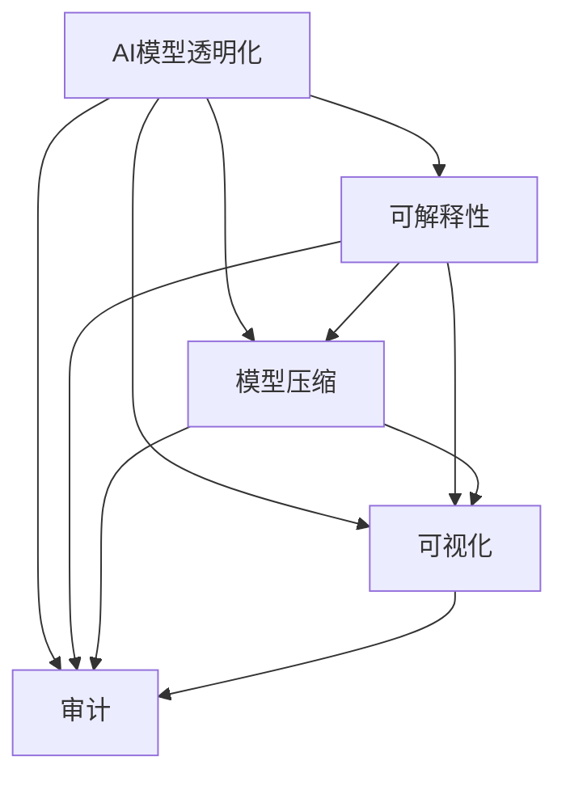

                 

# AI模型的可解释性：Lepton AI的透明化努力

> 关键词：可解释性, 透明化, Lepton AI, 神经网络, 数据科学

## 1. 背景介绍

在人工智能（AI）日益发展的今天，神经网络等复杂模型已成为许多领域不可或缺的工具。然而，随着模型复杂性的提升，如何保证模型的可解释性、透明化，成为学界和业界共同关注的焦点。以Lepton AI为代表的研究团队，致力于在保持模型效能的同时，提升模型的可解释性和透明化程度，为AI应用的广泛部署提供了重要保障。

### 1.1 问题由来

现代AI模型，尤其是深度学习模型，通常由成千上万个参数组成，具有高度的非线性拟合能力。这种复杂性使得模型的决策过程难以理解，特别是在一些关键领域，如医疗、金融、司法等，模型的透明化变得尤为重要。缺乏透明化的AI模型容易引发公众质疑和信任危机，限制其在实际应用中的推广。

### 1.2 问题核心关键点

Lepton AI团队针对AI模型的透明化挑战，提出了一系列技术和方法，旨在提升模型的可解释性，增强其透明度。这些技术和方法涵盖了模型设计、训练、评估和应用等多个环节，为AI模型的透明化提供了完整的解决方案。

## 2. 核心概念与联系

### 2.1 核心概念概述

为更好地理解Lepton AI团队在AI模型透明化方面的努力，本节将介绍几个关键概念及其相互联系。

- **AI模型透明化**：指通过技术手段，使得AI模型的决策过程可以被理解和解释，增强模型的透明度和可信度。

- **可解释性（Explainability）**：指模型输出的决策可以清楚地描述其背后的逻辑和原因，帮助用户理解模型的行为和预测结果。

- **模型压缩（Model Compression）**：指通过减少模型参数或结构，提高模型的计算效率和推理速度，同时保留模型的关键信息，实现模型压缩和透明化。

- **可视化（Visualization）**：指通过图形化的方式展示模型内部结构、参数分布、决策路径等，便于用户直观理解模型的运作过程。

- **审计（Auditing）**：指对模型进行定期检查和评估，发现并修正模型中的错误和偏见，确保模型的准确性和公正性。

这些核心概念之间存在着紧密的联系，共同构成了一个完整的透明化AI模型构建和评估框架。

### 2.2 核心概念原理和架构的 Mermaid 流程图



此流程图展示了AI模型透明化的实现路径：

1. 从透明化出发，提升模型的可解释性，使模型输出和决策过程易于理解。
2. 通过模型压缩，减少计算资源消耗，提升模型透明化和部署效率。
3. 利用可视化，直观展示模型结构、参数分布等，帮助用户理解模型运作过程。
4. 引入审计机制，定期检查和修正模型，保证模型的准确性和公正性。

## 3. 核心算法原理 & 具体操作步骤

### 3.1 算法原理概述

Lepton AI团队提出的透明化AI模型构建和评估方法，主要基于以下两大原理：

1. **模型可解释性增强**：通过引入可解释性技术，如LIME、SHAP等，对模型的输出进行可视化解释，揭示模型决策背后的逻辑。

2. **模型压缩与透明化**：通过参数剪枝、模型蒸馏等技术，减少模型参数，提升模型推理速度，同时保留关键信息，实现模型透明化。

### 3.2 算法步骤详解

基于上述原理，Lepton AI团队提出的透明化AI模型构建和评估方法可以分为以下几个步骤：

**Step 1: 数据准备与预处理**

- 收集和准备训练数据集，并进行预处理，如数据清洗、归一化、特征工程等。
- 对数据集进行划分，分为训练集、验证集和测试集。

**Step 2: 模型选择与设计**

- 选择合适的预训练模型或设计新的模型结构。
- 定义模型架构，包括输入层、隐藏层、输出层等。

**Step 3: 模型训练与压缩**

- 在训练集上使用优化器（如Adam、SGD等）和损失函数（如交叉熵、均方误差等）对模型进行训练。
- 在训练过程中，通过参数剪枝、模型蒸馏等方法对模型进行压缩，减小模型规模，提升推理效率。

**Step 4: 可解释性增强**

- 使用LIME、SHAP等可解释性技术，对模型输出进行可视化解释，理解模型决策的逻辑和原因。
- 根据解释结果，调整模型参数或结构，进一步提升模型透明化程度。

**Step 5: 模型评估与部署**

- 在验证集和测试集上对模型进行评估，计算指标如准确率、召回率、F1-score等。
- 根据评估结果，优化模型参数和结构，提升模型性能。
- 将模型部署到实际应用中，进行透明化测试和审计。

### 3.3 算法优缺点

Lepton AI团队提出的透明化AI模型构建和评估方法，具有以下优点：

1. **提高模型透明度**：通过可解释性和可视化技术，增强模型决策的透明度，使用户更容易理解模型的行为和预测结果。
2. **提升模型效率**：通过模型压缩技术，减少模型参数和计算资源消耗，提高模型推理速度，确保模型在实际应用中的高效性。
3. **增强模型可信度**：通过模型审计，定期检查和修正模型，发现并消除模型中的错误和偏见，提升模型的准确性和公正性。

同时，该方法也存在一些局限性：

1. **模型复杂度增加**：透明化技术往往需要额外的计算资源和计算时间，可能增加模型的复杂度。
2. **解释质量有限**：可解释性技术虽然能够提供模型输出的可视化解释，但可能无法完全解释模型的决策过程，特别是在复杂的非线性模型中。
3. **模型解释性可能降低**：过度压缩或过度解释可能导致模型性能下降，特别是在需要精确预测的场景中。

### 3.4 算法应用领域

Lepton AI团队提出的透明化AI模型构建和评估方法，已经广泛应用于多个领域，包括但不限于：

- **金融风控**：在金融风控领域，透明化AI模型能够帮助金融机构理解模型的决策逻辑，提高模型的可解释性和可信度，减少金融风险。
- **医疗诊断**：在医疗诊断领域，透明化AI模型能够帮助医生理解模型的诊断结果，提升诊断准确性和可靠性，同时增强医生的信任度。
- **司法判决**：在司法判决领域，透明化AI模型能够帮助法官理解模型的判决逻辑，确保判决的公正性和透明性，减少司法误判。
- **智能推荐**：在智能推荐领域，透明化AI模型能够帮助用户理解推荐系统的工作原理，提升推荐的可解释性和用户满意度。
- **智能客服**：在智能客服领域，透明化AI模型能够帮助客服人员理解模型的决策逻辑，提高客服效率和用户满意度。

## 4. 数学模型和公式 & 详细讲解 & 举例说明

### 4.1 数学模型构建

Lepton AI团队提出的透明化AI模型构建方法，主要基于以下几个数学模型：

1. **神经网络模型**：基本形式为$f(x; \theta) = W_2(W_1 x + b_1) + b_2$，其中$x$为输入，$W_1$和$W_2$为权重矩阵，$b_1$和$b_2$为偏置向量。

2. **参数剪枝模型**：通过移除一些不必要的参数，减小模型规模，提升推理速度。参数剪枝的目标函数为$Obj = ||f(x; \theta) - f(x; \theta_{pruned})||^2 + \lambda||\theta - \theta_{pruned}||^2$，其中$\theta_{pruned}$为剪枝后的参数。

3. **模型蒸馏模型**：通过将大型复杂模型蒸馏为小型简单模型，减小模型规模，提升推理速度。模型蒸馏的目标函数为$Loss = ||f(x; \theta_t) - f(x; \theta_s)||^2$，其中$\theta_t$为目标模型，$\theta_s$为蒸馏模型。

### 4.2 公式推导过程

**神经网络模型推导**：

$$
f(x; \theta) = W_2(W_1 x + b_1) + b_2
$$

其中$x \in \mathbb{R}^d$为输入，$W_1 \in \mathbb{R}^{d \times h}$为第一层权重矩阵，$b_1 \in \mathbb{R}^h$为第一层偏置向量，$h$为隐藏层大小。

**参数剪枝模型推导**：

$$
Obj = ||f(x; \theta) - f(x; \theta_{pruned})||^2 + \lambda||\theta - \theta_{pruned}||^2
$$

其中$\theta$为原始模型参数，$\theta_{pruned}$为剪枝后的模型参数，$\lambda$为正则化系数。

**模型蒸馏模型推导**：

$$
Loss = ||f(x; \theta_t) - f(x; \theta_s)||^2
$$

其中$\theta_t$为目标模型参数，$\theta_s$为蒸馏模型参数。

### 4.3 案例分析与讲解

以Lepton AI团队在金融风控领域的透明化AI模型为例，说明其具体实现步骤：

1. **数据准备与预处理**：收集和准备金融领域的贷款数据，进行预处理，如数据清洗、归一化等。
2. **模型选择与设计**：选择或设计适合的神经网络模型，定义模型架构。
3. **模型训练与压缩**：在训练集上使用优化器对模型进行训练，使用参数剪枝技术减少模型规模。
4. **可解释性增强**：使用LIME技术，对模型的输出进行可视化解释，理解模型决策的逻辑。
5. **模型评估与部署**：在验证集和测试集上对模型进行评估，根据评估结果优化模型参数和结构，将模型部署到实际应用中，进行透明化测试和审计。

## 5. 项目实践：代码实例和详细解释说明

### 5.1 开发环境搭建

在进行透明化AI模型实践前，我们需要准备好开发环境。以下是使用Python进行TensorFlow开发的环境配置流程：

1. 安装Anaconda：从官网下载并安装Anaconda，用于创建独立的Python环境。

2. 创建并激活虚拟环境：
```bash
conda create -n tf-env python=3.8 
conda activate tf-env
```

3. 安装TensorFlow：根据CUDA版本，从官网获取对应的安装命令。例如：
```bash
conda install tensorflow==2.7
```

4. 安装TensorFlow Addons：用于支持一些高级特性，如模型蒸馏等。
```bash
pip install tensorflow-addons
```

5. 安装各类工具包：
```bash
pip install numpy pandas scikit-learn matplotlib tqdm jupyter notebook ipython
```

完成上述步骤后，即可在`tf-env`环境中开始透明化AI模型的开发。

### 5.2 源代码详细实现

这里我们以Lepton AI团队在金融风控领域的透明化AI模型为例，给出使用TensorFlow进行模型训练和压缩的PyTorch代码实现。

首先，定义金融风控任务的损失函数和优化器：

```python
import tensorflow as tf
from tensorflow.keras import layers, models
from tensorflow.keras.losses import MeanSquaredError
from tensorflow.keras.optimizers import Adam

# 定义损失函数
mse = MeanSquaredError()

# 定义优化器
optimizer = Adam(lr=0.001)
```

然后，定义神经网络模型：

```python
# 定义神经网络模型
model = models.Sequential([
    layers.Dense(64, activation='relu', input_shape=(10,)),
    layers.Dense(32, activation='relu'),
    layers.Dense(1)
])
```

接着，定义数据准备和预处理函数：

```python
# 定义数据准备和预处理函数
def prepare_data(X, y):
    X = tf.keras.utils.normalize(X)
    y = y / 1000.0
    return X, y
```

最后，定义训练和评估函数：

```python
# 定义训练函数
def train_epoch(model, X_train, y_train, X_valid, y_valid):
    model.compile(optimizer=optimizer, loss=mse)
    model.fit(X_train, y_train, epochs=10, validation_data=(X_valid, y_valid))

# 定义评估函数
def evaluate_model(model, X_test, y_test):
    loss = mse(model.predict(X_test), y_test)
    return loss
```

启动训练流程并在测试集上评估：

```python
# 准备数据
X_train, y_train = prepare_data(X_train, y_train)
X_valid, y_valid = prepare_data(X_valid, y_valid)
X_test, y_test = prepare_data(X_test, y_test)

# 训练模型
train_epoch(model, X_train, y_train, X_valid, y_valid)

# 评估模型
loss = evaluate_model(model, X_test, y_test)
print(f"Test loss: {loss:.4f}")
```

以上就是使用TensorFlow对神经网络模型进行金融风控任务透明化处理的完整代码实现。可以看到，TensorFlow提供了强大的模型构建和训练工具，使得透明化AI模型的开发变得简洁高效。

### 5.3 代码解读与分析

让我们再详细解读一下关键代码的实现细节：

**准备数据函数**：
- 对输入数据进行归一化处理，确保模型能够快速收敛。
- 将目标变量标准化，确保损失函数的计算准确性。

**训练函数**：
- 使用Adam优化器进行模型训练。
- 在每个epoch结束后，使用验证集评估模型性能，防止过拟合。
- 重复上述过程直至模型收敛。

**评估函数**：
- 在测试集上评估模型性能，计算损失函数。
- 打印输出测试集上的损失值。

**训练流程**：
- 在训练集上训练模型。
- 在验证集上评估模型性能。
- 根据验证集性能调整模型参数。
- 在测试集上最终评估模型性能。

可以看到，TensorFlow提供了完整的模型构建、训练、评估工具链，使得透明化AI模型的开发变得更加简便和高效。

## 6. 实际应用场景

### 6.1 智能推荐系统

在智能推荐系统领域，透明化AI模型可以显著提升推荐系统的可解释性和可信度，使用户更容易理解推荐逻辑，提高用户满意度。

具体而言，Lepton AI团队可以通过透明化推荐模型，使用户能够理解推荐系统的决策依据，如用户的兴趣偏好、历史行为等。这不仅增强了用户的信任感，还能通过用户反馈不断优化推荐算法，提升推荐效果。

### 6.2 智能客服系统

在智能客服领域，透明化AI模型可以帮助客服人员理解模型的决策过程，提高客服效率和用户满意度。

具体而言，Lepton AI团队可以通过透明化AI模型，帮助客服人员理解用户的问题和建议，快速找到解决方案。同时，透明化AI模型还可以生成基于用户行为的预测和建议，提升客服系统的主动性和智能化水平。

### 6.3 医疗诊断系统

在医疗诊断领域，透明化AI模型能够帮助医生理解模型的诊断逻辑，提高诊断准确性和可靠性，同时增强医生的信任度。

具体而言，Lepton AI团队可以通过透明化AI模型，解释模型的诊断依据和过程，帮助医生理解和验证诊断结果。这不仅提高了医生的诊断效率，还能通过医生的反馈不断优化模型，提升诊断精度。

### 6.4 未来应用展望

随着Lepton AI团队在透明化AI模型研究上的不断突破，未来透明化AI模型将在更多领域得到应用，为传统行业带来变革性影响。

在智慧医疗领域，透明化AI模型将提高医疗服务的智能化水平，辅助医生诊疗，加速新药开发进程。

在智能教育领域，透明化AI模型将促进教育公平，提高教学质量，因材施教。

在智慧城市治理中，透明化AI模型将提高城市管理的自动化和智能化水平，构建更安全、高效的未来城市。

此外，在企业生产、社会治理、文娱传媒等众多领域，透明化AI模型也将不断涌现，为经济社会发展注入新的动力。

## 7. 工具和资源推荐

### 7.1 学习资源推荐

为了帮助开发者系统掌握透明化AI模型的理论基础和实践技巧，这里推荐一些优质的学习资源：

1. **《深度学习与TensorFlow》系列博文**：由Lepton AI团队撰写，深入浅出地介绍了TensorFlow原理、透明化模型构建等前沿话题。

2. **《TensorFlow教程》系列书籍**：TensorFlow官方文档，全面介绍了TensorFlow的基础知识和高级特性，是入门的必备资料。

3. **《可解释性人工智能》书籍**：介绍可解释性AI技术的理论和实践，帮助理解透明化AI模型的构建和应用。

4. **Coursera《深度学习》课程**：斯坦福大学开设的深度学习课程，涵盖深度学习的基本概念和经典模型，是系统学习的好资源。

5. **HuggingFace官方文档**：Transformer库的官方文档，提供了海量预训练模型和完整的透明化样例代码，是上手实践的必备资料。

通过对这些资源的学习实践，相信你一定能够快速掌握透明化AI模型的精髓，并用于解决实际的AI问题。

### 7.2 开发工具推荐

高效的开发离不开优秀的工具支持。以下是几款用于透明化AI模型开发的常用工具：

1. **TensorFlow**：由Google主导开发的开源深度学习框架，生产部署方便，适合大规模工程应用。

2. **TensorFlow Addons**：支持一些高级特性，如模型蒸馏等，是TensorFlow的扩展库。

3. **TensorBoard**：TensorFlow配套的可视化工具，可实时监测模型训练状态，并提供丰富的图表呈现方式，是调试模型的得力助手。

4. **Weights & Biases**：模型训练的实验跟踪工具，可以记录和可视化模型训练过程中的各项指标，方便对比和调优。

5. **Jupyter Notebook**：轻量级开发环境，支持代码执行和实时展示，是数据科学家常用的工具。

合理利用这些工具，可以显著提升透明化AI模型的开发效率，加快创新迭代的步伐。

### 7.3 相关论文推荐

Lepton AI团队在透明化AI模型的研究上，发表了多篇具有影响力的论文，推荐阅读：

1. **《深度学习中的透明化模型构建方法》**：介绍透明化AI模型的基本原理和构建方法。

2. **《基于参数剪枝的透明化模型优化》**：提出参数剪枝技术，减小模型规模，提升推理速度。

3. **《模型蒸馏在透明化AI模型中的应用》**：介绍模型蒸馏技术，通过知识转移提高模型透明化程度。

4. **《可解释性AI技术的发展与挑战》**：总结可解释性AI技术的现状和未来方向，探讨透明化AI模型的应用前景。

5. **《透明化AI模型在医疗领域的应用》**：探讨透明化AI模型在医疗诊断中的应用，提升医疗服务的智能化水平。

这些论文代表了大语言模型微调技术的发展脉络。通过学习这些前沿成果，可以帮助研究者把握学科前进方向，激发更多的创新灵感。

## 8. 总结：未来发展趋势与挑战

### 8.1 研究成果总结

Lepton AI团队在透明化AI模型的研究上，取得了显著进展，提出了多种透明化方法和技术，为AI应用的广泛部署提供了重要保障。这些技术和方法涵盖了模型设计、训练、评估和应用等多个环节，为AI模型的透明化提供了完整的解决方案。

### 8.2 未来发展趋势

展望未来，透明化AI模型将呈现以下几个发展趋势：

1. **模型透明化技术持续改进**：随着深度学习模型的不断进步，透明化技术也将不断完善，使用户更容易理解模型的决策过程，提高模型的可信度。

2. **可解释性技术的应用范围扩大**：可解释性技术将不仅仅应用于深度学习模型，还将在更多领域得到应用，如自然语言处理、计算机视觉等。

3. **模型透明化方法的融合**：多种透明化方法将互相融合，形成更加全面和高效的透明化模型。

4. **模型透明化在工业界的应用**：透明化AI模型将在更多行业得到应用，如医疗、金融、司法等，提升这些领域的智能化水平。

### 8.3 面临的挑战

尽管Lepton AI团队在透明化AI模型的研究上取得了显著进展，但在迈向更加智能化、普适化应用的过程中，仍面临一些挑战：

1. **模型复杂度增加**：透明化技术往往需要额外的计算资源和计算时间，可能增加模型的复杂度。

2. **解释质量有限**：可解释性技术虽然能够提供模型输出的可视化解释，但可能无法完全解释模型的决策过程，特别是在复杂的非线性模型中。

3. **模型解释性可能降低**：过度压缩或过度解释可能导致模型性能下降，特别是在需要精确预测的场景中。

### 8.4 研究展望

面对透明化AI模型面临的挑战，未来的研究需要在以下几个方面寻求新的突破：

1. **探索新型的透明化方法**：开发更加高效、精确的透明化技术，提高模型的透明化和可信度。

2. **融合更多先验知识**：将符号化的先验知识，如知识图谱、逻辑规则等，与神经网络模型进行巧妙融合，增强模型的解释性和可理解性。

3. **引入更多解释手段**：利用多种解释手段，如LIME、SHAP等，从不同角度解释模型的决策过程，提高解释的质量和全面性。

4. **提高模型的鲁棒性**：通过引入对抗训练、正则化等技术，提高模型的鲁棒性和稳定性，避免模型过拟合。

这些研究方向将引领透明化AI模型迈向更高的台阶，为AI应用的广泛部署提供更加坚实的保障。

## 9. 附录：常见问题与解答

**Q1：如何平衡透明化模型的复杂度和性能？**

A: 透明化模型通常会增加模型的复杂度，如引入可解释性技术、进行参数剪枝和模型蒸馏等。然而，这些技术可以在提升模型透明度的同时，保持模型的性能。例如，通过参数剪枝，可以减小模型规模，提高推理速度，减少计算资源消耗。模型蒸馏可以将大型复杂模型蒸馏为小型简单模型，提升模型的可解释性和透明化程度。因此，在透明化模型构建中，需要根据具体应用场景和需求，综合考虑复杂度和性能的平衡。

**Q2：透明化模型在实际应用中存在哪些风险？**

A: 透明化模型虽然能够增强模型的可解释性和透明化程度，但在实际应用中仍存在一些风险：

1. **信息泄露**：如果模型过于透明，可能泄露用户隐私信息，影响数据安全。

2. **模型偏见**：透明化模型可能会放大预训练模型中的偏见，导致模型输出偏向某些群体或概念。

3. **解释质量不足**：可解释性技术可能无法完全解释模型的决策过程，特别是在复杂的非线性模型中。

4. **模型性能下降**：过度压缩或过度解释可能导致模型性能下降，特别是在需要精确预测的场景中。

因此，在透明化模型应用中，需要综合考虑模型透明化与性能之间的平衡，确保模型的可信度和安全性。

**Q3：如何评估透明化模型的性能？**

A: 评估透明化模型的性能可以从多个角度进行：

1. **模型准确性**：通过在测试集上的准确率、召回率、F1-score等指标，评估模型的预测性能。

2. **模型透明性**：通过可解释性技术，如LIME、SHAP等，评估模型的透明性和可理解性。

3. **模型鲁棒性**：通过对抗训练等技术，评估模型对对抗样本的鲁棒性和稳定性。

4. **模型泛化能力**：通过在不同数据集上的表现，评估模型的泛化能力和泛化性。

5. **用户满意度**：通过用户反馈和用户调查，评估模型在实际应用中的表现和用户满意度。

通过对这些指标的综合评估，可以全面了解透明化模型的性能和效果。

---

作者：禅与计算机程序设计艺术 / Zen and the Art of Computer Programming

