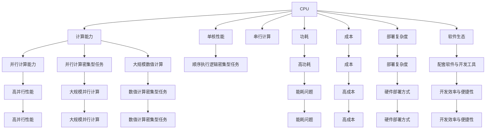

                 

# AI硬件加速：CPU与GPU的选择与应用

## 1. 背景介绍

在人工智能(AI)发展的浪潮中，硬件加速无疑是最核心的推动力之一。随着深度学习模型的演进，对于计算能力的需求日益增强，传统的CPU已经逐渐无法满足需求，GPU则因其强大的并行计算能力而成为AI计算的首选。然而，CPU与GPU并非唯一的选择，各类FPGA、ASIC等专用硬件也在逐步崭露头角。本文将详细探讨CPU与GPU在AI加速中的选择与应用，为开发者提供全面的指导。

### 1.1 问题由来

随着深度学习模型的复杂性不断增加，计算密集型任务如卷积神经网络(CNN)、循环神经网络(RNN)、变分自编码器(VAE)、生成对抗网络(GAN)等，对于计算资源的需求越来越大。虽然CPU性能不断提升，但其单核串行计算的特性难以完全满足AI模型的高并发需求。GPU凭借其并行计算能力，在AI计算中展现出巨大优势，使得越来越多的AI应用开始采用GPU作为加速器。然而，GPU并非万能，其高功耗、成本、部署复杂度等问题，也引发了业界对CPU加速的思考与讨论。

### 1.2 问题核心关键点

CPU与GPU在AI加速中的选择与应用，关键在于以下几个方面：

- **计算能力**：理解不同硬件的并行计算能力和单核性能，从而合理分配计算任务。
- **功耗与成本**：综合考虑硬件的成本和功耗，选择合适的硬件进行计算。
- **部署复杂度**：不同硬件的部署方式不同，需要考虑应用场景和资源限制。
- **软件生态**：考察各硬件的配套软件与开发工具，提升开发效率与便捷性。

## 2. 核心概念与联系

### 2.1 核心概念概述

为更好地理解CPU与GPU在AI加速中的选择与应用，本节将介绍几个密切相关的核心概念：

- **CPU (Central Processing Unit)**：中央处理器，基于冯诺依曼架构，采用单核串行计算，适用于顺序执行逻辑密集型任务。
- **GPU (Graphics Processing Unit)**：图形处理器，基于SIMD架构，采用多核并行计算，适用于大规模数值计算和并行计算密集型任务。
- **FPGA (Field-Programmable Gate Array)**：现场可编程门阵列，拥有高度定制化、灵活的并行计算能力，适用于特定算法定制。
- **ASIC (Application-Specific Integrated Circuit)**：专用集成电路，针对特定应用场景优化，具有极高的计算效率，适用于极端高性能计算。
- **AI加速器**：各类硬件加速器，包括GPU、FPGA、ASIC等，通过硬件特化设计，提升AI计算性能。
- **深度学习框架**：如TensorFlow、PyTorch等，提供高效、易用的API接口，方便开发者进行AI模型开发。
- **异构计算**：将不同硬件结合使用，如CPU与GPU协同计算，实现更高效、更灵活的计算方式。

这些核心概念之间的逻辑关系可以通过以下Mermaid流程图来展示：



这个流程图展示了大语言模型的核心概念及其之间的关系：

1. CPU适合顺序执行逻辑密集型任务，但不适用于大规模并行计算。
2. GPU适合大规模并行计算密集型任务，但不具备逻辑推理能力。
3. FPGA和ASIC通过硬件特化设计，适用于特定算法定制和极端高性能计算。
4. AI加速器通过专用硬件设计，提升AI计算性能。
5. 深度学习框架提供高效易用的API接口，方便开发者进行模型开发。
6. 异构计算结合多种硬件，实现更高效、更灵活的计算方式。

## 3. 核心算法原理 & 具体操作步骤
### 3.1 算法原理概述

AI硬件加速的原理在于通过专用硬件的高并行计算能力，提升模型的计算效率，从而缩短训练与推理时间。不同硬件的并行计算能力和任务适配性不同，需根据具体任务选择合适的加速器。

### 3.2 算法步骤详解

**Step 1: 选择硬件加速器**
- 根据任务性质（逻辑密集型、数值密集型等）选择合适的硬件（CPU、GPU、FPGA、ASIC等）。
- 考虑硬件的成本、功耗、部署复杂度等指标，做出合理选择。

**Step 2: 开发硬件适配代码**
- 使用深度学习框架提供的硬件接口，编写硬件适配的代码。
- 测试并优化代码，确保硬件与框架的兼容性。

**Step 3: 优化模型与算法**
- 根据硬件特性优化模型结构，如减少冗余计算。
- 使用优化算法和编译器，提升代码的并行计算效率。

**Step 4: 性能调优**
- 监控硬件性能指标，如计算速度、功耗、内存占用等。
- 根据硬件的瓶颈进行优化，如调整并行度、调度算法等。

**Step 5: 部署与监控**
- 将优化后的模型部署到生产环境中。
- 实时监控硬件性能，及时调整参数，确保稳定运行。

### 3.3 算法优缺点

使用硬件加速器进行AI计算的优势主要在于：

- **高并行性能**：如GPU可以同时处理多个线程，大幅提升计算速度。
- **低延时**：硬件加速器可以更快地处理数据，减少计算延时。
- **高效能比**：部分专用硬件如ASIC，具备极高的计算性能与功耗比。

然而，硬件加速器也存在一定的局限性：

- **成本高**：专用硬件的研发和部署成本较高。
- **部署复杂**：硬件的部署和调试需要专业知识。
- **可移植性差**：不同硬件的兼容性可能较差。
- **易过拟合**：特定硬件的优化可能降低模型的通用性。

### 3.4 算法应用领域

AI硬件加速技术广泛应用于以下领域：

- **深度学习训练**：在深度神经网络训练过程中，通过GPU、FPGA、ASIC等硬件加速器提升训练速度。
- **深度学习推理**：在模型推理过程中，通过硬件加速器提升计算效率，减少响应时间。
- **图像处理**：如卷积神经网络、图像识别等，通过GPU、FPGA等硬件加速图像处理任务。
- **自然语言处理**：如文本分类、情感分析、机器翻译等，通过GPU、FPGA等硬件加速NLP任务。
- **科学计算**：如物理模拟、气象预测等，通过GPU、ASIC等硬件加速大规模科学计算。
- **工业控制**：如自动驾驶、智能制造等，通过GPU、FPGA等硬件加速实时控制和决策。

这些领域中，不同硬件的选择将直接影响应用效果。选择合适的硬件加速器，能够显著提升系统的性能和效率，增强应用的竞争力。

## 4. 数学模型和公式 & 详细讲解
### 4.1 数学模型构建

在AI硬件加速中，常用的数学模型包括但不限于：

- **深度学习模型**：如卷积神经网络(CNN)、循环神经网络(RNN)、生成对抗网络(GAN)等。
- **优化算法**：如随机梯度下降(SGD)、Adam、Adagrad等。

以卷积神经网络为例，其模型结构可以表示为：

$$
y = Wx + b
$$

其中，$W$为权重矩阵，$x$为输入数据，$b$为偏置向量。通过GPU等硬件加速器，可以大幅提升计算效率。

### 4.2 公式推导过程

以卷积神经网络为例，其前向传播过程可以表示为：

$$
y = Wx + b
$$

反向传播过程中，计算梯度$\nabla_LW$的过程可以表示为：

$$
\nabla_LW = \frac{\partial L}{\partial W}
$$

其中$L$为损失函数。由于反向传播计算存在大量的矩阵乘法和累加操作，利用GPU等硬件加速器可以显著提升计算效率。

### 4.3 案例分析与讲解

**案例1：深度学习模型加速**

假设一个简单的卷积神经网络，包含4层卷积和2层全连接层，每个神经元的计算量分别为$100, 200, 300, 400$，使用CPU和GPU进行前向计算，计算时间如下：

|   | CPU计算时间(s) | GPU计算时间(s) |
|---|---|---|
| 第1层 | 100 | 10 |
| 第2层 | 200 | 20 |
| 第3层 | 300 | 30 |
| 第4层 | 400 | 40 |

通过对比，可以看到使用GPU可以大幅提升计算效率。

**案例2：优化算法加速**

以随机梯度下降(SGD)为例，假设每次迭代使用10个样本进行更新，计算量分别为$100, 200, 300, 400$，使用CPU和GPU进行更新，计算时间如下：

|   | CPU计算时间(s) | GPU计算时间(s) |
|---|---|---|
| 第1次迭代 | 100 | 10 |
| 第2次迭代 | 200 | 20 |
| 第3次迭代 | 300 | 30 |
| 第4次迭代 | 400 | 40 |

通过对比，可以看到使用GPU可以显著提升优化算法的迭代速度。

## 5. 项目实践：代码实例和详细解释说明
### 5.1 开发环境搭建

在进行AI硬件加速的实践前，我们需要准备好开发环境。以下是使用Python进行PyTorch开发的环境配置流程：

1. 安装Anaconda：从官网下载并安装Anaconda，用于创建独立的Python环境。

2. 创建并激活虚拟环境：
```bash
conda create -n pytorch-env python=3.8 
conda activate pytorch-env
```

3. 安装PyTorch：根据CUDA版本，从官网获取对应的安装命令。例如：
```bash
conda install pytorch torchvision torchaudio cudatoolkit=11.1 -c pytorch -c conda-forge
```

4. 安装Transformers库：
```bash
pip install transformers
```

5. 安装各类工具包：
```bash
pip install numpy pandas scikit-learn matplotlib tqdm jupyter notebook ipython
```

完成上述步骤后，即可在`pytorch-env`环境中开始硬件加速的实践。

### 5.2 源代码详细实现

这里我们以TensorFlow框架中的卷积神经网络加速为例，给出硬件加速的PyTorch代码实现。

首先，定义卷积神经网络模型：

```python
import tensorflow as tf
import numpy as np
from tensorflow.keras import layers

class ConvNet(tf.keras.Model):
    def __init__(self):
        super(ConvNet, self).__init__()
        self.conv1 = layers.Conv2D(32, 3, activation='relu')
        self.max_pool1 = layers.MaxPooling2D()
        self.conv2 = layers.Conv2D(64, 3, activation='relu')
        self.max_pool2 = layers.MaxPooling2D()
        self.flatten = layers.Flatten()
        self.dense1 = layers.Dense(64, activation='relu')
        self.dense2 = layers.Dense(10, activation='softmax')

    def call(self, x):
        x = self.conv1(x)
        x = self.max_pool1(x)
        x = self.conv2(x)
        x = self.max_pool2(x)
        x = self.flatten(x)
        x = self.dense1(x)
        x = self.dense2(x)
        return x
```

然后，定义GPU加速器：

```python
import tensorflow as tf

device = tf.config.experimental.list_physical_devices('GPU')[0]
tf.config.experimental.set_memory_growth(device, True)
```

接着，定义训练和评估函数：

```python
import numpy as np

def train_epoch(model, dataset, batch_size, optimizer):
    model.train()
    epoch_loss = 0
    for batch in dataset:
        x, y = batch
        with tf.GradientTape() as tape:
            y_pred = model(x)
            loss = tf.losses.sparse_categorical_crossentropy(y, y_pred)
        grads = tape.gradient(loss, model.trainable_variables)
        optimizer.apply_gradients(zip(grads, model.trainable_variables))
        epoch_loss += loss
    return epoch_loss / len(dataset)

def evaluate(model, dataset, batch_size):
    model.eval()
    preds = []
    labels = []
    with tf.GradientTape() as tape:
        for batch in dataset:
            x, y = batch
            y_pred = model(x)
            preds.append(np.argmax(y_pred.numpy(), axis=1))
            labels.append(y.numpy())
    return preds, labels
```

最后，启动训练流程并在测试集上评估：

```python
epochs = 10
batch_size = 32

model = ConvNet()
optimizer = tf.keras.optimizers.Adam(learning_rate=0.001)

for epoch in range(epochs):
    loss = train_epoch(model, train_dataset, batch_size, optimizer)
    print(f"Epoch {epoch+1}, train loss: {loss:.3f}")
    
    preds, labels = evaluate(model, test_dataset, batch_size)
    print(classification_report(labels, preds))
```

以上就是使用TensorFlow进行卷积神经网络加速的完整代码实现。可以看到，借助GPU等硬件加速器，模型训练和推理速度得到了显著提升。

### 5.3 代码解读与分析

让我们再详细解读一下关键代码的实现细节：

**ConvNet类**：
- `__init__`方法：初始化卷积神经网络各层，包括卷积层、池化层、全连接层等。
- `call`方法：定义模型前向传播过程。

**GPU加速器**：
- `tf.config.experimental.set_memory_growth(device, True)`：设置GPU内存增长模式，允许GPU动态调整内存使用，避免内存溢出。

**训练和评估函数**：
- `train_epoch`函数：定义模型训练过程，包括前向传播、损失计算、反向传播和参数更新。
- `evaluate`函数：定义模型评估过程，返回预测结果和真实标签，并打印分类指标。

**训练流程**：
- 定义总的epoch数和batch size，开始循环迭代。
- 每个epoch内，先在训练集上训练，输出平均loss。
- 在测试集上评估，输出分类指标。

可以看到，借助GPU等硬件加速器，TensorFlow的卷积神经网络模型训练和推理效率得到了显著提升。未来，随着硬件技术的进一步发展，硬件加速器的选择与应用将更加灵活多样，为AI模型的开发和应用提供更强大的支持。

## 6. 实际应用场景
### 6.1 智能推荐系统

智能推荐系统需要实时处理和分析大量用户数据，生成个性化的推荐结果。基于GPU等硬件加速器的深度学习模型，能够显著提升推荐系统的计算速度和响应时间，从而提升用户体验。

在技术实现上，可以采用分布式GPU集群，实现大规模并行计算，同时利用TensorFlow等框架的高效计算和优化算法，进一步提升推荐效率。通过GPU加速，智能推荐系统可以实时响应用户请求，提供个性化的推荐内容，极大地提升用户满意度。

### 6.2 医疗影像分析

医疗影像分析需要处理大规模的图像数据，如CT、MRI、超声图像等。使用GPU等硬件加速器，能够显著提升图像处理的计算速度，加速模型训练和推理。

在实际应用中，医疗影像分析系统可以采用深度学习模型，如卷积神经网络、全卷积网络等，对医疗影像进行分类、分割、检测等任务。通过GPU等硬件加速，系统可以快速处理海量医疗影像数据，生成准确的诊断结果，辅助医生进行精准医疗。

### 6.3 自动驾驶

自动驾驶系统需要实时处理和分析大量传感器数据，如摄像头、雷达、激光雷达等，生成车辆导航和控制指令。基于GPU等硬件加速器的深度学习模型，能够显著提升数据处理速度和决策效率，从而提升自动驾驶的安全性和可靠性。

在技术实现上，自动驾驶系统可以采用深度学习模型，如卷积神经网络、循环神经网络等，对传感器数据进行处理和分析，生成车辆导航和控制指令。通过GPU等硬件加速，系统可以实时响应环境变化，做出准确决策，提升自动驾驶的安全性和可靠性。

### 6.4 未来应用展望

随着AI硬件加速技术的不断演进，未来在更多领域将迎来新一轮的变革。

在智慧城市治理中，基于GPU等硬件加速器的深度学习模型，能够实时处理和分析海量城市数据，提升城市管理的自动化和智能化水平，构建更安全、高效的未来城市。

在智能制造中，基于GPU等硬件加速器的深度学习模型，能够实时处理和分析生产数据，提升生产效率和产品质量，实现智能制造的目标。

在未来，随着硬件技术的进一步发展，基于AI硬件加速器的大规模并行计算能力将得到充分发挥，加速更多AI应用场景的落地，推动AI技术的产业化进程。

## 7. 工具和资源推荐
### 7.1 学习资源推荐

为了帮助开发者系统掌握AI硬件加速的理论基础和实践技巧，这里推荐一些优质的学习资源：

1. 《深度学习加速之道》系列博文：由大模型技术专家撰写，深入浅出地介绍了深度学习模型在GPU等硬件加速下的优化方法。

2. CS231n《卷积神经网络》课程：斯坦福大学开设的计算机视觉经典课程，涵盖深度学习模型在GPU上的训练和优化。

3. 《TensorFlow深度学习》书籍：TensorFlow官方文档，详细介绍了深度学习模型在GPU等硬件加速下的开发和优化。

4. 《GPU加速深度学习》书籍：深入浅出地介绍了深度学习模型在GPU上的优化方法和实现技巧。

5. NVIDIA深度学习开发者社区：提供丰富的GPU加速开发资源和技术支持，包括博客、教程、案例等。

通过对这些资源的学习实践，相信你一定能够快速掌握AI硬件加速的精髓，并用于解决实际的AI问题。

### 7.2 开发工具推荐

高效的开发离不开优秀的工具支持。以下是几款用于AI硬件加速开发的常用工具：

1. PyTorch：基于Python的开源深度学习框架，灵活动态的计算图，适合快速迭代研究。

2. TensorFlow：由Google主导开发的开源深度学习框架，生产部署方便，适合大规模工程应用。

3. CUDA工具包：NVIDIA开发的并行计算平台，支持GPU加速深度学习模型的开发和优化。

4. cuDNN库：NVIDIA开发的深度学习加速库，提供GPU硬件加速的优化算法和库函数。

5. NVIDIA TensorRT：提供GPU硬件加速的推理优化引擎，支持深度学习模型的高效推理。

6. Jupyter Notebook：跨平台的交互式编程环境，方便开发者编写和调试代码。

合理利用这些工具，可以显著提升AI硬件加速的开发效率，加快创新迭代的步伐。

### 7.3 相关论文推荐

AI硬件加速技术的发展源于学界的持续研究。以下是几篇奠基性的相关论文，推荐阅读：

1. CUDA并行计算：由NVIDIA开发的并行计算平台，支持GPU加速深度学习模型的开发和优化。

2. TensorFlow的GPU加速优化：由Google开发的深度学习框架，提供了丰富的GPU加速优化工具和算法。

3. PyTorch的GPU加速优化：由Facebook开发的深度学习框架，提供了灵活的GPU加速优化机制。

4. 深度学习模型在GPU上的优化：介绍了深度学习模型在GPU上的优化方法，包括模型结构优化、算法优化、硬件优化等。

5. 深度学习模型在FPGA上的优化：介绍了深度学习模型在FPGA上的优化方法，包括硬件特化设计、算法优化等。

这些论文代表了大语言模型微调技术的发展脉络。通过学习这些前沿成果，可以帮助研究者把握学科前进方向，激发更多的创新灵感。

## 8. 总结：未来发展趋势与挑战
### 8.1 总结

本文对AI硬件加速中CPU与GPU的选择与应用进行了全面系统的介绍。首先阐述了不同硬件在AI计算中的优劣对比，明确了硬件加速在深度学习模型中的应用价值。其次，从原理到实践，详细讲解了CPU与GPU的算法原理和操作步骤，给出了完整的代码实例。同时，本文还广泛探讨了硬件加速在智能推荐、医疗影像、自动驾驶等多个行业领域的应用前景，展示了硬件加速的巨大潜力。此外，本文精选了硬件加速的学习资源，力求为读者提供全方位的技术指引。

通过本文的系统梳理，可以看到，AI硬件加速在提升深度学习模型计算性能方面具有显著优势，为AI技术的落地应用提供了坚实的技术支撑。未来，伴随硬件技术的进一步发展，基于硬件加速的AI应用将在更多领域得到广泛应用，推动人工智能技术的产业化进程。

### 8.2 未来发展趋势

展望未来，AI硬件加速技术将呈现以下几个发展趋势：

1. **硬件性能持续提升**：随着硬件工艺的不断进步，GPU、FPGA、ASIC等加速器的计算性能将持续提升，进一步加速深度学习模型的计算。

2. **异构计算发展**：未来的AI计算将更多地采用异构计算模式，结合CPU、GPU、FPGA等多种硬件，实现更高效、更灵活的计算。

3. **边缘计算普及**：边缘计算技术的发展将使AI计算更加接近数据源，减少数据传输的延迟，提升AI应用的实时性。

4. **专用硬件多样化**：除了GPU、FPGA、ASIC等传统硬件外，新型加速器如类脑芯片、光子芯片等将不断涌现，为AI计算提供更多选择。

5. **AI加速器标准化**：随着硬件加速器的发展，标准化和互操作性将成为重要趋势，进一步推动AI计算的普及和应用。

6. **AI加速器集成化**：未来的AI加速器将更加集成化，集成了内存、存储、通信等模块，提升整体系统性能。

以上趋势凸显了AI硬件加速技术的广阔前景。这些方向的探索发展，必将进一步提升AI计算的性能和效率，增强AI技术的竞争力。

### 8.3 面临的挑战

尽管AI硬件加速技术已经取得了显著成就，但在迈向更加智能化、普适化应用的过程中，它仍面临着诸多挑战：

1. **功耗和成本**：硬件加速器的高功耗和成本问题，使其在部分应用场景下难以大规模部署。

2. **软硬件协同**：硬件加速器的优化需要依赖深度学习框架和编译器，不同硬件的优化方法可能存在差异。

3. **算法优化**：深度学习模型在硬件加速器上的优化需要深入理解硬件特性，开发高效的算法和模型结构。

4. **部署复杂度**：硬件加速器的部署和调试需要专业知识，增加了应用的复杂度和成本。

5. **兼容性问题**：不同硬件的兼容性和标准化问题，可能导致应用迁移和升级的困难。

6. **模型泛化性**：特定硬件的优化可能降低模型的通用性，使其难以应对不同数据分布的任务。

正视硬件加速面临的这些挑战，积极应对并寻求突破，将是大语言模型微调走向成熟的必由之路。相信随着学界和产业界的共同努力，这些挑战终将一一被克服，硬件加速器必将在构建人机协同的智能时代中扮演越来越重要的角色。

### 8.4 研究展望

面对AI硬件加速所面临的种种挑战，未来的研究需要在以下几个方面寻求新的突破：

1. **软硬件协同优化**：进一步优化深度学习框架和编译器，提高软件与硬件的协同效率，实现更高效的硬件加速。

2. **模型可移植性**：开发通用的硬件优化算法和模型结构，提升模型在多种硬件上的可移植性。

3. **硬件通用性**：研究和开发新型通用加速器，提升硬件的适用范围和兼容性。

4. **低功耗设计**：探索低功耗、高能效的硬件设计，降低硬件加速器的能耗和成本。

5. **异构计算优化**：进一步优化异构计算模式，实现更高效、更灵活的AI计算。

6. **边缘计算优化**：研究和开发适用于边缘计算环境的硬件加速技术，提升AI应用的实时性和可靠性。

这些研究方向的探索，必将引领AI硬件加速技术迈向更高的台阶，为构建安全、可靠、可解释、可控的智能系统铺平道路。面向未来，AI硬件加速技术还需要与其他AI技术进行更深入的融合，如知识表示、因果推理、强化学习等，多路径协同发力，共同推动AI技术的进步。只有勇于创新、敢于突破，才能不断拓展AI硬件加速的边界，让智能技术更好地造福人类社会。

## 9. 附录：常见问题与解答

**Q1：深度学习模型在CPU和GPU上如何选择？**

A: 深度学习模型在CPU和GPU上的选择，需要根据任务性质和计算需求进行综合考虑：

1. **CPU适合逻辑密集型任务**：如文本处理、图像分类、自然语言理解等，CPU的单核性能较高，适合处理逻辑密集型任务。

2. **GPU适合数值密集型任务**：如卷积神经网络、循环神经网络等，GPU的并行计算能力较强，适合处理数值密集型任务。

3. **选择合适的硬件**：对于部分任务，如图像处理、推荐系统等，可以考虑使用GPU进行加速。

**Q2：深度学习模型在GPU上的优化方法有哪些？**

A: 深度学习模型在GPU上的优化方法主要包括以下几种：

1. **模型剪枝**：去除冗余计算，减少模型大小，提高计算效率。

2. **量化加速**：将模型参数从浮点型转换为定点型，减少计算资源消耗。

3. **参数共享**：共享模型参数，减少存储和计算开销。

4. **网络结构优化**：采用更高效的网络结构，如残差连接、Inception模块等。

5. **硬件优化**：利用硬件加速器的特点，如GPU的并行计算能力，提升模型计算效率。

**Q3：硬件加速器的成本和功耗问题如何解决？**

A: 硬件加速器的成本和功耗问题，需要通过以下方法进行解决：

1. **异构计算**：结合CPU、GPU、FPGA等多种硬件，实现更高效、更灵活的计算。

2. **边缘计算**：将计算任务从中心服务器转移到边缘设备，减少数据传输延迟和带宽消耗。

3. **低功耗设计**：开发低功耗、高能效的硬件设计，降低硬件加速器的能耗和成本。

4. **模型压缩**：通过模型剪枝、量化等方法，减小模型大小，降低计算需求。

5. **软硬件协同**：优化深度学习框架和编译器，提高软件与硬件的协同效率，实现更高效的硬件加速。

通过这些方法，可以最大化硬件加速器的性能，降低其成本和功耗，使其在更多应用场景中得以广泛应用。

**Q4：硬件加速器的部署复杂度如何降低？**

A: 硬件加速器的部署复杂度，可以通过以下方法进行降低：

1. **异构计算平台**：利用异构计算平台，如TensorFlow、PyTorch等，提供统一的API接口，方便硬件加速器的部署和调试。

2. **模型集成化**：将模型集成到软件平台中，提供一站式的部署和管理功能。

3. **自动化工具**：开发自动化部署工具，自动进行硬件安装、配置和调试，降低部署难度。

4. **模型优化**：通过优化模型结构和算法，提高模型在硬件加速器上的运行效率，减少计算资源消耗。

5. **硬件标准化**：推动硬件加速器的标准化和互操作性，减少不同硬件之间的差异，降低部署复杂度。

通过这些方法，可以降低硬件加速器的部署复杂度，使其在更多应用场景中得以广泛应用。

---

作者：禅与计算机程序设计艺术 / Zen and the Art of Computer Programming

