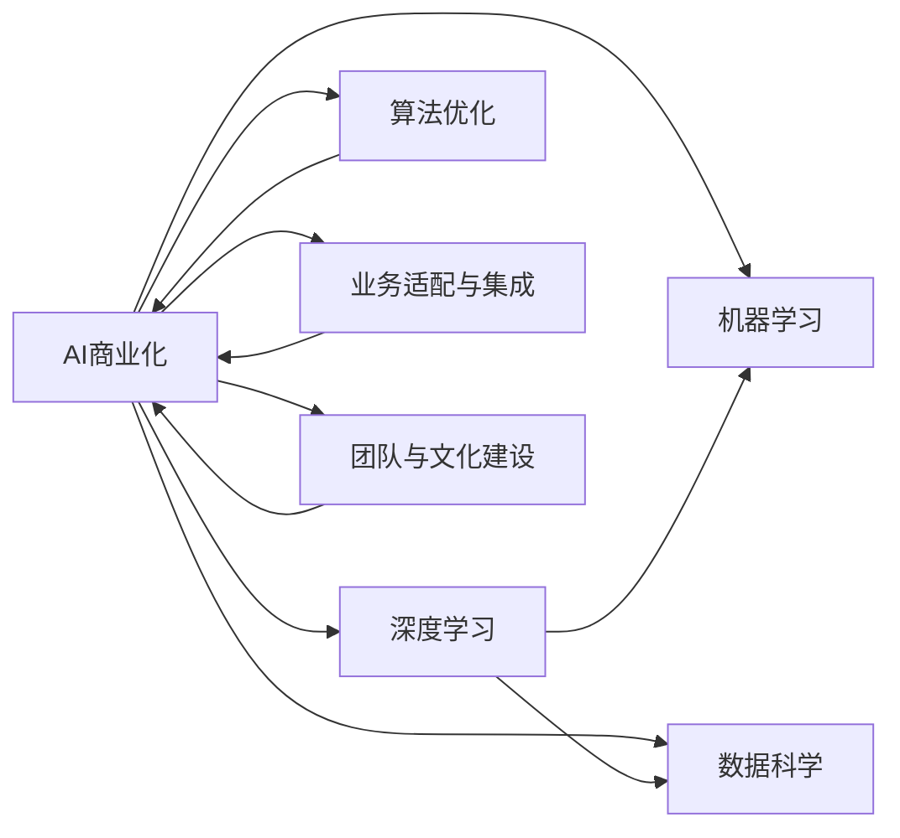

                 

# AI行业的未来：回到商业成功，如何让AI真正创造商业价值

> 关键词：AI商业化、机器学习、深度学习、数据科学、商业应用、算法优化、业务落地

## 1. 背景介绍

### 1.1 问题由来
过去十年，人工智能(AI)技术经历了飞速发展，从最初的实验室研究逐步走向工业应用。机器学习、深度学习、数据科学等技术的突破，极大地提升了AI系统的能力，让企业在数据驱动决策、自动化流程、客户体验提升等方面实现了显著改进。然而，尽管AI技术取得了诸多成就，其在商业价值创造上的表现却相对滞后。根据Gartner的报告，只有15%的企业成功将AI技术商业化，真正实现商业价值的转化。那么，AI技术究竟如何才能更好地创造商业价值？本文将从核心概念入手，系统探讨如何让AI技术真正落地，并在商业应用中取得成功。

### 1.2 问题核心关键点
AI技术要想在商业成功，需要明确以下几个核心关键点：
1. **明确商业目标**：AI项目的成功与否，取决于其在业务场景中的效果是否符合预期。
2. **数据质量保证**：高质量的数据是AI算法优化的基础，也是决定AI模型效果的关键。
3. **算法优化与选择**：选择合适的算法，并进行有效的模型训练和调优，是AI技术落地的重要环节。
4. **业务适配与集成**：将AI模型与现有业务系统进行有效集成，使其能够无缝融入现有业务流程。
5. **团队与文化建设**：具备跨学科知识、理解AI技术的团队，是推动AI项目成功落地的关键。

### 1.3 问题研究意义
研究和解决如何让AI真正创造商业价值，不仅能够帮助企业在数据驱动决策、流程自动化、客户体验提升等方面取得突破，还能推动AI技术的普及和应用，为各行各业带来新的机遇和挑战。通过深入理解AI技术落地所需的各个环节，本文希望为AI技术的商业化提供更为系统的方法和思路。

## 2. 核心概念与联系

### 2.1 核心概念概述

在探讨如何让AI技术创造商业价值之前，需要先了解一些核心概念：

- **AI商业化**：将AI技术转化为可操作的商业应用，实现商业价值的转化。
- **机器学习**：一种通过数据训练模型，使机器能够进行预测、分类、聚类等任务的技术。
- **深度学习**：机器学习的一个分支，通过多层次神经网络模型，实现对复杂数据的高级处理和分析。
- **数据科学**：通过数据收集、清洗、分析和建模，提取有价值的信息和洞察力的学科。
- **算法优化**：在保证模型性能的同时，尽可能减少计算资源消耗，提升模型训练和推理的速度。
- **业务适配与集成**：将AI模型与现有业务系统进行无缝集成，确保其在实际应用中能够稳定运行。
- **团队与文化建设**：构建跨学科团队，营造积极向上、开放包容的企业文化，为AI项目的成功提供保障。

这些核心概念相互联系，共同构成了AI技术落地应用的整体框架。通过对这些概念的深入理解，我们可以更好地把握AI技术在商业化过程中的关键点。

### 2.2 核心概念原理和架构的 Mermaid 流程图


这个流程图展示了AI技术在商业化过程中各个环节的相互联系。机器学习和深度学习作为AI技术的基础，数据科学为模型训练提供数据支撑，算法优化和业务适配确保模型的高效运行，团队和文化建设则是确保项目成功的保障。

## 3. 核心算法原理 & 具体操作步骤
### 3.1 算法原理概述

AI技术在商业应用中的核心算法，主要包括机器学习、深度学习和强化学习等。这些算法通过在大量数据上进行训练，能够学习到数据的规律和模式，并在此基础上进行预测、分类、推荐等任务。以下是这些算法的基本原理：

1. **机器学习**：通过构建模型，利用数据进行训练，使模型能够对新数据进行预测或分类。机器学习算法包括线性回归、逻辑回归、决策树、随机森林、支持向量机(SVM)等。
2. **深度学习**：通过多层神经网络模型，提取数据的高级特征，实现对复杂数据的处理和分析。深度学习算法包括卷积神经网络(CNN)、循环神经网络(RNN)、长短期记忆网络(LSTM)等。
3. **强化学习**：通过与环境交互，模型能够在不断尝试和反馈中学习最优策略，实现自主决策和优化。强化学习算法包括Q-learning、Deep Q-Network(DQN)等。

### 3.2 算法步骤详解

AI技术在商业应用中的具体操作步骤，可以分为数据准备、模型构建、训练调优和业务集成四个步骤：

1. **数据准备**：收集和清洗高质量的数据，确保数据集的完整性和一致性。数据预处理包括数据清洗、特征提取、数据增强等。
2. **模型构建**：选择合适的算法，构建适合的模型架构。模型的选择取决于任务的复杂性和数据的特点。
3. **训练调优**：通过在训练集上不断迭代优化，调整模型参数，提升模型效果。优化过程中，需要结合正则化、过拟合防止等技术。
4. **业务集成**：将训练好的模型集成到现有业务系统中，实现自动化决策、客户体验提升等功能。集成过程中，需要考虑系统兼容性、数据安全和性能优化等。

### 3.3 算法优缺点

AI算法在商业应用中，具有以下优点：

1. **预测准确度高**：通过大量数据的训练，AI模型能够获得较高的预测准确度。
2. **自动化决策**：AI算法能够自动化地进行数据处理和决策，提高工作效率。
3. **泛化能力强**：优秀的AI模型具有较强的泛化能力，能够在不同数据集和场景中表现稳定。

然而，这些算法也存在一些缺点：

1. **数据依赖性强**：AI算法的效果很大程度上取决于数据的质量和数量。
2. **模型复杂度高**：深度学习等算法模型复杂度高，需要较强的计算资源和计算能力。
3. **解释性不足**：AI算法的决策过程往往缺乏可解释性，难以进行调试和优化。
4. **成本较高**：开发和部署AI系统需要较高的投入，包括数据收集、模型训练和系统集成等。

### 3.4 算法应用领域

AI算法在多个领域得到了广泛应用，以下是一些典型的应用场景：

1. **金融风控**：利用机器学习和深度学习算法，对客户信用、市场风险等进行评估和预测，帮助金融机构进行风险控制。
2. **医疗诊断**：通过深度学习算法，对医疗影像、基因数据等进行分析和诊断，提升疾病预测和诊断的准确性。
3. **智能客服**：利用自然语言处理技术，构建智能客服系统，提升客户服务效率和体验。
4. **智能推荐**：通过推荐算法，对用户行为进行分析和预测，实现个性化推荐，提升用户满意度。
5. **工业制造**：利用机器学习算法，对生产数据进行分析和优化，提高生产效率和质量。
6. **自动驾驶**：利用计算机视觉和强化学习算法，实现车辆自主导航和决策，提升驾驶安全性。

## 4. 数学模型和公式 & 详细讲解 & 举例说明
### 4.1 数学模型构建

AI技术的数学模型构建，通常涉及概率模型、统计模型和优化模型等。以下以线性回归为例，简要介绍数学模型的构建过程。

假设我们有训练集 $\{(x_i, y_i)\}_{i=1}^n$，其中 $x_i \in \mathbb{R}^d$ 为输入特征向量，$y_i \in \mathbb{R}$ 为输出目标值。目标是找到一个线性模型 $f(x) = \theta^T x$，使得模型在训练集上的平均损失最小化。

定义损失函数为均方误差：

$$
L(\theta) = \frac{1}{n} \sum_{i=1}^n (y_i - \theta^T x_i)^2
$$

目标是最小化损失函数 $L(\theta)$。通过求解损失函数的最小值，可以得到模型参数 $\theta$。

### 4.2 公式推导过程

对损失函数 $L(\theta)$ 进行求导，得到：

$$
\frac{\partial L(\theta)}{\partial \theta} = -\frac{2}{n} \sum_{i=1}^n (y_i - \theta^T x_i) x_i
$$

令导数等于零，得到：

$$
\frac{\partial L(\theta)}{\partial \theta} = 0 \Rightarrow \theta = \left(\frac{1}{n} \sum_{i=1}^n x_i x_i^T\right)^{-1} \left(\frac{1}{n} \sum_{i=1}^n x_i y_i\right)
$$

即得到线性回归模型的参数：

$$
\theta = \left(\frac{1}{n} \sum_{i=1}^n x_i x_i^T\right)^{-1} \left(\frac{1}{n} \sum_{i=1}^n x_i y_i\right)
$$

### 4.3 案例分析与讲解

以下以金融风控为例，介绍如何构建和训练AI模型。

**案例背景**：某银行希望通过AI技术，对新客户的信用风险进行评估，以确定是否发放贷款。

**数据准备**：收集客户历史交易记录、社交网络信息、地理位置等信息，构建包含多个特征的客户数据集。

**模型构建**：选择逻辑回归算法，构建线性模型，用于对客户是否违约进行预测。

**训练调优**：在训练集上训练模型，调整模型参数，防止过拟合。同时，引入正则化技术，提高模型泛化能力。

**业务集成**：将训练好的模型集成到银行的贷款审批系统中，用于自动化客户信用评估，提升审批效率和准确性。

## 5. 项目实践：代码实例和详细解释说明
### 5.1 开发环境搭建

在项目实践中，需要搭建合适的开发环境，确保代码的运行和调试。以下是搭建开发环境的详细步骤：

1. **选择开发语言和框架**：
   - 根据任务特点，选择适合的编程语言，如Python、R等。
   - 选择适合的语言框架，如TensorFlow、PyTorch等。

2. **安装必要的工具和库**：
   - 安装Python解释器、Jupyter Notebook等工具。
   - 安装必要的库，如Pandas、NumPy、Scikit-learn等。

3. **配置开发环境**：
   - 配置开发环境，确保所有工具和库的路径设置正确。
   - 配置环境变量，确保数据和模型文件的访问路径正确。

4. **版本控制和项目管理**：
   - 使用Git等版本控制工具，确保代码的备份和版本管理。
   - 使用Jupyter Notebook、JupyterLab等工具，进行代码的调试和展示。

### 5.2 源代码详细实现

以下是一个简单的金融风控项目代码实现，用于对客户信用进行评估和预测。

**代码实现**：

```python
import pandas as pd
from sklearn.linear_model import LogisticRegression
from sklearn.model_selection import train_test_split

# 读取数据集
data = pd.read_csv('customer_data.csv')

# 数据预处理
X = data.drop('default', axis=1)
y = data['default']

# 数据分割
X_train, X_test, y_train, y_test = train_test_split(X, y, test_size=0.2, random_state=42)

# 模型训练
model = LogisticRegression()
model.fit(X_train, y_train)

# 模型评估
score = model.score(X_test, y_test)
print(f"模型评估得分：{score:.2f}")
```

**代码解读与分析**：

1. **数据预处理**：使用Pandas库读取CSV格式的数据集，进行特征选择和数据清洗。
2. **模型训练**：使用Scikit-learn库的LogisticRegression模型，在训练集上进行训练。
3. **模型评估**：在测试集上评估模型性能，输出评估得分。

### 5.3 代码解读与分析

以上代码实现了基本的金融风控模型训练和评估。在实际应用中，需要进一步考虑以下问题：

- **特征选择**：选择与客户信用评估相关的特征，避免无关特征的干扰。
- **模型优化**：通过交叉验证、网格搜索等技术，优化模型参数，提升模型性能。
- **模型集成**：通过集成多个模型，提升模型鲁棒性和泛化能力。

## 6. 实际应用场景
### 6.1 金融风控

金融风控是AI技术在商业化中的一个典型应用场景。通过AI模型，银行可以有效识别和控制客户的信用风险，从而提高贷款审批效率和准确性。

**实际案例**：某银行利用AI模型，对客户的社交网络数据、地理位置等特征进行分析，构建客户信用评分模型。模型在贷款审批系统中集成，实现了对客户信用风险的自动化评估，提升了审批效率和准确性。

### 6.2 医疗诊断

医疗诊断是另一个AI技术在商业化中的重要应用场景。AI模型可以辅助医生进行疾病诊断和治疗方案选择，提升医疗服务质量。

**实际案例**：某医院利用AI模型，对患者的医疗影像进行分析和诊断，实现了快速准确的疾病预测和诊断。模型在医疗系统中集成，辅助医生进行决策，提高了诊疗效率和准确性。

### 6.3 智能客服

智能客服是AI技术在商业化中的另一个重要应用场景。通过AI模型，企业可以构建智能客服系统，提升客户服务效率和体验。

**实际案例**：某电商企业利用AI模型，对客户咨询进行智能回答，提升了客服响应速度和准确性。模型在客服系统中集成，实现了对客户咨询的自动化处理，提高了客户满意度。

### 6.4 智能推荐

智能推荐是AI技术在商业化中的一个常见应用场景。通过AI模型，企业可以提供个性化的产品或内容推荐，提升用户满意度。

**实际案例**：某电商平台利用AI模型，对用户浏览和购买行为进行分析，提供个性化的商品推荐。模型在推荐系统中集成，实现了对用户需求的精准匹配，提升了用户购物体验。

## 7. 工具和资源推荐
### 7.1 学习资源推荐

为了帮助开发者系统掌握AI技术的商业化应用，以下是一些优质的学习资源：

1. **Coursera《Machine Learning》课程**：由斯坦福大学教授Andrew Ng讲授，全面介绍机器学习和深度学习的基本概念和算法。
2. **Udacity《深度学习专项》课程**：由Google和DeepMind专家讲授，深入讲解深度学习理论和实践。
3. **Kaggle数据科学竞赛平台**：提供大量数据集和竞赛项目，通过实践提升数据科学和机器学习技能。
4. **GitHub开源项目**：GitHub上存储了大量高质量的AI项目代码，可供学习和参考。
5. **DataCamp在线学习平台**：提供丰富的Python、R、SQL等数据分析和机器学习课程，适合初学者和进阶学习者。

通过对这些学习资源的利用，可以系统掌握AI技术在商业化应用中的各项技能，提升自身能力。

### 7.2 开发工具推荐

在实际开发中，选择合适的工具能够显著提高效率。以下是一些常用的AI开发工具：

1. **TensorFlow**：由Google开发的深度学习框架，支持多种算法和模型，易于集成和部署。
2. **PyTorch**：由Facebook开发的深度学习框架，灵活高效，适用于研究和生产环境。
3. **Jupyter Notebook**：开源的Python编程环境，支持代码块和数据可视化，方便调试和协作。
4. **Git**：版本控制工具，支持代码的备份、协作和版本管理。
5. **Docker**：容器化技术，支持模型的封装和部署，提高模型的可移植性和稳定性。

合理利用这些工具，可以提升AI项目的开发效率和质量，确保项目顺利进行。

### 7.3 相关论文推荐

AI技术的商业化应用需要基于前沿的科学研究和技术创新。以下是几篇奠基性的相关论文，推荐阅读：

1. **《Deep Learning》书籍**：Ian Goodfellow等著，全面介绍深度学习的基本原理和应用。
2. **《Pattern Recognition and Machine Learning》书籍**：Christopher Bishop著，深入讲解机器学习和统计模型的原理和算法。
3. **《Reinforcement Learning: An Introduction》书籍**：Richard Sutton和Andrew Barto著，详细介绍强化学习的理论和实践。
4. **《Machine Learning Yearning》书籍**：Andrew Ng著，提供机器学习项目开发的实战经验和技术指南。
5. **《NeurIPS 2020 Best Paper Award》论文**：Kaiming He等，介绍用于大规模图像分类任务的无监督预训练方法。

这些论文代表了大规模AI技术商业化应用的研究方向和前沿进展，通过学习这些前沿成果，可以帮助研究者把握AI技术的未来发展趋势。

## 8. 总结：未来发展趋势与挑战
### 8.1 研究成果总结

本文从商业化的角度，系统介绍了AI技术在各个领域的应用。通过数据预处理、模型训练、业务集成等步骤，逐步实现了AI技术的商业化落地。未来，AI技术的商业化应用将更加广泛和深入，推动各行各业向智能化转型。

### 8.2 未来发展趋势

AI技术在商业化应用中，未来的发展趋势主要包括以下几个方面：

1. **自动化水平提升**：AI技术将逐步实现全自动化决策和流程，提高企业的运营效率。
2. **智能化程度提高**：AI技术将更加智能化，具备更强的理解和决策能力，提升用户体验。
3. **数据驱动决策**：AI技术将广泛应用到数据驱动的决策场景，帮助企业更好地理解和应对市场变化。
4. **跨领域融合**：AI技术将与物联网、区块链等新兴技术融合，拓展应用场景和功能。
5. **伦理和安全**：AI技术的应用将更加注重伦理和安全问题，确保技术应用的合规性和安全性。

### 8.3 面临的挑战

尽管AI技术在商业化应用中取得了显著进展，但仍面临诸多挑战：

1. **数据隐私和安全**：AI模型的训练和应用需要大量的数据，但数据隐私和安全问题亟待解决。
2. **模型公平性和透明性**：AI模型容易出现偏见和歧视，如何确保模型的公平性和透明性，是一个重要问题。
3. **算法解释性**：AI模型的决策过程往往缺乏可解释性，难以进行调试和优化。
4. **计算资源限制**：AI模型的训练和推理需要大量的计算资源，如何优化资源消耗，是一个技术难题。
5. **人才短缺**：具备跨学科知识、理解AI技术的复合型人才短缺，制约了AI技术的推广和应用。

### 8.4 研究展望

未来，AI技术的商业化应用需要进一步解决上述挑战，提升技术应用的普及度和可信度。以下是一些可能的研究方向：

1. **数据隐私保护技术**：开发数据隐私保护技术，确保数据使用过程中的安全和隐私。
2. **模型公平性算法**：研究模型公平性算法，提升模型的公平性和透明性。
3. **可解释性AI**：开发可解释性AI技术，提高AI模型的可解释性和调试性。
4. **资源优化技术**：优化AI模型的计算资源消耗，提升模型训练和推理的效率。
5. **人才培养机制**：建立跨学科人才培养机制，推动AI技术的普及和应用。

这些研究方向的探索和发展，将为AI技术在商业化应用中取得更大的突破提供重要保障。

## 9. 附录：常见问题与解答

**Q1：AI技术在商业化应用中，如何选择合适的算法？**

A: 选择合适的算法需要考虑以下因素：
1. **任务类型**：根据任务类型选择适合的算法，如分类、回归、聚类等。
2. **数据特点**：根据数据特点选择适合的算法，如图像数据使用CNN，文本数据使用RNN。
3. **计算资源**：考虑计算资源的限制，选择高效的算法，如卷积神经网络。

**Q2：AI模型在落地应用时，需要注意哪些问题？**

A: 模型在落地应用时，需要注意以下问题：
1. **数据质量**：确保数据的质量和完整性，避免数据噪声干扰模型。
2. **模型优化**：通过调整超参数、正则化等技术，优化模型性能。
3. **业务适配**：将模型与现有业务系统进行适配，确保系统兼容性。
4. **性能优化**：优化模型的计算资源消耗，提升推理速度和系统性能。
5. **安全保障**：确保数据和模型的安全，防止数据泄露和模型滥用。

**Q3：如何构建跨学科团队，促进AI技术的商业化应用？**

A: 构建跨学科团队，需要以下几个步骤：
1. **人才招聘**：招聘具备跨学科知识背景的人才，如数据科学家、软件工程师、业务分析师等。
2. **团队协作**：建立协作机制，促进各学科之间的交流和合作，提高团队整体效能。
3. **文化建设**：营造开放包容的企业文化，鼓励创新和尝试，促进团队的发展和进步。

**Q4：AI技术的商业化应用中，如何确保模型的公平性和透明性？**

A: 确保模型的公平性和透明性，需要以下几个步骤：
1. **数据清洗**：对数据进行清洗，去除偏见和歧视数据。
2. **算法设计**：设计公平性算法，如偏见纠正、权重调整等。
3. **透明性评估**：对模型进行透明性评估，确保模型的决策过程可解释。
4. **伦理审核**：引入伦理审核机制，确保模型应用的合规性和安全性。

**Q5：AI技术的商业化应用中，如何处理计算资源限制问题？**

A: 处理计算资源限制问题，需要以下几个方法：
1. **模型压缩**：对模型进行压缩，减少模型参数量和计算资源消耗。
2. **分布式计算**：利用分布式计算技术，提高计算效率。
3. **硬件优化**：使用GPU、TPU等高性能计算设备，提高计算能力。

---

作者：禅与计算机程序设计艺术 / Zen and the Art of Computer Programming

