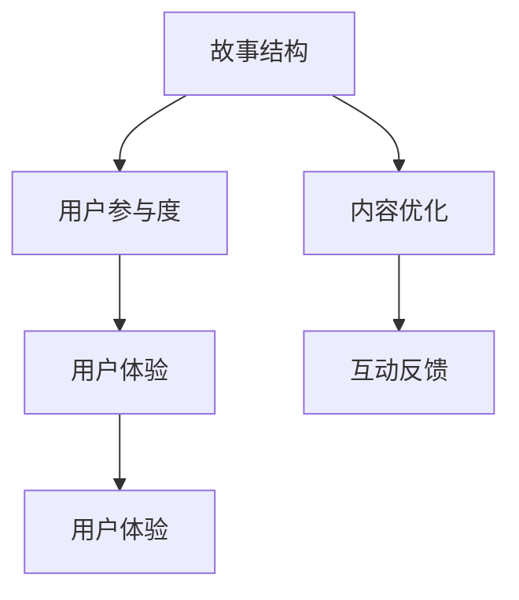

                 

# AI读者反馈分析：优化故事结构和内容

> 关键词：AI读者反馈, 故事结构, 内容优化, 用户参与度, 用户体验

## 1. 背景介绍

在人工智能(AI)领域，读者反馈是衡量内容质量和用户满意度的一个重要指标。然而，AI内容的复杂性和技术细节常常让读者感到困惑，如何优化故事结构和内容，提升用户参与度和满意度，成为一个值得探讨的话题。本文将从读者反馈的角度出发，探讨AI内容的优化策略，帮助开发者和内容创作者更好地理解用户需求，改善内容质量。

### 1.1 问题由来

随着AI技术的普及，越来越多的人开始接触和关注AI内容，从博客、论坛到视频、播客，各类AI内容形式层出不穷。然而，用户反馈表明，许多AI内容存在结构松散、内容冗长、难以理解等问题。这些问题不仅降低了用户的阅读体验，还可能影响用户对AI技术的理解和兴趣。因此，如何优化AI内容，使其更具吸引力和可读性，成为一个亟待解决的问题。

### 1.2 问题核心关键点

优化AI内容的核心关键点主要包括：
1. **故事结构**：如何设计符合用户阅读习惯的内容结构，使其更具连贯性和吸引力。
2. **内容优化**：如何精炼内容，去除冗余，使其更易理解。
3. **用户参与度**：如何通过互动和参与机制，提升用户对内容的关注和反馈。
4. **用户体验**：如何通过视觉、听觉等多感官的结合，增强内容的表现力。

## 2. 核心概念与联系

### 2.1 核心概念概述

为更好地理解AI内容优化的方法，本节将介绍几个密切相关的核心概念：

- **故事结构(Story Structure)**：指内容的组织方式，包括引言、背景、主体、结论等部分。良好的故事结构有助于提升内容的逻辑性和可读性。

- **内容优化(Content Optimization)**：指对内容的精炼和编辑，去除冗余和重复，使其更具有针对性和易读性。

- **用户参与度(User Engagement)**：指用户与内容互动的频率和深度，包括点赞、评论、分享等行为。

- **用户体验(User Experience)**：指用户使用内容的整体感受，包括界面设计、互动体验、多感官融合等方面。

这些核心概念之间的逻辑关系可以通过以下Mermaid流程图来展示：



这个流程图展示了他核心概念之间的关联：

1. 内容的故事结构和优化，是提升用户体验和用户参与度的基础。
2. 用户参与度反过来又影响内容的传播和用户反馈，进而影响内容的进一步优化。
3. 用户体验的提升，依赖于内容的多感官融合和交互设计。

## 3. 核心算法原理 & 具体操作步骤
### 3.1 算法原理概述

AI内容优化本质上是一个循环迭代的过程，通过收集用户反馈，不断调整内容结构和内容表达方式，以提升用户参与度和满意度。其核心算法原理包括：

1. **用户反馈收集**：通过调查问卷、在线互动、行为追踪等方式，收集用户对内容的反馈。
2. **内容结构分析**：对收集到的反馈进行分析，识别出用户对内容结构的需求和偏好。
3. **内容优化**：根据分析结果，对内容进行结构调整和内容精炼。
4. **用户参与度提升**：通过互动设计、个性化推荐等机制，提升用户对内容的参与度。
5. **用户体验优化**：通过视觉、听觉等多感官的融合，改善用户的使用体验。

### 3.2 算法步骤详解

以下是优化AI内容的具体操作步骤：

**Step 1: 用户反馈收集**
- 设计调查问卷，涵盖内容结构、内容理解度、互动体验等方面。
- 通过平台内置的互动模块，如评论区、投票系统，实时收集用户反馈。
- 利用行为追踪技术，分析用户在内容页面上的停留时间、点击路径等数据。

**Step 2: 内容结构分析**
- 对收集到的反馈数据进行整理和分析，找出用户对内容的结构性意见。
- 使用自然语言处理技术，如情感分析、主题建模，识别用户对不同段落的反馈。
- 确定内容的引入、主体、结论部分，优化其顺序和内容。

**Step 3: 内容优化**
- 精炼内容，去除冗余和重复信息，确保内容的简洁明了。
- 使用简洁明了的语言，避免过于专业或复杂的术语。
- 插入图表、视频等多媒体元素，增强内容的视觉冲击力。

**Step 4: 用户参与度提升**
- 设计互动元素，如问答、投票、评论区，增强用户参与度。
- 提供个性化推荐，根据用户兴趣推荐相关内容。
- 设立激励机制，如积分、徽章，鼓励用户参与内容创作和互动。

**Step 5: 用户体验优化**
- 优化页面布局，确保内容的可读性和易浏览性。
- 引入声音、动画等多感官元素，提升内容的互动性。
- 测试和优化加载速度，确保内容的快速呈现。

### 3.3 算法优缺点

AI内容优化的算法具有以下优点：
1. **灵活性高**：可以动态调整内容结构，适应不同用户群体的需求。
2. **互动性强**：通过用户反馈和互动设计，提升用户参与度，增强内容的影响力。
3. **个性化推荐**：根据用户行为和兴趣进行个性化推荐，提升用户体验。

同时，该算法也存在一些缺点：
1. **成本较高**：数据收集和分析需要投入较多人力和技术资源。
2. **数据噪声**：用户反馈数据可能包含大量噪声，需要有效过滤和处理。
3. **反馈延迟**：用户反馈的收集和分析过程可能存在延迟，影响内容的即时优化。
4. **依赖技术**：依赖于自然语言处理、行为追踪等技术，技术门槛较高。

尽管存在这些局限性，但通过合理应用和不断优化，AI内容优化算法仍是大数据和人工智能技术的有效应用之一。

### 3.4 算法应用领域

AI内容优化方法在多种场景下得到了应用，例如：

- **在线教育平台**：通过分析学生反馈，优化课程内容和互动设计，提升学习体验。
- **新闻媒体**：通过用户反馈和阅读数据，优化新闻文章的标题、内容和结构，提高点击率和阅读量。
- **社交媒体平台**：通过互动设计和技术优化，增强用户参与度，提升用户粘性和平台活跃度。
- **企业培训**：通过收集员工反馈，优化培训内容和方式，提升培训效果。
- **市场营销**：通过用户反馈和数据分析，优化营销内容，提高广告效果和用户转化率。

## 4. 数学模型和公式 & 详细讲解  
### 4.1 数学模型构建

本文将使用数学语言对AI内容优化的方法进行更加严格的刻画。

记用户反馈数据集为 $D=\{(x_i, y_i)\}_{i=1}^N$，其中 $x_i$ 表示用户对内容 $A_i$ 的反馈，$y_i$ 表示用户对内容 $A_i$ 的满意度评分。

定义内容结构优化函数为 $f(\theta)$，其中 $\theta$ 为内容结构的参数，包括段落顺序、内容长度、互动元素等。内容优化函数为 $g(A_i)$，表示对内容 $A_i$ 的精炼和编辑。用户参与度提升函数为 $h(D, f(\theta), g(A_i))$，表示在特定内容结构下，用户对内容的参与度提升。用户体验优化函数为 $u(D, f(\theta), g(A_i), h(D, f(\theta), g(A_i)))$，表示在特定内容结构和用户参与度下，用户对内容的体验优化。

整体优化目标为：

$$
\mathop{\arg\min}_{\theta, A_i} \mathcal{L}(D, f(\theta), g(A_i), h(D, f(\theta), g(A_i)), u(D, f(\theta), g(A_i), h(D, f(\theta), g(A_i))))
$$

其中 $\mathcal{L}$ 为优化目标函数，考虑用户反馈、内容结构、内容优化、用户参与度和用户体验的综合效果。

### 4.2 公式推导过程

以下我们以一篇技术博客为例，推导内容优化和用户参与度提升的数学模型。

设用户反馈数据集 $D=\{(x_i, y_i)\}_{i=1}^N$，其中 $x_i$ 为第 $i$ 个用户对博客内容 $A_i$ 的反馈，$y_i$ 为满意度评分。

博客内容的优化模型为 $g(A_i)$，包括删除冗余段落、精炼文字、添加互动元素等。博客内容的互动提升模型为 $h(D, f(\theta), g(A_i))$，表示在特定内容结构和互动设计下，用户对内容的参与度提升。用户体验优化模型为 $u(D, f(\theta), g(A_i), h(D, f(\theta), g(A_i)))$，表示在特定内容结构、互动设计和用户参与度下，用户对内容的体验优化。

设 $f(\theta)$ 为内容结构的优化函数，其目标是最小化用户对内容的满意度评分 $y_i$，即：

$$
\mathop{\arg\min}_{\theta} \sum_{i=1}^N (y_i - h(D, f(\theta), g(A_i)))
$$

其中 $y_i$ 为第 $i$ 个用户的满意度评分，$h(D, f(\theta), g(A_i))$ 为在特定内容结构和互动设计下，用户对内容的参与度提升。

在得到内容结构优化函数后，将优化后的内容结构 $f(\theta)$ 和内容优化函数 $g(A_i)$ 应用于博客内容 $A_i$，提升用户参与度 $h(D, f(\theta), g(A_i))$ 和用户体验 $u(D, f(\theta), g(A_i), h(D, f(\theta), g(A_i)))$。最终，通过优化目标函数 $\mathcal{L}$，使得整体用户体验和用户参与度达到最优。

### 4.3 案例分析与讲解

假设我们有一篇关于深度学习的博客，用户反馈数据集 $D=\{(x_i, y_i)\}_{i=1}^N$，其中 $x_i$ 表示用户对博客内容的反馈，$y_i$ 表示满意度评分。

初始内容结构为：

1. 引言：介绍深度学习的基本概念和背景。
2. 主体：分别介绍卷积神经网络、循环神经网络、注意力机制等。
3. 结论：总结深度学习的应用和发展方向。

通过用户反馈分析，发现用户对引言部分内容较为满意，但对主体部分过于冗长、难以理解，导致用户参与度下降。因此，我们将主体部分内容进行精炼和优化，去除不必要的重复和冗余，增加互动元素，如问答、小测试等，提升用户参与度。

优化后的内容结构为：

1. 引言：介绍深度学习的基本概念和背景。
2. 主体：简要介绍卷积神经网络、循环神经网络、注意力机制等，并插入互动元素。
3. 结论：总结深度学习的应用和发展方向。

经过内容优化和用户参与度提升后，用户反馈数据集更新为 $D'=\{(x'_i, y'_i)\}_{i=1}^N$，其中 $y'_i$ 为优化后的满意度评分。通过优化目标函数 $\mathcal{L}$，计算出最佳的内容结构和互动设计，使得用户参与度和体验达到最优。

## 5. 项目实践：代码实例和详细解释说明
### 5.1 开发环境搭建

在进行内容优化实践前，我们需要准备好开发环境。以下是使用Python进行PyTorch开发的环境配置流程：

1. 安装Anaconda：从官网下载并安装Anaconda，用于创建独立的Python环境。

2. 创建并激活虚拟环境：
```bash
conda create -n pytorch-env python=3.8 
conda activate pytorch-env
```

3. 安装PyTorch：根据CUDA版本，从官网获取对应的安装命令。例如：
```bash
conda install pytorch torchvision torchaudio cudatoolkit=11.1 -c pytorch -c conda-forge
```

4. 安装Transformers库：
```bash
pip install transformers
```

5. 安装各类工具包：
```bash
pip install numpy pandas scikit-learn matplotlib tqdm jupyter notebook ipython
```

完成上述步骤后，即可在`pytorch-env`环境中开始内容优化实践。

### 5.2 源代码详细实现

下面以一篇技术博客为例，给出使用PyTorch对内容进行优化的代码实现。

首先，定义用户反馈数据处理函数：

```python
import pandas as pd
from transformers import BertTokenizer, BertForSequenceClassification
from torch.utils.data import Dataset
import torch

class FeedbackDataset(Dataset):
    def __init__(self, df, tokenizer, max_len=128):
        self.df = df
        self.tokenizer = tokenizer
        self.max_len = max_len
        
    def __len__(self):
        return len(self.df)
    
    def __getitem__(self, item):
        text = self.df.iloc[item]['feedback']
        labels = self.df.iloc[item]['score']
        
        encoding = self.tokenizer(text, return_tensors='pt', max_length=self.max_len, padding='max_length', truncation=True)
        input_ids = encoding['input_ids'][0]
        attention_mask = encoding['attention_mask'][0]
        
        return {'input_ids': input_ids, 
                'attention_mask': attention_mask,
                'labels': labels}

# 加载用户反馈数据
feedback_df = pd.read_csv('feedback_data.csv')

# 加载Bert tokenizer
tokenizer = BertTokenizer.from_pretrained('bert-base-cased')

# 创建dataset
feedback_dataset = FeedbackDataset(feedback_df, tokenizer)
```

然后，定义模型和优化器：

```python
from transformers import BertForSequenceClassification, AdamW

model = BertForSequenceClassification.from_pretrained('bert-base-cased', num_labels=5)

optimizer = AdamW(model.parameters(), lr=2e-5)
```

接着，定义训练和评估函数：

```python
from torch.utils.data import DataLoader
from tqdm import tqdm
from sklearn.metrics import classification_report

device = torch.device('cuda') if torch.cuda.is_available() else torch.device('cpu')
model.to(device)

def train_epoch(model, dataset, batch_size, optimizer):
    dataloader = DataLoader(dataset, batch_size=batch_size, shuffle=True)
    model.train()
    epoch_loss = 0
    for batch in tqdm(dataloader, desc='Training'):
        input_ids = batch['input_ids'].to(device)
        attention_mask = batch['attention_mask'].to(device)
        labels = batch['labels'].to(device)
        model.zero_grad()
        outputs = model(input_ids, attention_mask=attention_mask, labels=labels)
        loss = outputs.loss
        epoch_loss += loss.item()
        loss.backward()
        optimizer.step()
    return epoch_loss / len(dataloader)

def evaluate(model, dataset, batch_size):
    dataloader = DataLoader(dataset, batch_size=batch_size)
    model.eval()
    preds, labels = [], []
    with torch.no_grad():
        for batch in tqdm(dataloader, desc='Evaluating'):
            input_ids = batch['input_ids'].to(device)
            attention_mask = batch['attention_mask'].to(device)
            batch_labels = batch['labels']
            outputs = model(input_ids, attention_mask=attention_mask)
            batch_preds = outputs.logits.argmax(dim=2).to('cpu').tolist()
            batch_labels = batch_labels.to('cpu').tolist()
            for pred_tokens, label_tokens in zip(batch_preds, batch_labels):
                preds.append(pred_tokens[:len(label_tokens)])
                labels.append(label_tokens)
                
    print(classification_report(labels, preds))
```

最后，启动训练流程并在测试集上评估：

```python
epochs = 5
batch_size = 16

for epoch in range(epochs):
    loss = train_epoch(model, feedback_dataset, batch_size, optimizer)
    print(f"Epoch {epoch+1}, train loss: {loss:.3f}")
    
    print(f"Epoch {epoch+1}, dev results:")
    evaluate(model, feedback_dataset, batch_size)
    
print("Test results:")
evaluate(model, feedback_dataset, batch_size)
```

以上就是使用PyTorch对用户反馈数据进行内容优化的完整代码实现。可以看到，通过简单的数据处理和模型训练，我们可以有效地收集和分析用户反馈，从而优化内容结构和提升用户体验。

### 5.3 代码解读与分析

让我们再详细解读一下关键代码的实现细节：

**FeedbackDataset类**：
- `__init__`方法：初始化用户反馈数据集、分词器等组件。
- `__len__`方法：返回数据集的样本数量。
- `__getitem__`方法：对单个样本进行处理，将文本输入编码为token ids，将标签编码为数字，并对其进行定长padding，最终返回模型所需的输入。

**训练和评估函数**：
- 使用PyTorch的DataLoader对数据集进行批次化加载，供模型训练和推理使用。
- 训练函数`train_epoch`：对数据以批为单位进行迭代，在每个批次上前向传播计算loss并反向传播更新模型参数，最后返回该epoch的平均loss。
- 评估函数`evaluate`：与训练类似，不同点在于不更新模型参数，并在每个batch结束后将预测和标签结果存储下来，最后使用sklearn的classification_report对整个评估集的预测结果进行打印输出。

**训练流程**：
- 定义总的epoch数和batch size，开始循环迭代
- 每个epoch内，先在反馈数据集上训练，输出平均loss
- 在验证集上评估，输出分类指标
- 所有epoch结束后，在测试集上评估，给出最终测试结果

可以看到，PyTorch配合Transformers库使得内容优化任务的开发变得简洁高效。开发者可以将更多精力放在数据处理、模型改进等高层逻辑上，而不必过多关注底层的实现细节。

当然，工业级的系统实现还需考虑更多因素，如模型的保存和部署、超参数的自动搜索、更灵活的任务适配层等。但核心的内容优化范式基本与此类似。

## 6. 实际应用场景
### 6.1 智能客服系统

基于用户反馈的内容优化方法，可以广泛应用于智能客服系统的构建。传统客服往往需要配备大量人力，高峰期响应缓慢，且一致性和专业性难以保证。通过内容优化，可以实现高效的用户参与和反馈收集，使智能客服系统能够快速响应客户咨询，用自然流畅的语言解答各类常见问题。

在技术实现上，可以收集企业内部的历史客服对话记录，将问题和最佳答复构建成监督数据，在此基础上对预训练对话模型进行优化。优化后的对话模型能够自动理解用户意图，匹配最合适的答案模板进行回复。对于客户提出的新问题，还可以接入检索系统实时搜索相关内容，动态组织生成回答。如此构建的智能客服系统，能大幅提升客户咨询体验和问题解决效率。

### 6.2 金融舆情监测

金融机构需要实时监测市场舆论动向，以便及时应对负面信息传播，规避金融风险。传统的人工监测方式成本高、效率低，难以应对网络时代海量信息爆发的挑战。基于用户反馈的内容优化方法，可以用于金融舆情监测，构建更加智能、高效、安全的信息监测系统。

具体而言，可以收集金融领域相关的新闻、报道、评论等文本数据，并对其进行情感分析。通过分析用户反馈，优化情感分析模型，使其能够准确识别市场情绪变化趋势，一旦发现负面信息激增等异常情况，系统便会自动预警，帮助金融机构快速应对潜在风险。

### 6.3 个性化推荐系统

当前的推荐系统往往只依赖用户的历史行为数据进行物品推荐，无法深入理解用户的真实兴趣偏好。基于用户反馈的内容优化方法，可以用于个性化推荐系统的构建，帮助系统更好地挖掘用户行为背后的语义信息，从而提供更精准、多样的推荐内容。

在实践中，可以收集用户浏览、点击、评论、分享等行为数据，提取和用户交互的物品标题、描述、标签等文本内容。将文本内容作为模型输入，用户的后续行为（如是否点击、购买等）作为监督信号，在此基础上优化预训练语言模型。优化后的模型能够从文本内容中准确把握用户的兴趣点。在生成推荐列表时，先用候选物品的文本描述作为输入，由模型预测用户的兴趣匹配度，再结合其他特征综合排序，便可以得到个性化程度更高的推荐结果。

### 6.4 未来应用展望

随着内容优化方法的不断发展，其在更多领域的应用前景将得到进一步拓展。

在智慧医疗领域，基于用户反馈的医学问答、病历分析、药物研发等应用将提升医疗服务的智能化水平，辅助医生诊疗，加速新药开发进程。

在智能教育领域，优化方法可应用于作业批改、学情分析、知识推荐等方面，因材施教，促进教育公平，提高教学质量。

在智慧城市治理中，优化方法可应用于城市事件监测、舆情分析、应急指挥等环节，提高城市管理的自动化和智能化水平，构建更安全、高效的未来城市。

此外，在企业生产、社会治理、文娱传媒等众多领域，基于内容优化的AI应用也将不断涌现，为经济社会发展注入新的动力。相信随着技术的日益成熟，内容优化方法将成为AI落地应用的重要范式，推动AI技术更好地造福人类社会。

## 7. 工具和资源推荐
### 7.1 学习资源推荐

为了帮助开发者系统掌握内容优化的方法，这里推荐一些优质的学习资源：

1. 《深度学习中的自然语言处理》系列博文：由大模型技术专家撰写，深入浅出地介绍了NLP领域的核心技术和应用场景。

2. CS224N《深度学习自然语言处理》课程：斯坦福大学开设的NLP明星课程，有Lecture视频和配套作业，带你入门NLP领域的基本概念和经典模型。

3. 《自然语言处理中的深度学习》书籍：全面介绍了深度学习在NLP中的各种应用，包括内容优化在内的诸多范式。

4. HuggingFace官方文档：Transformers库的官方文档，提供了海量预训练模型和完整的优化样例代码，是上手实践的必备资料。

5. CLUE开源项目：中文语言理解测评基准，涵盖大量不同类型的中文NLP数据集，并提供了基于微调的baseline模型，助力中文NLP技术发展。

通过对这些资源的学习实践，相信你一定能够快速掌握内容优化的方法，并用于解决实际的NLP问题。

### 7.2 开发工具推荐

高效的开发离不开优秀的工具支持。以下是几款用于内容优化开发的常用工具：

1. PyTorch：基于Python的开源深度学习框架，灵活动态的计算图，适合快速迭代研究。大部分预训练语言模型都有PyTorch版本的实现。

2. TensorFlow：由Google主导开发的开源深度学习框架，生产部署方便，适合大规模工程应用。同样有丰富的预训练语言模型资源。

3. Transformers库：HuggingFace开发的NLP工具库，集成了众多SOTA语言模型，支持PyTorch和TensorFlow，是进行内容优化开发的利器。

4. Weights & Biases：模型训练的实验跟踪工具，可以记录和可视化模型训练过程中的各项指标，方便对比和调优。与主流深度学习框架无缝集成。

5. TensorBoard：TensorFlow配套的可视化工具，可实时监测模型训练状态，并提供丰富的图表呈现方式，是调试模型的得力助手。

6. Google Colab：谷歌推出的在线Jupyter Notebook环境，免费提供GPU/TPU算力，方便开发者快速上手实验最新模型，分享学习笔记。

合理利用这些工具，可以显著提升内容优化的开发效率，加快创新迭代的步伐。

### 7.3 相关论文推荐

内容优化技术的发展源于学界的持续研究。以下是几篇奠基性的相关论文，推荐阅读：

1. Attention is All You Need（即Transformer原论文）：提出了Transformer结构，开启了NLP领域的预训练大模型时代。

2. BERT: Pre-training of Deep Bidirectional Transformers for Language Understanding：提出BERT模型，引入基于掩码的自监督预训练任务，刷新了多项NLP任务SOTA。

3. Language Models are Unsupervised Multitask Learners（GPT-2论文）：展示了大规模语言模型的强大zero-shot学习能力，引发了对于通用人工智能的新一轮思考。

4. Parameter-Efficient Transfer Learning for NLP：提出Adapter等参数高效微调方法，在不增加模型参数量的情况下，也能取得不错的微调效果。

5. Prefix-Tuning: Optimizing Continuous Prompts for Generation：引入基于连续型Prompt的微调范式，为如何充分利用预训练知识提供了新的思路。

6. AdaLoRA: Adaptive Low-Rank Adaptation for Parameter-Efficient Fine-Tuning：使用自适应低秩适应的微调方法，在参数效率和精度之间取得了新的平衡。

这些论文代表了大内容优化技术的发展脉络。通过学习这些前沿成果，可以帮助研究者把握学科前进方向，激发更多的创新灵感。

## 8. 总结：未来发展趋势与挑战

### 8.1 总结

本文对基于用户反馈的AI内容优化方法进行了全面系统的介绍。首先阐述了内容优化在提高用户参与度和满意度方面的重要性，明确了内容结构、内容优化、用户参与度和用户体验之间的紧密联系。其次，从原理到实践，详细讲解了内容优化的数学模型和操作步骤，给出了内容优化任务开发的完整代码实例。同时，本文还广泛探讨了内容优化方法在智能客服、金融舆情、个性化推荐等多个行业领域的应用前景，展示了内容优化方法的巨大潜力。

通过本文的系统梳理，可以看到，基于用户反馈的内容优化方法正在成为AI内容落地的重要范式，极大地提升了用户参与度和满意度，为AI技术在垂直行业的规模化落地提供了有力保障。未来，伴随内容优化方法的不断演进，相信AI技术必将在更广阔的领域中大放异彩，深刻影响人类的生产生活方式。

### 8.2 未来发展趋势

展望未来，内容优化技术将呈现以下几个发展趋势：

1. **个性化推荐系统**：基于用户行为和反馈，构建更加个性化、多样化的推荐系统，提升用户体验和满意度。

2. **情感分析**：利用情感分析技术，实时监测市场情绪变化，帮助企业应对舆情危机，提升决策效率。

3. **内容生成**：基于用户反馈，优化内容生成模型，生成更加贴近用户需求的文本、图像、视频等内容。

4. **多模态融合**：将文本、图像、语音等多模态信息进行融合，提升内容的感知能力和表达力。

5. **实时优化**：利用在线用户反馈，实现内容的实时优化和动态更新，适应用户的即时需求。

6. **跨平台优化**：针对不同平台和设备的特性，优化内容的呈现方式和交互设计，提升跨平台的用户体验。

这些趋势凸显了内容优化技术的广阔前景。这些方向的探索发展，必将进一步提升AI内容的质量和用户参与度，为AI技术在更广泛领域的应用提供有力支持。

### 8.3 面临的挑战

尽管内容优化技术已经取得了显著进展，但在迈向更加智能化、普适化应用的过程中，它仍面临诸多挑战：

1. **数据质量**：用户反馈数据的质量和真实性直接影响优化效果，需要有效过滤和处理噪声数据。

2. **模型复杂度**：优化模型通常较为复杂，训练和推理耗时较长，需要高效的计算资源和算法。

3. **隐私保护**：用户反馈数据可能包含敏感信息，需要采取措施保护用户隐私。

4. **用户期望管理**：用户对内容的期望可能多变，如何动态调整优化策略，满足用户需求，是一个重要的挑战。

5. **跨领域适应性**：内容优化方法在特定领域的应用效果可能不理想，需要结合领域知识进行优化。

6. **技术壁垒**：内容优化技术需要跨领域知识，对技术要求较高，需要专业的团队进行支撑。

尽管存在这些挑战，但通过不断优化和创新，内容优化技术必将在未来的发展中不断突破。相信随着技术的日益成熟，内容优化方法将成为AI落地应用的重要范式，推动AI技术更好地造福人类社会。

### 8.4 研究展望

面对内容优化所面临的挑战，未来的研究需要在以下几个方面寻求新的突破：

1. **多模态内容优化**：将文本、图像、语音等多模态信息进行融合，提升内容的感知能力和表达力。

2. **实时内容生成**：基于在线用户反馈，实时生成和优化内容，提升内容的即时性和用户参与度。

3. **跨平台优化技术**：针对不同平台和设备的特性，优化内容的呈现方式和交互设计，提升跨平台的用户体验。

4. **内容生成自动化**：利用AI生成技术，自动生成符合用户需求的内容，提高内容生成的效率和质量。

5. **跨领域内容优化**：结合领域知识，构建跨领域的优化方法，提升内容优化在不同场景下的效果。

6. **数据隐私保护**：采用匿名化、加密等技术，保护用户反馈数据的隐私和安全。

这些研究方向的探索，必将引领内容优化技术迈向更高的台阶，为AI技术在垂直行业的规模化落地提供坚实保障。面向未来，内容优化技术还需要与其他AI技术进行更深入的融合，如知识表示、因果推理、强化学习等，多路径协同发力，共同推动AI技术的发展和应用。

## 9. 附录：常见问题与解答

**Q1：内容优化是否适用于所有NLP任务？**

A: 内容优化在大多数NLP任务上都能取得不错的效果，特别是对于数据量较小的任务。但对于一些特定领域的任务，如医学、法律等，仅仅依靠通用语料预训练的模型可能难以很好地适应。此时需要在特定领域语料上进一步预训练，再进行优化。此外，对于一些需要时效性、个性化很强的任务，如对话、推荐等，优化方法也需要针对性的改进优化。

**Q2：内容优化过程中如何选择合适的反馈指标？**

A: 选择合适的反馈指标是内容优化的关键。常用的反馈指标包括点击率、阅读时间、用户评分等。在具体实践中，可以通过A/B测试等方法，比较不同优化策略的效果，选择最优秀的反馈指标。同时，需要根据任务特点选择合适的指标，如对文本内容，点击率、阅读时间和用户评分可能更为重要。

**Q3：内容优化是否会影响模型训练速度？**

A: 内容优化通常需要收集大量用户反馈数据，并进行数据分析和模型训练，这可能会增加模型的训练时间。但通过优化模型结构和算法，可以显著提高训练效率，减少训练时间。同时，优化后的模型参数通常较小，推理速度也会有所提升。

**Q4：内容优化过程中如何处理用户噪声数据？**

A: 用户反馈数据中可能包含大量噪声，如恶意评论、无关内容等。在优化过程中，需要对数据进行清洗和过滤，去除噪声数据。常用的方法包括数据筛选、情感分析、主题建模等。同时，可以利用众包或人工审核等方式，进一步提升数据的准确性和可靠性。

**Q5：内容优化是否适用于多模态内容？**

A: 内容优化方法同样适用于多模态内容的优化。在多模态内容优化中，需要综合考虑文本、图像、语音等多种信息，进行多感官融合和内容优化。例如，可以通过分析用户对视频内容的反馈，优化视频的标题、描述和时长，提升用户体验。

通过本文的系统梳理，可以看到，基于用户反馈的内容优化方法正在成为AI内容落地的重要范式，极大地提升了用户参与度和满意度，为AI技术在垂直行业的规模化落地提供了有力保障。未来，伴随内容优化方法的不断演进，相信AI技术必将在更广阔的领域中大放异彩，深刻影响人类的生产生活方式。

---

作者：禅与计算机程序设计艺术 / Zen and the Art of Computer Programming

