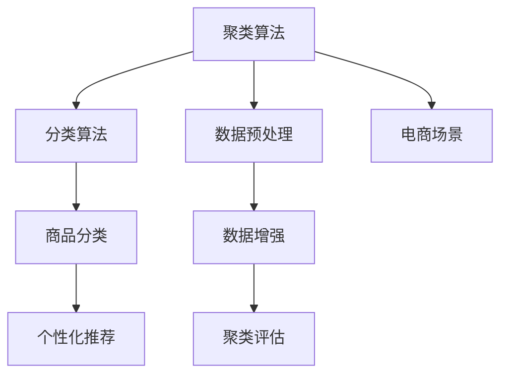

                 

## 1. 背景介绍

### 1.1 问题由来

电商平台作为一个海量数据的集合地，面临着如何对商品进行有效管理与分类的难题。传统的商品分类方法，如简单的分类表、线性分类模型等，已经无法满足当前电商平台的复杂性和动态性需求。此外，电商平台的商品种类繁多，手动标注分类成本高，难以实现自动化分类。

因此，如何利用机器学习、数据挖掘等技术，对电商平台商品进行自动化的聚类和分类，成为电商行业亟待解决的问题。商品聚类技术可以高效地对海量商品进行聚类，降低人工标注成本，提升分类效率和精确度，从而优化电商平台的运营管理和用户购物体验。

### 1.2 问题核心关键点

电商平台商品聚类的核心在于如何通过机器学习算法，对商品进行自动化的分类和聚类，使得不同商品在同一类别下具有相似的特征，从而方便电商平台的运营和管理。主要涉及以下关键点：

- 算法选择：选择合适的聚类算法，满足电商平台的分类需求。
- 数据处理：对电商平台商品数据进行预处理，提升算法性能。
- 聚类评估：设计有效的聚类评估指标，评价聚类结果的质量。
- 应用优化：将聚类技术应用于电商平台运营中的商品管理、推荐系统、用户画像构建等环节。

### 1.3 问题研究意义

商品聚类技术对于电商平台的运营具有重要意义：

- 提升运营效率：商品聚类可以自动对海量商品进行分类，节省人工标注成本，提升运营效率。
- 优化推荐系统：通过聚类技术，电商平台能够更精准地对用户进行画像分析，提升个性化推荐效果。
- 增强用户体验：聚类技术使得商品分类更加合理，用户可以更方便地找到所需商品，提升购物体验。
- 支持决策分析：电商平台通过聚类技术，可以更好地理解商品之间的关系，为决策分析提供支持。

## 2. 核心概念与联系

### 2.1 核心概念概述

为更好地理解电商平台商品聚类技术，本节将介绍几个密切相关的核心概念：

- 聚类(Clustering)：将数据对象分为不同类别的过程。在电商平台，聚类即将商品划分为不同的类别，使得同一类别的商品具有相似的特征。
- 分类(Classification)：将数据对象分为已知类别的过程。在电商平台，分类即将商品分为已知的几个类别，如服装、电子产品等。
- 聚类算法：对数据进行分组的算法，常见的聚类算法包括K-means、层次聚类、DBSCAN等。
- 评估指标：衡量聚类质量的关键指标，如轮廓系数(Silhouette Coefficient)、Calinski-Harabasz指数等。
- 应用场景：电商平台商品聚类，不仅应用于商品分类，还广泛应用于推荐系统、用户画像构建等环节。

这些概念之间的逻辑关系可以通过以下Mermaid流程图来展示：



这个流程图展示了一系列与商品聚类相关的概念及其之间的关系：

1. 聚类算法对数据进行分组，得到初始聚类结果。
2. 分类算法将聚类结果进一步细化，生成商品分类结果。
3. 数据预处理优化数据集，提升算法性能。
4. 聚类评估指标衡量聚类结果的质量，优化算法参数。
5. 应用场景展示商品聚类在电商平台运营中的具体应用。

## 3. 核心算法原理 & 具体操作步骤

### 3.1 算法原理概述

基于电商平台的商品聚类，本质上是一个有监督或无监督的机器学习任务。其核心思想是：通过对电商平台商品数据进行聚类，得到不同的商品类别，然后对每一类商品进行进一步的特征分析和分类，以便于电商平台进行管理和推荐。

形式化地，假设电商平台商品数据集为 $D=\{(x_i,y_i)\}_{i=1}^N$，其中 $x_i$ 为商品特征向量，$y_i$ 为商品类别标签。聚类的目标是最小化类内距离的同时，最大化类间距离。聚类算法的优化目标如下：

$$
\min \sum_{k=1}^K \sum_{x_i \in C_k} ||x_i - \mu_k||^2,\quad \text{subject to} \quad \sum_{x_i \in C_k} ||x_i - \mu_k||^2 = C_k,\quad C_k \cap C_l = \emptyset \quad (k \neq l)
$$

其中，$C_k$ 为第 $k$ 个聚类簇，$\mu_k$ 为簇 $C_k$ 的中心点，$||\cdot||$ 表示向量的欧几里得距离。

### 3.2 算法步骤详解

基于电商平台的商品聚类，一般包括以下几个关键步骤：

**Step 1: 数据预处理**

- 收集电商平台商品数据，包括商品名称、价格、描述、评分等特征。
- 进行数据清洗，处理缺失值、异常值等数据问题。
- 对数据进行标准化处理，如归一化、标准化等。
- 对特征进行降维，减少数据维度，提升算法性能。

**Step 2: 选择合适的聚类算法**

- 根据电商平台的业务需求，选择合适的聚类算法。常见的聚类算法包括K-means、层次聚类、DBSCAN等。
- 设计合适的聚类参数，如簇数、距离度量、相似度阈值等。

**Step 3: 执行聚类**

- 将预处理后的数据集作为输入，使用选择的聚类算法执行聚类过程。
- 不断迭代，调整聚类参数，优化聚类结果。

**Step 4: 聚类评估**

- 设计合适的聚类评估指标，如轮廓系数、Calinski-Harabasz指数等。
- 在验证集上评估聚类结果的质量，根据评估结果调整聚类参数。

**Step 5: 商品分类**

- 根据聚类结果，将商品分为不同的类别。
- 对每一类商品进行特征分析，生成分类结果。

**Step 6: 应用优化**

- 将聚类结果应用于电商平台运营中的商品管理、推荐系统、用户画像构建等环节。

以上是基于电商平台商品聚类的一般流程。在实际应用中，还需要针对具体业务需求，对聚类过程的各个环节进行优化设计，如改进数据预处理方法，选择合适的聚类算法，引入更多评估指标等，以进一步提升聚类效果。

### 3.3 算法优缺点

基于电商平台的商品聚类算法具有以下优点：

1. 自动化程度高。聚类算法能够自动对商品数据进行分组，减少人工标注成本，提升分类效率。
2. 灵活性高。聚类算法适用于不同类型的数据和不同规模的电商平台。
3. 可扩展性强。聚类算法可以方便地与其他机器学习技术进行结合，如分类、回归等，实现更复杂的数据建模。

同时，该算法也存在一些局限性：

1. 需要大量数据。聚类算法通常需要大量的数据支持，对电商平台的小规模数据集可能不适用。
2. 聚类效果受参数影响较大。不同的聚类参数设置，可能导致不同的聚类结果。
3. 聚类结果可解释性不足。聚类算法输出的结果通常难以直接解释，难以满足电商平台的实际需求。

尽管存在这些局限性，但就目前而言，聚类算法仍然是电商平台商品分类和管理的核心技术。未来相关研究的重点在于如何进一步降低聚类算法对数据量的依赖，提高聚类算法的鲁棒性和可解释性，同时兼顾聚类效果和计算效率。

### 3.4 算法应用领域

基于电商平台的商品聚类算法，在电商领域已经被广泛应用，涵盖多个业务场景，例如：

- 商品分类：将商品分为不同的类别，如服装、电子产品、食品等。通过聚类算法，自动对商品进行分类，提高分类效率和精确度。
- 推荐系统：根据用户历史购买记录和聚类结果，生成个性化推荐列表。通过聚类技术，对用户行为进行分析，提升推荐效果。
- 用户画像构建：对用户行为数据进行聚类，构建用户画像。通过聚类技术，挖掘用户兴趣和行为模式，为电商平台的营销活动提供支持。
- 库存管理：通过聚类算法，对商品进行分类管理，优化库存分布和补货策略。
- 物流优化：根据商品聚类结果，优化物流路线和仓储布局，提升物流效率和成本控制。

除了上述这些经典应用外，商品聚类技术也被创新性地应用到更多场景中，如供应链管理、商品价格调整、客户细分等，为电商平台运营提供新的思路和方向。

## 4. 数学模型和公式 & 详细讲解  
### 4.1 数学模型构建

本节将使用数学语言对基于电商平台的商品聚类过程进行更加严格的刻画。

假设电商平台商品数据集为 $D=\{(x_i,y_i)\}_{i=1}^N$，其中 $x_i \in \mathbb{R}^d$ 为商品特征向量，$y_i \in \{1,2,\cdots,K\}$ 为商品类别标签。聚类算法的目标是最小化类内距离的同时，最大化类间距离。常见聚类算法如K-means的优化目标如下：

$$
\min \sum_{k=1}^K \sum_{i=1}^N ||x_i - \mu_k||^2,\quad \text{subject to} \quad \mu_k = \frac{1}{N_k} \sum_{i=1}^N x_i,\quad \sum_{k=1}^K N_k = N
$$

其中，$N_k$ 为簇 $C_k$ 的样本数量。

### 4.2 公式推导过程

以下我们以K-means算法为例，推导其优化目标和梯度计算公式。

假设 $k$ 个聚类中心为 $\mu_k$，样本 $x_i$ 分配到最近的聚类中心 $\mu_{k_i}$。则K-means的优化目标为：

$$
\min_{\{\mu_k\}} \sum_{i=1}^N ||x_i - \mu_{k_i}||^2
$$

其梯度公式为：

$$
\frac{\partial \mathcal{L}}{\partial \mu_k} = -\frac{2}{N_k} \sum_{i=1}^N (x_i - \mu_{k_i})
$$

在得到梯度后，即可带入参数更新公式，完成模型的迭代优化。重复上述过程直至收敛，最终得到最优聚类中心 $\mu_k^*$。

## 5. 项目实践：代码实例和详细解释说明
### 5.1 开发环境搭建

在进行商品聚类实践前，我们需要准备好开发环境。以下是使用Python进行Scikit-learn开发的环境配置流程：

1. 安装Anaconda：从官网下载并安装Anaconda，用于创建独立的Python环境。

2. 创建并激活虚拟环境：
```bash
conda create -n cluster-env python=3.8 
conda activate cluster-env
```

3. 安装Scikit-learn：
```bash
conda install scikit-learn
```

4. 安装其他必要的库：
```bash
pip install numpy pandas matplotlib seaborn
```

完成上述步骤后，即可在`cluster-env`环境中开始商品聚类的实践。

### 5.2 源代码详细实现

下面我们以K-means算法为例，给出使用Scikit-learn库对电商平台商品进行聚类的Python代码实现。

首先，定义数据处理函数：

```python
import pandas as pd
from sklearn.cluster import KMeans
from sklearn.metrics import silhouette_score

def load_data():
    # 加载商品数据
    data = pd.read_csv('items.csv', index_col='id')
    # 数据清洗
    data.dropna(inplace=True)
    return data

def preprocess_data(data):
    # 特征处理
    data = data.drop(['id'], axis=1)
    # 数据标准化
    data = (data - data.mean()) / data.std()
    return data

def evaluate_clusters(data, clusters):
    # 计算轮廓系数
    silhouette = silhouette_score(data, clusters)
    return silhouette
```

然后，定义聚类函数：

```python
def kmeans_clustering(data, k=5, max_iter=300):
    # 数据预处理
    data = preprocess_data(data)
    # 执行K-means聚类
    kmeans = KMeans(n_clusters=k, max_iter=max_iter)
    kmeans.fit(data)
    return kmeans
```

最后，启动聚类流程并评估聚类结果：

```python
# 加载商品数据
data = load_data()

# 聚类
kmeans = kmeans_clustering(data, k=5)

# 评估聚类结果
silhouette = evaluate_clusters(data, kmeans.labels_)
print(f"轮廓系数：{silhouette:.3f}")
```

以上就是使用Scikit-learn对电商平台商品进行K-means聚类的完整代码实现。可以看到，Scikit-learn库封装了K-means算法的详细实现，开发者只需调用函数即可完成商品聚类。

### 5.3 代码解读与分析

让我们再详细解读一下关键代码的实现细节：

**load_data()函数**：
- 定义数据加载函数，从CSV文件中加载商品数据，并设置ID为索引。
- 数据清洗：去除缺失值。

**preprocess_data()函数**：
- 定义特征处理函数，去除ID列。
- 数据标准化：对数据进行归一化处理，使各特征在同一尺度上。

**kmeans_clustering()函数**：
- 定义K-means聚类函数，执行聚类过程。
- 聚类算法：使用Scikit-learn的KMeans类执行K-means算法，并设置聚类数和最大迭代次数。
- 返回聚类结果：返回K-means算法的聚类标签。

**evaluate_clusters()函数**：
- 定义聚类评估函数，计算轮廓系数。
- 聚类评估：使用轮廓系数作为聚类效果评估指标。
- 返回聚类效果：返回聚类效果的评估值。

**启动聚类流程并评估聚类结果**：
- 加载商品数据。
- 执行K-means聚类，返回聚类结果。
- 评估聚类效果，输出轮廓系数。

可以看到，Scikit-learn库使得商品聚类的代码实现变得简洁高效。开发者可以将更多精力放在数据处理、算法改进等高层逻辑上，而不必过多关注底层的实现细节。

当然，工业级的系统实现还需考虑更多因素，如模型的保存和部署、超参数的自动搜索、更灵活的任务适配层等。但核心的聚类范式基本与此类似。

## 6. 实际应用场景
### 6.1 智能推荐系统

基于K-means等聚类算法，智能推荐系统可以根据用户历史行为数据，将用户划分为不同的兴趣群体，然后针对每个群体生成个性化推荐。通过聚类技术，推荐系统能够更好地理解用户需求，提升推荐效果。

在技术实现上，可以收集用户浏览、购买、评分等行为数据，利用聚类算法对用户进行分群。然后对每个群体的兴趣特征进行分析，生成推荐列表。在生成推荐列表时，可以采用协同过滤、内容推荐等算法，结合用户画像和商品聚类结果，实现更精准的个性化推荐。

### 6.2 库存管理

库存管理是电商平台重要的运营环节，通过商品聚类算法，可以优化库存分布，提高仓储效率。具体而言，可以根据聚类结果，将商品分为不同的类别，并分析每个类别的销量情况。然后根据销量数据，优化库存分配和补货策略，确保每个类别的商品都有充足的库存，同时避免过剩库存。

### 6.3 用户画像构建

用户画像构建是电商平台用户行为分析的重要手段，通过商品聚类算法，可以更好地挖掘用户行为模式，构建用户画像。具体而言，可以根据用户购买行为数据，将用户分为不同的群体，并分析每个群体的行为特征。然后利用聚类结果，构建用户画像，为电商平台的个性化营销活动提供支持。

### 6.4 未来应用展望

随着商品聚类算法的不断演进，其在电商平台运营中的应用场景将更加广泛，带来更多的业务价值。

在智慧零售领域，基于聚类算法的推荐系统、库存管理等技术，将优化零售商的运营效率，提升顾客满意度。通过聚类技术，零售商可以更好地理解顾客需求，提供个性化的购物体验。

在供应链管理中，聚类技术可以优化供应链的各个环节，提升供应链的协同效率和灵活性。通过聚类算法，可以对供应链中的商品、仓库、运输等进行合理分配，优化物流成本和效率。

此外，在供应链金融、电商治理、客户细分等诸多领域，商品聚类技术也将不断涌现新的应用，为电商平台运营提供新的思路和方向。相信随着聚类算法的持续优化，其在电商领域的应用前景将更加广阔，为电商平台的数字化转型升级提供新的动力。

## 7. 工具和资源推荐
### 7.1 学习资源推荐

为了帮助开发者系统掌握电商平台商品聚类的理论基础和实践技巧，这里推荐一些优质的学习资源：

1. 《Python机器学习》书籍：由机器学习领域权威人士撰写，全面介绍了机器学习算法的理论基础和实际应用，涵盖商品聚类等核心技术。

2. 《K-means Clustering: Algorithms, Applications, and Software》书籍：详细介绍了K-means聚类算法的理论原理和实现方法，适合对聚类算法感兴趣的读者。

3. 《聚类分析》课程：由上海交通大学开设的MOOC课程，系统讲解了聚类算法的理论知识和实践技巧，适合进一步深入学习。

4. 《机器学习实战》书籍：介绍了机器学习算法的实际应用，包括商品聚类等核心技术，适合实战开发。

5. 《Python数据科学手册》书籍：介绍了Python在数据科学中的应用，包括聚类算法的实现和应用案例，适合初学者入门。

通过对这些资源的学习实践，相信你一定能够快速掌握电商平台商品聚类的精髓，并用于解决实际的电商问题。

### 7.2 开发工具推荐

高效的开发离不开优秀的工具支持。以下是几款用于电商平台商品聚类开发的常用工具：

1. Scikit-learn：基于Python的开源机器学习库，提供丰富的聚类算法实现，适合快速迭代研究。

2. TensorFlow：由Google主导开发的开源机器学习框架，支持分布式计算，适合大规模工程应用。

3. PyTorch：基于Python的开源深度学习框架，支持动态计算图，适合快速实验和研究。

4. Weights & Biases：模型训练的实验跟踪工具，可以记录和可视化模型训练过程中的各项指标，方便对比和调优。

5. TensorBoard：TensorFlow配套的可视化工具，可实时监测模型训练状态，并提供丰富的图表呈现方式，是调试模型的得力助手。

合理利用这些工具，可以显著提升电商平台商品聚类任务的开发效率，加快创新迭代的步伐。

### 7.3 相关论文推荐

商品聚类技术的发展源于学界的持续研究。以下是几篇奠基性的相关论文，推荐阅读：

1. A Survey of Clustering Algorithms （聚类算法综述）：总结了常见的聚类算法，如K-means、层次聚类、DBSCAN等，适合入门学习。

2. K-means: The Theory Behind the "Then-What-If" Algorithm （K-means算法原理）：详细介绍了K-means聚类算法的理论原理，适合深入研究。

3. DBSCAN: A Density-Based Clustering Algorithm for Discovering Clusters in Large Spatial Databases with Noise （DBSCAN算法原理）：介绍了DBSCAN聚类算法，适合了解其他聚类算法。

4. Spectral Clustering: A Tutorial （谱聚类算法）：介绍了谱聚类算法，适合了解高级聚类算法。

5. Scalable Clustering Algorithms for Large Data Sets: A Survey （大规模数据集聚类算法）：总结了在大规模数据集上进行聚类的算法，适合实际应用。

这些论文代表了大语言模型微调技术的发展脉络。通过学习这些前沿成果，可以帮助研究者把握学科前进方向，激发更多的创新灵感。

## 8. 总结：未来发展趋势与挑战

### 8.1 总结

本文对基于电商平台商品聚类的技术进行了全面系统的介绍。首先阐述了电商平台商品聚类的背景和意义，明确了聚类在电商平台的分类需求中的重要价值。其次，从原理到实践，详细讲解了聚类算法的数学模型和关键步骤，给出了商品聚类任务开发的完整代码实例。同时，本文还广泛探讨了聚类技术在推荐系统、库存管理、用户画像等电商运营中的具体应用，展示了聚类技术的广泛应用前景。此外，本文精选了聚类技术的各类学习资源，力求为读者提供全方位的技术指引。

通过本文的系统梳理，可以看到，基于电商平台商品聚类技术在提高运营效率、优化推荐系统、提升用户体验等方面具有重要意义。聚类算法在电商平台的运营中的应用前景广阔，将对电商平台的发展产生深远影响。

### 8.2 未来发展趋势

展望未来，电商平台商品聚类技术将呈现以下几个发展趋势：

1. 算法效率提升。随着电商平台的商品种类和数量不断增长，对聚类算法的高效性提出了更高的要求。未来聚类算法将更加注重计算效率，采用分布式计算、硬件加速等技术，提升聚类速度和性能。

2. 算法优化。随着聚类算法的不断演进，未来的聚类算法将更加注重聚类效果和鲁棒性。引入更多先验知识和特征工程技术，提升聚类算法的泛化能力和鲁棒性。

3. 应用扩展。除了传统的推荐系统、库存管理、用户画像等应用外，聚类算法还将被广泛应用于供应链管理、物流优化、客户细分等更多环节，带来新的业务价值。

4. 结合大数据技术。未来的聚类算法将更加注重大数据技术的结合，如分布式计算、流数据处理等，实现实时聚类和动态聚类。

5. 跨领域应用。聚类算法不仅在电商领域有广泛应用，还可以应用于医疗、金融、旅游等更多领域，提升各领域的运营效率和业务价值。

以上趋势凸显了电商平台商品聚类技术的广阔前景。这些方向的探索发展，必将进一步提升电商平台的运营效率和业务价值，为电商平台的数字化转型升级提供新的动力。

### 8.3 面临的挑战

尽管电商平台商品聚类技术已经取得了显著成就，但在迈向更加智能化、普适化应用的过程中，仍面临诸多挑战：

1. 数据质量问题。电商平台商品数据存在噪声、缺失、不一致等问题，如何提升数据质量，保障聚类结果的准确性，是未来需要解决的重要问题。

2. 算法的可扩展性。随着电商平台商品种类的不断增加，对聚类算法的可扩展性提出了更高的要求。如何设计高效的聚类算法，处理大规模数据集，是未来需要解决的难题。

3. 聚类效果的可解释性。聚类算法输出的结果通常难以直接解释，难以满足电商平台的实际需求。如何提升聚类结果的可解释性，是未来需要解决的重要问题。

4. 算法的鲁棒性。聚类算法在面对异常值、噪声数据时，容易产生错误聚类。如何提高算法的鲁棒性，避免异常数据对聚类结果的影响，是未来需要解决的重要问题。

5. 算法的计算成本。随着电商平台的商品种类和数量不断增加，对聚类算法的计算成本提出了更高的要求。如何设计高效的聚类算法，降低计算成本，提升聚类速度，是未来需要解决的重要问题。

6. 聚类结果的一致性。聚类算法的输出结果通常具有一定的主观性和不确定性，如何提高聚类结果的一致性，是未来需要解决的重要问题。

正视聚类面临的这些挑战，积极应对并寻求突破，将是大语言模型微调技术走向成熟的必由之路。相信随着学界和产业界的共同努力，这些挑战终将一一被克服，聚类技术必将在构建人机协同的智能时代中扮演越来越重要的角色。

### 8.4 研究展望

面对电商平台商品聚类所面临的挑战，未来的研究需要在以下几个方面寻求新的突破：

1. 探索新的聚类算法。开发更加高效、鲁棒的聚类算法，如谱聚类、层次聚类等，以提升聚类效果和鲁棒性。

2. 结合大数据技术。引入大数据技术和分布式计算，实现实时聚类和动态聚类，提升聚类算法的灵活性和可扩展性。

3. 引入更多先验知识。将符号化的先验知识，如知识图谱、逻辑规则等，与神经网络模型进行巧妙融合，引导聚类过程学习更准确、合理的聚类结果。

4. 引入更多特征工程技术。结合特征工程技术，提升聚类算法的泛化能力和鲁棒性，实现更加精细化的聚类。

5. 引入更多机器学习技术。将聚类算法与机器学习技术结合，如协同过滤、内容推荐等，提升聚类算法的业务价值。

6. 引入更多深度学习技术。将深度学习技术引入聚类算法，提升聚类算法的准确性和可解释性。

这些研究方向的探索，必将引领聚类技术迈向更高的台阶，为构建安全、可靠、可解释、可控的智能系统铺平道路。面向未来，聚类技术还需要与其他人工智能技术进行更深入的融合，如知识表示、因果推理、强化学习等，多路径协同发力，共同推动人工智能技术在垂直行业的规模化落地。只有勇于创新、敢于突破，才能不断拓展聚类算法的边界，让智能技术更好地造福人类社会。

## 9. 附录：常见问题与解答

**Q1：聚类算法的优缺点有哪些？**

A: 聚类算法具有以下优点：

- 自动化程度高。聚类算法能够自动对数据进行分组，减少人工标注成本，提升分类效率。
- 灵活性高。聚类算法适用于不同类型的数据和不同规模的数据集。
- 可扩展性强。聚类算法可以方便地与其他机器学习技术进行结合，如分类、回归等，实现更复杂的数据建模。

同时，聚类算法也存在一些缺点：

- 需要大量数据。聚类算法通常需要大量的数据支持，对小规模数据集可能不适用。
- 聚类效果受参数影响较大。不同的聚类参数设置，可能导致不同的聚类结果。
- 聚类结果可解释性不足。聚类算法输出的结果通常难以直接解释，难以满足实际需求。

尽管存在这些局限性，但就目前而言，聚类算法仍然是电商平台商品分类的核心技术。未来相关研究的重点在于如何进一步降低聚类算法对数据量的依赖，提高聚类算法的鲁棒性和可解释性，同时兼顾聚类效果和计算效率。

**Q2：聚类算法如何应用于电商平台运营中的推荐系统？**

A: 聚类算法在电商平台运营中的应用，可以广泛应用于推荐系统。具体而言，可以按以下步骤进行：

1. 数据预处理：收集用户历史行为数据，进行数据清洗和特征处理。
2. 聚类分析：使用聚类算法对用户进行分群，识别出用户兴趣群体。
3. 特征提取：根据用户聚类结果，提取用户特征。
4. 推荐算法：利用聚类结果，优化推荐算法，生成个性化推荐列表。

聚类算法可以提升推荐系统的个性化推荐效果，通过聚类技术，推荐系统能够更好地理解用户需求，提升推荐效果。

**Q3：聚类算法在库存管理中的应用如何实现？**

A: 聚类算法在库存管理中的应用，可以优化库存分配和补货策略。具体而言，可以按以下步骤进行：

1. 数据预处理：收集商品销售数据，进行数据清洗和特征处理。
2. 聚类分析：使用聚类算法对商品进行分类，识别出商品类别。
3. 销量预测：根据商品聚类结果，预测每个类别的销量。
4. 库存优化：根据销量预测结果，优化库存分配和补货策略。

聚类算法可以优化库存管理，通过聚类技术，可以更好地理解商品之间的关系，优化库存分配和补货策略，提高仓储效率和降低库存成本。

**Q4：聚类算法如何应用于电商平台的用户画像构建？**

A: 聚类算法在电商平台用户画像构建中的应用，可以识别出用户的兴趣和行为模式。具体而言，可以按以下步骤进行：

1. 数据预处理：收集用户历史行为数据，进行数据清洗和特征处理。
2. 聚类分析：使用聚类算法对用户进行分群，识别出用户兴趣群体。
3. 用户画像：根据用户聚类结果，构建用户画像，挖掘用户兴趣和行为模式。

聚类算法可以提升用户画像的构建效率，通过聚类技术，可以更好地理解用户需求和行为模式，为电商平台的个性化营销活动提供支持。

**Q5：聚类算法在电商平台运营中的应用前景如何？**

A: 聚类算法在电商平台运营中的应用前景非常广阔，具体表现在以下几个方面：

1. 提升运营效率：聚类算法能够自动对海量商品进行分类，节省人工标注成本，提升运营效率。
2. 优化推荐系统：通过聚类技术，推荐系统能够更好地理解用户需求，提升推荐效果。
3. 增强用户体验：聚类算法使得商品分类更加合理，用户可以更方便地找到所需商品，提升购物体验。
4. 支持决策分析：电商平台通过聚类技术，可以更好地理解商品之间的关系，为决策分析提供支持。

总之，聚类算法在电商平台运营中的应用前景广阔，将对电商平台的发展产生深远影响。

**Q6：聚类算法在电商平台运营中的应用场景有哪些？**

A: 聚类算法在电商平台运营中的应用场景非常丰富，具体包括：

1. 商品分类：将商品分为不同的类别，如服装、电子产品、食品等。通过聚类算法，自动对商品进行分类，提高分类效率和精确度。
2. 推荐系统：根据用户历史行为数据，将用户划分为不同的兴趣群体，然后针对每个群体生成个性化推荐。
3. 用户画像构建：对用户行为数据进行聚类，构建用户画像。通过聚类技术，挖掘用户兴趣和行为模式，为电商平台的营销活动提供支持。
4. 库存管理：优化库存分配和补货策略，确保每个类别的商品都有充足的库存，同时避免过剩库存。
5. 物流优化：优化物流路线和仓储布局，提升物流效率和成本控制。

除了上述这些经典应用外，聚类算法还可以应用于供应链管理、客户细分、商品价格调整等更多环节，为电商平台运营提供新的思路和方向。

**Q7：聚类算法的评估指标有哪些？**

A: 聚类算法的评估指标有多种，常见的包括：

1. 轮廓系数(Silhouette Coefficient)：衡量聚类结果的紧凑度和分离度，取值范围为[-1,1]，值越接近1，表示聚类效果越好。
2. Calinski-Harabasz指数：衡量聚类结果的紧凑度和分离度，取值越大，表示聚类效果越好。
3. Davies-Bouldin指数：衡量聚类结果的紧凑度和分离度，取值越小，表示聚类效果越好。
4. Rand指数：衡量聚类结果的相似度和差异度，取值范围为[0,1]，值越接近1，表示聚类效果越好。

这些评估指标可以用于评价聚类算法的聚类效果，选择合适的聚类参数，优化聚类过程。

**Q8：聚类算法在电商平台运营中需要注意哪些问题？**

A: 聚类算法在电商平台运营中需要注意以下几个问题：

1. 数据质量问题：电商平台商品数据存在噪声、缺失、不一致等问题，如何提升数据质量，保障聚类结果的准确性，是未来需要解决的重要问题。
2. 算法的可扩展性：随着电商平台商品种类的不断增加，对聚类算法的可扩展性提出了更高的要求。如何设计高效的聚类算法，处理大规模数据集，是未来需要解决的难题。
3. 聚类效果的可解释性：聚类算法输出的结果通常难以直接解释，难以满足电商平台的实际需求。如何提升聚类结果的可解释性，是未来需要解决的重要问题。
4. 算法的鲁棒性：聚类算法在面对异常值、噪声数据时，容易产生错误聚类。如何提高算法的鲁棒性，避免异常数据对聚类结果的影响，是未来需要解决的重要问题。
5. 算法的计算成本：随着电商平台的商品种类和数量不断增加，对聚类算法的计算成本提出了更高的要求。如何设计高效的聚类算法，降低计算成本，提升聚类速度，是未来需要解决的重要问题。
6. 聚类结果的一致性：聚类算法的输出结果通常具有一定的主观性和不确定性，如何提高聚类结果的一致性，是未来需要解决的重要问题。

正视聚类面临的这些挑战，积极应对并寻求突破，将是大语言模型微调技术走向成熟的必由之路。相信随着学界和产业界的共同努力，这些挑战终将一一被克服，聚类技术必将在构建人机协同的智能时代中扮演越来越重要的角色。

---

作者：禅与计算机程序设计艺术 / Zen and the Art of Computer Programming

