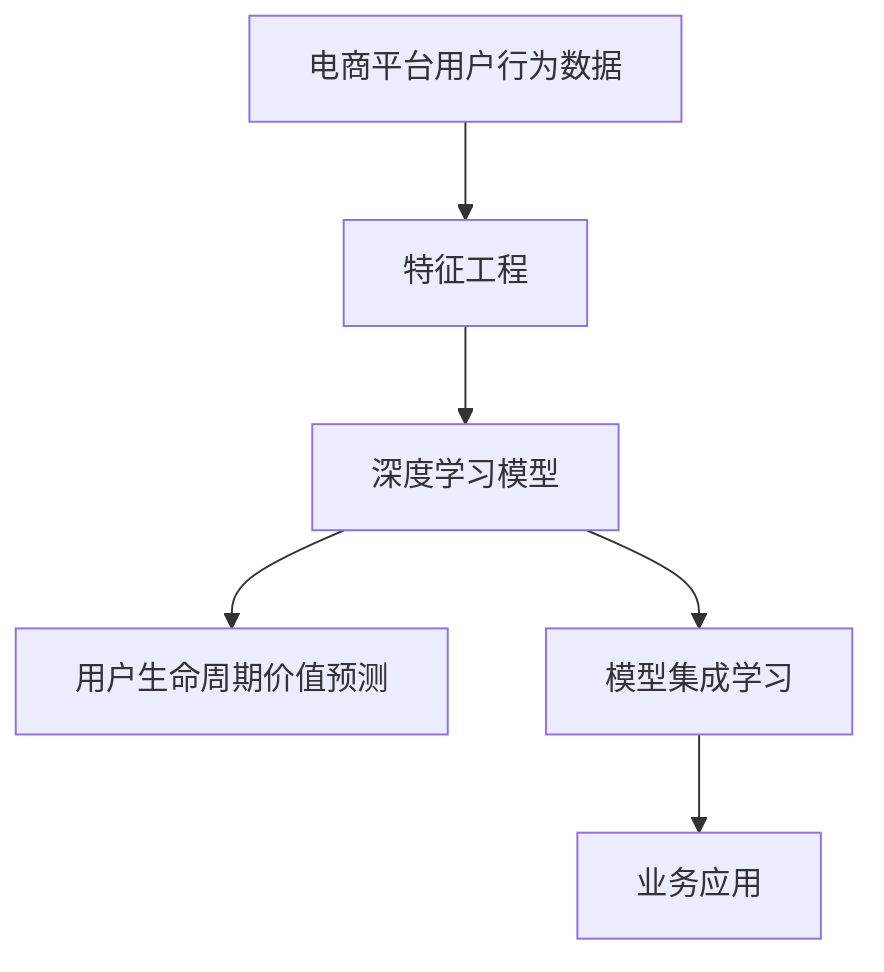

                 

# AI赋能的电商平台用户生命周期价值预测

> 关键词：电商平台,用户行为,深度学习,用户生命周期价值(ULV),预测模型,特征工程,集成学习,业务应用,可解释性,效果评估

## 1. 背景介绍

### 1.1 问题由来
随着电子商务的迅猛发展，电商平台已成为用户消费行为的主要场所之一。用户生命周期价值（User Lifetime Value, ULV），即用户在电商平台生命周期内为商家带来的总收益，是衡量电商平台运营成功与否的重要指标。传统的ULV预测方法多依赖统计模型，如回归分析、时间序列分析等，难以充分利用用户数据中的复杂模式和关联关系。近年来，深度学习在处理大规模、非结构化数据方面显示出卓越性能，逐渐成为电商领域的重要工具。本文聚焦于基于深度学习的大规模电商平台用户生命周期价值预测问题，详细探讨了深度学习算法在电商用户行为分析中的应用。

### 1.2 问题核心关键点
1. **电商平台用户行为分析**：电商平台用户的行为数据众多，包括浏览、点击、购买、评论、搜索、收藏等。这些数据呈现为复杂的多维度非结构化数据，需要通过特征工程进行转换和提取。
2. **深度学习模型选择**：电商平台的业务场景丰富多样，用户行为数据量大，需要选择适合大规模数据处理的深度学习模型，如循环神经网络(RNN)、长短时记忆网络(LSTM)、卷积神经网络(CNN)、注意力机制(Attention)等。
3. **用户生命周期价值预测**：目标是基于用户行为数据预测其未来的价值，需要构建精确的预测模型。
4. **模型评估与优化**：通过交叉验证、A/B测试、实际业务应用等方式，评估模型效果，并根据业务需求进行优化调整。
5. **可解释性与业务落地**：电商企业不仅需要预测ULV，还需了解预测结果背后的原因，将模型结果转化为业务策略，实现智能决策。

## 2. 核心概念与联系

### 2.1 核心概念概述

为更好地理解基于深度学习的电商用户生命周期价值预测方法，本节将介绍几个密切相关的核心概念：

- **电商平台用户行为数据**：指用户在电商平台上留下的浏览、点击、购买、评论等行为数据。这些数据通常以非结构化的形式存在，需要通过预处理转化为可用于模型训练的特征数据。
- **用户生命周期价值(ULV)**：指用户在电商平台上整个生命周期内的消费总价值。ULV预测可以帮助电商平台预测新用户的潜在价值，进行精准营销和优化用户体验。
- **深度学习模型**：基于神经网络结构的机器学习模型，通过多层次的非线性变换，能够学习到数据的复杂模式和关联关系。
- **特征工程**：将原始数据转换为模型可用的特征向量的过程，包括数据清洗、特征选择、数据转换等。
- **模型集成学习**：通过组合多个模型的预测结果，可以提高预测准确度和鲁棒性。
- **业务应用**：将深度学习模型应用于电商平台的实际业务场景，如推荐系统、营销活动优化、库存管理等，提升业务决策的智能性和准确性。

这些核心概念之间的逻辑关系可以通过以下Mermaid流程图来展示：



这个流程图展示了大规模电商平台用户生命周期价值预测的核心概念及其之间的关系：

1. 电商平台用户行为数据经过特征工程，转换为模型可用的特征向量。
2. 特征向量作为深度学习模型的输入，通过模型学习用户行为模式和消费趋势。
3. 深度学习模型输出预测结果，预测用户生命周期价值。
4. 通过模型集成技术，进一步提升预测准确度。
5. 预测结果用于电商平台业务决策，优化营销策略和用户服务。

## 3. 核心算法原理 & 具体操作步骤
### 3.1 算法原理概述

基于深度学习的电商平台用户生命周期价值预测，本质上是一个有监督的回归问题。其核心思想是：构建一个深度学习模型，通过历史用户行为数据训练模型，预测新用户的生命周期价值。

形式化地，假设电商平台用户行为数据为 $X$，对应的用户生命周期价值为 $Y$。目标是最小化预测误差 $E$：

$$
\hat{Y} = f(X;\theta)
$$

$$
E = \min_{\theta} ||\hat{Y} - Y||^2
$$

其中 $\hat{Y}$ 为模型预测的用户生命周期价值，$f(X;\theta)$ 为深度学习模型，$\theta$ 为模型参数。

训练过程中，我们通常使用交叉熵损失函数进行优化，并通过梯度下降等优化算法更新模型参数，最终使得预测结果与真实标签 $Y$ 尽量接近。

### 3.2 算法步骤详解

基于深度学习的电商平台用户生命周期价值预测一般包括以下几个关键步骤：

**Step 1: 数据准备与预处理**
- 收集电商平台的历史用户行为数据，包括浏览记录、点击记录、购买记录、评价记录等。
- 数据清洗：去除噪声数据、缺失值处理。
- 数据转换：将非结构化数据转换为数值化特征，如使用独热编码、词嵌入等方法。
- 特征工程：选择对预测结果有重要影响的特征，并进行归一化、特征选择等处理。

**Step 2: 模型选择与搭建**
- 选择适合的深度学习模型结构，如LSTM、RNN、CNN等，并进行模型搭建。
- 设置模型超参数，如网络层数、节点数、学习率等。
- 编译模型，定义损失函数和优化器。

**Step 3: 模型训练与验证**
- 将预处理后的数据集划分为训练集、验证集和测试集。
- 使用训练集训练模型，使用验证集调整模型超参数，防止过拟合。
- 迭代优化模型参数，直到收敛。
- 在测试集上评估模型性能，输出预测结果。

**Step 4: 模型优化与集成**
- 使用集成学习技术，如Bagging、Boosting、Stacking等，进一步提升模型准确度。
- 通过交叉验证、A/B测试等方式评估模型效果，并根据业务需求进行优化调整。

**Step 5: 业务应用与部署**
- 将模型应用于电商平台的实际业务场景，如个性化推荐、用户行为分析、营销活动优化等。
- 使用业务数据进行实时模型更新，保证预测结果的时效性。
- 部署模型到线上系统，进行实时预测和反馈。

### 3.3 算法优缺点

基于深度学习的电商平台用户生命周期价值预测方法具有以下优点：
1. 能够处理大规模、复杂非结构化数据，学习到复杂的用户行为模式。
2. 准确度高，尤其是在电商领域的大规模数据集上，深度学习模型往往能取得最佳效果。
3. 灵活性好，可以适应各种业务需求，如个性化推荐、库存管理等。
4. 可解释性强，通过特征重要性分析、Attention机制等技术，能够理解模型预测结果背后的原因。

同时，该方法也存在一些局限性：
1. 需要大量标注数据进行训练，初期投入成本较高。
2. 模型复杂，训练和推理资源消耗大，对计算资源要求高。
3. 模型结果往往难以直观解释，需要结合业务逻辑进行解读。
4. 需要持续更新数据和模型，以适应业务环境的变化。

尽管如此，深度学习模型在电商平台用户生命周期价值预测中的应用，已经显示出其在处理复杂用户行为分析方面的强大能力，为电商企业带来了显著的业务价值。

### 3.4 算法应用领域

基于深度学习的电商平台用户生命周期价值预测方法，在电商领域有着广泛的应用：

- 个性化推荐：通过分析用户行为数据，预测用户兴趣和偏好，推荐用户可能感兴趣的商品，提升用户体验和转化率。
- 用户行为分析：分析用户行为数据，挖掘用户购买行为的模式和规律，优化用户路径，提高用户留存率。
- 营销活动优化：基于用户行为数据和生命周期价值预测，制定精准的营销策略，提升营销活动效果。
- 库存管理：预测用户购买行为，优化库存分配，减少库存积压和缺货风险。
- 用户流失预测：预测用户流失风险，进行挽留营销，提高用户生命周期价值。

除了电商领域，该方法还可应用于金融、健康医疗、物流等需要处理大规模非结构化数据的业务场景，提升业务的智能化水平。

## 4. 数学模型和公式 & 详细讲解 & 举例说明

### 4.1 数学模型构建

本节将使用数学语言对基于深度学习的电商平台用户生命周期价值预测过程进行更加严格的刻画。

记电商平台用户行为数据为 $X=[x_1, x_2, ..., x_n]$，对应的用户生命周期价值为 $Y$。深度学习模型的预测结果为 $\hat{Y}=f(X;\theta)$，其中 $\theta$ 为模型参数。

目标是最小化预测误差，即：

$$
\theta^* = \mathop{\arg\min}_{\theta} \frac{1}{N}\sum_{i=1}^N (\hat{y}_i - y_i)^2
$$

其中 $y_i$ 为真实用户生命周期价值，$N$ 为样本数。

在实践中，我们通常使用深度学习框架，如TensorFlow、PyTorch等，进行模型构建和训练。

### 4.2 公式推导过程

以下我们以基于LSTM的电商平台用户生命周期价值预测为例，推导LSTM模型的预测公式。

假设LSTM模型的输入为 $x_i=[x_{i1}, x_{i2}, ..., x_{im}]$，输出为 $\hat{y}_i$。模型的预测公式为：

$$
\hat{y}_i = W_1 \sigma(W_2 LSTM(W_3 x_i) + b_2) + b_1
$$

其中 $W_1, W_2, W_3$ 为权重矩阵，$b_1, b_2$ 为偏置项，$\sigma$ 为激活函数，$LSTM$ 为长短期记忆网络层。

通过上述公式，LSTM模型可以基于用户行为数据，预测用户生命周期价值。

### 4.3 案例分析与讲解

以电商平台的个性化推荐为例，分析LSTM模型的具体应用。

假设电商平台已有用户行为数据 $X$，包含用户的浏览、点击、购买、评价等行为记录。我们将行为数据转化为数值化特征 $x_i$，作为LSTM模型的输入。模型的输出 $\hat{y}_i$ 为用户在未来一段时间内的购买概率。

1. **数据预处理**：将原始行为数据进行清洗、转换和特征工程，提取对预测结果有重要影响的特征，如用户浏览历史、点击行为、评价反馈等。

2. **模型搭建**：选择LSTM模型，并设置网络层数、节点数、激活函数等超参数。

3. **模型训练**：将预处理后的数据集划分为训练集、验证集和测试集，使用训练集训练LSTM模型，使用验证集调整超参数。

4. **模型评估**：在测试集上评估模型性能，输出预测结果，计算预测误差。

5. **业务应用**：将LSTM模型应用于个性化推荐系统，根据用户行为数据预测其购买概率，推荐用户可能感兴趣的商品。

通过上述步骤，电商企业可以构建基于深度学习的用户生命周期价值预测系统，提升推荐系统的精准性和个性化水平，从而提升用户体验和转化率。

## 5. 项目实践：代码实例和详细解释说明

### 5.1 开发环境搭建

在进行深度学习项目开发前，我们需要准备好开发环境。以下是使用Python进行TensorFlow开发的环境配置流程：

1. 安装Anaconda：从官网下载并安装Anaconda，用于创建独立的Python环境。

2. 创建并激活虚拟环境：
```bash
conda create -n tf-env python=3.8 
conda activate tf-env
```

3. 安装TensorFlow：从官网获取对应的安装命令。例如：
```bash
pip install tensorflow tensorflow-estimator tensorflow-hub
```

4. 安装各类工具包：
```bash
pip install numpy pandas scikit-learn matplotlib tqdm jupyter notebook ipython
```

完成上述步骤后，即可在`tf-env`环境中开始深度学习项目开发。

### 5.2 源代码详细实现

下面我们以电商平台用户生命周期价值预测为例，给出使用TensorFlow进行深度学习项目开发的完整代码实现。

首先，定义用户行为数据的预处理函数：

```python
import tensorflow as tf
import numpy as np
from tensorflow.keras.layers import LSTM, Dense, Dropout
from tensorflow.keras.models import Sequential

def preprocess_data(data):
    # 数据清洗、转换和特征工程
    # ...
    return X, y
```

然后，定义深度学习模型：

```python
def build_model(input_dim, hidden_units):
    model = Sequential()
    model.add(LSTM(hidden_units, input_shape=(input_dim, 1), return_sequences=True))
    model.add(Dropout(0.2))
    model.add(LSTM(hidden_units))
    model.add(Dropout(0.2))
    model.add(Dense(1, activation='sigmoid'))
    return model
```

接着，定义训练和评估函数：

```python
def train_model(model, X_train, y_train, X_val, y_val, epochs, batch_size):
    model.compile(loss='binary_crossentropy', optimizer='adam', metrics=['accuracy'])
    model.fit(X_train, y_train, epochs=epochs, batch_size=batch_size, validation_data=(X_val, y_val))

def evaluate_model(model, X_test, y_test):
    loss, accuracy = model.evaluate(X_test, y_test)
    print(f'Test Loss: {loss:.4f}, Test Accuracy: {accuracy:.4f}')
```

最后，启动训练流程并在测试集上评估：

```python
epochs = 10
batch_size = 128

# 数据预处理
X_train, y_train = preprocess_data(train_data)
X_val, y_val = preprocess_data(val_data)
X_test, y_test = preprocess_data(test_data)

# 模型搭建
model = build_model(input_dim, hidden_units)

# 模型训练
train_model(model, X_train, y_train, X_val, y_val, epochs, batch_size)

# 模型评估
evaluate_model(model, X_test, y_test)
```

以上就是使用TensorFlow进行电商平台用户生命周期价值预测的完整代码实现。可以看到，借助TensorFlow的高层次API，我们可以用相对简洁的代码完成深度学习模型的搭建和训练。

### 5.3 代码解读与分析

让我们再详细解读一下关键代码的实现细节：

**preprocess_data函数**：
- 函数负责对原始用户行为数据进行清洗、转换和特征工程，提取对预测结果有重要影响的特征，如用户浏览历史、点击行为、评价反馈等。

**build_model函数**：
- 函数定义了一个包含两个LSTM层和两个Dropout层的深度学习模型。LSTM层用于学习用户行为数据的长期依赖关系，Dropout层用于防止过拟合。

**train_model函数**：
- 函数定义了模型的训练过程，包括损失函数、优化器、训练轮数和批量大小等参数。使用验证集对模型进行交叉验证，防止过拟合。

**evaluate_model函数**：
- 函数定义了模型的评估过程，在测试集上计算预测误差和准确度，并输出结果。

**训练流程**：
- 定义总的训练轮数和批量大小，开始循环迭代
- 每个epoch内，先对训练集进行训练，并在验证集上进行评估
- 重复上述过程直至训练结束，输出最终模型

可以看到，TensorFlow提供了高效便捷的深度学习开发环境，使得模型构建和训练变得简单直观。借助TensorFlow的API，我们能够快速迭代优化模型，提升预测效果。

当然，工业级的系统实现还需考虑更多因素，如模型的保存和部署、超参数的自动搜索、更灵活的特征工程等。但核心的深度学习模型搭建和训练流程基本与此类似。

## 6. 实际应用场景
### 6.1 电商个性化推荐系统

基于深度学习的电商平台用户生命周期价值预测方法，可以应用于个性化推荐系统。推荐系统通过分析用户历史行为数据，预测用户未来行为，推荐用户可能感兴趣的商品。

在技术实现上，可以收集用户浏览、点击、购买、评价等行为数据，构建电商平台用户行为数据集。将数据集划分为训练集、验证集和测试集，在训练集上训练深度学习模型，使用验证集调整模型超参数，最终在测试集上评估模型效果。通过将模型应用于个性化推荐系统，根据用户行为数据预测其购买概率，推荐用户可能感兴趣的商品。

### 6.2 用户行为分析与流失预测

电商平台用户行为分析可以帮助企业了解用户购买行为的模式和规律，优化用户路径，提高用户留存率。流失预测可以通过分析用户行为数据，预测用户流失风险，进行挽留营销，提高用户生命周期价值。

在技术实现上，可以使用用户行为数据构建电商平台用户行为数据集。将数据集划分为训练集、验证集和测试集，在训练集上训练深度学习模型，使用验证集调整模型超参数，最终在测试集上评估模型效果。通过将模型应用于用户行为分析与流失预测，分析用户行为数据，预测用户流失风险，进行挽留营销，提升用户生命周期价值。

### 6.3 营销活动优化

电商平台营销活动优化可以通过分析用户行为数据，制定精准的营销策略，提升营销活动效果。用户生命周期价值预测可以帮助企业预测新用户的潜在价值，进行精准营销和优化用户体验。

在技术实现上，可以使用用户行为数据构建电商平台用户行为数据集。将数据集划分为训练集、验证集和测试集，在训练集上训练深度学习模型，使用验证集调整模型超参数，最终在测试集上评估模型效果。通过将模型应用于营销活动优化，根据用户行为数据预测其生命周期价值，制定精准的营销策略，提升营销活动效果。

### 6.4 未来应用展望

随着深度学习技术的不断进步，基于深度学习的电商平台用户生命周期价值预测方法将有更广泛的应用前景：

1. 自动化流程优化：通过深度学习模型，自动化分析用户行为数据，优化电商平台的业务流程，提升用户体验和运营效率。
2. 跨业务应用：深度学习模型可以跨业务应用，如将电商平台的用户生命周期价值预测模型应用于金融、健康医疗等领域的用户行为分析，提升业务决策的智能性。
3. 实时预测与反馈：深度学习模型可以实时分析用户行为数据，进行预测和反馈，帮助企业及时调整业务策略，提升响应速度和灵活性。
4. 数据驱动决策：通过深度学习模型，将数据转化为知识，辅助企业进行数据驱动的决策，提升决策的科学性和准确性。
5. 多模态数据融合：深度学习模型可以融合多种数据模态，如图像、语音、文本等，提升用户行为分析的全面性和准确性。

未来，深度学习技术将进一步融合到电商平台的各个业务环节，帮助企业实现从数据驱动到智能驱动的转变，为电商平台的数字化转型提供有力支撑。

## 7. 工具和资源推荐
### 7.1 学习资源推荐

为了帮助开发者系统掌握深度学习在电商平台用户生命周期价值预测中的应用，这里推荐一些优质的学习资源：

1. TensorFlow官方文档：TensorFlow的官方文档，提供了详尽的API参考和示例代码，适合初学者和进阶开发者使用。
2. Deep Learning with Python书籍：李沐著，介绍了深度学习在电商、金融、健康医疗等多个领域的应用，适合入门读者。
3. Hands-On Machine Learning with Scikit-Learn、Keras、TensorFlow书籍：Aurélien Géron著，介绍了机器学习在电商、金融、医疗等领域的实践，适合进阶开发者。
4. Kaggle竞赛平台：Kaggle平台上有众多电商领域的机器学习竞赛，可以参与实践，提升实战能力。
5. arXiv论文库：arXiv上有很多深度学习在电商领域的研究论文，可以学习前沿技术。

通过对这些资源的学习实践，相信你一定能够快速掌握深度学习在电商平台用户生命周期价值预测中的应用，并用于解决实际的电商问题。
### 7.2 开发工具推荐

高效的开发离不开优秀的工具支持。以下是几款用于深度学习项目开发的常用工具：

1. TensorFlow：由Google主导开发的开源深度学习框架，支持分布式计算，适合大规模模型训练。
2. PyTorch：由Facebook开发的深度学习框架，支持动态计算图，适合研究和原型开发。
3. Keras：基于TensorFlow和Theano的高层次API，易于上手，适合快速原型开发和模型训练。
4. Jupyter Notebook：交互式的数据分析和代码编写平台，支持Python、R、Scala等多种编程语言。
5. Google Colab：谷歌提供的免费在线Jupyter Notebook环境，支持GPU和TPU算力，适合研究人员进行实验。

合理利用这些工具，可以显著提升深度学习项目开发的效率，加快技术创新的步伐。

### 7.3 相关论文推荐

深度学习在电商平台用户生命周期价值预测中的应用，源于学界的持续研究。以下是几篇奠基性的相关论文，推荐阅读：

1. Customer Churn Prediction Using Deep Learning: A Review of Techniques and a Case Study: 该论文总结了深度学习在客户流失预测中的应用，介绍了多种模型和优化方法。
2. Deep Learning for Customer Churn Prediction: A Comprehensive Review: 该论文对深度学习在客户流失预测中的应用进行了全面回顾，涵盖了多种模型和算法。
3. A Survey on Deep Learning-based Recommender Systems: 该论文对深度学习在推荐系统中的应用进行了综述，介绍了多种模型和应用场景。
4. Predicting the user lifetime value using neural networks: 该论文提出了基于神经网络的客户生命周期价值预测模型，并进行了实验验证。
5. Deep Learning for Predicting User Lifetime Value: 该论文提出了一种基于深度学习的客户生命周期价值预测模型，并通过实验验证了其有效性。

这些论文代表了大规模电商平台用户生命周期价值预测技术的最新进展，通过学习这些前沿成果，可以帮助研究者把握学科前进方向，激发更多的创新灵感。

## 8. 总结：未来发展趋势与挑战

### 8.1 总结

本文对基于深度学习的电商平台用户生命周期价值预测方法进行了全面系统的介绍。首先阐述了电商平台用户生命周期价值预测的背景和意义，明确了深度学习在电商领域的重要应用价值。其次，从原理到实践，详细讲解了深度学习模型在电商用户行为分析中的应用，给出了完整的代码实例和实现细节。同时，本文还广泛探讨了深度学习模型在电商领域的实际应用场景，展示了深度学习技术的广阔前景。

通过本文的系统梳理，可以看到，基于深度学习的电商平台用户生命周期价值预测方法已经在电商领域取得了显著的应用效果，为电商平台带来了显著的业务价值。未来，随着深度学习技术的不断进步，电商企业的业务决策将更加智能、高效和精准，推动电商行业进入全新的发展阶段。

### 8.2 未来发展趋势

展望未来，深度学习在电商平台用户生命周期价值预测中的应用将呈现以下几个发展趋势：

1. 模型复杂度增加：随着深度学习技术的不断进步，模型结构将更加复杂，能够处理更复杂的用户行为数据，预测结果更加精准。
2. 数据驱动决策：深度学习模型将更加深入地挖掘用户行为数据中的模式和规律，辅助企业进行数据驱动的决策，提升决策的科学性和准确性。
3. 实时预测与反馈：深度学习模型将实现实时预测与反馈，帮助企业及时调整业务策略，提升响应速度和灵活性。
4. 跨业务应用：深度学习模型可以跨业务应用，如将电商平台的用户生命周期价值预测模型应用于金融、健康医疗等领域的用户行为分析，提升业务决策的智能性。
5. 多模态数据融合：深度学习模型可以融合多种数据模态，如图像、语音、文本等，提升用户行为分析的全面性和准确性。

这些趋势凸显了深度学习技术在电商平台用户生命周期价值预测中的广泛应用前景，为电商企业带来了更多的业务机遇和挑战。

### 8.3 面临的挑战

尽管深度学习在电商平台用户生命周期价值预测中已取得显著成效，但在迈向更加智能化、普适化应用的过程中，仍面临诸多挑战：

1. 数据隐私与安全：电商平台用户行为数据涉及用户隐私，需要确保数据收集和处理的安全性。
2. 数据质量和多样性：电商平台的业务场景丰富多样，需要收集高质量、多样化的用户行为数据，以提升预测模型的准确度。
3. 模型可解释性与透明度：深度学习模型的决策过程复杂，需要开发可解释性强的模型，提升模型的透明度。
4. 计算资源需求：深度学习模型复杂度高，需要强大的计算资源支持，对硬件设备的要求较高。
5. 实时性要求：电商平台的业务场景对模型实时性要求高，需要设计高效的模型架构和训练流程，保证预测结果的实时性。

尽管如此，深度学习技术在电商平台用户生命周期价值预测中的应用，已经展示了其在处理复杂用户行为分析方面的强大能力，为电商企业带来了显著的业务价值。

### 8.4 研究展望

面对深度学习在电商平台用户生命周期价值预测中面临的挑战，未来的研究需要在以下几个方面寻求新的突破：

1. 数据隐私保护：开发隐私保护技术，如联邦学习、差分隐私等，确保数据收集和处理的安全性。
2. 数据质量和多样性：收集高质量、多样化的用户行为数据，提升预测模型的准确度。
3. 模型可解释性与透明度：开发可解释性强的深度学习模型，提升模型的透明度，增强用户信任。
4. 计算资源优化：优化模型架构和训练流程，提升模型的计算效率，降低硬件需求。
5. 实时性优化：设计高效的模型架构和训练流程，确保预测结果的实时性，提升用户体验。

这些研究方向的探索，必将引领深度学习技术在电商平台用户生命周期价值预测中的进一步突破，为电商企业带来更大的业务机遇和价值。

## 9. 附录：常见问题与解答

**Q1：电商平台用户生命周期价值预测的原理是什么？**

A: 电商平台用户生命周期价值预测的原理是基于深度学习模型，通过分析用户历史行为数据，预测用户未来行为，从而计算出用户在整个生命周期内的消费总价值。具体而言，深度学习模型通过学习用户行为数据中的复杂模式和关联关系，构建用户行为模型，并根据模型进行预测。

**Q2：电商平台用户生命周期价值预测的应用场景有哪些？**

A: 电商平台用户生命周期价值预测的应用场景广泛，包括：
1. 个性化推荐：通过分析用户行为数据，预测用户兴趣和偏好，推荐用户可能感兴趣的商品，提升用户体验和转化率。
2. 用户行为分析：分析用户行为数据，挖掘用户购买行为的模式和规律，优化用户路径，提高用户留存率。
3. 流失预测：预测用户流失风险，进行挽留营销，提高用户生命周期价值。
4. 营销活动优化：通过分析用户行为数据，制定精准的营销策略，提升营销活动效果。

**Q3：电商平台用户生命周期价值预测的挑战有哪些？**

A: 电商平台用户生命周期价值预测面临的挑战包括：
1. 数据隐私与安全：电商平台用户行为数据涉及用户隐私，需要确保数据收集和处理的安全性。
2. 数据质量和多样性：电商平台的业务场景丰富多样，需要收集高质量、多样化的用户行为数据，以提升预测模型的准确度。
3. 模型可解释性与透明度：深度学习模型的决策过程复杂，需要开发可解释性强的模型，提升模型的透明度。
4. 计算资源需求：深度学习模型复杂度高，需要强大的计算资源支持，对硬件设备的要求较高。
5. 实时性要求：电商平台的业务场景对模型实时性要求高，需要设计高效的模型架构和训练流程，保证预测结果的实时性。

**Q4：电商平台用户生命周期价值预测的未来发展趋势是什么？**

A: 电商平台用户生命周期价值预测的未来发展趋势包括：
1. 模型复杂度增加：随着深度学习技术的不断进步，模型结构将更加复杂，能够处理更复杂的用户行为数据，预测结果更加精准。
2. 数据驱动决策：深度学习模型将更加深入地挖掘用户行为数据中的模式和规律，辅助企业进行数据驱动的决策，提升决策的科学性和准确性。
3. 实时预测与反馈：深度学习模型将实现实时预测与反馈，帮助企业及时调整业务策略，提升响应速度和灵活性。
4. 跨业务应用：深度学习模型可以跨业务应用，如将电商平台的用户生命周期价值预测模型应用于金融、健康医疗等领域的用户行为分析，提升业务决策的智能性。
5. 多模态数据融合：深度学习模型可以融合多种数据模态，如图像、语音、文本等，提升用户行为分析的全面性和准确性。

这些趋势凸显了深度学习技术在电商平台用户生命周期价值预测中的广泛应用前景，为电商企业带来了更多的业务机遇和挑战。

**Q5：电商平台用户生命周期价值预测的优化方法有哪些？**

A: 电商平台用户生命周期价值预测的优化方法包括：
1. 数据预处理：对原始用户行为数据进行清洗、转换和特征工程，提取对预测结果有重要影响的特征。
2. 模型选择与搭建：选择合适的深度学习模型结构，并进行模型搭建，设置超参数。
3. 模型训练与验证：将预处理后的数据集划分为训练集、验证集和测试集，使用训练集训练模型，使用验证集调整模型超参数。
4. 模型评估与优化：在测试集上评估模型性能，根据业务需求进行优化调整。
5. 集成学习：使用集成学习技术，如Bagging、Boosting、Stacking等，进一步提升模型准确度。
6. 特征重要性分析：通过特征重要性分析，理解模型预测结果背后的原因，优化模型结构。

这些方法有助于提升深度学习模型在电商平台用户生命周期价值预测中的性能和应用效果。

---

作者：禅与计算机程序设计艺术 / Zen and the Art of Computer Programming

