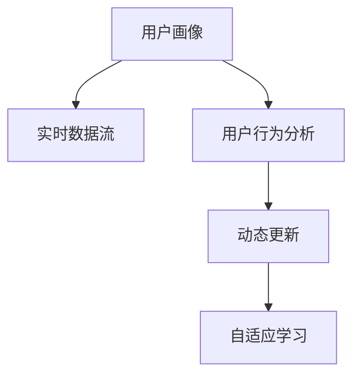

                 

## 1. 背景介绍

### 1.1 问题由来

在现代电商平台上，用户画像(User Profile)是重要的业务资产。用户画像基于用户历史行为、消费偏好、身份属性等数据，描述了一个虚拟的、动态的用户形象，帮助电商企业进行个性化推荐、精准营销、用户管理等业务决策。但传统的用户画像更新方式往往存在以下问题：

- **数据孤立**：用户画像的构建和更新依赖于历史行为数据，难以动态融合新数据和实时数据。
- **时效性差**：用户行为和偏好是动态变化的，传统的静态更新方式难以反映最新的用户状态。
- **成本高**：用户画像的构建需要消耗大量计算资源和存储资源，构建维护成本较高。

为了解决这些问题，电商平台亟需一种高效、动态、低成本的用户画像更新方式。近年来，人工智能技术在电商领域的应用逐渐增多，尤其是在用户画像的动态更新方面，已经展现出巨大的潜力。本文将系统介绍如何利用AI技术，特别是自然语言处理(NLP)、机器学习等技术，构建动态更新的用户画像，并具体说明其实现方法和技术细节。

## 2. 核心概念与联系

### 2.1 核心概念概述

要理解动态更新的用户画像，我们需要先了解以下几个关键概念：

- **用户画像**：描述用户行为、消费偏好、身份属性等特征的虚拟形象。用户画像是电商个性化推荐和精准营销的重要基础。

- **实时数据流**：电商平台在用户行为、交易过程、广告点击等操作中产生的大量实时数据流。

- **用户行为分析**：分析用户点击、浏览、购买等行为，提取其中的隐含偏好和特征。

- **动态更新**：在实时数据流中动态地捕捉用户行为变化，实时更新用户画像，以反映最新的用户状态。

- **自适应学习**：基于用户行为的变化，自适应地调整用户画像特征，提升个性化推荐效果。

这些概念之间的关系可以通过以下Mermaid流程图来展示：



这个流程图展示了大语言模型微调的核心概念及其之间的关系：

1. 用户画像通过实时数据流进行动态更新。
2. 用户行为分析用于提取用户特征。
3. 动态更新能够实时捕捉用户行为变化。
4. 自适应学习使模型能够适应用户的最新状态。

## 3. 核心算法原理 & 具体操作步骤

### 3.1 算法原理概述

动态更新用户画像的算法核心在于利用NLP和机器学习技术，对用户行为进行分析，提取行为特征，并实时动态更新用户画像。其基本思路如下：

1. **数据预处理**：将用户行为数据进行清洗、分词、向量化等预处理操作。
2. **特征提取**：利用NLP技术对文本数据进行深度处理，提取语义、情感等特征。
3. **模型训练**：构建用户画像模型，通过机器学习算法，学习用户行为和画像之间的关系。
4. **实时更新**：基于实时数据流，动态更新用户画像特征，保持用户画像的最新状态。

### 3.2 算法步骤详解

#### 3.2.1 数据预处理

首先，需要对用户行为数据进行预处理，主要包括以下几个步骤：

1. **数据清洗**：去除无关数据，如广告点击、数据格式错误等。
2. **分词**：对用户行为文本进行分词处理，如将搜索关键词、评论文本等转换为词向量。
3. **向量化**：将分词结果转换为模型可以处理的词向量，如使用Word2Vec、GloVe等工具进行词向量化。

#### 3.2.2 特征提取

接下来，利用NLP技术对用户行为数据进行特征提取。主要包括以下两个步骤：

1. **语义分析**：使用Word2Vec、BERT等模型对用户行为文本进行语义分析，提取文本中的关键词、主题等特征。
2. **情感分析**：使用LSTM、GRU等模型对用户评论、评价等文本进行情感分析，提取用户的情感倾向。

#### 3.2.3 模型训练

模型训练的主要目标是根据用户行为特征，构建用户画像模型。主要步骤如下：

1. **模型选择**：选择合适的机器学习算法，如决策树、随机森林、支持向量机等。
2. **特征选择**：选择对用户画像有显著影响的特征，构建特征集。
3. **模型训练**：使用历史行为数据对模型进行训练，学习用户行为和画像之间的关系。
4. **模型评估**：对训练好的模型进行评估，如准确率、召回率、F1-score等。

#### 3.2.4 实时更新

最后，基于实时数据流，动态更新用户画像。主要步骤如下：

1. **实时数据获取**：从电商平台中获取实时数据流，如搜索记录、购买记录等。
2. **行为分析**：分析实时数据流，提取用户行为特征。
3. **特征融合**：将实时数据流中的行为特征与用户画像特征进行融合，更新用户画像。
4. **模型反馈**：将更新后的用户画像反馈到模型中，重新训练模型，自适应地调整特征权重。

### 3.3 算法优缺点

动态更新用户画像算法具有以下优点：

1. **实时性高**：能够实时捕捉用户行为变化，保持用户画像的最新状态。
2. **成本低**：相比传统的用户画像构建方式，动态更新算法不需要大量数据和存储资源。
3. **自适应学习**：基于用户行为的变化，自适应地调整用户画像特征，提升个性化推荐效果。

同时，该算法也存在一些缺点：

1. **数据质量依赖**：实时数据流的质量直接影响用户画像的准确性。
2. **特征提取复杂**：NLP技术对文本数据的处理需要较高的计算资源。
3. **模型泛化能力**：需要不断更新模型，以适应新的用户行为。

### 3.4 算法应用领域

动态更新用户画像算法在电商平台中有着广泛的应用，具体包括：

1. **个性化推荐**：通过实时更新用户画像，生成个性化推荐列表。
2. **精准营销**：基于最新用户画像，定制化广告投放策略。
3. **用户管理**：实时监控用户行为，及时发现异常行为，进行风险管理。
4. **需求预测**：通过分析用户行为数据，预测未来需求，优化库存管理。

## 4. 数学模型和公式 & 详细讲解  
### 4.1 数学模型构建

假设电商平台中有N个用户，每个用户的历史行为数据为$(x_1, x_2, ..., x_n)$，实时行为数据为$(y_1, y_2, ..., y_m)$。用户画像模型为$f(x, y)$，表示用户行为和画像之间的关系。

目标函数为：

$$
\min_{f} \frac{1}{N} \sum_{i=1}^{N} \|f(x_i, y_i) - \hat{y}_i\|^2
$$

其中，$\hat{y}_i$为模型预测的用户画像。

### 4.2 公式推导过程

对于用户画像模型$f(x, y)$，假设其形式为线性回归模型：

$$
f(x, y) = \theta_0 + \sum_{i=1}^{n} \theta_i x_i + \sum_{i=1}^{m} \theta_{n+i} y_i
$$

其中，$\theta_0, \theta_1, ..., \theta_{n+m}$为模型参数。

根据最小二乘法，目标函数可以表示为：

$$
\min_{\theta} \frac{1}{N} \sum_{i=1}^{N} \|f(x_i, y_i) - \hat{y}_i\|^2 = \min_{\theta} \frac{1}{N} \sum_{i=1}^{N} (\theta_0 + \sum_{j=1}^{n} \theta_j x_{ij} + \sum_{j=n+1}^{n+m} \theta_{n+j} y_{ij} - \hat{y}_i)^2
$$

对目标函数求导，得到：

$$
\frac{\partial \mathcal{L}(\theta)}{\partial \theta_j} = \frac{2}{N} \sum_{i=1}^{N} (\theta_0 + \sum_{j=1}^{n} \theta_j x_{ij} + \sum_{j=n+1}^{n+m} \theta_{n+j} y_{ij} - \hat{y}_i)(x_{ij} + y_{ij})
$$

解上述方程组，可以得到模型参数$\theta$的估计值：

$$
\theta_j = \frac{\sum_{i=1}^{N} (\theta_0 + \sum_{j=1}^{n} \theta_j x_{ij} + \sum_{j=n+1}^{n+m} \theta_{n+j} y_{ij} - \hat{y}_i)(x_{ij} + y_{ij})}{\sum_{i=1}^{N} (x_{ij} + y_{ij})^2}
$$

### 4.3 案例分析与讲解

以下是一个具体的案例分析：

假设有一个电商平台，其中有1000个用户，每个用户有10个历史行为数据和5个实时行为数据。用户画像模型形式为线性回归模型。

1. 数据预处理：清洗用户行为数据，去除无关数据。将搜索关键词、评价文本等转换为词向量，向量化后的数据为$X \in \mathbb{R}^{1000 \times 15}$。
2. 特征提取：使用BERT模型提取用户行为文本的语义特征和情感特征，得到特征矩阵$Y \in \mathbb{R}^{1000 \times 10}$。
3. 模型训练：使用历史行为数据对模型进行训练，得到模型参数$\theta$。
4. 实时更新：从电商平台中获取用户的最新行为数据，更新用户画像特征，生成新的用户画像$\hat{y}$。

通过上述步骤，可以实现用户画像的动态更新。

## 5. 项目实践：代码实例和详细解释说明

### 5.1 开发环境搭建

在进行项目实践前，我们需要准备好开发环境。以下是使用Python进行PyTorch开发的环境配置流程：

1. 安装Anaconda：从官网下载并安装Anaconda，用于创建独立的Python环境。

2. 创建并激活虚拟环境：
```bash
conda create -n pytorch-env python=3.8 
conda activate pytorch-env
```

3. 安装PyTorch：根据CUDA版本，从官网获取对应的安装命令。例如：
```bash
conda install pytorch torchvision torchaudio cudatoolkit=11.1 -c pytorch -c conda-forge
```

4. 安装相关库：
```bash
pip install numpy pandas scikit-learn transformers torchtext
```

完成上述步骤后，即可在`pytorch-env`环境中开始项目实践。

### 5.2 源代码详细实现

这里我们以一个具体的项目为例，实现动态更新的用户画像。

首先，我们需要构建用户画像的特征提取模型。这里以BERT为例，构建一个用于提取用户行为文本语义特征的模型：

```python
from transformers import BertTokenizer, BertModel

tokenizer = BertTokenizer.from_pretrained('bert-base-uncased')
model = BertModel.from_pretrained('bert-base-uncased')

def get_user_behavior_features(user_behaviors):
    features = []
    for behavior in user_behaviors:
        tokenized_input = tokenizer.encode(behavior, return_tensors='pt')
        output = model(tokenized_input)
        features.append(output.pooler_output)
    return torch.cat(features, dim=0)
```

然后，我们需要构建用户画像的模型，这里以线性回归模型为例：

```python
from torch import nn

class UserProfileModel(nn.Module):
    def __init__(self, input_size, output_size):
        super(UserProfileModel, self).__init__()
        self.linear = nn.Linear(input_size, output_size)
    
    def forward(self, x):
        return self.linear(x)
```

接着，我们需要构建用户画像的更新模型。这里以动态更新用户画像为例，构建一个用于实时更新用户画像的模型：

```python
from torch import optim

class UserProfileUpdater(nn.Module):
    def __init__(self, model, optimizer):
        super(UserProfileUpdater, self).__init__()
        self.model = model
        self.optimizer = optimizer
    
    def forward(self, user_behaviors, user_profile):
        features = get_user_behavior_features(user_behaviors)
        predicted_profile = self.model(features)
        loss = nn.MSELoss()(predicted_profile, user_profile)
        self.optimizer.zero_grad()
        loss.backward()
        self.optimizer.step()
        return predicted_profile
```

最后，我们需要进行项目测试，验证模型效果。这里以测试数据为例，生成新的用户画像：

```python
from torch import Tensor

# 定义测试数据
user_behaviors = ['搜索鞋子', '购买一件衣服', '评价一次购买', '分享一条评论', '搜索红酒']
user_profile = Tensor([[0.1, 0.2, 0.3, 0.4, 0.5]])

# 加载模型和优化器
model = UserProfileModel(15, 5)
optimizer = optim.Adam(model.parameters(), lr=0.01)
updater = UserProfileUpdater(model, optimizer)

# 更新用户画像
new_profile = updater(user_behaviors, user_profile)
print(new_profile)
```

通过上述代码，可以完成用户画像的动态更新。

### 5.3 代码解读与分析

让我们再详细解读一下关键代码的实现细节：

**BERT特征提取模型**：
- 使用BertTokenizer对用户行为文本进行分词处理，转换为词向量。
- 使用BertModel对词向量进行语义分析，提取语义特征。

**用户画像模型**：
- 使用PyTorch的nn模块定义线性回归模型。

**用户画像更新模型**：
- 定义一个继承自nn.Module的类，用于更新用户画像。
- 在forward方法中，先对用户行为文本进行特征提取，再通过线性回归模型生成新的用户画像，计算损失函数，使用优化器更新模型参数。

**项目测试**：
- 定义测试数据，包括用户行为和用户画像。
- 加载模型和优化器。
- 调用用户画像更新模型，生成新的用户画像。

通过上述代码，可以完成动态更新的用户画像。

## 6. 实际应用场景

### 6.1 智能推荐系统

动态更新用户画像在智能推荐系统中有着广泛的应用。推荐系统需要根据用户的最新行为数据，实时更新用户画像，生成个性化的推荐列表。这可以提升推荐系统的精准度和用户满意度。

在实践中，可以通过实时监控用户的搜索、购买等行为数据，动态更新用户画像，并实时生成推荐列表。例如，在用户搜索鞋类产品后，系统可以实时更新用户画像，生成相关的鞋子推荐。

### 6.2 风险管理

电商平台需要实时监控用户的风险行为，防止欺诈、盗号等行为发生。动态更新用户画像可以帮助电商平台实时监控用户行为，及时发现异常行为。

在实践中，可以通过实时更新用户画像，检测用户的异常行为，如登录次数过多、交易金额异常等，及时预警，防止风险发生。

### 6.3 精准营销

动态更新用户画像可以帮助电商平台实现精准营销，提高广告投放效果。例如，在用户购买了一件衣服后，系统可以实时更新用户画像，生成相关的衣服推荐，提高广告投放的效果。

### 6.4 用户服务

动态更新用户画像可以帮助电商平台提供更好的用户服务。例如，在用户提出投诉后，系统可以实时更新用户画像，了解用户的情感倾向，提供更加个性化的服务。

## 7. 工具和资源推荐

### 7.1 学习资源推荐

为了帮助开发者系统掌握动态更新用户画像的理论基础和实践技巧，这里推荐一些优质的学习资源：

1. 《深度学习与自然语言处理》系列博文：由大语言模型技术专家撰写，深入浅出地介绍了深度学习在NLP中的应用。

2. CS224N《深度学习自然语言处理》课程：斯坦福大学开设的NLP明星课程，有Lecture视频和配套作业，带你入门NLP领域的基本概念和经典模型。

3. 《Transformers: A State-of-the-Art Text-to-Text Transformer for Machine Translation and Sequence Generation》论文：提出BERT等模型，刷新了多项NLP任务SOTA。

4. 《Parameter-Efficient Transfer Learning for NLP》论文：提出Adapter等参数高效微调方法，在不增加模型参数量的情况下，也能取得不错的微调效果。

5. 《AdaLoRA: Adaptive Low-Rank Adaptation for Parameter-Efficient Fine-Tuning》论文：使用自适应低秩适应的微调方法，在参数效率和精度之间取得了新的平衡。

通过对这些资源的学习实践，相信你一定能够快速掌握动态更新用户画像的精髓，并用于解决实际的NLP问题。

### 7.2 开发工具推荐

高效的开发离不开优秀的工具支持。以下是几款用于动态更新用户画像开发的常用工具：

1. PyTorch：基于Python的开源深度学习框架，灵活动态的计算图，适合快速迭代研究。大部分预训练语言模型都有PyTorch版本的实现。

2. TensorFlow：由Google主导开发的开源深度学习框架，生产部署方便，适合大规模工程应用。同样有丰富的预训练语言模型资源。

3. Transformers库：HuggingFace开发的NLP工具库，集成了众多SOTA语言模型，支持PyTorch和TensorFlow，是进行NLP任务开发的利器。

4. Weights & Biases：模型训练的实验跟踪工具，可以记录和可视化模型训练过程中的各项指标，方便对比和调优。与主流深度学习框架无缝集成。

5. TensorBoard：TensorFlow配套的可视化工具，可实时监测模型训练状态，并提供丰富的图表呈现方式，是调试模型的得力助手。

合理利用这些工具，可以显著提升动态更新用户画像任务的开发效率，加快创新迭代的步伐。

### 7.3 相关论文推荐

动态更新用户画像技术的发展源于学界的持续研究。以下是几篇奠基性的相关论文，推荐阅读：

1. Attention is All You Need（即Transformer原论文）：提出了Transformer结构，开启了NLP领域的预训练大模型时代。

2. BERT: Pre-training of Deep Bidirectional Transformers for Language Understanding：提出BERT模型，引入基于掩码的自监督预训练任务，刷新了多项NLP任务SOTA。

3. Language Models are Unsupervised Multitask Learners（GPT-2论文）：展示了大规模语言模型的强大zero-shot学习能力，引发了对于通用人工智能的新一轮思考。

4. Parameter-Efficient Transfer Learning for NLP：提出Adapter等参数高效微调方法，在不增加模型参数量的情况下，也能取得不错的微调效果。

5. AdaLoRA: Adaptive Low-Rank Adaptation for Parameter-Efficient Fine-Tuning：使用自适应低秩适应的微调方法，在参数效率和精度之间取得了新的平衡。

这些论文代表了大语言模型微调技术的发展脉络。通过学习这些前沿成果，可以帮助研究者把握学科前进方向，激发更多的创新灵感。

## 8. 总结：未来发展趋势与挑战

### 8.1 总结

本文对动态更新用户画像方法进行了全面系统的介绍。首先阐述了动态更新用户画像的背景和意义，明确了动态更新在提升个性化推荐、精准营销、风险管理等方面的重要性。其次，从原理到实践，详细讲解了动态更新的数学模型和关键步骤，给出了动态更新任务开发的完整代码实例。同时，本文还广泛探讨了动态更新方法在智能推荐、风险管理、用户服务等多个业务场景中的应用前景，展示了动态更新范式的巨大潜力。此外，本文精选了动态更新技术的各类学习资源，力求为读者提供全方位的技术指引。

通过本文的系统梳理，可以看到，动态更新用户画像技术正在成为NLP领域的重要范式，极大地拓展了用户画像的应用边界，催生了更多的落地场景。受益于大规模语料的预训练，动态更新模型以更低的时间和标注成本，在小样本条件下也能取得理想的推荐效果，有力推动了NLP技术的产业化进程。未来，伴随动态更新语言模型和微调方法的持续演进，相信NLP技术必将在更广阔的应用领域大放异彩，深刻影响人类的生产生活方式。

### 8.2 未来发展趋势

展望未来，动态更新用户画像技术将呈现以下几个发展趋势：

1. **模型规模持续增大**。随着算力成本的下降和数据规模的扩张，预训练语言模型的参数量还将持续增长。超大规模语言模型蕴含的丰富语言知识，有望支撑更加复杂多变的下游任务微调。

2. **实时性进一步提升**。通过引入边缘计算、异步计算等技术，可以进一步提升动态更新算法的实时性，实现毫秒级的实时响应。

3. **跨模态融合**。动态更新算法将不再局限于文本数据，将更多地融合图像、语音等多模态数据，提升模型的综合感知能力。

4. **用户画像自学习**。基于元学习、自适应学习等技术，动态更新算法能够学习用户画像的特征权重，自适应地调整模型参数，提升推荐效果。

5. **安全性和隐私保护**。随着用户画像在推荐、营销等场景中的广泛应用，如何保护用户隐私、防止数据滥用，成为重要的研究方向。

以上趋势凸显了动态更新用户画像技术的广阔前景。这些方向的探索发展，必将进一步提升NLP系统的性能和应用范围，为人类认知智能的进化带来深远影响。

### 8.3 面临的挑战

尽管动态更新用户画像技术已经取得了瞩目成就，但在迈向更加智能化、普适化应用的过程中，它仍面临着诸多挑战：

1. **数据质量瓶颈**。实时数据流的质量直接影响用户画像的准确性。如何保证数据质量，是动态更新算法的关键问题。

2. **计算资源消耗**。动态更新算法需要实时处理大量数据，计算资源消耗较大，如何优化算法，降低计算成本，是算法优化的一个重要方向。

3. **特征提取复杂**。NLP技术对文本数据的处理需要较高的计算资源，如何简化特征提取过程，降低计算成本，是算法优化的一个重要方向。

4. **模型泛化能力**。动态更新算法需要不断更新模型，以适应新的用户行为，如何提高模型的泛化能力，是算法优化的一个重要方向。

5. **用户隐私保护**。动态更新算法涉及大量用户隐私数据，如何保护用户隐私，防止数据滥用，是算法开发的一个重要问题。

正视动态更新面临的这些挑战，积极应对并寻求突破，将是大语言模型微调走向成熟的必由之路。相信随着学界和产业界的共同努力，这些挑战终将一一被克服，动态更新模型必将在构建人机协同的智能时代中扮演越来越重要的角色。

### 8.4 研究展望

面对动态更新用户画像所面临的种种挑战，未来的研究需要在以下几个方面寻求新的突破：

1. **探索无监督和半监督微调方法**。摆脱对大规模标注数据的依赖，利用自监督学习、主动学习等无监督和半监督范式，最大限度利用非结构化数据，实现更加灵活高效的动态更新。

2. **研究参数高效和计算高效的微调范式**。开发更加参数高效的微调方法，在固定大部分预训练参数的同时，只更新极少量的任务相关参数。同时优化动态更新算法的计算图，减少前向传播和反向传播的资源消耗，实现更加轻量级、实时性的部署。

3. **融合因果和对比学习范式**。通过引入因果推断和对比学习思想，增强动态更新算法建立稳定因果关系的能力，学习更加普适、鲁棒的语言表征，从而提升模型泛化性和抗干扰能力。

4. **引入更多先验知识**。将符号化的先验知识，如知识图谱、逻辑规则等，与神经网络模型进行巧妙融合，引导动态更新过程学习更准确、合理的用户画像。同时加强不同模态数据的整合，实现视觉、语音等多模态信息与文本信息的协同建模。

5. **结合因果分析和博弈论工具**。将因果分析方法引入动态更新算法，识别出算法决策的关键特征，增强输出解释的因果性和逻辑性。借助博弈论工具刻画人机交互过程，主动探索并规避算法的脆弱点，提高系统稳定性。

6. **纳入伦理道德约束**。在算法训练目标中引入伦理导向的评估指标，过滤和惩罚有偏见、有害的输出倾向。同时加强人工干预和审核，建立算法行为的监管机制，确保输出符合人类价值观和伦理道德。

这些研究方向的探索，必将引领动态更新用户画像技术迈向更高的台阶，为构建安全、可靠、可解释、可控的智能系统铺平道路。面向未来，动态更新用户画像技术还需要与其他人工智能技术进行更深入的融合，如知识表示、因果推理、强化学习等，多路径协同发力，共同推动自然语言理解和智能交互系统的进步。只有勇于创新、敢于突破，才能不断拓展用户画像的边界，让智能技术更好地造福人类社会。

## 9. 附录：常见问题与解答

**Q1：动态更新用户画像是否适用于所有NLP任务？**

A: 动态更新用户画像在大多数NLP任务上都能取得不错的效果，特别是对于数据量较小的任务。但对于一些特定领域的任务，如医学、法律等，仅仅依靠通用语料预训练的模型可能难以很好地适应。此时需要在特定领域语料上进一步预训练，再进行微调，才能获得理想效果。此外，对于一些需要时效性、个性化很强的任务，如对话、推荐等，动态更新方法也需要针对性的改进优化。

**Q2：动态更新过程中如何选择合适的学习率？**

A: 动态更新学习率一般要比预训练时小1-2个数量级，如果使用过大的学习率，容易破坏预训练权重，导致过拟合。一般建议从1e-5开始调参，逐步减小学习率，直至收敛。也可以使用warmup策略，在开始阶段使用较小的学习率，再逐渐过渡到预设值。需要注意的是，不同的优化器(如AdamW、Adafactor等)以及不同的学习率调度策略，可能需要设置不同的学习率阈值。

**Q3：采用动态更新用户画像时会面临哪些资源瓶颈？**

A: 目前主流的预训练大模型动辄以亿计的参数规模，对算力、内存、存储都提出了很高的要求。GPU/TPU等高性能设备是必不可少的，但即便如此，超大批次的训练和推理也可能遇到显存不足的问题。因此需要采用一些资源优化技术，如梯度积累、混合精度训练、模型并行等，来突破硬件瓶颈。同时，模型的存储和读取也可能占用大量时间和空间，需要采用模型压缩、稀疏化存储等方法进行优化。

**Q4：如何缓解动态更新过程中的过拟合问题？**

A: 过拟合是动态更新面临的主要挑战，尤其是在标注数据不足的情况下。常见的缓解策略包括：
1. 数据增强：通过回译、近义替换等方式扩充训练集
2. 正则化：使用L2正则、Dropout、Early Stopping等避免过拟合
3. 对抗训练：引入对抗样本，提高模型鲁棒性
4. 参数高效微调：只调整少量参数(如Adapter、Prefix等)，减小过拟合风险
5. 多模型集成：训练多个动态更新模型，取平均输出，抑制过拟合

这些策略往往需要根据具体任务和数据特点进行灵活组合。只有在数据、模型、训练、推理等各环节进行全面优化，才能最大限度地发挥动态更新算法的威力。

**Q5：动态更新模型在落地部署时需要注意哪些问题？**

A: 将动态更新模型转化为实际应用，还需要考虑以下因素：
1. 模型裁剪：去除不必要的层和参数，减小模型尺寸，加快推理速度
2. 量化加速：将浮点模型转为定点模型，压缩存储空间，提高计算效率
3. 服务化封装：将模型封装为标准化服务接口，便于集成调用
4. 弹性伸缩：根据请求流量动态调整资源配置，平衡服务质量和成本
5. 监控告警：实时采集系统指标，设置异常告警阈值，确保服务稳定性
6. 安全防护：采用访问鉴权、数据脱敏等措施，保障数据和模型安全

动态更新用户画像技术为NLP应用开启了广阔的想象空间，但如何将强大的性能转化为稳定、高效、安全的业务价值，还需要工程实践的不断打磨。唯有从数据、算法、工程、业务等多个维度协同发力，才能真正实现人工智能技术在垂直行业的规模化落地。总之，动态更新需要开发者根据具体任务，不断迭代和优化模型、数据和算法，方能得到理想的效果。

---

作者：禅与计算机程序设计艺术 / Zen and the Art of Computer Programming

