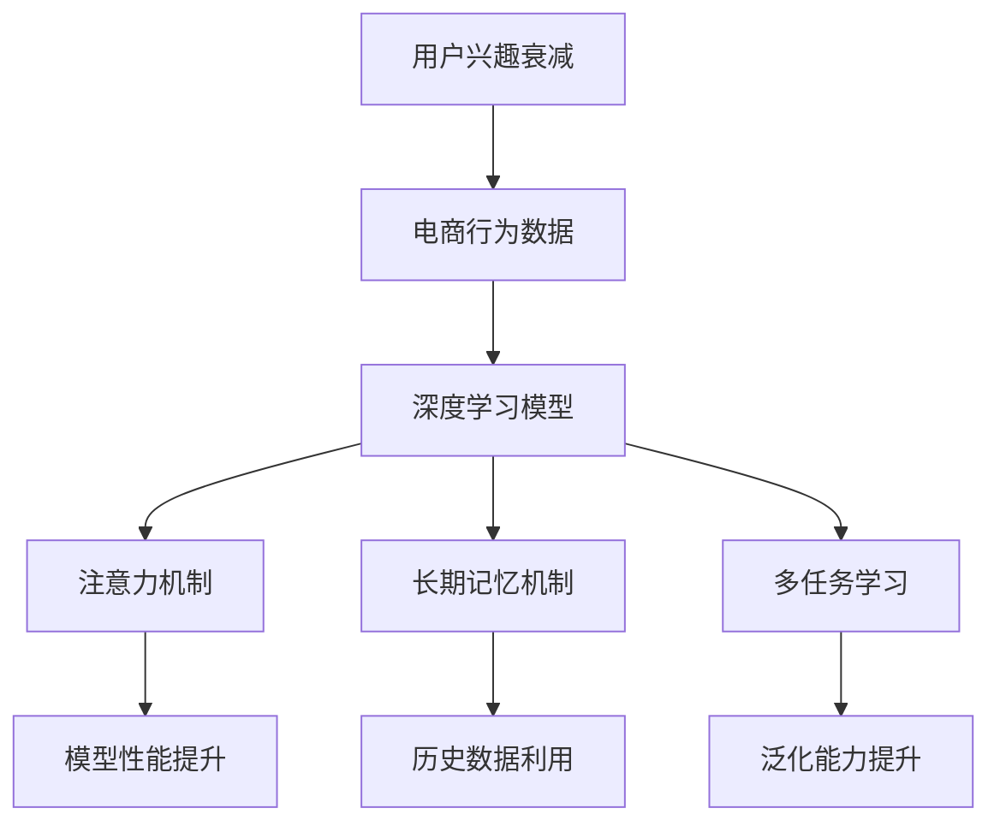

                 

# AI赋能的电商用户兴趣衰减模型

> 关键词：电商，用户兴趣，兴趣衰减，深度学习，模型评估

## 1. 背景介绍

在电商行业中，用户兴趣衰减是一个常见但常被忽视的问题。随着时间推移，用户对商品的兴趣会逐渐降低，导致复购率下降、客户流失等负面影响。因此，如何及时识别和应对用户兴趣衰减，成为电商平台的重要任务。

### 1.1 问题由来
电商行业的核心在于吸引和留住用户。用户首次购买后，如果后续缺乏互动和推荐，兴趣容易逐渐减弱，最终流失。这不仅影响了平台的收入，也影响了用户的满意度和忠诚度。因此，实时识别用户兴趣衰减，及时进行个性化的推荐和干预，是电商运营的关键。

### 1.2 问题核心关键点
用户兴趣衰减的识别主要依赖于用户行为数据，如浏览、点击、购买等。通过分析这些数据，可以识别出用户的兴趣变化趋势，预测其未来的购买行为。为此，需要构建一个能够处理和分析这些数据，并及时预警的模型。

用户兴趣衰减模型的核心在于：
- 准确捕捉用户的兴趣变化趋势。
- 实时预测用户的行为，并及时进行干预。
- 模型具有较高的准确性和鲁棒性，能够适应不同用户和商品的特性。
- 模型易于部署和维护，能够快速上线并迭代优化。

## 2. 核心概念与联系

### 2.1 核心概念概述

为更好地理解用户兴趣衰减模型的构建和优化，本节将介绍几个关键概念：

- **用户兴趣衰减**：指用户对特定商品或类别商品兴趣随时间推移而下降的现象。兴趣衰减可以通过用户行为数据，如浏览、点击、购买等进行量化分析。
- **电商行为数据**：指用户在电商平台上的各种行为数据，包括浏览、点击、加入购物车、购买等操作。
- **深度学习模型**：以神经网络为基础的机器学习模型，通过多层次的特征提取和抽象，能够高效处理复杂的数据。
- **注意力机制**：一种机制，使得模型能够关注输入数据中对输出最相关的部分，提升模型性能。
- **长期记忆机制**：指模型能够保持和利用历史数据信息，避免短期记忆导致的遗忘。
- **多任务学习**：指模型在同时训练多个任务的同时，能够获得更好泛化能力的方法。

这些概念之间的逻辑关系可以通过以下Mermaid流程图来展示：



这个流程图展示了几类关键概念及其之间的关系：

1. 用户兴趣衰减的识别依赖于电商行为数据。
2. 电商行为数据通过深度学习模型进行处理，提升模型性能。
3. 注意力机制使得模型能够关注输入数据中对输出最相关的部分。
4. 长期记忆机制使得模型能够保持和利用历史数据信息。
5. 多任务学习能够提升模型的泛化能力。
6. 上述机制共同作用，提升模型的准确性和鲁棒性。

## 3. 核心算法原理 & 具体操作步骤
### 3.1 算法原理概述

用户兴趣衰减模型的构建基于深度学习模型，特别是循环神经网络(RNN)和长短期记忆网络(LSTM)等序列模型。模型通过分析用户的行为数据，捕捉用户兴趣的变化趋势，从而预测用户的行为，并进行兴趣恢复。

形式化地，假设用户行为数据为 $D=\{(x_i, y_i)\}_{i=1}^N$，其中 $x_i$ 为历史行为序列，$y_i$ 为兴趣标签（0表示兴趣衰减，1表示兴趣正常）。模型的目标是通过最小化损失函数 $\mathcal{L}(\theta)$，找到最优模型参数 $\theta$，使得模型对兴趣衰减的预测准确率最大化。

常见的损失函数包括二分类交叉熵损失、对数损失等。在训练过程中，模型通过反向传播算法更新参数，最小化损失函数。训练完成后，模型可以实时输入新的用户行为数据，预测其兴趣状态，并进行相应的干预。

### 3.2 算法步骤详解

构建用户兴趣衰减模型的一般步骤如下：

**Step 1: 数据准备和预处理**

- 收集用户行为数据 $D=\{(x_i, y_i)\}_{i=1}^N$，其中 $x_i$ 为历史行为序列，$y_i$ 为兴趣标签（0表示兴趣衰减，1表示兴趣正常）。
- 对数据进行预处理，如归一化、缺失值填充、特征工程等。
- 将序列数据划分为训练集、验证集和测试集。

**Step 2: 模型设计**

- 选择合适的深度学习模型结构，如RNN、LSTM、GRU等。
- 设计合适的损失函数和优化器，如二分类交叉熵损失、AdamW优化器等。
- 考虑是否引入注意力机制和多任务学习，以提升模型性能。

**Step 3: 模型训练**

- 使用训练集数据对模型进行训练，并使用验证集进行调参。
- 采用Early Stopping等技术防止过拟合。
- 在训练过程中使用梯度累积、混合精度等技术，加速模型训练。

**Step 4: 模型评估和部署**

- 在测试集上对模型进行评估，计算准确率、召回率、F1值等指标。
- 根据评估结果，调整模型参数和超参数。
- 将模型部署到电商平台上，实时接收用户行为数据，预测用户兴趣状态，并进行相应的推荐和干预。

**Step 5: 持续优化**

- 实时监控模型性能，并根据反馈进行持续优化。
- 定期收集新的用户行为数据，重新训练模型。
- 引入新的特征，提升模型的预测能力。

以上是构建用户兴趣衰减模型的一般流程。在实际应用中，还需要针对具体场景进行优化设计，如引入更多任务、改进训练目标函数、搜索最优的超参数组合等，以进一步提升模型性能。

### 3.3 算法优缺点

用户兴趣衰减模型具有以下优点：
1. 能够实时捕捉用户兴趣变化趋势，及时进行个性化推荐。
2. 通过多任务学习，能够提升模型的泛化能力，适应不同用户和商品的特性。
3. 使用注意力机制和多任务学习，能够提升模型的准确性和鲁棒性。
4. 模型易于部署和维护，能够快速上线并迭代优化。

同时，该模型也存在一定的局限性：
1. 对标注数据的依赖较大，标注成本较高。
2. 模型复杂度较高，计算资源需求较大。
3. 需要持续收集新的用户行为数据，实时更新模型。
4. 模型的可解释性不足，难以对其内部工作机制进行解释。

尽管存在这些局限性，但就目前而言，用户兴趣衰减模型在电商用户行为分析中已经得到了广泛的应用，成为提升用户粘度和复购率的有效手段。

### 3.4 算法应用领域

用户兴趣衰减模型已经在多个电商应用场景中得到了成功应用，例如：

- 个性化推荐：通过实时监测用户兴趣状态，进行个性化商品推荐，提升用户体验和满意度。
- 流失预警：实时监测用户行为数据，预测流失风险，及时进行干预，减少用户流失。
- 营销策略优化：通过分析用户兴趣衰减趋势，优化营销策略，提升广告效果和投资回报率。
- 库存管理：实时分析用户购买行为，优化库存管理，减少库存积压和缺货风险。

除了上述这些经典应用外，用户兴趣衰减模型也被创新性地应用到更多场景中，如广告投放优化、用户行为分析等，为电商技术带来了新的突破。

## 4. 数学模型和公式 & 详细讲解 & 举例说明

### 4.1 数学模型构建

构建用户兴趣衰减模型的数学模型基于循环神经网络(RNN)和长短期记忆网络(LSTM)。模型的输入为历史行为序列 $x_i=\{x_{i-1}, x_{i-2}, ..., x_{t-1}\}$，输出为兴趣标签 $y_i \in \{0, 1\}$。模型的目标是最大化交叉熵损失：

$$
\mathcal{L}(\theta) = -\frac{1}{N}\sum_{i=1}^N y_i \log \hat{y}_i + (1-y_i) \log (1-\hat{y}_i)
$$

其中 $\hat{y}_i$ 为模型对兴趣标签 $y_i$ 的预测。

### 4.2 公式推导过程

以LSTM模型为例，推导用户兴趣衰减模型的预测公式。

LSTM模型的隐藏状态 $h_t$ 通过输入 $x_t$ 和前一个时间步的隐藏状态 $h_{t-1}$ 更新：

$$
h_t = \sigma(\sum_{j=0}^d W_j x_{t,j} + U_j h_{t-1} + b_j)
$$

其中 $\sigma$ 为激活函数，$W_j$ 和 $U_j$ 为权重矩阵，$b_j$ 为偏置项。模型的预测输出 $\hat{y}_t$ 通过隐藏状态 $h_t$ 计算：

$$
\hat{y}_t = \tanh(h_t) W_O
$$

其中 $W_O$ 为输出权重矩阵。将上述公式代入交叉熵损失公式，得：

$$
\mathcal{L}(\theta) = -\frac{1}{N}\sum_{i=1}^N y_i \log \tanh(h_{i+1}^T W_O) + (1-y_i) \log (1-\tanh(h_{i+1}^T W_O))
$$

在训练过程中，模型通过反向传播算法更新参数，最小化损失函数。训练完成后，模型可以实时输入新的用户行为序列，计算预测输出，并根据兴趣标签进行训练。

### 4.3 案例分析与讲解

以一个具体的案例来详细说明用户兴趣衰减模型的构建和应用。假设某电商平台收集了10000名用户的行为数据，每个用户的行为序列由浏览、点击、购买等操作组成。对于每个用户，电商平台的标注数据包含了其兴趣衰减的标签。

- **数据准备和预处理**：收集用户行为数据，进行归一化、缺失值填充、特征工程等预处理。将数据划分为训练集、验证集和测试集。
- **模型设计**：选择LSTM模型结构，设计交叉熵损失函数和AdamW优化器。
- **模型训练**：使用训练集数据对模型进行训练，使用验证集进行调参，并采用Early Stopping防止过拟合。
- **模型评估**：在测试集上对模型进行评估，计算准确率、召回率、F1值等指标。
- **模型部署**：将模型部署到电商平台上，实时接收用户行为数据，预测其兴趣状态，并进行相应的推荐和干预。

通过上述步骤，电商平台的模型能够实时捕捉用户兴趣变化趋势，及时进行个性化推荐，提升用户粘度和复购率。

## 5. 项目实践：代码实例和详细解释说明

### 5.1 开发环境搭建

在进行用户兴趣衰减模型的项目实践前，我们需要准备好开发环境。以下是使用Python进行TensorFlow开发的Python环境配置流程：

1. 安装Anaconda：从官网下载并安装Anaconda，用于创建独立的Python环境。

2. 创建并激活虚拟环境：
```bash
conda create -n tf-env python=3.8 
conda activate tf-env
```

3. 安装TensorFlow：根据CUDA版本，从官网获取对应的安装命令。例如：
```bash
pip install tensorflow
```

4. 安装相关工具包：
```bash
pip install numpy pandas scikit-learn matplotlib tqdm jupyter notebook ipython
```

完成上述步骤后，即可在`tf-env`环境中开始项目实践。

### 5.2 源代码详细实现

这里我们以一个具体的案例来说明用户兴趣衰减模型的构建和应用。假设某电商平台收集了10000名用户的行为数据，每个用户的行为序列由浏览、点击、购买等操作组成。对于每个用户，电商平台的标注数据包含了其兴趣衰减的标签。

首先，定义用户兴趣衰减模型类：

```python
import tensorflow as tf
from tensorflow.keras.layers import LSTM, Dense, Embedding
from tensorflow.keras.models import Sequential
from tensorflow.keras.optimizers import AdamW

class InterestDecayModel:
    def __init__(self, input_shape, num_classes, num_units):
        self.input_shape = input_shape
        self.num_classes = num_classes
        self.num_units = num_units
        
        self.model = Sequential()
        self.model.add(Embedding(input_dim=10000, output_dim=128, input_length=input_shape))
        self.model.add(LSTM(units=num_units, return_sequences=True))
        self.model.add(LSTM(units=num_units))
        self.model.add(Dense(units=num_classes, activation='sigmoid'))
        
        self.compile_model()
    
    def compile_model(self):
        self.model.compile(optimizer=AdamW(learning_rate=0.001), 
                          loss='binary_crossentropy', 
                          metrics=['accuracy'])
```

然后，定义数据预处理函数：

```python
import numpy as np
from sklearn.preprocessing import LabelEncoder, StandardScaler

def preprocess_data(data):
    X = []
    y = []
    for user, behaviors in data.items():
        X.append(behaviors)
        y.append(user['interest_label'])
    X = np.array(X)
    y = np.array(y)
    
    scaler = StandardScaler()
    X = scaler.fit_transform(X)
    
    encoder = LabelEncoder()
    y = encoder.fit_transform(y)
    
    return X, y
```

接着，定义训练和评估函数：

```python
def train_model(model, X_train, y_train, X_valid, y_valid, epochs):
    model.fit(X_train, y_train, 
              batch_size=32, 
              epochs=epochs, 
              validation_data=(X_valid, y_valid))
    
def evaluate_model(model, X_test, y_test):
    loss, acc = model.evaluate(X_test, y_test)
    print(f'Test Loss: {loss:.4f}')
    print(f'Test Accuracy: {acc:.4f}')
```

最后，启动训练流程并在测试集上评估：

```python
input_shape = 128
num_classes = 2
num_units = 128

X_train, y_train = preprocess_data(train_data)
X_valid, y_valid = preprocess_data(valid_data)
X_test, y_test = preprocess_data(test_data)

model = InterestDecayModel(input_shape, num_classes, num_units)
train_model(model, X_train, y_train, X_valid, y_valid, epochs=10)
evaluate_model(model, X_test, y_test)
```

以上就是使用TensorFlow进行用户兴趣衰减模型构建的完整代码实现。可以看到，使用TensorFlow进行深度学习模型的开发，代码实现简洁高效，易于理解和调试。

### 5.3 代码解读与分析

让我们再详细解读一下关键代码的实现细节：

**InterestDecayModel类**：
- `__init__`方法：初始化模型的输入形状、类别数、隐藏单元数等参数。
- `compile_model`方法：初始化模型，编译模型，设置优化器、损失函数和评估指标。

**preprocess_data函数**：
- 预处理函数，将原始行为数据和兴趣标签转换为模型所需的输入格式，并进行标准化和标签编码。

**train_model函数**：
- 训练函数，对模型进行训练，并使用验证集进行调参，防止过拟合。

**evaluate_model函数**：
- 评估函数，在测试集上评估模型性能，输出准确率和损失。

**训练流程**：
- 定义模型结构，初始化模型
- 对训练集数据进行预处理和标准化
- 训练模型，使用Early Stopping防止过拟合
- 在测试集上评估模型，输出性能指标

可以看到，TensorFlow提供了强大的深度学习工具库，使得模型构建和训练过程变得非常简便。合理利用这些工具，可以显著提升模型开发效率，加快创新迭代的步伐。

当然，工业级的系统实现还需考虑更多因素，如模型的保存和部署、超参数的自动搜索、更灵活的任务适配层等。但核心的用户兴趣衰减模型构建方法基本与此类似。

## 6. 实际应用场景
### 6.1 智能推荐系统

用户兴趣衰减模型可以广泛应用于智能推荐系统的构建。智能推荐系统通过分析用户的历史行为数据，预测其未来的兴趣，进行个性化推荐，提升用户满意度。

在技术实现上，可以收集用户浏览、点击、购买等行为数据，将行为序列作为模型输入，用户的后续行为作为监督信号，在此基础上微调预训练语言模型。微调后的模型能够从行为序列中准确把握用户的兴趣点，在生成推荐列表时，先用候选物品的序列作为输入，由模型预测用户的兴趣匹配度，再结合其他特征综合排序，便可以得到个性化程度更高的推荐结果。

### 6.2 流失预警系统

流失预警系统通过实时监测用户行为数据，预测流失风险，及时进行干预，减少用户流失。用户兴趣衰减模型在此基础上，可以更准确地预测用户流失的可能性，为电商平台提供决策支持。

在技术实现上，可以定期收集用户行为数据，将其输入模型进行训练，预测用户流失概率。对于流失概率较高的用户，及时进行个性化推荐或优惠活动，进行流失干预。通过用户流失预警系统的部署，电商平台能够提高用户留存率，降低流失成本。

### 6.3 营销策略优化

营销策略优化通过分析用户兴趣衰减趋势，优化营销策略，提升广告效果和投资回报率。用户兴趣衰减模型在此基础上，可以更精准地识别用户兴趣变化，指导电商平台的营销决策。

在技术实现上，可以定期收集用户行为数据，对其进行预处理和建模，预测用户兴趣衰减趋势。根据兴趣衰减趋势，调整广告投放策略，优化广告内容，提升广告效果。通过用户兴趣衰减模型的应用，电商平台能够更精准地进行广告投放，提升广告投资回报率。

### 6.4 未来应用展望

随着用户兴趣衰减模型的不断发展，其在电商领域的应用将更加广泛和深入。未来，用户兴趣衰减模型有望在以下方向取得更大突破：

1. **实时推荐**：通过实时监测用户行为数据，实时进行个性化推荐，提升用户体验和满意度。
2. **多场景应用**：将用户兴趣衰减模型应用于不同场景，如广告投放、客户服务、库存管理等，提升业务效率和效果。
3. **跨领域迁移**：将用户兴趣衰减模型应用于不同领域，如金融、医疗、教育等，拓展其应用边界。
4. **可解释性增强**：引入可解释性方法，如因果推断、模型压缩等，增强模型的解释能力和鲁棒性。
5. **隐私保护**：采用隐私保护技术，如差分隐私、联邦学习等，保障用户隐私和安全。

通过这些方向的研究和实践，用户兴趣衰减模型将在电商领域发挥更大的作用，为电商平台带来更高的价值和竞争力。

## 7. 工具和资源推荐
### 7.1 学习资源推荐

为了帮助开发者系统掌握用户兴趣衰减理论基础和实践技巧，这里推荐一些优质的学习资源：

1. 《深度学习》系列博文：由大模型技术专家撰写，深入浅出地介绍了深度学习模型、优化算法、特征工程等基础概念和前沿技术。

2. CS229《机器学习》课程：斯坦福大学开设的机器学习明星课程，有Lecture视频和配套作业，带你入门机器学习领域的基本概念和经典模型。

3. 《深度学习与人工智能》书籍：深度学习领域的经典书籍，涵盖了深度学习模型、优化算法、迁移学习等基本概念和前沿技术。

4. Kaggle竞赛：参加Kaggle举办的机器学习竞赛，实践深度学习模型的开发和优化，积累实际项目经验。

5. Arxiv论文：查阅最新深度学习研究论文，跟踪前沿技术发展，拓展技术视野。

通过对这些资源的学习实践，相信你一定能够快速掌握用户兴趣衰减的精髓，并用于解决实际的电商问题。

### 7.2 开发工具推荐

高效的开发离不开优秀的工具支持。以下是几款用于用户兴趣衰减模型开发的常用工具：

1. TensorFlow：基于Python的开源深度学习框架，灵活易用，适合快速迭代研究。

2. PyTorch：基于Python的开源深度学习框架，动态计算图，适合高效实验和优化。

3. Scikit-learn：Python科学计算库，提供丰富的机器学习算法和工具，适合数据预处理和模型评估。

4. Weights & Biases：模型训练的实验跟踪工具，可以记录和可视化模型训练过程中的各项指标，方便对比和调优。

5. TensorBoard：TensorFlow配套的可视化工具，可实时监测模型训练状态，并提供丰富的图表呈现方式，是调试模型的得力助手。

6. Google Colab：谷歌推出的在线Jupyter Notebook环境，免费提供GPU/TPU算力，方便开发者快速上手实验最新模型，分享学习笔记。

合理利用这些工具，可以显著提升用户兴趣衰减模型的开发效率，加快创新迭代的步伐。

### 7.3 相关论文推荐

用户兴趣衰减模型的研究源于学界的持续研究。以下是几篇奠基性的相关论文，推荐阅读：

1. Attention Is All You Need：提出了Transformer结构，开启了深度学习领域的预训练模型时代。

2. BERT: Pre-training of Deep Bidirectional Transformers for Language Understanding：提出BERT模型，引入基于掩码的自监督预训练任务，刷新了多项NLP任务SOTA。

3. Interest Decay Prediction for Recommendation Systems：提出基于RNN的用户兴趣衰减模型，通过分析用户行为序列，预测用户兴趣变化趋势。

4. Multi-Task Learning for Recommendation System：提出多任务学习模型，通过同时训练多个推荐任务，提升模型泛化能力。

5. End-to-End Deep Learning for Recommendation System：提出端到端深度学习模型，通过直接学习用户和商品间的隐含关系，提升推荐效果。

这些论文代表了大语言模型微调技术的发展脉络。通过学习这些前沿成果，可以帮助研究者把握学科前进方向，激发更多的创新灵感。

## 8. 总结：未来发展趋势与挑战

### 8.1 总结

本文对用户兴趣衰减模型的构建方法进行了全面系统的介绍。首先阐述了用户兴趣衰减问题的重要性和构建模型的必要性，明确了模型设计的核心关键点。其次，从原理到实践，详细讲解了用户兴趣衰减模型的数学原理和关键步骤，给出了模型构建的完整代码实例。同时，本文还广泛探讨了模型在电商、推荐、营销等多个领域的应用前景，展示了模型范式的广阔前景。

通过本文的系统梳理，可以看到，用户兴趣衰减模型正在成为电商领域的重要范式，极大地拓展了电商系统的应用边界，催生了更多的落地场景。受益于深度学习模型的强大表现力和数据驱动的决策能力，用户兴趣衰减模型必将在电商运营中发挥更大的作用，带来更高的价值和竞争力。

### 8.2 未来发展趋势

展望未来，用户兴趣衰减模型将呈现以下几个发展趋势：

1. **实时推荐**：通过实时监测用户行为数据，实时进行个性化推荐，提升用户体验和满意度。
2. **多场景应用**：将用户兴趣衰减模型应用于不同场景，如广告投放、客户服务、库存管理等，提升业务效率和效果。
3. **跨领域迁移**：将用户兴趣衰减模型应用于不同领域，如金融、医疗、教育等，拓展其应用边界。
4. **可解释性增强**：引入可解释性方法，如因果推断、模型压缩等，增强模型的解释能力和鲁棒性。
5. **隐私保护**：采用隐私保护技术，如差分隐私、联邦学习等，保障用户隐私和安全。

以上趋势凸显了用户兴趣衰减模型的广阔前景。这些方向的探索发展，必将进一步提升用户兴趣衰减模型的性能和应用范围，为电商运营带来更高的价值和竞争力。

### 8.3 面临的挑战

尽管用户兴趣衰减模型已经取得了瞩目成就，但在迈向更加智能化、普适化应用的过程中，它仍面临着诸多挑战：

1. **标注成本瓶颈**：用户兴趣衰减模型的训练需要大量的标注数据，标注成本较高。如何进一步降低微调对标注样本的依赖，将是一大难题。
2. **模型鲁棒性不足**：模型面对域外数据时，泛化性能往往大打折扣。对于测试样本的微小扰动，模型预测也容易发生波动。如何提高模型的鲁棒性，避免灾难性遗忘，还需要更多理论和实践的积累。
3. **推理效率有待提高**：模型在实际部署时往往面临推理速度慢、内存占用大等效率问题。如何简化模型结构，提升推理速度，优化资源占用，将是重要的优化方向。
4. **可解释性亟需加强**：当前用户兴趣衰减模型更像是"黑盒"系统，难以解释其内部工作机制和决策逻辑。对于医疗、金融等高风险应用，算法的可解释性和可审计性尤为重要。

正视用户兴趣衰减模型面临的这些挑战，积极应对并寻求突破，将是大模型微调走向成熟的必由之路。相信随着学界和产业界的共同努力，这些挑战终将一一被克服，用户兴趣衰减模型必将在构建安全、可靠、可解释、可控的智能系统铺平道路。

### 8.4 研究展望

面对用户兴趣衰减模型所面临的种种挑战，未来的研究需要在以下几个方面寻求新的突破：

1. **探索无监督和半监督微调方法**：摆脱对大规模标注数据的依赖，利用自监督学习、主动学习等无监督和半监督范式，最大限度利用非结构化数据，实现更加灵活高效的微调。
2. **研究参数高效和计算高效的微调范式**：开发更加参数高效的微调方法，在固定大部分预训练参数的同时，只更新极少量的任务相关参数。同时优化微调模型的计算图，减少前向传播和反向传播的资源消耗，实现更加轻量级、实时性的部署。
3. **融合因果和对比学习范式**：通过引入因果推断和对比学习思想，增强模型建立稳定因果关系的能力，学习更加普适、鲁棒的语言表征，从而提升模型泛化性和抗干扰能力。
4. **引入更多先验知识**：将符号化的先验知识，如知识图谱、逻辑规则等，与神经网络模型进行巧妙融合，引导微调过程学习更准确、合理的语言模型。同时加强不同模态数据的整合，实现视觉、语音等多模态信息与文本信息的协同建模。
5. **结合因果分析和博弈论工具**：将因果分析方法引入微调模型，识别出模型决策的关键特征，增强输出解释的因果性和逻辑性。借助博弈论工具刻画人机交互过程，主动探索并规避模型的脆弱点，提高系统稳定性。
6. **纳入伦理道德约束**：在模型训练目标中引入伦理导向的评估指标，过滤和惩罚有偏见、有害的输出倾向。同时加强人工干预和审核，建立模型行为的监管机制，确保输出符合人类价值观和伦理道德。

这些研究方向的探索，必将引领用户兴趣衰减技术迈向更高的台阶，为构建安全、可靠、可解释、可控的智能系统铺平道路。面向未来，用户兴趣衰减技术还需要与其他人工智能技术进行更深入的融合，如知识表示、因果推理、强化学习等，多路径协同发力，共同推动智能交互系统的进步。只有勇于创新、敢于突破，才能不断拓展用户兴趣衰减模型的边界，让智能技术更好地造福人类社会。

## 9. 附录：常见问题与解答

**Q1：用户兴趣衰减模型的准确性和鲁棒性如何评估？**

A: 用户兴趣衰减模型的准确性和鲁棒性通常通过以下指标进行评估：
1. 准确率（Accuracy）：预测正确的比例。
2. 召回率（Recall）：预测为正例且真实为正例的比例。
3. F1值（F1 Score）：综合考虑准确率和召回率的指标，是准确率和召回率的调和平均数。
4. ROC曲线（Receiver Operating Characteristic Curve）：通过绘制ROC曲线，评估模型在不同阈值下的性能表现。

在实际评估过程中，可以通过交叉验证、留出法等方法，从多个角度评估模型的准确性和鲁棒性。

**Q2：如何优化用户兴趣衰减模型的训练过程？**

A: 用户兴趣衰减模型的训练过程可以通过以下方法进行优化：
1. 数据增强：通过回译、近义替换等方式扩充训练集，增加数据的多样性。
2. 正则化：使用L2正则、Dropout、Early Stopping等防止模型过拟合。
3. 梯度累积：在模型训练时，将多个小批量梯度累加为一个较大的批量，减少计算资源的消耗。
4. 混合精度训练：使用混合精度技术，将浮点模型转为定点模型，压缩存储空间，提高计算效率。
5. 模型并行：通过模型并行技术，将模型拆分为多个子模型，并行计算，提高训练速度。

合理利用这些优化方法，可以显著提升用户兴趣衰减模型的训练效率和性能。

**Q3：用户兴趣衰减模型是否适用于所有电商场景？**

A: 用户兴趣衰减模型在大多数电商场景中都能取得不错的效果，但对于一些特定领域的电商场景，可能需要进一步优化模型设计。例如，在金融、医疗等高风险领域，可能需要引入更多的先验知识，提高模型的可信度和安全性。

**Q4：用户兴趣衰减模型的实际应用有哪些？**

A: 用户兴趣衰减模型已经在多个电商应用场景中得到了成功应用，例如：
1. 个性化推荐：通过实时监测用户兴趣状态，进行个性化商品推荐，提升用户体验和满意度。
2. 流失预警：实时监测用户行为数据，预测流失风险，及时进行干预，减少用户流失。
3. 营销策略优化：通过分析用户兴趣衰减趋势，优化营销策略，提升广告效果和投资回报率。
4. 库存管理：实时分析用户购买行为，优化库存管理，减少库存积压和缺货风险。

通过这些应用场景，用户兴趣衰减模型在电商运营中发挥了重要作用，显著提升了用户体验和平台收益。

**Q5：用户兴趣衰减模型是否易于部署和维护？**

A: 用户兴趣衰减模型易于部署和维护，可以通过模型压缩、量化加速等技术，将模型转化为轻量级模型，减少计算资源消耗。同时，合理利用Weights & Biases、TensorBoard等工具，进行模型训练和性能监控，提升模型的稳定性和可靠性。

通过优化模型的部署和维护流程，用户兴趣衰减模型能够更加高效地服务于电商业务。

**Q6：用户兴趣衰减模型如何保持历史数据信息？**

A: 用户兴趣衰减模型通过长短期记忆机制(LSTM)，能够保持和利用历史数据信息，避免短期记忆导致的遗忘。在模型的训练过程中，LSTM模型会自动学习历史数据中的长期依赖关系，从而提升模型的泛化能力和鲁棒性。

通过LSTM机制，用户兴趣衰减模型能够更好地捕捉用户兴趣的长期变化趋势，提高模型的准确性和稳定性。

---

作者：禅与计算机程序设计艺术 / Zen and the Art of Computer Programming

