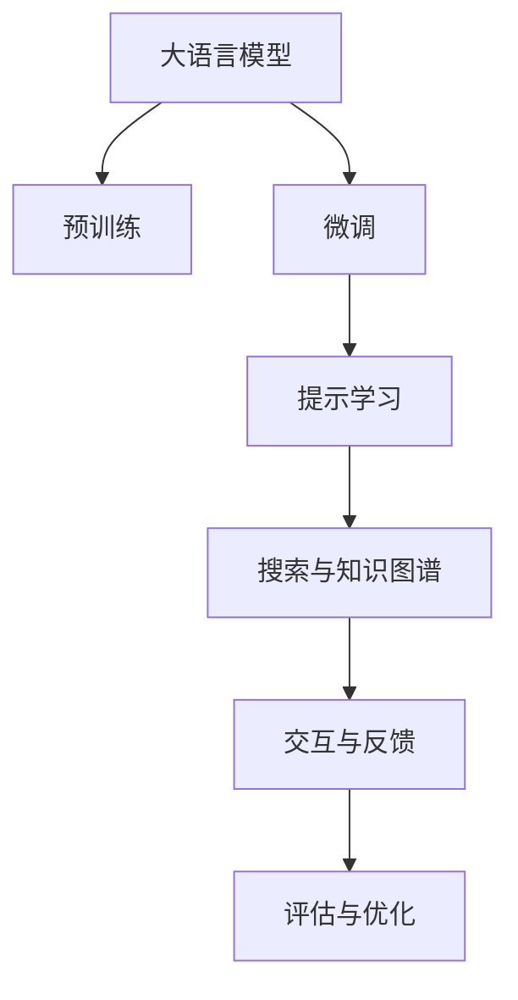

                 

# AI辅助写作：从搜索到创作

在人工智能高速发展的时代，我们迎来了一个全新的技术潮流：AI辅助写作。这项技术正在革新我们对创作和写作的认知，让写作不再是灵感和天赋的单一展示，而成为一种更加高效、精确的表达手段。本文将从核心概念、算法原理、具体操作步骤等多个维度深入探讨AI辅助写作的原理和应用，并分析其在各领域的实际应用前景。

## 1. 背景介绍

### 1.1 问题由来

随着互联网和社交媒体的普及，内容生产的需求空前增加，无论是企业宣传、自媒体创作、学术论文撰写，还是个人笔记、小说创作，高质量内容的创作都需要耗费大量的时间和精力。尽管文本生成技术已有多年研究历史，但由于语言表达的多样性和复杂性，自动生成文本仍难以达到人类写作的深度和精确度。

近年来，深度学习和大规模语言模型的研究取得了突破性进展，特别是基于Transformer架构的预训练模型，如GPT-3、BERT等，显著提升了语言模型的生成能力和理解能力。在此基础上，AI辅助写作技术应运而生，通过结合大语言模型与搜索技术，实现了从搜索结果到创作内容的无缝衔接，大幅提升了内容创作的效率和质量。

### 1.2 问题核心关键点

AI辅助写作的核心在于：如何利用大语言模型和大数据，提升内容创作的准确性和效率，同时保持创作的人文关怀和艺术性。主要包括以下几个方面：

1. **数据收集与处理**：收集大量的文本数据，并进行清洗、标注、分割等预处理操作，为模型训练和应用提供可靠的基础。
2. **模型训练与微调**：基于预训练模型进行特定任务的微调，使其能够适应不同的写作风格和主题，生成高质量的文本内容。
3. **搜索与知识图谱**：结合搜索引擎和知识图谱，为内容创作提供背景信息和灵感来源。
4. **交互与提示**：通过与用户的互动，了解创作需求，生成符合用户期望的内容。
5. **评估与优化**：通过用户反馈和自动评估指标，持续优化模型和算法，提升内容质量。

## 2. 核心概念与联系

### 2.1 核心概念概述

为了更好地理解AI辅助写作的技术原理，本节将介绍几个关键核心概念：

1. **大语言模型(Large Language Model, LLM)**：以Transformer为架构的预训练模型，如GPT、BERT等，通过海量的文本数据预训练，学习到丰富的语言知识和语义理解能力，具备强大的文本生成和文本理解能力。

2. **预训练(Pre-training)**：在大规模无标签文本数据上进行自监督学习，训练语言模型的通用表达能力。预训练是大语言模型的基础步骤。

3. **微调(Fine-tuning)**：基于预训练模型，利用有标签数据进行有监督学习，优化模型在特定任务上的表现。微调是提升模型针对特定应用场景能力的关键步骤。

4. **搜索与知识图谱(Search & Knowledge Graph)**：通过搜索引擎和知识图谱，为内容创作提供背景信息和灵感来源，扩展模型的知识储备。

5. **提示学习(Prompt Learning)**：通过精心设计的输入模板，引导大语言模型进行特定类型的文本生成，如问答、摘要、翻译等。提示学习是实现精准文本生成的重要手段。

6. **交互与反馈(Interaction & Feedback)**：通过用户交互，了解创作需求，生成符合用户期望的内容，并根据用户反馈进行模型优化。

这些核心概念之间的逻辑关系可以通过以下Mermaid流程图来展示：



这个流程图展示了大语言模型的核心概念及其之间的关系：

1. 大语言模型通过预训练获得基础能力。
2. 微调是对预训练模型进行任务特定的优化，使其适应特定应用场景。
3. 提示学习通过输入模板引导模型进行特定类型的文本生成。
4. 搜索与知识图谱为模型提供背景信息和灵感来源。
5. 交互与反馈通过用户输入和反馈调整模型输出，优化模型表现。

这些概念共同构成了AI辅助写作的技术框架，使得大语言模型在内容创作中发挥出巨大潜力。

## 3. 核心算法原理 & 具体操作步骤

### 3.1 算法原理概述

AI辅助写作的核心在于结合大语言模型和搜索技术，实现从搜索结果到创作内容的转换。其基本流程包括：

1. **数据收集与处理**：收集高质量的文本数据，并进行清洗、标注和预处理，为模型训练提供数据基础。
2. **模型训练与微调**：基于预训练模型进行特定任务的微调，使其能够适应不同的写作风格和主题。
3. **搜索与知识图谱**：利用搜索引擎和知识图谱，为内容创作提供背景信息和灵感来源。
4. **提示学习**：通过输入模板引导大语言模型进行特定类型的文本生成。
5. **交互与反馈**：通过用户交互，了解创作需求，生成符合用户期望的内容，并根据用户反馈进行模型优化。

### 3.2 算法步骤详解

#### 3.2.1 数据收集与处理

1. **数据来源**：选择高质量的文本数据来源，如新闻网站、学术文献、专业博客等。
2. **数据清洗**：去除低质量、重复、无关的数据，确保数据集的质量。
3. **数据标注**：对部分数据进行标注，如主题、作者、情感等，用于模型训练和评估。
4. **数据预处理**：将文本数据进行分词、去除停用词、标准化等处理，生成模型所需的输入格式。

#### 3.2.2 模型训练与微调

1. **选择预训练模型**：根据任务需求选择预训练模型，如GPT-3、BERT等。
2. **模型微调**：利用标注数据对预训练模型进行微调，优化模型在特定任务上的性能。
3. **学习率与优化器**：选择合适的学习率和优化器，如AdamW、SGD等，确保模型参数更新稳定。
4. **正则化与防止过拟合**：应用L2正则、Dropout等技术，防止模型过拟合。
5. **评估指标**：选择适合的评估指标，如BLEU、ROUGE等，评估模型性能。

#### 3.2.3 搜索与知识图谱

1. **搜索引擎**：选择合适的搜索引擎，如Google、百度等，获取相关主题的网页。
2. **知识图谱**：利用知识图谱工具，如DBpedia、Freebase等，获取相关主题的背景知识和事实信息。
3. **数据融合**：将搜索结果和知识图谱信息融合，生成高质量的背景信息。

#### 3.2.4 提示学习

1. **提示模板设计**：设计提示模板，引导大语言模型进行特定类型的文本生成，如摘要、问答、翻译等。
2. **生成与评估**：利用提示模板生成文本内容，评估生成内容的准确性和相关性。
3. **迭代优化**：根据用户反馈和评估结果，不断优化提示模板，提升生成质量。

#### 3.2.5 交互与反馈

1. **用户交互**：通过UI/UX设计，与用户进行交互，了解创作需求。
2. **内容生成**：根据用户需求和背景信息，利用大语言模型生成文本内容。
3. **反馈与调整**：根据用户反馈，调整生成内容，确保符合用户期望。

### 3.3 算法优缺点

AI辅助写作的主要优点包括：

1. **高效性**：通过结合大语言模型和搜索技术，大幅提升内容创作效率。
2. **准确性**：利用预训练模型的通用语言理解能力，生成高质量的文本内容。
3. **灵活性**：通过提示学习和用户交互，生成多种类型的文本内容，满足不同应用场景需求。
4. **可扩展性**：通过微调和搜索技术，适应不同领域和任务，具有广泛的应用前景。

同时，该方法也存在以下局限性：

1. **依赖高质量数据**：生成内容的质量高度依赖于数据集的丰富性和质量。
2. **模型复杂度**：大语言模型参数量庞大，训练和推理需要高算力和高内存。
3. **上下文理解不足**：模型可能难以理解复杂的长文本结构，导致生成内容缺乏连贯性。
4. **交互体验复杂**：用户交互设计复杂，需要根据不同应用场景进行定制。

尽管存在这些局限性，但AI辅助写作已经在大规模应用中展现出巨大潜力，特别是在内容创作效率提升和内容质量保证方面表现出色。

### 3.4 算法应用领域

AI辅助写作技术已经在多个领域得到应用，涵盖新闻撰写、学术写作、内容翻译、广告文案创作等多个方面。以下是几个典型应用场景：

1. **新闻写作**：利用AI辅助写作技术，快速生成新闻报道、评论和分析，大幅提升新闻机构的内容生产效率。
2. **学术论文撰写**：通过自动生成文献综述、研究背景等，帮助研究人员快速撰写高质量的学术论文。
3. **内容翻译**：利用大语言模型进行多语言翻译，实现跨语言内容创作和传播。
4. **广告文案创作**：自动生成广告文案和营销推广内容，提升品牌宣传效果。
5. **博客和自媒体内容创作**：通过AI辅助写作技术，快速生成高质量的博客文章、社交媒体内容等。

## 4. 数学模型和公式 & 详细讲解 & 举例说明

### 4.1 数学模型构建

AI辅助写作技术主要涉及文本生成和文本理解两个方面。本文将重点介绍文本生成任务的数学模型构建。

设大语言模型为 $M_{\theta}$，输入为 $x$，输出为 $y$。则文本生成任务的目标是最大化模型在给定输入 $x$ 下生成输出 $y$ 的概率，即：

$$
\arg\max_y p(y|x) = \arg\max_y \frac{p(x, y)}{p(x)} = \arg\max_y \log p(x, y)
$$

其中 $p(x, y)$ 表示在输入 $x$ 和输出 $y$ 联合分布下的概率，$p(x)$ 为已知输入 $x$ 的边际概率，可以通过大语言模型计算。

### 4.2 公式推导过程

根据信息论和统计语言模型理论，文本生成问题的关键在于最大化条件概率 $p(y|x)$。假定模型 $M_{\theta}$ 使用条件概率 $p(y|x)$ 来生成输出 $y$，则模型的概率模型为：

$$
p(y|x) = \frac{e^{\theta^T f(x, y)}}{Z(x)}
$$

其中 $f(x, y)$ 为模型参数化的函数，$Z(x)$ 为归一化因子，确保概率总和为1。

通过最大化似然函数 $L(\theta)$，即最大化 $\log p(x, y)$，可以得到模型的优化目标：

$$
\log p(x, y) = \theta^T f(x, y) - \log Z(x)
$$

模型的参数 $\theta$ 需要通过优化算法求解，常见的优化算法包括梯度下降、Adam等。

### 4.3 案例分析与讲解

以生成新闻报道为例，分析AI辅助写作的数学模型和计算过程。

1. **输入处理**：将新闻主题、相关事件等信息作为输入 $x$，进行预处理和特征提取。
2. **模型计算**：将输入 $x$ 和输出 $y$（即生成的新闻内容）输入到模型 $M_{\theta}$ 中，计算条件概率 $p(y|x)$。
3. **优化求解**：通过优化算法（如AdamW），不断调整模型参数 $\theta$，最大化条件概率 $p(y|x)$，生成高质量的新闻报道。
4. **评估与优化**：使用BLEU、ROUGE等评估指标，评估生成内容的准确性和相关性，并根据评估结果进行模型优化。

## 5. 项目实践：代码实例和详细解释说明

### 5.1 开发环境搭建

为了实现AI辅助写作，首先需要搭建一个包含大语言模型和搜索技术的环境。以下是搭建开发环境的步骤：

1. **安装Python**：从官网下载并安装Python 3.8及以上版本，创建虚拟环境。
2. **安装Pip包管理器**：安装pip，用于安装Python包。
3. **安装深度学习框架**：安装TensorFlow或PyTorch等深度学习框架。
4. **安装大语言模型库**：安装HuggingFace的transformers库，包含多个预训练语言模型。
5. **安装搜索引擎API**：安装Google Search API或百度API等，提供搜索服务。
6. **安装知识图谱库**：安装如Gensim等知识图谱库，提供背景信息和事实信息。

### 5.2 源代码详细实现

以下是一个使用GPT-3进行新闻报道生成的Python代码示例：

```python
import tensorflow as tf
from transformers import TFAutoModelForCausalLM, AutoTokenizer
import googlesearch
import webbrowser

# 选择预训练模型和分词器
model_name = 'gpt3'
tokenizer = AutoTokenizer.from_pretrained(model_name)
model = TFAutoModelForCausalLM.from_pretrained(model_name)

# 输入主题
input_prompt = "全球变暖对自然灾害的影响"

# 构建输入序列
input_ids = tokenizer.encode(input_prompt, return_tensors='tf')

# 生成文本内容
output_ids = model.generate(input_ids, max_length=200, temperature=0.8, num_return_sequences=3)

# 解码文本内容
output_text = tokenizer.decode(output_ids, skip_special_tokens=True)

# 输出结果
print(output_text)

# 搜索相关主题的网页
search_query = "全球变暖对自然灾害的影响"
search_results = googlesearch.search(search_query, num_results=5)
for result in search_results:
    webbrowser.open(result)
```

### 5.3 代码解读与分析

**输入处理**：
- 通过调用Gensim库提供的分词器，将输入主题进行分词处理，转换为模型所需的输入序列。
- 利用TFAutoModelForCausalLM，加载预训练模型，构建计算图。

**生成文本内容**：
- 使用generate方法，利用模型计算生成文本内容。
- 通过参数temperature控制生成文本的随机性，参数num_return_sequences控制生成文本的数量。

**搜索与展示**：
- 通过调用Google Search API，获取相关主题的网页搜索结果。
- 使用webbrowser库，打开搜索结果网页，提供背景信息。

### 5.4 运行结果展示

运行上述代码后，会输出一个基于输入主题生成的新闻报道样本，同时打开搜索结果网页，供用户进一步阅读和参考。

## 6. 实际应用场景

### 6.1 新闻写作

AI辅助写作技术可以显著提升新闻机构的内容生产效率。记者和编辑可以通过AI生成新闻标题、导语和正文的初稿，快速完成新闻内容的创作。同时，AI还可以辅助撰写深度报道和分析，提供数据和背景信息，帮助记者深入挖掘新闻事件。

### 6.2 学术论文撰写

在学术论文写作中，AI辅助写作技术可以自动生成文献综述、研究背景、理论框架等内容，帮助研究人员快速撰写高质量的学术论文。通过自动搜索相关文献，AI还可以为研究人员提供最新的研究进展和前沿技术，提升科研效率。

### 6.3 内容翻译

AI辅助写作技术在多语言翻译方面表现优异，可以自动生成多种语言的文本内容。无论是企业宣传、国际会议，还是跨文化交流，AI翻译都能提供高质量、高效率的翻译服务。

### 6.4 广告文案创作

广告文案创作需要创意和洞察力，但也需要大量的内容生成和创意发散。AI辅助写作技术可以自动生成广告文案和营销推广内容，提升品牌宣传效果，降低内容创作的成本和时间。

## 7. 工具和资源推荐

### 7.1 学习资源推荐

为了深入了解AI辅助写作技术，推荐以下学习资源：

1. **《自然语言处理与深度学习》课程**：斯坦福大学的NLP课程，涵盖文本生成、搜索技术等多个主题，适合初学者和进阶学习者。
2. **《深度学习与自然语言处理》书籍**：详细介绍了深度学习在自然语言处理中的应用，包括文本生成、机器翻译等任务。
3. **《AI写作的艺术》文章系列**：深入探讨AI写作的原理、应用和未来趋势，提供丰富的案例和实践经验。

### 7.2 开发工具推荐

以下是几个常用的AI辅助写作开发工具：

1. **TensorFlow**：谷歌开源的深度学习框架，提供丰富的API和模型库，支持分布式训练和推理。
2. **PyTorch**：Facebook开源的深度学习框架，易于使用，支持动态计算图和GPU加速。
3. **HuggingFace Transformers**：提供多种预训练语言模型和工具，支持微调和迁移学习。
4. **Google Search API**：谷歌提供的API服务，提供高效的数据检索和搜索功能。
5. **Gensim**：提供文本处理和知识图谱构建工具，支持多种文本处理任务。

### 7.3 相关论文推荐

以下是几篇关键论文，详细介绍了AI辅助写作的原理和应用：

1. **"Attention is All You Need"**：Transformer的原始论文，提出自注意力机制，奠定了深度学习模型的新篇章。
2. **"BERT: Pre-training of Deep Bidirectional Transformers for Language Understanding"**：提出BERT模型，引入自监督预训练任务，提升语言模型的理解能力。
3. **"Language Model as a Knowledge Base"**：提出知识图谱辅助语言模型的方法，提升模型的背景知识和语义理解能力。
4. **"Few-shot Learning with Feature Mixture Learning"**：提出特征混合学习，提升模型的零样本和少样本学习能力。
5. **"Zero-Shot Learning through Data-Efficient Text Transfer"**：提出文本迁移学习的方法，实现零样本文本生成。

## 8. 总结：未来发展趋势与挑战

### 8.1 总结

本文对AI辅助写作技术进行了全面系统的介绍，详细探讨了其核心概念、算法原理和具体操作步骤。通过结合大语言模型和搜索技术，AI辅助写作技术实现了从搜索结果到创作内容的无缝衔接，大大提升了内容创作的效率和质量。

### 8.2 未来发展趋势

未来，AI辅助写作技术将呈现以下几个发展趋势：

1. **模型规模持续增大**：随着算力成本的下降和数据规模的扩张，预训练语言模型的参数量还将持续增长。超大规模语言模型蕴含的丰富语言知识，有望支撑更加复杂多变的文本生成任务。
2. **微调和优化技术不断提升**：未来的AI辅助写作系统将通过更多的微调和优化技术，提升内容生成的准确性和多样性，适应不同的应用场景和写作风格。
3. **上下文理解能力增强**：通过引入上下文感知机制，模型将更好地理解长文本结构，生成连贯、有逻辑的文本内容。
4. **多模态融合技术发展**：结合视觉、听觉等多模态信息，提升文本生成内容的丰富性和表现力。
5. **生成内容的可解释性和安全性**：通过生成解释和安全性保障技术，提升内容生成的可解释性和可信度。

### 8.3 面临的挑战

尽管AI辅助写作技术在实际应用中展现出巨大潜力，但在推广和落地过程中仍面临一些挑战：

1. **数据依赖性**：高质量数据集的获取和处理仍是制约AI辅助写作技术发展的瓶颈。如何高效、低成本地构建大规模语料库，是未来的重要研究方向。
2. **算法复杂度**：大语言模型的复杂性较高，训练和推理需要高算力和高内存，如何降低计算成本，提升训练和推理效率，是当前的关键问题。
3. **上下文理解不足**：模型可能难以理解复杂的长文本结构，导致生成内容缺乏连贯性，需要进一步提升上下文理解能力。
4. **交互体验复杂**：用户交互设计复杂，需要根据不同应用场景进行定制，如何简化交互体验，提升用户满意度，是未来的研究重点。
5. **伦理和安全问题**：AI辅助写作技术可能生成虚假信息或有害内容，如何确保内容生成的伦理和安全，是重要的研究方向。

### 8.4 研究展望

面对AI辅助写作技术面临的挑战，未来的研究方向可以从以下几个方面展开：

1. **无监督和半监督学习**：探索无监督和半监督学习范式，降低对高质量标注数据的依赖，提升内容生成的泛化能力。
2. **参数高效微调**：开发更加参数高效的微调方法，在固定大部分预训练参数的同时，只更新极少量的任务相关参数。
3. **多模态融合**：结合视觉、听觉等多模态信息，提升文本生成内容的丰富性和表现力。
4. **可解释性和安全性**：通过生成解释和安全性保障技术，提升内容生成的可解释性和可信度。
5. **伦理和道德研究**：研究AI辅助写作技术的伦理和道德问题，确保内容生成的安全性和公平性。

通过这些研究方向的深入探索，AI辅助写作技术必将在未来实现更大的突破，为内容创作带来新的革命性变革。

## 9. 附录：常见问题与解答

**Q1：AI辅助写作技术是否适用于所有类型的文本创作？**

A: AI辅助写作技术在大多数文本创作场景中都能发挥重要作用，特别是对于大规模、重复性、标准化程度较高的内容创作，如新闻报道、学术论文等。但对于创意写作、个人日志、文学创作等，AI辅助写作技术仍需与人类创作者结合，发挥其辅助作用。

**Q2：AI辅助写作如何确保内容的质量和原创性？**

A: AI辅助写作技术通常结合预训练模型的通用语言理解能力和大规模语料库，生成高质量的文本内容。为了确保内容的质量和原创性，可以采用以下方法：
1. 数据清洗和标注：确保输入数据的质量，避免低质量或重复的内容。
2. 微调和优化：通过不断的微调和优化，提升生成内容的准确性和多样性。
3. 人工审核和修正：结合人工审核，修正生成内容中的错误和不合理之处，提升内容质量。

**Q3：AI辅助写作如何适应不同的写作风格和主题？**

A: AI辅助写作技术可以通过微调机制，适应不同的写作风格和主题。通过在预训练模型上微调特定任务的数据集，可以调整模型的输出风格和内容，确保生成内容符合特定的写作要求。

**Q4：AI辅助写作是否会替代人类创作者？**

A: AI辅助写作技术可以大幅提升内容创作的效率和质量，但无法完全替代人类创作者。人类创作者具有独特的创造力和情感表达能力，AI辅助写作技术更多地作为辅助工具，帮助创作者提供创意灵感和生成草稿，提升创作效率。

**Q5：AI辅助写作是否存在伦理和安全问题？**

A: AI辅助写作技术可能生成虚假信息或有害内容，需要采取以下措施确保伦理和安全：
1. 数据过滤和标注：确保输入数据的伦理性和安全性，避免生成有害内容。
2. 内容审核和监管：通过人工审核和监管，确保生成内容的合法性和安全性。
3. 可解释性和透明度：提供内容生成的解释和透明度，增强用户对生成内容的信任。

通过不断改进和优化，AI辅助写作技术必将在未来实现更加广泛和深远的落地应用，为内容创作带来新的革命性变革。

