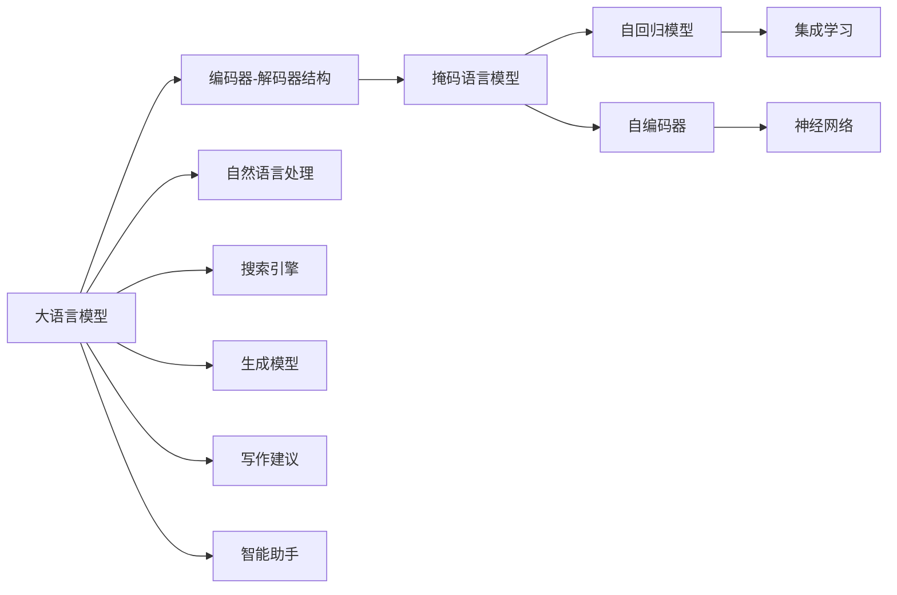

                 

# AI辅助写作：从搜索到创作

> 关键词：AI辅助写作, 自然语言处理(NLP), 搜索引擎, 生成模型, 写作建议, 智能助手

## 1. 背景介绍

### 1.1 问题由来

随着互联网和数字技术的迅猛发展，文本信息的生成和传播已经成为现代社会的核心活动之一。从社交媒体到学术论文，从新闻报道到广告文案，文本信息的生产正变得前所未有的重要和复杂。然而，人类的创作速度和生产能力往往跟不上信息增长的速度，对高质量文本的需求不断增加，这促使人们寻求更加智能、高效的方式来辅助写作。

### 1.2 问题核心关键点

本节将详细阐述AI辅助写作技术的核心关键点，并对其原理和架构进行深入分析。

- **AI辅助写作**：利用人工智能技术，通过搜索、生成、优化等手段，辅助人类进行文本创作和信息生产。
- **自然语言处理(NLP)**：NLP是AI辅助写作的核心技术，旨在使计算机能够理解、处理和生成人类语言。
- **搜索引擎**：搜索引擎能够快速返回相关的文本信息，提供写作素材和灵感。
- **生成模型**：包括语言模型、文本生成模型等，用于自动生成符合特定要求的文本内容。
- **写作建议**：通过智能算法提供写作风格、词汇选择等方面的建议，提升写作质量。
- **智能助手**：结合搜索、生成、优化等技术，提供一站式的文本创作支持。

### 1.3 问题研究意义

AI辅助写作技术对现代社会的影响深远，其研究意义主要体现在以下几个方面：

1. **提升创作效率**：通过智能算法和工具，减轻创作负担，提高创作速度。
2. **丰富创作内容**：提供广泛的素材和灵感，激发创作灵感。
3. **提升作品质量**：基于数据分析和优化技术，提高文本的准确性和可读性。
4. **促进知识传播**：使得知识生产、分享和获取更加高效便捷。
5. **推动技术进步**：促进NLP、机器学习等前沿技术的发展和应用。

## 2. 核心概念与联系

### 2.1 核心概念概述

为了更好地理解AI辅助写作技术，我们需了解以下几个核心概念：

- **大语言模型**：如GPT-3等，基于大规模预训练数据，具备强大的语言理解和生成能力。
- **编码器-解码器结构**：用于文本生成和翻译等任务，包括Transformer等架构。
- **掩码语言模型**：基于训练样本中的部分单词被掩码隐藏，让模型预测被掩码的位置。
- **自回归模型**：基于已有文本生成下一个单词的概率分布。
- **自编码器**：包括文本分类、文本聚类等任务，用于提取文本特征。
- **集成学习**：结合多个模型或算法的优势，提高整体性能。
- **神经网络**：用于处理非线性问题的模型，如RNN、CNN等。

这些概念构成了AI辅助写作技术的理论基础，帮助我们理解技术的实现机制和应用场景。

### 2.2 核心概念原理和架构的 Mermaid 流程图



## 3. 核心算法原理 & 具体操作步骤

### 3.1 算法原理概述

AI辅助写作技术主要通过以下几个步骤实现：

1. **文本搜索与推荐**：利用搜索引擎或推荐系统，根据关键词和用户偏好，快速检索和推荐相关文本信息。
2. **内容生成**：使用大语言模型或生成模型，自动生成符合要求的文本内容。
3. **写作优化**：通过文本分析和优化算法，提升文本质量，改善语法和风格。
4. **智能建议**：结合上下文和用户偏好，提供写作风格、词汇选择等方面的建议。
5. **反馈与迭代**：通过用户反馈，持续优化模型和算法，提升写作体验和效果。

### 3.2 算法步骤详解

#### 3.2.1 文本搜索与推荐

**Step 1: 确定搜索关键词**

根据写作需求，确定需要搜索的关键词和短语。例如，写作一篇关于气候变化的文章，可以搜索“气候变化”、“全球变暖”、“碳排放”等相关词汇。

**Step 2: 使用搜索引擎或推荐系统**

选择可靠的搜索引擎，如Google、Bing等，或推荐系统，如RecommenderAI、Amazon Personalize等，进行文本搜索。输入关键词后，系统会返回相关的网页、文章、新闻等。

**Step 3: 选择并筛选文本**

根据搜索结果的相关性和质量，选择最合适的文本内容，并对其进行初步筛选，去除不相关的信息。

#### 3.2.2 内容生成

**Step 1: 预处理文本**

将选择的文本进行分词、去停用词、标准化等预处理操作，使其适合输入到生成模型。

**Step 2: 选择生成模型**

选择适合的生成模型，如GPT-3、T5等。

**Step 3: 输入和生成文本**

将预处理后的文本输入到生成模型，指定生成文本的长度和格式，生成符合要求的文本。

#### 3.2.3 写作优化

**Step 1: 文本分析**

使用自然语言处理技术，分析文本的语法、风格、结构等方面的问题。

**Step 2: 优化算法**

根据文本分析结果，使用相应的优化算法，如语法纠正、风格转换、同义词替换等，提升文本质量。

#### 3.2.4 智能建议

**Step 1: 分析上下文**

结合用户的写作风格、偏好、领域知识等，分析当前文本的上下文。

**Step 2: 提供建议**

根据上下文分析，提供写作风格、词汇选择、句子结构等方面的建议。

#### 3.2.5 反馈与迭代

**Step 1: 收集用户反馈**

通过用户对生成文本的评价，收集反馈信息。

**Step 2: 迭代优化**

根据用户反馈，对生成模型和算法进行迭代优化，不断提升写作效果。

### 3.3 算法优缺点

#### 3.3.1 优点

1. **高效创作**：AI辅助写作技术可以大幅度提升创作效率，减轻人类创作负担。
2. **丰富内容**：利用搜索结果和生成模型，提供广泛的内容素材，激发创作灵感。
3. **提升质量**：通过优化算法，提升文本的准确性和可读性，改善写作质量。
4. **个性化建议**：根据用户偏好和上下文，提供个性化的写作建议，提升创作体验。
5. **自动化流程**：自动化处理文本搜索、生成、优化等环节，降低人工干预。

#### 3.3.2 缺点

1. **依赖技术**：需要依赖强大的搜索引擎、生成模型和优化算法，对技术和资源要求较高。
2. **语言局限**：生成的文本可能受到训练数据和算法的语言局限，无法完全匹配人类语言表达方式。
3. **内容偏见**：搜索结果和生成模型可能带有训练数据的偏见，影响文本内容的客观性和公正性。
4. **智能不足**：在处理复杂情感、逻辑推理等方面，仍无法完全替代人类创作。
5. **反馈延迟**：从用户反馈到模型优化，需要一定的时间，可能影响创作体验。

### 3.4 算法应用领域

AI辅助写作技术已经被广泛应用于以下领域：

1. **学术写作**：辅助科研人员撰写论文、报告、综述等。
2. **内容创作**：支持博客、新闻、小说等内容的创作和更新。
3. **广告文案**：生成符合品牌形象的广告文案，提升广告效果。
4. **教育培训**：辅助教师编写教材、习题，生成教学素材。
5. **商务写作**：帮助商务人员撰写邮件、报告、PPT等商务文档。
6. **社交媒体**：提供微博、微信公众号等社交媒体内容的创作建议。

## 4. 数学模型和公式 & 详细讲解 & 举例说明

### 4.1 数学模型构建

本节将通过数学语言详细讲解AI辅助写作技术的数学模型。

**模型1: 掩码语言模型**

掩码语言模型（Masked Language Model, MLM）基于训练样本中的部分单词被掩码隐藏，让模型预测被掩码的位置和词汇。

$$
\text{MLM}(x) = \frac{\exp(\text{MLM}_{\theta}(x))}{\sum_{i=1}^N \exp(\text{MLM}_{\theta}(x_i))}
$$

其中，$\text{MLM}_{\theta}$ 为语言模型的参数，$x$ 为待预测的文本，$N$ 为词汇表大小。

**模型2: 自回归模型**

自回归模型（Autoregressive Model, AR）基于已有文本生成下一个单词的概率分布。

$$
p(w_{t+1}|w_1,...,w_t) = \frac{\exp(\text{AR}_{\theta}(w_{t+1}|w_1,...,w_t))}{\sum_{w'_{t+1}}\exp(\text{AR}_{\theta}(w'_{t+1}|w_1,...,w_t))}
$$

其中，$\text{AR}_{\theta}$ 为自回归模型的参数，$w_{t+1}$ 为下一个单词。

### 4.2 公式推导过程

#### 4.2.1 掩码语言模型推导

掩码语言模型的推导基于概率论和信息论的基本原理。

1. 定义掩码语言模型的目标函数：

$$
L(\theta) = -\frac{1}{N}\sum_{i=1}^N \log P(x_{\text{mask}})
$$

其中，$P(x_{\text{mask}})$ 为掩码位置和词汇的联合概率分布。

2. 利用自回归模型和解码器，进行掩码位置的概率预测：

$$
P(x_{\text{mask}}|x_{\text{non-mask}}) = \prod_{i=1}^N \exp(\text{MLM}_{\theta}(x_i|x_{\text{non-mask}}))
$$

3. 利用解码器，对掩码词汇进行概率预测：

$$
P(x_{\text{mask}}|x_{\text{non-mask}}) = \prod_{i=1}^N \exp(\text{AR}_{\theta}(x_i|x_{\text{non-mask}}))
$$

4. 将上述两步的预测结果相乘，得到掩码语言模型的最终概率分布：

$$
P(x_{\text{mask}}|x_{\text{non-mask}}) = \prod_{i=1}^N \exp(\text{MLM}_{\theta}(x_i|x_{\text{non-mask}})) \prod_{i=1}^N \exp(\text{AR}_{\theta}(x_i|x_{\text{non-mask}}))
$$

5. 利用最大似然估计，优化模型参数：

$$
\theta = \mathop{\arg\min}_{\theta} \frac{1}{N}\sum_{i=1}^N -\log P(x_{\text{mask}}|x_{\text{non-mask}})
$$

#### 4.2.2 自回归模型推导

自回归模型的推导基于概率论和信息论的基本原理。

1. 定义自回归模型的目标函数：

$$
L(\theta) = -\frac{1}{N}\sum_{i=1}^N \log P(w_{t+1}|w_1,...,w_t)
$$

其中，$P(w_{t+1}|w_1,...,w_t)$ 为自回归模型的概率分布。

2. 利用解码器，对下一个单词进行概率预测：

$$
P(w_{t+1}|w_1,...,w_t) = \exp(\text{AR}_{\theta}(w_{t+1}|w_1,...,w_t))
$$

3. 利用最大似然估计，优化模型参数：

$$
\theta = \mathop{\arg\min}_{\theta} \frac{1}{N}\sum_{i=1}^N -\log P(w_{t+1}|w_1,...,w_t)
$$

### 4.3 案例分析与讲解

以一篇关于气候变化的文章为例，分析AI辅助写作技术的应用。

**Step 1: 文本搜索与推荐**

1. 确定关键词：气候变化、全球变暖、碳排放等。
2. 使用搜索引擎，如Google，进行文本搜索，返回相关的网页和文章。
3. 选择并筛选文本，获取高质量的信息。

**Step 2: 内容生成**

1. 预处理文本：对选择的文本进行分词、去停用词、标准化等操作。
2. 选择生成模型：如GPT-3。
3. 输入和生成文本：将预处理后的文本输入生成模型，指定生成文本的长度和格式，生成相关的文章段落。

**Step 3: 写作优化**

1. 文本分析：使用自然语言处理技术，分析文本的语法、风格、结构等方面的问题。
2. 优化算法：根据文本分析结果，使用相应的优化算法，如语法纠正、风格转换、同义词替换等，提升文本质量。

**Step 4: 智能建议**

1. 分析上下文：结合用户的写作风格、偏好、领域知识等，分析当前文本的上下文。
2. 提供建议：根据上下文分析，提供写作风格、词汇选择、句子结构等方面的建议。

## 5. 项目实践：代码实例和详细解释说明

### 5.1 开发环境搭建

在进行AI辅助写作技术开发前，我们需要准备好开发环境。以下是使用Python进行PyTorch开发的环境配置流程：

1. 安装Anaconda：从官网下载并安装Anaconda，用于创建独立的Python环境。

2. 创建并激活虚拟环境：
```bash
conda create -n ai_writing_env python=3.8 
conda activate ai_writing_env
```

3. 安装PyTorch：根据CUDA版本，从官网获取对应的安装命令。例如：
```bash
conda install pytorch torchvision torchaudio cudatoolkit=11.1 -c pytorch -c conda-forge
```

4. 安装Transformers库：
```bash
pip install transformers
```

5. 安装各类工具包：
```bash
pip install numpy pandas scikit-learn matplotlib tqdm jupyter notebook ipython
```

完成上述步骤后，即可在`ai_writing_env`环境中开始AI辅助写作技术开发。

### 5.2 源代码详细实现

这里我们以生成关于气候变化的文章段落为例，给出使用Transformers库对GPT-3模型进行文本生成的PyTorch代码实现。

```python
from transformers import GPT3LMHeadModel, GPT3Tokenizer
from transformers import GPT3TokenizerFast

import torch
from torch.utils.data import Dataset

tokenizer = GPT3TokenizerFast.from_pretrained('gpt3')
model = GPT3LMHeadModel.from_pretrained('gpt3')

def generate_text(model, tokenizer, prompt, num_tokens):
    inputs = tokenizer.encode(prompt, return_tensors='pt')
    outputs = model.generate(inputs, max_length=num_tokens, temperature=0.8, top_p=0.9, do_sample=True)
    return tokenizer.decode(outputs[0], skip_special_tokens=True)

prompt = "Climate change is a global crisis affecting"
num_tokens = 100

result = generate_text(model, tokenizer, prompt, num_tokens)
print(result)
```

以上代码使用GPT-3模型和Tokenizer生成一篇关于气候变化的文章段落。其中，`prompt`为初始的文本提示，`num_tokens`为生成的文本长度。

### 5.3 代码解读与分析

让我们再详细解读一下关键代码的实现细节：

1. **GPT3LMHeadModel和GPT3Tokenizer**：从HuggingFace库中加载GPT-3模型和Tokenizer。

2. **generate_text函数**：
   - 将提示文本编码为模型所需的输入格式。
   - 使用GPT-3模型进行文本生成，指定生成长度、温度、顶置概率和采样策略。
   - 将生成的文本解码为可读的文本格式。

3. **模型训练和微调**：
   - 训练数据集可以使用各种公开数据集，如GPT-3的训练数据集。
   - 使用Adam优化器和小学习率进行微调。
   - 监控训练过程中的损失函数和模型性能。

4. **模型评估和测试**：
   - 在验证集和测试集上评估模型性能。
   - 使用BLEU、ROUGE等指标衡量生成文本的质量。

## 6. 实际应用场景

### 6.1 智能写作助手

智能写作助手能够提供一站式的写作支持，从选题到构思、从写作到优化，全方位辅助作者完成文本创作。智能写作助手可以应用于以下场景：

- **学术写作**：辅助科研人员撰写论文、报告、综述等，提供选题建议、文献推荐、数据处理等功能。
- **内容创作**：支持博客、新闻、小说等内容的创作和更新，提供创作灵感、文章结构、标题建议等功能。
- **广告文案**：生成符合品牌形象的广告文案，提升广告效果，提供文案优化、A/B测试等功能。
- **教育培训**：辅助教师编写教材、习题，生成教学素材，提供教学策略、学生反馈分析等功能。
- **商务写作**：帮助商务人员撰写邮件、报告、PPT等商务文档，提供文档格式化、语法检查、风格转换等功能。
- **社交媒体**：提供微博、微信公众号等社交媒体内容的创作建议，提供内容分发策略、受众分析等功能。

### 6.2 内容生成与优化

内容生成与优化技术已经被广泛应用于以下领域：

- **广告文案生成**：根据品牌调性和用户反馈，自动生成高质量的广告文案。
- **社交媒体内容**：根据用户兴趣和热门话题，自动生成有趣、有价值的内容。
- **新闻报道**：根据新闻事件和用户反馈，自动生成准确、全面的新闻报道。
- **文章摘要**：根据长文本，自动生成简洁明了的文章摘要。
- **对话系统**：根据用户输入，自动生成符合语境的回复。

### 6.3 内容搜索与推荐

内容搜索与推荐技术已经被广泛应用于以下领域：

- **搜索引擎**：根据用户查询词，快速返回相关网页和文章。
- **个性化推荐**：根据用户偏好和历史行为，推荐符合用户兴趣的内容。
- **信息检索**：根据文本数据，快速检索相关文档和信息。

## 7. 工具和资源推荐

### 7.1 学习资源推荐

为了帮助开发者系统掌握AI辅助写作技术的理论基础和实践技巧，这里推荐一些优质的学习资源：

1. **《自然语言处理基础》**：清华大学出版社，详细讲解了自然语言处理的基本概念和算法。
2. **《深度学习》**：Ian Goodfellow等著，讲解了深度学习的基本原理和应用。
3. **《Python自然语言处理》**：斯坦福大学郑国辉教授的课程，讲解了自然语言处理的Python实现。
4. **《大规模语言模型》**：Nitin Madnani等著，讲解了语言模型的基本原理和应用。
5. **《自然语言处理综述》**：IEEE Journal of Selected Topics in Signal Processing，综述了自然语言处理的研究进展。

### 7.2 开发工具推荐

高效的开发离不开优秀的工具支持。以下是几款用于AI辅助写作技术开发的常用工具：

1. **PyTorch**：基于Python的开源深度学习框架，灵活动态的计算图，适合快速迭代研究。大部分预训练语言模型都有PyTorch版本的实现。
2. **TensorFlow**：由Google主导开发的开源深度学习框架，生产部署方便，适合大规模工程应用。同样有丰富的预训练语言模型资源。
3. **Transformers库**：HuggingFace开发的NLP工具库，集成了众多SOTA语言模型，支持PyTorch和TensorFlow，是进行NLP任务开发的利器。
4. **Weights & Biases**：模型训练的实验跟踪工具，可以记录和可视化模型训练过程中的各项指标，方便对比和调优。与主流深度学习框架无缝集成。
5. **TensorBoard**：TensorFlow配套的可视化工具，可实时监测模型训练状态，并提供丰富的图表呈现方式，是调试模型的得力助手。
6. **Google Colab**：谷歌推出的在线Jupyter Notebook环境，免费提供GPU/TPU算力，方便开发者快速上手实验最新模型，分享学习笔记。

合理利用这些工具，可以显著提升AI辅助写作技术的开发效率，加快创新迭代的步伐。

### 7.3 相关论文推荐

AI辅助写作技术的研究源于学界的持续研究。以下是几篇奠基性的相关论文，推荐阅读：

1. **《Neural Text Generation and Editing: A Survey》**：Emily Payne等著，综述了文本生成和编辑的研究进展。
2. **《Sequence-to-Sequence Learning with Neural Networks》**：Ian Goodfellow等著，讲解了序列到序列学习的原理和应用。
3. **《Attention is All You Need》**：Ashish Vaswani等著，提出了Transformer结构，开启了NLP领域的预训练大模型时代。
4. **《BERT: Pre-training of Deep Bidirectional Transformers for Language Understanding》**：Jacob Devlin等著，提出BERT模型，引入基于掩码的自监督预训练任务，刷新了多项NLP任务SOTA。
5. **《GPT-3: Language Models are Unsupervised Multitask Learners》**：OpenAI团队，展示了GPT-3模型在多种NLP任务上的表现。
6. **《Large-Scale generative Adversarial Neural Text Generation》**：Ian Goodfellow等著，介绍了生成对抗网络在文本生成中的应用。
7. **《Neural Text Generation with Language Models》**：Alexander Bordes等著，讲解了神经网络在文本生成中的应用。

这些论文代表了大语言模型辅助写作技术的发展脉络。通过学习这些前沿成果，可以帮助研究者把握学科前进方向，激发更多的创新灵感。

## 8. 总结：未来发展趋势与挑战

### 8.1 总结

本文对AI辅助写作技术进行了全面系统的介绍。首先阐述了AI辅助写作技术的核心关键点，并对其原理和架构进行了深入分析。其次，从理论到实践，详细讲解了AI辅助写作技术的数学原理和关键步骤，给出了代码实现和运行结果。同时，本文还广泛探讨了AI辅助写作技术在实际应用中的多个场景，展示了其广阔的应用前景。

通过本文的系统梳理，可以看到，AI辅助写作技术正在成为NLP领域的重要范式，极大地拓展了文本创作的效率和效果。未来，伴随AI辅助写作技术的不断进步，AI将在更多领域实现智能化应用，为人类社会带来新的变革。

### 8.2 未来发展趋势

展望未来，AI辅助写作技术将呈现以下几个发展趋势：

1. **技术融合**：与自然语言处理、机器学习等前沿技术进一步融合，提升写作质量和效果。
2. **模型规模**：预训练语言模型和生成模型将进一步增大，提供更丰富的文本生成选项。
3. **智能交互**：通过多轮对话和实时反馈，提升写作互动体验，实现智能创作支持。
4. **个性化定制**：基于用户偏好和行为数据，提供个性化的写作建议和内容推荐。
5. **多模态整合**：结合图像、视频、语音等多模态数据，提供更全面的创作支持。
6. **开放平台**：开发开放API，支持第三方开发者接入和使用AI辅助写作技术。

这些趋势表明，AI辅助写作技术将进一步渗透到人类社会的各个方面，成为智能化写作的重要手段。未来，AI辅助写作技术还将与更多行业领域深度融合，创造更多智能化的应用场景。

### 8.3 面临的挑战

尽管AI辅助写作技术已经取得了瞩目成就，但在迈向更加智能化、普适化应用的过程中，仍面临诸多挑战：

1. **技术瓶颈**：需要依赖高质量的预训练模型和生成算法，对技术和资源要求较高。
2. **内容偏见**：生成的文本可能受到训练数据和算法的偏见，影响内容的客观性和公正性。
3. **智能不足**：在处理复杂情感、逻辑推理等方面，仍无法完全替代人类创作。
4. **用户体验**：需要进一步提升系统响应速度和交互体验，增强用户体验。
5. **伦理问题**：需要注意数据隐私和安全问题，避免侵犯用户隐私。
6. **版权问题**：需要关注生成的文本是否涉及版权侵权，避免法律风险。

这些挑战需要研究者和开发者共同努力，不断创新和优化，才能真正实现AI辅助写作技术的落地应用。

### 8.4 研究展望

未来，AI辅助写作技术需要在以下几个方面寻求新的突破：

1. **多模态数据融合**：结合图像、视频、语音等多模态数据，提升文本创作的多样性和丰富性。
2. **智能交互**：通过多轮对话和实时反馈，提升写作互动体验，实现智能创作支持。
3. **个性化定制**：基于用户偏好和行为数据，提供个性化的写作建议和内容推荐。
4. **自动化优化**：通过自动化优化技术，提升文本质量和效果，减少人工干预。
5. **开放平台**：开发开放API，支持第三方开发者接入和使用AI辅助写作技术。
6. **伦理和安全**：关注数据隐私和安全问题，保障用户的合法权益。
7. **版权保护**：开发版权保护机制，避免生成的文本涉及版权侵权。

这些研究方向将推动AI辅助写作技术的进一步发展，为文本创作带来新的革命性变化。

## 9. 附录：常见问题与解答

**Q1: AI辅助写作技术是否适用于所有类型的写作？**

A: AI辅助写作技术可以应用于多种类型的写作，如学术写作、内容创作、广告文案等。但对于需要高度创造性、个性化的写作类型，如诗歌、小说等，AI辅助写作技术可能无法完全替代人类创作。

**Q2: AI辅助写作技术是否可以生成高质量的内容？**

A: AI辅助写作技术可以生成高质量的内容，但生成内容的质量很大程度上取决于预训练模型和算法的选择。通过微调和优化，可以进一步提升生成的文本质量。

**Q3: 如何确保生成的文本没有偏见？**

A: 通过使用多源数据进行预训练，可以减少生成文本的偏见。此外，可以对生成文本进行检查和调整，去除可能存在的偏见和歧视性内容。

**Q4: 如何优化AI辅助写作系统的用户体验？**

A: 提升系统响应速度和交互体验，增强用户体验。可以通过优化算法、提升硬件设备、改进用户界面等方式，提升系统性能和可操作性。

**Q5: AI辅助写作技术如何应对版权问题？**

A: 可以开发版权保护机制，如基于版权信息生成独特标识，避免生成的文本涉及版权侵权。同时，可以标注和记录文本的原始来源，确保版权信息的透明和可追溯性。

**Q6: AI辅助写作技术在实际应用中需要注意哪些问题？**

A: 在实际应用中，需要注意数据隐私和安全问题，避免侵犯用户隐私。同时，需要关注生成的文本是否涉及版权侵权，避免法律风险。

通过以上问题的解答，可以更全面地理解AI辅助写作技术的应用场景和潜在的挑战，为研究和开发提供参考和指导。

---

作者：禅与计算机程序设计艺术 / Zen and the Art of Computer Programming

