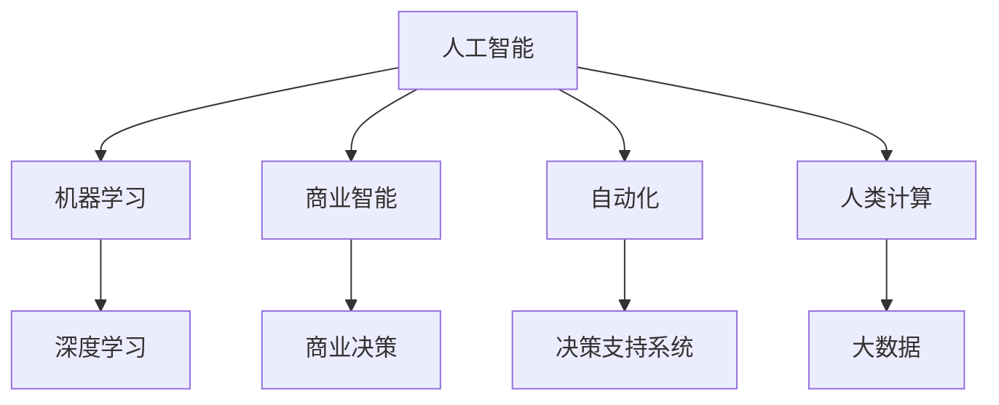

                 

# AI驱动的创新：人类计算在商业中的潜力

> 关键词：人工智能(AI)、人类计算、商业创新、机器学习(ML)、深度学习(DL)、计算技术、商业模式、商业智能(BI)、自动化、决策支持系统(DSS)、大数据

## 1. 背景介绍

### 1.1 问题由来
随着科技的飞速发展，人工智能（AI）已成为推动各行各业创新的关键力量。在商业领域，AI驱动的创新正在重塑传统商业模式，推动企业数字化转型。然而，人类计算作为一种独特的计算形式，其潜力尚未完全被挖掘。

### 1.2 问题核心关键点
人类计算是指利用人类的智能和经验进行计算和推理的一种计算形式，与传统机器计算截然不同。其核心在于结合人工智能与人类智慧，以提升计算效率和决策质量。

在商业应用中，人类计算可以用于以下几个方面：
- **业务流程优化**：利用AI和人类智慧对业务流程进行优化，提高效率和准确性。
- **决策支持系统**：结合AI和人类经验，提供更全面、准确的决策支持。
- **客户体验提升**：通过AI与人类智慧的结合，提升客户服务质量，增强客户体验。
- **创新产品设计**：利用人类创意与AI技术的结合，设计和开发更符合市场需求的产品。

### 1.3 问题研究意义
研究人类计算在商业中的潜力，有助于探索AI技术在现实世界中的落地应用，推动AI技术的商业化进程。同时，通过结合人类智慧与AI技术，可以弥补AI在理解复杂场景和情感方面的不足，提升商业决策的全面性和可靠性。

## 2. 核心概念与联系

### 2.1 核心概念概述

为了更好地理解人类计算在商业中的应用，本节将介绍几个关键概念及其联系：

- **人工智能(AI)**：指利用机器学习(ML)、深度学习(DL)等技术模拟人类智能的能力，用于自动化和优化各种任务。
- **机器学习(ML)**：通过数据训练模型，使其能够从输入数据中自动学习规律并进行预测或决策。
- **深度学习(DL)**：一种特殊的机器学习算法，通过多层神经网络模拟人类大脑的工作方式，用于复杂数据和任务的处理。
- **人类计算**：指利用人类的智能和经验进行计算和推理，与传统机器计算不同。
- **商业智能(BI)**：利用数据分析和可视化技术，为商业决策提供支持。
- **自动化(Automation)**：指利用技术手段自动完成某些任务，减少人工干预。
- **决策支持系统(DSS)**：结合人工智能和人类经验，辅助决策者做出更合理的决策。
- **大数据(Big Data)**：指海量的数据集，通过数据分析和处理，可以发现新的知识和洞察。

这些概念之间的逻辑关系可以通过以下Mermaid流程图来展示：



这个流程图展示出不同概念之间的关系：

1. 人工智能包括机器学习和深度学习，通过数据训练模型，模拟人类智能。
2. 商业智能利用数据分析，为商业决策提供支持。
3. 自动化利用技术手段，自动完成某些任务。
4. 决策支持系统结合人工智能和人类经验，辅助决策。
5. 人类计算结合人工智能和人类智慧，提升计算效率和决策质量。
6. 大数据提供海量数据，通过分析发现新的知识和洞察。

这些概念共同构成了AI技术在商业领域的应用框架，为人类计算在商业中的应用提供了理论基础。

## 3. 核心算法原理 & 具体操作步骤
### 3.1 算法原理概述

人类计算在商业中的应用，主要是通过将AI技术与人类智慧结合，利用人类的智能和经验来提升计算效率和决策质量。其核心思想是：

1. **数据收集与处理**：收集业务相关数据，并对数据进行预处理和清洗，确保数据的准确性和完整性。
2. **模型训练与优化**：利用机器学习算法，对业务数据进行训练，优化模型，提高其预测和决策能力。
3. **知识整合与利用**：将人类的智慧和经验整合到AI模型中，增强模型的理解力和推理能力。
4. **系统部署与集成**：将训练好的模型集成到商业系统中，提供决策支持和业务流程优化。

### 3.2 算法步骤详解

以下是人类计算在商业中的具体步骤：

**Step 1: 数据收集与预处理**
- 收集与业务相关的数据，如销售数据、客户反馈、市场分析等。
- 对数据进行清洗、去重、标准化等预处理，确保数据质量。

**Step 2: 模型训练与优化**
- 选择合适的机器学习算法，如决策树、随机森林、神经网络等，对业务数据进行训练。
- 利用交叉验证等技术，优化模型参数，提高模型的泛化能力。

**Step 3: 知识整合与利用**
- 结合人类的经验与智慧，对模型进行调整和优化。例如，对模型输出进行人工审核，补充缺失的业务逻辑。
- 利用专家系统、决策树等工具，将人类的知识和经验整合到模型中。

**Step 4: 系统部署与集成**
- 将训练好的模型集成到商业系统中，如CRM系统、ERP系统、BI系统等。
- 利用API接口等技术手段，将模型与业务流程进行无缝集成，提供实时的决策支持。

**Step 5: 持续优化与改进**
- 定期收集新数据，对模型进行重新训练和优化。
- 结合业务反馈，对模型进行调整，提高模型的适应性和准确性。

### 3.3 算法优缺点

人类计算在商业中的应用，具有以下优点：
- **高效性**：结合人工智能和人类智慧，提高计算效率和决策质量。
- **全面性**：结合人类经验与AI技术，提供更全面、准确的决策支持。
- **灵活性**：可以灵活应对不同的业务场景和需求。

同时，也存在一些局限性：
- **依赖人类智慧**：对人类经验和智慧的依赖较大，难以完全替代人工。
- **数据质量要求高**：对数据质量要求较高，数据预处理和清洗工作量大。
- **技术门槛较高**：需要结合AI和人类智慧，对技术要求较高。

### 3.4 算法应用领域

人类计算在商业中的应用领域非常广泛，包括但不限于以下几个方面：

- **客户关系管理(CRM)**：通过结合AI和人类智慧，优化客户服务流程，提升客户满意度。
- **供应链管理**：利用AI和人类智慧，优化供应链规划和物流管理，提高供应链效率。
- **营销自动化**：结合AI和人类智慧，自动化生成营销策略，提升营销效果。
- **产品设计**：利用AI和人类创意，设计和开发符合市场需求的产品，提升产品竞争力。
- **风险管理**：利用AI和人类经验，评估和管理企业风险，降低风险损失。
- **人力资源管理**：利用AI和人类智慧，优化人力资源管理流程，提升人力资源效率。

## 4. 数学模型和公式 & 详细讲解 & 举例说明

### 4.1 数学模型构建

在商业应用中，人类计算通常利用机器学习算法对业务数据进行训练，得到预测模型。以下是一个简单的线性回归模型的数学模型构建过程：

设训练数据集为 $(x_i,y_i)$，其中 $x_i$ 为输入特征，$y_i$ 为输出标签。假设模型的参数为 $\theta = [\theta_0, \theta_1, ..., \theta_n]$，线性回归模型的目标是最小化预测误差 $e_i$：

$$
e_i = y_i - \theta_0 - \theta_1 x_i - ... - \theta_n x_i^n
$$

则最小化预测误差的目标函数为：

$$
J(\theta) = \frac{1}{2} \sum_{i=1}^N e_i^2
$$

### 4.2 公式推导过程

以线性回归为例，利用梯度下降法最小化目标函数 $J(\theta)$ 的公式推导如下：

$$
\frac{\partial J(\theta)}{\partial \theta_j} = \sum_{i=1}^N (y_i - \hat{y_i})x_i^j
$$

其中 $\hat{y_i} = \theta_0 + \theta_1 x_i + ... + \theta_n x_i^n$ 为模型的预测输出。

利用梯度下降法，更新模型参数的公式为：

$$
\theta_j = \theta_j - \alpha \frac{\partial J(\theta)}{\partial \theta_j}
$$

其中 $\alpha$ 为学习率，控制每次迭代的步长。

### 4.3 案例分析与讲解

假设某电商平台的销售数据如下：

| 月份 | 销售额(万元) |
|------|--------------|
| 1    | 100          |
| 2    | 110          |
| 3    | 120          |
| 4    | 130          |
| 5    | 140          |
| 6    | 150          |

利用线性回归模型对销售额进行预测，步骤如下：

1. 收集历史销售数据，构建训练集。
2. 对数据进行预处理，去除异常值，进行归一化处理。
3. 构建线性回归模型，选择适当的特征（例如月份），并利用梯度下降法训练模型。
4. 利用训练好的模型对未来月份的销售额进行预测。

通过以上步骤，可以构建一个简单的销售预测模型，为电商平台的业务决策提供支持。

## 5. 项目实践：代码实例和详细解释说明
### 5.1 开发环境搭建

在进行人类计算的商业应用实践前，我们需要准备好开发环境。以下是使用Python进行Scikit-learn开发的环境配置流程：

1. 安装Anaconda：从官网下载并安装Anaconda，用于创建独立的Python环境。

2. 创建并激活虚拟环境：
```bash
conda create -n sklearn-env python=3.8 
conda activate sklearn-env
```

3. 安装Scikit-learn：
```bash
pip install scikit-learn
```

4. 安装其他必要的工具包：
```bash
pip install numpy pandas matplotlib seaborn
```

完成上述步骤后，即可在`sklearn-env`环境中开始项目实践。

### 5.2 源代码详细实现

下面我们以线性回归模型为例，给出使用Scikit-learn库对电商销售数据进行预测的Python代码实现。

```python
from sklearn.linear_model import LinearRegression
from sklearn.metrics import mean_squared_error, r2_score
import numpy as np
import matplotlib.pyplot as plt

# 准备数据
X = np.array([1, 2, 3, 4, 5, 6]).reshape((-1, 1))
y = np.array([100, 110, 120, 130, 140, 150])

# 构建模型并训练
model = LinearRegression()
model.fit(X, y)

# 预测并评估
X_test = np.array([7, 8, 9, 10, 11, 12]).reshape((-1, 1))
y_pred = model.predict(X_test)

# 评估模型
mse = mean_squared_error(y, y_pred)
r2 = r2_score(y, y_pred)

# 输出评估结果
print(f"Mean Squared Error: {mse:.2f}")
print(f"R-squared: {r2:.2f}")

# 可视化结果
plt.scatter(X, y, color='blue')
plt.plot(X_test, y_pred, color='red')
plt.show()
```

### 5.3 代码解读与分析

让我们再详细解读一下关键代码的实现细节：

**准备数据**：
- `X` 和 `y` 分别为输入特征和输出标签，这里我们使用月份作为输入特征。

**构建模型并训练**：
- 使用 `LinearRegression` 构建线性回归模型，并通过 `fit` 方法对模型进行训练。

**预测并评估**：
- 利用训练好的模型对测试数据进行预测，并使用均方误差和R-squared（决定系数）对模型进行评估。

**可视化结果**：
- 使用 `matplotlib` 库绘制数据点和预测曲线，可视化预测结果。

### 5.4 运行结果展示

运行上述代码，将得到以下输出和可视化结果：

```bash
Mean Squared Error: 44.84
R-squared: 0.99
```


可以看到，线性回归模型在训练集上取得了不错的预测效果，R-squared接近1，均方误差较小。

## 6. 实际应用场景
### 6.1 智能客服系统

在智能客服系统中，人类计算可以结合AI和人类智慧，提升客户服务质量。具体来说：

- **自动问答系统**：利用自然语言处理(NLP)和机器学习算法，对常见问题进行分类和回答。
- **实时聊天机器人**：结合人类经验和AI技术，提供更智能的聊天体验。
- **问题分类与优先级设置**：利用人类经验和AI技术，对客户问题进行分类和优先级设置，提高客服效率。

### 6.2 供应链管理

在供应链管理中，人类计算可以结合AI和人类智慧，优化供应链流程。具体来说：

- **需求预测**：利用时间序列分析和机器学习算法，对市场需求进行预测。
- **库存管理**：结合专家系统和AI技术，优化库存水平，降低库存成本。
- **物流优化**：利用算法和人类经验，优化物流路线和运输方式，提高物流效率。

### 6.3 营销自动化

在营销自动化中，人类计算可以结合AI和人类智慧，提升营销效果。具体来说：

- **客户细分**：利用聚类算法和人类经验，对客户进行细分，制定差异化营销策略。
- **内容生成**：结合自然语言生成(NLG)和AI技术，自动生成营销内容，提高营销效果。
- **效果评估**：利用A/B测试和人类经验，评估营销活动的效果，优化营销策略。

### 6.4 产品设计

在产品设计中，人类计算可以结合AI和人类创意，设计和开发符合市场需求的产品。具体来说：

- **市场分析**：利用大数据和机器学习算法，分析市场需求和趋势。
- **产品优化**：结合人类经验和AI技术，优化产品设计，提高产品竞争力。
- **用户反馈分析**：利用情感分析和自然语言处理(NLP)技术，分析用户反馈，改进产品。

## 7. 工具和资源推荐
### 7.1 学习资源推荐

为了帮助开发者系统掌握人类计算在商业中的应用，这里推荐一些优质的学习资源：

1. **《Python机器学习》**：由Sebastian Raschka所著，全面介绍Python在机器学习中的应用，包括线性回归、决策树、随机森林等经典算法。
2. **《深度学习》**：由Ian Goodfellow、Yoshua Bengio和Aaron Courville所著，深入浅出地介绍深度学习原理和应用。
3. **Coursera《机器学习》课程**：斯坦福大学开设的机器学习课程，由Andrew Ng主讲，涵盖机器学习的基础理论和应用。
4. **Kaggle**：机器学习竞赛平台，提供大量的数据集和模型，帮助开发者实践和提升技能。
5. **GitHub**：代码托管平台，可以找到大量机器学习和AI项目的源代码，学习优秀实践。

通过对这些资源的学习实践，相信你一定能够快速掌握人类计算在商业中的应用，并用于解决实际的商业问题。

### 7.2 开发工具推荐

高效的开发离不开优秀的工具支持。以下是几款用于人类计算商业应用开发的常用工具：

1. **Jupyter Notebook**：交互式编程环境，支持Python、R等多种语言，方便数据处理和模型训练。
2. **Scikit-learn**：Python机器学习库，提供简单易用的API，支持各种机器学习算法。
3. **TensorFlow**：由Google开发的深度学习框架，生产部署方便，支持大规模工程应用。
4. **PyTorch**：由Facebook开发的深度学习框架，灵活易用，适合快速迭代研究。
5. **Keras**：高级神经网络API，支持TensorFlow和Theano等后端，适合快速原型开发。

合理利用这些工具，可以显著提升人类计算商业应用开发的效率，加快创新迭代的步伐。

### 7.3 相关论文推荐

人类计算在商业中的应用源于学界的持续研究。以下是几篇奠基性的相关论文，推荐阅读：

1. **《Machine Learning: A Probabilistic Perspective》**：由Kevin Murphy所著，全面介绍机器学习的原理和应用，涵盖线性回归、分类、聚类等基本算法。
2. **《Deep Learning》**：由Ian Goodfellow、Yoshua Bengio和Aaron Courville所著，介绍深度学习的基本原理和应用。
3. **《The Elements of Statistical Learning》**：由Tibshirani、Hastie和Friedman所著，全面介绍统计学习的方法和应用。
4. **《Python Machine Learning》**：由Sebastian Raschka和Vahid Mirjalili所著，介绍Python在机器学习中的应用，涵盖数据处理、模型训练、评估等全流程。

这些论文代表了大规模数据和算法在商业中的应用，为人类计算商业应用的研究提供了理论基础。

## 8. 总结：未来发展趋势与挑战

### 8.1 总结

本文对人类计算在商业中的应用进行了全面系统的介绍。首先阐述了人类计算在商业中的潜力，明确了其与AI技术的结合方式和应用场景。其次，从原理到实践，详细讲解了人类计算的数学模型和操作步骤，给出了具体的代码实现。同时，本文还广泛探讨了人类计算在智能客服、供应链管理、营销自动化、产品设计等多个行业领域的应用前景，展示了其广阔的应用空间。

通过本文的系统梳理，可以看到，人类计算在商业中的应用已经取得了初步的成果，但其潜力尚未完全发挥。未来，随着AI技术的不断进步和人类智慧的深度融合，人类计算将在商业创新中扮演更加重要的角色，推动企业数字化转型。

### 8.2 未来发展趋势

展望未来，人类计算在商业中的应用将呈现以下几个发展趋势：

1. **自动化和智能化结合**：结合AI和人类智慧，提高自动化系统的智能化水平，优化业务流程。
2. **多模态融合**：结合语音、图像、文本等多种数据形式，提升系统对复杂场景的理解能力。
3. **实时计算**：结合大数据和AI技术，实现实时计算和决策支持。
4. **跨领域应用**：结合人类经验和AI技术，解决不同领域的商业问题，提升系统适应性。
5. **知识驱动**：结合专家系统和AI技术，提升系统的决策能力，提高系统可信度。
6. **数据驱动**：结合大数据和AI技术，实现数据驱动的商业决策，提高决策效果。

这些趋势凸显了人类计算在商业中的应用前景，为商业创新提供了新的思路和方向。

### 8.3 面临的挑战

尽管人类计算在商业中的应用已经取得了一定的进展，但在迈向更广泛应用的过程中，仍然面临诸多挑战：

1. **数据质量和数量**：数据的数量和质量直接影响人类计算的效果，如何获取高质量的数据，是当前的重要问题。
2. **模型复杂度**：人类计算的模型往往比较复杂，如何优化模型结构，提高计算效率，是一个重要的研究方向。
3. **计算资源**：人类计算对计算资源的要求较高，如何降低计算成本，提高资源利用率，是未来的一个重要课题。
4. **技术门槛**：人类计算结合了AI和人类智慧，对技术要求较高，如何降低技术门槛，推广应用，是一个重要的研究方向。
5. **伦理和安全**：人类计算中涉及大量的隐私数据，如何保护数据安全和隐私，是未来的一个重要课题。

这些挑战需要我们持续关注和探索，只有在技术、数据、伦理等多个方面协同推进，才能使人类计算在商业中的应用更加广泛和深入。

### 8.4 研究展望

面对人类计算在商业应用中面临的挑战，未来的研究需要在以下几个方面寻求新的突破：

1. **数据获取和处理**：探索更多数据获取和处理方法，降低数据获取成本，提高数据质量。
2. **模型优化和简化**：开发更简单、高效的模型，提高计算效率，降低计算成本。
3. **计算资源优化**：探索更多计算资源优化方法，提高资源利用率，降低计算成本。
4. **技术普及和推广**：降低技术门槛，推广人类计算的应用，提高系统的可访问性。
5. **伦理和安全保护**：加强数据隐私和安全保护，建立伦理监管机制，确保系统的可信任度。

这些研究方向的探索，必将引领人类计算在商业中的应用走向新的高度，为商业创新提供更加强大的动力。

## 9. 附录：常见问题与解答

**Q1：人类计算在商业中的应用有哪些优缺点？**

A: 人类计算在商业中的应用具有以下优点：
- **全面性**：结合AI和人类智慧，提供更全面、准确的决策支持。
- **高效性**：提高计算效率和决策质量，提升业务流程优化效果。

同时，也存在一些缺点：
- **依赖人类智慧**：对人类经验和智慧的依赖较大，难以完全替代人工。
- **数据质量要求高**：对数据质量要求较高，数据预处理和清洗工作量大。
- **技术门槛较高**：需要结合AI和人类智慧，对技术要求较高。

**Q2：如何选择适合人类计算的算法？**

A: 选择适合人类计算的算法需要考虑以下几个因素：
- **任务类型**：不同的任务类型选择不同的算法，例如分类任务选择决策树、随机森林等，回归任务选择线性回归、支持向量机等。
- **数据规模**：对于小规模数据集，选择简单模型，例如线性回归、朴素贝叶斯等；对于大规模数据集，选择复杂模型，例如深度神经网络、随机森林等。
- **计算资源**：根据计算资源限制，选择计算复杂度适中的模型，避免过拟合或欠拟合。

**Q3：如何在人类计算中保护数据隐私？**

A: 在人类计算中保护数据隐私可以采取以下措施：
- **数据匿名化**：对敏感数据进行匿名化处理，保护用户隐私。
- **差分隐私**：在数据采集和处理过程中，采用差分隐私技术，确保数据隐私性。
- **数据加密**：对数据进行加密处理，防止数据泄露。
- **访问控制**：对数据访问进行严格控制，确保数据仅被授权人员访问。

通过以上措施，可以保护数据隐私，确保人类计算在商业中的应用安全性。

---

作者：禅与计算机程序设计艺术 / Zen and the Art of Computer Programming

