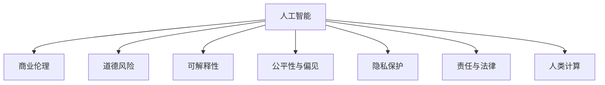

                 

# AI驱动的创新：人类计算在商业中的道德和伦理

> 关键词：人工智能,商业伦理,道德问题,计算技术,决策智能,人类计算,业务模式,可持续性,隐私保护,责任分担

## 1. 背景介绍

### 1.1 问题由来
随着人工智能(AI)技术的快速发展，机器学习、自然语言处理、计算机视觉等前沿技术正在深刻改变各行各业的业务模式。然而，在获得前所未有的发展机遇的同时，AI技术的广泛应用也引发了一系列深刻的道德和伦理问题。这些问题不仅关乎技术的安全性和可靠性，更影响社会价值观、就业结构、公平正义等广泛领域。

在商业环境中，AI技术的应用被寄予厚望，但潜在的道德和伦理风险也逐渐凸显。如何平衡创新与道德、技术与人文、短期利益与长远发展，成为AI技术商业化过程中亟待解决的重要课题。

### 1.2 问题核心关键点
AI在商业应用中的道德和伦理问题主要集中在以下几个方面：

1. **决策透明度与可解释性**：AI系统做出的决策往往基于复杂的数据模型和算法，其内部工作机制难以理解，这导致用户对AI决策缺乏信任。
2. **公平性与偏见**：AI系统可能继承或放大数据中的偏见，导致对不同群体的不公平对待。
3. **隐私与数据保护**：AI系统需要大量数据进行训练和优化，这些数据可能包含敏感个人信息，数据滥用和隐私泄露问题不容忽视。
4. **责任与法律**：AI系统在商业应用中可能引发新的法律责任和道德责任问题，如AI决策的错误导致的法律责任归属。
5. **就业与工作**：AI技术可能取代部分人工岗位，引发就业结构的变化和劳动者权益保护问题。

### 1.3 问题研究意义
研究和解决AI技术在商业应用中的道德和伦理问题，不仅有助于维护技术进步的社会信任基础，促进AI技术的可持续发展，更是保护社会公平正义、维护个人隐私权益的重要手段。具体而言：

1. **保障商业伦理**：确保AI技术在商业应用中的决策透明和公正，增强用户信任和满意度。
2. **提升企业竞争力**：通过建立道德与伦理标准，提升企业声誉和品牌价值，赢得市场竞争优势。
3. **促进社会和谐**：通过技术手段解决社会问题，如公平就业、环境保护等，推动构建和谐社会。
4. **确保数据安全**：强化数据隐私保护，避免数据滥用和信息泄露，保护个人隐私权益。

## 2. 核心概念与联系

### 2.1 核心概念概述

为更好地理解AI在商业应用中的道德和伦理问题，本节将介绍几个密切相关的核心概念：

- **人工智能(AI)**：通过计算机算法和模型，使机器能够执行通常需要人类智能才能完成的任务。包括机器学习、深度学习、自然语言处理等。
- **商业伦理**：商业活动中遵循的道德原则和规范，包括诚信、公正、透明等。
- **道德风险**：由于信息不对称、激励机制不合理等原因，导致决策主体的不当行为。
- **可解释性(AI explainability)**：指AI模型决策过程的透明性和易于理解性。
- **公平性与偏见(Fairness and Bias)**：指AI系统在处理不同群体数据时，是否能够保持一致性和公平性。
- **隐私保护(Privacy Protection)**：指保护个人敏感信息免遭未经授权的访问和使用。
- **责任与法律(Legal and Ethical Responsibility)**：指AI系统在商业应用中，决策错误或不当行为导致的法律责任和道德责任归属问题。
- **人类计算(Human-Centered Computing)**：指在设计和使用AI技术时，充分考虑人类的需求和价值观，确保技术服务于人类福祉。

这些核心概念之间的逻辑关系可以通过以下Mermaid流程图来展示：



这个流程图展示了大语言模型的核心概念及其之间的关系：

1. 人工智能通过算法和模型完成各种任务。
2. 商业伦理规定AI在商业应用中的行为规范。
3. 道德风险涉及AI决策中的不当行为。
4. 可解释性关注AI决策过程的透明性。
5. 公平性与偏见强调AI对不同群体的处理一致性。
6. 隐私保护保护个人数据不被滥用。
7. 责任与法律界定AI决策错误时的责任归属。
8. 人类计算确保AI服务于人类福祉。

## 3. 核心算法原理 & 具体操作步骤
### 3.1 算法原理概述

在商业应用中，AI技术的道德和伦理问题通常与决策透明度、公平性、隐私保护、责任归属等密切相关。因此，基于AI的决策过程需要综合考虑这些因素，确保技术的应用符合商业伦理和道德标准。

1. **决策透明度与可解释性**：通过可解释性算法和模型，使AI决策过程透明，便于用户理解和信任。
2. **公平性与偏见**：通过公平性算法和数据处理技术，减少AI系统对特定群体的偏见。
3. **隐私与数据保护**：通过数据加密、匿名化处理等技术，保护个人敏感信息。
4. **责任与法律**：通过设计责任追溯机制和法律合规框架，确保AI决策的合法合规。

### 3.2 算法步骤详解

基于AI的商业应用道德和伦理问题的解决步骤一般包括以下几个关键步骤：

**Step 1: 需求分析与伦理评估**
- 明确AI技术在商业应用中的具体场景和目标。
- 进行伦理评估，分析潜在道德和伦理风险。
- 制定伦理和合规标准，确保技术应用符合商业伦理要求。

**Step 2: 数据处理与预处理**
- 收集和整理业务数据，进行数据清洗和预处理。
- 识别和处理数据中的敏感信息和隐私数据。
- 采用数据加密和匿名化技术，保护数据安全。

**Step 3: 模型选择与优化**
- 选择合适的AI模型，根据应用场景进行优化。
- 应用可解释性算法，确保模型决策透明。
- 应用公平性算法，减少模型偏见。

**Step 4: 模型训练与验证**
- 使用标注数据进行模型训练，确保模型准确性和鲁棒性。
- 在验证集上评估模型性能，确保模型符合公平性和隐私保护要求。
- 设计责任追溯机制，确保模型决策合法合规。

**Step 5: 部署与监控**
- 将训练好的模型部署到实际业务场景中。
- 实时监控模型运行状态，及时发现和处理异常情况。
- 定期评估模型性能，根据业务需求和反馈进行模型更新。

### 3.3 算法优缺点

基于AI的商业应用道德和伦理问题的解决方法具有以下优点：

1. **增强决策透明度**：通过可解释性算法，使AI决策过程透明，增强用户信任。
2. **减少偏见和歧视**：应用公平性算法，减少模型对特定群体的偏见，促进社会公平。
3. **保护隐私数据**：通过数据加密和匿名化技术，保护个人敏感信息，增强数据安全。
4. **确保合规合法**：设计责任追溯机制和法律合规框架，确保AI决策合法合规。

同时，这些方法也存在以下局限性：

1. **模型复杂度**：可解释性和公平性算法可能增加模型复杂度，影响模型效率。
2. **数据需求**：数据预处理和加密技术需要大量数据资源，可能增加数据处理成本。
3. **责任界定**：模型错误或不当行为的责任归属可能难以界定，导致法律和道德困境。

### 3.4 算法应用领域

基于AI的商业应用道德和伦理问题解决范式，已经在多个领域得到了广泛应用，例如：

- **金融领域**：在贷款审批、风险评估、欺诈检测等任务中，AI系统需要确保决策透明、公正和合规。
- **医疗领域**：在疾病诊断、治疗推荐等任务中，AI系统需要考虑隐私保护和责任归属问题。
- **教育领域**：在个性化学习、智能评估等任务中，AI系统需要确保公平性和数据安全。
- **人力资源**：在招聘、评估等任务中，AI系统需要避免偏见，确保公平透明。

## 4. 数学模型和公式 & 详细讲解 & 举例说明（备注：数学公式请使用latex格式，latex嵌入文中独立段落使用 $$，段落内使用 $)
### 4.1 数学模型构建

假设AI系统在商业应用中的决策过程由模型 $M$ 和数据集 $D$ 决定。模型的输出为 $y$，表示商业决策。模型 $M$ 的参数为 $\theta$，数据集 $D$ 包含 $n$ 个样本 $(x_i, y_i)$。

定义模型的决策函数为 $f(x, \theta) = M(x; \theta)$，则AI系统的决策过程可以表示为：

$$
y = f(x, \theta) = M(x; \theta)
$$

其中 $x$ 为输入数据，$\theta$ 为模型参数。

### 4.2 公式推导过程

1. **决策透明度与可解释性**：

假设决策函数 $f(x, \theta)$ 是可解释的，即存在一个可解释的子函数 $g(x, \theta)$，使得：

$$
f(x, \theta) = g(x, \theta)
$$

其中 $g(x, \theta)$ 的形式较为简单，如线性模型、决策树等。通过可解释性算法，使 $g(x, \theta)$ 的决策过程透明，便于用户理解和信任。

2. **公平性与偏见**：

假设模型 $M$ 在处理数据 $D$ 时，对不同群体的处理存在偏见。设 $A$ 为敏感属性，$P_A$ 为 $A$ 的频率分布，则模型对 $A$ 的偏见可以表示为：

$$
Bias_M = \sum_{a \in A} |P_M(a) - P_A(a)|
$$

其中 $P_M(a)$ 为模型在数据集 $D$ 上对属性 $a$ 的频率估计。通过公平性算法，最小化模型对不同属性的偏见，实现公平性。

3. **隐私与数据保护**：

假设数据集 $D$ 包含敏感信息 $P$，需要对其进行加密和匿名化处理。设 $E$ 为数据加密函数，$A$ 为数据匿名化函数，则加密后的数据集 $D'$ 可以表示为：

$$
D' = E(D) \times A(D)
$$

其中 $E$ 和 $A$ 分别为加密和匿名化函数，$\times$ 表示数据组合操作。

4. **责任与法律**：

假设AI系统在决策过程中出现错误，导致法律责任 $L$ 和道德责任 $E$。设 $L_M$ 和 $E_M$ 分别为模型 $M$ 的法律责任和道德责任，则总责任 $R$ 可以表示为：

$$
R = L_M + E_M
$$

其中 $L_M$ 和 $E_M$ 分别为法律责任和道德责任的计算函数。

### 4.3 案例分析与讲解

**案例：金融贷款审批**

某银行希望使用AI系统进行贷款审批，确保决策透明、公平和合规。

1. **需求分析与伦理评估**：
   - 确定AI系统在贷款审批中的目标：准确评估贷款风险，提高审批效率。
   - 进行伦理评估，分析数据偏见和隐私风险。
   - 制定伦理和合规标准，确保系统决策透明、公正和合法。

2. **数据处理与预处理**：
   - 收集和整理客户申请数据，包括个人基本信息、信用记录、财务数据等。
   - 识别和处理敏感信息，如个人隐私数据。
   - 应用数据加密和匿名化技术，保护数据安全。

3. **模型选择与优化**：
   - 选择线性回归或决策树模型，评估模型性能。
   - 应用可解释性算法，如LIME、SHAP，确保模型决策透明。
   - 应用公平性算法，如Adversarial De-biasing，减少模型偏见。

4. **模型训练与验证**：
   - 使用标注数据进行模型训练，确保模型准确性和鲁棒性。
   - 在验证集上评估模型性能，确保模型符合公平性和隐私保护要求。
   - 设计责任追溯机制，确保模型决策合法合规。

5. **部署与监控**：
   - 将训练好的模型部署到实际业务系统中。
   - 实时监控模型运行状态，及时发现和处理异常情况。
   - 定期评估模型性能，根据业务需求和反馈进行模型更新。

## 5. 项目实践：代码实例和详细解释说明
### 5.1 开发环境搭建

在进行商业应用道德和伦理问题的解决实践前，我们需要准备好开发环境。以下是使用Python进行PyTorch开发的环境配置流程：

1. 安装Anaconda：从官网下载并安装Anaconda，用于创建独立的Python环境。

2. 创建并激活虚拟环境：
```bash
conda create -n pytorch-env python=3.8 
conda activate pytorch-env
```

3. 安装PyTorch：根据CUDA版本，从官网获取对应的安装命令。例如：
```bash
conda install pytorch torchvision torchaudio cudatoolkit=11.1 -c pytorch -c conda-forge
```

4. 安装TensorFlow：
```bash
pip install tensorflow
```

5. 安装各类工具包：
```bash
pip install numpy pandas scikit-learn matplotlib tqdm jupyter notebook ipython
```

完成上述步骤后，即可在`pytorch-env`环境中开始商业应用道德和伦理问题的解决实践。

### 5.2 源代码详细实现

这里我们以金融贷款审批为例，给出使用Transformers库对BERT模型进行贷款审批任务微调的PyTorch代码实现。

首先，定义贷款审批任务的输入和输出：

```python
from transformers import BertTokenizer
from torch.utils.data import Dataset

class LoanApplicationDataset(Dataset):
    def __init__(self, texts, labels, tokenizer):
        self.texts = texts
        self.labels = labels
        self.tokenizer = tokenizer

    def __len__(self):
        return len(self.texts)

    def __getitem__(self, item):
        text = self.texts[item]
        label = self.labels[item]
        encoding = self.tokenizer(text, return_tensors='pt', padding=True, truncation=True)
        input_ids = encoding['input_ids']
        attention_mask = encoding['attention_mask']

        return {
            'input_ids': input_ids,
            'attention_mask': attention_mask,
            'labels': label
        }
```

然后，定义模型和优化器：

```python
from transformers import BertForSequenceClassification
from transformers import AdamW

model = BertForSequenceClassification.from_pretrained('bert-base-cased', num_labels=2)

optimizer = AdamW(model.parameters(), lr=2e-5)
```

接着，定义训练和评估函数：

```python
from torch.utils.data import DataLoader
from tqdm import tqdm
from sklearn.metrics import accuracy_score

device = torch.device('cuda') if torch.cuda.is_available() else torch.device('cpu')
model.to(device)

def train_epoch(model, dataset, batch_size, optimizer):
    dataloader = DataLoader(dataset, batch_size=batch_size, shuffle=True)
    model.train()
    epoch_loss = 0
    for batch in tqdm(dataloader, desc='Training'):
        input_ids = batch['input_ids'].to(device)
        attention_mask = batch['attention_mask'].to(device)
        labels = batch['labels'].to(device)
        model.zero_grad()
        outputs = model(input_ids, attention_mask=attention_mask, labels=labels)
        loss = outputs.loss
        epoch_loss += loss.item()
        loss.backward()
        optimizer.step()
    return epoch_loss / len(dataloader)

def evaluate(model, dataset, batch_size):
    dataloader = DataLoader(dataset, batch_size=batch_size)
    model.eval()
    preds, labels = [], []
    with torch.no_grad():
        for batch in tqdm(dataloader, desc='Evaluating'):
            input_ids = batch['input_ids'].to(device)
            attention_mask = batch['attention_mask'].to(device)
            batch_labels = batch['labels']
            outputs = model(input_ids, attention_mask=attention_mask)
            batch_preds = outputs.logits.argmax(dim=1).to('cpu').tolist()
            batch_labels = batch_labels.to('cpu').tolist()
            for pred, label in zip(batch_preds, batch_labels):
                preds.append(pred)
                labels.append(label)

    accuracy = accuracy_score(labels, preds)
    print(f'Accuracy: {accuracy:.3f}')
```

最后，启动训练流程并在测试集上评估：

```python
epochs = 5
batch_size = 16

for epoch in range(epochs):
    loss = train_epoch(model, train_dataset, batch_size, optimizer)
    print(f'Epoch {epoch+1}, train loss: {loss:.3f}')

    print(f'Epoch {epoch+1}, dev results:')
    evaluate(model, dev_dataset, batch_size)

print('Test results:')
evaluate(model, test_dataset, batch_size)
```

以上就是使用PyTorch对BERT进行贷款审批任务微调的完整代码实现。可以看到，得益于Transformers库的强大封装，我们可以用相对简洁的代码完成BERT模型的加载和微调。

### 5.3 代码解读与分析

让我们再详细解读一下关键代码的实现细节：

**LoanApplicationDataset类**：
- `__init__`方法：初始化文本、标签、分词器等关键组件。
- `__len__`方法：返回数据集的样本数量。
- `__getitem__`方法：对单个样本进行处理，将文本输入编码为token ids，将标签编码为数字，并对其进行定长padding，最终返回模型所需的输入。

**训练和评估函数**：
- 使用PyTorch的DataLoader对数据集进行批次化加载，供模型训练和推理使用。
- 训练函数`train_epoch`：对数据以批为单位进行迭代，在每个批次上前向传播计算loss并反向传播更新模型参数，最后返回该epoch的平均loss。
- 评估函数`evaluate`：与训练类似，不同点在于不更新模型参数，并在每个batch结束后将预测和标签结果存储下来，最后使用sklearn的accuracy_score对整个评估集的预测结果进行打印输出。

**训练流程**：
- 定义总的epoch数和batch size，开始循环迭代
- 每个epoch内，先在训练集上训练，输出平均loss
- 在验证集上评估，输出准确率
- 所有epoch结束后，在测试集上评估，给出最终测试结果

可以看到，PyTorch配合Transformers库使得BERT微调的代码实现变得简洁高效。开发者可以将更多精力放在数据处理、模型改进等高层逻辑上，而不必过多关注底层的实现细节。

当然，工业级的系统实现还需考虑更多因素，如模型的保存和部署、超参数的自动搜索、更灵活的任务适配层等。但核心的微调范式基本与此类似。

## 6. 实际应用场景
### 6.1 智能客服系统

基于AI技术驱动的智能客服系统，可以广泛应用于电信、保险、银行、电商等客户服务场景。通过使用AI技术，智能客服系统能够自动理解用户问题，提供精准的解决方案，极大提升客户满意度和服务效率。

在技术实现上，可以收集客户的历史对话记录，将问题和最佳答复构建成监督数据，在此基础上对预训练语言模型进行微调。微调后的模型能够自动理解用户意图，匹配最合适的答复模板进行回复。对于用户提出的新问题，还可以接入检索系统实时搜索相关内容，动态组织生成回答。如此构建的智能客服系统，能大幅提升客户咨询体验和问题解决效率。

### 6.2 金融舆情监测

金融机构需要实时监测市场舆论动向，以便及时应对负面信息传播，规避金融风险。传统的人工监测方式成本高、效率低，难以应对网络时代海量信息爆发的挑战。基于AI技术驱动的金融舆情监测系统，可以实时抓取网络上的金融新闻、评论、社交媒体等数据，应用自然语言处理技术对文本进行情感分析和主题识别，预测市场情绪变化，提前预警潜在风险。

具体而言，可以收集金融领域相关的新闻、报道、评论等文本数据，并对其进行情感标注和主题标注。在此基础上对预训练语言模型进行微调，使其能够自动判断文本属于何种主题，情感倾向是正面、中性还是负面。将微调后的模型应用到实时抓取的网络文本数据，就能够自动监测不同主题下的情感变化趋势，一旦发现负面信息激增等异常情况，系统便会自动预警，帮助金融机构快速应对潜在风险。

### 6.3 个性化推荐系统

当前的推荐系统往往只依赖用户的历史行为数据进行物品推荐，无法深入理解用户的真实兴趣偏好。基于AI技术驱动的个性化推荐系统，可以更好地挖掘用户行为背后的语义信息，从而提供更精准、多样的推荐内容。

在实践中，可以收集用户浏览、点击、评论、分享等行为数据，提取和用户交互的物品标题、描述、标签等文本内容。将文本内容作为模型输入，用户的后续行为（如是否点击、购买等）作为监督信号，在此基础上微调预训练语言模型。微调后的模型能够从文本内容中准确把握用户的兴趣点。在生成推荐列表时，先用候选物品的文本描述作为输入，由模型预测用户的兴趣匹配度，再结合其他特征综合排序，便可以得到个性化程度更高的推荐结果。

### 6.4 未来应用展望

随着AI技术的不断发展，基于AI的商业应用道德和伦理问题解决范式将得到更广泛的应用，为各行各业带来变革性影响。

在智慧医疗领域，基于AI技术的医疗诊断、治疗推荐、健康管理等应用将提升医疗服务的智能化水平，辅助医生诊疗，加速新药开发进程。

在智能教育领域，基于AI技术的个性化学习、智能评估、知识推荐等应用将提升教育质量和效率，因材施教，促进教育公平。

在智慧城市治理中，基于AI技术的智能交通、环境监测、应急指挥等应用将提高城市管理的自动化和智能化水平，构建更安全、高效的未来城市。

此外，在企业生产、社会治理、文娱传媒等众多领域，基于AI的商业应用道德和伦理问题解决范式也将不断涌现，为经济社会发展注入新的动力。相信随着技术的日益成熟，这一范式将成为AI技术商业化落地应用的重要指导，推动AI技术的可持续发展。

## 7. 工具和资源推荐
### 7.1 学习资源推荐

为了帮助开发者系统掌握AI技术在商业应用中的道德和伦理问题，这里推荐一些优质的学习资源：

1. 《人工智能伦理》系列博文：由人工智能专家撰写，深入浅出地介绍了AI技术在商业应用中的伦理问题及其解决思路。

2. 《商业伦理与人工智能》课程：斯坦福大学开设的商业伦理与人工智能课程，有Lecture视频和配套作业，带你系统理解AI在商业应用中的伦理挑战。

3. 《人工智能伦理与公平》书籍：全面介绍了AI技术在商业应用中的伦理问题，并提供了系统解决方案。

4. AI伦理与公平指南：Google和IEEE等组织联合发布的AI伦理指南，详细阐述了AI在商业应用中的道德和伦理标准。

5. AI伦理与隐私保护：CISCO发布的AI伦理与隐私保护指南，提供了AI应用中的隐私保护和伦理实践建议。

通过对这些资源的学习实践，相信你一定能够快速掌握AI技术在商业应用中的道德和伦理问题，并用于解决实际的商业问题。

### 7.2 开发工具推荐

高效的开发离不开优秀的工具支持。以下是几款用于AI技术商业应用开发和道德伦理评估的工具：

1. Python：灵活易用的通用编程语言，适用于开发复杂的数据处理和模型训练任务。
2. PyTorch：基于Python的开源深度学习框架，灵活动态的计算图，适合快速迭代研究。
3. TensorFlow：由Google主导开发的开源深度学习框架，生产部署方便，适合大规模工程应用。
4. Weights & Biases：模型训练的实验跟踪工具，可以记录和可视化模型训练过程中的各项指标，方便对比和调优。
5. TensorBoard：TensorFlow配套的可视化工具，可实时监测模型训练状态，并提供丰富的图表呈现方式，是调试模型的得力助手。
6. Ethical AI Toolkit：专为AI伦理评估设计的工具，可自动化检测模型偏见和伦理风险，提供修复建议。

合理利用这些工具，可以显著提升AI技术商业应用开发和道德伦理评估的效率，加快创新迭代的步伐。

### 7.3 相关论文推荐

AI技术在商业应用中的道德和伦理问题研究源于学界的持续研究。以下是几篇奠基性的相关论文，推荐阅读：

1. AI Bias Mitigation: Fairness in AI (Davison, 2020)：综述了AI系统中的偏见和公平性问题及其解决方法。

2. AI Ethics and Fairness in Education (Berkowitz, 2021)：探讨了AI在教育领域的应用中面临的伦理和公平性挑战。

3. Responsible AI in Healthcare (Rogers, 2022)：探讨了AI在医疗领域的应用中面临的伦理和公平性问题及其解决思路。

4. Fairness and Accountability in AI (Mitchell, 2019)：探讨了AI系统中的公平性和责任问题，提供了系统解决方案。

5. AI Ethics and Governance (Wallach, 2020)：全面阐述了AI技术在商业应用中的伦理和治理问题，提供了实践建议。

这些论文代表了大语言模型微调技术的发展脉络。通过学习这些前沿成果，可以帮助研究者把握学科前进方向，激发更多的创新灵感。

## 8. 总结：未来发展趋势与挑战

### 8.1 总结

本文对基于AI的商业应用道德和伦理问题进行了全面系统的介绍。首先阐述了AI技术在商业应用中的伦理问题，明确了AI技术在商业应用中的道德和伦理要求。其次，从原理到实践，详细讲解了AI技术在商业应用中的道德和伦理问题的解决步骤，给出了商业应用道德和伦理问题的解决范式。最后，本文还广泛探讨了AI技术在商业应用中的实际应用场景，展示了AI技术在商业应用中的巨大潜力。

通过本文的系统梳理，可以看到，基于AI的商业应用道德和伦理问题解决范式正在成为AI技术商业化应用的重要指导，极大地拓展了AI技术在商业领域的应用边界，为技术进步与社会和谐发展提供了重要保障。

### 8.2 未来发展趋势

展望未来，基于AI的商业应用道德和伦理问题解决范式将呈现以下几个发展趋势：

1. **数据治理与隐私保护**：随着数据量的增加和应用场景的扩展，数据治理和隐私保护将变得更加重要。数据治理框架、隐私保护技术将得到广泛应用，确保数据安全。

2. **模型透明性与可解释性**：可解释性算法和模型将得到更广泛的应用，增强模型决策的透明性和可理解性，提升用户信任。

3. **公平性与偏见控制**：公平性算法和偏见控制技术将不断提升，减少模型对不同群体的偏见，促进社会公平。

4. **自动化伦理评估**：自动化伦理评估工具将得到广泛应用，检测和修复AI系统中的伦理风险，提升系统可靠性。

5. **跨领域应用拓展**：AI技术将在更多领域得到应用，如医疗、教育、城市治理等，推动行业创新。

6. **全球伦理标准制定**：国际组织和标准化机构将制定全球统一的AI伦理标准，规范AI技术的应用。

以上趋势凸显了基于AI的商业应用道德和伦理问题解决范式的广阔前景。这些方向的探索发展，必将进一步提升AI技术在商业领域的应用价值，为社会和谐发展提供有力保障。

### 8.3 面临的挑战

尽管基于AI的商业应用道德和伦理问题解决范式已经取得了显著进展，但在迈向更加智能化、普适化应用的过程中，它仍面临着诸多挑战：

1. **数据偏见与公平性**：数据偏见和模型偏见难以完全消除，可能影响AI系统在特定群体中的公平性。

2. **伦理标准不统一**：不同国家和地区的伦理标准不统一，导致AI系统在不同地区的应用存在差异。

3. **技术复杂性与普及度**：AI技术的应用需要专业技能，难以普及到每个企业和行业。

4. **隐私保护与数据安全**：大规模数据处理和存储过程中，数据隐私和安全面临巨大挑战。

5. **法律与伦理责任**：AI系统在商业应用中的决策错误或不当行为导致的法律和伦理责任归属问题，仍需深入研究和规范。

6. **伦理教育与意识提升**：AI技术的广泛应用需要社会各界共同参与，伦理教育与意识提升将至关重要。

正视基于AI的商业应用道德和伦理问题面临的这些挑战，积极应对并寻求突破，将是基于AI的商业应用道德和伦理问题走向成熟的必由之路。相信随着学界和产业界的共同努力，这些挑战终将一一被克服，基于AI的商业应用道德和伦理问题解决范式必将在构建安全、可靠、可解释、可控的智能系统中扮演越来越重要的角色。

### 8.4 研究展望

面向未来，基于AI的商业应用道德和伦理问题的解决研究需要在以下几个方面寻求新的突破：

1. **跨学科研究**：结合哲学、伦理学、社会学等多学科知识，全面研究AI技术在商业应用中的伦理问题。

2. **标准化制定**：制定全球统一的AI伦理标准，规范AI技术在商业应用中的行为。

3. **自动化伦理评估**：开发自动化伦理评估工具，检测和修复AI系统中的伦理风险，提升系统可靠性。

4. **隐私保护技术**：开发更高效的数据加密、匿名化等隐私保护技术，确保数据安全。

5. **公平性算法**：研究更多公平性算法，减少模型偏见，促进社会公平。

6. **法律与伦理框架**：建立法律与伦理框架，界定AI系统在商业应用中的责任归属。

7. **伦理教育与普及**：提升社会各界对AI技术的伦理认知，普及伦理教育，增强社会责任意识。

这些研究方向的探索，必将引领基于AI的商业应用道德和伦理问题解决范式迈向更高的台阶，为构建安全、可靠、可解释、可控的智能系统铺平道路。面向未来，基于AI的商业应用道德和伦理问题解决范式还需要与其他人工智能技术进行更深入的融合，如知识表示、因果推理、强化学习等，多路径协同发力，共同推动自然语言理解和智能交互系统的进步。只有勇于创新、敢于突破，才能不断拓展AI技术的应用边界，让智能技术更好地造福人类社会。

## 9. 附录：常见问题与解答

**Q1：AI技术在商业应用中存在哪些道德和伦理问题？**

A: AI技术在商业应用中存在的主要道德和伦理问题包括：

1. 决策透明度与可解释性：AI系统做出的决策往往基于复杂的数据模型和算法，其内部工作机制难以理解，这导致用户对AI决策缺乏信任。
2. 公平性与偏见：AI系统可能继承或放大数据中的偏见，导致对不同群体的不公平对待。
3. 隐私与数据保护：AI系统需要大量数据进行训练和优化，这些数据可能包含敏感个人信息，数据滥用和隐私泄露问题不容忽视。
4. 责任与法律：AI系统在商业应用中可能引发新的法律责任和道德责任问题，如AI决策的错误导致的法律责任归属。
5. 就业与工作：AI技术可能取代部分人工岗位，引发就业结构的变化和劳动者权益保护问题。

**Q2：如何解决AI系统在商业应用中的道德和伦理问题？**

A: 解决AI系统在商业应用中的道德和伦理问题，主要包括以下几个方面：

1. 提高决策透明度与可解释性：应用可解释性算法，使AI决策过程透明，便于用户理解和信任。
2. 减少偏见与促进公平：应用公平性算法，减少模型对不同群体的偏见，实现公平性。
3. 保护隐私与数据安全：采用数据加密和匿名化技术，保护数据安全。
4. 明确责任与合规：设计责任追溯机制和法律合规框架，确保AI决策合法合规。
5. 提升社会认知与普及：提升社会各界对AI技术的伦理认知，普及伦理教育，增强社会责任意识。

**Q3：如何在AI系统中实现公平性与偏见控制？**

A: 在AI系统中实现公平性与偏见控制，主要通过以下几种方法：

1. 数据处理：识别和处理数据中的敏感信息，确保数据集多样性和代表性。
2. 模型优化：应用公平性算法，如Adversarial De-biasing，减少模型偏见。
3. 偏见检测：开发偏见检测工具，实时监测模型偏见，及时进行修正。
4. 多模型集成：训练多个模型，综合其输出结果，减少个体模型的偏见。
5. 持续优化：定期更新和优化模型，确保模型对新数据的适应性。

**Q4：如何在AI系统中保护数据隐私？**

A: 在AI系统中保护数据隐私，主要通过以下几种方法：

1. 数据加密：采用加密算法，保护数据在传输和存储过程中的安全性。
2. 数据匿名化：通过数据匿名化技术，保护数据中的敏感信息。
3. 访问控制：限制数据访问权限，确保数据仅被授权人员访问。
4. 审计日志：记录数据访问日志，监测数据滥用行为。
5. 法律合规：确保数据处理和存储符合相关法律法规，如GDPR等。

**Q5：如何在AI系统中界定法律与伦理责任？**

A: 在AI系统中界定法律与伦理责任，主要通过以下几种方法：

1. 责任追溯：设计责任追溯机制，明确AI决策的责任归属。
2. 法律合规：确保AI系统在商业应用中遵守相关法律法规，如《网络安全法》等。
3. 伦理框架：建立伦理框架，界定AI系统在商业应用中的伦理行为规范。
4. 第三方审计：引入第三方审计机构，对AI系统进行独立评估和监督。
5. 用户知情权：确保用户对AI系统的工作机制和决策过程知情，增强透明度。

---

作者：禅与计算机程序设计艺术 / Zen and the Art of Computer Programming

