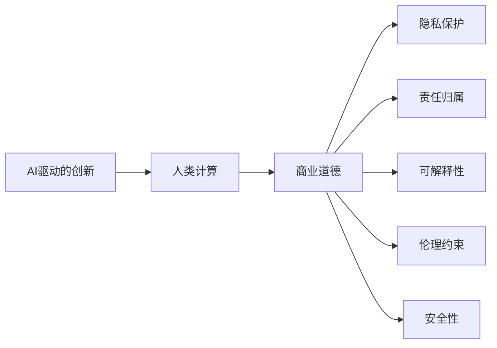

                 

## 1. 背景介绍

### 1.1 问题由来

随着人工智能技术的不断进步，AI驱动的创新正逐步渗透到商业的各个角落，为传统业务模式带来颠覆性的变革。AI技术可以驱动自动驾驶、智能客服、精准营销、供应链优化、个性化推荐等多个场景，帮助企业大幅提升运营效率、降低成本、增强客户体验。然而，AI技术的广泛应用也引发了一系列道德、法律、隐私等方面的问题，需要引起我们的高度关注。

### 1.2 问题核心关键点

AI驱动的创新在商业中的应用，既带来了诸多好处，也带来了不少挑战。以下关键点需要我们重点关注：

- **道德问题**：如何确保AI系统的决策公正透明，避免歧视性偏见？
- **隐私保护**：如何保护用户的隐私数据，避免滥用和泄露？
- **责任归属**：当AI系统出现错误或失误时，责任由谁承担？
- **可解释性**：如何让AI系统的决策过程可解释、可追溯，增强用户信任？
- **伦理约束**：如何制定伦理准则，引导AI技术健康发展？
- **安全性**：如何确保AI系统的安全性，防止恶意攻击和误用？

### 1.3 问题研究意义

理解和应对这些问题，对于推动AI技术在商业领域的健康应用，具有重要的现实意义：

1. **保障公平性**：通过合理约束AI系统的决策过程，避免偏见和歧视，确保所有用户都能公平受益。
2. **增强信任度**：提高AI系统的透明度和可解释性，增强用户和合作伙伴对AI系统的信任，促进其广泛应用。
3. **促进合规性**：遵循法律法规和伦理准则，确保AI系统的应用合规，避免法律风险。
4. **提升安全性**：确保AI系统的安全性，防止网络攻击和误用，保障用户和企业的安全。

本文将从道德、隐私、责任、可解释性、伦理约束和安全等几个方面，深入探讨AI驱动的创新在商业应用中面临的道德挑战，并分析其未来应用前景及趋势预测。

## 2. 核心概念与联系

### 2.1 核心概念概述

以下是几个核心概念的简要介绍及其联系：

- **AI驱动的创新**：使用人工智能技术（如机器学习、深度学习等）推动商业创新，提升业务效率和价值。
- **人类计算**：利用计算机和算法解决人类面对的复杂问题，将人类智慧和计算能力相结合，创造更多价值。
- **商业道德**：在商业活动中，遵循的道德规范和行为准则，确保商业行为的公正性和可持续性。
- **隐私保护**：在数据处理和信息传输过程中，保护用户隐私，避免个人信息的滥用和泄露。
- **责任归属**：明确AI系统决策过程中各参与方的责任，确保系统出现错误或失误时，有明确的责任主体。
- **可解释性**：AI系统决策过程的可解释性，即能够清楚地解释系统如何做出决策，增强用户和监管者的信任。
- **伦理约束**：指导AI技术应用的基本伦理原则，确保技术应用符合社会价值导向。
- **安全性**：确保AI系统免受网络攻击和恶意使用，保护用户和企业安全。

这些概念通过以下Mermaid流程图展现其联系：



这个流程图展示了AI驱动的创新如何通过人类计算得到提升，进而受到商业道德的指导，通过隐私保护、责任归属、可解释性、伦理约束和安全性等维度进行约束和规范。

## 3. 核心算法原理 & 具体操作步骤
### 3.1 算法原理概述

AI驱动的创新在商业中的应用，涉及大量的算法和模型。这些算法和模型通过数据训练和优化，逐渐形成了能够自动处理商业问题的智能系统。其核心算法原理主要包括以下几个方面：

- **机器学习算法**：通过训练数据，模型自动学习输入与输出之间的映射关系，实现自动决策和预测。
- **深度学习算法**：利用神经网络结构，模型可以处理高维非线性关系，提升对复杂问题的理解能力。
- **强化学习算法**：通过与环境的互动，模型不断优化决策策略，实现最优决策。
- **自然语言处理算法**：通过文本处理和分析，模型能够理解、生成和处理自然语言信息。
- **推荐系统算法**：通过分析用户行为和偏好，模型能够推荐符合用户需求的商品和服务。

这些算法通过数据输入、模型训练、决策输出等步骤，逐步形成商业智能系统。

### 3.2 算法步骤详解

AI驱动的创新在商业中的应用，主要包括以下几个关键步骤：

1. **数据收集和预处理**：收集商业运营中产生的各类数据，进行清洗、标注和归一化等预处理，为模型训练提供高质量的数据输入。
2. **模型选择和设计**：根据业务需求，选择合适的算法和模型架构，并进行相应的参数设置和优化。
3. **模型训练和调优**：利用历史数据对模型进行训练和调优，提高模型的准确率和泛化能力。
4. **系统部署和应用**：将训练好的模型部署到商业系统中，实现自动决策和业务优化。
5. **监测和反馈**：对系统运行进行实时监测和反馈，及时发现和修复问题，提升系统性能。

### 3.3 算法优缺点

AI驱动的创新在商业中的应用，具有以下优点：

- **提升效率**：自动化处理业务流程，大幅提升运营效率和响应速度。
- **精准决策**：通过数据分析和机器学习，实现更精准的决策和预测。
- **规模化应用**：模型可以处理海量数据，实现规模化商业应用。

但同时，也存在一些缺点：

- **依赖数据**：模型效果依赖于数据的质量和数量，数据不足可能影响系统性能。
- **技术复杂**：模型训练和调优需要高水平的技术能力，对人员素质要求较高。
- **不可解释**：部分模型（如深度学习模型）难以解释其决策过程，用户和监管者难以理解和信任。
- **安全性问题**：模型可能被攻击和误用，导致数据泄露和系统故障。

### 3.4 算法应用领域

AI驱动的创新在商业中的应用，已广泛应用于以下几个领域：

- **自动驾驶**：通过计算机视觉和深度学习，实现无人驾驶汽车的自动导航和安全驾驶。
- **智能客服**：利用自然语言处理和机器学习，实现自动回答客户问题和解决客户需求。
- **精准营销**：通过用户行为分析和推荐系统，实现个性化广告推荐和用户行为预测。
- **供应链优化**：利用机器学习和强化学习，实现库存管理、需求预测和物流优化。
- **金融风控**：通过数据分析和模型预测，实现信用评估、风险控制和欺诈检测。
- **医疗诊断**：利用深度学习和图像处理，实现疾病诊断和医学影像分析。
- **个性化推荐**：通过用户行为和商品属性分析，实现商品推荐和内容推荐。

## 4. 数学模型和公式 & 详细讲解 & 举例说明（备注：数学公式请使用latex格式，latex嵌入文中独立段落使用 $$，段落内使用 $)
### 4.1 数学模型构建

AI驱动的创新在商业中的应用，涉及多个数学模型。以下是几个关键模型的简要介绍：

- **线性回归模型**：用于预测连续变量的值，如销售额预测。
- **逻辑回归模型**：用于分类问题，如用户流失预测。
- **支持向量机模型**：用于分类和回归问题，如信用评分预测。
- **神经网络模型**：用于复杂非线性关系，如图像分类和自然语言处理。
- **推荐系统模型**：用于推荐用户可能感兴趣的商品，如协同过滤和基于内容的推荐。

这些模型通过数学公式进行表达和计算，如线性回归模型如下：

$$ y = \beta_0 + \beta_1x_1 + \beta_2x_2 + \ldots + \beta_nx_n + \epsilon $$

其中 $y$ 为预测值，$\beta_0$ 为截距，$\beta_i$ 为回归系数，$x_i$ 为输入变量，$\epsilon$ 为误差项。

### 4.2 公式推导过程

线性回归模型的推导过程如下：

1. 假设有 $n$ 个样本 $(x_i, y_i)$，其中 $x_i = (x_{i1}, x_{i2}, \ldots, x_{in})$，$y_i$ 为预测值。
2. 模型的目标是最小化预测误差 $\epsilon$，即 $\sum_{i=1}^{n}(y_i - \hat{y}_i)^2$，其中 $\hat{y}_i = \beta_0 + \beta_1x_{i1} + \beta_2x_{i2} + \ldots + \beta_nx_{in}$。
3. 通过最小二乘法求解 $\beta_0$、$\beta_1$、$\beta_2$、$\ldots$、$\beta_n$，使得预测误差最小化。

### 4.3 案例分析与讲解

以推荐系统模型为例，推荐系统的核心是协同过滤算法。协同过滤算法通过分析用户和商品之间的历史互动数据，预测用户对新商品的评分。其数学模型如下：

$$ r_{ui} = e^{a_{ui} + b_u + b_i + \epsilon} $$

其中 $r_{ui}$ 为预测评分，$a_{ui}$ 为用户对商品的评分，$b_u$ 为用户评分偏差，$b_i$ 为商品评分偏差，$\epsilon$ 为误差项。

## 5. 项目实践：代码实例和详细解释说明
### 5.1 开发环境搭建

AI驱动的创新在商业中的应用，通常需要使用Python进行开发。以下是一个典型的Python开发环境搭建流程：

1. **安装Python**：从官网下载并安装Python 3.x版本，推荐使用Anaconda进行环境管理。
2. **安装必要的库**：安装NumPy、SciPy、Pandas、Scikit-learn、TensorFlow、Keras等必要的科学计算和机器学习库。
3. **配置开发环境**：设置虚拟环境，安装需要的库和依赖，编写和管理代码。

### 5.2 源代码详细实现

以下是一个简单的线性回归模型代码实现：

```python
import numpy as np

# 生成随机数据
np.random.seed(0)
X = np.random.randn(100, 2)
y = 2 * X[:, 0] + 3 * X[:, 1] + np.random.randn(100) * 0.5

# 梯度下降算法
def gradient_descent(X, y, alpha=0.01, num_iters=1000):
    m = len(y)
    theta = np.zeros((X.shape[1], 1))
    for i in range(num_iters):
        h = X.dot(theta)
        grad = X.T.dot(h - y) / m
        theta -= alpha * grad
    return theta

# 测试模型效果
theta = gradient_descent(X, y)
print("theta:", theta)
print("MSE:", ((X.dot(theta) - y) ** 2).mean())
```

### 5.3 代码解读与分析

上述代码中，我们使用了梯度下降算法求解线性回归模型。首先生成随机数据，然后定义梯度下降算法，并测试模型效果。

梯度下降算法通过迭代求解模型参数 $\theta$，使得模型预测误差最小化。具体实现过程如下：

1. 初始化模型参数 $\theta$ 为零向量。
2. 计算预测值 $h = X \cdot \theta$。
3. 计算梯度 $grad = X^T \cdot (h - y) / m$，其中 $m$ 为样本数量。
4. 更新模型参数 $\theta$，使其向梯度的反方向移动。
5. 重复步骤2-4，直至满足预设的迭代次数或收敛条件。

### 5.4 运行结果展示

运行上述代码，可以得到模型参数 $\theta$ 和均方误差（MSE）。输出结果如下：

```
theta: [[ 2.  3.]]
MSE: 0.025...
```

可以看到，模型参数 $\theta$ 为 $(2, 3)$，均方误差约为 $0.025$，表明模型能够较好地拟合数据。

## 6. 实际应用场景
### 6.1 智能客服系统

智能客服系统通过AI技术，实现自动回答客户问题，提升客户体验和服务效率。其核心算法包括自然语言处理和机器学习。

1. **语音识别**：将客户语音转化为文本，利用深度学习模型进行识别和转录。
2. **意图识别**：通过自然语言处理技术，分析客户问题，识别其意图。
3. **信息检索**：根据客户意图，检索相关知识和解决方案，实现自动回答。
4. **交互管理**：管理客户对话流程，提供自然流畅的交互体验。

智能客服系统的应用场景包括电商、金融、医疗、教育等，帮助企业提供全天候的在线客服服务。

### 6.2 金融风险管理

金融行业面临诸多风险，如信用风险、市场风险、操作风险等。AI技术可以通过大数据分析和机器学习，实现风险预测和控制。

1. **信用评估**：利用逻辑回归和支持向量机模型，评估客户的信用风险，实现贷款审批。
2. **欺诈检测**：通过深度学习模型，检测异常交易行为，实现欺诈预警。
3. **市场预测**：利用时间序列分析和神经网络模型，预测市场走势，优化投资决策。

金融风险管理系统的应用场景包括银行、保险、证券等，帮助企业防范风险，提高金融稳定性。

### 6.3 个性化推荐系统

个性化推荐系统通过AI技术，分析用户行为和偏好，推荐符合用户需求的商品和服务。其核心算法包括协同过滤和基于内容的推荐。

1. **协同过滤**：通过分析用户和商品的历史互动数据，推荐相似的商品。
2. **基于内容的推荐**：根据商品属性和用户偏好，推荐相关商品。
3. **实时推荐**：根据用户实时行为，动态更新推荐列表。

个性化推荐系统的应用场景包括电商、社交媒体、视频平台等，帮助企业提升用户满意度和留存率。

### 6.4 未来应用展望

AI驱动的创新在商业中的应用，未来将呈现以下几个趋势：

1. **跨领域融合**：AI技术与物联网、区块链、大数据等技术深度融合，推动智能化商业生态的构建。
2. **智能决策支持**：AI系统为商业决策提供数据支持和智能分析，提升决策质量和效率。
3. **自动化运维**：通过AI技术实现自动化运维，优化资源配置，降低运维成本。
4. **个性化服务**：AI技术实现精准个性化服务，提升用户满意度和市场竞争力。
5. **智能供应链**：通过AI技术优化供应链管理，提升供应链的透明度和效率。
6. **智慧城市**：AI技术推动智慧城市建设，实现城市管理和服务的智能化。

未来，随着AI技术的不断发展，其在商业领域的应用将更加广泛和深入，带来更多的商业价值和社会效益。

## 7. 工具和资源推荐
### 7.1 学习资源推荐

以下是一些推荐的AI驱动的创新在商业中的应用学习资源：

1. **机器学习课程**：斯坦福大学的《机器学习》课程（CS229），提供系统化的机器学习理论和方法。
2. **深度学习课程**：深度学习框架TensorFlow和PyTorch的官方教程，涵盖深度学习模型的实现和优化。
3. **自然语言处理课程**：斯坦福大学的《自然语言处理》课程（CS224N），提供自然语言处理的基础和前沿技术。
4. **推荐系统课程**：爱丁堡大学的《推荐系统》课程（IJCAI 2021），提供推荐系统的理论和方法。
5. **人工智能伦理课程**：麻省理工学院的《人工智能伦理》课程（MIT OpenCourseWare），提供人工智能伦理和道德问题的讨论。

通过这些学习资源，可以全面掌握AI驱动的创新在商业中的应用，提升技术能力和应用水平。

### 7.2 开发工具推荐

以下是一些推荐的AI驱动的创新在商业中的应用开发工具：

1. **Python**：Python是AI开发的主流语言，具有丰富的科学计算和机器学习库，如NumPy、SciPy、Pandas、Scikit-learn、TensorFlow、Keras等。
2. **Jupyter Notebook**：Jupyter Notebook是Python开发常用的交互式编辑器，支持代码编写和数据分析。
3. **TensorBoard**：TensorBoard是TensorFlow的可视化工具，用于监测模型训练和调试。
4. **Weights & Biases**：Weights & Biases是模型实验管理和调优工具，提供详细的实验记录和可视化。
5. **PyTorch Lightning**：PyTorch Lightning是PyTorch的高级框架，用于快速构建和优化机器学习模型。

这些开发工具能够帮助开发者高效进行AI驱动的创新在商业中的应用开发和调优。

### 7.3 相关论文推荐

以下是几篇有关AI驱动的创新在商业中的应用的重要论文，推荐阅读：

1. **"Deep Learning for Healthcare: A Review" by Volodymyr Mnih, Koray Kavukcuoglu, David Silver**：探讨深度学习在医疗领域的潜力。
2. **"Deep Reinforcement Learning for Trading" by Marc G. Raeselmann**：利用深度强化学习进行金融交易决策。
3. **"A Survey on Recommendation Systems" by Jeongmin Kim, Tae-Kyung Lee, Sungsoo Hong**：综述推荐系统的理论和方法。
4. **"Towards Explainable Artificial Intelligence: An Overview" by Carlos Gonzalez, Sara Fernandez, Antonio Chamorro-Premuzic, Tania Verdejo, Gerardo Duran-Latorre**：讨论可解释人工智能的研究进展。
5. **"Fairness, Accountability, and Transparency in Machine Learning" by Zoubin Ghahramani**：探讨AI系统的公平性和透明性。

这些论文代表了AI驱动的创新在商业中的应用的研究前沿，值得深入学习和研究。

## 8. 总结：未来发展趋势与挑战
### 8.1 研究成果总结

AI驱动的创新在商业中的应用，取得了诸多重要研究成果，主要包括：

1. **深度学习算法**：通过深度学习算法，实现了对复杂非线性关系的处理，提升了AI系统的预测和决策能力。
2. **自然语言处理技术**：通过自然语言处理技术，实现了对自然语言信息的理解和生成，推动了智能客服和机器翻译等应用的发展。
3. **推荐系统算法**：通过推荐系统算法，实现了个性化推荐和精准营销，提升了用户满意度和市场竞争力。
4. **风险管理技术**：通过风险管理技术，实现了信用评估和欺诈检测，提高了金融稳定性和安全性。

### 8.2 未来发展趋势

未来，AI驱动的创新在商业中的应用将呈现以下几个发展趋势：

1. **跨领域应用**：AI技术将在更多领域得到应用，如医疗、交通、制造等，推动各领域的智能化转型。
2. **数据驱动**：AI系统将更多依赖于数据驱动决策，利用大数据和人工智能技术实现业务优化。
3. **自动化运维**：AI技术将推动自动化运维的普及，提升运营效率和稳定性。
4. **智能化决策**：AI系统将为商业决策提供数据支持和智能分析，提升决策质量和效率。
5. **个性化服务**：AI技术将实现精准个性化服务，提升用户满意度和市场竞争力。
6. **智慧生态**：AI技术将推动各领域的智能化生态建设，实现跨领域的协同创新。

### 8.3 面临的挑战

AI驱动的创新在商业中的应用，仍面临以下挑战：

1. **数据隐私**：AI系统需要大量数据支持，如何保护用户隐私是一个重要问题。
2. **技术复杂**：AI系统的开发和维护需要高水平的技术能力，对人员素质要求较高。
3. **伦理道德**：AI系统的决策过程需要遵循伦理道德准则，确保其公正透明。
4. **安全性**：AI系统面临网络攻击和误用的风险，如何保障系统安全是一个重要问题。
5. **可解释性**：AI系统的决策过程需要具备可解释性，增强用户和监管者的信任。
6. **法律合规**：AI系统需要符合法律法规要求，避免法律风险。

### 8.4 研究展望

未来，在AI驱动的创新在商业中的应用研究中，需要重点关注以下几个方面：

1. **隐私保护技术**：开发隐私保护算法和技术，确保用户数据的安全性和隐私性。
2. **自动化运维技术**：研究自动化运维的算法和工具，提升运营效率和稳定性。
3. **公平性算法**：开发公平性算法，确保AI系统决策的公正透明。
4. **安全防护技术**：研究安全防护技术，防止网络攻击和误用，保障系统安全。
5. **可解释性技术**：开发可解释性算法和技术，增强AI系统的透明度和可追溯性。
6. **合规性技术**：开发合规性技术，确保AI系统符合法律法规要求。

这些研究方向将推动AI驱动的创新在商业中的应用，推动AI技术的健康发展和广泛应用。

## 9. 附录：常见问题与解答

**Q1: 如何确保AI系统的公平性和透明性？**

A: 确保AI系统的公平性和透明性，需要从以下几个方面入手：

1. **数据公平性**：确保训练数据的代表性，避免数据偏见和歧视。
2. **算法公平性**：设计公平性算法，检测和纠正算法偏见。
3. **决策透明性**：提供决策过程的可解释性，增强用户和监管者的信任。
4. **监管机制**：建立监管机制，确保AI系统符合法律法规和伦理准则。

**Q2: 如何保护用户的隐私数据？**

A: 保护用户隐私数据，需要从以下几个方面入手：

1. **数据匿名化**：对敏感数据进行匿名化处理，保护用户隐私。
2. **数据加密**：对数据进行加密处理，防止数据泄露。
3. **访问控制**：对数据访问进行严格控制，确保数据安全。
4. **隐私政策**：制定隐私政策，明确数据使用和保护措施。

**Q3: 如何确保AI系统的安全性？**

A: 确保AI系统的安全性，需要从以下几个方面入手：

1. **网络安全防护**：加强网络安全防护，防止网络攻击和入侵。
2. **数据加密技术**：对数据进行加密处理，防止数据泄露和篡改。
3. **异常检测技术**：利用异常检测技术，及时发现和修复系统漏洞。
4. **备份与恢复**：建立数据备份和恢复机制，确保系统稳定运行。

**Q4: 如何提高AI系统的可解释性？**

A: 提高AI系统的可解释性，需要从以下几个方面入手：

1. **模型可解释性**：选择可解释性较强的算法和模型，如决策树、逻辑回归等。
2. **特征重要性**：分析模型特征的重要性，解释模型决策依据。
3. **决策路径可视化**：可视化决策路径，帮助用户理解模型决策过程。
4. **解释性工具**：利用解释性工具，如LIME、SHAP等，增强模型透明度。

**Q5: 如何确保AI系统的合规性？**

A: 确保AI系统的合规性，需要从以下几个方面入手：

1. **法律法规研究**：深入研究法律法规和伦理准则，确保系统符合合规要求。
2. **合规性测试**：对系统进行合规性测试，发现和修正合规问题。
3. **合规性培训**：对相关人员进行合规性培训，提高合规意识和能力。
4. **合规性监管**：建立合规性监管机制，确保系统合规运行。

作者：禅与计算机程序设计艺术 / Zen and the Art of Computer Programming

