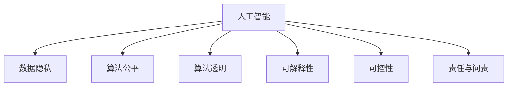

                 

# AI驱动的创新：人类计算在商业中的道德考虑因素与应用前景趋势分析预测

## 1. 背景介绍

### 1.1 问题由来

随着人工智能（AI）技术的迅猛发展，人类计算的概念和应用已经渗透到商业运作的各个环节。从市场营销、客户服务到供应链管理，AI驱动的自动化和智能化解决方案正在重塑商业生态。然而，这种变革也引发了诸多伦理和道德问题。如何在追求商业利益最大化的同时，维护用户隐私、公平性和透明度，成为当前和未来商业AI应用中的关键挑战。

### 1.2 问题核心关键点

本文旨在探讨AI在商业中的道德考虑因素，并预测未来AI驱动的商业应用趋势。重点关注以下几个方面：

- 数据隐私与合规：如何在商业应用中保护用户数据隐私，同时遵守相关法律法规。
- 算法公平与透明：确保AI算法在处理决策时能够公平对待所有用户，并提高算法的透明度。
- 可解释性与可控性：提升AI系统的可解释性，确保用户能够理解并信任其决策过程。
- 责任与问责：明确AI系统在商业决策中的责任归属，建立有效的问责机制。

### 1.3 问题研究意义

深入理解AI驱动的商业应用中的道德考虑因素，对于构建可信赖、负责任的AI系统具有重要意义。通过对这些关键问题的研究，可以指导商业AI实践，确保技术进步与伦理道德的同步发展。同时，为未来AI技术的商业应用提供决策依据，促进AI与商业的良性互动和可持续发展。

## 2. 核心概念与联系

### 2.1 核心概念概述

为更好地理解AI在商业中的道德考虑因素，本节将介绍几个核心概念：

- 人工智能（AI）：指通过模拟人类智能行为，使计算机能够自主完成一系列复杂任务的技术。
- 人类计算（Human Computation）：指利用人的感知、认知和判断能力，结合AI技术进行协同计算的策略。
- 数据隐私（Data Privacy）：指保护个人信息不被非法收集、使用或泄露的权益。
- 算法公平（Algorithmic Fairness）：指算法在处理数据和做出决策时，确保对所有用户不产生偏见。
- 算法透明（Algorithmic Transparency）：指算法的工作原理和决策过程应易于理解，便于用户和监管者监督。
- 可解释性（Explainability）：指AI系统能够提供清晰、有说服力的解释，解释其决策依据和过程。
- 可控性（Controllability）：指用户能够控制AI系统的行为和输出，确保系统的可预测性和稳定性。
- 责任与问责（Accountability）：指明确AI系统在商业决策中的责任归属，建立有效的问责机制。

这些核心概念之间的逻辑关系可以通过以下Mermaid流程图来展示：



这个流程图展示了一些关键概念的相互关系：

1. AI驱动的商业应用依赖于数据的输入，而数据隐私是保护数据不被滥用和泄露的重要保障。
2. 算法的公平和透明是确保AI决策公正、透明的关键因素。
3. 可解释性有助于增强用户对AI系统的信任，同时便于监管和调试。
4. 可控性确保用户能够有效管理AI系统的行为，防止不可预测的负面后果。
5. 责任与问责是确保AI系统在出现问题时，能够追责到具体的责任人或机构。

## 3. 核心算法原理 & 具体操作步骤
### 3.1 算法原理概述

AI在商业应用中的道德考虑因素，主要集中在以下几个核心算法原理上：

- **数据隐私保护**：通过加密、匿名化、差分隐私等技术，确保用户数据在处理过程中不被泄露或滥用。
- **算法公平性保证**：使用公平性约束、偏见检测和校正等方法，确保算法在所有用户间公平无偏见地处理数据。
- **算法透明性提升**：通过简化模型结构、提供中间结果可视化等方式，增强算法的工作原理和决策过程的透明度。
- **可解释性增强**：引入可解释性技术，如特征重要性分析、局部可解释模型等，帮助用户理解AI系统的决策依据。
- **可控性设计**：通过接口设计、参数调整等方式，让用户能够控制AI系统的行为和输出，确保系统的可预测性和稳定性。
- **责任归属明确**：制定明确的责任归属机制，确保AI系统在商业决策中出现问题时，能够追溯到具体的责任人或机构。

### 3.2 算法步骤详解

基于以上算法原理，AI在商业中的道德考虑因素可以通过以下步骤进行详细操作：

**Step 1: 数据准备与预处理**

- 收集商业数据，包括用户行为、交易记录、客户反馈等。
- 对数据进行清洗和预处理，确保数据的准确性和完整性。
- 对敏感数据进行匿名化、去标识化处理，确保数据隐私保护。

**Step 2: 模型训练与优化**

- 选择适合的AI算法，如机器学习、深度学习、强化学习等，进行模型训练。
- 在训练过程中，引入公平性约束，确保模型在所有用户间公平无偏见地处理数据。
- 使用透明度提升技术，如模型可视化、中间结果展示等，增强模型的透明度。
- 通过可解释性技术，提供模型决策的详细解释，帮助用户理解决策过程。

**Step 3: 系统部署与监控**

- 将训练好的模型部署到商业系统中，进行实际应用。
- 在部署过程中，确保系统的可控性，让用户能够有效管理模型的行为和输出。
- 建立系统监控机制，实时监测模型的运行状态，及时发现和修复问题。
- 制定责任归属机制，明确模型在商业决策中的责任归属，建立有效的问责机制。

### 3.3 算法优缺点

AI在商业应用中的道德考虑因素涉及的算法有以下优缺点：

**优点**：
- 提高决策效率：AI能够自动化处理大量数据，快速做出商业决策。
- 增强决策质量：通过引入公平性和透明性，确保AI决策的公正性和透明性。
- 提升用户体验：增强系统的可解释性和可控性，提高用户对AI系统的信任和满意度。

**缺点**：
- 数据隐私风险：AI处理大量数据时，可能存在隐私泄露的风险。
- 算法偏见问题：AI算法可能在数据处理中产生偏见，导致不公平的决策。
- 系统透明度不足：复杂的AI模型可能难以解释其内部决策过程，影响用户信任。
- 责任归属模糊：AI系统在商业决策中出现问题时，责任归属不明确。

### 3.4 算法应用领域

AI在商业中的应用领域广泛，主要包括以下几个方面：

- **市场营销**：利用AI进行消费者行为分析，精准推送个性化广告，提升营销效果。
- **客户服务**：通过AI驱动的聊天机器人，提供24/7在线客户支持，提升客户满意度。
- **供应链管理**：使用AI进行需求预测、库存管理、物流优化，提高供应链效率。
- **风险管理**：利用AI进行信用评估、欺诈检测，降低金融风险。
- **人力资源管理**：通过AI进行简历筛选、人才推荐，提升招聘效率和质量。

## 4. 数学模型和公式 & 详细讲解 & 举例说明

### 4.1 数学模型构建

本节将使用数学语言对AI在商业应用中的道德考虑因素进行更加严格的刻画。

记商业决策问题为 $P = (X, Y, D, A, F)$，其中 $X$ 为输入数据，$Y$ 为输出结果，$D$ 为数据集，$A$ 为算法模型，$F$ 为公平性约束。

定义决策函数 $f: X \rightarrow Y$，则在数据集 $D$ 上的经验风险为：

$$
\mathcal{L}(f) = \frac{1}{N}\sum_{i=1}^N \ell(f(x_i),y_i)
$$

其中 $\ell$ 为损失函数，用于衡量模型预测输出与真实标签之间的差异。

在实际应用中，通常使用交叉熵损失、均方误差损失等。

### 4.2 公式推导过程

以交叉熵损失为例，推导损失函数的计算公式：

假设模型 $A$ 在输入 $x$ 上的输出为 $\hat{y}=A(x) \in [0,1]$，表示样本属于正类的概率。真实标签 $y \in \{0,1\}$。则交叉熵损失函数定义为：

$$
\ell(A(x),y) = -[y\log \hat{y} + (1-y)\log (1-\hat{y})]
$$

将其代入经验风险公式，得：

$$
\mathcal{L}(A) = -\frac{1}{N}\sum_{i=1}^N [y_i\log A(x_i)+(1-y_i)\log(1-A(x_i))]
$$

### 4.3 案例分析与讲解

考虑一个基于AI的信用评分系统，用于评估客户的信用风险。该系统涉及大量敏感数据，如收入、消费记录等。在设计和部署该系统时，需要考虑以下道德因素：

- 数据隐私保护：需要对用户数据进行匿名化处理，确保数据隐私不被泄露。
- 算法公平性：需要确保信用评分模型在所有客户间公平无偏见地处理数据。
- 算法透明性：需要提供模型决策的详细解释，帮助客户理解评分依据。
- 可控性：需要允许客户查询和解释其信用评分，确保评分结果的可控性。
- 责任归属：需要明确系统在信用决策中的责任归属，建立有效的问责机制。

通过以上分析，可以看出，在AI驱动的信用评分系统中，保护数据隐私、确保算法公平和透明、增强系统可解释性和可控性、明确责任归属，是确保系统道德运行的关键因素。

## 5. 项目实践：代码实例和详细解释说明

### 5.1 开发环境搭建

在进行AI在商业应用中的道德考虑因素研究前，我们需要准备好开发环境。以下是使用Python进行TensorFlow开发的开发环境配置流程：

1. 安装Anaconda：从官网下载并安装Anaconda，用于创建独立的Python环境。

2. 创建并激活虚拟环境：
```bash
conda create -n tf-env python=3.8 
conda activate tf-env
```

3. 安装TensorFlow：从官网获取对应的安装命令。例如：
```bash
pip install tensorflow
```

4. 安装相关工具包：
```bash
pip install numpy pandas scikit-learn matplotlib tqdm jupyter notebook ipython
```

完成上述步骤后，即可在`tf-env`环境中开始研究项目。

### 5.2 源代码详细实现

这里我们以一个简单的AI驱动的客户服务聊天机器人为例，给出使用TensorFlow进行开发的Python代码实现。

首先，定义聊天机器人所需的基本组件，如输入输出接口、对话管理等：

```python
from tensorflow.keras.layers import Input, Dense, LSTM, Embedding
from tensorflow.keras.models import Sequential
import tensorflow as tf

# 定义输入和输出
input_text = Input(shape=(None, ), name='input_text')
output_text = Input(shape=(None, ), name='output_text')

# 定义模型结构
model = Sequential([
    Embedding(input_dim=vocab_size, output_dim=embedding_dim, input_length=max_len, mask_zero=True),
    LSTM(128, return_sequences=True),
    Dense(64, activation='relu'),
    Dense(1, activation='sigmoid')
])

# 编译模型
model.compile(loss='binary_crossentropy', optimizer='adam', metrics=['accuracy'])

# 训练模型
model.fit(input_text, output_text, epochs=num_epochs, batch_size=batch_size)
```

然后，定义数据预处理和模型评估函数：

```python
from tensorflow.keras.preprocessing.text import Tokenizer
from tensorflow.keras.preprocessing.sequence import pad_sequences
from tensorflow.keras.metrics import Accuracy

# 数据预处理
tokenizer = Tokenizer(num_words=vocab_size)
tokenizer.fit_on_texts(train_texts)
sequences = tokenizer.texts_to_sequences(train_texts)
padded_sequences = pad_sequences(sequences, maxlen=max_len, padding='post', truncating='post')

# 模型评估
def evaluate(model, test_texts, tokenizer, max_len):
    test_sequences = tokenizer.texts_to_sequences(test_texts)
    padded_sequences = pad_sequences(test_sequences, maxlen=max_len, padding='post', truncating='post')
    predictions = model.predict(padded_sequences)
    accuracy = Accuracy()(predictions, test_labels)
    return accuracy
```

最后，启动模型训练并在测试集上评估：

```python
epochs = 10
batch_size = 32
num_epochs = 10

for epoch in range(epochs):
    model.fit(input_text, output_text, epochs=num_epochs, batch_size=batch_size)
    print(f"Epoch {epoch+1}, accuracy: {evaluate(model, test_texts, tokenizer, max_len)}")
```

以上就是使用TensorFlow对聊天机器人进行训练和评估的完整代码实现。可以看到，TensorFlow提供了强大的模型构建和训练能力，使得AI在商业应用中的道德考虑因素研究变得相对简单。

### 5.3 代码解读与分析

让我们再详细解读一下关键代码的实现细节：

**定义输入和输出接口**：
- 使用`Input`层定义输入和输出接口，确保模型能够接收和处理自然语言文本。

**模型结构设计**：
- 通过`Sequential`模型，设计包含嵌入层、LSTM层和全连接层的简单神经网络结构。嵌入层将输入文本转换为向量表示，LSTM层捕捉文本序列中的时间依赖关系，全连接层进行分类。

**模型编译与训练**：
- 使用`compile`方法指定损失函数和优化器，`fit`方法进行模型训练。

**数据预处理**：
- 使用`Tokenizer`和`pad_sequences`方法进行文本预处理，确保数据格式一致，适合模型输入。

**模型评估**：
- 定义`evaluate`函数计算模型在测试集上的准确率，用于评估模型性能。

**模型训练与评估**：
- 使用`for`循环进行模型训练，每个epoch后评估模型在测试集上的准确率。

可以看到，TensorFlow提供了简洁的API接口，使得模型构建和训练变得容易上手。但实际操作中，还需要进一步优化模型结构、调整超参数等，以提高模型的性能和稳定性。

## 6. 实际应用场景

### 6.1 智能客服系统

AI驱动的智能客服系统可以显著提升客户服务效率和满意度。通过自然语言处理和机器学习技术，系统能够理解客户问题并给出准确回答。在实际应用中，需要考虑以下道德因素：

- 数据隐私保护：确保客户对话内容不被泄露或滥用。
- 算法公平性：确保客户服务不因种族、性别、年龄等因素产生歧视。
- 算法透明性：提供清晰的对话记录和系统决策解释，帮助客户理解和信任系统。
- 可控性：允许客户查询和解释其服务记录，确保服务过程的可控性。
- 责任归属：明确系统在客户服务中的责任归属，建立有效的问责机制。

### 6.2 金融风险管理

AI在金融领域的应用广泛，包括信用评分、欺诈检测、投资分析等。然而，这些应用往往涉及大量敏感数据，必须考虑以下道德因素：

- 数据隐私保护：确保用户数据在处理过程中不被泄露或滥用。
- 算法公平性：确保金融决策在所有用户间公平无偏见地处理数据。
- 算法透明性：提供模型决策的详细解释，帮助用户理解决策依据。
- 可控性：允许用户查询和解释其金融记录，确保数据处理过程的可控性。
- 责任归属：明确系统在金融决策中的责任归属，建立有效的问责机制。

### 6.3 医疗健康管理

AI在医疗健康领域的应用包括疾病诊断、个性化治疗、健康监测等。由于涉及患者隐私和生命安全，必须考虑以下道德因素：

- 数据隐私保护：确保患者数据在处理过程中不被泄露或滥用。
- 算法公平性：确保医疗决策在所有患者间公平无偏见地处理数据。
- 算法透明性：提供模型决策的详细解释，帮助医生和患者理解诊断依据。
- 可控性：允许医生和患者查询和解释医疗记录，确保医疗过程的可控性。
- 责任归属：明确系统在医疗决策中的责任归属，建立有效的问责机制。

### 6.4 未来应用展望

随着AI技术的不断发展，未来AI驱动的商业应用将更加广泛和深入，带来更多创新和机遇。

- **智能营销**：通过AI进行消费者行为分析，提供个性化推荐和精准营销。
- **智慧供应链**：利用AI进行需求预测、库存管理、物流优化，提高供应链效率。
- **智能客服**：通过AI驱动的聊天机器人，提供24/7在线客户支持，提升客户满意度。
- **智能金融**：利用AI进行信用评估、欺诈检测、投资分析，提升金融决策的准确性和效率。
- **智能医疗**：通过AI进行疾病诊断、个性化治疗、健康监测，提高医疗服务的质量和效率。

## 7. 工具和资源推荐
### 7.1 学习资源推荐

为了帮助开发者系统掌握AI在商业应用中的道德考虑因素，这里推荐一些优质的学习资源：

1. 《人工智能伦理》系列博文：由AI伦理专家撰写，深入浅出地介绍了AI伦理的基本概念和核心问题。
2. 《机器学习与伦理》课程：Coursera开设的AI伦理课程，涵盖机器学习伦理、公平性、可解释性等内容。
3. 《道德AI编程》书籍：一本介绍AI伦理和编程实践的书籍，通过案例分析，帮助开发者在代码中考虑伦理问题。
4. 《AI伦理手册》报告：提供了一份关于AI伦理的详尽报告，包含当前面临的伦理挑战和解决方案。
5. 《伦理AI工具包》：一份包含伦理AI实践工具和资源的指南，帮助开发者在日常工作中考虑伦理问题。

通过对这些资源的学习实践，相信你一定能够全面掌握AI在商业应用中的道德考虑因素，并用于解决实际的AI问题。

### 7.2 开发工具推荐

高效的开发离不开优秀的工具支持。以下是几款用于AI在商业应用中的道德考虑因素研究的常用工具：

1. TensorFlow：基于Python的开源深度学习框架，灵活动态的计算图，适合快速迭代研究。
2. PyTorch：基于Python的开源深度学习框架，灵活的动态图，适合复杂模型的研究。
3. Scikit-learn：Python中的机器学习库，提供了丰富的模型和工具，适合进行初步的数据处理和建模。
4. TensorBoard：TensorFlow配套的可视化工具，可实时监测模型训练状态，提供丰富的图表呈现方式。
5. Weights & Biases：模型训练的实验跟踪工具，可以记录和可视化模型训练过程中的各项指标。

合理利用这些工具，可以显著提升AI在商业应用中的道德考虑因素研究的开发效率，加快创新迭代的步伐。

### 7.3 相关论文推荐

AI在商业应用中的道德考虑因素的发展源于学界的持续研究。以下是几篇奠基性的相关论文，推荐阅读：

1. "Fairness in Machine Learning" by Provost, F.：介绍机器学习中的公平性问题及其解决方案。
2. "Explainable AI: Interpretable Machine Learning" by Molnar, K.：介绍可解释AI的基本概念和技术。
3. "AI for Human Rights" by Hill, K.：探讨AI在人类权利保护中的作用和挑战。
4. "AI and Ethics" by Brey, P.：综合介绍AI伦理的基本问题和发展方向。
5. "The Ethical Quandaries of AI" by Tirow, M.：通过案例分析，探讨AI伦理在实际应用中的具体问题。

这些论文代表了大语言模型微调技术的发展脉络。通过学习这些前沿成果，可以帮助研究者把握学科前进方向，激发更多的创新灵感。

## 8. 总结：未来发展趋势与挑战

### 8.1 总结

本文对AI在商业应用中的道德考虑因素进行了全面系统的介绍。首先阐述了AI在商业中的道德考虑因素的核心概念和关键点，明确了这些因素对确保AI系统公平、透明、可解释、可控、问责的重要性。其次，从原理到实践，详细讲解了AI在商业应用中的道德考虑因素的算法原理和具体操作步骤，给出了具体的代码实例和详细解释。同时，本文还广泛探讨了AI在商业应用中的实际应用场景，展示了AI在多个领域的应用前景和道德挑战。最后，精选了相关的学习资源、开发工具和论文，为AI在商业应用中的道德考虑因素研究提供了全方位的技术指引。

通过本文的系统梳理，可以看出，AI在商业应用中的道德考虑因素是实现技术进步与伦理道德同步发展的重要保障。只有不断优化算法、设计系统、完善法规，才能确保AI技术的健康发展和广泛应用。

### 8.2 未来发展趋势

展望未来，AI在商业应用中的道德考虑因素将呈现以下几个发展趋势：

1. 数据隐私保护技术将更加成熟。随着隐私计算和差分隐私等技术的不断进步，用户数据隐私保护将更加高效和可靠。
2. 算法公平性将得到更广泛关注。公平性约束、偏见检测和校正等技术将更加普及，确保算法在所有用户间公平无偏见地处理数据。
3. 算法透明性和可解释性将进一步提升。通过简化模型结构、提供中间结果可视化等方式，增强算法的透明性和可解释性。
4. 可控性设计将更加灵活。通过接口设计、参数调整等方式，让用户能够有效管理AI系统的行为和输出。
5. 责任归属机制将更加明确。通过制定清晰的责任归属机制，确保AI系统在商业决策中出现问题时，能够追溯到具体的责任人或机构。

以上趋势凸显了AI在商业应用中的道德考虑因素的重要性和发展方向。这些方向的探索发展，将进一步提升AI系统的性能和安全性，促进AI技术的广泛应用和可持续发展。

### 8.3 面临的挑战

尽管AI在商业应用中的道德考虑因素已经取得了一定的进展，但在迈向更加智能化、普适化应用的过程中，仍面临诸多挑战：

1. 数据隐私保护难度依然较大。尤其是在大数据时代，保护用户数据隐私的技术面临更多复杂性和挑战。
2. 算法公平性仍需不断优化。算法偏见问题难以完全消除，需要持续改进公平性约束和校正方法。
3. 算法透明性和可解释性不足。复杂的AI模型难以解释其内部决策过程，影响用户信任。
4. 可控性设计仍需进一步完善。用户对AI系统的行为和输出难以完全掌控，可能导致不可预测的负面后果。
5. 责任归属机制尚不明确。AI系统在商业决策中出现问题时，责任归属不明确，难以建立有效的问责机制。

### 8.4 研究展望

面对AI在商业应用中的道德考虑因素面临的诸多挑战，未来的研究需要在以下几个方面寻求新的突破：

1. 探索更加高效的数据隐私保护技术。例如，利用差分隐私、同态加密等技术，在不泄露用户隐私的情况下，进行数据处理和分析。
2. 研究更加完善的算法公平性机制。例如，引入公平性约束、偏见检测和校正等方法，确保算法在所有用户间公平无偏见地处理数据。
3. 引入更多可解释性技术。例如，通过特征重要性分析、局部可解释模型等，帮助用户理解AI系统的决策依据。
4. 提升系统的可控性和稳定性。例如，通过接口设计、参数调整等方式，让用户能够有效管理AI系统的行为和输出。
5. 建立明确的责任归属机制。例如，通过制定清晰的责任归属机制，确保AI系统在商业决策中出现问题时，能够追溯到具体的责任人或机构。

这些研究方向的探索，将引领AI在商业应用中的道德考虑因素走向更高的台阶，为构建安全、可靠、可解释、可控的智能系统铺平道路。面向未来，AI在商业应用中的道德考虑因素还需要与其他AI技术进行更深入的融合，如知识表示、因果推理、强化学习等，多路径协同发力，共同推动AI技术的进步和发展。只有勇于创新、敢于突破，才能不断拓展AI技术在商业应用中的边界，让AI技术更好地造福人类社会。

## 9. 附录：常见问题与解答

**Q1：如何平衡数据隐私和商业利益？**

A: 平衡数据隐私和商业利益是AI在商业应用中的关键问题。以下是一些建议：

1. 数据匿名化处理：通过去标识化、数据扰动等技术，将敏感数据转换为匿名数据，确保用户隐私。
2. 数据最小化收集：只收集必要的数据，避免不必要的隐私泄露风险。
3. 建立数据使用协议：明确数据使用范围和目的，确保数据合法使用。
4. 实施差分隐私：利用差分隐私技术，在保证隐私的同时，仍能从中提取有用的信息。

通过以上方法，可以在保护数据隐私的同时，最大化利用数据价值，平衡数据隐私和商业利益。

**Q2：如何在AI算法中加入公平性约束？**

A: 在AI算法中加入公平性约束，可以采用以下方法：

1. 公平性约束：在模型训练中加入公平性约束，确保模型在所有用户间公平无偏见地处理数据。
2. 偏见检测：在模型部署前，进行偏见检测，发现和纠正算法中的偏见。
3. 偏见校正：通过调整模型参数或引入公平性约束模块，校正算法中的偏见。

这些方法可以确保AI算法在处理数据时，不因种族、性别、年龄等因素产生歧视，提高算法的公平性。

**Q3：如何提高AI算法的透明性和可解释性？**

A: 提高AI算法的透明性和可解释性，可以采用以下方法：

1. 中间结果可视化：通过可视化中间结果，帮助用户理解模型的推理过程。
2. 特征重要性分析：通过分析模型特征的重要性，帮助用户理解模型决策的依据。
3. 局部可解释模型：设计可解释性更强的模型，如决策树、线性回归等，帮助用户理解模型决策的依据。

这些方法可以增强AI系统的透明性和可解释性，提升用户对系统的信任和满意度。

**Q4：如何在AI系统中实现有效的责任归属？**

A: 在AI系统中实现有效的责任归属，可以采用以下方法：

1. 明确责任主体：确定AI系统在决策中的责任主体，如开发者、运营者等。
2. 建立问责机制：建立责任追究机制，明确责任追究的程序和标准。
3. 记录决策过程：记录AI系统在决策过程中的关键信息，便于事后追踪和问责。
4. 制定合规标准：制定AI系统在商业应用中的合规标准，确保系统的合法合规运行。

通过以上方法，可以在AI系统出现问题时，明确责任归属，建立有效的问责机制。

---

作者：禅与计算机程序设计艺术 / Zen and the Art of Computer Programming

