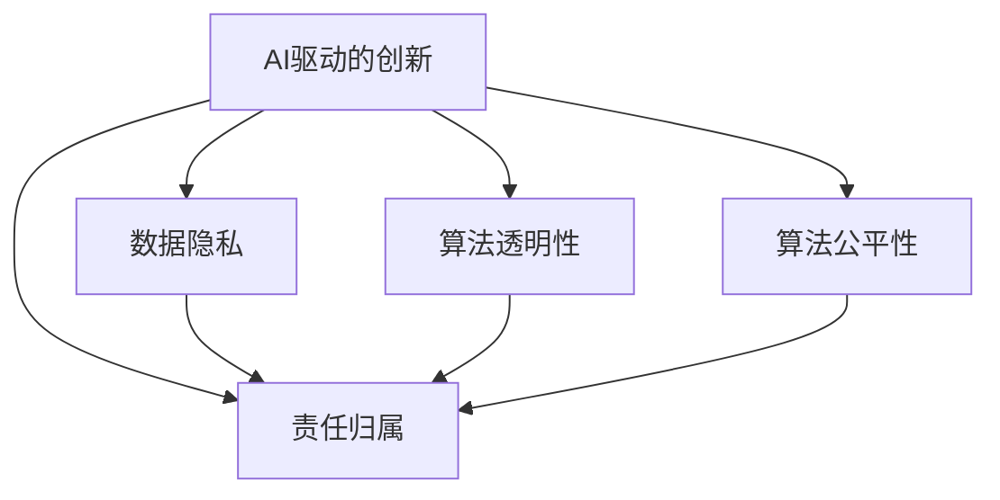

                 

# AI驱动的创新：人类计算在商业中的道德考虑因素与趋势预测

## 1. 背景介绍

### 1.1 问题由来

随着人工智能(AI)技术的迅猛发展，AI驱动的创新正在深刻改变各行各业的运作方式。在商业领域，AI技术的广泛应用带来了显著的效率提升和收益增长，但同时也不可避免地引发了诸多道德和伦理问题。如何平衡技术进步和道德规范，确保AI技术在商业中的健康发展，成为了社会各界关注的焦点。

### 1.2 问题核心关键点

当前，AI驱动的商业创新面临的核心问题主要包括：

- **数据隐私与个人信息保护**：如何在收集和使用数据的过程中，确保用户隐私不受侵犯。
- **算法透明性与可解释性**：确保AI决策过程可被理解，避免“黑箱”效应。
- **偏见与歧视**：防止AI模型在训练过程中引入偏见，导致不公正的决策。
- **就业与经济影响**：AI技术的广泛应用可能对劳动市场造成冲击，引发就业和经济问题。
- **安全和可靠性**：确保AI系统稳定运行，避免因错误决策导致严重后果。
- **伦理与法律框架**：制定合适的伦理和法律规范，引导AI技术的健康发展。

### 1.3 问题研究意义

研究和解决这些道德问题，不仅能够促进AI技术的良性发展，更能够确保AI技术在商业应用中的合规性和安全性。这不仅有助于保护用户权益，也能够增强公众对AI技术的信任和接受度，推动AI技术的广泛应用。

## 2. 核心概念与联系

### 2.1 核心概念概述

为更好地理解AI驱动的商业创新及其道德考虑，本节将介绍几个关键概念：

- **AI驱动的创新**：指通过机器学习、深度学习等人工智能技术，实现自动化、智能化、个性化的业务创新。
- **人类计算**：利用人类智慧与计算能力相结合的方式，提升AI模型的精度和泛化能力。
- **数据隐私**：指在数据收集、存储、处理和传输过程中，确保用户个人信息不被泄露或滥用。
- **算法透明性**：指确保AI模型的决策过程可以被透明理解和解释，便于监督和审查。
- **算法公平性**：指AI模型在训练和应用过程中，不因种族、性别、年龄等特征而产生偏见，确保决策公平。
- **责任归属**：指明确AI系统在执行决策时的责任主体，确保在出现问题时能够追究责任。

这些概念之间的逻辑关系可以通过以下Mermaid流程图来展示：



这个流程图展示了大语言模型的核心概念及其之间的关系：

1. AI驱动的创新通过数据、算法和人类计算实现，其中数据隐私、算法透明性、算法公平性和责任归属是重要的伦理保障。
2. 数据隐私保护是基础，确保数据的安全和合规使用。
3. 算法透明性和算法公平性是关键，确保AI模型决策的公正和透明。
4. 责任归属是保障，明确AI系统的责任，增强可追溯性和问责机制。

## 3. 核心算法原理 & 具体操作步骤
### 3.1 算法原理概述

AI驱动的商业创新，主要依赖于深度学习、强化学习、自然语言处理等前沿AI技术。其核心算法原理包括以下几个方面：

- **数据驱动的模型训练**：通过收集大量的商业数据，利用机器学习算法训练出高效准确的AI模型。
- **特征工程与优化**：利用人类计算，对数据进行特征提取和优化，提升模型性能。
- **模型部署与监控**：将训练好的AI模型部署到实际商业环境中，持续监控其运行状态和性能。
- **反馈与迭代优化**：根据实际业务反馈，持续迭代优化AI模型，确保其适应性。

### 3.2 算法步骤详解

AI驱动的商业创新过程主要包括以下关键步骤：

**Step 1: 数据收集与预处理**
- 收集商业领域的各类数据，如用户行为、交易记录、市场动态等。
- 对数据进行清洗、去噪、归一化等预处理，确保数据质量。

**Step 2: 模型设计与训练**
- 选择合适的AI模型架构，如卷积神经网络(CNN)、循环神经网络(RNN)、Transformer等。
- 使用优化算法（如随机梯度下降、Adam）训练模型，最小化损失函数。
- 引入正则化技术（如L2正则、Dropout），防止过拟合。

**Step 3: 模型评估与验证**
- 在验证集上评估模型性能，如准确率、召回率、F1值等。
- 根据评估结果调整模型超参数，如学习率、批大小、迭代次数等。

**Step 4: 模型部署与监控**
- 将训练好的模型部署到实际业务系统中，如电商平台、金融系统等。
- 实时监控模型性能，确保其在生产环境中的稳定运行。
- 定期收集反馈数据，用于模型迭代优化。

**Step 5: 反馈与迭代优化**
- 根据业务反馈，调整模型参数或设计新的模型架构。
- 重复训练、评估和部署过程，逐步提升模型效果。

### 3.3 算法优缺点

AI驱动的商业创新具有以下优点：

- **效率提升**：通过自动化、智能化手段，大幅提升业务效率。
- **精准决策**：利用数据分析和算法优化，提供更精准的商业决策支持。
- **成本节约**：减少人工干预，降低运营成本。

同时，也存在以下缺点：

- **数据隐私风险**：大量商业数据的收集和处理可能侵犯用户隐私。
- **算法透明性不足**：AI模型决策过程复杂，难以解释。
- **模型偏见问题**：模型可能学习到数据中的偏见，导致不公正决策。
- **模型稳定性问题**：复杂模型可能在极端情况或噪声干扰下出现不稳定现象。
- **伦理法律风险**：模型应用可能引发伦理和法律问题，需要严格规范。

### 3.4 算法应用领域

AI驱动的商业创新在多个领域都有广泛应用，如：

- **电商推荐系统**：利用用户行为数据，推荐个性化商品。
- **金融风险管理**：通过数据分析，预测和预防金融风险。
- **智能客服**：利用自然语言处理，提升客户服务效率和质量。
- **供应链优化**：通过数据分析和优化算法，优化供应链管理。
- **智能制造**：利用机器学习，提升生产效率和质量控制。
- **智能物流**：通过数据分析和路径优化算法，提升物流效率。

## 4. 数学模型和公式 & 详细讲解 & 举例说明
### 4.1 数学模型构建

以下我们以电商平台推荐系统为例，构建基于协同过滤的推荐模型。

记用户集合为 $U$，物品集合为 $I$，用户对物品的评分矩阵为 $R \in \mathbb{R}^{N \times M}$，其中 $N$ 为用户数，$M$ 为物品数。假设用户 $u$ 对物品 $i$ 的评分用 $r_{ui}$ 表示。

**协同过滤模型**：
1. **基于用户的协同过滤**：用户 $u$ 对物品 $i$ 的评分 $r_{ui}$ 由其最相似的 $K$ 个用户 $u_k$ 的评分加权平均得到。
   - $r_{ui} = \sum_{k=1}^K w_k r_{ki}$
   - 权重 $w_k$ 由用户之间的相似度 $s(u,u_k)$ 计算得到。
2. **基于物品的协同过滤**：物品 $i$ 的评分 $r_{ui}$ 由其最相似的物品 $j$ 的评分加权平均得到。
   - $r_{ui} = \sum_{j=1}^K w_j r_{uj}$
   - 权重 $w_j$ 由物品之间的相似度 $s(i,j)$ 计算得到。

**相似度计算**：
- 余弦相似度：$s(u,u_k) = \frac{\sum_{i=1}^M r_{ui}r_{ui_k}}{\sqrt{\sum_{i=1}^M r_{ui}^2} \sqrt{\sum_{i=1}^M r_{ui_k}^2}}$
- 皮尔逊相关系数：$s(u,u_k) = \frac{\sum_{i=1}^M (r_{ui} - \mu_u)(r_{ui_k} - \mu_u)}{\sqrt{\sum_{i=1}^M (r_{ui} - \mu_u)^2} \sqrt{\sum_{i=1}^M (r_{ui_k} - \mu_u)^2}}$

### 4.2 公式推导过程

对于基于用户的协同过滤模型，其评分预测公式为：

$$
\hat{r}_{ui} = \sum_{k=1}^K \alpha_k \frac{\sum_{j=1}^M r_{uj_k}r_{ik_j}}{\sqrt{\sum_{j=1}^M r_{uj_k}^2} \sqrt{\sum_{j=1}^M r_{ik_j}^2}}
$$

其中 $\alpha_k$ 为用户 $u_k$ 的权重，可通过余弦相似度计算得到。

**优化目标**：最小化预测误差，即 $argmin_{r_{ui}} \sum_{i=1}^M \sum_{u=1}^N (r_{ui} - \hat{r}_{ui})^2$。

通过梯度下降等优化算法，最小化上述目标函数，得到 $r_{ui}$ 的估计值。

### 4.3 案例分析与讲解

**案例：电商平台推荐系统**

假设某电商平台有 $N=10^6$ 个用户，$M=10^6$ 种商品，每个用户对每件商品都进行了评分，评分范围为 $1$ 到 $5$。现有 $K=100$ 个用户 $u_k$ 对物品 $i$ 的评分，要求预测用户 $u$ 对物品 $i$ 的评分 $\hat{r}_{ui}$。

1. **数据准备**：从用户评分矩阵 $R$ 中选取 $K$ 个用户，记录其对所有商品的评分。
2. **相似度计算**：计算用户 $u$ 和 $u_k$ 之间的相似度 $s(u,u_k)$，选取 $K$ 个最相似的 $u_k$。
3. **权重计算**：计算每个 $u_k$ 的权重 $\alpha_k$。
4. **评分预测**：利用预测公式计算用户 $u$ 对物品 $i$ 的评分 $\hat{r}_{ui}$。
5. **模型评估**：在验证集上评估模型性能，如均方误差、均方根误差等。
6. **迭代优化**：根据评估结果调整模型参数，如 $K$、$\alpha_k$ 等。

## 5. 项目实践：代码实例和详细解释说明
### 5.1 开发环境搭建

在进行AI驱动的商业创新实践前，我们需要准备好开发环境。以下是使用Python进行TensorFlow开发的环境配置流程：

1. 安装Anaconda：从官网下载并安装Anaconda，用于创建独立的Python环境。

2. 创建并激活虚拟环境：
```bash
conda create -n tf-env python=3.8 
conda activate tf-env
```

3. 安装TensorFlow：根据CUDA版本，从官网获取对应的安装命令。例如：
```bash
conda install tensorflow tensorflow-gpu=2.5 -c conda-forge -c nvidia
```

4. 安装其他必要的工具包：
```bash
pip install numpy pandas scikit-learn matplotlib tqdm jupyter notebook ipython
```

完成上述步骤后，即可在`tf-env`环境中开始AI驱动的商业创新实践。

### 5.2 源代码详细实现

下面我们以电商平台推荐系统为例，给出使用TensorFlow实现协同过滤模型的PyTorch代码实现。

首先，定义数据处理函数：

```python
import numpy as np
import tensorflow as tf

def load_data():
    # 读取用户评分矩阵
    R = np.loadtxt('ratings.csv', delimiter=',')
    # 用户和物品数
    N, M = R.shape
    # 划分训练集和验证集
    train_R = R[:N//2]
    dev_R = R[N//2:]
    return train_R, dev_R
```

然后，定义协同过滤模型的TensorFlow实现：

```python
class CollaborativeFiltering(tf.keras.Model):
    def __init__(self, K=100, num_users=N, num_items=M, seed=42):
        super(CollaborativeFiltering, self).__init__()
        self.K = K
        self.num_users = num_users
        self.num_items = num_items
        # 用户-物品相似度矩阵
        self.U = tf.Variable(tf.random.normal([N, K], seed=seed))
        self.V = tf.Variable(tf.random.normal([K, M], seed=seed))
        self.U_trainable = False
        self.V_trainable = False
        
    def call(self, u, i):
        u_k = tf.linalg.matmul(self.U, tf.random.normal([K, 1]))
        i_k = tf.linalg.matmul(self.V, tf.random.normal([K, 1]))
        s_u_k = tf.reduce_sum(tf.multiply(u_k, i_k), axis=1)
        s_u_k = tf.div(s_u_k, tf.linalg.norm(u_k, axis=1) * tf.linalg.norm(i_k, axis=1))
        s_u_k = tf.reduce_sum(tf.multiply(u, s_u_k), axis=1)
        return tf.div(s_u_k, tf.linalg.norm(u, axis=1) * tf.linalg.norm(i_k, axis=1))
        
    def trainable_variables(self):
        return self.U
```

接着，定义训练和评估函数：

```python
BATCH_SIZE = 64

def train_epoch(model, train_R, dev_R):
    # 定义优化器
    optimizer = tf.keras.optimizers.Adam(learning_rate=0.001)
    # 训练集和验证集
    train_data = (tf.convert_to_tensor(train_R[:, :N//2]), train_R[:, N//2:])
    dev_data = (tf.convert_to_tensor(dev_R[:, :N//2]), dev_R[:, N//2:])
    # 训练循环
    for epoch in range(EPOCHS):
        with tf.GradientTape() as tape:
            # 前向传播
            for i in range(0, len(train_R), BATCH_SIZE):
                batch_U, batch_R = train_data[i:i+BATCH_SIZE]
                batch_I = tf.range(len(batch_U))
                batch_U, batch_I = tf.cast(batch_U, tf.float32), tf.cast(batch_I, tf.int32)
                pred_R = model(batch_U, batch_I)
                # 计算损失
                loss = tf.reduce_mean(tf.square(pred_R - batch_R))
            # 反向传播
            grads = tape.gradient(loss, model.trainable_variables)
            optimizer.apply_gradients(zip(grads, model.trainable_variables))
            # 验证集评估
            for i in range(0, len(dev_R), BATCH_SIZE):
                batch_U, batch_R = dev_data[i:i+BATCH_SIZE]
                batch_I = tf.range(len(batch_U))
                batch_U, batch_I = tf.cast(batch_U, tf.float32), tf.cast(batch_I, tf.int32)
                pred_R = model(batch_U, batch_I)
                dev_loss = tf.reduce_mean(tf.square(pred_R - batch_R))
            print(f'Epoch {epoch+1}, train loss: {loss:.4f}, dev loss: {dev_loss:.4f}')

def evaluate(model, dev_R):
    dev_loss = 0
    for i in range(0, len(dev_R), BATCH_SIZE):
        batch_U, batch_R = dev_data[i:i+BATCH_SIZE]
        batch_I = tf.range(len(batch_U))
        batch_U, batch_I = tf.cast(batch_U, tf.float32), tf.cast(batch_I, tf.int32)
        pred_R = model(batch_U, batch_I)
        dev_loss += tf.reduce_mean(tf.square(pred_R - batch_R))
    print(f'Dev loss: {dev_loss:.4f}')
```

最后，启动训练流程并在验证集上评估：

```python
train_R, dev_R = load_data()
EPOCHS = 10

# 初始化模型
model = CollaborativeFiltering()
# 训练循环
train_epoch(model, train_R, dev_R)
# 评估模型
evaluate(model, dev_R)
```

以上就是使用TensorFlow实现协同过滤模型的完整代码实现。可以看到，通过TensorFlow的强大计算图和自动微分能力，我们可以用相对简洁的代码完成模型的构建和训练。

### 5.3 代码解读与分析

让我们再详细解读一下关键代码的实现细节：

**CollaborativeFiltering类**：
- `__init__`方法：初始化模型的超参数，如K、N、M等。
- `call`方法：实现模型的前向传播过程，计算用户和物品之间的相似度。
- `trainable_variables`方法：返回模型需要训练的变量，避免不必要的参数优化。

**train_epoch函数**：
- 定义优化器，如Adam优化器。
- 将训练集和验证集划分为批次，进行迭代训练。
- 在每个批次上，进行前向传播计算损失，反向传播更新模型参数。
- 在验证集上计算损失，评估模型性能。

**evaluate函数**：
- 计算验证集的平均损失，输出结果。

**训练流程**：
- 加载数据集，包括训练集和验证集。
- 定义模型架构，如协同过滤模型。
- 设置训练参数，如超参数、批次大小等。
- 在训练集上进行循环训练，每个epoch结束时输出训练和验证集的损失。
- 在验证集上评估模型性能，输出最终验证集损失。

可以看出，TensorFlow提供了强大的计算图和自动微分功能，能够高效地进行深度学习模型的构建和训练。通过合理的参数设置和优化算法，我们可以构建出高效的AI驱动的商业创新模型。

当然，工业级的系统实现还需考虑更多因素，如模型的保存和部署、超参数的自动搜索、更灵活的任务适配层等。但核心的AI驱动的商业创新方法基本与此类似。

## 6. 实际应用场景
### 6.1 智能客服系统

基于AI驱动的智能客服系统，能够有效提升客户服务效率和质量，减少企业运营成本。智能客服系统通过深度学习和自然语言处理技术，实现对客户问题的高效理解和智能回答。

在技术实现上，可以收集企业内部的客服对话记录，将问题-回答对作为监督数据，在此基础上对预训练语言模型进行微调。微调后的模型能够自动理解用户意图，匹配最合适的答案模板进行回复。对于客户提出的新问题，还可以接入检索系统实时搜索相关内容，动态组织生成回答。如此构建的智能客服系统，能大幅提升客户咨询体验和问题解决效率。

### 6.2 金融风险管理

金融机构需要实时监测市场舆论动向，以便及时应对负面信息传播，规避金融风险。传统的人工监测方式成本高、效率低，难以应对网络时代海量信息爆发的挑战。基于AI驱动的风险管理技术，利用数据分析和机器学习算法，能够实时监测金融市场的波动和风险。

具体而言，可以收集金融领域相关的新闻、报道、评论等文本数据，并对其进行情感分析和主题标注。在此基础上对预训练语言模型进行微调，使其能够自动判断文本属于何种情绪，评估金融市场的风险状况。将微调后的模型应用到实时抓取的网络文本数据，就能够自动监测不同情绪的情感变化趋势，一旦发现负面情绪激增等异常情况，系统便会自动预警，帮助金融机构快速应对潜在风险。

### 6.3 智能推荐系统

当前的推荐系统往往只依赖用户的历史行为数据进行物品推荐，无法深入理解用户的真实兴趣偏好。基于AI驱动的智能推荐系统，通过深度学习技术，能够从用户的文本数据中提取兴趣特征，实现更精准的个性化推荐。

在实践中，可以收集用户浏览、点击、评论、分享等行为数据，提取和用户交互的物品标题、描述、标签等文本内容。将文本内容作为模型输入，用户的后续行为（如是否点击、购买等）作为监督信号，在此基础上微调预训练语言模型。微调后的模型能够从文本内容中准确把握用户的兴趣点。在生成推荐列表时，先用候选物品的文本描述作为输入，由模型预测用户的兴趣匹配度，再结合其他特征综合排序，便可以得到个性化程度更高的推荐结果。

### 6.4 未来应用展望

随着AI驱动的商业创新技术的不断发展，其在更多领域的应用前景将愈加广阔。

在智慧医疗领域，AI驱动的诊断和治疗推荐系统，能够通过分析患者的病历和遗传数据，提供个性化的医疗建议，显著提升诊疗效果。

在智能教育领域，AI驱动的学习推荐系统，能够根据学生的学习行为和反馈，动态调整教学内容和节奏，提供个性化的学习路径，因材施教，促进教育公平，提高教学质量。

在智慧城市治理中，AI驱动的城市管理分析系统，能够通过实时监测城市动态数据，预测和预防各类公共安全事件，提高城市管理的自动化和智能化水平，构建更安全、高效的未来城市。

此外，在企业生产、社会治理、文娱传媒等众多领域，基于AI驱动的商业创新应用也将不断涌现，为传统行业数字化转型升级提供新的技术路径。相信随着技术的日益成熟，AI驱动的商业创新必将在更广阔的应用领域大放异彩。

## 7. 工具和资源推荐
### 7.1 学习资源推荐

为了帮助开发者系统掌握AI驱动的商业创新理论基础和实践技巧，这里推荐一些优质的学习资源：

1. **《深度学习》书籍**：Ian Goodfellow等著，全面介绍了深度学习的基本概念、算法和应用。
2. **Coursera《深度学习》课程**：由Andrew Ng教授主讲，是深度学习领域的经典入门课程。
3. **DeepLearning.ai《深度学习专项课程》**：包含多个深度学习课程，覆盖深度学习的基本概念和应用。
4. **HuggingFace官方文档**：提供了大量的预训练语言模型和微调样例，适合实践学习。
5. **Google AI Blog**：Google AI团队发布的深度学习和技术前沿，涵盖了深度学习应用中的许多经典案例和创新思路。

通过对这些资源的学习实践，相信你一定能够快速掌握AI驱动的商业创新的精髓，并用于解决实际的商业问题。
###  7.2 开发工具推荐

高效的开发离不开优秀的工具支持。以下是几款用于AI驱动的商业创新开发的常用工具：

1. **TensorFlow**：由Google主导开发的开源深度学习框架，生产部署方便，适合大规模工程应用。
2. **PyTorch**：基于Python的开源深度学习框架，灵活动态的计算图，适合快速迭代研究。
3. **Jupyter Notebook**：支持Python和其他多种语言的在线交互式开发环境，适合实验室研究和实验分享。
4. **TensorBoard**：TensorFlow配套的可视化工具，可实时监测模型训练状态，并提供丰富的图表呈现方式。
5. **Weights & Biases**：模型训练的实验跟踪工具，可以记录和可视化模型训练过程中的各项指标，方便对比和调优。

合理利用这些工具，可以显著提升AI驱动的商业创新任务的开发效率，加快创新迭代的步伐。

### 7.3 相关论文推荐

AI驱动的商业创新技术的发展源于学界的持续研究。以下是几篇奠基性的相关论文，推荐阅读：

1. **Deep Learning for NLP**：Yoshua Bengio等著，介绍了深度学习在自然语言处理中的应用。
2. **Attention is All You Need**：Google Research团队提出的Transformer模型，开创了自注意力机制的新范式。
3. **BERT: Pre-training of Deep Bidirectional Transformers for Language Understanding**：Google团队提出的BERT模型，通过大规模预训练提升了NLP任务的性能。
4. **AdaLoRA: Adaptive Low-Rank Adaptation for Parameter-Efficient Fine-Tuning**：AdaLoRA方法，通过自适应低秩适应策略，提高了参数高效的微调效果。
5. **The IllustratedTransformer**：Chelsey等奖著，介绍了Transformer模型的工作原理和实现细节。

这些论文代表了大语言模型微调技术的发展脉络。通过学习这些前沿成果，可以帮助研究者把握学科前进方向，激发更多的创新灵感。

## 8. 总结：未来发展趋势与挑战
### 8.1 总结

本文对AI驱动的商业创新及其道德考虑进行了全面系统的介绍。首先阐述了AI驱动的商业创新在提升商业效率和收益方面的重要作用，同时指出其中面临的诸多道德和伦理问题。其次，从原理到实践，详细讲解了AI驱动的商业创新过程的各个环节，包括数据收集、模型训练、模型评估和部署等。最后，探讨了AI驱动的商业创新在多个行业领域的应用前景，并对未来发展趋势和面临的挑战进行了展望。

通过本文的系统梳理，可以看到，AI驱动的商业创新技术正在深刻改变各行各业的运作方式，带来巨大的商业价值和社会效益。然而，在技术进步的同时，如何平衡技术发展与伦理规范，确保AI技术在商业中的健康发展，是我们需要共同面对的重要课题。

### 8.2 未来发展趋势

展望未来，AI驱动的商业创新技术将呈现以下几个发展趋势：

1. **自动化程度提升**：随着深度学习模型的不断优化，自动化程度将进一步提升，减少人工干预，提高运营效率。
2. **数据融合与集成**：多源数据的融合和集成，能够提供更全面的商业洞察，增强决策的科学性和准确性。
3. **知识图谱与推理**：知识图谱和推理技术的应用，将增强AI模型的逻辑推理能力，提高决策的合理性和公正性。
4. **联邦学习与边缘计算**：联邦学习等新兴技术的应用，将实现模型在本地设备上的训练和推理，降低隐私泄露风险。
5. **多模态学习**：多模态数据的融合学习，将增强AI模型的感知和理解能力，提供更全面的商业服务。
6. **伦理性与可解释性**：AI模型的伦理性与可解释性将成为未来研究的重点，确保模型决策过程的透明性和公平性。

这些趋势凸显了AI驱动的商业创新技术的广阔前景。通过技术创新和伦理规范的协同推进，AI技术必将在商业应用中发挥更大的作用，带来更多社会效益和经济价值。

### 8.3 面临的挑战

尽管AI驱动的商业创新技术取得了显著进展，但在迈向更加智能化、普适化应用的过程中，仍然面临诸多挑战：

1. **数据隐私与安全**：大量数据的收集和使用可能引发数据隐私和安全问题，需要制定严格的数据保护政策。
2. **算法透明性与公平性**：模型决策过程的透明性和公平性不足，可能导致不公正的决策。
3. **技术瓶颈与性能优化**：模型在复杂环境下的鲁棒性和性能优化仍需进一步研究。
4. **伦理与法律问题**：模型应用可能引发的伦理和法律问题，需要制定相应的规范和法律框架。
5. **社会接受度与信任**：公众对AI技术的接受度和信任度仍需提高，需要通过科普和教育增加理解。

只有积极应对这些挑战，不断推进AI驱动的商业创新技术的规范化和标准化，才能确保其在商业应用中的健康发展。

### 8.4 研究展望

面对AI驱动的商业创新技术面临的诸多挑战，未来的研究需要在以下几个方面寻求新的突破：

1. **数据隐私保护**：研究数据加密、匿名化等技术，保护用户隐私。
2. **算法透明性与公平性**：研究可解释性算法和公平性优化方法，确保模型决策的透明性和公正性。
3. **模型鲁棒性与泛化能力**：研究鲁棒性和泛化能力强的算法，提高模型在复杂环境下的表现。
4. **模型伦理与法律框架**：研究伦理与法律框架，确保AI技术的规范应用。
5. **用户参与与反馈机制**：研究用户参与与反馈机制，增强用户对AI技术的理解和信任。

通过这些研究方向的探索，将有助于AI驱动的商业创新技术更好地服务于社会，推动经济和社会的可持续发展。

## 9. 附录：常见问题与解答

**Q1：AI驱动的商业创新是否会对就业造成冲击？**

A: AI驱动的商业创新可能在一定程度上改变传统的工作方式，但对就业的影响是一个复杂的问题。AI技术能够提高生产效率，优化资源配置，带来新的就业机会。同时，AI技术也需要相关人才进行开发和维护，因此对就业市场也将产生积极影响。关键在于如何引导AI技术的合理应用，提升就业质量，避免就业不平等问题。

**Q2：AI驱动的商业创新是否会导致数据隐私风险？**

A: 数据隐私风险是AI驱动的商业创新面临的主要挑战之一。数据隐私保护需要严格的法律法规和技术手段。企业应在数据收集、存储和处理过程中，遵循相关隐私保护法规，采用数据加密、匿名化等技术，确保用户数据的安全。同时，企业应建立透明的数据使用政策，增强用户对数据使用的知情权和控制权。

**Q3：AI驱动的商业创新是否会导致模型偏见问题？**

A: 模型偏见问题是AI驱动的商业创新需要解决的重大挑战。模型偏见来源于数据集和算法设计过程中的不公正和不平衡。为了减少模型偏见，应采用多样化的数据集，对数据进行清洗和处理，避免数据偏差。同时，在设计算法时，应引入公平性约束，确保模型在不同人群中的表现一致。

**Q4：AI驱动的商业创新是否会导致伦理和法律问题？**

A: AI驱动的商业创新需要建立完善的伦理和法律框架，确保其规范应用。企业应制定明确的数据隐私和伦理政策，确保模型训练和应用过程中的透明性和公正性。同时，应建立伦理审查机制，对AI技术的应用进行监督和评估。此外，应制定相应的法律法规，规范AI技术的应用，避免法律风险。

**Q5：AI驱动的商业创新是否会导致安全风险？**

A: AI驱动的商业创新需要确保系统的安全性和可靠性。企业应采用安全加固措施，如数据加密、访问控制等，防止系统被恶意攻击和篡改。同时，应建立完善的应急响应机制，应对可能的安全威胁。此外，应进行定期的安全审计和评估，确保系统的稳定性和安全性。

通过这些问题的解答，可以看到，AI驱动的商业创新在带来巨大商业价值的同时，也带来了诸多道德和伦理问题。只有科学合理地应用AI技术，才能充分发挥其潜力，为社会带来更多正能量。

