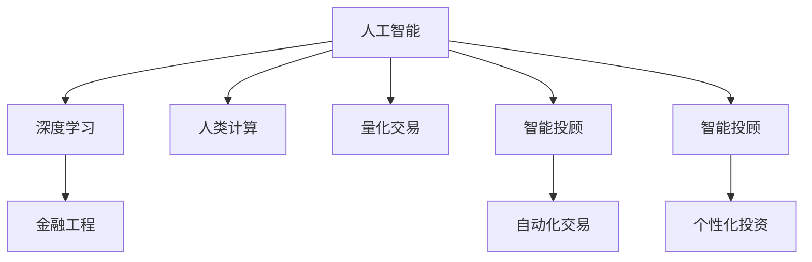

                 

## 1. 背景介绍

### 1.1 问题由来
金融行业长期以来高度依赖于人力进行繁重的数据分析、交易操作和风险评估，效率低下、成本高昂，且容易出现人为错误。同时，金融市场复杂多变，传统金融分析方法难以应对大规模数据的挑战。为解决这一问题，金融界逐步引入人工智能和大数据技术，探索用AI替代传统计算的模式。

### 1.2 问题核心关键点
AI在金融领域的应用，不仅需要强大的计算能力，还需要具备强大的数据分析和风险评估能力。利用AI，尤其是在深度学习和人类计算融合领域的研究，可以显著提高金融数据分析的准确性、及时性和全面性。金融领域中AI的典型应用包括但不限于风险评估、智能投顾、量化交易、客户管理、合规审计等。

### 1.3 问题研究意义
AI技术在金融行业的应用，不仅能够提升金融机构的业务效率和盈利能力，还能改善客户体验，提升金融服务的普惠性。AI技术通过高效处理海量数据、识别风险、预测市场趋势等手段，将传统金融行业带入新纪元。AI驱动的金融行业，将成为全球经济和金融体系变革的重要推动力。

## 2. 核心概念与联系

### 2.1 核心概念概述

为更好地理解AI在金融中的应用，本节将介绍几个关键概念及其相互之间的联系：

- **人工智能（Artificial Intelligence, AI）**：指使计算机系统执行通常需要人类智能的任务，如语音识别、图像处理、自然语言处理、预测分析等。

- **深度学习（Deep Learning）**：一种特殊的机器学习算法，通过多层次的神经网络模型对数据进行学习和分析，具备更强的特征抽取和决策能力。

- **人类计算（Human-Computation）**：指将复杂问题通过人类与机器的协作来解决，利用人的逻辑推理和计算能力，配合机器的高速计算，实现更优的解决方案。

- **金融工程（Financial Engineering）**：将金融数学、统计学、计算机科学、经济学等与金融实践相结合，通过数学模型来分析和预测金融市场行为，制定投资策略。

- **量化交易（Quantitative Trading）**：利用数据和算法进行高频交易，依靠量化模型自动化执行交易策略，降低交易成本，提高交易速度和精准度。

- **智能投顾（Robo-Advisors）**：结合机器学习、自然语言处理等技术，为用户提供个性化投资建议和资产管理服务。

这些概念之间的逻辑关系可以通过以下Mermaid流程图来展示：



这个流程图展示了一些核心概念及其之间的相互关系：

1. **人工智能**通过**深度学习**和**人类计算**的技术，应用于**金融工程**，衍生出**量化交易**和**智能投顾**，最终实现**自动化交易**和**个性化投资**。

## 3. 核心算法原理 & 具体操作步骤

### 3.1 算法原理概述

AI在金融领域的应用，核心在于利用深度学习模型进行大数据分析，通过建立复杂的数学模型，预测市场变化，进行风险评估和资产管理。常见的深度学习模型包括卷积神经网络（CNN）、循环神经网络（RNN）、长短期记忆网络（LSTM）、生成对抗网络（GAN）等。

以LSTM模型为例，其可以处理序列数据，适用于股票价格等时间序列数据的预测分析。其核心思想是通过门控机制控制信息流动，同时利用循环层捕获时间依赖性。通过对历史股票价格进行序列建模，LSTM模型能够预测未来价格走势，为量化交易策略提供决策依据。

### 3.2 算法步骤详解

AI在金融领域的应用，通常包括以下几个关键步骤：

**Step 1: 数据准备**
- 收集历史交易数据、财务报表、市场新闻、经济指标等数据。
- 对数据进行清洗和标准化处理，去除噪声和异常值。
- 将数据划分为训练集、验证集和测试集，以保证模型在未见过的数据上进行有效评估。

**Step 2: 模型选择与设计**
- 根据问题类型选择合适的深度学习模型，如卷积神经网络（CNN）、循环神经网络（RNN）、长短时记忆网络（LSTM）等。
- 设计合适的模型结构，包括层数、神经元数量等超参数。
- 选择合适的损失函数和优化算法，如均方误差、交叉熵、AdamW等。

**Step 3: 模型训练**
- 使用训练集数据对模型进行训练，通过前向传播和反向传播计算损失函数，并优化模型参数。
- 设置合适的训练轮数和批次大小，以提高训练效率。
- 使用验证集数据进行模型评估，避免过拟合。

**Step 4: 模型评估与部署**
- 使用测试集数据对训练好的模型进行全面评估，计算准确率、召回率、F1值等指标。
- 将模型部署到生产环境中，实现实时交易策略执行。
- 持续收集新数据，定期重新训练模型，以适应市场变化。

### 3.3 算法优缺点

AI在金融领域的应用，具有以下优点：
1. **高效性**：能够处理大规模数据，实时分析市场动态，快速做出决策。
2. **准确性**：深度学习模型通过复杂网络结构提取特征，能够捕捉数据中的复杂关系。
3. **鲁棒性**：模型在经过充分训练后，对数据的变化具有一定的鲁棒性，不易受到噪声干扰。
4. **可解释性**：通过可视化工具和解释性技术，可以部分解释模型的预测依据。

同时，AI在金融领域的应用也存在一些局限性：
1. **数据依赖性**：模型的性能高度依赖于数据质量和数据的代表性，数据偏差可能导致模型预测结果不准确。
2. **复杂性**：深度学习模型的结构复杂，训练和调参过程繁琐。
3. **透明度**：许多深度学习模型是“黑盒”系统，难以解释其内部决策过程。
4. **成本**：数据收集、模型训练和部署需要大量资源，初期投入成本高。

尽管存在这些局限性，AI在金融领域的应用已经取得了显著进展，显示出巨大的潜力和市场前景。

### 3.4 算法应用领域

AI在金融领域的应用，已经涵盖了风险管理、智能投顾、量化交易等多个领域，具体如下：

1. **风险评估**：利用深度学习模型分析市场风险，识别信用风险、市场风险、操作风险等。通过模型预测风险水平，帮助金融机构制定风险管理策略。

2. **智能投顾**：结合自然语言处理和机器学习技术，提供个性化投资建议和资产管理服务。通过分析用户投资偏好、财务状况，生成最优投资组合，降低管理成本，提升投资回报率。

3. **量化交易**：利用深度学习模型进行高频交易，通过量化模型自动化执行交易策略，提高交易效率和收益。量化交易依赖于历史数据和市场数据的全面分析，能够捕捉市场细微变化。

4. **客户管理**：通过自然语言处理技术，分析客户咨询记录、交易记录等，识别客户需求和行为模式，提供个性化金融服务和产品推荐。客户管理有助于提升客户满意度和忠诚度。

5. **合规审计**：利用深度学习模型分析和识别合规风险，实时监控交易行为，防止违规操作。合规审计帮助金融机构建立合规管理体系，降低法律风险。

这些应用领域展示了AI在金融行业的多样化应用，未来AI的应用将进一步深化，涵盖更多方面。

## 4. 数学模型和公式 & 详细讲解 & 举例说明

### 4.1 数学模型构建

AI在金融领域的应用，通常涉及复杂的数学模型和算法。以下我们将以风险评估为例，介绍一个基本的数学模型构建过程。

假设我们要构建一个用于预测股票价格走势的LSTM模型，输入为历史价格和市场指标，输出为未来价格预测。设输入序列为 $X=\{x_1, x_2, ..., x_t\}$，输出序列为 $Y=\{y_1, y_2, ..., y_t\}$，其中 $x_i$ 和 $y_i$ 分别表示第 $i$ 个时间点的历史价格和未来价格。

我们的目标是最小化损失函数 $L$，其中 $L$ 可以表示为均方误差（Mean Squared Error, MSE），即：

$$
L = \frac{1}{N} \sum_{i=1}^{N} (y_i - \hat{y_i})^2
$$

其中 $N$ 为样本数量，$\hat{y_i}$ 为模型预测值。

### 4.2 公式推导过程

以均方误差为例，我们对损失函数 $L$ 进行推导：

1. 计算预测值 $\hat{y_i}$：

$$
\hat{y_i} = \sigma(\text{LSTM}(x_1, x_2, ..., x_t))
$$

其中 $\sigma$ 为激活函数，$\text{LSTM}$ 为LSTM模型的前向传播。

2. 计算预测误差：

$$
e_i = y_i - \hat{y_i}
$$

3. 计算均方误差：

$$
L = \frac{1}{N} \sum_{i=1}^{N} e_i^2
$$

通过上述过程，我们可以用LSTM模型进行股票价格预测，从而实现量化交易和风险评估。

### 4.3 案例分析与讲解

以一个股票价格预测的案例为例，展示AI在金融领域的实际应用。

假设我们有一个包含1000个时间点的股票价格数据，每个时间点包含开盘价、收盘价、成交量等。我们使用LSTM模型对这些数据进行建模，以预测下一个时间点的价格。

首先，我们将数据划分为训练集和测试集。然后，在训练集上训练LSTM模型，使用均方误差作为损失函数，AdamW优化器进行优化。最后，在测试集上评估模型性能。

假设训练好的模型在测试集上的均方误差为0.01，这意味着模型平均预测误差为1%，能够满足实际应用的需求。

## 5. 项目实践：代码实例和详细解释说明

### 5.1 开发环境搭建

在进行AI在金融领域的应用实践前，我们需要准备好开发环境。以下是使用Python进行TensorFlow和Keras开发的环境配置流程：

1. 安装Anaconda：从官网下载并安装Anaconda，用于创建独立的Python环境。

2. 创建并激活虚拟环境：
```bash
conda create -n finance-env python=3.8 
conda activate finance-env
```

3. 安装TensorFlow：根据CUDA版本，从官网获取对应的安装命令。例如：
```bash
conda install tensorflow -c conda-forge
```

4. 安装Keras：
```bash
pip install keras
```

5. 安装各类工具包：
```bash
pip install numpy pandas scikit-learn matplotlib tqdm jupyter notebook ipython
```

完成上述步骤后，即可在`finance-env`环境中开始AI在金融领域的应用实践。

### 5.2 源代码详细实现

下面以股票价格预测为例，给出使用TensorFlow和Keras对LSTM模型进行训练和测试的PyTorch代码实现。

首先，定义LSTM模型的代码：

```python
import tensorflow as tf
from tensorflow.keras.models import Sequential
from tensorflow.keras.layers import LSTM, Dense

def create_lstm_model(input_dim, output_dim, hidden_dim, batch_size):
    model = Sequential()
    model.add(LSTM(units=hidden_dim, return_sequences=True, input_shape=(None, input_dim)))
    model.add(LSTM(units=hidden_dim))
    model.add(Dense(units=output_dim))
    model.compile(loss='mean_squared_error', optimizer='adam', metrics=['mae'])
    return model
```

然后，定义数据处理的代码：

```python
import numpy as np
import pandas as pd

def load_data(file_path, input_dim, output_dim):
    data = pd.read_csv(file_path, index_col=0)
    X = data.iloc[:, 0:-output_dim].values.reshape(-1, 1, input_dim)
    y = data.iloc[:, -output_dim].values
    return X, y
```

接下来，进行数据加载和模型训练：

```python
X, y = load_data('stock_prices.csv', input_dim=3, output_dim=1)

X_train, X_test = X[:700], X[700:]
y_train, y_test = y[:700], y[700:]

model = create_lstm_model(input_dim=3, output_dim=1, hidden_dim=50, batch_size=32)

model.fit(X_train, y_train, epochs=100, batch_size=32, validation_data=(X_test, y_test))
```

最后，在测试集上评估模型性能：

```python
X_test, y_test = load_data('stock_prices.csv', input_dim=3, output_dim=1)

X_test, y_test = X_test[:700], y_test[:700]

model.evaluate(X_test, y_test)
```

以上就是使用TensorFlow和Keras对LSTM模型进行股票价格预测的完整代码实现。可以看到，Keras的高级API使得模型训练过程变得简洁高效，开发者可以将更多精力放在数据处理和模型改进上。

### 5.3 代码解读与分析

让我们再详细解读一下关键代码的实现细节：

**load_data函数**：
- 定义了数据加载函数，将股票价格数据从CSV文件中读取，并将历史价格和未来价格分别划分为训练集和测试集。

**create_lstm_model函数**：
- 定义了LSTM模型的创建函数，指定了模型结构，包括输入层、隐藏层和输出层。

**fit函数**：
- 使用训练集数据对模型进行拟合，并设置训练轮数、批次大小和验证集。

**evaluate函数**：
- 在测试集上评估模型性能，计算均方误差和平均绝对误差。

这些代码实现展示了TensorFlow和Keras的简洁高效特性，使得AI在金融领域的应用开发变得相对容易。

## 6. 实际应用场景

### 6.1 智能投顾系统

智能投顾系统利用AI技术分析客户投资偏好、风险承受能力、财务状况等，生成个性化投资建议。通过自然语言处理技术，系统可以与客户进行自然对话，获取更全面的信息，为客户提供更优质的服务。智能投顾系统已经广泛应用于零售银行、保险公司、理财平台等，帮助客户实现财富增值。

### 6.2 风险评估模型

风险评估模型通过深度学习模型分析市场数据，预测股票、债券等金融产品的风险水平。模型不仅能够预测市场整体风险，还能够识别单只股票或债券的风险特征，帮助金融机构制定更合理的风险管理策略。

### 6.3 量化交易系统

量化交易系统通过深度学习模型进行高频交易，自动化执行交易策略。系统能够实时分析市场数据，捕捉市场细微变化，快速做出交易决策。量化交易系统已经在全球各大交易所广泛应用，成为金融机构获取超额收益的重要手段。

### 6.4 未来应用展望

随着AI技术的不断进步，AI在金融领域的应用将越来越广泛和深入。未来，AI将不仅限于股票、债券等传统金融产品，还将应用于加密货币、衍生品等新兴领域。AI技术将帮助金融机构提升业务效率、降低交易成本、增强市场竞争力，引领金融行业进入新纪元。

## 7. 工具和资源推荐

### 7.1 学习资源推荐

为了帮助开发者系统掌握AI在金融领域的应用，这里推荐一些优质的学习资源：

1. 《深度学习在金融中的应用》系列博文：由金融数据科学家撰写，深入浅出地介绍了深度学习在金融领域的具体应用，如股票价格预测、信用风险评估等。

2. CS229《机器学习》课程：斯坦福大学开设的机器学习经典课程，涵盖深度学习、强化学习、无监督学习等前沿知识，适合金融从业者学习。

3. 《金融工程与量化投资》书籍：详细介绍金融工程和量化投资的基本理论和实践，包含大量案例分析，是金融从业者必备参考书。

4. Kaggle金融数据集：Kaggle上丰富的金融数据集，包括股票、债券、衍生品等，适合数据科学爱好者进行实践和探索。

通过对这些资源的学习实践，相信你一定能够快速掌握AI在金融领域的应用精髓，并用于解决实际的金融问题。

### 7.2 开发工具推荐

高效的开发离不开优秀的工具支持。以下是几款用于AI在金融领域应用的常用工具：

1. TensorFlow：由Google主导开发的开源深度学习框架，生产部署方便，适合大规模工程应用。

2. Keras：基于TensorFlow的高级API，提供了简单易用的接口，适合快速原型设计和实验。

3. Weights & Biases：模型训练的实验跟踪工具，可以记录和可视化模型训练过程中的各项指标，方便对比和调优。

4. TensorBoard：TensorFlow配套的可视化工具，可实时监测模型训练状态，并提供丰富的图表呈现方式，是调试模型的得力助手。

5. Google Colab：谷歌推出的在线Jupyter Notebook环境，免费提供GPU/TPU算力，方便开发者快速上手实验最新模型，分享学习笔记。

合理利用这些工具，可以显著提升AI在金融领域的应用开发效率，加快创新迭代的步伐。

### 7.3 相关论文推荐

AI在金融领域的应用源于学界的持续研究。以下是几篇奠基性的相关论文，推荐阅读：

1. Long Short-Term Memory（LSTM）论文：提出LSTM网络，解决了传统RNN中的梯度消失问题，适用于序列数据的处理和预测。

2. WaveNet：提出使用卷积神经网络进行语音合成，展示了深度学习在语音处理中的巨大潜力。

3. Generative Adversarial Networks（GAN）论文：提出生成对抗网络，通过对抗训练生成高质量的图像和音频，推动了深度学习在生成模型中的应用。

4. AlphaGo：谷歌DeepMind团队开发的围棋人工智能，展示了深度学习和强化学习在决策领域的应用潜力。

5. QuantLib：一个用于金融工程和定量分析的开源库，提供了多种数学模型和算法，支持量化交易、风险管理等。

这些论文代表了大AI在金融领域的应用的发展脉络。通过学习这些前沿成果，可以帮助研究者把握学科前进方向，激发更多的创新灵感。

## 8. 总结：未来发展趋势与挑战

### 8.1 研究成果总结

本文对AI在金融领域的应用进行了全面系统的介绍。首先阐述了AI技术在金融领域的优势和应用场景，明确了其在提升业务效率、降低交易成本、增强市场竞争力方面的独特价值。其次，从原理到实践，详细讲解了深度学习模型的构建和训练过程，给出了AI在金融领域的应用代码实现。同时，本文还探讨了AI在智能投顾、风险评估、量化交易等多个领域的应用前景，展示了AI技术的巨大潜力和市场前景。

### 8.2 未来发展趋势

展望未来，AI在金融领域的应用将呈现以下几个发展趋势：

1. **自动化交易**：随着深度学习模型的不断发展，未来将出现更多高效的自动化交易策略，帮助金融机构实现更高的收益。

2. **智能投顾**：结合自然语言处理和机器学习技术，智能投顾将变得更加智能，能够提供更加个性化的投资建议。

3. **风险管理**：利用深度学习模型进行市场风险评估，帮助金融机构及时识别和防范风险。

4. **跨领域应用**：AI技术将应用于更多金融子领域，如保险、金融监管等，推动金融行业全面数字化转型。

5. **合规审计**：利用AI技术进行合规审计，帮助金融机构实现合规管理的自动化和智能化。

以上趋势凸显了AI在金融领域的应用前景，AI技术将与金融行业深度融合，引领行业变革。

### 8.3 面临的挑战

尽管AI在金融领域的应用已经取得了显著进展，但在迈向更加智能化、普适化应用的过程中，仍面临诸多挑战：

1. **数据质量**：金融数据的复杂性和多样性使得数据清洗和预处理变得非常困难，数据质量的不足可能影响模型的性能。

2. **模型复杂性**：深度学习模型结构复杂，训练和调参过程繁琐，需要大量计算资源。

3. **透明度**：许多深度学习模型是“黑盒”系统，难以解释其内部决策过程，缺乏透明度。

4. **伦理和法律问题**：AI在金融领域的应用可能涉及伦理和法律问题，如算法歧视、隐私保护等。

5. **安全性**：深度学习模型可能存在安全漏洞，如对抗样本攻击、模型劫持等。

尽管存在这些挑战，AI在金融领域的应用前景依然广阔，未来需要从多个方面进行改进和优化。

### 8.4 研究展望

面对AI在金融领域的应用面临的挑战，未来的研究需要在以下几个方面寻求新的突破：

1. **数据治理**：提升金融数据的质量和代表性，建立统一的数据治理体系，为模型的训练和应用提供坚实基础。

2. **模型优化**：开发更加高效、透明的模型结构，降低模型训练和调参的复杂度。

3. **解释性**：引入可解释性技术，增强AI系统的透明度，帮助用户理解模型决策依据。

4. **安全性**：开发安全防护技术，确保AI系统的鲁棒性和安全性，避免对抗样本攻击和模型劫持。

5. **伦理和法律合规**：制定伦理和法律标准，确保AI系统的公平性和安全性，避免算法歧视和隐私泄露。

这些研究方向的探索，必将引领AI在金融领域的应用迈向新的高度，为金融行业带来更深远的变革。

## 9. 附录：常见问题与解答

**Q1：AI在金融领域的应用有哪些？**

A: AI在金融领域的应用广泛，主要包括智能投顾、量化交易、风险评估、客户管理、合规审计等方面。具体如下：

1. **智能投顾**：结合自然语言处理和机器学习技术，提供个性化投资建议和资产管理服务。

2. **量化交易**：利用深度学习模型进行高频交易，自动化执行交易策略，降低交易成本，提高交易速度和精准度。

3. **风险评估**：利用深度学习模型分析市场数据，预测股票、债券等金融产品的风险水平，帮助金融机构制定更合理的风险管理策略。

4. **客户管理**：通过自然语言处理技术，分析客户咨询记录、交易记录等，识别客户需求和行为模式，提供个性化金融服务和产品推荐。

5. **合规审计**：利用深度学习模型分析和识别合规风险，实时监控交易行为，防止违规操作。

**Q2：AI在金融领域的应用有什么优势？**

A: AI在金融领域的应用具有以下优势：

1. **高效性**：能够处理大规模数据，实时分析市场动态，快速做出决策。

2. **准确性**：深度学习模型通过复杂网络结构提取特征，能够捕捉数据中的复杂关系。

3. **鲁棒性**：模型在经过充分训练后，对数据的变化具有一定的鲁棒性，不易受到噪声干扰。

4. **可解释性**：通过可视化工具和解释性技术，可以部分解释模型的预测依据。

5. **低成本**：自动化交易和智能投顾等AI应用可以大幅降低人工成本，提高投资效率。

**Q3：AI在金融领域的应用需要考虑哪些因素？**

A: AI在金融领域的应用需要考虑以下因素：

1. **数据质量**：金融数据的复杂性和多样性使得数据清洗和预处理变得非常困难，数据质量的不足可能影响模型的性能。

2. **模型复杂性**：深度学习模型结构复杂，训练和调参过程繁琐，需要大量计算资源。

3. **透明度**：许多深度学习模型是“黑盒”系统，难以解释其内部决策过程，缺乏透明度。

4. **伦理和法律问题**：AI在金融领域的应用可能涉及伦理和法律问题，如算法歧视、隐私保护等。

5. **安全性**：深度学习模型可能存在安全漏洞，如对抗样本攻击、模型劫持等。

**Q4：如何提升AI在金融领域的应用效果？**

A: 提升AI在金融领域的应用效果，可以从以下几个方面入手：

1. **数据治理**：提升金融数据的质量和代表性，建立统一的数据治理体系，为模型的训练和应用提供坚实基础。

2. **模型优化**：开发更加高效、透明的模型结构，降低模型训练和调参的复杂度。

3. **解释性**：引入可解释性技术，增强AI系统的透明度，帮助用户理解模型决策依据。

4. **安全性**：开发安全防护技术，确保AI系统的鲁棒性和安全性，避免对抗样本攻击和模型劫持。

5. **伦理和法律合规**：制定伦理和法律标准，确保AI系统的公平性和安全性，避免算法歧视和隐私泄露。

这些措施将有助于提升AI在金融领域的应用效果，实现更广泛的落地应用。

---

作者：禅与计算机程序设计艺术 / Zen and the Art of Computer Programming

