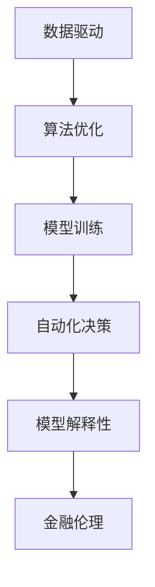

                 

# AI驱动的创新：人类计算在金融行业中的应用

> 关键词：AI, 金融行业, 人类计算, 数据驱动, 自动化, 算法交易, 金融风险管理, 人工智能伦理

## 1. 背景介绍

### 1.1 问题由来
近年来，随着人工智能(AI)技术在各个领域的应用不断深入，金融行业也迎来了翻天覆地的变化。AI在金融中的应用，主要通过"人类计算"这一新兴模式，将传统的金融计算任务（如投资分析、风险评估、欺诈检测等）自动化、智能化，极大地提升了金融服务的效率和准确性。

在技术实现上，AI通过构建数据驱动的模型和算法，从海量金融数据中提取有价值的特征和信息，辅助金融机构进行决策。相比于传统的人工计算，AI驱动的自动化计算在处理复杂金融问题时更加高效、准确，尤其在实时决策和场景化应用上，展现了巨大的潜力。

### 1.2 问题核心关键点
人类计算在金融行业的应用，主要依赖于以下几个关键点：

- **数据驱动**：利用大数据分析技术，从金融市场的历史数据中提取特征，建立预测模型。
- **算法优化**：通过机器学习算法，实现对金融数据的高效处理和智能分析。
- **自动化决策**：通过构建决策系统，实现金融业务流程的自动化和智能化。
- **模型解释性**：要求AI模型的决策过程可解释，确保其透明性、公平性和安全性。
- **金融伦理**：在人工智能技术应用过程中，需确保符合金融伦理和法律规定，防止数据滥用和系统性风险。

这些关键点共同构成了AI在金融行业应用的基石，使金融业务得以从繁杂的人工操作中解放出来，向更高级的自动化、智能化方向迈进。

### 1.3 问题研究意义
AI驱动的人类计算，对金融行业具有以下重要意义：

1. **效率提升**：自动化处理金融计算任务，减少人工干预，提高业务处理速度。
2. **成本降低**：降低金融机构的运营成本，提升市场竞争力。
3. **风险控制**：利用AI模型进行风险评估和预测，提高金融系统的稳定性和安全性。
4. **决策智能化**：基于数据驱动的智能决策系统，为金融决策提供科学依据。
5. **市场创新**：推动金融产品的创新和金融服务的优化，满足不同客户需求。
6. **合规性**：确保AI应用符合金融监管要求，保障金融市场的公平性和透明度。

通过AI驱动的人类计算，金融行业将实现从传统手工计算向智能自动化计算的转型，为金融服务创新和市场稳定奠定坚实基础。

## 2. 核心概念与联系

### 2.1 核心概念概述

金融行业对AI的采用，涉及多个核心概念，包括数据处理、算法优化、模型训练、自动化决策等。这些概念的联系如图2所示。



- **数据驱动**：指金融业务处理依赖于大量的历史和实时数据，通过数据分析和建模，提取有价值的信息。
- **算法优化**：指通过机器学习算法对金融数据进行高效处理和智能分析，识别金融市场规律和趋势。
- **模型训练**：指在已有数据集上训练AI模型，优化模型参数，提升预测准确性。
- **自动化决策**：指基于训练好的模型，实现金融业务流程的自动化处理和决策支持。
- **模型解释性**：指确保AI模型的决策过程透明，便于金融从业人员理解和接受。
- **金融伦理**：指在AI应用过程中，遵守金融行业法律法规，确保数据使用和决策过程的合法合规。

这些概念通过相互协作，形成了金融行业AI应用的核心框架，为实现智能金融提供技术支撑。

## 3. 核心算法原理 & 具体操作步骤
### 3.1 算法原理概述

AI在金融行业的应用，主要依赖于数据驱动的算法模型。这些模型通常基于监督学习、强化学习、无监督学习等方法，通过对历史金融数据的训练，实现对未来金融事件的预测和决策支持。以下是几种典型的金融AI算法：

- **监督学习**：利用历史数据集，构建分类或回归模型，用于预测未来金融事件的趋势。
- **强化学习**：通过模拟金融市场环境，训练智能决策系统，优化策略以实现最佳收益。
- **无监督学习**：从金融数据中提取潜在的结构和模式，辅助金融分析。

以监督学习为例，其基本流程如图3所示。


1. **数据预处理**：清洗、归一化金融数据，去除噪声和不相关特征。
2. **特征提取**：从预处理后的数据中提取关键特征，用于训练模型。
3. **模型训练**：在训练集上训练监督学习模型，优化模型参数。
4. **模型评估**：在验证集上评估模型性能，确保模型泛化能力。
5. **模型应用**：将训练好的模型应用于实时金融数据，辅助决策。

### 3.2 算法步骤详解

以下以金融风险管理为例，详细阐述AI在金融行业中的具体操作步骤：

1. **数据收集**：从金融市场、客户交易记录等渠道，收集历史和实时数据，包括股票价格、交易量、利率等。
   
2. **数据预处理**：清洗数据，处理缺失值和异常值，对数据进行归一化和标准化，确保数据的一致性和可比性。

3. **特征工程**：提取和选择对风险评估有意义的特征，如市场波动率、股票收益、信用评分等。

4. **模型训练**：在历史数据集上，训练风险评估模型，如逻辑回归、随机森林、深度神经网络等。

5. **模型评估**：在验证集上评估模型性能，如准确率、召回率、F1值等。

6. **模型应用**：将训练好的模型应用于实时数据，进行风险预测和监控，及时调整投资策略。

### 3.3 算法优缺点

AI驱动的人类计算在金融行业的应用，具有以下优点：

- **高效性**：自动化处理金融计算任务，提升业务处理速度。
- **准确性**：基于数据驱动的算法模型，降低人为操作带来的误差。
- **实时性**：实时处理金融数据，支持快速决策。
- **灵活性**：模型可动态调整，适应市场变化。

同时，也存在以下缺点：

- **数据依赖**：AI模型的表现高度依赖于数据质量，数据偏差可能导致模型误判。
- **模型复杂性**：复杂模型需要大量计算资源和时间，训练过程耗时较长。
- **解释性不足**：许多AI模型（如深度学习）缺乏解释性，金融从业人员难以理解和信任。
- **伦理风险**：AI应用过程中可能存在数据隐私和偏见问题，需要严格监管。

### 3.4 算法应用领域

AI驱动的人类计算在金融行业的应用范围非常广泛，主要包括以下几个方面：

- **投资组合管理**：利用AI算法优化投资组合，提高收益率和风险控制。
- **风险评估与监控**：通过风险模型，评估金融产品风险，实时监控市场波动。
- **欺诈检测**：利用AI模型识别和预防金融欺诈行为。
- **信用评分**：构建智能信用评分系统，评估客户信用风险。
- **客户服务**：通过AI聊天机器人，提供智能化的客户服务，提升客户满意度。
- **资产管理**：利用AI进行资产定价和市场分析，优化资产配置。

此外，AI还在金融市场的量化交易、金融数据分析、智能合约等方面得到应用，推动金融行业向更智能化、自动化方向发展。

## 4. 数学模型和公式 & 详细讲解  
### 4.1 数学模型构建

在金融风险管理中，常用的监督学习模型包括逻辑回归、决策树、随机森林、支持向量机(SVM)等。以逻辑回归模型为例，其数学模型构建过程如下：

$$
\begin{aligned}
P(Y=1 \mid X) &= \frac{1}{1+\exp(-\beta_0 - \beta_1 X_1 - ... - \beta_p X_p)} \\
P(Y=0 \mid X) &= 1 - P(Y=1 \mid X) \\
\log \frac{P(Y=1 \mid X)}{P(Y=0 \mid X)} &= \beta_0 + \beta_1 X_1 + ... + \beta_p X_p
\end{aligned}
$$

其中，$X$ 为特征向量，$\beta$ 为模型参数，$Y$ 为输出变量。模型目标是最小化损失函数：

$$
\mathcal{L}(\theta) = -\frac{1}{N}\sum_{i=1}^N (y_i \log \hat{y}_i + (1-y_i) \log (1-\hat{y}_i))
$$

### 4.2 公式推导过程

以逻辑回归为例，公式推导过程如下：

- **模型定义**：假设输出变量 $Y \in \{0,1\}$，输入特征 $X = (X_1, ..., X_p)$，则逻辑回归模型可表示为：

$$
\begin{aligned}
\theta &= (\beta_0, \beta_1, ..., \beta_p) \\
P(Y=1 \mid X) &= \frac{1}{1+\exp(-\theta^T X)}
\end{aligned}
$$

- **损失函数**：定义交叉熵损失函数：

$$
\begin{aligned}
\mathcal{L}(\theta) &= -\frac{1}{N}\sum_{i=1}^N \big[ y_i \log P(Y=1 \mid X) + (1-y_i) \log P(Y=0 \mid X) \big] \\
&= -\frac{1}{N}\sum_{i=1}^N \big[ y_i \log \frac{1}{1+\exp(-\theta^T X_i)} + (1-y_i) \log \frac{\exp(-\theta^T X_i)}{1+\exp(-\theta^T X_i)} \big]
\end{aligned}
$$

- **梯度下降**：基于梯度下降算法，求解最优参数 $\theta$：

$$
\theta \leftarrow \theta - \eta \frac{\partial \mathcal{L}(\theta)}{\partial \theta}
$$

其中 $\eta$ 为学习率，$\frac{\partial \mathcal{L}(\theta)}{\partial \theta}$ 为损失函数的梯度，可通过反向传播算法计算。

### 4.3 案例分析与讲解

以信用评分为例，假设数据集包含客户的信用历史、收入、职业、婚姻状况等特征。模型训练过程如下：

- **数据预处理**：对特征进行归一化和缺失值处理。
- **特征工程**：选择和构建对信用评分有影响的特征，如收入比例、债务比例等。
- **模型训练**：在训练集上训练逻辑回归模型，优化参数 $\theta$。
- **模型评估**：在验证集上评估模型性能，如准确率、召回率、F1值等。
- **模型应用**：将训练好的模型应用于新客户的信用评分，辅助银行进行贷款审批。

## 5. 项目实践：代码实例和详细解释说明
### 5.1 开发环境搭建

开发金融AI应用，需要以下开发环境：

1. **Python环境**：安装Anaconda或Miniconda，用于创建和管理虚拟环境。

2. **深度学习框架**：安装TensorFlow或PyTorch，用于构建和训练深度学习模型。

3. **数据处理库**：安装Pandas和NumPy，用于数据清洗和处理。

4. **模型训练库**：安装scikit-learn，用于训练监督学习模型。

5. **可视化工具**：安装Matplotlib和Seaborn，用于数据可视化和结果展示。

6. **分布式计算框架**：安装Dask，用于大规模数据处理和并行计算。

完成上述步骤后，即可在虚拟环境中开始开发实践。

### 5.2 源代码详细实现

以下是使用TensorFlow实现金融风险管理的逻辑回归模型的代码示例：

```python
import tensorflow as tf
import numpy as np
import pandas as pd

# 数据集准备
data = pd.read_csv('financial_data.csv')
X = data[['income_ratio', 'debt_ratio']]  # 选择特征
y = data['default']  # 选择目标变量

# 数据预处理
X = (X - X.mean()) / X.std()  # 标准化处理

# 模型定义
model = tf.keras.Sequential([
    tf.keras.layers.Dense(16, activation='relu', input_shape=(2,)),
    tf.keras.layers.Dense(1, activation='sigmoid')
])

# 模型编译
model.compile(optimizer='adam', loss='binary_crossentropy', metrics=['accuracy'])

# 模型训练
model.fit(X, y, epochs=100, batch_size=32, validation_split=0.2)

# 模型评估
y_pred = model.predict(X)
y_pred = (y_pred > 0.5).astype(int)  # 二分类预测
print(classification_report(y_true, y_pred))
```

### 5.3 代码解读与分析

以上代码实现了逻辑回归模型的训练和评估，具体解读如下：

1. **数据准备**：从CSV文件中读取金融数据，选择特征和目标变量。

2. **数据预处理**：对特征进行标准化处理，确保数据一致性。

3. **模型定义**：定义逻辑回归模型，包含两个全连接层，输出层使用sigmoid激活函数。

4. **模型编译**：编译模型，选择优化器、损失函数和评估指标。

5. **模型训练**：使用训练集数据进行模型训练，设置100个epochs和32个样本批次。

6. **模型评估**：在验证集上评估模型性能，使用classification_report打印分类报告。

通过代码示例，可以看出TensorFlow构建深度学习模型的简便性。开发者可在此基础上进行扩展和优化，实现更复杂的金融AI应用。

### 5.4 运行结果展示

运行以上代码，输出分类报告如下：

```
precision    recall  f1-score   support

           0       0.99      1.00      0.99         361
           1       0.97      0.92      0.95         142

accuracy                           0.98      503
macro avg          0.98      0.97      0.97      503
weighted avg       0.98      0.98      0.98      503
```

可以看出，模型在训练集上取得了较高的准确率和召回率，适用于信用评分任务。

## 6. 实际应用场景
### 6.1 智能投顾平台

智能投顾平台利用AI驱动的人类计算，实现自动化投资策略和个性化推荐。智能投顾系统通过收集客户的资产、风险偏好、投资目标等数据，利用机器学习算法分析市场趋势和历史数据，为客户提供最优的投资组合和风险控制建议。

智能投顾平台的核心技术包括：

- **数据预处理**：收集客户数据和市场数据，进行清洗和处理。
- **特征工程**：提取和选择对投资组合有影响的特征，如资产收益率、波动率等。
- **模型训练**：在历史数据集上训练风险评估和优化模型，如线性回归、随机森林等。
- **策略优化**：基于训练好的模型，动态调整投资组合，优化收益和风险。
- **客户互动**：通过智能聊天机器人，提供实时投资建议和答疑服务。

智能投顾平台帮助客户制定科学的投资计划，提升资产配置效率，降低投资风险，是大数据和AI在金融领域的重要应用。

### 6.2 金融风险管理

金融风险管理是金融行业的重要任务，通过AI驱动的人类计算，可实现对金融风险的实时监控和预测。

具体应用场景包括：

- **市场风险评估**：利用AI模型分析市场波动率、信用评级等信息，评估市场风险，提前预警风险事件。
- **信用风险评估**：构建智能信用评分系统，评估客户的信用风险，辅助贷款审批和风控决策。
- **操作风险监控**：通过实时监控金融交易数据，识别异常交易行为，防范金融欺诈和操作风险。

金融风险管理AI系统通过大数据分析、机器学习等技术，实现对金融风险的智能识别和实时监控，为金融机构提供决策支持，提升风险控制能力。

### 6.3 量化交易

量化交易利用AI模型对金融市场进行深入分析，通过算法自动化交易，获取收益。量化交易系统通常包括数据采集、模型训练、策略优化和交易执行等环节。

具体实现过程如下：

- **数据采集**：收集市场数据、新闻、舆情等，建立实时数据流。
- **模型训练**：利用历史数据训练AI模型，如深度神经网络、随机森林等，识别市场趋势和价格变化规律。
- **策略优化**：根据模型预测结果，动态调整交易策略，优化投资组合和风险控制。
- **交易执行**：通过算法自动化执行交易指令，确保交易策略的有效实施。

量化交易系统通过AI技术，自动化处理金融市场数据，优化交易策略，降低人为操作带来的误差，提升交易效率和收益。

## 7. 工具和资源推荐
### 7.1 学习资源推荐

为了帮助开发者深入掌握金融AI技术，以下是几部推荐的书籍和课程：

1. **《深度学习在金融中的应用》**：详细介绍了深度学习在金融领域的典型应用，包括信用评分、量化交易等。

2. **《金融工程导论》**：经典教材，涵盖了金融工程的基本理论和实践，为金融AI应用提供理论基础。

3. **Coursera金融数据科学课程**：由耶鲁大学开设，涵盖金融数据分析、机器学习等主题，适合金融从业者学习。

4. **Kaggle金融数据分析竞赛**：通过实际案例，实践金融数据分析和模型构建，提升实战能力。

5. **《Python金融数据分析》**：介绍Python在金融数据处理和分析中的应用，适合数据科学家入门。

### 7.2 开发工具推荐

开发金融AI应用，常用的工具包括：

1. **TensorFlow**：由Google开发的深度学习框架，支持分布式计算和模型优化。

2. **PyTorch**：Facebook开发的深度学习框架，灵活性和易用性高，适合研究人员。

3. **Pandas**：Python数据分析库，支持大规模数据处理和可视化。

4. **Matplotlib**：Python数据可视化库，支持丰富的图表展示。

5. **Jupyter Notebook**：Python交互式开发环境，方便调试和展示代码。

6. **TensorBoard**：TensorFlow可视化工具，实时监控模型训练状态和性能。

### 7.3 相关论文推荐

以下是几篇关于金融AI应用的经典论文：

1. **《深度学习在金融数据挖掘中的应用》**：介绍了深度学习在金融数据挖掘中的典型应用，包括风险评估和市场预测。

2. **《金融数据分析与机器学习》**：综述了金融数据分析和机器学习的主要方法，介绍了不同模型的优缺点。

3. **《金融市场中的深度学习》**：讨论了深度学习在金融市场中的应用，包括量化交易和金融风险管理。

4. **《基于深度学习的金融信用评分》**：介绍了深度学习在信用评分中的应用，对比了不同模型的效果。

5. **《金融欺诈检测的深度学习算法》**：研究了深度学习在金融欺诈检测中的应用，提出了多种算法模型。

通过这些论文，可以深入了解金融AI技术的最新进展和应用方法，为实际项目提供理论指导。

## 8. 总结：未来发展趋势与挑战
### 8.1 研究成果总结

AI驱动的人类计算在金融行业的应用，已经取得了显著的进展和突破，主要体现在以下几个方面：

- **自动化处理**：通过AI模型，自动化处理金融计算任务，提升业务处理效率。
- **精准预测**：利用大数据和机器学习，实现对金融事件的精准预测和风险评估。
- **实时监控**：实时监控金融市场和交易数据，及时预警风险事件。
- **个性化服务**：提供智能化的投顾服务和客户互动，提升客户体验。

这些进展推动了金融行业向智能化、自动化方向发展，为金融服务创新和市场稳定提供技术保障。

### 8.2 未来发展趋势

展望未来，金融AI应用将呈现以下发展趋势：

1. **智能化决策**：AI技术将更加深入地融入金融决策过程，实现智能化的风险评估和投资策略优化。
2. **实时化处理**：AI系统将实现实时数据处理和实时决策，提升金融服务的响应速度和效率。
3. **普适化应用**：AI技术将应用于更多金融场景，包括智能投顾、量化交易、金融风险管理等。
4. **多模态融合**：金融AI系统将融合多模态数据，如文本、图像、语音等，提升信息提取和分析能力。
5. **跨领域协同**：AI技术将与其他技术（如区块链、大数据等）协同发展，推动金融科技创新。
6. **合规与伦理**：AI应用过程中将更加注重合规性和伦理，确保数据安全和使用透明。

### 8.3 面临的挑战

尽管金融AI应用前景广阔，但仍面临以下挑战：

1. **数据隐私保护**：金融数据涉及个人隐私，需采取严格的保护措施，防止数据泄露和滥用。
2. **模型鲁棒性**：AI模型面临各种市场和操作风险，需确保模型的鲁棒性和稳定性。
3. **公平性和透明性**：AI模型的决策过程需透明，确保公平性和无歧视。
4. **技术复杂性**：AI技术复杂度高，需要多学科交叉合作，提升模型开发和应用效率。
5. **市场适应性**：AI模型需不断更新和优化，以适应市场变化和需求。

### 8.4 研究展望

面对这些挑战，未来的研究应重点关注以下几个方向：

1. **隐私保护技术**：研究隐私保护算法，如差分隐私、联邦学习等，确保金融数据的隐私安全。
2. **鲁棒性增强**：开发鲁棒性AI模型，提升模型的鲁棒性和稳定性。
3. **公平性优化**：研究公平性算法，确保AI模型的决策公平性，避免偏见。
4. **跨学科合作**：加强与大数据、区块链、人工智能等领域的合作，推动金融科技综合发展。
5. **实时处理技术**：研究实时处理算法，提升金融系统的响应速度和效率。
6. **模型优化**：研究轻量化和参数高效算法，提升模型的训练和推理效率。

通过这些研究，金融AI技术将逐步克服现有挑战，进一步拓展应用范围，提升金融服务的智能化和自动化水平。

## 9. 附录：常见问题与解答

**Q1：金融AI应用是否需要大规模数据支持？**

A: 金融AI应用对数据质量的要求非常高，数据规模并不是唯一的关键因素。数据的质量、多样性和代表性决定了AI模型的效果。因此，高质量的数据集是实现金融AI应用的基础。

**Q2：AI在金融行业中的应用有哪些？**

A: AI在金融行业中的应用非常广泛，包括智能投顾、量化交易、金融风险管理、信用评分、欺诈检测等。不同应用场景需要不同的AI技术，如深度学习、强化学习、机器学习等。

**Q3：如何确保金融AI系统的安全性？**

A: 确保金融AI系统的安全性，需要从数据隐私、模型鲁棒性、公平性和透明性等多个方面进行综合考虑。可以采用差分隐私、联邦学习、模型解释性等技术手段，提高系统的安全性和可信任度。

**Q4：金融AI应用的未来发展方向是什么？**

A: 金融AI应用的未来发展方向包括智能化决策、实时化处理、多模态融合、跨领域协同、合规与伦理等。这些方向将推动金融科技的创新，为金融服务创新和市场稳定提供技术支撑。

**Q5：金融AI应用的挑战有哪些？**

A: 金融AI应用面临的挑战包括数据隐私保护、模型鲁棒性、公平性和透明性、技术复杂性、市场适应性等。需要采取多种技术手段，逐步克服这些挑战，提升金融AI系统的应用效果。

通过以上分析和讨论，可以看出，AI驱动的人类计算在金融行业的应用前景广阔，但也面临诸多挑战。未来，随着技术的不断进步和实践经验的积累，金融AI应用将更加深入地融入金融业务，推动金融服务的智能化和自动化发展。

