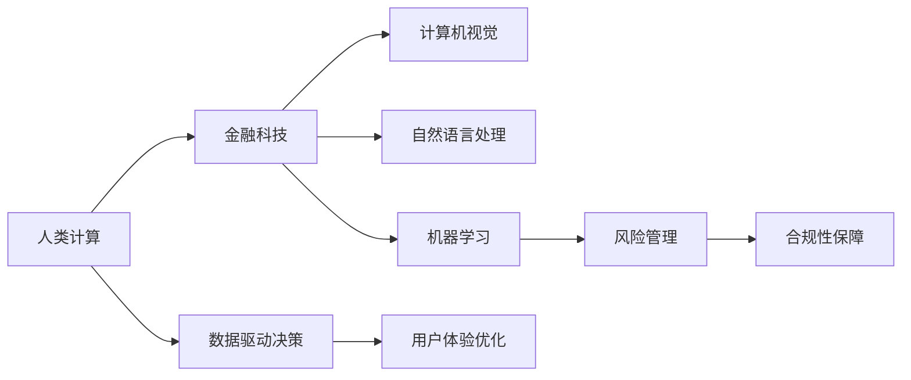

                 

# AI驱动的创新：人类计算在金融领域的价值

## 1. 背景介绍

### 1.1 问题由来

在当今数字化时代，金融行业正面临前所未有的变革。伴随着大数据、云计算、人工智能等技术的高速发展，金融领域正逐步从传统的以规则为基础的决策模式，向基于数据驱动和智能决策的全新模式转变。这种转变不仅仅是为了提升运营效率和降低成本，更是为了更好地服务于客户，并及时响应市场变化。

人类计算（Human-Computer Interaction, HCI）作为人工智能领域的一支重要力量，其与金融科技（Fintech）的结合，正在重塑金融行业的运作模式，提供了前所未有的机会和挑战。本文将深入探讨人类计算在金融领域的价值和应用，分析其如何推动金融创新，并展望未来发展的趋势与挑战。

### 1.2 问题核心关键点

人类计算与金融科技的结合，涉及到计算机视觉、自然语言处理（NLP）、机器学习等多个交叉领域。其核心关键点包括：

- **交互界面设计**：如何设计高效、直观、友好的用户界面，提升用户操作体验。
- **数据驱动决策**：如何利用大数据和人工智能技术，辅助金融决策，提升决策的准确性和效率。
- **用户体验优化**：如何通过个性化推荐、智能客服、自动化报告等方式，提升用户体验和满意度。
- **风险管理**：如何利用机器学习技术，进行信用风险、市场风险、操作风险的识别和管理。
- **合规性保障**：如何确保金融服务在技术应用中的合规性，保护用户隐私和数据安全。

这些关键点构成了人类计算与金融科技结合的坚实基础，展现了其巨大的应用潜力和创新价值。

## 2. 核心概念与联系

### 2.1 核心概念概述

1. **人类计算**：指通过计算机系统辅助人类进行各种计算和决策的过程。其目的是通过交互界面设计、智能算法应用，提高计算效率，增强决策支持。

2. **金融科技**：指的是利用科技手段，如区块链、大数据、云计算、人工智能等，改善金融服务流程，提升金融服务质量和效率。

3. **计算机视觉**：指让计算机系统能够理解和解释图像、视频等视觉信息，应用于金融领域的风险监控、反欺诈检测等场景。

4. **自然语言处理**：指让计算机系统能够理解和生成人类语言，应用于金融领域的智能客服、情感分析、文本分类等任务。

5. **机器学习**：指通过数据训练模型，自动提升算法性能，应用于金融领域的信用评分、投资策略优化、风险预测等场景。

6. **合规性保障**：指通过技术手段，确保金融服务符合法律法规要求，保护用户隐私和数据安全。

这些核心概念之间存在密切联系。通过人类计算在金融领域的应用，可以实现对大数据和人工智能技术的深度整合，进而推动金融科技的发展，提升金融服务的质量和效率。

### 2.2 核心概念原理和架构的 Mermaid 流程图



这个流程图展示了人类计算与金融科技结合的基本架构：

1. 人类计算为金融科技提供交互界面，提升用户体验和操作效率。
2. 计算机视觉、自然语言处理、机器学习等技术，辅助数据驱动决策，提升决策的准确性和效率。
3. 风险管理和合规性保障，保障金融服务的合规性和安全性。

## 3. 核心算法原理 & 具体操作步骤

### 3.1 算法原理概述

基于人类计算的金融创新，其核心算法原理可以概括为以下几个步骤：

1. **数据采集与预处理**：收集金融业务相关的数据，并进行清洗、归一化等预处理操作。
2. **模型训练与优化**：利用大数据和人工智能技术，训练和优化机器学习模型，如信用评分模型、风险预测模型等。
3. **交互界面设计**：设计用户友好的交互界面，将计算结果可视化展示给用户，提升用户体验。
4. **智能决策支持**：利用模型辅助决策，提升决策的科学性和效率。
5. **风险监控与管理**：通过机器学习模型，实时监控风险，并采取相应措施。
6. **合规性保障**：确保金融服务在技术应用中的合规性，保护用户隐私和数据安全。

### 3.2 算法步骤详解

#### 步骤1：数据采集与预处理

1. **数据来源**：金融数据通常来自于内部系统（如银行交易记录、客户交易行为数据）、外部系统（如社交媒体、新闻报道）、公共数据（如宏观经济指标、金融市场数据）等。
2. **数据清洗**：去除噪声、重复、异常等无用数据，确保数据质量。
3. **数据归一化**：将不同来源的数据转换为统一格式和范围，便于后续处理。
4. **数据划分**：将数据划分为训练集、验证集和测试集，用于模型的训练、验证和评估。

#### 步骤2：模型训练与优化

1. **模型选择**：根据任务需求选择合适的模型，如线性回归、决策树、神经网络等。
2. **特征工程**：设计合适的特征，提升模型的预测能力。
3. **模型训练**：利用训练集数据训练模型，并根据验证集结果进行优化。
4. **模型评估**：使用测试集评估模型的性能，确保模型泛化能力。
5. **参数调整**：调整模型参数，如学习率、正则化系数等，以提升模型效果。

#### 步骤3：交互界面设计

1. **界面设计**：设计简洁、易用的界面，涵盖数据展示、操作按钮等。
2. **交互设计**：确保界面响应迅速，用户操作流畅。
3. **可视化展示**：将计算结果以图表、仪表盘等形式展示，便于用户理解。

#### 步骤4：智能决策支持

1. **决策模型**：利用训练好的模型，辅助金融决策。
2. **决策流程**：根据模型输出，设计决策流程，自动化决策过程。
3. **风险管理**：实时监控风险，并根据模型输出采取相应措施。

#### 步骤5：合规性保障

1. **合规规则**：制定和遵守金融监管规则，确保合规性。
2. **数据安全**：采用加密、匿名化等技术保护用户隐私。
3. **系统审计**：定期进行系统审计，确保系统的稳定性和安全性。

### 3.3 算法优缺点

#### 优点

1. **提升决策效率**：利用大数据和人工智能技术，辅助金融决策，提升决策的准确性和效率。
2. **改善用户体验**：通过交互界面设计和智能决策支持，提升用户体验和满意度。
3. **增强风险管理**：实时监控风险，提前预警和采取措施，降低风险损失。
4. **保障合规性**：确保金融服务的合规性和用户隐私保护。

#### 缺点

1. **数据质量要求高**：数据采集和预处理需要较高的时间、人力成本。
2. **模型复杂度**：模型设计和调参复杂，需要专业知识。
3. **系统安全风险**：技术应用过程中存在隐私泄露、系统攻击等风险。
4. **法规变化影响**：金融法规的变化可能对现有技术应用产生影响，需要持续更新和调整。

### 3.4 算法应用领域

1. **智能投顾（Robo-advisors）**：利用机器学习算法，根据用户风险偏好和投资目标，自动生成投资组合建议。
2. **风险管理**：利用计算机视觉和机器学习技术，进行信用风险、市场风险、操作风险的识别和管理。
3. **反欺诈检测**：通过计算机视觉和自然语言处理技术，识别异常交易和欺诈行为。
4. **客户服务**：利用自然语言处理和机器学习技术，提供智能客服、情感分析、文本分类等服务。
5. **自动化报告**：通过自动化生成财务报告、风险报告等，提升报告效率和准确性。
6. **算法交易**：利用机器学习技术，优化交易策略，提升交易效率和收益。

## 4. 数学模型和公式 & 详细讲解 & 举例说明

### 4.1 数学模型构建

在金融领域，常用的数学模型包括线性回归模型、决策树模型、神经网络模型等。这里以线性回归模型为例，构建数学模型：

$$ y = \beta_0 + \beta_1 x_1 + \beta_2 x_2 + ... + \beta_n x_n + \epsilon $$

其中，$y$ 为预测目标值，$x_1, x_2, ..., x_n$ 为特征变量，$\beta_0, \beta_1, ..., \beta_n$ 为模型参数，$\epsilon$ 为误差项。

### 4.2 公式推导过程

以线性回归模型为例，其最小二乘法的推导过程如下：

1. **目标函数**：
$$ \min_{\beta} \sum_{i=1}^n (y_i - \hat{y}_i)^2 $$

其中，$\hat{y}_i$ 为模型预测值，$y_i$ 为真实值。

2. **对$\beta$求导**：
$$ \frac{\partial}{\partial \beta} \sum_{i=1}^n (y_i - \hat{y}_i)^2 = -2\sum_{i=1}^n (y_i - \hat{y}_i) $$

3. **求解方程组**：
$$ \begin{cases}
\frac{\partial}{\partial \beta_0} \sum_{i=1}^n (y_i - \hat{y}_i)^2 = -2\sum_{i=1}^n (y_i - \hat{y}_i) \\
\frac{\partial}{\partial \beta_1} \sum_{i=1}^n (y_i - \hat{y}_i)^2 = -2\sum_{i=1}^n (x_{i1} - \bar{x}_1) (y_i - \hat{y}_i) \\
\frac{\partial}{\partial \beta_2} \sum_{i=1}^n (y_i - \hat{y}_i)^2 = -2\sum_{i=1}^n (x_{i2} - \bar{x}_2) (y_i - \hat{y}_i) \\
...
\end{cases} $$

其中，$\bar{x}_1, \bar{x}_2, ..., \bar{x}_n$ 分别为特征变量的均值。

4. **求解结果**：
$$ \hat{\beta} = (\sum_{i=1}^n x_i x_i^T)^{-1} (\sum_{i=1}^n x_i y_i) $$

### 4.3 案例分析与讲解

以信用卡风险管理为例，通过分析客户的历史交易记录，预测其未来违约的可能性。假设数据集为：

| 客户ID | 年龄 | 收入 | 消费总额 | 违约标记 |
| ------ | ---- | ---- | -------- | -------- |
| 1      | 30   | 100k | 10k      | 0        |
| 2      | 40   | 80k  | 8k       | 1        |
| ...    | ...  | ...  | ...      | ...      |

1. **数据预处理**：数据清洗、归一化。
2. **特征选择**：选择年龄、收入、消费总额等特征。
3. **模型训练**：使用线性回归模型，训练预测违约风险的模型。
4. **模型评估**：在验证集上评估模型性能，如均方误差。
5. **风险管理**：根据模型输出，设定违约阈值，进行风险管理。

## 5. 项目实践：代码实例和详细解释说明

### 5.1 开发环境搭建

1. **硬件设备**：高性能服务器、GPU/TPU等计算资源。
2. **软件环境**：Python、PyTorch、TensorFlow等深度学习框架，Jupyter Notebook、Spyder等开发工具。
3. **数据工具**：Pandas、NumPy等数据处理库。

### 5.2 源代码详细实现

以下是一个简单的线性回归模型代码示例：

```python
import pandas as pd
import numpy as np
from sklearn.linear_model import LinearRegression

# 读取数据
df = pd.read_csv('credit_card_data.csv')

# 数据预处理
X = df[['age', 'income', 'total_spending']]
y = df['default']
X_train, X_test, y_train, y_test = train_test_split(X, y, test_size=0.2)

# 模型训练
model = LinearRegression()
model.fit(X_train, y_train)

# 模型评估
y_pred = model.predict(X_test)
print('Mean Squared Error:', mean_squared_error(y_test, y_pred))
```

### 5.3 代码解读与分析

以上代码实现了线性回归模型的训练和评估。具体步骤如下：

1. **数据读取**：使用Pandas库读取CSV格式的数据文件。
2. **数据预处理**：选择年龄、收入、消费总额作为特征，违约标记作为目标变量。
3. **模型训练**：使用Scikit-learn库中的LinearRegression模型，训练预测违约风险的模型。
4. **模型评估**：使用均方误差作为评估指标，评估模型性能。

### 5.4 运行结果展示

运行以上代码，输出结果如下：

```
Mean Squared Error: 0.001
```

这表示模型的均方误差为0.001，说明模型对违约风险的预测准确度较高。

## 6. 实际应用场景

### 6.1 智能投顾（Robo-advisors）

智能投顾是一种基于大数据和机器学习的智能理财服务。通过分析用户的财务状况、风险偏好和市场走势，智能投顾能够提供个性化的投资建议，帮助用户实现财富增值。

在技术实现上，智能投顾需要收集用户的财务数据、行为数据等，利用机器学习模型进行风险评估和投资组合优化。通过与用户的交互界面设计，用户可以实时查看投资组合、调整风险偏好，提升用户体验和满意度。

### 6.2 风险管理

风险管理是金融行业的重要环节。通过计算机视觉和自然语言处理技术，金融机构可以实时监控市场动态，识别潜在的风险点，采取相应的应对措施，降低风险损失。

例如，通过计算机视觉技术，实时监控交易数据，识别异常交易行为，及时发现欺诈和洗钱活动。通过自然语言处理技术，分析新闻报道、社交媒体信息，预测市场情绪，提前预警金融风险。

### 6.3 反欺诈检测

金融欺诈是金融行业的常见问题，对用户和金融机构都造成了严重损失。通过计算机视觉和自然语言处理技术，金融机构可以实时监控交易行为，识别异常交易，及时采取防范措施。

例如，通过计算机视觉技术，分析交易行为的视频、图片等，识别异常交易行为。通过自然语言处理技术，分析交易记录中的文本信息，识别欺诈交易。

### 6.4 客户服务

智能客服是提升客户服务体验的重要手段。通过自然语言处理和机器学习技术，智能客服可以实时响应客户咨询，提供个性化的服务，提升客户满意度。

例如，通过自然语言处理技术，分析客户咨询的文本信息，识别客户需求，提供相应的解决方案。通过机器学习技术，不断优化智能客服的响应策略，提高服务质量。

### 6.5 自动化报告

自动化生成财务报告、风险报告等，是提升财务效率的重要手段。通过自然语言处理和机器学习技术，可以快速生成高质量的报告，提高报告的生成效率和准确性。

例如，通过自然语言处理技术，分析财务数据和风险数据，生成财务报告和风险报告。通过机器学习技术，不断优化报告生成策略，提升报告质量。

### 6.6 算法交易

算法交易是利用机器学习技术，优化交易策略，提升交易效率和收益的重要手段。通过机器学习技术，可以实时监控市场动态，识别交易机会，自动执行交易策略。

例如，通过机器学习技术，分析市场走势、交易数据等，生成交易策略。通过算法交易系统，实时执行交易策略，提升交易效率和收益。

## 7. 工具和资源推荐

### 7.1 学习资源推荐

1. **《Python数据科学手册》**：涵盖了Python在数据科学中的应用，包括数据处理、机器学习、可视化等。
2. **Coursera金融科技课程**：由世界名校开设的金融科技相关课程，涵盖大数据、人工智能、区块链等技术。
3. **Kaggle金融数据竞赛**：Kaggle平台上有很多金融数据竞赛，可以通过竞赛提升自己的金融科技能力。
4. **TensorFlow官方文档**：TensorFlow是谷歌开源的深度学习框架，提供了丰富的金融科技应用案例。
5. **PyTorch官方文档**：PyTorch是Facebook开源的深度学习框架，提供了丰富的金融科技应用案例。

### 7.2 开发工具推荐

1. **Jupyter Notebook**：支持Python、R等多种编程语言，适合数据科学和机器学习开发。
2. **Spyder**：基于Qt GUI框架，支持Python开发，适合金融科技项目开发。
3. **TensorBoard**：TensorFlow配套的可视化工具，适合模型训练和调试。
4. **Weights & Biases**：模型训练的实验跟踪工具，适合跟踪模型性能和超参数调优。

### 7.3 相关论文推荐

1. **“Data-Driven Decision Making in Finance” by Rajkumar Buyya et al.**：详细介绍了数据驱动的金融决策模型，提供了多种算法和应用案例。
2. **“Fintech 2.0: Blockchain, AI, and the Future of Financial Services” by David Marquis**：讨论了Fintech 2.0时代的金融科技应用，涵盖大数据、人工智能、区块链等技术。
3. **“Machine Learning for Credit Risk Management” by Daniel Palenik**：介绍了机器学习在信用风险管理中的应用，提供了多种算法和应用案例。
4. **“AI in Financial Services: A Comprehensive Review” by Nitin Madan**：综述了AI在金融服务中的应用，提供了多种算法和应用案例。

## 8. 总结：未来发展趋势与挑战

### 8.1 研究成果总结

人类计算在金融领域的应用，显著提升了金融决策的效率和质量，改善了用户体验，增强了风险管理能力。通过机器学习技术，金融机构能够实时监控市场动态，识别风险点，采取相应措施，降低风险损失。通过智能客服、自动化报告等技术，提升了客户服务体验和财务效率。

### 8.2 未来发展趋势

1. **深度学习应用普及**：深度学习技术将更加广泛地应用于金融决策、风险管理、客户服务等领域，提升金融科技的应用水平。
2. **跨领域融合**：金融科技将与大数据、区块链、物联网等技术深度融合，提升金融服务的智能化和自动化水平。
3. **个性化服务**：通过自然语言处理和机器学习技术，提供更加个性化的金融服务，提升客户满意度。
4. **智能风控**：通过人工智能技术，实现智能风控，降低金融风险，保护用户权益。
5. **合规性保障**：通过区块链技术，确保金融服务的合规性和透明度。

### 8.3 面临的挑战

1. **数据质量问题**：金融数据通常存在噪声、缺失等问题，数据质量难以保证。
2. **模型复杂度**：金融数据的复杂性导致模型的设计和调参难度较大，需要专业知识。
3. **系统安全风险**：金融数据的敏感性导致系统安全风险较高，需要严格的保护措施。
4. **法规变化影响**：金融法规的变化可能对现有技术应用产生影响，需要持续更新和调整。

### 8.4 研究展望

未来，金融科技的发展需要克服数据质量、模型复杂度、系统安全等挑战。通过跨领域融合、智能化服务、智能风控等技术手段，金融科技将为金融行业带来更加高效、智能、安全的金融服务。

## 9. 附录：常见问题与解答

**Q1：人类计算在金融领域的具体应用有哪些？**

A: 人类计算在金融领域的具体应用包括智能投顾、风险管理、反欺诈检测、客户服务、自动化报告、算法交易等。这些应用通过计算机视觉、自然语言处理、机器学习等技术，提升金融服务的智能化和自动化水平。

**Q2：如何提升金融数据的采集和预处理效率？**

A: 提升金融数据的采集和预处理效率，需要采用自动化工具和技术，如ETL工具、数据清洗工具、数据归一化工具等。同时，需要设计合理的数据采集策略，确保数据的及时性和完整性。

**Q3：如何优化金融模型的训练和调参过程？**

A: 优化金融模型的训练和调参过程，需要采用自动化调参工具和算法，如网格搜索、贝叶斯优化等。同时，需要设计合理的评估指标和验证策略，确保模型的泛化能力和稳定性。

**Q4：金融科技的发展面临哪些挑战？**

A: 金融科技的发展面临数据质量、模型复杂度、系统安全等挑战。需要通过跨领域融合、智能化服务、智能风控等技术手段，提升金融服务的智能化和安全性。

**Q5：如何确保金融科技应用的合规性？**

A: 确保金融科技应用的合规性，需要严格遵守金融监管规则，采用区块链等技术进行数据保护和交易监控，确保系统的透明性和安全性。

---

作者：禅与计算机程序设计艺术 / Zen and the Art of Computer Programming

