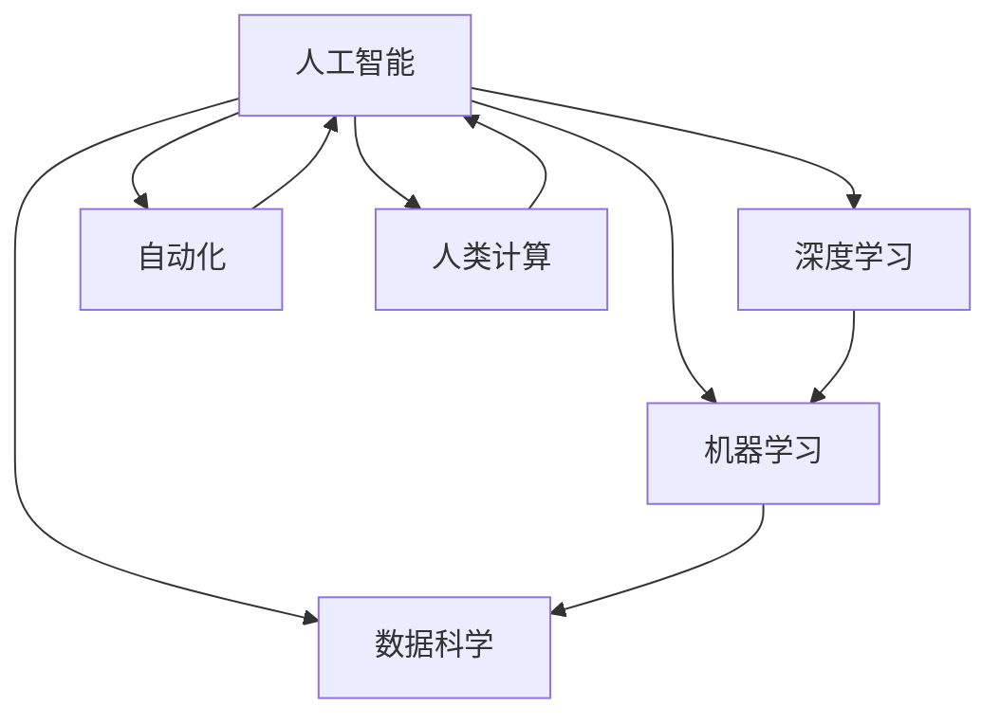

                 

# AI驱动的创新：人类计算的未来

> 关键词：AI, 创新, 人类计算, 数据科学, 机器学习, 深度学习, 自动化

## 1. 背景介绍

在数字化时代，人类计算正经历着前所未有的变革。以人工智能(AI)为驱动力的技术创新，正在改变我们工作、生活、学习的方方面面。本文将深入探讨AI在驱动创新方面的潜力，探讨人类计算未来的发展方向，并揭示其对社会的深远影响。

### 1.1 问题由来

过去十年，AI技术经历了飞速发展，尤其在机器学习、深度学习等领域的突破，为各行各业带来了革命性的变化。AI不仅在图像识别、语音识别、自然语言处理等传统领域取得了显著进展，还在医疗、金融、交通、能源等新兴领域显现出了巨大的应用潜力。AI技术已经成为推动社会进步和经济增长的重要引擎。

然而，AI的发展并非一帆风顺。数据隐私、算法透明度、伦理道德等问题层出不穷，成为阻碍AI技术进一步普及的重大挑战。此外，AI技术的快速迭代，也带来了职业替代、就业结构变化等社会问题。如何在享受AI带来的红利的同时，确保技术的可持续发展，成为当前亟待解决的重要议题。

## 2. 核心概念与联系

### 2.1 核心概念概述

为了深入理解AI在驱动创新方面的作用，本节将介绍几个核心概念及其之间的关系：

- **人工智能(AI)**：使用计算机系统来模拟人类智能的行为，包括学习、推理、感知、自然语言处理等。
- **数据科学(Data Science)**：使用数据和统计方法进行科学决策，涉及数据收集、数据清洗、数据建模、数据可视化等多个环节。
- **机器学习(Machine Learning)**：让计算机通过数据自动学习规律，完成复杂任务。
- **深度学习(Deep Learning)**：一种基于神经网络的机器学习技术，通过多层非线性变换进行数据建模。
- **自动化(Automation)**：使用AI技术自动化执行任务，提升效率和精度。
- **人类计算(Human Computation)**：通过智能技术和人类协作，共同完成复杂计算任务。

这些概念之间的关系可以用以下Mermaid流程图表示：



这个流程图展示了AI与数据科学、机器学习、深度学习、自动化、人类计算等概念之间的联系。

## 3. 核心算法原理 & 具体操作步骤

### 3.1 算法原理概述

AI驱动的创新主要通过以下几个关键步骤实现：

1. **数据收集与预处理**：收集相关数据，进行清洗、归一化、特征提取等预处理。
2. **模型训练与调优**：使用机器学习或深度学习算法，对数据进行建模，并根据验证集结果调整模型参数。
3. **模型部署与应用**：将训练好的模型部署到实际应用场景中，进行数据预测或自动化执行任务。
4. **反馈与迭代**：根据模型输出结果进行反馈，进一步调整模型，提高预测精度或自动化效率。

这些步骤涉及的算法包括监督学习、无监督学习、半监督学习、强化学习、迁移学习等，涵盖数据驱动和经验驱动两个主要方向。

### 3.2 算法步骤详解

#### 3.2.1 数据收集与预处理

- **数据收集**：根据具体应用场景，收集相关数据。例如，医疗领域需要收集病人的病历数据，金融领域需要收集市场交易数据等。
- **数据清洗**：去除数据中的噪声和异常值，确保数据质量。例如，医疗数据中可能存在缺失值或错误编码，需要进行清洗。
- **特征提取**：将原始数据转化为模型可以处理的特征。例如，将文本数据转换为词袋模型或词嵌入向量。

#### 3.2.2 模型训练与调优

- **选择合适的模型**：根据任务类型和数据特点，选择合适的模型架构，如线性回归、决策树、神经网络等。
- **数据划分**：将数据划分为训练集、验证集和测试集，以评估模型性能。
- **模型训练**：使用训练集数据训练模型，优化模型参数。
- **调优**：根据验证集结果，调整模型参数，如学习率、正则化系数等，以提高模型性能。

#### 3.2.3 模型部署与应用

- **模型评估**：在测试集上评估模型性能，确保模型具备良好的泛化能力。
- **模型部署**：将训练好的模型部署到实际应用场景中，例如医疗领域中用于病人诊断，金融领域中用于市场预测等。
- **自动化执行**：使用自动化工具集成模型，自动执行任务。例如，使用API接口实现医疗诊断系统的自动化。

#### 3.2.4 反馈与迭代

- **收集反馈**：根据模型输出结果，收集用户反馈，了解模型效果和用户需求。
- **模型调整**：根据反馈结果，进一步调整模型，提高模型精度或自动化效率。
- **持续优化**：通过迭代更新，不断提升模型性能，适应新的数据分布和任务需求。

### 3.3 算法优缺点

#### 3.3.1 优点

- **高效率**：AI技术可以自动执行复杂计算任务，大幅提升工作效率。
- **高精度**：AI模型能够处理大量数据，通过深度学习等技术，实现高精度的预测和决策。
- **可扩展性**：AI技术可以并行计算，适应大规模数据的处理需求。
- **持续优化**：通过不断收集反馈和迭代，模型性能可以持续提升。

#### 3.3.2 缺点

- **数据依赖**：AI模型的性能高度依赖于数据质量，数据偏差可能导致模型性能下降。
- **黑箱问题**：AI模型通常难以解释其内部决策过程，缺乏透明度。
- **资源消耗**：高精度AI模型需要大量计算资源，可能导致成本高昂。
- **伦理问题**：AI技术可能带来隐私泄露、算法歧视等伦理问题。

### 3.4 算法应用领域

AI技术在多个领域展现了其强大的创新能力，包括但不限于：

- **医疗**：通过图像识别、自然语言处理等技术，辅助医生进行疾病诊断和治疗方案制定。
- **金融**：利用数据分析和预测技术，进行市场风险管理、投资策略制定等。
- **交通**：使用自动驾驶、交通管理等技术，优化交通系统，提升交通安全和效率。
- **制造**：通过自动化生产线和智能检测技术，提升生产效率和质量。
- **教育**：利用个性化推荐和智能辅导系统，提升教育质量和效率。

## 4. 数学模型和公式 & 详细讲解

### 4.1 数学模型构建

AI驱动的创新通常使用数据驱动和经验驱动两种模型构建方式。数据驱动模型依赖于大量的标注数据进行训练，而经验驱动模型则依赖于专家知识和规则进行建模。

#### 4.1.1 数据驱动模型

数据驱动模型通常使用监督学习或无监督学习算法。以监督学习为例，模型通过标注数据集进行训练，学习输入特征与输出标签之间的映射关系。

假设有一个二分类任务，模型输入为 $x$，输出为 $y$，则模型可以表示为：

$$
y = f(x; \theta)
$$

其中 $f$ 为模型函数，$\theta$ 为模型参数。模型的目标是最小化损失函数 $L$，例如交叉熵损失函数：

$$
L(y, \hat{y}) = -y \log \hat{y} - (1 - y) \log (1 - \hat{y})
$$

其中 $\hat{y}$ 为模型的预测结果。

#### 4.1.2 经验驱动模型

经验驱动模型通常使用规则和专家知识进行建模。以专家系统为例，模型通过专家知识库和规则库，对输入数据进行推理和决策。

假设有一个专家系统，输入为 $x$，输出为 $y$，则模型可以表示为：

$$
y = g(x; \pi)
$$

其中 $g$ 为推理函数，$\pi$ 为规则库。模型的目标是根据输入数据，匹配并执行合适的规则。

### 4.2 公式推导过程

#### 4.2.1 监督学习

以线性回归为例，假设有一个回归任务，模型输入为 $x$，输出为 $y$，则模型可以表示为：

$$
y = w_0 + w_1 x_1 + \cdots + w_n x_n
$$

其中 $w_0, w_1, \cdots, w_n$ 为模型参数。模型的目标是最小化均方误差损失函数：

$$
L(y, \hat{y}) = \frac{1}{2} \sum_{i=1}^m (y_i - \hat{y}_i)^2
$$

其中 $m$ 为样本数量，$y_i$ 为真实标签，$\hat{y}_i$ 为模型预测值。

通过求解损失函数最小化问题，得到模型参数的求解公式：

$$
w = (X^T X)^{-1} X^T y
$$

其中 $X$ 为输入特征矩阵，$w$ 为模型参数向量。

#### 4.2.2 深度学习

以神经网络为例，假设有一个多层感知器模型，模型输入为 $x$，输出为 $y$，则模型可以表示为：

$$
y = \sigma(\sigma(\cdots \sigma(w_0 + \sum_{i=1}^n w_i x_i) \cdots)
$$

其中 $\sigma$ 为激活函数，$w_0, w_1, \cdots, w_n$ 为模型参数。模型的目标是最小化损失函数 $L$，例如交叉熵损失函数。

通过反向传播算法，求解模型参数的求解公式：

$$
\frac{\partial L}{\partial w} = \frac{\partial L}{\partial y} \frac{\partial y}{\partial w}
$$

其中 $\frac{\partial y}{\partial w}$ 为激活函数的导数。

### 4.3 案例分析与讲解

#### 4.3.1 医疗诊断

在医疗领域，AI技术可以通过图像识别和自然语言处理技术，辅助医生进行疾病诊断和治疗方案制定。以影像诊断为例，AI模型通过大量影像数据进行训练，学习病灶和正常组织的特征，从而识别出疾病。

假设有一个医学影像分类任务，模型输入为影像特征向量 $x$，输出为疾病标签 $y$，则模型可以表示为：

$$
y = f(x; \theta)
$$

其中 $f$ 为卷积神经网络模型，$\theta$ 为模型参数。模型的目标是最小化交叉熵损失函数：

$$
L(y, \hat{y}) = -y \log \hat{y} - (1 - y) \log (1 - \hat{y})
$$

其中 $\hat{y}$ 为模型的预测结果。

#### 4.3.2 金融预测

在金融领域，AI技术可以通过数据分析和预测技术，进行市场风险管理、投资策略制定等。以股票预测为例，AI模型通过大量历史交易数据进行训练，学习价格变化的规律，从而预测未来的价格趋势。

假设有一个股票价格预测任务，模型输入为历史交易数据 $x$，输出为未来价格 $y$，则模型可以表示为：

$$
y = f(x; \theta)
$$

其中 $f$ 为递归神经网络模型，$\theta$ 为模型参数。模型的目标是最小化均方误差损失函数：

$$
L(y, \hat{y}) = \frac{1}{2} \sum_{i=1}^m (y_i - \hat{y}_i)^2
$$

其中 $m$ 为样本数量，$y_i$ 为真实价格，$\hat{y}_i$ 为模型预测值。

## 5. 项目实践：代码实例和详细解释说明

### 5.1 开发环境搭建

在进行AI项目实践前，我们需要准备好开发环境。以下是使用Python进行TensorFlow开发的环境配置流程：

1. 安装Anaconda：从官网下载并安装Anaconda，用于创建独立的Python环境。

2. 创建并激活虚拟环境：
```bash
conda create -n tf-env python=3.8 
conda activate tf-env
```

3. 安装TensorFlow：根据CUDA版本，从官网获取对应的安装命令。例如：
```bash
pip install tensorflow
```

4. 安装TensorFlow Addons：用于增强TensorFlow的功能，如分布式训练、高性能优化器等。
```bash
pip install tensorflow-addons
```

5. 安装各类工具包：
```bash
pip install numpy pandas scikit-learn matplotlib tqdm jupyter notebook ipython
```

完成上述步骤后，即可在`tf-env`环境中开始AI项目实践。

### 5.2 源代码详细实现

下面我们以股票价格预测为例，给出使用TensorFlow对多层感知器模型进行训练的Python代码实现。

首先，定义模型和优化器：

```python
import tensorflow as tf
from tensorflow.keras import layers, models

# 定义模型
model = models.Sequential([
    layers.Dense(64, activation='relu', input_shape=(features,)),
    layers.Dense(64, activation='relu'),
    layers.Dense(1)
])

# 定义损失函数和优化器
loss_fn = tf.keras.losses.MeanSquaredError()
optimizer = tf.keras.optimizers.Adam()

# 定义评估指标
metrics = [tf.keras.metrics.MeanAbsoluteError()]

# 编译模型
model.compile(optimizer=optimizer, loss=loss_fn, metrics=metrics)
```

然后，加载数据并进行预处理：

```python
import pandas as pd
import numpy as np

# 加载数据
data = pd.read_csv('stock_prices.csv', index_col='date', parse_dates=True)
features = ['open', 'high', 'low', 'volume']
data = data[features]

# 将数据标准化
mean = data.mean()
std = data.std()
data = (data - mean) / std
```

接着，定义训练和评估函数：

```python
from tensorflow.keras.preprocessing.sequence import timeseries_dataset_from_df

# 定义训练和验证数据集
train_data = timeseries_dataset_from_df(data[data.index < end_date], look_back=look_back, shuffle=False, batch_size=batch_size)
val_data = timeseries_dataset_from_df(data[data.index >= end_date], look_back=look_back, shuffle=False, batch_size=batch_size)

# 定义训练和验证函数
def train_step(inputs, targets):
    with tf.GradientTape() as tape:
        predictions = model(inputs)
        loss = loss_fn(targets, predictions)
    gradients = tape.gradient(loss, model.trainable_variables)
    optimizer.apply_gradients(zip(gradients, model.trainable_variables))
    return loss

def val_step(inputs, targets):
    predictions = model(inputs)
    mae = metrics[0](targets, predictions)
    return mae
```

最后，启动训练流程并在测试集上评估：

```python
# 定义训练参数
epochs = 50
look_back = 30
batch_size = 128
end_date = '2023-01-01'

# 定义训练过程
history = model.fit(train_data, validation_data=val_data, epochs=epochs, verbose=1, steps_per_epoch=len(train_data) // batch_size)

# 在测试集上评估模型
test_data = timeseries_dataset_from_df(data[data.index > end_date], look_back=look_back, shuffle=False, batch_size=batch_size)
test_mae = val_step(test_data, test_data)
print(f'Test MAE: {test_mae:.4f}')
```

以上就是使用TensorFlow对多层感知器模型进行股票价格预测的完整代码实现。可以看到，TensorFlow的高级API使得模型构建和训练过程变得简洁高效。

### 5.3 代码解读与分析

让我们再详细解读一下关键代码的实现细节：

**model.compile()方法**：
- `optimizer`：选择优化器，如Adam、SGD等。
- `loss`：定义损失函数，如均方误差、交叉熵等。
- `metrics`：定义评估指标，如平均绝对误差、均方误差等。

**timeseries_dataset_from_df()函数**：
- 用于从DataFrame中生成时序数据集，方便进行时间序列的深度学习建模。

**train_step()和val_step()函数**：
- 用于定义模型的训练和验证过程。
- `with tf.GradientTape() as tape`：开启梯度计算，自动计算损失函数和梯度。
- `optimizer.apply_gradients(zip(gradients, model.trainable_variables))`：更新模型参数，如权重和偏置。
- `loss_fn(targets, predictions)`：计算预测结果与真实标签之间的损失。
- `metrics[0](targets, predictions)`：计算评估指标，如平均绝对误差。

**数据预处理**：
- 使用Pandas加载数据，并设置时间索引。
- 选择特征列进行标准化处理，以提升模型效果。

**训练过程**：
- 使用`fit()`方法进行模型训练，指定训练轮数和批次大小。
- 在每个批次上调用`train_step()`函数进行训练，记录训练损失。
- 在验证集上调用`val_step()`函数进行评估，记录评估指标。

通过以上代码实现，我们可以快速搭建起一个股票价格预测的AI模型，并进行训练和评估。TensorFlow的强大功能使其成为AI项目实践的得力工具。

## 6. 实际应用场景

### 6.1 智能医疗

在智能医疗领域，AI技术可以通过图像识别、自然语言处理等技术，辅助医生进行疾病诊断和治疗方案制定。例如，AI模型可以通过医疗影像数据，识别出肿瘤、病灶等异常情况，辅助医生进行诊断和治疗决策。

AI技术在医疗领域的应用，可以显著提升诊断的准确性和效率，减轻医生的工作负担。例如，谷歌开发的DeepMind Health平台，利用AI技术辅助医生进行医学影像分析，已应用于乳腺癌诊断等多个场景。

### 6.2 金融投资

在金融领域，AI技术可以通过数据分析和预测技术，进行市场风险管理、投资策略制定等。例如，AI模型可以通过历史交易数据和新闻舆情，预测股票价格的趋势，辅助投资者进行投资决策。

AI技术在金融领域的应用，可以显著提升投资决策的科学性和精准性。例如，高盛开发的AI系统Kensho，利用深度学习技术进行市场分析，为投资者提供多维度的决策支持。

### 6.3 自动驾驶

在自动驾驶领域，AI技术可以通过计算机视觉、传感器融合等技术，实现车辆自主导航和决策。例如，特斯拉的Autopilot系统，利用AI技术进行图像识别和路径规划，辅助驾驶员进行驾驶。

AI技术在自动驾驶领域的应用，可以显著提升驾驶的安全性和效率。例如，百度Apollo平台，利用AI技术进行环境感知和路径规划，实现了L4级自动驾驶功能。

## 7. 工具和资源推荐

### 7.1 学习资源推荐

为了帮助开发者系统掌握AI技术的原理和实践，这里推荐一些优质的学习资源：

1. 《深度学习》（Ian Goodfellow）：全面介绍深度学习的基本概念和核心算法，适合初学者和进阶者阅读。
2. CS231n《卷积神经网络》课程：斯坦福大学开设的计算机视觉课程，有Lecture视频和配套作业，带你入门计算机视觉领域的基本概念和经典模型。
3. CS224N《自然语言处理》课程：斯坦福大学开设的自然语言处理课程，涵盖NLP领域的核心算法和应用，适合深度学习爱好者。
4. Coursera《机器学习》课程：由斯坦福大学Andrew Ng教授主讲，全面介绍机器学习的基本概念和算法，适合初学者和进阶者。
5. Kaggle平台：全球最大的数据科学竞赛平台，提供大量公开数据集和竞赛项目，帮助你实践AI技术。

通过这些资源的学习实践，相信你一定能够快速掌握AI技术的精髓，并用于解决实际的AI问题。

### 7.2 开发工具推荐

高效的开发离不开优秀的工具支持。以下是几款用于AI项目开发的常用工具：

1. TensorFlow：由Google主导开发的开源深度学习框架，生产部署方便，适合大规模工程应用。
2. PyTorch：基于Python的开源深度学习框架，灵活动态的计算图，适合快速迭代研究。
3. Keras：高层次的神经网络API，支持TensorFlow、Theano等多种后端，适合快速原型开发。
4. Jupyter Notebook：开源的交互式笔记本环境，支持多种语言和库，适合数据分析和模型实验。
5. GitHub：全球最大的代码托管平台，提供丰富的开源项目和社区支持，适合协作开发和版本控制。

合理利用这些工具，可以显著提升AI项目开发的速度和质量，加速创新迭代的步伐。

### 7.3 相关论文推荐

AI技术在各个领域的应用不断深入，以下是几篇奠基性的相关论文，推荐阅读：

1. AlexNet：ImageNet大规模视觉识别竞赛冠军算法，开创深度学习在计算机视觉领域的应用。
2. LSTM网络：长短期记忆网络，解决了传统RNN模型难以处理长时间序列的问题。
3. Attention机制：自注意力机制，为深度学习模型引入跨层信息交互，显著提升了模型的性能。
4. Generative Adversarial Networks（GAN）：生成对抗网络，用于生成逼真的图像、视频等数据。
5. AlphaGo：谷歌DeepMind开发的AI系统，在围棋游戏中战胜人类冠军，展示了AI在复杂决策问题上的能力。

这些论文代表了大数据、深度学习、计算机视觉、自然语言处理等领域的创新突破，为你深入理解AI技术提供了坚实的基础。

## 8. 总结：未来发展趋势与挑战

### 8.1 总结

本文对AI驱动的创新进行了全面系统的介绍。首先阐述了AI技术在各领域的广泛应用和深远影响，明确了AI技术在驱动社会进步和经济增长方面的重要价值。其次，从原理到实践，详细讲解了AI驱动创新的关键步骤和核心算法，给出了AI项目开发的完整代码实例。同时，本文还广泛探讨了AI技术在医疗、金融、自动驾驶等众多领域的应用前景，展示了AI技术的巨大潜力。

通过本文的系统梳理，可以看到，AI驱动的创新正在深刻改变人类社会，并带来广泛的产业变革。未来，伴随AI技术的持续演进，其在各个领域的创新应用将更加广泛，为经济社会发展注入新的动力。

### 8.2 未来发展趋势

展望未来，AI驱动的创新将呈现以下几个发展趋势：

1. **多模态融合**：AI技术将融合视觉、语音、文本等多种模态数据，提升对复杂场景的感知和理解能力。
2. **自监督学习**：利用无标注数据进行训练，降低对标注数据的需求，提升AI模型的泛化能力。
3. **联邦学习**：在分布式环境下进行模型训练，保护数据隐私，提升模型安全性和可靠性。
4. **对抗攻击与防御**：研究对抗攻击和防御技术，提升AI系统的鲁棒性和安全性。
5. **元学习**：利用少量数据快速学习新任务，提升AI模型的迁移能力和适应性。
6. **因果推断**：引入因果推断方法，增强AI模型建立因果关系的能力，提升模型的可解释性和可信度。

这些趋势凸显了AI技术的广阔前景和深远影响，预示着AI技术在各个领域的应用将更加广泛和深入。

### 8.3 面临的挑战

尽管AI驱动的创新取得了瞩目成就，但在迈向更加智能化、普适化应用的过程中，仍面临诸多挑战：

1. **数据隐私和安全**：AI模型的训练和应用过程中，数据隐私和安全问题不容忽视，如何在保护隐私的同时，充分利用数据价值，是重要的研究方向。
2. **伦理道德**：AI技术可能带来算法偏见、歧视等问题，如何在设计和应用中遵循伦理道德原则，是亟待解决的重要课题。
3. **透明性和可解释性**：AI模型的内部决策过程难以解释，缺乏透明性和可解释性，如何在设计和使用中提升模型的可解释性和可信度，是亟待解决的重要课题。
4. **计算资源和效率**：AI模型的训练和推理过程中，计算资源消耗大，如何优化模型结构和算法，提升计算效率，是重要的研究方向。
5. **跨领域应用**：AI技术在不同领域的应用需要结合领域知识，如何在不同领域中合理设计和应用AI模型，是亟待解决的重要课题。

这些挑战需要在技术、伦理、社会等多方面协同努力，才能实现AI技术的可持续发展。

### 8.4 研究展望

面对AI驱动的创新所面临的诸多挑战，未来的研究需要在以下几个方面寻求新的突破：

1. **跨领域知识融合**：将符号化的先验知识与AI模型相结合，提升模型的泛化能力和适应性。
2. **因果推理**：研究因果推断方法，增强AI模型的因果关系理解能力，提升模型的可解释性和可信度。
3. **联邦学习**：研究分布式训练技术，保护数据隐私，提升模型安全性和可靠性。
4. **对抗攻击与防御**：研究对抗攻击和防御技术，提升AI系统的鲁棒性和安全性。
5. **自监督学习**：利用无标注数据进行训练，降低对标注数据的需求，提升AI模型的泛化能力。
6. **透明性和可解释性**：研究AI模型的透明性和可解释性，提升模型的可信度和应用价值。

这些研究方向将推动AI技术在各个领域的应用，为构建更加智能化、普适化的人类计算系统奠定基础。

## 9. 附录：常见问题与解答

**Q1：AI技术的局限性有哪些？**

A: AI技术的局限性主要包括：
1. **数据依赖**：AI模型的性能高度依赖于数据质量，数据偏差可能导致模型性能下降。
2. **黑箱问题**：AI模型通常难以解释其内部决策过程，缺乏透明度。
3. **资源消耗**：高精度AI模型需要大量计算资源，可能导致成本高昂。
4. **伦理问题**：AI技术可能带来算法偏见、歧视等问题，如何在设计和应用中遵循伦理道德原则，是亟待解决的重要课题。

**Q2：AI技术如何在医疗领域应用？**

A: AI技术在医疗领域的应用主要通过以下几个方面：
1. **医学影像分析**：利用AI模型对医学影像进行分析和诊断，辅助医生进行疾病诊断和治疗方案制定。
2. **自然语言处理**：利用AI模型对医疗文本进行分析和处理，提取有用信息，辅助医生进行疾病诊断和治疗方案制定。
3. **个性化治疗**：利用AI模型对患者数据进行分析，制定个性化治疗方案，提升治疗效果。

**Q3：AI技术在金融领域的应用有哪些？**

A: AI技术在金融领域的应用主要通过以下几个方面：
1. **市场预测**：利用AI模型对市场数据进行分析，预测股票价格、利率等金融指标，辅助投资者进行投资决策。
2. **风险管理**：利用AI模型对市场风险进行评估和管理，制定合理的风险控制策略。
3. **信贷评估**：利用AI模型对借款人进行信用评估，辅助金融机构进行贷款审批。

**Q4：AI技术在自动驾驶领域的应用有哪些？**

A: AI技术在自动驾驶领域的应用主要通过以下几个方面：
1. **环境感知**：利用AI模型对传感器数据进行分析，进行环境感知和目标检测，辅助车辆进行自主导航。
2. **路径规划**：利用AI模型对环境数据进行分析，进行路径规划和决策，辅助车辆进行自主导航。
3. **安全保障**：利用AI模型对安全数据进行分析，进行安全保障和风险控制，提升自动驾驶的安全性和可靠性。

通过以上常见问题的解答，相信你能够更好地理解AI技术的原理和应用，进一步拓展AI技术在各领域的创新应用。

---

作者：禅与计算机程序设计艺术 / Zen and the Art of Computer Programming

