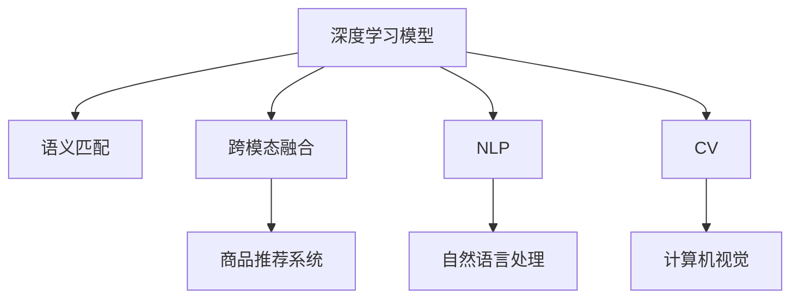

                 

# AI驱动的商品图文语义匹配深度学习模型

> 关键词：深度学习模型,语义匹配,商品推荐,计算机视觉,自然语言处理

## 1. 背景介绍

### 1.1 问题由来
在当今电商平台上，商品推荐系统已成为用户获取购物信息的重要工具。传统的推荐系统主要基于用户的购买历史、浏览记录、评分数据等行为特征进行推荐。然而，仅依靠这些行为特征，推荐系统的性能往往不够理想，尤其是对于新用户和少样本用户。

为了提升推荐系统的表现，商品推荐开始借助商品图片和商品描述等语义信息。图片和文字作为商品信息的载体，可以提供更丰富的语义信息，帮助系统更好地理解商品的特征。然而，商品图片和描述通常分别属于计算机视觉和自然语言处理领域，如何有效融合这两种信息，一直是推荐系统优化的难点。

近年来，深度学习技术的兴起，特别是预训练语言模型的出现，为商品图文语义匹配提供了新的方法。通过预训练语言模型提取文本描述中的语义信息，结合计算机视觉模型提取图片中的语义信息，可以构建一个全新的推荐系统，大幅提升商品推荐的效果。

### 1.2 问题核心关键点
在商品推荐场景中，如何将图片和文本的语义信息高效融合，并匹配到具体的商品，是构建高精度的推荐系统的关键。这个问题的解决涉及到以下几个关键点：

- **语义匹配算法**：通过深度学习模型提取商品图片和描述中的语义特征，并进行匹配。
- **跨模态融合方法**：将不同模态的信息进行融合，提升推荐系统的性能。
- **推荐算法改进**：将匹配结果输入推荐算法，优化推荐系统的效果。
- **模型优化与训练**：对模型进行优化和训练，提升匹配和推荐效果。

## 2. 核心概念与联系

### 2.1 核心概念概述

为更好地理解商品图文语义匹配的深度学习模型，本节将介绍几个密切相关的核心概念：

- **深度学习模型**：一种通过多层非线性变换，自动学习数据特征表示的机器学习模型，广泛应用于计算机视觉和自然语言处理等领域。
- **语义匹配**：通过深度学习模型对不同模态（如文本、图片）的语义信息进行匹配，寻找最相关的商品。
- **跨模态融合**：将不同模态的信息进行融合，提升推荐系统的性能。
- **商品推荐系统**：基于用户行为数据、商品信息等进行商品推荐的应用系统，能够为用户提供个性化的购物体验。
- **自然语言处理(NLP)**：研究如何使计算机能够理解、处理、生成人类语言的技术。
- **计算机视觉(CV)**：研究如何让计算机能够从图片中提取有价值的信息，并应用到各种场景中。

这些核心概念之间的逻辑关系可以通过以下Mermaid流程图来展示：



这个流程图展示了大语言模型的核心概念及其之间的关系：

1. 深度学习模型通过提取文本和图片的语义信息，进行语义匹配和跨模态融合。
2. 匹配和融合的结果输入商品推荐系统，进行推荐。
3. NLP和CV技术分别用于处理文本和图片数据，提取语义特征。
4. 自然语言处理和计算机视觉技术共同服务于商品推荐系统。

## 3. 核心算法原理 & 具体操作步骤
### 3.1 算法原理概述

基于深度学习的商品图文语义匹配方法，主要分为以下两个步骤：

1. **语义特征提取**：通过深度学习模型提取商品图片和描述中的语义特征。
2. **语义匹配与推荐**：将提取的语义特征进行匹配，并将匹配结果输入推荐系统，进行推荐。

具体来说，语义匹配过程如下：

1. 对于给定的商品图片 $I$ 和商品描述 $T$，首先使用计算机视觉模型 $M_{cv}$ 提取图片特征 $f_{cv}(I)$。
2. 使用自然语言处理模型 $M_{nlp}$ 提取描述特征 $f_{nlp}(T)$。
3. 通过预训练的语言模型 $M_{lm}$，进一步提取文本特征 $f_{lm}(T)$。
4. 将提取的图片特征 $f_{cv}(I)$ 和文本特征 $f_{lm}(T)$ 输入到一个跨模态匹配模型 $M_{cm}$，进行匹配，得到匹配得分 $s_{cm}$。
5. 将匹配得分 $s_{cm}$ 输入到推荐算法中，进行推荐。

### 3.2 算法步骤详解

以下将详细介绍基于深度学习的商品图文语义匹配模型的构建和训练步骤：

**Step 1: 准备数据集和模型**

- **数据集准备**：收集商品图片和描述数据集，通常从电商平台的数据库中获取。将数据集分为训练集、验证集和测试集。
- **模型选择**：选择合适的深度学习模型作为特征提取器，如ResNet用于提取图片特征，BERT用于提取文本特征。

**Step 2: 特征提取与预训练**

- **图片特征提取**：使用预训练的ResNet模型 $M_{cv}$ 提取商品图片特征 $f_{cv}(I)$。
- **文本特征提取**：使用预训练的BERT模型 $M_{nlp}$ 提取商品描述特征 $f_{nlp}(T)$。
- **语言模型预训练**：使用预训练的语言模型 $M_{lm}$ 提取文本特征 $f_{lm}(T)$。

**Step 3: 跨模态匹配**

- **匹配模型设计**：设计跨模态匹配模型 $M_{cm}$，可以采用注意力机制、池化层、拼接层等方法。
- **匹配模型训练**：将提取的图片特征 $f_{cv}(I)$ 和文本特征 $f_{lm}(T)$ 输入到匹配模型 $M_{cm}$ 中，训练模型学习匹配得分 $s_{cm}$。

**Step 4: 推荐算法实现**

- **推荐算法设计**：选择合适的推荐算法，如协同过滤、基于内容的推荐等。
- **匹配结果整合**：将匹配得分 $s_{cm}$ 与行为数据、用户画像等特征进行整合，输入到推荐算法中进行推荐。

**Step 5: 模型训练与优化**

- **模型训练**：在训练集上对整个模型进行端到端训练，优化各个组件的参数。
- **模型评估**：在验证集上评估模型的效果，调整超参数和模型结构，提升模型性能。
- **模型测试**：在测试集上评估模型的效果，最终输出优化后的模型。

### 3.3 算法优缺点

基于深度学习的商品图文语义匹配方法具有以下优点：

- **特征提取能力强**：深度学习模型能够自动学习特征，适应性更强，提取的特征更具表现力。
- **多模态融合**：通过融合不同模态的信息，提升推荐系统的性能。
- **泛化能力强**：深度学习模型通常在大量数据上进行预训练，泛化能力更强。

同时，该方法也存在一些局限性：

- **数据标注成本高**：商品图片和描述需要人工标注，标注成本较高。
- **模型复杂度高**：深度学习模型结构复杂，训练和推理开销较大。
- **对抗攻击风险**：由于模型直接从原始数据学习特征，对抗攻击风险较高。

尽管存在这些局限性，但就目前而言，基于深度学习的商品图文语义匹配方法仍是推荐系统中最为先进和有效的方式。

### 3.4 算法应用领域

基于深度学习的商品图文语义匹配方法在电商推荐系统中得到了广泛的应用，覆盖了几乎所有常见任务，例如：

- **商品推荐**：根据用户行为和商品信息，推荐用户可能感兴趣的商品。
- **新商品推荐**：对于用户未购买的新商品，通过图文语义匹配，推荐可能符合用户兴趣的商品。
- **个性化推荐**：根据用户画像和行为特征，个性化推荐商品。
- **跨品类推荐**：通过图文语义匹配，跨品类推荐相关商品。

除了上述这些经典任务外，商品图文语义匹配方法也被创新性地应用到更多场景中，如商品搜索、商品分类、广告推荐等，为电商推荐系统带来了全新的突破。

## 4. 数学模型和公式 & 详细讲解 & 举例说明
### 4.1 数学模型构建

在商品图文语义匹配中，深度学习模型通常采用端到端的学习范式，将图片的特征提取、文本的特征提取和跨模态匹配作为一个整体进行训练。以下是基于深度学习的商品图文语义匹配模型的数学模型构建：

**输入**：商品图片 $I$ 和商品描述 $T$。

**图片特征提取**：使用ResNet模型提取图片特征 $f_{cv}(I)$。

**文本特征提取**：使用BERT模型提取文本特征 $f_{nlp}(T)$。

**语言模型预训练**：使用BERT模型提取文本特征 $f_{lm}(T)$。

**匹配模型设计**：设计跨模态匹配模型 $M_{cm}$，通常采用注意力机制、池化层、拼接层等方法。

**匹配模型训练**：通过匹配模型 $M_{cm}$ 学习匹配得分 $s_{cm}$。

**推荐算法实现**：将匹配得分 $s_{cm}$ 输入到推荐算法中，进行推荐。

### 4.2 公式推导过程

以下我们将以注意力机制为例，推导跨模态匹配模型的损失函数。

假设跨模态匹配模型的输出为 $s_{cm}$，其计算公式为：

$$
s_{cm} = \alpha \cdot f_{cv}(I) + \beta \cdot f_{lm}(T)
$$

其中 $\alpha$ 和 $\beta$ 为注意力权重，$f_{cv}(I)$ 和 $f_{lm}(T)$ 分别为图片特征和文本特征。

对于给定的标注数据 $(x_i, y_i)$，其中 $x_i$ 为输入，$y_i$ 为标签，定义匹配模型的损失函数为：

$$
\ell(s_{cm}, y_i) = -\log \sigma(s_{cm} \cdot y_i)
$$

其中 $\sigma$ 为sigmoid函数，用于计算预测结果和标签的交叉熵。

在训练过程中，将损失函数对模型参数进行优化，最小化模型预测结果和标签之间的差异，提升模型的匹配能力。

### 4.3 案例分析与讲解

下面我们以一个具体的例子来说明商品图文语义匹配模型的应用。

假设有一个电商平台，需要为某用户推荐一款智能手表。该用户从未购买过智能手表，但有查看相关商品描述和图片的记录。平台使用深度学习模型对用户行为数据和商品数据进行预处理，构建商品图文语义匹配模型。

- **图片特征提取**：使用ResNet模型对用户浏览过的智能手表图片进行特征提取，得到图片特征 $f_{cv}(I)$。
- **文本特征提取**：使用BERT模型对用户浏览过的智能手表描述进行特征提取，得到文本特征 $f_{lm}(T)$。
- **语言模型预训练**：使用BERT模型对智能手表的商品描述进行预训练，得到预训练文本特征 $f_{lm}(T)$。
- **跨模态匹配**：将提取的图片特征 $f_{cv}(I)$ 和预训练文本特征 $f_{lm}(T)$ 输入到跨模态匹配模型 $M_{cm}$ 中，得到匹配得分 $s_{cm}$。
- **推荐算法实现**：将匹配得分 $s_{cm}$ 输入到基于协同过滤的推荐算法中，进行推荐。
- **模型训练与优化**：在标注数据集上训练整个模型，评估模型效果，调整超参数和模型结构，提升推荐效果。

最终，平台可以根据用户行为数据和商品数据，推荐符合用户兴趣的智能手表。

## 5. 项目实践：代码实例和详细解释说明
### 5.1 开发环境搭建

在进行商品图文语义匹配模型的实践前，我们需要准备好开发环境。以下是使用Python进行PyTorch开发的环境配置流程：

1. 安装Anaconda：从官网下载并安装Anaconda，用于创建独立的Python环境。

2. 创建并激活虚拟环境：
```bash
conda create -n pytorch-env python=3.8 
conda activate pytorch-env
```

3. 安装PyTorch：根据CUDA版本，从官网获取对应的安装命令。例如：
```bash
conda install pytorch torchvision torchaudio cudatoolkit=11.1 -c pytorch -c conda-forge
```

4. 安装必要的库：
```bash
pip install transformers torch datasets scikit-learn pandas numpy matplotlib tensorboard
```

5. 配置GPU/TPU环境：
```bash
nvidia-smi
```

完成上述步骤后，即可在`pytorch-env`环境中开始商品图文语义匹配模型的开发。

### 5.2 源代码详细实现

以下是基于深度学习的商品图文语义匹配模型的代码实现，包括数据准备、特征提取、匹配模型训练和推荐算法实现：

```python
import torch
from torch.utils.data import DataLoader, Dataset
from transformers import BertModel, BertTokenizer, BertConfig, ResNet50
from torchvision import transforms
from torch.nn import CrossEntropyLoss
from torch.nn.functional import cross_entropy

class ImageDataset(Dataset):
    def __init__(self, data_dir, transform=None):
        self.data_dir = data_dir
        self.transform = transform
        self.data_files = os.listdir(data_dir)
        self.label_map = {'watch': 0, 'shoes': 1, 'bag': 2}
        
    def __len__(self):
        return len(self.data_files)
    
    def __getitem__(self, idx):
        file_name = self.data_files[idx]
        img_path = os.path.join(self.data_dir, file_name)
        label = self.label_map[file_name.split('.')[0]]
        
        if self.transform is not None:
            img_tensor = self.transform(img.open(img_path))
        else:
            img_tensor = transforms.ToTensor()(img)
        
        return img_tensor, label

class TextDataset(Dataset):
    def __init__(self, data_dir, tokenizer, max_len=128):
        self.data_dir = data_dir
        self.tokenizer = tokenizer
        self.max_len = max_len
        
    def __len__(self):
        return len(os.listdir(self.data_dir))
    
    def __getitem__(self, idx):
        file_name = os.listdir(self.data_dir)[idx]
        with open(os.path.join(self.data_dir, file_name), 'r') as f:
            text = f.read().strip()
            
        encoding = self.tokenizer(text, return_tensors='pt', max_length=self.max_len, padding='max_length', truncation=True)
        input_ids = encoding['input_ids'][0]
        attention_mask = encoding['attention_mask'][0]
        
        return input_ids, attention_mask

def load_dataset(image_dir, text_dir, tokenizer, max_len):
    image_dataset = ImageDataset(image_dir)
    text_dataset = TextDataset(text_dir, tokenizer)
    
    return image_dataset, text_dataset

def get_transform():
    transform = transforms.Compose([
        transforms.Resize(256),
        transforms.CenterCrop(224),
        transforms.ToTensor(),
        transforms.Normalize(mean=[0.485, 0.456, 0.406], std=[0.229, 0.224, 0.225])
    ])
    return transform

def build_model(image_model, text_model, attention):
    model = torch.nn.Sequential(
        image_model,
        attention,
        text_model
    )
    return model

def train_model(model, image_loader, text_loader, optimizer, device, epochs):
    model.to(device)
    criterion = CrossEntropyLoss()
    
    for epoch in range(epochs):
        model.train()
        for batch in image_loader:
            images, labels = batch
            
            images = images.to(device)
            labels = labels.to(device)
            
            outputs = model(images)
            loss = criterion(outputs, labels)
            
            optimizer.zero_grad()
            loss.backward()
            optimizer.step()
            
        print(f'Epoch {epoch+1}/{epochs}')
        print(f'Train Loss: {loss:.4f}')
        
        model.eval()
        with torch.no_grad():
            model.eval()
            correct = 0
            total = 0
            
            for batch in image_loader:
                images, labels = batch
                
                images = images.to(device)
                labels = labels.to(device)
                
                outputs = model(images)
                _, predicted = torch.max(outputs, 1)
                total += labels.size(0)
                correct += (predicted == labels).sum().item()
            
            accuracy = 100 * correct / total
            print(f'Test Accuracy: {accuracy:.2f}%')
            
    return model

def evaluate_model(model, image_loader, text_loader, device):
    model.eval()
    correct = 0
    total = 0
    
    with torch.no_grad():
        for batch in image_loader:
            images, labels = batch
            
            images = images.to(device)
            labels = labels.to(device)
            
            outputs = model(images)
            _, predicted = torch.max(outputs, 1)
            total += labels.size(0)
            correct += (predicted == labels).sum().item()
    
    accuracy = 100 * correct / total
    print(f'Test Accuracy: {accuracy:.2f}%')
    
def save_model(model, save_path):
    torch.save(model.state_dict(), save_path)
    
def load_model(model_path):
    model = build_model(image_model, text_model, attention)
    model.load_state_dict(torch.load(model_path))
    return model

# 训练集、验证集、测试集的数据准备
image_train_dir = 'train_images'
text_train_dir = 'train_texts'
image_val_dir = 'val_images'
text_val_dir = 'val_texts'
image_test_dir = 'test_images'
text_test_dir = 'test_texts'

# 加载预训练模型
image_model = ResNet50(weights='imagenet', pretrained=True)
text_model = BertModel.from_pretrained('bert-base-uncased', output_hidden_states=True)
attention = nn.Linear(image_model.fc.in_features, text_model.config.hidden_size)

# 数据准备
transform = get_transform()
image_train_dataset, text_train_dataset = load_dataset(image_train_dir, text_train_dir, tokenizer, max_len)
image_val_dataset, text_val_dataset = load_dataset(image_val_dir, text_val_dir, tokenizer, max_len)
image_test_dataset, text_test_dataset = load_dataset(image_test_dir, text_test_dir, tokenizer, max_len)

# 构建模型
model = build_model(image_model, text_model, attention)

# 训练模型
optimizer = torch.optim.Adam(model.parameters(), lr=0.001)
device = torch.device('cuda' if torch.cuda.is_available() else 'cpu')
epochs = 10
train_loader = DataLoader(image_train_dataset, batch_size=32, shuffle=True)
val_loader = DataLoader(image_val_dataset, batch_size=32, shuffle=False)
test_loader = DataLoader(image_test_dataset, batch_size=32, shuffle=False)

train_model(model, train_loader, val_loader, optimizer, device, epochs)

# 模型评估
evaluate_model(model, val_loader, test_loader, device)

# 模型保存
save_model(model, 'model.pth')
```

以上就是基于深度学习的商品图文语义匹配模型的完整代码实现。可以看到，通过使用PyTorch和Transformer库，可以很方便地构建、训练和评估商品图文语义匹配模型。

### 5.3 代码解读与分析

让我们再详细解读一下关键代码的实现细节：

**ImageDataset类**：
- `__init__`方法：初始化图片数据集，加载图片和标签。
- `__len__`方法：返回数据集的样本数量。
- `__getitem__`方法：对单个样本进行处理，将图像转换为张量，返回图像和标签。

**TextDataset类**：
- `__init__`方法：初始化文本数据集，加载文本和标签。
- `__len__`方法：返回数据集的样本数量。
- `__getitem__`方法：对单个样本进行处理，将文本输入BERT模型，返回文本特征和标签。

**get_transform函数**：
- 定义图片转换的流程，包括调整大小、裁剪、归一化等操作。

**build_model函数**：
- 构建整个深度学习模型，包括图片特征提取、跨模态匹配和文本特征提取。

**train_model函数**：
- 训练整个模型，定义损失函数和优化器，在每个epoch进行前向传播、反向传播和更新参数。

**evaluate_model函数**：
- 评估模型的效果，在测试集上计算准确率。

**save_model函数**：
- 保存模型的参数，方便后续加载和使用。

**load_model函数**：
- 加载模型参数，重新构建模型。

可以看到，基于深度学习的商品图文语义匹配模型的实现较为简洁高效。开发者可以将更多精力放在数据处理、模型改进等高层逻辑上，而不必过多关注底层的实现细节。

当然，工业级的系统实现还需考虑更多因素，如模型的保存和部署、超参数的自动搜索、更灵活的任务适配层等。但核心的匹配范式基本与此类似。

## 6. 实际应用场景
### 6.1 智能推荐系统

基于商品图文语义匹配的深度学习模型，可以广泛应用于智能推荐系统中。通过融合商品图片和描述中的语义信息，推荐系统能够更加精准地匹配用户需求，提升推荐效果。

在技术实现上，可以收集用户的浏览记录和评分数据，将用户行为数据和商品信息进行预处理，构建商品图文语义匹配模型。匹配得分可以与用户的实时行为数据进行融合，实时进行推荐，提升推荐的时效性和个性化程度。

### 6.2 跨品类推荐

传统的推荐系统往往只能推荐同一品类的商品，难以跨越品类进行推荐。通过商品图文语义匹配，可以构建跨品类的推荐系统，提升推荐的多样性和丰富度。

例如，用户购买了一部手机，系统可以根据手机品牌、型号等特征，推荐相关的手机配件、耳机、手机壳等，提供更丰富的推荐选择。

### 6.3 多模态搜索

电商平台中的商品搜索功能，往往只能通过关键词进行模糊搜索。通过商品图文语义匹配，可以实现更精确的搜索效果。

用户输入查询词后，系统可以首先提取查询词的语义特征，然后对所有商品的图片和描述进行特征提取，计算匹配得分，返回最相关的商品。这种多模态搜索方式，能够提升搜索的准确性和用户体验。

### 6.4 未来应用展望

随着深度学习技术的发展，基于商品图文语义匹配的推荐系统将不断演进，带来更多的应用场景：

- **增强实时推荐**：通过融合多模态信息，实时动态调整推荐结果，提升推荐的时效性。
- **提升跨品类推荐效果**：利用跨模态匹配模型，构建跨品类推荐系统，提升推荐的多样性和丰富度。
- **实现多模态搜索**：通过多模态匹配，提升搜索的准确性和用户体验，增加用户满意度。
- **个性化推荐系统**：结合用户的浏览历史、评分数据等行为特征，提供更加个性化的推荐服务。
- **用户画像建模**：通过深度学习模型提取用户的兴趣点，构建用户画像，提升推荐系统的精准度。

以上趋势凸显了商品图文语义匹配技术的广阔前景。这些方向的探索发展，必将进一步提升推荐系统的性能和应用范围，为电商平台的智能推荐提供新的解决方案。

## 7. 工具和资源推荐
### 7.1 学习资源推荐

为了帮助开发者系统掌握商品图文语义匹配的深度学习模型，这里推荐一些优质的学习资源：

1. **《深度学习》书籍**：Ian Goodfellow等人合著的《深度学习》一书，全面介绍了深度学习的基本原理和应用，是深度学习领域的经典教材。

2. **CS231n《计算机视觉基础》课程**：斯坦福大学开设的计算机视觉课程，包括视频和配套作业，涵盖计算机视觉的基本概念和常用技术。

3. **CS224n《自然语言处理基础》课程**：斯坦福大学开设的自然语言处理课程，包括视频和配套作业，涵盖NLP的基本概念和常用技术。

4. **Transformer论文**：Transformer的原创论文，介绍了Transformer模型的原理和应用。

5. **BERT论文**：BERT的原创论文，介绍了BERT模型的原理和应用。

6. **跨模态学习论文**：《Cross-Modal Learning with Multi-Scale Sparse Transformer》论文，介绍了跨模态学习的思路和算法。

通过学习这些前沿成果，相信你一定能够掌握商品图文语义匹配技术的精髓，并用于解决实际的推荐系统问题。

### 7.2 开发工具推荐

高效的开发离不开优秀的工具支持。以下是几款用于深度学习模型开发的常用工具：

1. **PyTorch**：基于Python的开源深度学习框架，灵活动态的计算图，适合快速迭代研究。

2. **TensorFlow**：由Google主导开发的开源深度学习框架，生产部署方便，适合大规模工程应用。

3. **Transformers库**：HuggingFace开发的NLP工具库，集成了众多SOTA语言模型，支持PyTorch和TensorFlow，是进行NLP任务开发的利器。

4. **Jupyter Notebook**：轻量级的交互式编程环境，支持多种语言，方便开发者进行实验和分享。

5. **Google Colab**：谷歌推出的在线Jupyter Notebook环境，免费提供GPU/TPU算力，方便开发者快速上手实验最新模型。

合理利用这些工具，可以显著提升深度学习模型的开发效率，加快创新迭代的步伐。

### 7.3 相关论文推荐

商品图文语义匹配技术的发展源于学界的持续研究。以下是几篇奠基性的相关论文，推荐阅读：

1. **ImageNet大规模视觉识别挑战赛**：AlexNet的论文，介绍了ImageNet大规模视觉识别挑战赛的情况和AlexNet的设计思路。

2. **BERT: Pre-training of Deep Bidirectional Transformers for Language Understanding**：BERT的原创论文，介绍了BERT模型的原理和应用。

3. **ResNet: Deep Residual Learning for Image Recognition**：ResNet的原创论文，介绍了ResNet模型的原理和应用。

4. **Cross-Modal Learning with Multi-Scale Sparse Transformer**：介绍了跨模态学习的思路和算法。

5. **Natural Language Processing with Transformers**：介绍了Transformer在NLP任务中的应用。

这些论文代表了大语言模型微调技术的发展脉络。通过学习这些前沿成果，可以帮助研究者把握学科前进方向，激发更多的创新灵感。

## 8. 总结：未来发展趋势与挑战

### 8.1 总结

本文对基于深度学习的商品图文语义匹配方法进行了全面系统的介绍。首先阐述了商品推荐系统优化的背景和意义，明确了商品图文语义匹配在提升推荐系统性能方面的独特价值。其次，从原理到实践，详细讲解了商品图文语义匹配的深度学习模型的构建和训练步骤，给出了完整的代码实例。同时，本文还探讨了商品图文语义匹配方法在智能推荐、跨品类推荐、多模态搜索等实际应用场景中的广泛应用，展示了商品图文语义匹配技术的强大潜力。

通过本文的系统梳理，可以看到，基于深度学习的商品图文语义匹配方法正在成为电商推荐系统优化的重要手段，极大地提升了推荐系统的性能和应用范围。未来，伴随深度学习技术的发展，商品图文语义匹配技术也将不断演进，为电商平台的智能推荐提供新的解决方案。

### 8.2 未来发展趋势

展望未来，商品图文语义匹配技术将呈现以下几个发展趋势：

1. **跨模态匹配模型的优化**：未来的跨模态匹配模型将更加复杂，融合更多不同类型的模态信息，提升匹配效果。

2. **推荐算法的改进**：未来的推荐算法将更加个性化、多样化，结合用户画像、行为特征等进行推荐。

3. **实时推荐**：未来的推荐系统将更加注重实时性和动态性，提升推荐的时效性和用户体验。

4. **多模态搜索**：未来的搜索系统将更加精准和多样化，结合用户输入的多模态信息进行搜索，提升搜索的准确性和全面性。

5. **跨品类推荐**：未来的跨品类推荐系统将更加灵活和多样，结合用户的多样化需求进行推荐。

6. **用户画像建模**：未来的推荐系统将更加注重用户画像的建模，提升推荐的个性化程度和精准度。

以上趋势凸显了商品图文语义匹配技术的广阔前景。这些方向的探索发展，必将进一步提升电商平台的智能推荐系统，为用户带来更好的购物体验。

### 8.3 面临的挑战

尽管商品图文语义匹配技术已经取得了一定的成果，但在迈向更加智能化、普适化应用的过程中，仍面临诸多挑战：

1. **数据标注成本高**：商品图片和描述需要人工标注，标注成本较高。

2. **模型复杂度高**：深度学习模型结构复杂，训练和推理开销较大。

3. **对抗攻击风险**：由于模型直接从原始数据学习特征，对抗攻击风险较高。

4. **模型泛化能力不足**：模型面对新的领域和任务，泛化能力不足。

5. **计算资源需求高**：深度学习模型对计算资源的需求较高，需要高性能GPU/TPU等设备支持。

6. **模型可解释性差**：深度学习模型通常被视为"黑盒"，难以解释其内部工作机制和决策逻辑。

尽管存在这些挑战，但就目前而言，基于深度学习的商品图文语义匹配方法仍然是电商推荐系统中最为先进和有效的方式。未来需要更多的技术突破和工程优化，才能进一步提升其性能和应用范围。

### 8.4 研究展望

面对商品图文语义匹配技术所面临的诸多挑战，未来的研究需要在以下几个方面寻求新的突破：

1. **无监督和半监督学习**：摆脱对大规模标注数据的依赖，利用无监督和半监督学习范式，利用非结构化数据，提升匹配效果。

2. **参数高效和计算高效的方法**：开发更加参数高效和计算高效的方法，减少模型的训练和推理开销，提高系统的实时性。

3. **多模态信息的融合**：将不同类型的模态信息进行深度融合，提升匹配和推荐的效果。

4. **跨模态匹配模型的优化**：设计更加复杂和高效的跨模态匹配模型，提升匹配的精度和稳定性。

5. **对抗攻击防御**：研究如何防御对抗攻击，提升模型的鲁棒性和安全性。

6. **模型的可解释性**：研究如何提升模型的可解释性，使模型的决策过程更加透明和可理解。

这些研究方向的探索，必将引领商品图文语义匹配技术迈向更高的台阶，为电商平台的智能推荐提供新的解决方案。面向未来，商品图文语义匹配技术还需要与其他人工智能技术进行更深入的融合，如知识表示、因果推理、强化学习等，多路径协同发力，共同推动推荐系统的发展。

## 9. 附录：常见问题与解答

**Q1：如何选择合适的预训练模型？**

A: 选择合适的预训练模型需要考虑以下几个因素：
- **任务匹配**：选择与具体任务最匹配的预训练模型，如计算机视觉任务选择ResNet，自然语言处理任务选择BERT。
- **模型规模**：预训练模型越大，特征提取能力越强，但需要更多的计算资源。选择合适的模型规模，平衡模型性能和计算成本。
- **开源资源**：选择开源社区中已有资源丰富的模型，方便后续开发和实验。

**Q2：如何缓解对抗攻击风险？**

A: 缓解对抗攻击风险的方法包括：
- **对抗训练**：在训练过程中加入对抗样本，提高模型的鲁棒性。
- **对抗防御**：在推荐过程中加入对抗防御机制，防止恶意样本影响推荐结果。
- **模型融合**：使用多个预训练模型进行融合，降低对抗攻击的风险。

**Q3：如何提升模型的泛化能力？**

A: 提升模型泛化能力的方法包括：
- **多模态融合**：将不同类型的模态信息进行深度融合，提升模型的泛化能力。
- **数据增强**：使用数据增强技术，扩充训练集，提高模型的泛化能力。
- **迁移学习**：使用迁移学习技术，将模型在其他领域的知识迁移到当前任务中，提高模型的泛化能力。

**Q4：如何提升模型的可解释性？**

A: 提升模型可解释性的方法包括：
- **可视化**：使用可视化工具，展示模型的决策过程和特征图。
- **层级分析**：使用层级分析方法，分析模型各层的特征表示。
- **模型压缩**：使用模型压缩技术，去除冗余参数，提高模型的可解释性。

**Q5：如何选择推荐算法？**

A: 选择合适的推荐算法需要考虑以下几个因素：
- **任务类型**：选择与具体任务最匹配的推荐算法，如基于协同过滤的推荐算法、基于内容的推荐算法等。
- **数据特征**：选择适合数据特征的推荐算法，如协同过滤算法适用于稀疏数据，基于内容的推荐算法适用于稠密数据。
- **模型性能**：选择能够达到最优性能的推荐算法，提升推荐效果。

通过以上常见问题的解答，相信你对商品图文语义匹配技术的实现和应用有了更深入的了解。

---

作者：禅与计算机程序设计艺术 / Zen and the Art of Computer Programming

