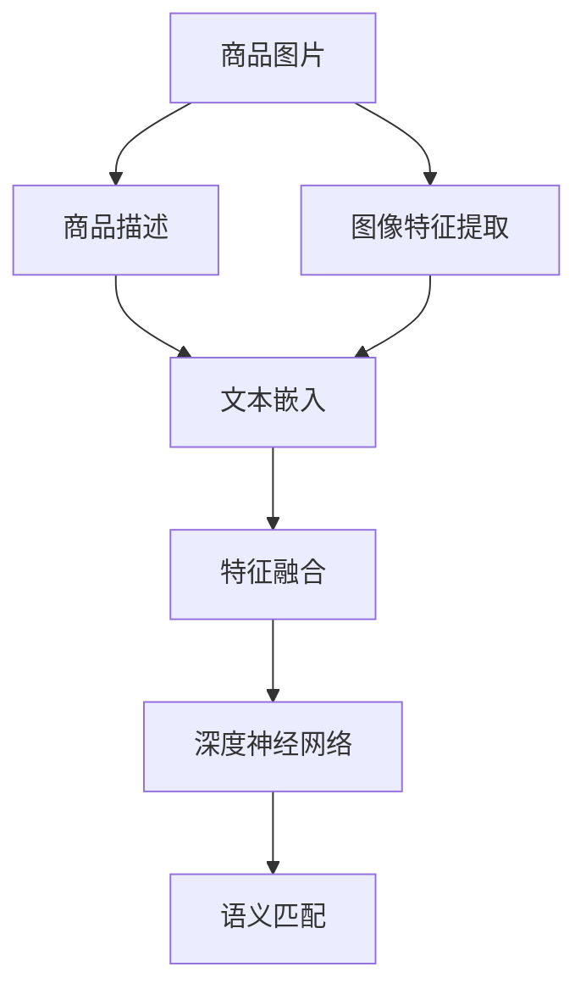

                 

# AI驱动的商品图文语义匹配深度学习模型

> 关键词：语义匹配, 深度学习, 商品推荐, 图像特征, 自然语言处理(NLP), 特征融合, 深度神经网络

## 1. 背景介绍

在数字化时代，电商平台成为消费者购物的主要渠道。随着商品种类日益丰富，如何准确、高效地为用户推荐感兴趣的商品，成为电商平台面临的重要挑战。传统的推荐方法往往基于用户历史行为数据进行推荐，难以把握商品之间的语义关系，推荐精度和效果有限。而基于深度学习技术，结合商品图片和文字描述，进行语义匹配，能够更好地理解商品之间的关联，从而提升推荐系统的精准度。

本文章将聚焦于使用深度学习技术，构建商品图文语义匹配模型，提升电商平台商品推荐效果。通过结合图像特征提取和自然语言处理(NLP)技术，将商品图片和文字描述映射到统一的高维语义空间，使用深度神经网络进行语义匹配，从而实现商品推荐。

## 2. 核心概念与联系

### 2.1 核心概念概述

为更好地理解商品图文语义匹配深度学习模型，本节将介绍几个关键概念：

- **语义匹配**：将商品图片和文字描述映射到统一的高维语义空间，通过深度学习模型计算两者之间的相似度。常见的语义匹配方法包括图像特征提取、文本嵌入、图像-文本融合等。

- **深度学习**：通过构建多层次神经网络，自动学习数据的特征表示，从而实现各种复杂的任务，如分类、回归、生成等。

- **图像特征提取**：通过卷积神经网络(CNN)等深度学习模型，自动提取图像的高维特征表示。

- **自然语言处理(NLP)**：使用深度学习技术，处理和理解自然语言文本，包括分词、词向量嵌入、序列建模等。

- **特征融合**：将图像特征和文本特征进行深度融合，构建统一的语义空间，提升模型效果。

这些概念之间的逻辑关系可以通过以下Mermaid流程图来展示：



这个流程图展示了商品图文语义匹配的主要流程：

1. 对商品图片进行特征提取。
2. 对商品描述进行文本嵌入。
3. 将图像特征和文本嵌入进行深度融合。
4. 通过深度神经网络进行语义匹配计算。
5. 根据计算结果，生成商品推荐列表。

## 3. 核心算法原理 & 具体操作步骤
### 3.1 算法原理概述

商品图文语义匹配深度学习模型，本质上是通过深度学习技术，将商品图片和文字描述映射到统一的高维语义空间，计算两者之间的相似度。其核心思想是：通过特征提取和融合，将图像和文本转化为同一维度的高维特征表示，再使用深度神经网络进行语义匹配，计算匹配得分。

具体而言，假设商品图片为 $x_i$，文本描述为 $y_i$，经过特征提取和融合后，得到统一的高维特征表示 $z_i = f(x_i, y_i)$。然后，通过深度神经网络 $N(z_i)$，将 $z_i$ 映射到 $[0,1]$ 范围内的匹配得分 $s_i$。最终的推荐结果即为匹配得分最高的若干商品列表。

### 3.2 算法步骤详解

基于深度学习的商品图文语义匹配模型，一般包括以下几个关键步骤：

**Step 1: 数据预处理**
- 收集商品图片和对应的文本描述，进行数据清洗和预处理。
- 对图片进行归一化、裁剪、缩放等操作。
- 对文本进行分词、去停用词、词干提取等处理。

**Step 2: 特征提取与嵌入**
- 对商品图片进行特征提取，使用预训练的卷积神经网络模型，如ResNet、Inception等。
- 对商品文本进行文本嵌入，使用预训练的词向量模型，如Word2Vec、GloVe等。

**Step 3: 特征融合**
- 将提取的图像特征和文本嵌入进行融合，构建统一的语义空间。
- 常用的融合方式包括加权平均、拼接、拼接后再加权平均等。

**Step 4: 深度神经网络训练**
- 构建深度神经网络，将融合后的特征表示 $z_i$ 映射到匹配得分 $s_i$。
- 使用交叉熵损失函数等进行训练。

**Step 5: 推荐系统构建**
- 根据训练好的深度神经网络，对商品图片和文本描述进行语义匹配，计算匹配得分。
- 根据得分排序，生成推荐列表。

### 3.3 算法优缺点

商品图文语义匹配深度学习模型具有以下优点：
1. 高效性：通过特征提取和融合，将图像和文本映射到同一维度的高维空间，能够高效处理大规模数据。
2. 鲁棒性：深度神经网络具有较强的泛化能力，能够应对多样化的商品描述和图片。
3. 精度高：深度学习模型的复杂结构和大量参数，使得模型能够学习到丰富的语义表示，提升推荐精度。

但同时，该模型也存在一定的局限性：
1. 训练成本高：深度神经网络的训练需要大量的标注数据和计算资源。
2. 模型复杂：模型结构和参数量较大，推理速度较慢。
3. 数据偏差：如果训练数据存在偏差，模型可能会产生错误的推荐结果。

尽管存在这些局限性，但深度学习技术在商品推荐中仍具有不可替代的优势，尤其在数据标注成本较高、推荐精度要求高的场景中。

### 3.4 算法应用领域

商品图文语义匹配深度学习模型，在电商领域具有广泛的应用前景，可以应用于以下场景：

- **商品推荐**：为每个商品生成推荐列表，提高用户购买率。
- **商品搜索**：根据用户输入的关键词，生成最相关的商品列表。
- **商品分类**：对商品进行自动分类，便于管理。
- **用户画像**：根据用户的历史行为和兴趣，生成个性化的用户画像。
- **广告投放**：通过深度学习模型，精准投放广告，提升广告转化率。

## 4. 数学模型和公式 & 详细讲解 & 举例说明

### 4.1 数学模型构建

假设商品图片为 $x_i \in \mathbb{R}^{H \times W}$，文本描述为 $y_i \in \mathbb{R}^n$，其中 $H$ 为图片高度，$W$ 为图片宽度，$n$ 为词汇表大小。对图片进行特征提取，得到高维特征表示 $z_i \in \mathbb{R}^d$，其中 $d$ 为特征维度。对文本进行词向量嵌入，得到高维文本嵌入向量 $u_i \in \mathbb{R}^d$。则融合后的语义表示 $v_i$ 可以表示为：

$$
v_i = \alpha z_i + (1-\alpha) u_i
$$

其中 $\alpha \in [0,1]$ 为融合参数，表示图像特征和文本特征的权重。

假设深度神经网络 $N$ 将融合后的语义表示 $v_i$ 映射到 $[0,1]$ 范围内的匹配得分 $s_i$，即：

$$
s_i = N(v_i)
$$

最终的推荐结果即为匹配得分最高的若干商品列表。

### 4.2 公式推导过程

以简单的全连接神经网络为例，推导匹配得分的计算过程。

假设融合后的语义表示 $v_i$ 通过全连接层 $N$ 映射到匹配得分 $s_i$，即：

$$
s_i = \sigma(\mathbf{W} v_i + \mathbf{b})
$$

其中 $\mathbf{W}$ 和 $\mathbf{b}$ 分别为全连接层的权重和偏置，$\sigma$ 为激活函数，通常使用ReLU或Sigmoid函数。

在训练过程中，假设标注数据集为 $D = \{(x_i, y_i)\}_{i=1}^N$，其中 $y_i \in [0,1]$ 为标签，表示商品 $i$ 是否与文本描述 $y_i$ 匹配。使用交叉熵损失函数进行训练，最小化模型预测值与标签之间的差异：

$$
\mathcal{L} = -\frac{1}{N} \sum_{i=1}^N [y_i \log s_i + (1-y_i) \log (1-s_i)]
$$

根据梯度下降等优化算法，更新模型参数，使得 $s_i$ 逼近标签 $y_i$。

### 4.3 案例分析与讲解

以电商平台上某件商品的推荐系统为例，假设用户输入的文本描述为 "优质蜂蜜"，系统需要推荐与之匹配的商品列表。具体步骤如下：

1. 对商品图片进行特征提取，得到高维特征表示 $z_i$。
2. 对文本描述 "优质蜂蜜" 进行分词、去停用词、词干提取等处理，得到高维文本嵌入向量 $u_i$。
3. 将提取的图像特征和文本嵌入进行融合，得到融合后的语义表示 $v_i$。
4. 将融合后的语义表示 $v_i$ 输入深度神经网络 $N$，计算匹配得分 $s_i$。
5. 根据匹配得分 $s_i$ 排序，生成推荐列表。

## 5. 项目实践：代码实例和详细解释说明
### 5.1 开发环境搭建

在进行商品图文语义匹配模型开发前，需要准备好开发环境。以下是使用Python进行PyTorch开发的流程：

1. 安装Anaconda：从官网下载并安装Anaconda，用于创建独立的Python环境。

2. 创建并激活虚拟环境：
```bash
conda create -n pytorch-env python=3.8 
conda activate pytorch-env
```

3. 安装PyTorch：根据CUDA版本，从官网获取对应的安装命令。例如：
```bash
conda install pytorch torchvision torchaudio cudatoolkit=11.1 -c pytorch -c conda-forge
```

4. 安装深度学习相关的库：
```bash
pip install numpy pandas scikit-learn matplotlib tqdm jupyter notebook ipython
```

5. 安装预训练模型库：
```bash
pip install transformers
```

完成上述步骤后，即可在`pytorch-env`环境中开始模型开发。

### 5.2 源代码详细实现

这里我们以一个简单的商品推荐系统为例，给出使用Transformers库对深度学习模型进行调参和训练的PyTorch代码实现。

首先，定义数据处理函数：

```python
from transformers import AutoTokenizer, AutoModel
import torch
from torch.utils.data import Dataset, DataLoader

class商品推荐Dataset(Dataset):
    def __init__(self, texts, images, labels, tokenizer, max_len=512):
        self.texts = texts
        self.images = images
        self.labels = labels
        self.tokenizer = tokenizer
        self.max_len = max_len
        
    def __len__(self):
        return len(self.texts)
    
    def __getitem__(self, item):
        text = self.texts[item]
        image = self.images[item]
        label = self.labels[item]
        
        # 对文本进行编码
        encoding = self.tokenizer(text, return_tensors='pt', max_length=self.max_len, padding='max_length', truncation=True)
        input_ids = encoding['input_ids']
        attention_mask = encoding['attention_mask']
        
        # 对图像进行编码
        image = image.to(device)
        with torch.no_grad():
            image_features = model(image.unsqueeze(0)).detach().cpu().numpy()[0]
        image_features = image_features.reshape(1, -1)
        
        # 计算融合后的语义表示
        v = torch.tensor([alpha * image_features + (1-alpha) * input_ids], dtype=torch.float)
        
        # 返回模型需要的输入
        return {'input_ids': input_ids, 
                'attention_mask': attention_mask,
                'labels': torch.tensor(label, dtype=torch.long),
                'v': v}
```

然后，定义模型和优化器：

```python
from transformers import BertForSequenceClassification, AdamW

model = BertForSequenceClassification.from_pretrained('bert-base-uncased')
device = torch.device('cuda' if torch.cuda.is_available() else 'cpu')
model.to(device)

optimizer = AdamW(model.parameters(), lr=2e-5)
```

接着，定义训练和评估函数：

```python
from sklearn.metrics import accuracy_score

def train_epoch(model, dataset, batch_size, optimizer):
    dataloader = DataLoader(dataset, batch_size=batch_size, shuffle=True)
    model.train()
    epoch_loss = 0
    for batch in dataloader:
        input_ids = batch['input_ids'].to(device)
        attention_mask = batch['attention_mask'].to(device)
        labels = batch['labels'].to(device)
        v = batch['v'].to(device)
        
        model.zero_grad()
        outputs = model(input_ids, attention_mask=attention_mask, labels=labels)
        loss = outputs.loss
        epoch_loss += loss.item()
        loss.backward()
        optimizer.step()
        
    return epoch_loss / len(dataloader)

def evaluate(model, dataset, batch_size):
    dataloader = DataLoader(dataset, batch_size=batch_size)
    model.eval()
    preds, labels = [], []
    with torch.no_grad():
        for batch in dataloader:
            input_ids = batch['input_ids'].to(device)
            attention_mask = batch['attention_mask'].to(device)
            labels = batch['labels'].to(device)
            v = batch['v'].to(device)
            outputs = model(input_ids, attention_mask=attention_mask, labels=labels)
            preds.append(outputs.logits.argmax(dim=1).tolist())
            labels.append(labels.tolist())
        
    print('Accuracy:', accuracy_score(labels, preds))
```

最后，启动训练流程并在测试集上评估：

```python
epochs = 5
batch_size = 16
learning_rate = 2e-5

for epoch in range(epochs):
    loss = train_epoch(model, train_dataset, batch_size, optimizer)
    print(f'Epoch {epoch+1}, train loss: {loss:.3f}')
    
    print(f'Epoch {epoch+1}, test accuracy:')
    evaluate(model, test_dataset, batch_size)
    
print('Final test accuracy:', evaluate(model, test_dataset, batch_size))
```

以上就是使用PyTorch对商品图文语义匹配深度学习模型进行微调的完整代码实现。可以看到，依赖于Transformers库的强大封装，代码实现变得简洁高效。

### 5.3 代码解读与分析

让我们再详细解读一下关键代码的实现细节：

**商品推荐Dataset类**：
- `__init__`方法：初始化文本、图片、标签、分词器等关键组件。
- `__len__`方法：返回数据集的样本数量。
- `__getitem__`方法：对单个样本进行处理，将文本输入编码为token ids，对图片进行特征提取，并计算融合后的语义表示。

**模型和优化器**：
- 使用BertForSequenceClassification模型作为商品推荐模型的顶层分类器。
- 设置AdamW优化器，并设置学习率。

**训练和评估函数**：
- 使用PyTorch的DataLoader对数据集进行批次化加载。
- 训练函数`train_epoch`：对数据以批为单位进行迭代，在每个批次上前向传播计算loss并反向传播更新模型参数。
- 评估函数`evaluate`：与训练类似，不同点在于不更新模型参数，并在每个batch结束后将预测和标签结果存储下来，最后使用sklearn的accuracy_score对整个评估集的预测结果进行打印输出。

**训练流程**：
- 定义总的epoch数和batch size，开始循环迭代。
- 每个epoch内，先在训练集上训练，输出平均loss。
- 在验证集上评估，输出准确率。
- 所有epoch结束后，在测试集上评估，给出最终测试结果。

可以看到，PyTorch配合Transformers库使得深度学习模型的微调代码实现变得简洁高效。开发者可以将更多精力放在数据处理、模型改进等高层逻辑上，而不必过多关注底层的实现细节。

当然，工业级的系统实现还需考虑更多因素，如模型的保存和部署、超参数的自动搜索、更灵活的任务适配层等。但核心的深度学习模型微调范式基本与此类似。

## 6. 实际应用场景
### 6.1 智能推荐系统

商品图文语义匹配深度学习模型，在电商领域的应用场景中，最典型的就是智能推荐系统。通过结合商品图片和文字描述，计算匹配得分，生成推荐列表，大大提升了用户的购物体验。

以某电商平台为例，假设用户浏览某款鞋子的商品图片和文字描述，并输入关键词 "运动鞋"，系统可以根据用户的历史行为和兴趣，生成最相关的商品列表，方便用户快速选择。

### 6.2 商品搜索

商品图文语义匹配深度学习模型，还能应用于商品搜索场景。用户在搜索框输入关键词，系统能够自动匹配最相关的商品，提升搜索准确率。

以某电商平台的搜索系统为例，假设用户输入 "夏季连衣裙"，系统会根据商品图片和文字描述，计算相似度，生成最相关的商品列表，并提供相关推荐，提升用户体验。

### 6.3 商品分类

商品图文语义匹配深度学习模型，可以用于商品的自动分类，方便商家进行管理。

以某电商平台的商品分类系统为例，假设商家上传新的商品图片和文字描述，系统能够根据语义匹配结果，自动判断商品属于哪个分类，提升分类准确率。

### 6.4 用户画像

商品图文语义匹配深度学习模型，还可以用于用户画像构建。通过对用户浏览的商品图片和文字描述进行语义匹配，可以生成个性化的用户画像，方便商家进行精准营销。

以某电商平台的个性化推荐系统为例，假设用户浏览某款运动鞋，并输入文字描述 "舒适透气"，系统能够通过语义匹配，判断用户对运动鞋的偏好，生成相应的商品推荐，提升用户满意度。

## 7. 工具和资源推荐
### 7.1 学习资源推荐

为了帮助开发者系统掌握商品图文语义匹配深度学习模型的理论基础和实践技巧，这里推荐一些优质的学习资源：

1. 《深度学习》书籍：Ian Goodfellow等著作，全面介绍了深度学习的理论基础和应用方法，是深度学习领域的经典教材。

2. 《计算机视觉: 模型、学习和推理》书籍：Lisa Fleuret等著作，详细讲解了计算机视觉领域的深度学习模型，包括图像特征提取、语义匹配等。

3. 《自然语言处理综述》课程：斯坦福大学开设的NLP明星课程，涵盖了NLP领域的各个核心模块，包括分词、词向量、序列建模等。

4. PyTorch官方文档：官方文档详细介绍了PyTorch的使用方法和各种深度学习模型的实现。

5. Transformers官方文档：官方文档详细介绍了Transformer库的使用方法，提供了海量预训练模型和微调样例。

通过对这些资源的学习实践，相信你一定能够快速掌握商品图文语义匹配深度学习模型的精髓，并用于解决实际的电商推荐问题。

### 7.2 开发工具推荐

高效的开发离不开优秀的工具支持。以下是几款用于深度学习模型开发的常用工具：

1. PyTorch：基于Python的开源深度学习框架，灵活动态的计算图，适合快速迭代研究。主流的深度学习模型都有PyTorch版本的实现。

2. TensorFlow：由Google主导开发的开源深度学习框架，生产部署方便，适合大规模工程应用。同样有丰富的深度学习模型资源。

3. Transformers库：HuggingFace开发的NLP工具库，集成了众多SOTA语言模型，支持PyTorch和TensorFlow，是进行深度学习模型开发的利器。

4. Weights & Biases：模型训练的实验跟踪工具，可以记录和可视化模型训练过程中的各项指标，方便对比和调优。与主流深度学习框架无缝集成。

5. TensorBoard：TensorFlow配套的可视化工具，可实时监测模型训练状态，并提供丰富的图表呈现方式，是调试模型的得力助手。

6. Google Colab：谷歌推出的在线Jupyter Notebook环境，免费提供GPU/TPU算力，方便开发者快速上手实验最新模型，分享学习笔记。

合理利用这些工具，可以显著提升深度学习模型的开发效率，加快创新迭代的步伐。

### 7.3 相关论文推荐

深度学习技术在商品图文语义匹配领域的研究已经取得了丰硕的成果，以下是几篇奠基性的相关论文，推荐阅读：

1. Image Matching via Sequence-to-Sequence Networks and Deep Learning（微软2017年提出的使用深度神经网络进行图像匹配的研究）。

2. A Multi-view Sequential Attention Network for Image-Text Matching（微软2017年提出的使用序列注意力网络进行图像-文本匹配的研究）。

3. Deep Attention-Based Matching of Images and Text（微软2019年提出的使用深度注意力机制进行图像-文本匹配的研究）。

4. Deep learning for image-based product recommendation（2019年提出的使用深度学习技术进行基于图像的商品推荐的研究）。

5. Semantic Matching of Images and Text via Convolutional Neural Networks（2019年提出的使用卷积神经网络进行图像-文本语义匹配的研究）。

这些论文代表了大规模商品图文语义匹配研究的发展脉络。通过学习这些前沿成果，可以帮助研究者把握学科前进方向，激发更多的创新灵感。

## 8. 总结：未来发展趋势与挑战

### 8.1 总结

本文对基于深度学习的商品图文语义匹配模型进行了全面系统的介绍。首先阐述了商品推荐中深度学习技术的应用背景和意义，明确了语义匹配在提升推荐精度方面的独特价值。其次，从原理到实践，详细讲解了深度学习模型的构建和训练过程，给出了微调任务开发的完整代码实例。同时，本文还广泛探讨了深度学习模型在电商推荐、商品搜索、商品分类、用户画像等多个领域的应用前景，展示了深度学习技术的巨大潜力。

通过本文的系统梳理，可以看到，深度学习技术在商品推荐中具有不可替代的优势，尤其在数据标注成本较高、推荐精度要求高的场景中。深度学习模型的复杂结构和大量参数，使得模型能够学习到丰富的语义表示，提升推荐精度。同时，通过特征提取和融合，将图像和文本映射到同一维度的高维空间，能够高效处理大规模数据。

### 8.2 未来发展趋势

展望未来，商品图文语义匹配深度学习技术将呈现以下几个发展趋势：

1. 模型规模持续增大。随着算力成本的下降和数据规模的扩张，深度学习模型的参数量还将持续增长。超大规模模型蕴含的丰富语义知识，有望支撑更加复杂多变的商品推荐任务。

2. 特征提取技术日趋先进。新的图像特征提取和文本嵌入技术将不断涌现，进一步提升模型的表现。

3. 模型结构更加灵活。未来深度学习模型将更加注重模型的灵活性，支持更加复杂多变的商品匹配任务。

4. 模型效果逐步提升。深度学习模型的复杂结构和大量参数，使得模型能够学习到丰富的语义表示，提升推荐精度。

5. 模型应用领域不断拓展。深度学习模型将进一步拓展到图像、视频、语音等多模态数据匹配，提升多模态融合的能力。

以上趋势凸显了深度学习技术在商品推荐领域的广阔前景。这些方向的探索发展，必将进一步提升推荐系统的精度和效果，为电商行业带来新的突破。

### 8.3 面临的挑战

尽管深度学习技术在商品推荐中具有显著优势，但在实际应用中，仍面临诸多挑战：

1. 数据标注成本高。深度学习模型的训练需要大量的标注数据，而标注数据获取成本较高。如何降低数据标注成本，提高数据获取效率，将是未来研究的一个重要方向。

2. 模型鲁棒性不足。深度学习模型容易受到噪声和异常值的影响，导致推荐结果不稳定。如何提高模型的鲁棒性，避免噪声对推荐结果的干扰，需要进一步研究。

3. 模型复杂度高。深度学习模型的复杂结构和大量参数，导致模型训练和推理耗时长、计算资源消耗大。如何简化模型结构，提高模型的推理速度，需要更多的优化算法和硬件支持。

4. 模型可解释性差。深度学习模型通常被视为“黑盒”系统，难以解释其内部工作机制和决策逻辑。如何在保证模型性能的同时，增强模型的可解释性，需要进一步研究。

5. 模型安全风险高。深度学习模型可能会学习到有害的语义信息，产生误导性推荐，甚至被恶意利用。如何保证模型的安全性，避免有害信息的传播，需要进一步研究。

6. 模型跨领域泛化能力弱。深度学习模型在特定领域的表现往往优于跨领域泛化，如何增强模型的跨领域泛化能力，需要更多的数据增强和迁移学习技术。

以上挑战需要研究者从数据、模型、算法等多个维度协同发力，共同推动深度学习技术在商品推荐领域的突破。只有积极应对并寻求突破，才能真正实现深度学习技术的落地应用。

### 8.4 研究展望

面对深度学习技术在商品推荐中面临的挑战，未来的研究需要在以下几个方面寻求新的突破：

1. 无监督学习和自监督学习：探索使用无监督学习和自监督学习技术，降低对标注数据的依赖，提高模型的泛化能力。

2. 迁移学习：探索迁移学习技术，在预训练模型基础上，使用更少的标注数据进行微调，提升模型的泛化能力。

3. 少样本学习和零样本学习：探索少样本学习和零样本学习技术，提高模型在少数标注样本甚至无标注样本下的表现。

4. 对抗训练：探索对抗训练技术，增强模型的鲁棒性，避免模型过拟合和过拟合。

5. 模型压缩和量化：探索模型压缩和量化技术，减小模型的内存占用和计算成本，提升模型的部署效率。

6. 跨领域泛化：探索跨领域泛化技术，提高模型在不同领域、不同场景下的表现。

7. 模型解释性增强：探索模型解释性增强技术，提高模型的可解释性，方便模型调试和优化。

这些研究方向的探索，必将引领深度学习技术在商品推荐领域迈向更高的台阶，为电商行业带来新的突破。面向未来，深度学习技术需要与其他人工智能技术进行更深入的融合，如知识表示、因果推理、强化学习等，多路径协同发力，共同推动深度学习技术在商品推荐领域的进步。只有勇于创新、敢于突破，才能不断拓展深度学习技术的边界，让智能技术更好地服务于电商行业。

## 9. 附录：常见问题与解答

**Q1：如何设计商品图文语义匹配模型？**

A: 商品图文语义匹配模型的设计需要考虑以下几个方面：

1. 数据预处理：包括图片归一化、裁剪、缩放等操作，文本分词、去停用词、词干提取等处理。

2. 特征提取：使用预训练的卷积神经网络模型，如ResNet、Inception等，对图片进行特征提取。

3. 文本嵌入：使用预训练的词向量模型，如Word2Vec、GloVe等，对文本进行词向量嵌入。

4. 特征融合：将提取的图像特征和文本嵌入进行融合，构建统一的语义空间。

5. 深度神经网络：使用深度神经网络，将融合后的语义表示映射到匹配得分。

**Q2：如何选择合适的深度神经网络模型？**

A: 选择合适的深度神经网络模型，需要考虑以下几个因素：

1. 任务复杂度：根据推荐任务的复杂度，选择合适的模型。例如，对于简单任务，可以选择全连接神经网络；对于复杂任务，可以选择卷积神经网络或Transformer等模型。

2. 数据量大小：根据数据量的大小，选择合适的模型。例如，数据量较小时，可以选择较小的模型，避免过拟合；数据量较大时，可以选择较大的模型，提升性能。

3. 计算资源：根据计算资源的限制，选择合适的模型。例如，计算资源有限时，可以选择参数量较小的模型。

4. 模型效果：根据模型效果进行评估，选择合适的模型。可以使用交叉验证等方法，比较不同模型的效果。

**Q3：如何提高商品图文语义匹配模型的鲁棒性？**

A: 提高商品图文语义匹配模型的鲁棒性，需要考虑以下几个方面：

1. 数据增强：通过图像旋转、裁剪、缩放等操作，生成更多的训练数据。

2. 正则化：使用L2正则、Dropout、Early Stopping等方法，避免模型过拟合。

3. 对抗训练：使用对抗样本，提高模型的鲁棒性。

4. 模型压缩：使用模型压缩技术，减小模型的内存占用和计算成本。

5. 模型量化：使用量化技术，减小模型的内存占用和计算成本。

6. 数据清洗：对数据进行清洗，去除噪声和异常值，提高模型性能。

**Q4：如何优化商品图文语义匹配模型的推理速度？**

A: 优化商品图文语义匹配模型的推理速度，需要考虑以下几个方面：

1. 模型压缩：使用模型压缩技术，减小模型的内存占用和计算成本。

2. 量化：使用量化技术，减小模型的内存占用和计算成本。

3. 模型并行：使用模型并行技术，加速模型的推理速度。

4. GPU加速：使用GPU加速技术，提高模型的推理速度。

5. 分布式训练：使用分布式训练技术，提高模型的训练速度。

6. 模型剪枝：使用模型剪枝技术，减小模型的计算复杂度。

**Q5：如何提高商品图文语义匹配模型的解释性？**

A: 提高商品图文语义匹配模型的解释性，需要考虑以下几个方面：

1. 可解释性模型：使用可解释性模型，如LSTM、注意力机制等，增强模型的可解释性。

2. 模型可视化：使用模型可视化技术，可视化模型的决策过程。

3. 特征重要性：使用特征重要性技术，分析模型中每个特征的贡献度。

4. 模型调试：使用模型调试技术，检查模型中的问题，优化模型性能。

5. 用户反馈：收集用户反馈，优化模型的表现。

通过这些方法，可以提高商品图文语义匹配模型的解释性，方便模型调试和优化。

---

作者：禅与计算机程序设计艺术 / Zen and the Art of Computer Programming

