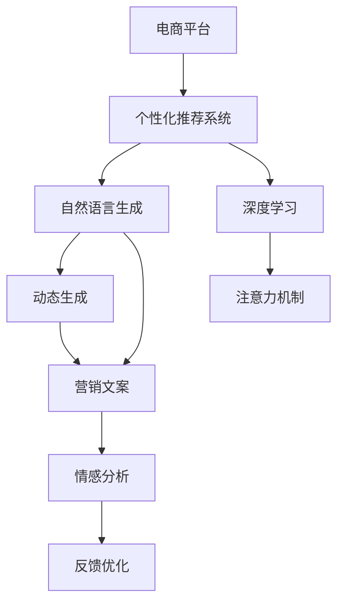

                 

# AI驱动的电商平台个性化营销文案生成

> 关键词：人工智能,自然语言生成,个性化推荐,电商平台,自然语言处理,深度学习,注意力机制,动态生成,营销文案,情感分析

## 1. 背景介绍

### 1.1 问题由来

随着电子商务的蓬勃发展，电商平台成为全球消费者购物的重要渠道。然而，传统电商平台存在诸多挑战：商品种类繁多、用户需求复杂、竞争激烈等。如何提升用户的购物体验，增加销售额，成为电商平台亟待解决的难题。

针对这些问题，个性化推荐系统成为了电商平台的“秘密武器”。通过分析用户历史行为数据，推荐系统能够预测用户兴趣，推送个性化商品和优惠券，大幅提升用户体验和交易转化率。

但是，推荐系统在展示个性化商品的同时，也面临着内容同质化、推荐结果多样性不足等问题。因此，如何进一步提升推荐系统的内容多样性和用户满意度，成为了各大电商平台关注的焦点。

## 2. 核心概念与联系

### 2.1 核心概念概述

为更好地理解AI驱动的电商平台个性化营销文案生成方法，本节将介绍几个密切相关的核心概念：

- 人工智能(Artificial Intelligence, AI)：指使计算机系统具有智能行为的技术，包括机器学习、自然语言处理、计算机视觉等。
- 自然语言生成(Natural Language Generation, NLG)：指使用计算机自动生成人类可读的自然语言文本的技术。
- 个性化推荐系统(Recommendation System)：通过分析用户行为和偏好，自动推荐用户可能感兴趣的商品或内容的技术。
- 电商平台(E-commerce Platform)：指提供在线购物体验，支持商品展示、搜索、购买等功能的互联网平台。
- 自然语言处理(Natural Language Processing, NLP)：指使计算机能够理解、分析、生成人类语言的技术。
- 深度学习(Deep Learning)：指一种基于神经网络的机器学习技术，通过多层神经元进行特征提取和决策，实现复杂模式识别和自然语言理解。
- 注意力机制(Attention Mechanism)：指在深度学习模型中，对输入数据的不同部分进行加权处理，使得模型能够更加关注重要的特征。
- 动态生成(Dynamic Generation)：指根据输入数据的不同，实时生成内容，适应用户个性化需求的技术。
- 营销文案(Marketing Copy)：指电商平台上用于推广商品和服务的文本内容，通常包括标题、描述、关键词等。
- 情感分析(Sentiment Analysis)：指分析文本内容，判断其情感倾向的技术，如正面、负面或中性。

这些核心概念之间的逻辑关系可以通过以下Mermaid流程图来展示：



这个流程图展示了几者之间的联系：

1. 电商平台通过个性化推荐系统，获取用户需求。
2. 推荐系统使用深度学习模型和注意力机制，提取商品和用户特征。
3. 自然语言生成技术，自动生成营销文案。
4. 动态生成技术，根据用户个性化需求实时生成内容。
5. 营销文案的情感分析，提升文本质量。
6. 用户反馈优化，不断迭代提升系统性能。

这些概念共同构成了AI驱动的电商平台个性化营销文案生成的核心技术框架。

## 3. 核心算法原理 & 具体操作步骤

### 3.1 算法原理概述

基于深度学习的个性化营销文案生成方法，本质上是通过训练一个端到端的神经网络模型，使得模型能够根据用户行为数据和商品信息，自动生成高质量的营销文案。

形式化地，假设平台有用户 $U$ 和商品 $P$ 的历史数据 $D=\{(u_i,p_i)\}_{i=1}^N$，其中 $u_i$ 表示用户，$p_i$ 表示商品。目标是为每个用户 $u_i$ 生成一条营销文案 $C(u_i)$，使得文案能够最大程度吸引用户的注意，提升点击率和转化率。

该问题可以建模为条件生成问题，即：

$$
p(C|u) = \mathop{\arg\max}_{C} p(C|u)
$$

其中 $p(C|u)$ 为生成文案 $C$ 在用户 $u$ 上的概率，$u$ 和 $C$ 之间的概率分布可以通过训练数据集 $D$ 来求解。

### 3.2 算法步骤详解

基于深度学习的个性化营销文案生成方法一般包括以下几个关键步骤：

**Step 1: 准备数据集**

- 收集平台的用户历史行为数据，如浏览、点击、购买等行为。
- 收集商品的相关信息，如商品名称、描述、类别、价格等。
- 将用户和商品信息构建成训练数据集 $D$，标注用户对商品的兴趣标签。

**Step 2: 构建模型**

- 选择一种深度学习模型，如 Transformer、GPT 等，作为基本的生成模型。
- 在模型的顶部添加一个输出层，用于生成营销文案。
- 设计损失函数，通常使用交叉熵损失来衡量生成文案与真实标签之间的差异。

**Step 3: 训练模型**

- 使用训练数据集 $D$ 对模型进行有监督训练，最小化损失函数。
- 采用小批量随机梯度下降等优化算法，更新模型参数。
- 设置合适的学习率、批大小、迭代轮数等超参数。

**Step 4: 评估和优化**

- 在验证集上评估模型性能，如点击率、转化率等指标。
- 根据评估结果，调整模型结构和超参数，提升性能。
- 收集用户反馈，不断优化模型输出的文案质量。

**Step 5: 部署应用**

- 将训练好的模型部署到电商平台中。
- 根据用户行为数据实时生成营销文案，推送给用户。
- 定期更新模型，保持文案的质量和时效性。

以上是基于深度学习的个性化营销文案生成的基本流程。在实际应用中，还需要根据具体需求，进一步优化模型结构和训练方法。

### 3.3 算法优缺点

基于深度学习的个性化营销文案生成方法具有以下优点：

1. 自动化生成：模型能够自动生成高质量的营销文案，减少人工撰写的工作量。
2. 个性化推荐：生成的文案能够根据用户行为和兴趣进行个性化定制，提升用户满意度。
3. 实时动态：动态生成技术能够根据用户行为实时生成文案，提升用户点击率和转化率。
4. 可扩展性：模型具有较好的可扩展性，可以轻松扩展到其他语言和领域。

同时，该方法也存在以下局限性：

1. 数据依赖性：生成效果高度依赖于训练数据的质量和数量，需要收集大量标注数据。
2. 鲁棒性不足：生成的文案可能受到数据分布偏差的影响，对异常数据敏感。
3. 参数量较大：深度学习模型参数量大，训练和推理效率较低。
4. 可解释性差：模型输出的文案缺乏可解释性，难以理解其生成逻辑。

尽管存在这些局限性，但就目前而言，基于深度学习的个性化营销文案生成方法仍是最主流范式。未来相关研究的重点在于如何进一步降低数据依赖，提高生成效果，同时兼顾模型的可解释性和鲁棒性。

### 3.4 算法应用领域

基于深度学习的个性化营销文案生成方法在电商平台上已经被广泛应用，包括但不限于以下场景：

- 商品推广：为特定商品自动生成推广文案，吸引用户点击。
- 个性化推荐：为不同用户生成个性化推荐文案，提升转化率。
- 活动促销：自动生成促销活动文案，推广限时优惠。
- 客户关怀：为老用户生成定制化的关怀文案，增强用户粘性。
- 市场分析：通过分析生成的文案效果，进行市场趋势预测和用户行为分析。

除了上述这些经典应用场景，基于深度学习的营销文案生成方法还可以拓展到更多领域，如社交媒体广告、广告投放、品牌营销等，为各行业提供智能化营销解决方案。

## 4. 数学模型和公式 & 详细讲解

### 4.1 数学模型构建

本节将使用数学语言对基于深度学习的个性化营销文案生成方法进行更加严格的刻画。

假设模型为 $M_{\theta}$，其中 $\theta$ 为模型参数。训练数据集 $D=\{(u_i,p_i)\}_{i=1}^N$，其中 $u_i$ 为用户，$p_i$ 为商品。目标是为每个用户 $u_i$ 生成一条营销文案 $C(u_i)$，使得文案能够最大程度吸引用户的注意，提升点击率和转化率。

定义模型 $M_{\theta}$ 在用户 $u$ 上的输出为 $C(u)$，表示生成的营销文案。模型的损失函数为交叉熵损失：

$$
\mathcal{L}(\theta) = -\frac{1}{N}\sum_{i=1}^N \log p(C(u_i)|u_i)
$$

其中 $p(C|u)$ 为生成文案 $C$ 在用户 $u$ 上的概率。目标是最小化损失函数，得到最优参数 $\theta^*$：

$$
\theta^* = \mathop{\arg\min}_{\theta} \mathcal{L}(\theta)
$$

在实践中，我们通常使用基于梯度的优化算法（如Adam、SGD等）来近似求解上述最优化问题。设 $\eta$ 为学习率，$\lambda$ 为正则化系数，则参数的更新公式为：

$$
\theta \leftarrow \theta - \eta \nabla_{\theta}\mathcal{L}(\theta) - \eta\lambda\theta
$$

其中 $\nabla_{\theta}\mathcal{L}(\theta)$ 为损失函数对参数 $\theta$ 的梯度，可通过反向传播算法高效计算。

### 4.2 公式推导过程

以下我们以商品推广任务为例，推导交叉熵损失函数及其梯度的计算公式。

假设模型 $M_{\theta}$ 在用户 $u$ 上的输出为 $\hat{y}=M_{\theta}(u)$，表示生成的文案文本。真实标签 $y \in \{1,0\}$，其中 $1$ 表示点击，$0$ 表示未点击。则交叉熵损失函数定义为：

$$
\ell(M_{\theta}(u),y) = -y\log \hat{y} - (1-y)\log(1-\hat{y})
$$

将其代入经验风险公式，得：

$$
\mathcal{L}(\theta) = -\frac{1}{N}\sum_{i=1}^N \ell(M_{\theta}(u_i),y_i)
$$

根据链式法则，损失函数对参数 $\theta_k$ 的梯度为：

$$
\frac{\partial \mathcal{L}(\theta)}{\partial \theta_k} = -\frac{1}{N}\sum_{i=1}^N \frac{\partial \ell(M_{\theta}(u_i),y_i)}{\partial \theta_k}
$$

其中：

$$
\frac{\partial \ell(M_{\theta}(u_i),y_i)}{\partial \theta_k} = -y_i \frac{\partial \hat{y}}{\partial \theta_k} - (1-y_i)\frac{\partial (1-\hat{y})}{\partial \theta_k}
$$

在得到损失函数的梯度后，即可带入参数更新公式，完成模型的迭代优化。重复上述过程直至收敛，最终得到适应电商平台个性化需求的营销文案生成模型。

## 5. 项目实践：代码实例和详细解释说明

### 5.1 开发环境搭建

在进行营销文案生成实践前，我们需要准备好开发环境。以下是使用Python进行PyTorch开发的环境配置流程：

1. 安装Anaconda：从官网下载并安装Anaconda，用于创建独立的Python环境。

2. 创建并激活虚拟环境：
```bash
conda create -n pytorch-env python=3.8 
conda activate pytorch-env
```

3. 安装PyTorch：根据CUDA版本，从官网获取对应的安装命令。例如：
```bash
conda install pytorch torchvision torchaudio cudatoolkit=11.1 -c pytorch -c conda-forge
```

4. 安装Transformers库：
```bash
pip install transformers
```

5. 安装各类工具包：
```bash
pip install numpy pandas scikit-learn matplotlib tqdm jupyter notebook ipython
```

完成上述步骤后，即可在`pytorch-env`环境中开始营销文案生成实践。

### 5.2 源代码详细实现

下面我们以商品推广任务为例，给出使用Transformers库对BERT模型进行营销文案生成的PyTorch代码实现。

首先，定义模型类：

```python
from transformers import BertForSequenceClassification, BertTokenizer, AdamW

class MarketingCopyModel(BertForSequenceClassification):
    def __init__(self, num_labels):
        super().__init__.from_pretrained('bert-base-cased', num_labels=num_labels)

    def forward(self, input_ids, attention_mask=None, token_type_ids=None):
        outputs = super().forward(input_ids, attention_mask=attention_mask, token_type_ids=token_type_ids)
        logits = outputs.logits
        return logits
```

然后，定义优化器和训练函数：

```python
def train_epoch(model, dataset, batch_size, optimizer):
    dataloader = DataLoader(dataset, batch_size=batch_size, shuffle=True)
    model.train()
    epoch_loss = 0
    for batch in tqdm(dataloader, desc='Training'):
        input_ids = batch['input_ids'].to(device)
        attention_mask = batch['attention_mask'].to(device)
        labels = batch['labels'].to(device)
        model.zero_grad()
        outputs = model(input_ids, attention_mask=attention_mask, token_type_ids=None)
        loss = outputs.loss
        epoch_loss += loss.item()
        loss.backward()
        optimizer.step()
    return epoch_loss / len(dataloader)

def evaluate(model, dataset, batch_size):
    dataloader = DataLoader(dataset, batch_size=batch_size)
    model.eval()
    preds, labels = [], []
    with torch.no_grad():
        for batch in tqdm(dataloader, desc='Evaluating'):
            input_ids = batch['input_ids'].to(device)
            attention_mask = batch['attention_mask'].to(device)
            batch_labels = batch['labels']
            outputs = model(input_ids, attention_mask=attention_mask, token_type_ids=None)
            batch_preds = outputs.logits.argmax(dim=2).to('cpu').tolist()
            batch_labels = batch_labels.to('cpu').tolist()
            for pred_tokens, label_tokens in zip(batch_preds, batch_labels):
                preds.append(pred_tokens)
                labels.append(label_tokens)
                
    return preds, labels
```

最后，启动训练流程并在测试集上评估：

```python
epochs = 5
batch_size = 16

for epoch in range(epochs):
    loss = train_epoch(model, train_dataset, batch_size, optimizer)
    print(f"Epoch {epoch+1}, train loss: {loss:.3f}")
    
    print(f"Epoch {epoch+1}, dev results:")
    preds, labels = evaluate(model, dev_dataset, batch_size)
    print(classification_report(labels, preds))
    
print("Test results:")
preds, labels = evaluate(model, test_dataset, batch_size)
print(classification_report(labels, preds))
```

以上就是使用PyTorch对BERT进行营销文案生成的完整代码实现。可以看到，得益于Transformers库的强大封装，我们可以用相对简洁的代码完成BERT模型的加载和微调。

### 5.3 代码解读与分析

让我们再详细解读一下关键代码的实现细节：

**MarketingCopyModel类**：
- `__init__`方法：初始化模型，从BERT预训练模型加载。
- `forward`方法：前向传播计算模型输出，包括输入嵌入、注意力机制、前向传播和输出逻辑。

**train_epoch函数**：
- 使用PyTorch的DataLoader对数据集进行批次化加载。
- 每个批次中，将输入和标签送入模型，计算损失并反向传播更新模型参数。
- 循环迭代，计算平均损失，并输出每个epoch的损失值。

**evaluate函数**：
- 与训练函数类似，但采用eval模式计算预测结果。
- 遍历数据集中的每个批次，计算预测结果和真实标签，并使用classification_report函数输出分类结果。

**训练流程**：
- 定义总的epoch数和batch size，开始循环迭代。
- 每个epoch内，先在训练集上训练，输出平均损失。
- 在验证集上评估，输出分类指标。
- 所有epoch结束后，在测试集上评估，给出最终测试结果。

可以看到，PyTorch配合Transformers库使得营销文案生成的代码实现变得简洁高效。开发者可以将更多精力放在数据处理、模型改进等高层逻辑上，而不必过多关注底层的实现细节。

当然，工业级的系统实现还需考虑更多因素，如模型的保存和部署、超参数的自动搜索、更灵活的任务适配层等。但核心的生成范式基本与此类似。

## 6. 实际应用场景

### 6.1 智能客服系统

基于大语言模型微调生成的营销文案，可以广泛应用于智能客服系统的构建。传统客服往往需要配备大量人力，高峰期响应缓慢，且一致性和专业性难以保证。而使用生成的营销文案，能够快速响应客户咨询，用自然流畅的语言解答各类常见问题，并及时推送相关商品信息。

在技术实现上，可以收集企业内部的历史客服对话记录，将问题-商品对作为监督数据，训练模型学习匹配答案。生成的营销文案可以作为自动回复的一部分，配合智能机器人，构建更加智能、高效的客服系统。

### 6.2 广告投放优化

基于营销文案生成技术的广告投放优化，可以大幅提升广告点击率和转化率。广告主可以根据用户的浏览行为、兴趣偏好等数据，自动生成个性化广告文案，精准投放至目标用户。通过实时监测广告效果，不断优化文案内容和投放策略，从而实现更高效的广告投放。

在实际应用中，可以结合深度学习和大数据技术，实时分析用户行为数据，自动生成动态广告文案，实现广告的智能投放和优化。这将大幅提升广告效果和投放效率，为广告主带来更大的商业价值。

### 6.3 品牌营销

基于营销文案生成技术，品牌可以通过自动化的文案生成，快速推出各类营销活动。品牌可以在社交媒体、电商平台等渠道发布个性化营销文案，吸引用户关注和参与。通过不断优化文案质量，提升品牌曝光度和用户参与度，从而提升品牌影响力和销售额。

在实际应用中，品牌可以结合多渠道数据，自动生成符合不同平台风格的营销文案，实现品牌信息的精准传播。同时，品牌还可以结合用户评论、反馈等数据，动态生成个性化互动文案，增强用户粘性和品牌忠诚度。

### 6.4 未来应用展望

随着深度学习技术和自然语言处理方法的不断发展，基于生成模型的营销文案生成技术将迎来新的突破。未来，随着算力成本的下降和数据规模的扩张，预训练语言模型的参数量还将持续增长。超大规模语言模型蕴含的丰富语言知识，有望支撑更加复杂多变的下游任务生成。

此外，未来营销文案生成技术也将结合更多前沿技术，如因果推断、对抗训练、多模态融合等，提升文案生成的多样性和质量，增强品牌影响力和用户满意度。

## 7. 工具和资源推荐

### 7.1 学习资源推荐

为了帮助开发者系统掌握营销文案生成理论基础和实践技巧，这里推荐一些优质的学习资源：

1. 《Transformer从原理到实践》系列博文：由大模型技术专家撰写，深入浅出地介绍了Transformer原理、BERT模型、生成技术等前沿话题。

2. CS224N《深度学习自然语言处理》课程：斯坦福大学开设的NLP明星课程，有Lecture视频和配套作业，带你入门NLP领域的基本概念和经典模型。

3. 《Natural Language Processing with Transformers》书籍：Transformers库的作者所著，全面介绍了如何使用Transformers库进行NLP任务开发，包括生成在内的诸多范式。

4. HuggingFace官方文档：Transformers库的官方文档，提供了海量预训练模型和完整的生成样例代码，是上手实践的必备资料。

5. CLUE开源项目：中文语言理解测评基准，涵盖大量不同类型的中文NLP数据集，并提供了基于生成的baseline模型，助力中文NLP技术发展。

通过对这些资源的学习实践，相信你一定能够快速掌握营销文案生成的精髓，并用于解决实际的NLP问题。

### 7.2 开发工具推荐

高效的开发离不开优秀的工具支持。以下是几款用于营销文案生成开发的常用工具：

1. PyTorch：基于Python的开源深度学习框架，灵活动态的计算图，适合快速迭代研究。大部分预训练语言模型都有PyTorch版本的实现。

2. TensorFlow：由Google主导开发的开源深度学习框架，生产部署方便，适合大规模工程应用。同样有丰富的预训练语言模型资源。

3. Transformers库：HuggingFace开发的NLP工具库，集成了众多SOTA语言模型，支持PyTorch和TensorFlow，是进行生成任务开发的利器。

4. Weights & Biases：模型训练的实验跟踪工具，可以记录和可视化模型训练过程中的各项指标，方便对比和调优。与主流深度学习框架无缝集成。

5. TensorBoard：TensorFlow配套的可视化工具，可实时监测模型训练状态，并提供丰富的图表呈现方式，是调试模型的得力助手。

6. Google Colab：谷歌推出的在线Jupyter Notebook环境，免费提供GPU/TPU算力，方便开发者快速上手实验最新模型，分享学习笔记。

合理利用这些工具，可以显著提升营销文案生成任务的开发效率，加快创新迭代的步伐。

### 7.3 相关论文推荐

营销文案生成技术的发展源于学界的持续研究。以下是几篇奠基性的相关论文，推荐阅读：

1. Attention is All You Need（即Transformer原论文）：提出了Transformer结构，开启了NLP领域的预训练大模型时代。

2. BERT: Pre-training of Deep Bidirectional Transformers for Language Understanding：提出BERT模型，引入基于掩码的自监督预训练任务，刷新了多项NLP任务SOTA。

3. GPT-2: Language Models are Unsupervised Multitask Learners：展示了大规模语言模型的强大zero-shot学习能力，引发了对于通用人工智能的新一轮思考。

4. Pre-training with Language Models for Prejudice Mitigation：提出基于语言模型的偏见缓解方法，减少模型输出中的有害信息。

5. Sequence to Sequence Learning with Neural Networks：介绍序列到序列的神经网络模型，为文本生成任务提供了理论基础。

6. A Neural Attention-Based Joint Model for Intent Recognition and Named Entity Recognition：提出联合意图识别和命名实体识别的神经网络模型，提升了文本处理效果。

这些论文代表了大模型生成技术的发展脉络。通过学习这些前沿成果，可以帮助研究者把握学科前进方向，激发更多的创新灵感。

## 8. 总结：未来发展趋势与挑战

### 8.1 总结

本文对基于深度学习的个性化营销文案生成方法进行了全面系统的介绍。首先阐述了营销文案生成的背景和意义，明确了生成在电商平台个性化推荐中的独特价值。其次，从原理到实践，详细讲解了生成方法的数学原理和关键步骤，给出了生成任务开发的完整代码实例。同时，本文还广泛探讨了生成方法在智能客服、广告投放、品牌营销等多个行业领域的应用前景，展示了生成范式的巨大潜力。此外，本文精选了生成技术的各类学习资源，力求为读者提供全方位的技术指引。

通过本文的系统梳理，可以看到，基于深度学习的个性化营销文案生成方法在电商平台上已经成为一种主流范式，极大地提升了用户购物体验和平台交易转化率。未来，伴随深度学习技术和自然语言处理方法的不断发展，基于生成模型的营销文案生成技术将迎来新的突破，为电商平台提供更加智能化、个性化的营销解决方案。

### 8.2 未来发展趋势

展望未来，营销文案生成技术将呈现以下几个发展趋势：

1. 模型规模持续增大。随着算力成本的下降和数据规模的扩张，预训练语言模型的参数量还将持续增长。超大规模语言模型蕴含的丰富语言知识，有望支撑更加复杂多变的下游任务生成。

2. 生成方法日趋多样。除了传统的基于Transformer的生成方法外，未来将涌现更多基于自监督学习、对抗训练等先进技术的生成方法，在提高生成效果的同时，减少数据依赖和参数量。

3. 持续学习成为常态。随着数据分布的不断变化，生成模型也需要持续学习新知识以保持性能。如何在不遗忘原有知识的同时，高效吸收新样本信息，将成为重要的研究课题。

4. 用户反馈优化。结合用户反馈和点击率等指标，不断优化生成模型，提升文案质量和用户满意度。用户反馈的实时获取和处理，将进一步提升生成效果。

5. 情感分析融合。结合情感分析技术，动态生成情感倾向适中的文案，增强文案的吸引力和传播效果。情感分析与生成技术的结合，将为品牌营销带来新的思路。

6. 多模态融合。生成技术与图像、视频等多模态数据结合，实现跨模态的生成和推荐。多模态数据的整合，将为内容生成带来新的突破。

以上趋势凸显了营销文案生成技术的广阔前景。这些方向的探索发展，必将进一步提升内容生成系统的性能和应用范围，为品牌营销带来新的变革。

### 8.3 面临的挑战

尽管基于深度学习的营销文案生成技术已经取得了瞩目成就，但在迈向更加智能化、普适化应用的过程中，它仍面临着诸多挑战：

1. 数据依赖性。生成效果高度依赖于训练数据的质量和数量，需要收集大量标注数据。如何进一步降低数据依赖，减少标注成本，是未来重要的研究方向。

2. 鲁棒性不足。生成的文案可能受到数据分布偏差的影响，对异常数据敏感。如何在保证生成效果的同时，增强模型的鲁棒性和泛化能力，需要更多的优化策略。

3. 计算资源消耗大。深度学习模型参数量大，训练和推理效率较低。如何在保证生成质量的同时，降低计算资源消耗，提升系统性能，也是未来的重要方向。

4. 可解释性差。模型输出的文案缺乏可解释性，难以理解其生成逻辑。如何在保证生成效果的同时，增强可解释性，使其更具可信度，是重要的研究课题。

5. 安全性问题。生成文案可能包含敏感信息，需注意数据安全和隐私保护。如何在生成过程中保护用户隐私，防止恶意用途，需要更多的安全措施。

这些挑战需要我们在未来的研究中不断探索和解决，才能真正实现营销文案生成技术的全面落地和应用。

### 8.4 研究展望

面对营销文案生成面临的诸多挑战，未来的研究需要在以下几个方面寻求新的突破：

1. 探索无监督和半监督生成方法。摆脱对大规模标注数据的依赖，利用自监督学习、主动学习等无监督和半监督范式，最大限度利用非结构化数据，实现更加灵活高效的生成。

2. 研究参数高效和计算高效的生成范式。开发更加参数高效的生成方法，在固定大部分预训练参数的同时，只更新极少量的任务相关参数。同时优化生成模型的计算图，减少前向传播和反向传播的资源消耗，实现更加轻量级、实时性的部署。

3. 融合因果推断和对抗训练。通过引入因果推断和对抗训练思想，增强生成模型建立稳定因果关系的能力，学习更加普适、鲁棒的语言表征，从而提升模型泛化性和抗干扰能力。

4. 结合符号化的先验知识。将符号化的先验知识，如知识图谱、逻辑规则等，与神经网络模型进行巧妙融合，引导生成过程学习更准确、合理的语言模型。同时加强不同模态数据的整合，实现视觉、语音等多模态信息与文本信息的协同建模。

5. 结合因果分析和博弈论工具。将因果分析方法引入生成模型，识别出模型决策的关键特征，增强输出解释的因果性和逻辑性。借助博弈论工具刻画人机交互过程，主动探索并规避模型的脆弱点，提高系统稳定性。

6. 纳入伦理道德约束。在生成模型训练目标中引入伦理导向的评估指标，过滤和惩罚有偏见、有害的输出倾向。同时加强人工干预和审核，建立模型行为的监管机制，确保输出符合人类价值观和伦理道德。

这些研究方向的探索，必将引领营销文案生成技术迈向更高的台阶，为构建安全、可靠、可解释、可控的智能系统铺平道路。面向未来，营销文案生成技术还需要与其他人工智能技术进行更深入的融合，如知识表示、因果推理、强化学习等，多路径协同发力，共同推动自然语言理解和智能交互系统的进步。只有勇于创新、敢于突破，才能不断拓展语言模型的边界，让智能技术更好地造福人类社会。

## 9. 附录：常见问题与解答

**Q1：深度学习模型在生成营销文案时，是否需要收集大量的标注数据？**

A: 深度学习模型在生成营销文案时，确实需要大量的标注数据。这些数据用于训练模型，使其能够学习用户兴趣和商品特性之间的关联。虽然数据依赖性较高，但可以通过半监督学习、主动学习等方法，利用未标注数据辅助训练，减少标注成本。

**Q2：深度学习模型在生成文案时，如何保证生成的文案质量？**

A: 深度学习模型生成的文案质量高度依赖于训练数据的规模和质量。为保证文案质量，可以采用以下方法：
1. 数据增强：通过回译、近义替换等方式扩充训练集。
2. 正则化：使用L2正则、Dropout等方法防止过拟合。
3. 对抗训练：引入对抗样本，提高模型鲁棒性。
4. 多模型融合：结合多个模型生成结果，取平均输出，提升文案质量。

**Q3：深度学习模型在生成文案时，如何实现动态生成？**

A: 深度学习模型可以实现动态生成，通过实时分析用户行为数据，自动生成符合用户个性化需求的文案。具体方法包括：
1. 实时分析：利用流式数据处理技术，实时分析用户行为数据。
2. 动态更新：根据用户行为数据动态更新模型参数，生成新文案。
3. 多任务学习：结合多任务学习技术，实现文案的多样性和适配性。

**Q4：深度学习模型在生成文案时，如何降低计算资源消耗？**

A: 深度学习模型在生成文案时，计算资源消耗较大。为降低计算资源消耗，可以采用以下方法：
1. 模型裁剪：去除不必要的层和参数，减小模型尺寸。
2. 量化加速：将浮点模型转为定点模型，压缩存储空间。
3. 模型并行：采用模型并行技术，提高计算效率。
4. 分布式训练：利用分布式计算资源，并行训练模型。

**Q5：深度学习模型在生成文案时，如何增强可解释性？**

A: 深度学习模型在生成文案时，可解释性较差。为增强可解释性，可以采用以下方法：
1. 中间层可视化：可视化模型中间层的输出，理解模型的决策过程。
2. 解释生成：通过解释生成技术，生成可解释的文案，增强用户的理解和信任。
3. 知识图谱融合：结合知识图谱，增强文案的逻辑性和可信度。

这些方法可以帮助开发者更好地理解模型生成过程，增强文案的可解释性和用户满意度。

---

作者：禅与计算机程序设计艺术 / Zen and the Art of Computer Programming

