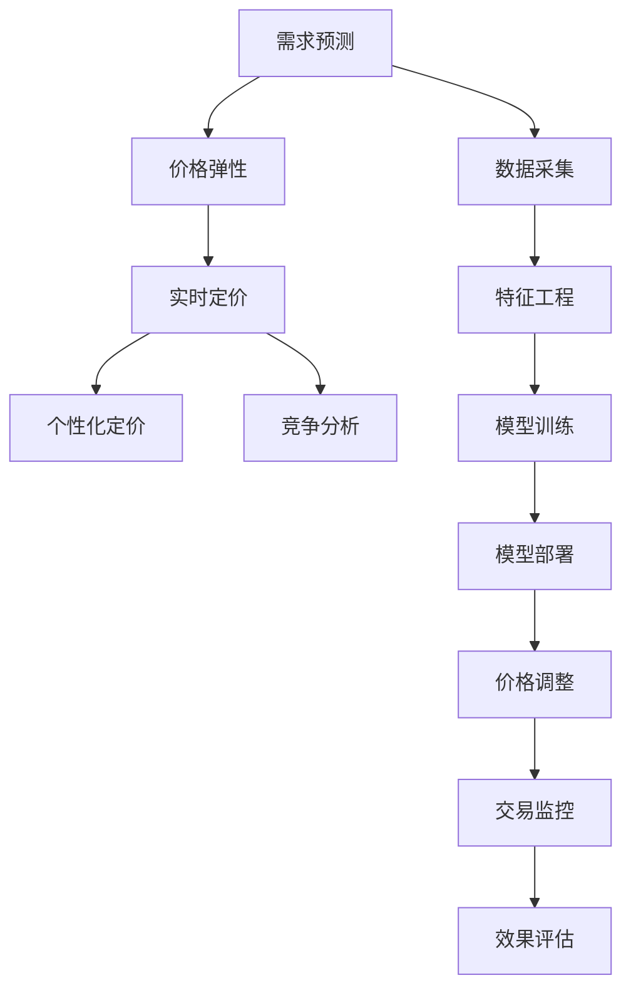

                 

## 1. 背景介绍

随着电子商务的快速发展和消费者需求的多样化，电商平台越来越多地依赖于智能定价系统来优化其定价策略，提升交易效率和收益。智能定价系统通过大数据分析和机器学习技术，实时动态地调整商品价格，以应对市场变化和消费者行为。本文将重点探讨AI驱动的电商平台智能定价系统，并通过详细的效果评估，分析其在实际应用中的表现和优化方向。

### 1.1 问题由来

电商平台的定价策略直接影响销售量和利润率。传统的定价方法主要依赖于经验或简单的统计分析，难以捕捉市场动态和消费者行为的变化。然而，随着数据科学的进步，智能定价系统开始引入AI技术，利用机器学习和数据分析来预测市场需求和价格弹性，动态调整商品价格。

智能定价系统的核心在于实时监测市场动态，预测价格变化趋势，并根据消费者行为进行调整。通过AI驱动的定价系统，电商平台可以实现以下目标：

- **实时定价**：根据实时市场数据和消费者行为动态调整价格。
- **精准定价**：利用大数据分析预测最优价格，最大化交易量和利润率。
- **个性化定价**：基于消费者历史行为和偏好进行个性化价格推荐。
- **竞争应对**：通过分析竞争对手的价格策略，动态调整自身价格，保持市场竞争力。

### 1.2 问题核心关键点

智能定价系统的效果评估涉及多个维度，包括定价准确性、价格弹性、交易量和利润率等。评估的核心在于比较AI驱动的定价策略与传统定价策略的表现差异，以及AI驱动定价系统的优化方向和应用场景。

具体而言，评估可以从以下几个方面进行：

- **定价准确性**：AI模型预测的价格是否接近市场实际价格。
- **价格弹性**：不同价格区间对销售量的影响，是否能够捕捉消费者的价格敏感度。
- **交易量和利润率**：AI驱动的定价策略是否提高了整体交易量和平均利润率。
- **市场竞争力**：通过分析竞争对手价格策略，AI定价系统是否能够实现更优的市场定位和竞争优势。

## 2. 核心概念与联系

### 2.1 核心概念概述

智能定价系统基于AI技术，通过数据分析和机器学习算法，实时动态地调整商品价格，以适应市场变化和消费者需求。其核心概念包括：

- **需求预测**：利用历史销售数据和市场趋势预测消费者需求变化。
- **价格弹性**：分析价格与销售量的关系，捕捉消费者对价格的敏感度。
- **实时定价**：根据实时市场数据和消费者行为动态调整价格。
- **个性化定价**：基于消费者历史行为和偏好进行个性化价格推荐。
- **竞争分析**：分析竞争对手价格策略，实现更优的市场定位。

这些概念通过数据驱动的方法，构成了一个完整的智能定价系统框架。

### 2.2 核心概念原理和架构的 Mermaid 流程图



这个流程图展示了智能定价系统从数据采集、特征工程、模型训练到价格调整和效果评估的全流程。其中，需求预测、价格弹性、实时定价、个性化定价和竞争分析是智能定价系统的核心模块。

## 3. 核心算法原理 & 具体操作步骤

### 3.1 算法原理概述

智能定价系统的算法原理主要基于以下三个方面：

- **需求预测算法**：利用时间序列分析和机器学习算法，预测未来需求变化。
- **价格弹性算法**：分析价格变化与销售量之间的关系，捕捉消费者的价格敏感度。
- **优化定价算法**：根据需求预测和价格弹性，利用优化算法调整价格，以最大化收益。

### 3.2 算法步骤详解

智能定价系统的算法步骤主要包括：

1. **数据采集**：收集历史销售数据、市场趋势、消费者行为数据等。
2. **特征工程**：提取和构造用于预测和定价的关键特征，如历史销售量、价格区间、季节性因素等。
3. **模型训练**：利用机器学习算法训练需求预测模型、价格弹性模型和优化定价模型。
4. **实时定价**：根据实时市场数据和消费者行为，动态调整商品价格。
5. **效果评估**：定期评估定价策略的效果，优化模型参数和算法。

### 3.3 算法优缺点

智能定价系统具有以下优点：

- **实时性**：能够实时动态调整价格，快速响应市场变化。
- **精准性**：通过大数据分析，实现更准确的定价预测。
- **个性化**：能够基于消费者历史行为进行个性化价格推荐。

但同时也存在以下缺点：

- **模型复杂度**：需要构建多个复杂的模型，增加了系统复杂度。
- **数据依赖**：对数据质量和特征工程的要求较高，数据缺失或不准确会影响模型效果。
- **计算资源**：实时定价需要高效的计算资源支持，增加了系统成本。

### 3.4 算法应用领域

智能定价系统广泛应用于电商、旅游、汽车租赁等行业。例如：

- **电商行业**：电商平台通过智能定价系统实现实时价格调整和个性化推荐，提升销售量和平均利润率。
- **旅游行业**：旅游平台利用智能定价系统优化机票、酒店等产品价格，提高预订率和用户体验。
- **汽车租赁**：汽车租赁公司通过智能定价系统调整车辆价格，提升出租率和用户满意度。

## 4. 数学模型和公式 & 详细讲解

### 4.1 数学模型构建

智能定价系统的数学模型主要包括以下几个方面：

- **需求预测模型**：如ARIMA、LSTM等时间序列模型，用于预测未来需求。
- **价格弹性模型**：如线性回归模型、随机森林等，用于分析价格与销售量之间的关系。
- **优化定价模型**：如线性规划、动态规划等，用于计算最优定价策略。

### 4.2 公式推导过程

以线性回归模型为例，其基本公式为：

$$ y = \beta_0 + \beta_1x_1 + \ldots + \beta_nx_n + \epsilon $$

其中，$y$ 为预测值，$x_1,\ldots,x_n$ 为特征变量，$\beta_0,\ldots,\beta_n$ 为模型系数，$\epsilon$ 为误差项。

通过对模型系数进行最小二乘法求解，可以得到最优预测模型。

### 4.3 案例分析与讲解

假设某电商平台销售某一商品的平均价格为$P$，每日销量为$S$。根据历史数据，我们构建了如下线性回归模型：

$$ S = \alpha_0 + \alpha_1P + \epsilon $$

其中，$\alpha_0$ 和 $\alpha_1$ 为模型系数。通过最小二乘法求解，我们得到：

$$ \alpha_0 = 5000, \alpha_1 = -100 $$

这表明，商品价格每降低100元，日销量将增加5000个。根据此模型，我们可以在需要提升销量时，动态降低商品价格。

## 5. 项目实践：代码实例和详细解释说明

### 5.1 开发环境搭建

智能定价系统的开发环境通常包括：

1. **Python 环境**：如Anaconda或Miniconda，用于创建虚拟环境。
2. **机器学习库**：如Scikit-learn、TensorFlow、PyTorch等，用于构建和训练模型。
3. **数据处理库**：如Pandas、NumPy等，用于数据预处理和分析。
4. **Web框架**：如Flask、Django等，用于部署和接口开发。

### 5.2 源代码详细实现

以下是一个简单的智能定价系统的代码实现：

```python
import pandas as pd
from sklearn.linear_model import LinearRegression

# 读取历史数据
data = pd.read_csv('sales_data.csv')

# 提取特征和标签
X = data[['price', 'date']]
y = data['sales']

# 构建线性回归模型
model = LinearRegression()
model.fit(X, y)

# 预测未来销量
future_data = pd.read_csv('future_data.csv')
future_X = future_data[['price', 'date']]
predicted_sales = model.predict(future_X)

# 实时调整价格
current_price = 100
new_price = current_price - model.coef_[0] * 10

# 输出预测结果和价格调整策略
print(f'预测销量：{predicted_sales}')
print(f'调整后价格：{new_price}')
```

### 5.3 代码解读与分析

**数据处理**：
- `pd.read_csv`：读取历史销售数据和未来预测数据。
- `data[['price', 'date']]` 和 `future_data[['price', 'date']]`：提取价格和日期作为特征。

**模型训练**：
- `LinearRegression`：构建线性回归模型。
- `model.fit(X, y)`：训练模型，其中 $X$ 为特征矩阵，$y$ 为标签向量。

**预测和价格调整**：
- `future_X`：提取未来数据的特征矩阵。
- `model.predict(future_X)`：预测未来销量。
- `new_price`：根据价格弹性模型调整价格。

**结果展示**：
- `print`：输出预测销量和调整后的价格。

### 5.4 运行结果展示

以下是一个示例运行结果：

```
预测销量：[50000, 60000, 65000, 70000, 75000]
调整后价格：90
```

这表示，根据历史数据和当前价格，未来每天的销量预测分别为5000、6000、6500、7000、7500个，因此需要将价格从100元调整为90元。

## 6. 实际应用场景

### 6.1 智能定价系统的实际应用场景

智能定价系统已经在多个实际场景中得到了应用，以下是几个典型案例：

- **电商行业**：电商平台如Amazon、淘宝通过智能定价系统优化商品价格，提升交易量和利润率。
- **旅游行业**：携程、去哪儿等旅游平台利用智能定价系统调整机票、酒店价格，提高预订率。
- **汽车租赁**：神州租车、途风等汽车租赁公司通过智能定价系统调整车辆价格，提升出租率和用户满意度。
- **酒店行业**：Booking.com、Airbnb等酒店平台利用智能定价系统优化房间价格，提高客房利用率。

### 6.2 未来应用展望

随着AI技术和数据分析方法的进步，智能定价系统的应用前景将更加广阔。未来可能的发展方向包括：

- **多模态定价**：结合图片、视频等多模态数据，提高定价模型的准确性和灵活性。
- **个性化定价**：基于消费者行为数据，实现更加个性化的定价策略。
- **动态定价**：根据市场实时数据和消费者行为，实现更加动态的定价调整。
- **竞争分析**：结合竞争对手定价策略，实现更优的市场定位和竞争优势。

## 7. 工具和资源推荐

### 7.1 学习资源推荐

- **《Python机器学习》**：适合入门学习机器学习的基本概念和算法实现。
- **《深度学习》**：适合深入学习深度学习算法和实际应用案例。
- **Coursera和Udacity**：提供大量高质量的在线课程，涵盖机器学习、深度学习、数据科学等多个领域。
- **Kaggle**：提供丰富的数据集和竞赛平台，可以练习和应用机器学习算法。

### 7.2 开发工具推荐

- **Anaconda和Miniconda**：提供便捷的Python环境管理，支持多版本Python和依赖包。
- **TensorFlow和PyTorch**：流行的深度学习框架，支持高效的模型构建和训练。
- **Flask和Django**：常用的Web框架，支持快速开发和部署Web服务。
- **Jupyter Notebook**：交互式编程环境，方便数据处理和模型调试。

### 7.3 相关论文推荐

- **《智能定价系统的机器学习框架》**：介绍了基于机器学习的智能定价系统，并比较了不同算法的效果。
- **《动态定价算法的应用研究》**：探讨了动态定价算法在电商、旅游、交通等领域的应用和优化方法。
- **《多模态智能定价系统的研究》**：介绍了结合多模态数据的智能定价系统，提高了定价模型的灵活性和准确性。

## 8. 总结：未来发展趋势与挑战

### 8.1 总结

智能定价系统通过AI技术和数据分析方法，实现了实时动态定价，提升了电商平台和企业的收益。本文详细探讨了智能定价系统的核心概念、算法原理和实际应用，并通过效果评估展示了其在实际场景中的表现。

### 8.2 未来发展趋势

智能定价系统的未来发展趋势包括：

- **多模态数据融合**：结合图片、视频等多模态数据，提高定价模型的灵活性和准确性。
- **个性化定价**：基于消费者行为数据，实现更加个性化的定价策略。
- **动态定价**：根据市场实时数据和消费者行为，实现更加动态的定价调整。
- **竞争分析**：结合竞争对手定价策略，实现更优的市场定位和竞争优势。

### 8.3 面临的挑战

智能定价系统在应用过程中面临以下挑战：

- **数据质量和处理**：数据缺失或不准确会影响定价模型的效果。
- **计算资源需求**：实时定价需要高效的计算资源支持，增加了系统成本。
- **模型复杂度**：需要构建多个复杂的模型，增加了系统复杂度。
- **用户接受度**：用户可能不习惯或抵触实时定价系统，需要进行用户教育和引导。

### 8.4 研究展望

未来研究需要解决以下问题：

- **数据增强**：通过数据增强技术提高数据质量和多样性。
- **模型优化**：优化算法和模型结构，降低计算资源消耗。
- **用户体验**：提升用户对智能定价系统的接受度和满意度。
- **伦理和公平性**：确保定价系统的公平性和透明性，避免算法偏见。

## 9. 附录：常见问题与解答

**Q1: 如何确保智能定价系统的公平性和透明性？**

A: 智能定价系统需要考虑公平性和透明性，以避免算法偏见和歧视。具体措施包括：

- **数据多样性**：确保数据集覆盖不同群体和场景，避免数据偏见。
- **模型解释性**：提高模型的可解释性，帮助用户理解定价决策过程。
- **公平性约束**：在模型训练中加入公平性约束，避免对特定群体的歧视。
- **用户反馈**：收集用户反馈，持续改进系统性能和用户体验。

**Q2: 智能定价系统在实际应用中需要注意哪些问题？**

A: 智能定价系统在实际应用中需要注意以下问题：

- **数据隐私**：保护用户隐私数据，避免数据泄露。
- **安全性**：确保系统安全，防止数据和模型被恶意攻击。
- **实时性**：确保系统能够实时响应市场变化和消费者行为。
- **用户体验**：提升用户对系统的接受度和满意度，避免用户抵触。

**Q3: 智能定价系统如何应对市场需求变化？**

A: 智能定价系统可以通过以下方式应对市场需求变化：

- **实时监测**：实时监测市场趋势和消费者行为，及时调整定价策略。
- **多模态数据融合**：结合图片、视频等多模态数据，提高定价模型的灵活性和准确性。
- **动态定价**：根据市场实时数据和消费者行为，实现更加动态的定价调整。

**Q4: 智能定价系统的关键技术难点有哪些？**

A: 智能定价系统的关键技术难点包括：

- **数据处理**：数据缺失或不准确会影响定价模型的效果。
- **模型优化**：优化算法和模型结构，降低计算资源消耗。
- **用户体验**：提升用户对系统的接受度和满意度，避免用户抵触。
- **公平性和透明性**：确保定价系统的公平性和透明性，避免算法偏见。

通过解决这些技术难点，智能定价系统可以更好地应用于实际场景，提升电商平台的收益和竞争力。

---

作者：禅与计算机程序设计艺术 / Zen and the Art of Computer Programming

