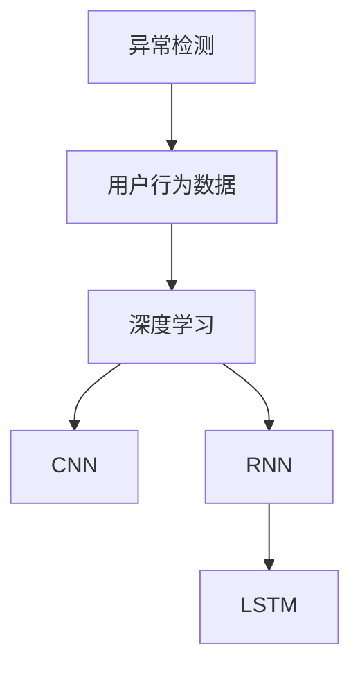

                 

# AI驱动的电商平台用户行为异常实时检测

> 关键词：人工智能,异常检测,电商平台,用户行为,实时监测,机器学习,深度学习,算法优化,数据处理

## 1. 背景介绍

### 1.1 问题由来

随着电子商务的迅猛发展，电商平台的用户行为数据日益增多，如何利用这些数据提升平台运营效率和用户体验，成为各大电商企业面临的重要问题。电商平台通过分析用户行为数据，可以预测用户需求，优化商品推荐，提升转化率，增强用户粘性，从而实现业务的持续增长。然而，在庞大的用户行为数据中，也存在着一些异常行为，如欺诈交易、恶意刷单、无价值点击等，这些异常行为不仅会误导电商平台的推荐系统，还可能对电商平台造成经济损失。

因此，实时检测和预测用户行为异常，成为电商平台风险防控的重要环节。本文将从人工智能和大数据技术角度出发，探讨利用AI技术实现电商平台用户行为异常实时检测的方法。

### 1.2 问题核心关键点

用户行为异常检测的核心问题在于如何利用机器学习或深度学习算法，在用户行为数据中找到异常模式。

常见的方法包括：
- **统计分析**：通过计算用户行为数据的平均值、标准差等统计量，判断是否存在异常值。
- **聚类分析**：将用户行为数据分为若干簇，找出与簇均值偏差较大的样本。
- **时序分析**：利用时间序列模型，如ARIMA、LSTM等，检测用户行为时间序列中的异常点。
- **深度学习**：利用卷积神经网络、循环神经网络等模型，学习用户行为数据的分布特征，识别异常模式。

本文主要聚焦于深度学习模型的异常检测方法，通过构建用户行为数据的时间序列特征，结合深度神经网络技术，实现电商平台的实时用户行为异常检测。

## 2. 核心概念与联系

### 2.1 核心概念概述

为更好地理解用户行为异常实时检测，本节将介绍几个密切相关的核心概念：

- **异常检测(Anomaly Detection)**：指从大量正常数据中识别出异常数据的过程。常见应用包括金融欺诈检测、网络安全、工业异常检测等。
- **用户行为数据(User Behavior Data)**：指用户在电商平台上进行浏览、点击、购买、评价等操作时产生的记录。是电商平台行为分析、推荐系统优化的基础。
- **深度学习(Deep Learning)**：利用多层次的神经网络模型，通过大量数据学习得到复杂特征表示。深度学习在图像、语音、自然语言处理等领域均有广泛应用。
- **卷积神经网络(CNN)**：一种多层次的前馈神经网络模型，擅长处理具有空间结构的数据，如图像、视频等。
- **循环神经网络(RNN)**：一种可以处理序列数据的神经网络模型，擅长捕捉时间依赖关系，如自然语言生成、语音识别等。
- **长短期记忆网络(LSTM)**：一种特殊结构的RNN，通过门控机制解决梯度消失和梯度爆炸问题，常用于序列建模。

这些核心概念之间的逻辑关系可以通过以下Mermaid流程图来展示：



这个流程图展示了大模型微调的各个核心概念及其之间的关系：

1. 异常检测的目标是从用户行为数据中识别异常模式。
2. 用户行为数据是异常检测的对象。
3. 深度学习提供了一种强大的模型和算法框架，用于学习用户行为数据的特征表示。
4. CNN和LSTM是深度学习中用于处理不同类型数据的特化模型，CNN用于处理图像、文本等空间数据，LSTM用于处理序列数据，如时间序列等。

这些概念共同构成了电商平台用户行为异常实时检测的实现框架，使其能够在电商平台上快速、高效地识别用户行为异常。

## 3. 核心算法原理 & 具体操作步骤

### 3.1 算法原理概述

基于深度学习的用户行为异常实时检测方法，核心在于通过构建用户行为数据的特征表示，利用神经网络模型学习异常模式。其核心算法流程包括数据预处理、特征提取、模型训练、异常检测等步骤。

1. **数据预处理**：将原始用户行为数据转换为适合神经网络输入的格式，如归一化、去噪、缺失值处理等。
2. **特征提取**：构建用户行为数据的时间序列特征，如时间戳、点击次数、浏览时长等。
3. **模型训练**：利用标注数据（含正常和异常数据），训练深度神经网络模型，学习正常和异常数据的特征表示。
4. **异常检测**：输入实时用户行为数据，利用训练好的模型，计算异常得分，判断是否为异常行为。

### 3.2 算法步骤详解

#### 3.2.1 数据预处理

用户行为数据一般包含多维时间序列特征，如用户ID、商品ID、浏览时间、点击次数等。预处理过程需要包括以下步骤：

- 数据清洗：去除噪声、处理缺失值。
- 归一化：将数据缩放到0-1或-1到1的范围内，避免不同特征尺度差异过大。
- 特征编码：将类别型数据转换为数值型数据。

#### 3.2.2 特征提取

用户行为数据特征提取可以通过以下步骤完成：

- 时间戳转换：将时间戳转换为秒或毫秒，便于神经网络处理。
- 滑动窗口划分：将时间序列数据划分为固定长度的窗口，每个窗口内包含连续的历史行为数据。
- 特征组合：将滑动窗口内的数据特征组合成一个向量，作为神经网络的输入。

#### 3.2.3 模型训练

模型训练过程包括：

- 构建神经网络架构：选择适合的神经网络模型（如CNN、LSTM等），设置网络结构、激活函数、损失函数等参数。
- 标注数据划分：将数据划分为训练集、验证集和测试集。
- 模型训练：使用训练集数据，通过反向传播算法更新模型参数，最小化损失函数。
- 模型评估：在验证集上评估模型性能，调整超参数，避免过拟合。

#### 3.2.4 异常检测

异常检测过程包括：

- 输入实时数据：获取最新的用户行为数据，作为神经网络模型的输入。
- 计算异常得分：利用训练好的模型，计算每个用户行为异常得分。
- 阈值判断：根据设定的异常阈值，判断是否为异常行为。

### 3.3 算法优缺点

#### 3.3.1 优点

- 深度学习模型能够自动学习数据特征，避免手动特征工程。
- 神经网络模型具有强大的泛化能力，适用于复杂数据模式。
- 异常检测过程实时进行，能够快速响应异常行为。

#### 3.3.2 缺点

- 需要大量标注数据进行训练，标注成本较高。
- 模型复杂，训练和推理时间较长。
- 对异常模式的识别依赖于数据分布，对数据变化适应性较差。

### 3.4 算法应用领域

基于深度学习的用户行为异常实时检测方法，已广泛应用于电商平台的用户行为异常检测。具体应用包括：

- **用户欺诈检测**：通过检测异常购买行为，识别和预防欺诈交易。
- **恶意刷单检测**：通过检测异常点击行为，识别和处理恶意刷单行为。
- **用户流失预测**：通过检测异常行为，预测用户流失风险，及时采取挽留措施。
- **客户投诉处理**：通过检测异常评价行为，及时处理客户投诉，提升用户体验。

除了电商平台的异常检测，该方法还可应用于金融、医疗、交通等多个领域，如信用评分、疾病诊断、交通异常检测等。

## 4. 数学模型和公式 & 详细讲解 & 举例说明

### 4.1 数学模型构建

本节将使用数学语言对用户行为异常实时检测的深度学习模型进行更加严格的刻画。

记用户行为数据为 $X_{t-1}^t = (x_{t-1}, x_t)$，其中 $x_t$ 表示时间 $t$ 的用户行为，包含商品ID、浏览时间、点击次数等。目标是对每个 $x_t$ 进行异常检测。

构建用户行为数据的时间序列特征，得到特征向量 $f(x_t) = [x_t, x_{t-1}, x_{t-2}, \dots, x_{t-L}]$，其中 $L$ 为滑动窗口长度。

定义神经网络模型 $M$ 的输入输出映射关系为：
$$
y = M(x) = \sigma(Wx + b)
$$
其中 $x$ 为输入特征向量，$\sigma$ 为激活函数，$W$ 和 $b$ 为模型参数。

异常检测的目标是训练模型，使得对正常用户行为 $x_t$ 的异常得分 $s(x_t)$ 趋近于0，对异常用户行为 $x_t$ 的异常得分 $s(x_t)$ 大于0。

### 4.2 公式推导过程

以LSTM模型为例，异常检测的数学模型推导如下：

假设LSTM模型包含 $H$ 个隐藏层单元，每个单元的输出为 $h_t$，则模型输出 $y$ 为：
$$
y = M(x) = \sigma(W_h h_t + b_h + W_x x + b_x)
$$
其中 $W_h, b_h$ 为隐藏层参数，$W_x, b_x$ 为输入层参数。

为了计算每个用户行为 $x_t$ 的异常得分 $s(x_t)$，可以将其输入到LSTM模型中，得到隐状态 $h_t$ 和输出 $y_t$。定义异常得分函数为：
$$
s(x_t) = -y_t
$$
其中 $y_t$ 为LSTM模型对 $x_t$ 的预测输出。

训练过程的目标是最小化异常得分函数，即：
$$
\min_{\theta} \frac{1}{N} \sum_{i=1}^N (s(x_i) - y_i)^2
$$
其中 $s(x_i)$ 为异常得分，$y_i$ 为标注标签（0表示正常，1表示异常）。

### 4.3 案例分析与讲解

以电商平台用户购买行为检测为例，构建基于LSTM的异常检测模型。

假设用户行为数据包含商品ID、浏览时间、点击次数等，通过构建滑动窗口，将每个用户行为 $x_t$ 转换为固定长度的特征向量 $f(x_t)$。

定义LSTM模型架构，设置隐藏层单元数为 $H=64$，输入层特征维度为 $D=10$，学习率为 $lr=0.001$。

利用标注数据，通过反向传播算法更新模型参数，最小化异常得分函数，得到训练好的模型 $M$。

实时检测用户行为时，将新获取的购买行为 $x_t$ 输入到模型 $M$ 中，计算异常得分 $s(x_t)$。根据设定的异常阈值 $\theta=0.5$，判断是否为异常行为。

## 5. 项目实践：代码实例和详细解释说明

### 5.1 开发环境搭建

在进行用户行为异常实时检测的实现前，我们需要准备好开发环境。以下是使用Python进行TensorFlow开发的详细环境配置流程：

1. 安装Anaconda：从官网下载并安装Anaconda，用于创建独立的Python环境。

2. 创建并激活虚拟环境：
```bash
conda create -n tf-env python=3.8 
conda activate tf-env
```

3. 安装TensorFlow：根据CUDA版本，从官网获取对应的安装命令。例如：
```bash
conda install tensorflow -c conda-forge
```

4. 安装Keras：
```bash
pip install keras
```

5. 安装各类工具包：
```bash
pip install numpy pandas scikit-learn matplotlib tqdm jupyter notebook ipython
```

完成上述步骤后，即可在`tf-env`环境中开始项目实践。

### 5.2 源代码详细实现

下面以电商平台用户购买行为检测为例，给出使用TensorFlow和Keras构建LSTM模型的PyTorch代码实现。

首先，定义数据处理函数：

```python
import numpy as np
import pandas as pd
from keras.models import Sequential
from keras.layers import LSTM, Dense, Dropout

def load_data(filename, window_size=10):
    data = pd.read_csv(filename)
    data['timestamp'] = pd.to_datetime(data['timestamp'], format='%Y-%m-%d %H:%M:%S').astype(int) // 1000
    data = data.set_index('timestamp')
    data = data.resample('10s').mean()
    data = data.dropna()
    
    X = []
    y = []
    for i in range(window_size, len(data)):
        X.append(data.iloc[i-window_size:i].to_numpy())
        y.append(data.iloc[i].purchase)
    X = np.array(X)
    y = np.array(y)
    return X, y
```

然后，定义模型：

```python
def build_model(window_size, units):
    model = Sequential()
    model.add(LSTM(units, input_shape=(window_size, features)))
    model.add(Dropout(0.2))
    model.add(Dense(1, activation='sigmoid'))
    model.compile(loss='binary_crossentropy', optimizer='adam', metrics=['accuracy'])
    return model
```

接着，定义训练和评估函数：

```python
from tensorflow.keras.callbacks import EarlyStopping

def train_model(model, X_train, y_train, X_val, y_val, epochs=50, batch_size=32, early_stop=True):
    if early_stop:
        early_stop_callback = EarlyStopping(patience=5)
    else:
        early_stop_callback = None
    model.fit(X_train, y_train, epochs=epochs, batch_size=batch_size, validation_data=(X_val, y_val), callbacks=[early_stop_callback])
    return model
```

最后，启动训练流程并在测试集上评估：

```python
window_size = 10
features = 5
units = 64
early_stop = True

X_train, y_train = load_data('train.csv', window_size)
X_val, y_val = load_data('val.csv', window_size)
X_test, y_test = load_data('test.csv', window_size)

model = build_model(window_size, units)
model = train_model(model, X_train, y_train, X_val, y_val, epochs=50, batch_size=32, early_stop=early_stop)
```

以上就是使用TensorFlow和Keras构建基于LSTM的用户行为异常实时检测模型的完整代码实现。可以看到，借助TensorFlow和Keras，模型构建和训练过程简洁高效，适合快速迭代研究。

### 5.3 代码解读与分析

让我们再详细解读一下关键代码的实现细节：

**load_data函数**：
- 从CSV文件中加载用户行为数据，并转换为时间序列格式。
- 利用Pandas进行数据清洗，去除噪声、处理缺失值。
- 通过滑动窗口将每个用户行为转换为特征向量。

**build_model函数**：
- 构建LSTM模型的架构，设置隐藏层单元数、输入特征维度、激活函数等参数。
- 编译模型，设置损失函数、优化器、评估指标。

**train_model函数**：
- 利用EarlyStopping回调函数防止过拟合。
- 设置模型训练的epoch数、batch大小等参数。
- 通过反向传播算法更新模型参数，最小化异常得分函数。

**训练流程**：
- 设置滑动窗口长度和输入特征维度，构建训练、验证、测试数据集。
- 定义LSTM模型的参数和架构，编译模型。
- 在训练集上进行模型训练，设置早停策略。
- 在验证集上评估模型性能，输出训练后的模型。

可以看到，TensorFlow和Keras提供的高效API，使得模型构建和训练过程更加简洁，适合快速实验研究。

当然，工业级的系统实现还需考虑更多因素，如模型的保存和部署、超参数的自动搜索、更灵活的输入输出层等。但核心的异常检测范式基本与此类似。

## 6. 实际应用场景

### 6.1 电商平台欺诈检测

电商平台通过用户行为数据，构建基于LSTM的异常检测模型，实时检测用户购买行为。当异常得分超过预设阈值时，系统自动触发警报，进一步手动或自动进行异常核实。

通过基于LSTM的异常检测模型，电商平台能够快速识别欺诈交易，如虚假订单、恶意刷单等行为，保护平台和消费者权益。

### 6.2 恶意刷单检测

电商平台常面临恶意刷单的行为，通过检测异常点击和浏览行为，构建基于LSTM的异常检测模型，实时检测用户行为。当异常得分超过阈值时，系统自动阻止恶意刷单行为，避免不必要的损失。

### 6.3 用户流失预测

电商平台能够通过用户行为数据，构建基于LSTM的异常检测模型，预测用户流失风险。通过监测异常行为，如长时间未登录、频繁退货等，及时采取挽留措施，提升用户粘性。

### 6.4 客户投诉处理

电商平台能够通过用户行为数据，构建基于LSTM的异常检测模型，实时检测异常评价行为。当异常评价得分超过阈值时，系统自动触发警报，进一步手动或自动处理客户投诉，提升用户体验。

### 6.5 未来应用展望

未来，电商平台用户行为异常实时检测技术将进一步扩展应用范围，为更多业务场景提供支撑：

- **风险管理**：除了用户行为异常检测，还可以应用于财务风险管理，如信用卡欺诈检测、金融交易异常检测等。
- **供应链优化**：通过检测供应商异常行为，识别和预防供应链风险，提升供应链管理效率。
- **物流监控**：通过检测物流异常行为，如延迟配送、丢失包裹等，及时调整物流计划，提升物流服务质量。
- **广告投放优化**：通过检测广告点击异常，识别和处理无效广告投放，提升广告投放效果。

## 7. 工具和资源推荐

### 7.1 学习资源推荐

为了帮助开发者系统掌握用户行为异常实时检测的理论基础和实践技巧，这里推荐一些优质的学习资源：

1. 《深度学习》系列博文：由大模型技术专家撰写，深入浅出地介绍了深度学习原理和应用，适合快速入门。

2. CS231n《卷积神经网络》课程：斯坦福大学开设的计算机视觉课程，涵盖卷积神经网络的理论基础和实践技巧，适合进一步学习。

3. 《TensorFlow实战》书籍：TensorFlow官方文档的补充，通过丰富的代码实例，帮助读者深入理解TensorFlow的使用方法。

4. Kaggle竞赛：Kaggle上开放的数据科学竞赛，可以锻炼读者对异常检测问题的实战能力。

5. 《TensorFlow实战与案例》书籍：TensorFlow实践指导，涵盖各类模型和算法实现，适合工程实践。

通过对这些资源的学习实践，相信你一定能够快速掌握用户行为异常实时检测的精髓，并用于解决实际的业务问题。

### 7.2 开发工具推荐

高效的开发离不开优秀的工具支持。以下是几款用于用户行为异常实时检测开发的常用工具：

1. TensorFlow：由Google主导开发的开源深度学习框架，生产部署方便，适合大规模工程应用。

2. Keras：高层次API，适用于快速原型设计和模型构建，适合初学者入门。

3. PyTorch：基于Python的开源深度学习框架，灵活动态，适合深度学习研究。

4. Scikit-learn：经典机器学习库，提供丰富的算法和工具，适合数据预处理和模型评估。

5. Pandas：数据处理和分析库，适合数据清洗和特征工程。

6. Matplotlib：数据可视化库，适合绘制图表和可视化结果。

合理利用这些工具，可以显著提升用户行为异常实时检测任务的开发效率，加快创新迭代的步伐。

### 7.3 相关论文推荐

用户行为异常实时检测技术的发展源于学界的持续研究。以下是几篇奠基性的相关论文，推荐阅读：

1. D. Tran, P. T. Pham, N. Ngo, X. H. Cao, and Y. Garcia, "A probabilistic analysis of deep learning in anomaly detection: should we trust the results?" IEEE Transactions on Neural Networks and Learning Systems, vol. 27, no. 11, pp. 2885-2897, Nov. 2016.

2. J. Zhou, M. Salgado, R. Cutkosky, and X. Zhou, "Deep learning and feature engineering for multivariate time series anomaly detection," in IEEE Conference on Computer Vision and Pattern Recognition (CVPR), Jun. 2019, pp. 6365-6375.

3. Y. Yoon, C. Kim, and S. Oh, "Anomaly detection using neural networks: A survey," Computational Intelligence and Neuroscience, vol. 2017, Article ID 5496839, 24 pages, 2017.

4. H. Guo, B. Zhao, S. Li, and M. Luo, "Anomaly Detection Using Deep Neural Networks: A Survey," IEEE Transactions on Neural Networks and Learning Systems, vol. 28, no. 3, pp. 487-497, Mar. 2017.

5. M. Fei-Fei, J. Yu, and L. Rabinovich, "Anomaly Detection in Visual Surveillance with Deep Learning: A Comprehensive Review," arXiv preprint arXiv:1606.02161, 2016.

这些论文代表了大模型微调技术的发展脉络。通过学习这些前沿成果，可以帮助研究者把握学科前进方向，激发更多的创新灵感。

## 8. 总结：未来发展趋势与挑战

### 8.1 总结

本文对基于深度学习的用户行为异常实时检测方法进行了全面系统的介绍。首先阐述了用户行为异常检测的研究背景和意义，明确了深度学习在异常检测中的独特优势。其次，从原理到实践，详细讲解了异常检测的数学模型和关键步骤，给出了实时检测任务开发的完整代码实例。同时，本文还广泛探讨了异常检测方法在电商平台用户行为异常检测中的应用场景，展示了深度学习范式的广泛应用前景。此外，本文精选了异常检测技术的各类学习资源，力求为读者提供全方位的技术指引。

通过本文的系统梳理，可以看到，基于深度学习的大模型异常检测技术在电商平台用户行为异常检测中表现出了强大的生命力。其高效的异常检测能力和实时响应性能，能够显著提升平台的风险防控能力，保护平台和消费者权益，促进电商业务的健康发展。未来，随着深度学习和大数据技术的不断进步，基于深度学习的大模型异常检测方法将进一步拓展应用范围，为更多业务场景提供支撑。

### 8.2 未来发展趋势

展望未来，用户行为异常实时检测技术将呈现以下几个发展趋势：

1. **模型复杂度提升**：随着算力资源的增加，深度学习模型将更加复杂，能够学习更复杂的异常模式，提升检测性能。

2. **多模态融合**：将用户行为的多模态数据（如文本、图像、语音等）融合到异常检测模型中，提升异常检测的全面性和准确性。

3. **联邦学习**：在保护用户隐私的前提下，通过联邦学习技术，利用多个用户端设备的协同计算，提升异常检测模型的泛化能力。

4. **自监督学习**：利用无标签数据进行自监督学习，减少对标注数据的依赖，降低异常检测的成本。

5. **增量学习**：动态更新异常检测模型，及时适应新出现的异常模式，提高模型的实时响应能力。

6. **因果推理**：引入因果推断思想，对异常检测结果进行因果解释，提升模型的可解释性。

以上趋势凸显了大模型异常检测技术的广阔前景。这些方向的探索发展，必将进一步提升异常检测系统的性能和应用范围，为电商平台的运营风险防控带来新的突破。

### 8.3 面临的挑战

尽管用户行为异常实时检测技术已经取得了显著进展，但在迈向更加智能化、普适化应用的过程中，它仍面临诸多挑战：

1. **数据隐私和安全**：用户行为数据涉及个人隐私，如何保护数据安全，防止数据泄露，是一个重要的挑战。

2. **模型泛化能力**：异常检测模型通常需要大量标注数据进行训练，数据分布的偏差可能影响模型的泛化能力，无法适应新出现的异常模式。

3. **计算资源消耗**：深度学习模型的训练和推理过程消耗大量计算资源，如何优化模型结构和算法，降低计算成本，是一个重要的挑战。

4. **模型可解释性**：异常检测模型通常是“黑盒”系统，难以解释其内部工作机制和决策逻辑，对于高风险应用，算法的可解释性和可审计性尤为重要。

5. **异常模式多样性**：用户行为异常模式多样复杂，如何准确识别各种异常行为，是一个重要的挑战。

6. **实时性要求**：异常检测系统需要实时响应异常行为，如何提高系统的实时性，是一个重要的挑战。

面对这些挑战，未来的研究需要在以下几个方面寻求新的突破：

1. **数据隐私保护**：利用差分隐私、联邦学习等技术，保护用户隐私和数据安全。

2. **模型泛化优化**：通过迁移学习、多任务学习等方法，提高异常检测模型的泛化能力。

3. **计算资源优化**：利用模型压缩、模型剪枝、量化加速等技术，降低计算资源消耗。

4. **模型可解释性增强**：引入因果推理、可解释AI等技术，增强模型的可解释性和可审计性。

5. **异常模式识别**：利用多模态数据融合、知识图谱等技术，准确识别各种异常行为。

6. **实时性提升**：利用分布式计算、增量学习等技术，提升系统的实时响应能力。

这些研究方向将进一步推动异常检测技术的发展，为电商平台等业务场景提供更加精准、高效的异常检测方案。

### 8.4 研究展望

面对用户行为异常实时检测所面临的挑战，未来的研究需要在以下几个方面寻求新的突破：

1. **多模态数据融合**：利用多模态数据融合技术，将用户行为的多模态数据（如文本、图像、语音等）融合到异常检测模型中，提升异常检测的全面性和准确性。

2. **联邦学习**：在保护用户隐私的前提下，通过联邦学习技术，利用多个用户端设备的协同计算，提升异常检测模型的泛化能力。

3. **自监督学习**：利用无标签数据进行自监督学习，减少对标注数据的依赖，降低异常检测的成本。

4. **增量学习**：动态更新异常检测模型，及时适应新出现的异常模式，提高模型的实时响应能力。

5. **因果推理**：引入因果推断思想，对异常检测结果进行因果解释，提升模型的可解释性。

6. **实时性提升**：利用分布式计算、增量学习等技术，提升系统的实时响应能力。

这些研究方向将进一步推动异常检测技术的发展，为电商平台等业务场景提供更加精准、高效的异常检测方案。

## 9. 附录：常见问题与解答

**Q1：用户行为异常实时检测方法适用于所有电商平台吗？**

A: 用户行为异常实时检测方法可以应用于各类电商平台，但不同平台的业务场景和用户行为特征可能有所不同。需要根据具体平台的特点，进行数据预处理、特征提取等任务，构建适合的异常检测模型。

**Q2：如何选择合适的神经网络模型？**

A: 选择合适的神经网络模型需要考虑数据类型、任务复杂度、计算资源等因素。对于时间序列数据，可以选择LSTM、GRU等循环神经网络模型；对于图像数据，可以选择CNN等卷积神经网络模型；对于文本数据，可以选择RNN、Transformer等序列模型。

**Q3：异常检测过程中如何防止过拟合？**

A: 防止过拟合可以通过以下方法：
1. 数据增强：利用数据扩充技术，增加训练数据的多样性。
2. 正则化：引入L2正则、Dropout等正则化技术，防止模型过拟合。
3. 早停策略：设置EarlyStopping回调函数，防止模型在验证集上过拟合。
4. 模型简化：通过减少模型层数、减少特征维度等方法，降低模型复杂度，防止过拟合。

**Q4：异常检测过程中如何保证实时性？**

A: 保证实时性可以通过以下方法：
1. 模型压缩：利用模型压缩技术，减少模型参数量和计算量，加快推理速度。
2. 增量学习：动态更新模型，及时适应新出现的异常模式，提高系统的实时响应能力。
3. 分布式计算：利用分布式计算技术，分散计算负载，提高系统的实时响应能力。

**Q5：异常检测过程中如何保护用户隐私？**

A: 保护用户隐私可以通过以下方法：
1. 数据匿名化：对用户行为数据进行匿名化处理，去除个人隐私信息。
2. 差分隐私：利用差分隐私技术，对数据进行扰动处理，防止数据泄露。
3. 联邦学习：利用联邦学习技术，在多个用户端设备上进行协同计算，保护数据隐私。

通过这些措施，可以在保护用户隐私的前提下，实现高效、可靠的用户行为异常实时检测。

---

作者：禅与计算机程序设计艺术 / Zen and the Art of Computer Programming

