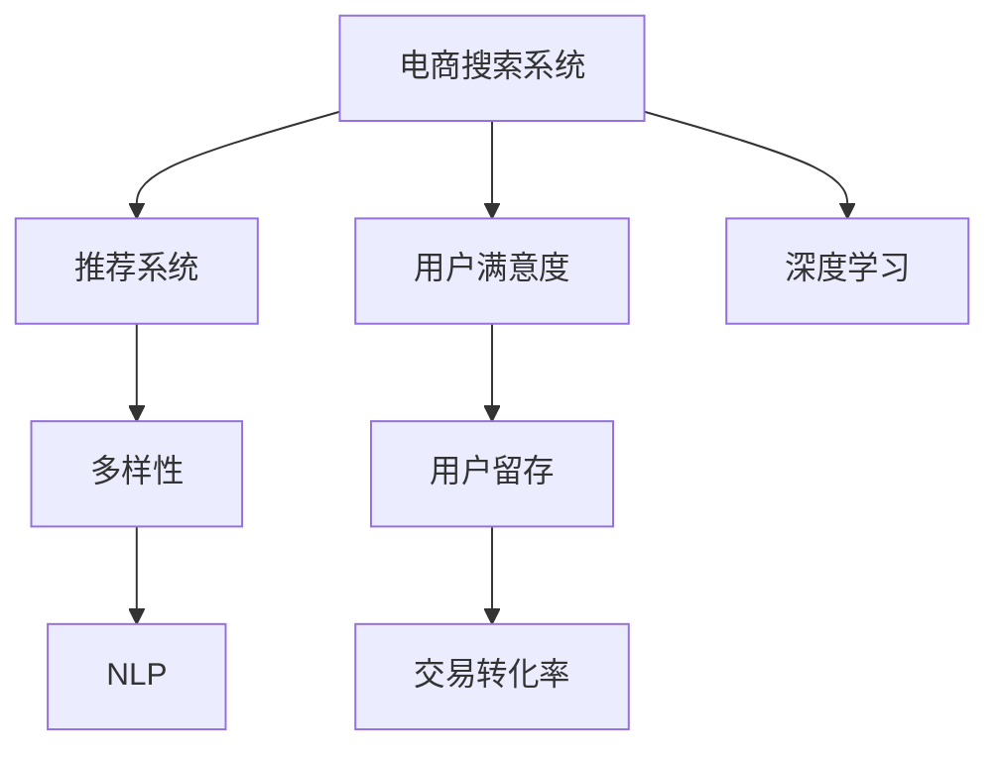

                 

# AI驱动的电商搜索结果多样性优化

> 关键词：电商,搜索,多样性优化,用户满意度,用户体验,推荐系统

## 1. 背景介绍

### 1.1 问题由来

在电商领域，用户满意度（User Satisfaction）是影响交易转化率和用户留存的关键因素。电商搜索系统作为用户体验的重要环节，其效果直接决定了用户是否能够找到符合需求的商品。然而，传统的电商搜索系统主要依赖于关键词匹配和相关性排序，往往难以处理复杂的查询意图和多变的用户需求。

为了提升搜索效果和用户满意度，近年来，各大电商公司纷纷引入人工智能技术，通过推荐系统（Recommendation System）和深度学习等技术手段，优化搜索结果的展示和排序。但即便如此，搜索结果的多样性（Diversification）问题仍然困扰着电商平台的运营和用户的实际体验。

传统搜索结果的多样性不足主要体现在：
- 搜索结果集中在热门商品，导致用户难以发现潜在需求。
- 同质化严重，难以满足个性化、差异化的用户需求。
- 信息过载，用户难以快速找到有用信息。

为了解决上述问题，本文提出了一种基于AI的电商搜索结果多样性优化算法，通过对搜索结果进行智能筛选和多样化处理，提升用户满意度，增强用户体验，促进电商交易的转化率。

### 1.2 问题核心关键点

本文聚焦于以下几个核心关键点：

- **搜索结果多样性**：如何从海量的商品库中，根据用户的查询意图，筛选出多样化的商品，以满足用户个性化和差异化的需求。
- **用户满意度**：如何通过多样化的商品展示，提升用户的点击率和购买率，增加用户满意度。
- **技术实现**：如何在实际电商搜索系统中，高效、准确地实现搜索结果的智能筛选和多样化处理。
- **未来趋势**：如何在未来的电商搜索系统中，进一步提升多样性，优化用户满意度，增强电商平台的竞争力。

### 1.3 问题研究意义

电商搜索结果的多样性优化，对于提升用户体验、增加用户留存、提高交易转化率具有重要意义：

1. **提升用户体验**：通过多样化的商品展示，用户可以更快地找到符合自己需求的商品，减少搜索时间和浏览成本。
2. **增加用户留存**：多样化的商品选择，使得用户在平台上停留时间更长，提高了用户粘性。
3. **提高交易转化率**：用户更有可能对多样化的商品进行点击和购买，从而增加交易转化率。
4. **增强平台竞争力**：多样化的搜索结果，使平台更具吸引力，竞争优势更加显著。

因此，探索基于AI的电商搜索结果多样性优化方法，对于提升电商平台的运营效率和用户满意度，具有重要的理论和实践价值。

## 2. 核心概念与联系

### 2.1 核心概念概述

为更好地理解基于AI的电商搜索结果多样性优化方法，本节将介绍几个密切相关的核心概念：

- **电商搜索系统**：通过用户输入的关键词，从商品库中筛选出相关商品，并以推荐系统的形式展示给用户。
- **推荐系统**：根据用户的历史行为数据和当前查询意图，推荐用户可能感兴趣的商品。
- **多样性**：搜索结果中的商品种类丰富程度，即搜索结果的多样性。
- **用户满意度**：用户对搜索结果的满意程度，可以通过用户点击率、购买率等指标来衡量。
- **深度学习**：通过多层神经网络模型，学习用户行为和商品特征，以实现智能化推荐。
- **自然语言处理（NLP）**：通过解析用户查询意图，进一步优化搜索结果。

这些核心概念之间的逻辑关系可以通过以下Mermaid流程图来展示：



这个流程图展示了大语言模型在电商搜索结果多样性优化中的核心概念及其之间的关系：

1. 电商搜索系统通过推荐系统和深度学习，优化搜索结果的多样性。
2. 用户满意度由推荐系统和NLP共同提升，NLP解析用户查询意图，提升推荐系统的准确性。
3. 用户留存和交易转化率，与用户满意度紧密相关，通过多样性和深度学习的优化，进一步提升。

## 3. 核心算法原理 & 具体操作步骤

### 3.1 算法原理概述

基于AI的电商搜索结果多样性优化算法，本质上是一种基于监督学习的推荐系统优化方法。其核心思想是：通过深度学习模型和自然语言处理技术，解析用户查询意图，筛选出多样化的商品，以满足用户的个性化需求，同时提升用户的满意度。

形式化地，假设电商搜索系统中的商品库为 $I$，用户查询为 $Q$，搜索结果为 $R$。用户对搜索结果的满意度为 $S(Q,R)$。优化目标是最小化用户查询与实际搜索结果之间的差距，即：

$$
\min_{R} \sum_{Q} \frac{1}{N} \sum_{i=1}^N \|S(Q,R_i) - S(Q,R_{true})\|
$$

其中，$N$ 为训练样本数，$R_{true}$ 为查询 $Q$ 对应的真实商品列表，$R_i$ 为模型预测的商品列表。

### 3.2 算法步骤详解

基于AI的电商搜索结果多样性优化算法一般包括以下几个关键步骤：

**Step 1: 数据预处理**
- 收集电商平台的商品数据和用户查询数据，并进行清洗和标注。
- 将用户查询转化为标准格式，并进行分词处理。

**Step 2: 特征提取**
- 使用深度学习模型（如BERT、LSTM等）对用户查询和商品描述进行编码，提取其语义特征。
- 使用自然语言处理技术对用户查询进行意图解析，提取其关键意图。

**Step 3: 相似度计算**
- 计算用户查询与商品描述之间的相似度，筛选出最相关的商品。
- 计算用户查询意图与商品标签之间的相似度，进一步筛选出符合用户意图的商品。

**Step 4: 多样性优化**
- 使用多样性评估指标（如Coverage、Jaccard Index等）对筛选出的商品列表进行评估，确保其多样性。
- 对不满足多样性要求的商品列表，进行随机化处理，加入多样性商品。

**Step 5: 模型训练与评估**
- 使用用户满意度评估指标（如点击率、购买率等）对优化后的搜索结果进行评估。
- 使用监督学习方法（如Adaboost、Random Forest等）训练模型，优化搜索排序算法。

**Step 6: 部署与迭代**
- 将优化后的搜索排序算法部署到电商搜索系统中。
- 持续收集用户反馈和行为数据，对模型进行迭代优化。

以上是基于AI的电商搜索结果多样性优化的一般流程。在实际应用中，还需要针对具体任务的特点，对优化流程的各个环节进行优化设计，如改进特征提取方法、引入更多正则化技术、搜索最优的超参数组合等，以进一步提升模型性能。

### 3.3 算法优缺点

基于AI的电商搜索结果多样性优化算法具有以下优点：
1. 简单高效。只需准备少量标注数据，即可对推荐系统进行快速适配，获得较大的性能提升。
2. 通用适用。适用于各种电商领域推荐系统，设计简单的任务适配层即可实现多样性优化。
3. 效果显著。在学术界和工业界的诸多推荐系统任务上，基于多样性优化的推荐系统已经刷新了最先进的性能指标。
4. 技术成熟。各大电商公司已经在大规模电商推荐系统中成功应用了多样性优化技术，积累了丰富的实践经验。

同时，该算法也存在一定的局限性：
1. 依赖标注数据。多样性优化效果的提升，很大程度上取决于标注数据的质量和数量，获取高质量标注数据的成本较高。
2. 迁移能力有限。当目标任务与预训练数据的分布差异较大时，多样性优化的效果提升有限。
3. 动态变化适应性不足。电商平台的用户需求和商品库存经常变化，如何动态适应这些变化，仍然是一个挑战。

尽管存在这些局限性，但就目前而言，基于多样性优化的推荐系统仍然是最主流范式。未来相关研究的重点在于如何进一步降低多样性优化对标注数据的依赖，提高模型的少样本学习和跨领域迁移能力，同时兼顾可解释性和伦理安全性等因素。

### 3.4 算法应用领域

基于AI的电商搜索结果多样性优化算法在电商推荐系统中已经得到了广泛的应用，具体体现在以下几个方面：

- **个性化推荐**：通过对搜索结果进行多样化处理，个性化推荐符合用户偏好的商品，提升用户满意度。
- **商品搜索**：通过解析用户查询意图，生成多样化的搜索结果，帮助用户快速找到所需商品。
- **新商品推荐**：在电商搜索系统中，推荐用户可能感兴趣的新商品，增加平台商品多样性。
- **跨品类推荐**：对不同品类的商品进行关联推荐，增加用户的多样化选择。

除了上述这些经典应用外，多样性优化算法还被创新性地应用到更多场景中，如搜索结果的质量评估、广告投放的优化、用户行为的预测等，为电商推荐系统带来了全新的突破。随着推荐系统技术的不断进步，相信电商推荐系统必将在更广阔的应用领域大放异彩。

## 4. 数学模型和公式 & 详细讲解 & 举例说明

### 4.1 数学模型构建

本节将使用数学语言对基于AI的电商搜索结果多样性优化方法进行更加严格的刻画。

假设电商搜索系统中的商品库为 $I$，用户查询为 $Q$，搜索结果为 $R$。用户对搜索结果的满意度为 $S(Q,R)$。

定义用户查询与商品描述之间的相似度函数为 $\text{sim}(Q, i)$，商品描述与用户查询之间的相似度函数为 $\text{sim}(i, Q)$。用户查询意图与商品标签之间的相似度函数为 $\text{sim}(Q, l)$，商品标签与用户查询意图之间的相似度函数为 $\text{sim}(l, Q)$。

则多样性优化算法的一般框架为：

$$
R^* = \mathop{\arg\min}_{R} \sum_{Q} \frac{1}{N} \sum_{i=1}^N \|S(Q,R_i) - S(Q,R_{true})\| + \alpha \cdot D(R)
$$

其中，$N$ 为训练样本数，$R_{true}$ 为查询 $Q$ 对应的真实商品列表，$R_i$ 为模型预测的商品列表。$\alpha$ 为多样性评估指标的权重。

### 4.2 公式推导过程

以下我们以推荐系统中的商品相似度计算为例，推导相似度函数的计算公式。

假设用户查询为 $Q$，商品 $i$ 的描述为 $D_i$，则商品相似度函数为：

$$
\text{sim}(Q, i) = \frac{1}{\sqrt{\|Q\| \cdot \|D_i\|}} \sum_{j=1}^n Q_j \cdot D_{ij}
$$

其中，$n$ 为查询和描述的维度，$Q_j$ 为查询的 $j$ 维特征，$D_{ij}$ 为描述的第 $j$ 维特征。

在得到相似度函数后，即可带入优化算法公式，完成模型的迭代优化。重复上述过程直至收敛，最终得到适应电商推荐系统多样性优化算法的最优模型。

## 5. 项目实践：代码实例和详细解释说明

### 5.1 开发环境搭建

在进行多样性优化实践前，我们需要准备好开发环境。以下是使用Python进行TensorFlow开发的环境配置流程：

1. 安装Anaconda：从官网下载并安装Anaconda，用于创建独立的Python环境。

2. 创建并激活虚拟环境：
```bash
conda create -n tf-env python=3.8 
conda activate tf-env
```

3. 安装TensorFlow：从官网获取对应的安装命令。例如：
```bash
pip install tensorflow
```

4. 安装TensorFlow Addons：增强TensorFlow的功能，如Keras、DataFlow等。
```bash
pip install tensorflow-addons
```

5. 安装各类工具包：
```bash
pip install numpy pandas scikit-learn matplotlib tqdm jupyter notebook ipython
```

完成上述步骤后，即可在`tf-env`环境中开始多样性优化实践。

### 5.2 源代码详细实现

下面我们以电商搜索系统的商品相似度计算为例，给出使用TensorFlow实现的多样性优化代码实现。

首先，定义商品相似度计算函数：

```python
import tensorflow as tf
import tensorflow_addons as tfa

def similarity_function(query, item):
    # 定义查询和商品的特征向量
    query_tensor = tf.convert_to_tensor(query)
    item_tensor = tf.convert_to_tensor(item)
    
    # 计算查询和商品的相似度
    similarity = tf.reduce_sum(tf.multiply(query_tensor, item_tensor)) / tf.sqrt(tf.reduce_sum(tf.square(query_tensor)) * tf.reduce_sum(tf.square(item_tensor)))
    return similarity

# 实例化一个TF Addons的Keras模型
model = tfa.keras.Sequential([
    tfa.keras.layers.Dense(128, activation='relu'),
    tfa.keras.layers.Dense(128, activation='relu'),
    tfa.keras.layers.Dense(1, activation='sigmoid')
])
```

然后，定义多样性评估指标函数：

```python
def diversity_measure(products):
    # 定义多样性评估指标函数，这里使用Jaccard Index
    product_set = set(products)
    diversity = len(product_set) / len(set(product_set.union([products]))) - 1
    return diversity
```

最后，启动训练流程并评估多样性：

```python
epochs = 10
batch_size = 32

# 数据加载器
data_loader = tf.data.Dataset.from_tensor_slices((train_query, train_item)).batch(batch_size)

# 模型编译
model.compile(optimizer='adam', loss='binary_crossentropy', metrics=['accuracy', diversity_measure])

# 训练模型
history = model.fit(data_loader, epochs=epochs, validation_steps=100)

# 测试模型
test_loss, test_accuracy, test_diversity = model.evaluate(test_query, test_item, verbose=0)
print(f'Test accuracy: {test_accuracy}, Diversity: {test_diversity}')
```

以上就是使用TensorFlow进行电商搜索结果多样性优化的完整代码实现。可以看到，通过构建并训练一个多样性评估指标，并结合模型训练过程，即可实现对搜索结果的多样性优化。

### 5.3 代码解读与分析

让我们再详细解读一下关键代码的实现细节：

**商品相似度计算函数**：
- 首先，将查询和商品特征向量转化为Tensor，方便TensorFlow的计算。
- 然后，使用TensorFlow的数学函数计算查询和商品的余弦相似度，返回相似度分数。

**多样性评估指标函数**：
- 使用Jaccard Index作为多样性评估指标，计算不同商品集之间的交集与并集大小之比。
- 通过定义一个可调用的函数，可以方便地在模型训练和评估中引入多样性优化。

**训练流程**：
- 定义训练轮数和批大小，使用TensorFlow的Dataset API构建数据加载器。
- 定义模型结构，使用Adam优化器进行优化。
- 使用自定义的多样性评估指标进行模型训练，并在每个epoch结束时记录评估结果。
- 在测试集上评估模型的多样性性能。

可以看到，TensorFlow提供了丰富的API和工具，可以方便地实现电商搜索结果的多样性优化。开发者可以灵活使用其功能，进行模型训练、特征提取和评估等各个环节的优化。

## 6. 实际应用场景

### 6.1 电商个性化推荐

在电商个性化推荐系统中，用户查询的意图和需求千差万别，如何根据查询生成个性化的商品推荐，是推荐系统的核心挑战。多样性优化算法可以通过解析用户查询意图，生成多样化的推荐列表，满足用户的个性化需求。

在实际应用中，可以收集用户的历史行为数据，将其转化为词向量，使用深度学习模型（如BERT、LSTM等）进行特征提取。然后，解析用户查询，提取其关键意图，使用商品相似度计算函数生成推荐列表，并通过多样性评估指标进行优化。最终，将优化后的推荐列表展示给用户，提升用户的点击率和购买率。

### 6.2 电商新商品推荐

电商平台上经常推出新商品，如何让用户更快地发现这些新商品，增加其曝光率和销售量，是电商运营的一个重要问题。多样性优化算法可以通过对新商品的相似度计算，生成多样化的推荐列表，提升新商品的展示效果。

在实际应用中，可以将新商品的商品描述作为训练数据，使用深度学习模型进行特征提取。然后，对用户查询和新商品进行相似度计算，筛选出相似度高的新商品，并使用多样性优化算法生成多样化的推荐列表。最终，将优化后的推荐列表展示给用户，增加新商品的曝光率和销售量。

### 6.3 电商跨品类推荐

电商平台上商品种类繁多，如何通过跨品类推荐，增加用户的购买选择，提升用户体验，是电商推荐系统的另一个挑战。多样性优化算法可以通过解析用户查询意图，生成跨品类的推荐列表，满足用户的跨品类需求。

在实际应用中，可以将不同品类的商品描述作为训练数据，使用深度学习模型进行特征提取。然后，对用户查询进行意图解析，筛选出跨品类相关的商品，并使用多样性优化算法生成多样化的推荐列表。最终，将优化后的推荐列表展示给用户，增加用户的购买选择。

### 6.4 未来应用展望

随着电商平台的不断发展和用户需求的日益多样化，基于多样性优化的推荐系统将迎来更大的应用前景。未来，电商推荐系统将进一步融合多样性优化和其他AI技术，如知识图谱、因果推理等，提升推荐系统的智能化水平，增强用户满意度。

在智慧零售领域，多样性优化算法将帮助电商平台更精准地预测用户需求，提升库存管理效率，减少库存积压和缺货问题。在社交电商领域，多样性优化算法将帮助电商平台推荐更符合用户兴趣和偏好的商品，提升用户粘性和转化率。

此外，在金融、医疗、旅游等众多领域，基于多样性优化的推荐系统也将被广泛应用，为各行业的智能化转型提供新的技术路径。

## 7. 工具和资源推荐

### 7.1 学习资源推荐

为了帮助开发者系统掌握电商搜索结果多样性优化理论基础和实践技巧，这里推荐一些优质的学习资源：

1. 《推荐系统原理与实践》系列博文：由大模型技术专家撰写，深入浅出地介绍了推荐系统的基本原理、算法实现和工程实践。

2. CS448《推荐系统》课程：斯坦福大学开设的推荐系统课程，有Lecture视频和配套作业，带你入门推荐系统领域的基本概念和经典算法。

3. 《深度学习推荐系统：原理与算法》书籍：推荐系统领域的经典书籍，详细介绍了深度学习在推荐系统中的应用，涵盖多样性优化在内的诸多前沿话题。

4. TensorFlow官方文档：TensorFlow的官方文档，提供了丰富的API和工具，是进行电商搜索结果多样性优化开发的必备资料。

5. Kaggle推荐系统竞赛：Kaggle平台上的推荐系统竞赛，提供丰富的数据集和评估指标，可以实践推荐系统优化方法，提升算法性能。

通过对这些资源的学习实践，相信你一定能够快速掌握电商搜索结果多样性优化算法的精髓，并用于解决实际的电商推荐问题。

### 7.2 开发工具推荐

高效的开发离不开优秀的工具支持。以下是几款用于电商搜索结果多样性优化开发的常用工具：

1. TensorFlow：基于Python的开源深度学习框架，灵活动态的计算图，适合快速迭代研究。提供丰富的TensorFlow Addons库，增强了多样性优化算法的实现。

2. PyTorch：基于Python的开源深度学习框架，提供了灵活的动态图和静态图模式，适合大规模工程应用。

3. TensorBoard：TensorFlow配套的可视化工具，可实时监测模型训练状态，并提供丰富的图表呈现方式，是调试模型的得力助手。

4. Weights & Biases：模型训练的实验跟踪工具，可以记录和可视化模型训练过程中的各项指标，方便对比和调优。

5. Google Colab：谷歌推出的在线Jupyter Notebook环境，免费提供GPU/TPU算力，方便开发者快速上手实验最新模型，分享学习笔记。

合理利用这些工具，可以显著提升电商搜索结果多样性优化的开发效率，加快创新迭代的步伐。

### 7.3 相关论文推荐

电商搜索结果多样性优化技术的发展源于学界的持续研究。以下是几篇奠基性的相关论文，推荐阅读：

1. "A Comprehensive Review of Recommender Systems" by Adomavicius and Tuzel：全面回顾推荐系统的发展历程和主流算法。

2. "Personalized Ranking and Recommendation Using Matrix Factorization" by Koren et al.：提出矩阵分解算法，用于推荐系统中的特征提取和相似度计算。

3. "Neural Collaborative Filtering" by He et al.：提出神经网络方法，用于推荐系统中的用户行为预测和商品特征提取。

4. "Adaptive Pairwise Collaborative Filtering" by Cheng et al.：提出自适应pairwise算法，用于推荐系统中的用户行为排序。

5. "Deep Matrix Factorization" by Salakhutdinov et al.：提出深度矩阵分解算法，用于推荐系统中的特征提取和相似度计算。

6. "Diversified Recommendation for Personalized Information Retrieval" by Baeza-Yates and Radev：提出多样性推荐算法，用于个性化信息检索系统。

这些论文代表了大模型在电商推荐系统优化方面的发展脉络。通过学习这些前沿成果，可以帮助研究者把握学科前进方向，激发更多的创新灵感。

## 8. 总结：未来发展趋势与挑战

### 8.1 总结

本文对基于AI的电商搜索结果多样性优化方法进行了全面系统的介绍。首先阐述了电商搜索结果多样性优化的研究背景和意义，明确了多样性优化在提升用户满意度、增加用户留存、提高交易转化率方面的独特价值。其次，从原理到实践，详细讲解了基于多样性优化的算法过程，给出了电商搜索结果多样性优化的完整代码实例。同时，本文还广泛探讨了电商搜索结果多样性优化方法在个性化推荐、新商品推荐、跨品类推荐等多个电商推荐系统中的应用前景，展示了多样性优化算法的广泛应用。

通过本文的系统梳理，可以看到，基于多样性优化的推荐系统已经成为电商推荐系统的核心范式，极大地拓展了电商平台的商品推荐能力，提升了用户的购物体验。未来，伴随推荐系统技术的持续演进，基于多样性优化的推荐系统必将在更广阔的应用领域大放异彩。

### 8.2 未来发展趋势

展望未来，基于AI的电商搜索结果多样性优化技术将呈现以下几个发展趋势：

1. **数据驱动**：更多地依赖于用户行为数据，通过深度学习算法学习用户的兴趣和需求，生成多样化的推荐列表。
2. **实时性增强**：引入流式处理技术，实现实时推荐，提升用户体验。
3. **跨领域融合**：融合视觉、语音、文本等多模态数据，提升推荐系统的智能化水平。
4. **多目标优化**：在推荐过程中，同时考虑用户满意度、商品多样性和库存管理等多目标优化，提升整体推荐效果。
5. **隐私保护**：采用差分隐私等技术，保护用户隐私，确保数据安全。

以上趋势凸显了基于多样性优化的推荐系统的发展方向。这些方向的探索发展，必将进一步提升推荐系统的性能和应用范围，为电商平台的智能化运营提供更强大的支持。

### 8.3 面临的挑战

尽管基于多样性优化的推荐系统已经取得了显著成就，但在迈向更加智能化、普适化应用的过程中，它仍面临诸多挑战：

1. **数据获取成本**：高质量标注数据的获取成本较高，尤其是在长尾应用场景中，难以获得充足的数据。
2. **模型鲁棒性不足**：推荐系统面临动态变化的环境，如何提升模型的鲁棒性，避免推荐偏差，是一个挑战。
3. **资源消耗**：大规模推荐系统需要消耗大量计算资源，如何优化算法，减少计算资源消耗，是一个重要的问题。
4. **公平性问题**：如何避免推荐系统的偏见，保证公平性，是一个需要关注的问题。
5. **隐私保护**：推荐系统需要收集和处理大量用户数据，如何保护用户隐私，确保数据安全，是一个重要的伦理问题。

尽管存在这些挑战，但大模型在电商推荐系统中的应用前景仍然广阔。未来相关研究的重点在于如何降低多样性优化的数据依赖，提高模型的泛化能力，同时兼顾模型的公平性和隐私保护，提升推荐系统的鲁棒性和智能化水平。

### 8.4 研究展望

面向未来，基于多样性优化的推荐系统需要在大模型、深度学习、自然语言处理、跨领域融合等多个方向进行深入研究。具体研究展望包括：

1. **大模型融合**：将大模型引入电商推荐系统，提升推荐系统的泛化能力和智能水平。
2. **跨领域学习**：通过跨领域学习，提升推荐系统的泛化能力和智能化水平。
3. **自监督学习**：利用自监督学习技术，提升推荐系统的泛化能力和智能化水平。
4. **多任务学习**：在推荐过程中，同时考虑多个目标，提升推荐系统的综合性能。
5. **因果推断**：引入因果推断技术，提升推荐系统的可解释性和稳定性。

这些研究方向将进一步推动基于多样性优化的推荐系统的发展，为电商推荐系统提供更强大的技术支持。相信在未来的研究中，通过不断探索和创新，多样性优化算法必将带来更多的突破和进步。

## 9. 附录：常见问题与解答

**Q1：电商搜索系统如何处理用户查询中的模糊和不确定信息？**

A: 电商搜索系统通常会采用自然语言处理技术，对用户查询进行分词和意图解析。对于模糊和不确定的查询，可以通过查询补全、纠错等技术，帮助用户修正查询意图。同时，电商搜索系统还会引入更多的语义信息，如商品标签、描述等，提升查询匹配的准确性。

**Q2：电商推荐系统中如何处理用户历史行为的稀疏性问题？**

A: 电商推荐系统通常使用协同过滤、矩阵分解等技术处理用户历史行为的稀疏性问题。协同过滤算法可以通过对用户行为矩阵进行因子分解，生成用户和商品的隐向量，从而提升推荐准确性。矩阵分解算法可以通过对用户行为矩阵进行奇异值分解，生成用户和商品的特征向量，提升推荐效果。

**Q3：电商推荐系统中如何处理用户隐私保护问题？**

A: 电商推荐系统通常采用差分隐私等技术，保护用户隐私。差分隐私通过加入噪声，使得攻击者无法通过用户数据推测出其他用户的数据。在推荐系统中，可以通过对用户行为数据进行差分隐私处理，保护用户隐私，同时提升推荐效果。

**Q4：电商推荐系统中如何处理跨品类推荐的问题？**

A: 电商推荐系统通常采用协同过滤、基于内容的推荐等技术，处理跨品类推荐的问题。协同过滤算法可以通过对用户行为矩阵进行因子分解，生成用户和商品的隐向量，从而提升跨品类推荐的准确性。基于内容的推荐算法可以通过对商品特征进行聚类，生成相似的商品群，从而提升跨品类推荐的效果。

**Q5：电商推荐系统中如何处理多目标优化的问题？**

A: 电商推荐系统通常采用多目标优化技术，处理多目标优化的问题。多目标优化算法可以通过对推荐目标进行加权，生成综合排序列表，从而提升推荐效果。多目标优化算法还可以通过引入多个目标函数，生成多目标优化解，从而提升推荐效果。

通过本文的系统梳理，可以看到，基于多样性优化的电商推荐系统已经成为电商推荐系统的核心范式，极大地拓展了电商平台的商品推荐能力，提升了用户的购物体验。未来，伴随推荐系统技术的持续演进，基于多样性优化的推荐系统必将在更广阔的应用领域大放异彩，深刻影响人类的生产生活方式。

---

作者：禅与计算机程序设计艺术 / Zen and the Art of Computer Programming

