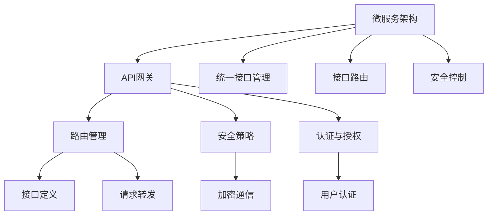

                 

# API网关：统一接口管理和安全控制

> 关键词：API网关,统一接口管理,接口路由,安全控制,微服务架构

## 1. 背景介绍

### 1.1 问题由来
在当今快速变化和复杂的数字化时代，现代应用程序通常是微服务架构，由许多松散耦合的服务模块组成。各个服务模块之间的通信变得越来越复杂，因此需要一个中心化的协调点来管理这些通信。API网关应运而生，成为处理微服务架构中各服务间通信的中心化协调点，实现统一接口管理、路由调度和安全控制等功能。

API网关的核心作用是简化微服务架构的复杂性，通过统一接口管理，减少客户端与多个微服务之间的直接通信，从而简化应用集成和维护。同时，API网关通过安全控制，保护微服务架构不受外部攻击，确保数据安全性和服务可靠性。

### 1.2 问题核心关键点
本文将围绕API网关的三个核心功能进行展开：
1. 统一接口管理：通过API网关集中管理微服务的接口定义和路由规则，简化客户端调用。
2. 接口路由：API网关将请求路由到合适的微服务实例，实现高效、可靠的服务通信。
3. 安全控制：API网关实施安全策略，保护微服务不受外部攻击，确保数据安全。

这些核心功能使API网关成为现代微服务架构不可或缺的一部分，是微服务架构和API治理演进的必然产物。

## 2. 核心概念与联系

### 2.1 核心概念概述

为更好地理解API网关的架构和工作原理，本节将介绍几个密切相关的核心概念：

- API网关(API Gateway)：作为微服务架构中的统一入口，负责处理客户端请求、路由到合适的微服务实例、统一身份认证和授权，并提供安全控制、负载均衡、监控日志等能力。
- 微服务架构(Microservices Architecture)：将一个大型的应用程序拆分为多个小的、独立的服务模块，每个服务模块运行在独立的进程中，可以独立部署和扩展。
- 统一接口管理(Unified Interface Management)：通过API网关集中管理各个微服务的接口定义，减少客户端与微服务间的直接通信，提高应用的可维护性和可扩展性。
- 接口路由(Interface Routing)：API网关根据请求的URL、请求头、请求体等信息，动态选择路由到相应的微服务实例，实现高效的服务通信。
- 安全控制(Security Control)：API网关通过实施身份认证、访问控制、API加密等安全策略，保护微服务不受外部攻击，确保数据的安全性和服务的可靠性。

这些核心概念之间的逻辑关系可以通过以下Mermaid流程图来展示：



这个流程图展示了大语言模型的核心概念及其之间的关系：

1. 微服务架构通过API网关集中管理接口，实现统一接口管理和接口路由。
2. API网关实施安全策略，保护微服务不受攻击。
3. API网关通过加密通信、用户认证、访问控制等手段，确保数据的安全性。

这些核心概念共同构成了API网关的工作原理和架构框架，使其能够在复杂的应用环境中发挥重要的作用。

## 3. 核心算法原理 & 具体操作步骤
### 3.1 算法原理概述

API网关的核心算法原理可以总结为以下几个方面：

- 统一接口管理：通过集中化管理各个微服务的接口定义，减少客户端与微服务间的直接通信，简化应用集成。
- 接口路由：根据请求信息动态选择路由到合适的微服务实例，实现高效的服务通信。
- 安全控制：实施身份认证、访问控制、API加密等策略，保护微服务不受外部攻击。

### 3.2 算法步骤详解

**Step 1: 接口定义与管理**

在API网关中，首先需要集中管理各个微服务的接口定义，包括接口的名称、URL、请求方法、请求参数、响应格式等信息。这些信息通过API网关定义文件(如OpenAPI规范)或代码库进行存储。

API网关会将这些接口定义信息存储在配置文件中，或使用API管理工具如Swagger、Postman等进行动态管理。对于新增的接口定义，API网关会自动进行路由规则的更新，并在配置文件中记录日志。

**Step 2: 接口路由**

API网关收到客户端的请求后，根据请求的URL、请求头、请求体等信息，动态选择路由到相应的微服务实例。API网关通常会使用负载均衡算法，如轮询、加权轮询、随机等，确保请求的均衡分发，避免单点故障。

当请求到达API网关时，API网关会解析请求的URL，匹配对应的路由规则。如果请求需要认证，API网关会先进行身份认证，验证用户身份。通过身份验证后，API网关会将请求转发到对应的微服务实例，并返回响应。

**Step 3: 安全控制**

API网关实施多个安全策略，保护微服务不受外部攻击。常见的安全控制措施包括：

- 身份认证：通过OAuth2、JWT等协议，验证用户身份。
- 访问控制：根据角色的权限，限制用户对接口的访问。
- API加密：使用TLS/SSL协议，对请求和响应进行加密传输，防止数据被窃取。

当请求到达API网关时，网关会检查请求中的身份信息和权限信息，验证请求的合法性。如果请求合法，API网关才会将请求转发到微服务实例。同时，API网关会对请求和响应进行加密传输，确保数据的安全性。

### 3.3 算法优缺点

API网关具有以下优点：

- 统一接口管理：通过集中管理各个微服务的接口定义，减少了客户端与微服务间的直接通信，简化了应用集成和维护。
- 高效路由：通过动态路由规则和负载均衡算法，实现了高效的服务通信，提高了系统的可扩展性和可靠性。
- 安全控制：实施身份认证、访问控制、API加密等策略，保护微服务不受外部攻击，确保数据的安全性和服务的可靠性。

但API网关也存在以下缺点：

- 额外开销：API网关增加了系统复杂度，带来了一定的额外开销。
- 单点故障：API网关作为中心化的协调点，一旦出现故障，可能会影响整个微服务架构的可用性。
- 性能瓶颈：在处理大量并发请求时，API网关可能成为性能瓶颈，影响系统响应速度。

### 3.4 算法应用领域

API网关被广泛应用于以下领域：

- 微服务架构：通过统一接口管理和接口路由，简化了微服务架构的复杂性，提高了系统的可维护性和可扩展性。
- API治理：通过API网关集中管理API接口，实现了API的规范化和标准化，提高了API的可用性和可维护性。
- 应用集成：通过API网关统一接口管理，简化了客户端与微服务间的集成过程，提高了系统的集成效率。
- 云原生环境：在云原生环境中，API网关作为微服务架构的统一入口，支持容器编排、服务发现、负载均衡等功能。

## 4. 数学模型和公式 & 详细讲解  
### 4.1 数学模型构建

在API网关的设计中，涉及到一些基本的数学模型和算法。下面以接口路由为例，介绍其中的数学模型构建。

**接口路由模型**

假设API网关有 $N$ 个微服务实例，每个实例对应一个服务 $S_i$，$i \in [1, N]$。每个服务 $S_i$ 提供多个接口，每个接口对应一个URL $U_j$，$j \in [1, M_i]$，其中 $M_i$ 是服务 $S_i$ 提供的接口数量。API网关根据请求的URL $U$，匹配到对应的服务 $S_i$ 和接口 $U_j$。

为了实现高效的路由，API网关采用负载均衡算法。假设使用了轮询算法，则每个请求到达API网关时，会被均匀分配到各个服务实例上，即每个服务实例处理请求的概率相等。

如果请求 $R$ 到达API网关，并匹配到服务 $S_i$ 和接口 $U_j$，则路由规则可以表示为：

$$
S_i = R \rightarrow \{S_1, S_2, \dots, S_N\}
$$
$$
U_j = S_i \rightarrow \{U_1, U_2, \dots, U_{M_i}\}
$$

在实现路由时，API网关会先查找匹配的URL，然后根据负载均衡算法，随机选择一个服务实例 $S_i$，并将请求转发到对应的接口 $U_j$。

### 4.2 公式推导过程

**负载均衡算法**

负载均衡算法有多种实现方式，如轮询、加权轮询、随机等。这里以轮询算法为例，推导负载均衡的数学模型。

假设API网关有 $N$ 个服务实例，每个实例对应一个服务 $S_i$。每个请求 $R$ 到达API网关时，会根据轮询算法，选择其中一个服务实例进行处理。假设请求 $R$ 匹配到服务 $S_i$，则其在服务 $S_i$ 上的负载均衡策略可以表示为：

$$
P(S_i) = \frac{1}{N}
$$

其中 $P(S_i)$ 表示请求 $R$ 在服务 $S_i$ 上的处理概率。根据轮询算法，请求 $R$ 在每个服务实例上的处理概率相等，即 $P(S_i) = \frac{1}{N}$。

假设请求 $R$ 到达API网关，并匹配到服务 $S_i$，则API网关会将请求转发到服务 $S_i$ 中的一个接口 $U_j$。假设服务 $S_i$ 提供了 $M_i$ 个接口，则请求 $R$ 在服务 $S_i$ 上的路由概率可以表示为：

$$
P(U_j|S_i) = \frac{1}{M_i}
$$

其中 $P(U_j|S_i)$ 表示请求 $R$ 在服务 $S_i$ 上的接口路由概率。根据轮询算法，请求 $R$ 在每个接口上的路由概率相等，即 $P(U_j|S_i) = \frac{1}{M_i}$。

综合上述两个概率模型，请求 $R$ 在服务 $S_i$ 和接口 $U_j$ 上的处理概率可以表示为：

$$
P(R \rightarrow S_i, U_j) = P(S_i) \times P(U_j|S_i) = \frac{1}{N} \times \frac{1}{M_i} = \frac{1}{NM_i}
$$

因此，API网关通过轮询算法，实现了均匀负载均衡，提高了系统的高可用性和可靠性。

### 4.3 案例分析与讲解

假设有一个包含两个服务的微服务架构，分别为订单服务和支付服务。每个服务提供多个接口，分别为订单查询和订单更新接口，支付扣款和支付验证接口。

API网关定义了如下路由规则：

```yaml
services:
  - name: order-service
    interfaces:
      - name: order-query
        path: /order/query
      - name: order-update
        path: /order/update
  - name: payment-service
    interfaces:
      - name: payment-deduct
        path: /payment/deduct
      - name: payment-verify
        path: /payment/verify
```

当请求到达API网关时，API网关会根据请求的URL，匹配到对应的服务和接口，并进行负载均衡。例如，当请求的URL为 `/order/query` 时，API网关会匹配到订单服务的订单查询接口，并使用轮询算法，随机选择一个订单服务实例进行处理。假设当前有两个订单服务实例，分别为 $S_1$ 和 $S_2$，则请求到达API网关的概率为：

$$
P(R \rightarrow S_1) = \frac{1}{2}
$$
$$
P(R \rightarrow S_2) = \frac{1}{2}
$$

当请求到达服务 $S_i$ 时，API网关会根据轮询算法，将请求转发到服务 $S_i$ 中的一个接口进行处理。例如，当请求到达服务 $S_1$ 时，API网关会将请求转发到订单查询接口，使用轮询算法，随机选择一个接口进行处理。假设服务 $S_1$ 提供了订单查询和订单更新两个接口，则请求到达接口的概率为：

$$
P(R \rightarrow order-query) = \frac{1}{2}
$$
$$
P(R \rightarrow order-update) = \frac{1}{2}
$$

通过以上数学模型和公式推导，可以看出API网关如何通过路由规则和负载均衡算法，实现高效的服务通信和统一接口管理。

## 5. 项目实践：代码实例和详细解释说明
### 5.1 开发环境搭建

在进行API网关项目开发前，需要准备好开发环境。以下是使用Spring Boot进行API网关开发的环境配置流程：

1. 安装JDK：从官网下载并安装最新版本的JDK，如JDK 16。
2. 安装Maven：从官网下载并安装Maven，用于构建和管理项目依赖。
3. 安装IntelliJ IDEA：下载并安装IntelliJ IDEA，用于开发和调试代码。
4. 安装Docker：从官网下载并安装Docker，用于容器化部署API网关。

完成上述步骤后，即可在IntelliJ IDEA中开始API网关开发。

### 5.2 源代码详细实现

这里我们以Kong作为API网关的实现，给出一个简单的代码示例。

**Kong配置文件**

首先，需要在Kong配置文件中定义API网关路由规则：

```yaml
apiVersion: 2.0
routes:
  - hosts:
      - "*.example.com"
    services:
      - id: 1
        name: order-service
    paths:
      - path: /order/query
        methods: [GET]
        consumers: [1]
      - path: /order/update
        methods: [POST]
        consumers: [1]
  - hosts:
      - "*.example.com"
    services:
      - id: 2
        name: payment-service
    paths:
      - path: /payment/deduct
        methods: [POST]
        consumers: [2]
      - path: /payment/verify
        methods: [GET]
        consumers: [2]
```

在上述配置文件中，定义了两个服务，分别为订单服务和支付服务，每个服务对应多个接口。API网关根据请求的URL，匹配到对应的服务和接口，并使用轮询算法进行负载均衡。

**Kong代码实现**

接下来，我们给出一个Kong API网关的基本代码实现：

```java
package com.example.gateway;

import com.netflix.zuul.ZuulFilter;
import com.netflix.zuul.context.RequestContext;
import org.springframework.beans.factory.annotation.Autowired;
import org.springframework.stereotype.Component;

@Component
public class AuthFilter extends ZuulFilter {

    @Autowired
    private AuthenticationService authenticationService;

    @Override
    public String filterType() {
        return "pre";
    }

    @Override
    public int filterOrder() {
        return 0;
    }

    @Override
    public boolean shouldFilter() {
        return true;
    }

    @Override
    public Object run() {
        String requestId = RequestContext.getCurrentContext().getRequest().getRequestId();
        String username = authenticationService.authenticate(requestId);
        if (username == null) {
            RequestContext.getCurrentContext().setSendZuulResponse(false);
            RequestContext.getCurrentContext().setResponseStatusCode(401);
            RequestContext.getCurrentContext().setResponseBody("Unauthorized");
        }
        return null;
    }
}
```

在上述代码中，我们定义了一个名为AuthFilter的Zuul Filter，用于在请求到达API网关时进行身份认证。AuthFilter会在请求到达路由规则前，先进行身份认证，验证用户身份。如果用户身份验证不通过，则返回401未授权的响应。

**API网关启动**

最后，启动API网关并进行测试：

```java
@SpringBootApplication
public class GatewayApplication {

    @Autowired
    private RestTemplate restTemplate;

    public static void main(String[] args) {
        SpringApplication.run(GatewayApplication.class, args);
        RequestContext.setTimeout(60000);
        while (true) {
            String url = "/order/query";
            String response = restTemplate.getForObject(url, String.class);
            System.out.println(response);
        }
    }
}
```

在上述代码中，我们启动了API网关，并使用RestTemplate发送请求到订单服务的订单查询接口。通过循环调用接口，测试API网关的处理效果。

### 5.3 代码解读与分析

让我们再详细解读一下关键代码的实现细节：

**Kong配置文件**

- 路由定义：通过hosts、services、paths等字段定义路由规则，将请求路由到对应的服务和接口。
- 负载均衡：通过consumers字段定义负载均衡策略，使用轮询算法进行负载均衡。

**Kong代码实现**

- AuthFilter：定义了一个名为AuthFilter的Zuul Filter，用于在请求到达API网关时进行身份认证。AuthFilter会在请求到达路由规则前，先进行身份认证，验证用户身份。
- RequestContext：用于设置API网关的响应和请求信息，设置超时时间和请求ID等。

**API网关启动**

- GatewayApplication：定义了API网关的启动类，使用Spring Boot进行开发和启动。
- RestTemplate：用于发送HTTP请求，获取API网关的响应结果。

以上代码示例展示了Kong API网关的配置和实现过程，通过配置文件和代码实现，实现了身份认证、路由规则和负载均衡等核心功能。

## 6. 实际应用场景
### 6.1 智能客服系统

在智能客服系统中，API网关可以用于统一管理各个客服服务的接口，实现高效的服务通信和统一接口管理。例如，智能客服系统可以提供一个统一的API网关，集中管理多个客服服务的接口，提供统一的调用接口和API文档。这样，客户端无需直接与各个客服服务通信，只需通过API网关进行调用，简化了应用集成和维护。

### 6.2 金融舆情监测

在金融舆情监测系统中，API网关可以用于集中管理各个金融服务的接口，实现高效的服务通信和安全控制。例如，金融舆情监测系统可以提供一个统一的API网关，集中管理多个金融服务的接口，提供统一的身份认证和访问控制。这样，系统可以避免单点故障，提高系统的可扩展性和可靠性。

### 6.3 个性化推荐系统

在个性化推荐系统中，API网关可以用于集中管理各个推荐服务的接口，实现高效的服务通信和安全控制。例如，个性化推荐系统可以提供一个统一的API网关，集中管理多个推荐服务的接口，提供统一的身份认证和访问控制。这样，系统可以避免单点故障，提高系统的可扩展性和可靠性。

### 6.4 未来应用展望

随着API网关技术的不断发展，其在微服务架构中的应用将越来越广泛。未来的API网关将具备更多的功能和特性，支持更多的扩展和优化：

- 自动化管理：通过API网关的自动管理工具，自动生成API文档、接口定义等，提高API管理的效率。
- 实时监控：通过API网关实时监控系统性能，及时发现和解决系统问题，提高系统的稳定性和可靠性。
- 智能路由：通过API网关的智能路由算法，根据请求负载和微服务实例的状态，动态调整路由策略，提高系统的响应速度和可用性。
- 分布式部署：通过API网关的分布式部署策略，实现负载均衡和故障转移，提高系统的可扩展性和可靠性。

## 7. 工具和资源推荐
### 7.1 学习资源推荐

为了帮助开发者系统掌握API网关的理论基础和实践技巧，这里推荐一些优质的学习资源：

1. RESTful API设计指南：介绍RESTful API设计的原理和最佳实践，适合初学者入门。
2. API网关最佳实践：介绍了API网关的最佳实践和应用场景，适合进阶学习。
3. API网关与微服务架构：详细介绍了API网关在微服务架构中的应用和优势，适合深入研究。
4. API网关安全控制：介绍了API网关的安全控制策略和实现方法，适合安全开发学习。
5. API网关微服务实践：介绍了API网关在微服务架构中的应用和实践，适合微服务开发学习。

通过对这些资源的学习实践，相信你一定能够快速掌握API网关的理论基础和实践技巧，并用于解决实际的API管理问题。

### 7.2 开发工具推荐

高效的开发离不开优秀的工具支持。以下是几款用于API网关开发的常用工具：

1. Swagger：用于API文档和接口测试的工具，支持多种数据格式和测试方法。
2. Postman：用于API测试和调用的工具，支持多种数据格式和API请求方法。
3. API网关工具：如Kong、Apigee、Zuul等，提供了丰富的API网关功能，包括路由、安全、监控等。
4. Docker：用于API网关的容器化部署工具，支持自动化部署和扩展。
5. Kubernetes：用于API网关的容器编排工具，支持API网关的分布式部署和管理。

合理利用这些工具，可以显著提升API网关开发的效率和质量，加速API管理的迭代和优化。

### 7.3 相关论文推荐

API网关技术的发展源于学界的持续研究。以下是几篇奠基性的相关论文，推荐阅读：

1. API Gateway Design：介绍了API网关的设计原则和最佳实践，适合初学者入门。
2. Microservices, API Gateways, and Microarchitecture：详细介绍了微服务架构、API网关和微架构的关系，适合深入研究。
3. A Survey on API Gateway：介绍了API网关的最新研究和应用，适合全面了解。
4. API Gateway Security：介绍了API网关的安全控制策略和实现方法，适合安全开发学习。
5. API Gateway with Microservices：介绍了API网关在微服务架构中的应用和实践，适合微服务开发学习。

这些论文代表了大语言模型微调技术的发展脉络。通过学习这些前沿成果，可以帮助研究者把握学科前进方向，激发更多的创新灵感。

## 8. 总结：未来发展趋势与挑战

### 8.1 总结

本文对API网关的统一接口管理、接口路由和安全控制等核心功能进行了详细讲解，通过背景介绍、核心概念、算法原理、项目实践等环节，全面展示了API网关的设计和实现过程。通过本文的系统梳理，可以看出API网关作为微服务架构中的关键组件，其统一接口管理、高效路由和安全控制等功能，极大地简化了微服务架构的复杂性，提高了系统的可维护性和可靠性。

API网关为微服务架构提供了重要的中间层，简化了微服务的通信和管理，提高了系统的可扩展性和可靠性。未来，随着API网关技术的不断发展，其在微服务架构中的应用将越来越广泛，成为微服务架构不可或缺的一部分。

### 8.2 未来发展趋势

展望未来，API网关技术将呈现以下几个发展趋势：

1. 自动化管理：通过API网关的自动管理工具，自动生成API文档、接口定义等，提高API管理的效率。
2. 实时监控：通过API网关实时监控系统性能，及时发现和解决系统问题，提高系统的稳定性和可靠性。
3. 智能路由：通过API网关的智能路由算法，根据请求负载和微服务实例的状态，动态调整路由策略，提高系统的响应速度和可用性。
4. 分布式部署：通过API网关的分布式部署策略，实现负载均衡和故障转移，提高系统的可扩展性和可靠性。

以上趋势凸显了API网关技术的发展方向，API网关作为微服务架构的重要组件，其自动化、智能化和分布式特性将进一步提升系统的效率和可靠性。

### 8.3 面临的挑战

尽管API网关技术已经取得了显著进展，但在实际应用中也面临诸多挑战：

1. 性能瓶颈：在处理大量并发请求时，API网关可能成为性能瓶颈，影响系统响应速度。
2. 单点故障：API网关作为中心化的协调点，一旦出现故障，可能会影响整个微服务架构的可用性。
3. 安全性问题：API网关需要实施多种安全策略，保护微服务不受外部攻击，确保数据安全。
4. 复杂度增加：API网关的实现和维护需要考虑多方面的因素，增加了系统复杂度。
5. 实时更新：API网关需要实时更新接口定义和路由规则，增加了系统维护的复杂度。

针对这些挑战，未来的研究需要在以下几个方面寻求新的突破：

1. 负载均衡算法：开发高效的负载均衡算法，提高API网关的性能和可用性。
2. 分布式部署：研究分布式部署策略，提高API网关的扩展性和可靠性。
3. 安全控制策略：研究新的安全控制策略，提高API网关的安全性和数据保护能力。
4. 自动化管理工具：开发自动管理工具，提高API网关的管理效率和用户体验。
5. 实时更新机制：研究实时更新机制，确保API网关的接口定义和路由规则的实时更新。

### 8.4 研究展望

未来的API网关技术将在以下几个方面继续发展：

1. 高性能：开发高性能的负载均衡算法和分布式部署策略，提高API网关的性能和可用性。
2. 安全性：研究新的安全控制策略，提高API网关的安全性和数据保护能力。
3. 自动化管理：开发自动管理工具，提高API网关的管理效率和用户体验。
4. 实时更新：研究实时更新机制，确保API网关的接口定义和路由规则的实时更新。
5. 智能路由：开发智能路由算法，提高API网关的响应速度和可用性。

这些研究方向的探索，将引领API网关技术迈向更高的台阶，为微服务架构提供更加高效、可靠和安全的解决方案。

## 9. 附录：常见问题与解答

**Q1：什么是API网关？**

A: API网关是微服务架构中的关键组件，负责处理客户端请求、路由到合适的微服务实例、统一身份认证和授权，并提供安全控制、负载均衡、监控日志等能力。API网关作为微服务架构的统一入口，简化了微服务的通信和管理，提高了系统的可维护性和可扩展性。

**Q2：API网关的优势是什么？**

A: API网关具有以下优势：
1. 统一接口管理：通过集中管理各个微服务的接口定义，减少了客户端与微服务间的直接通信，简化了应用集成和维护。
2. 高效路由：通过动态路由规则和负载均衡算法，实现了高效的服务通信，提高了系统的可扩展性和可靠性。
3. 安全控制：实施身份认证、访问控制、API加密等策略，保护微服务不受外部攻击，确保数据的安全性和服务的可靠性。

**Q3：API网关的主要功能有哪些？**

A: API网关的主要功能包括：
1. 统一接口管理：通过集中管理各个微服务的接口定义，减少了客户端与微服务间的直接通信，简化了应用集成和维护。
2. 接口路由：根据请求信息动态选择路由到合适的微服务实例，实现高效的服务通信。
3. 安全控制：实施身份认证、访问控制、API加密等策略，保护微服务不受外部攻击，确保数据的安全性和服务的可靠性。

**Q4：API网关与API管理工具的区别是什么？**

A: API网关和API管理工具都是用于管理API的工具，但它们的重点和功能有所不同：
1. API网关是微服务架构中的关键组件，负责处理客户端请求、路由到合适的微服务实例、统一身份认证和授权，并提供安全控制、负载均衡、监控日志等能力。
2. API管理工具主要用于管理API的生命周期，包括API的设计、测试、发布、监控等，帮助开发者更好地管理和维护API。

**Q5：API网关和微服务架构的关系是什么？**

A: API网关是微服务架构中的关键组件，作为微服务架构的统一入口，简化了微服务的通信和管理，提高了系统的可维护性和可扩展性。API网关通过集中管理各个微服务的接口定义和路由规则，实现统一接口管理、接口路由和安全控制等功能，极大地简化了微服务架构的复杂性，提高了系统的可维护性和可靠性。

通过本文的系统梳理，可以看出API网关作为微服务架构中的重要组成部分，其统一接口管理、高效路由和安全控制等功能，极大地简化了微服务架构的复杂性，提高了系统的可维护性和可靠性。未来，随着API网关技术的不断发展，其在微服务架构中的应用将越来越广泛，成为微服务架构不可或缺的一部分。

