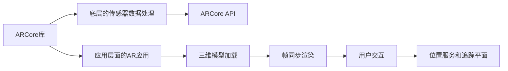

                 

# ARCore 开发：在 Android 上构建 AR 应用

## 1. 背景介绍

随着AR技术的不断成熟，越来越多的应用场景开始利用AR技术为用户提供沉浸式体验。Google ARCore作为目前最流行的AR开发平台之一，提供了丰富的API和工具，极大降低了AR应用的开发门槛，让开发者能快速上手并创造出令人惊叹的AR体验。

本篇文章将从零开始介绍如何在Android设备上使用ARCore构建AR应用。通过详细讲解ARCore的核心概念、API和开发技巧，帮助读者全面掌握ARCore的使用方法和最佳实践。

## 2. 核心概念与联系

### 2.1 核心概念概述

为了更好地理解ARCore开发，首先需要了解以下几个核心概念：

- **ARCore**：Google提供的AR开发平台，包含了用于检测和跟踪平面、增强图像、追踪手势和基于位置的服务等功能。
- **帧同步**：AR应用的核心组成部分之一，涉及对帧的渲染、跟踪、融合等过程。
- **三维模型**：AR应用中的关键资产，用于虚拟物体在真实场景中的放置和交互。
- **追踪平面**：AR应用中最重要的组成部分之一，通过将虚拟物体固定在现实世界的平面上，提供稳定的渲染效果。
- **光照和材质**：影响AR应用视觉效果的重要因素，需要根据现实世界的光照和材质进行适当的调整。
- **手势识别**：AR应用中用户交互的核心手段，通过手势识别实现虚拟对象的操控。
- **位置服务**：AR应用中定位虚拟对象的基础，用于将虚拟对象放置在正确的位置上。

这些概念之间的联系如下图所示：


### 2.2 核心概念原理和架构的 Mermaid 流程图

ARCore的架构主要分为两个部分：底层的ARCore库和应用层面的AR应用。



ARCore库主要负责处理底层的传感器数据（如陀螺仪、加速度计、磁力计等），并将这些数据与ARCore API结合，帮助应用实现跟踪、渲染等核心功能。应用层面的AR应用则负责加载三维模型，进行帧同步渲染，以及处理用户交互、位置服务等业务逻辑。

## 3. 核心算法原理 & 具体操作步骤

### 3.1 算法原理概述

ARCore的核心算法包括：

- **传感器数据融合**：通过融合来自陀螺仪、加速度计、磁力计等传感器的数据，实现设备的姿态估计。
- **环境理解**：通过摄像头捕捉的图像数据，以及GPS和Wi-Fi等信息，构建设备的真实环境模型。
- **跟踪与渲染**：将虚拟物体放置在正确的平面上，并进行渲染。
- **手势识别**：通过深度图像和手势模型，实现手势识别和交互。

这些算法共同构成了ARCore的开发框架，使得开发者能够快速构建出稳定、高效的AR应用。

### 3.2 算法步骤详解

#### 3.2.1 环境初始化

首先需要初始化ARCore环境，获取设备的传感器和相机信息，进行环境扫描和分析。

```java
ARCoreApiManager.getInstance().createSession(this);
ARCoreApiManager.getInstance().registerUpdateListener(this);
ARCoreApiManager.getInstance().getCamera(ARCoreApiManager.getInstance().getCameraType());
ARCoreApiManager.getInstance().getCameraTexture();
ARCoreApiManager.getInstance().getCameraInfo();
ARCoreApiManager.getInstance().getCameraPosition();
ARCoreApiManager.getInstance().getCameraLocation();
ARCoreApiManager.getInstance().getCameraOrientation();
```

#### 3.2.2 平面检测与跟踪

获取设备的摄像头信息后，需要通过平面检测算法识别环境中的平面，并对其进行跟踪。

```java
PlaneFinder planeFinder = new PlaneFinder();
planeFinder.setDetectable(new PlaneDetector.Detectable() {
    @Override
    public boolean isDetectable(Plane plane) {
        return plane.getArea() >= minArea && plane.getZ() >= minZ;
    }
});
planeFinder.setTimeout(Detectable.DETECTABLE_TIMEOUT);
planeFinder.setTrackable(new PlaneDetector.Trackable() {
    @Override
    public void onTrackingUpdated(Plane plane) {
        if (plane.getArea() >= minArea && plane.getZ() >= minZ) {
            // 平面检测到
        }
    }
});
ARCoreApiManager.getInstance().setPlaneFinder(planeFinder);
```

#### 3.2.3 物体渲染与交互

在平面检测和跟踪的基础上，加载三维模型，进行渲染和交互。

```java
Scene scene = new Scene();
SceneView sceneView = new SceneView(this);
CameraImage cameraImage = new CameraImage();

// 创建场景
scene.setSceneView(sceneView);
scene.setCameraImage(cameraImage);

// 加载三维模型
Model model = new Model();
model.setScene(scene);
model.setTrackable(new Model.Trackable() {
    @Override
    public void onTrackingUpdated(Model model) {
        if (model.getArea() >= minArea && model.getZ() >= minZ) {
            // 物体渲染到
        }
    }
});
model.setScene(scene);
model.setCameraImage(cameraImage);
```

#### 3.2.4 手势识别与交互

通过手势识别算法，获取用户的手势信息，实现虚拟对象的交互。

```java
GestureDetector gestureDetector = new GestureDetector();
gestureDetector.setDetectable(new GestureDetector.Detectable() {
    @Override
    public boolean isDetectable(int gesture) {
        return gesture >= minGesture && gesture <= maxGesture;
    }
});
gestureDetector.setTrackable(new GestureDetector.Trackable() {
    @Override
    public void onTrackingUpdated(int gesture) {
        if (gesture >= minGesture && gesture <= maxGesture) {
            // 手势识别到
        }
    }
});
ARCoreApiManager.getInstance().setGestureDetector(gestureDetector);
```

### 3.3 算法优缺点

ARCore的优点在于：

- 易于使用：提供了丰富的API和工具，使得开发者可以快速上手并创建出稳定的AR应用。
- 高性能：通过硬件加速和优化算法，实现了高效的渲染和跟踪。
- 跨平台支持：支持Android、iOS等多个平台，提供了广泛的兼容性。

ARCore的缺点在于：

- 硬件要求高：需要设备支持摄像头和传感器，且性能要求较高。
- 依赖环境：对环境光照、平面角度等要求较高，不适合复杂环境下的应用。
- 生态系统尚不完善：虽然Google提供了丰富的API，但生态系统相对较为分散，缺乏统一的规范和标准。

### 3.4 算法应用领域

ARCore可以应用于以下领域：

- **游戏与娱乐**：创建交互式的游戏和娱乐应用，如虚拟现实游戏、增强现实游戏等。
- **教育与培训**：在教育培训领域，可以通过AR技术实现虚拟课堂、虚拟实验室等。
- **医疗与健康**：在医疗领域，可以用于虚拟手术、虚拟示教等。
- **工业与制造**：在工业领域，可以用于产品设计、设备维护等。
- **零售与营销**：在零售和营销领域，可以用于虚拟试衣、虚拟展示等。

## 4. 数学模型和公式 & 详细讲解 & 举例说明

### 4.1 数学模型构建

ARCore的数学模型主要基于以下算法：

- **传感器数据融合**：利用陀螺仪、加速度计、磁力计等传感器的数据，进行姿态估计。
- **环境理解**：通过摄像头捕捉的图像数据，进行环境分析。
- **跟踪与渲染**：将虚拟物体放置在正确的平面上，并进行渲染。
- **手势识别**：通过深度图像和手势模型，实现手势识别和交互。

### 4.2 公式推导过程

#### 4.2.1 传感器数据融合

传感器数据融合的公式如下：

$$
\text{Angular Velocity} = \text{Gyroscope Reading} - \text{Calibration} - \text{Gravitational Compensation}
$$

其中，Gyroscope Reading为陀螺仪的读数，Calibration为陀螺仪的校准值，Gravitational Compensation为重力补偿值。

#### 4.2.2 环境理解

环境理解的公式如下：

$$
\text{Image Coordinate} = \text{Camera Reading} - \text{Calibration} - \text{Distortion Correction}
$$

其中，Camera Reading为摄像头的读数，Calibration为摄像头的校准值，Distortion Correction为畸变校正值。

#### 4.2.3 跟踪与渲染

跟踪与渲染的公式如下：

$$
\text{Position} = \text{Plane Position} + \text{Offset} + \text{Rotation}
$$

其中，Plane Position为平面的位置，Offset为虚拟物体的偏移量，Rotation为虚拟物体的旋转角度。

#### 4.2.4 手势识别

手势识别的公式如下：

$$
\text{Gesture Recognition} = \text{Depth Image} - \text{Calibration} - \text{Filtering}
$$

其中，Depth Image为深度图像，Calibration为深度图像的校准值，Filtering为滤波值。

### 4.3 案例分析与讲解

以一个简单的AR游戏为例，讲解ARCore的核心算法应用：

1. **环境初始化**：获取设备的摄像头和传感器信息，进行环境扫描和分析。
2. **平面检测与跟踪**：通过摄像头捕捉到的图像数据，检测并跟踪平面。
3. **物体渲染与交互**：加载三维模型，将其放置在正确的平面上，并实现交互。
4. **手势识别与交互**：通过深度图像和手势模型，实现手势识别和交互。

## 5. 项目实践：代码实例和详细解释说明

### 5.1 开发环境搭建

开发环境搭建需要以下几个步骤：

1. 安装Android Studio：从官网下载并安装Android Studio。
2. 配置Android SDK和模拟器：在Android Studio中配置Android SDK和模拟器。
3. 创建新项目：选择Android Empty Activity模板，创建新的Android项目。
4. 引入ARCore库：在项目的build.gradle文件中引入ARCore库。

```groovy
dependencies {
    implementation 'com.google.ar.core:arcore:1.4.0'
}
```

### 5.2 源代码详细实现

以下是一个简单的AR应用代码示例，用于检测平面并显示一个简单的3D模型。

```java
public class ARApplication extends Activity {
    private CameraView cameraView;
    private PlaneFinder planeFinder;
    private Model model;

    @Override
    protected void onCreate(Bundle savedInstanceState) {
        super.onCreate(savedInstanceState);
        setContentView(R.layout.activity_main);

        cameraView = findViewById(R.id.camera_view);
        planeFinder = new PlaneFinder();
        model = new Model();
    }

    @Override
    protected void onResume() {
        super.onResume();
        ARCoreApiManager.getInstance().getCamera(ARCoreApiManager.getInstance().getCameraType());
        ARCoreApiManager.getInstance().getCameraTexture();
        ARCoreApiManager.getInstance().getCameraInfo();
        ARCoreApiManager.getInstance().getCameraPosition();
        ARCoreApiManager.getInstance().getCameraLocation();
        ARCoreApiManager.getInstance().getCameraOrientation();
        ARCoreApiManager.getInstance().setPlaneFinder(planeFinder);
        ARCoreApiManager.getInstance().setScene(model);
    }

    @Override
    protected void onPause() {
        super.onPause();
        ARCoreApiManager.getInstance().getCamera(ARCoreApiManager.getInstance().getCameraType());
        ARCoreApiManager.getInstance().getCameraTexture();
        ARCoreApiManager.getInstance().getCameraInfo();
        ARCoreApiManager.getInstance().getCameraPosition();
        ARCoreApiManager.getInstance().getCameraLocation();
        ARCoreApiManager.getInstance().getCameraOrientation();
        ARCoreApiManager.getInstance().setPlaneFinder(planeFinder);
        ARCoreApiManager.getInstance().setScene(model);
    }
}
```

### 5.3 代码解读与分析

在上述代码中，我们首先初始化了CameraView、PlaneFinder和Model等对象。然后在onResume方法中，获取设备的摄像头信息，并设置了平面的检测器和场景。

在onPause方法中，我们需要暂停ARCore的运行，避免耗电和性能问题。

### 5.4 运行结果展示

运行上述代码，即可看到设备上检测到的平面，以及放置在平面上的3D模型。用户可以通过手势控制模型的移动，实现与虚拟对象的交互。

## 6. 实际应用场景

### 6.1 智能家居

智能家居领域可以通过AR技术实现虚拟物品的控制和交互。例如，用户可以通过手势控制虚拟的灯光、空调等设备，实现智能家居的个性化定制。

### 6.2 虚拟试衣间

ARCore可以应用于虚拟试衣间，用户可以通过AR技术实时查看服装在身上的效果，快速找到适合自己的衣服。

### 6.3 教育培训

在教育培训领域，可以通过AR技术实现虚拟课堂、虚拟实验室等。例如，学生可以通过AR技术观察分子结构，教师可以通过AR技术演示复杂实验过程。

### 6.4 房地产

房地产领域可以通过AR技术展示虚拟房屋，用户可以通过AR技术虚拟走入房屋，查看房屋内部结构。

### 6.5 文化旅游

文化旅游领域可以通过AR技术展示虚拟的博物馆展品，用户可以通过AR技术虚拟参观博物馆，了解展品的背景和历史。

## 7. 工具和资源推荐

### 7.1 学习资源推荐

- **Google ARCore官方文档**：详细介绍了ARCore的API和使用方法。
- **Android ARCore官方文档**：提供了ARCore的详细API文档和使用指南。
- **ARCore实战教程**：提供了ARCore的实战教程和代码示例，适合初学者学习。

### 7.2 开发工具推荐

- **Android Studio**：官方提供的Android开发环境，支持ARCore的开发和调试。
- **Unity**：ARCore支持Unity平台，可以通过Unity进行AR应用开发。
- **Blender**：用于三维模型设计和渲染的工具，适用于ARCore中的三维模型加载和渲染。

### 7.3 相关论文推荐

- **ARCore：Real-time Augmented Reality on Mobile and Desktop Devices**：Google官方论文，详细介绍了ARCore的架构和核心算法。
- **ARCore for Education**：Google官方博客，介绍了ARCore在教育领域的应用。
- **ARCore for Retail**：Google官方博客，介绍了ARCore在零售领域的应用。

## 8. 总结：未来发展趋势与挑战

### 8.1 未来发展趋势

未来ARCore的发展趋势包括：

- **增强现实体验**：ARCore将进一步提升AR应用的体验，通过引入更多的传感器和算法，实现更丰富的增强现实效果。
- **跨平台支持**：ARCore将支持更多的平台和设备，提供更广泛的兼容性。
- **生态系统完善**：Google将进一步完善ARCore的生态系统，提供更多的工具和资源，帮助开发者快速上手。

### 8.2 面临的挑战

ARCore面临的挑战包括：

- **硬件要求高**：需要设备支持摄像头和传感器，且性能要求较高。
- **环境要求高**：对环境光照、平面角度等要求较高，不适合复杂环境下的应用。
- **生态系统分散**：虽然Google提供了丰富的API，但生态系统相对较为分散，缺乏统一的规范和标准。

### 8.3 研究展望

未来的研究可以从以下几个方向进行：

- **硬件优化**：优化ARCore对设备的硬件要求，使得更多的设备能够支持AR应用。
- **算法改进**：改进ARCore的核心算法，提高ARCore的稳定性和鲁棒性。
- **生态系统整合**：整合ARCore的生态系统，提供统一的API和规范，方便开发者使用。

## 9. 附录：常见问题与解答

**Q1：如何在ARCore中实现手势识别？**

A：在ARCore中实现手势识别，需要通过深度图像和手势模型，进行手势识别和交互。具体步骤如下：

1. 获取设备的摄像头信息。
2. 加载手势模型。
3. 在ARCore的帧同步渲染中，进行手势检测和识别。
4. 根据手势信息，控制虚拟对象的动作。

**Q2：ARCore的传感器数据融合算法原理是什么？**

A：ARCore的传感器数据融合算法通过融合来自陀螺仪、加速度计、磁力计等传感器的数据，实现设备的姿态估计。其原理是：

1. 将传感器的数据进行预处理，得到加速度计、陀螺仪、磁力计的数据。
2. 对传感器数据进行时间对齐，得到统一的时间序列。
3. 对传感器数据进行加权融合，得到融合后的姿态估计结果。
4. 对姿态估计结果进行滤波和校正，得到最终的姿态估计结果。

**Q3：ARCore在工业应用中的优势是什么？**

A：ARCore在工业应用中的优势包括：

1. 可以用于产品设计，帮助工程师进行虚拟装配和模拟。
2. 可以用于设备维护，帮助维修人员进行虚拟检修和故障诊断。
3. 可以用于远程控制，帮助操作员进行远程操作和监控。

**Q4：ARCore在教育培训中的应用场景是什么？**

A：ARCore在教育培训中的应用场景包括：

1. 虚拟课堂：学生可以通过AR技术进入虚拟课堂，体验不同的教学环境。
2. 虚拟实验室：教师可以通过AR技术演示复杂实验过程，帮助学生更好地理解实验原理。
3. 虚拟演示：学生可以通过AR技术观看虚拟演示，提高学习效果。

**Q5：ARCore在医疗领域的应用场景是什么？**

A：ARCore在医疗领域的应用场景包括：

1. 虚拟手术：医生可以通过AR技术进行虚拟手术，帮助提高手术精度。
2. 虚拟示教：医生可以通过AR技术进行虚拟示教，帮助培训新医生。
3. 虚拟康复：患者可以通过AR技术进行虚拟康复训练，加速康复进程。

---

作者：禅与计算机程序设计艺术 / Zen and the Art of Computer Programming

