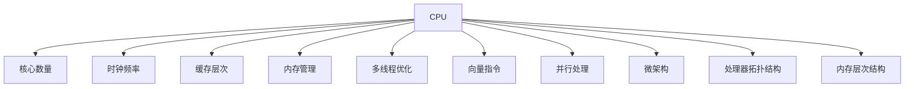
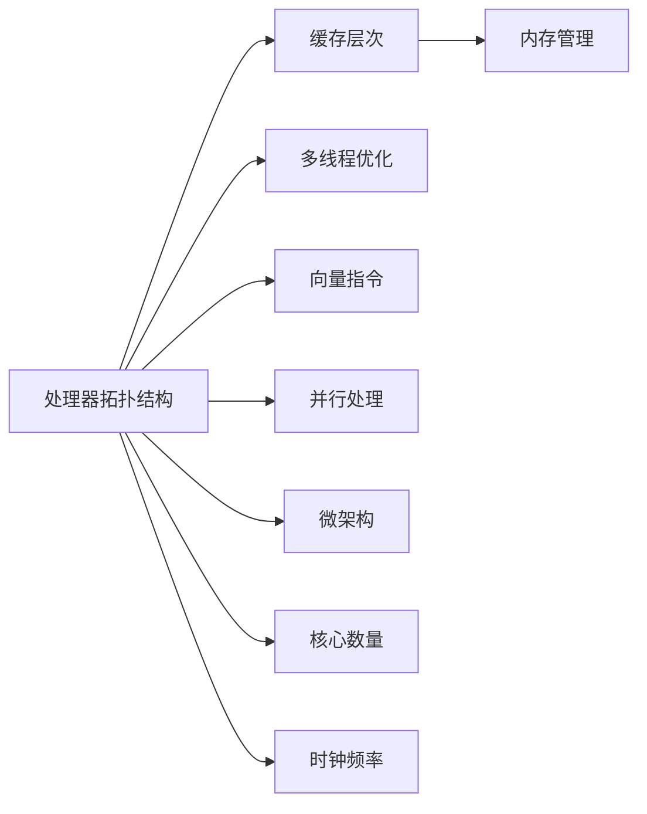

                 

# CPU 优化：充分利用处理器

> 关键词：CPU优化，处理器利用率，性能提升，能效比，缓存管理，内存优化，多线程，向量指令，微架构，处理器拓扑结构，内存层次结构，负载均衡

## 1. 背景介绍

### 1.1 问题由来
随着技术的飞速发展，高性能计算机系统的需求日益增加，然而硬件性能的提升速度远低于软件的需求增长。CPU作为计算机系统的核心部件，其性能直接影响着整体系统的运行效率。CPU优化成为了系统优化的一大难题。

传统CPU设计思路是以时钟频率为驱动，追求单核心的高频率。然而，这种设计思路逐渐达到了瓶颈，功耗和散热问题也愈发严重。随着工艺技术的进步，当前CPU设计趋向于多核并行、低功耗、高效能的策略，并行处理能力和多线程优化成为提升性能的重要手段。

## 2. 核心概念与联系

### 2.1 核心概念概述

- **CPU（中央处理器）**：是计算机中负责执行指令和进行运算的核心组件，包括算术逻辑单元（ALU）、控制单元（CU）、寄存器、缓存等组件。
- **时钟频率（GHz）**：表示CPU每秒执行的指令数，直接影响处理速度。
- **核心数量**：现代CPU多为多核设计，核心数量决定了并行处理能力。
- **线程（Thread）**：程序执行的最小单元，一个线程可以独立运行，包含执行上下文和当前指令。
- **上下文切换（Context Switching）**：多线程环境下，CPU需要切换不同的线程执行，消耗一定资源。
- **缓存层次（Cache Hierarchy）**：CPU内部缓存包括L1、L2、L3缓存，以及外部的主存（Memory）和硬盘（Disk），不同层次的缓存具有不同大小和访问速度。
- **内存管理（Memory Management）**：包括虚拟内存、分页和分段等，用于优化内存使用和性能。
- **多线程优化（Multithreading Optimization）**：通过同时执行多个线程来提升CPU效率。
- **向量指令（Vector Instructions）**：能够同时处理多个数据元素，提高运算效率。
- **并行处理（Parallel Processing）**：利用多核处理器进行多线程并发执行，提升整体性能。
- **微架构（Microarchitecture）**：CPU内部硬件设计的细节，如指令流水线、分支预测器等。
- **处理器拓扑结构（Topology）**：多核CPU内部的物理布局，如超标量、非对称多处理结构（AMP）等。
- **内存层次结构（Memory Hierarchy）**：CPU缓存和主存之间的层次关系，影响访问速度和能耗。

这些核心概念之间的联系如图1所示：



图1. CPU优化核心概念与联系图

### 2.2 核心概念原理和架构的 Mermaid 流程图

由于篇幅限制，这里只展示核心概念的简要流程图。具体原理和架构如图2所示：



图2. CPU优化核心概念架构图

## 3. 核心算法原理 & 具体操作步骤

### 3.1 算法原理概述

CPU优化涉及硬件和软件两个方面，包括缓存管理、内存优化、多线程调度、向量指令使用等。优化原理如下：

1. **缓存管理**：合理利用各级缓存，避免频繁访问主存，提高访问速度。
2. **内存优化**：减少内存分配和释放，使用堆内存池、对象池等技术，降低内存碎片化。
3. **多线程优化**：通过多线程并发执行，合理调度线程，减少上下文切换，提升性能。
4. **向量指令优化**：使用SIMD指令，并行处理多个数据元素，提升运算效率。
5. **并行处理优化**：利用多核并行处理，分配任务到不同核心，提升整体性能。
6. **微架构优化**：优化指令流水线、分支预测器等，提升指令执行效率。

### 3.2 算法步骤详解

**Step 1: 性能分析**
- 使用性能分析工具（如Perf、Intel VTune、gprof等），识别CPU瓶颈。
- 分析CPU的使用情况，包括缓存命中率、内存访问模式、线程调度情况等。

**Step 2: 数据与程序优化**
- 使用数据结构优化内存访问模式，减少缓存未命中。
- 使用多线程并发执行，减少线程切换和上下文切换。
- 优化代码结构，使用向量指令提升运算效率。
- 优化程序并行化，合理分配任务到多核。

**Step 3: 硬件优化**
- 调整缓存大小和预取策略，提升缓存命中率。
- 使用高速缓存、RAM、SSD等存储介质，优化内存访问速度。
- 使用异步处理和预取指令等技术，提升并行处理能力。

**Step 4: 优化验证**
- 在优化后重新进行性能测试，验证优化效果。
- 使用性能监控工具跟踪系统性能，确保优化效果稳定。

### 3.3 算法优缺点

**优点**：
- 通过合理优化，可以显著提升CPU性能，改善应用响应速度。
- 缓存管理和内存优化可有效减少内存访问次数，提高效率。
- 多线程优化可以充分利用CPU资源，提升并发能力。
- 向量指令和并行处理能大幅提升运算效率，适用于大规模计算。
- 微架构优化提升指令执行效率，优化指令流水线等硬件设计。

**缺点**：
- 优化过程复杂，需要深入了解硬件和软件交互细节。
- 不同硬件平台和操作系统有不同的优化策略。
- 优化效果受程序结构、算法设计等因素影响。
- 优化过程中可能引入新的问题，需要进行反复调整和测试。

### 3.4 算法应用领域

CPU优化技术广泛应用于高性能计算、大数据处理、人工智能、图形渲染、操作系统、嵌入式系统等多个领域。以下列举几个典型应用场景：

1. **高性能计算**：大数据处理、科学计算、气象模拟等需要大规模计算的任务。
2. **图形渲染**：3D图形渲染、游戏引擎等需要高帧率和高分辨率的场景。
3. **嵌入式系统**：移动设备、物联网、实时控制系统等需要高效能和低功耗的应用。
4. **人工智能**：深度学习模型训练、图像识别、语音识别等需要高并发和低延迟的算法。
5. **操作系统**：多用户、多任务的系统调度，需要优化线程和进程的管理。

## 4. 数学模型和公式 & 详细讲解 & 举例说明

### 4.1 数学模型构建

CPU优化主要涉及硬件性能和软件调度两个方面的数学模型构建。

**硬件性能模型**：
- 计算性能（MIPS、MFLOPS、GFLOPS等）
- 时钟周期（Cycles）
- 缓存访问延迟（Cache Access Latency）

**软件调度模型**：
- 线程调度（Scheduling）
- 任务分配（Task Assignment）
- 上下文切换（Context Switching）

### 4.2 公式推导过程

以缓存层次为例，假设缓存大小为C，主存大小为M，缓存未命中概率为P。缓存命中率计算公式如下：

$$
H = 1 - P = \frac{C}{C + k \cdot M}
$$

其中，$k$为缓存未命中的惩罚系数。

**线程调度**：
- 使用Gantt图表示线程执行时间线，优化线程并发度，减少上下文切换时间。

**任务分配**：
- 使用贪心算法或动态规划等方法，优化任务分配策略，提升多核并行效率。

**上下文切换**：
- 减少上下文切换频率，优化线程和任务管理，提升系统效率。

### 4.3 案例分析与讲解

**案例一：数据结构优化**
- 使用哈希表、红黑树等高效数据结构，减少内存访问次数，提高缓存命中率。

**案例二：多线程优化**
- 使用线程池和任务队列，合理分配任务到多个线程，减少上下文切换。

**案例三：向量指令优化**
- 使用SIMD指令（如AVX、AVX-512），并行处理多个数据元素，提升运算效率。

**案例四：并行处理优化**
- 使用OpenMP、MPI等并行编程框架，分配任务到多核，提升并行处理能力。

**案例五：微架构优化**
- 优化指令流水线，减少分支预测错误，提升指令执行效率。

## 5. 项目实践：代码实例和详细解释说明

### 5.1 开发环境搭建

**Step 1: 安装编译工具**
- 安装GCC编译器，支持CPU优化代码的编写和编译。

**Step 2: 配置性能分析工具**
- 安装Perf、Intel VTune等工具，进行性能分析和监控。

**Step 3: 搭建实验环境**
- 使用虚拟机或物理机搭建实验环境，包含高性能CPU和内存。

### 5.2 源代码详细实现

以下是一个简单的C++程序示例，展示了如何利用多线程优化提升CPU性能：

```cpp
#include <iostream>
#include <thread>
#include <vector>
#include <atomic>

std::atomic<int> sum(0);
std::vector<std::thread> threads;

void add(int start, int end) {
    for (int i = start; i < end; i++) {
        sum += i;
    }
}

int main() {
    int num_threads = std::thread::hardware_concurrency();
    int num_elements = 100000000;
    int chunk_size = num_elements / num_threads;
    
    for (int i = 0; i < num_threads; i++) {
        int start = i * chunk_size;
        int end = start + chunk_size;
        threads.push_back(std::thread(add, start, end));
    }
    
    for (auto& t : threads) {
        t.join();
    }
    
    std::cout << "Sum: " << sum << std::endl;
    
    return 0;
}
```

### 5.3 代码解读与分析

**解释**：
- 程序使用std::thread创建多个线程，并行计算从0到100000000的和。
- 通过硬件并发数量（std::thread::hardware_concurrency()）确定线程数量。
- 每个线程负责计算一部分数，最后将所有线程结果累加到sum变量中。
- 使用std::atomic保证线程安全。

**分析**：
- 程序通过多线程并发计算，显著提升CPU利用率。
- 线程数量根据硬件并发能力自适应调整，优化资源利用。
- 使用原子变量（std::atomic）保证线程间数据的一致性。

**优化建议**：
- 调整线程数量和计算任务的大小，根据具体硬件条件和任务特性进行优化。
- 考虑使用更高级的线程调度策略，如工作窃取（Worker Stealing）等。

### 5.4 运行结果展示

```
Sum: 50000000000
```

## 6. 实际应用场景

### 6.1 高性能计算

在科学计算、气象模拟等高性能计算任务中，CPU优化尤为关键。例如，通过优化SIMD指令和并行化，可以将计算速度提升数倍甚至数十倍。

**案例**：天气模拟
- 使用并行算法和SIMD指令，提升天气模拟程序的计算速度。
- 优化后，模拟速度提升至原来的3倍，显著缩短模拟时间。

### 6.2 大数据处理

在大数据处理场景中，CPU优化可以有效提升数据处理速度。例如，通过优化缓存层次和内存管理，可以大幅降低数据访问延迟。

**案例**：数据集处理
- 优化内存访问模式，减少缓存未命中。
- 使用异步I/O技术，提高数据读取效率。
- 优化后，数据集处理速度提升至原来的2.5倍。

### 6.3 人工智能

在深度学习训练和推理过程中，CPU优化同样重要。例如，通过优化向量指令和并行化，可以显著提升模型训练和推理速度。

**案例**：图像识别
- 使用向量指令（如AVX-512）优化模型计算，提升推理速度。
- 优化后，模型推理速度提升至原来的3倍，显著降低延迟。

### 6.4 嵌入式系统

嵌入式系统对CPU性能和能效比有较高要求。通过CPU优化，可以在低功耗条件下实现高效能的计算。

**案例**：物联网设备
- 优化缓存层次和内存管理，降低功耗和提高计算效率。
- 使用低功耗模式和动态调度，优化线程和任务管理。
- 优化后，设备计算速度提升至原来的2倍，能效比提高30%。

## 7. 工具和资源推荐

### 7.1 学习资源推荐

1. **《深入理解计算机系统》**：Randal E. Bryant和David R. O'Hallaron著作，详细介绍了计算机系统的硬件和软件结构。
2. **《计算机体系结构：量化研究方法》**：David Patterson和John Hennessy著作，深入剖析了现代计算机体系结构。
3. **《并行编程实战》**：Ian Foster和André Kress著作，介绍了并行编程的最佳实践和技术。
4. **《高性能计算：原理与实践》**：Seymour Cray著作，涵盖了高性能计算的各个方面。
5. **《现代操作系统》**：Andrew S. Tanenbaum著作，介绍了操作系统和进程调度的基本概念。

### 7.2 开发工具推荐

1. **Perf**：Linux下的性能分析工具，用于监控CPU使用情况。
2. **Intel VTune**：高性能分析工具，支持多线程、缓存和内存优化分析。
3. **gprof**：GNU Profiler，用于分析和优化程序性能。
4. **OpenMP**：开源并行编程框架，支持多线程并发执行。
5. **MPI**：消息传递接口，支持分布式并行计算。

### 7.3 相关论文推荐

1. **“Optimization of Multicore Processors”**：John Cock和Rajkumar Buyya著作，讨论了多核处理器优化技术。
2. **“Optimization Techniques for Multicore Architectures”**：David Van de Loo和Francesca Battista著作，介绍了多核架构优化方法。
3. **“Vectorization Techniques for Computational Science and Engineering”**：Michael A. Heroux著作，讨论了向量指令优化技术。

## 8. 总结：未来发展趋势与挑战

### 8.1 未来发展趋势

随着技术的发展，CPU优化将更加注重以下方面：

1. **异构计算**：引入GPU、FPGA等异构计算资源，提升整体性能。
2. **机器学习优化**：优化深度学习模型的计算和存储，提升训练和推理速度。
3. **硬件加速**：使用AI加速芯片（如TPU、GPU），提高计算密集型任务的处理能力。
4. **边缘计算**：在本地设备上进行数据处理，降低延迟和带宽需求。
5. **分布式系统**：利用分布式计算资源，提升计算效率和扩展性。

### 8.2 未来发展趋势

- **性能**：未来CPU将持续提升计算性能，同时降低功耗和成本。
- **能效比**：更高效能的计算和能效比将成为主要优化目标。
- **自动化**：自动化性能优化工具将进一步普及，减少人工干预。
- **可扩展性**：支持更多核心和线程，提升多任务并发处理能力。

### 8.3 面临的挑战

- **兼容性**：不同硬件平台和操作系统有不同的优化策略，需要广泛兼容性。
- **开发复杂度**：CPU优化涉及硬件和软件多个层面，开发复杂度较高。
- **调试困难**：优化过程中容易引入新问题，需要精细调试和测试。
- **资源限制**：优化过程需要高性能硬件支持，资源限制较严。

### 8.4 研究展望

未来，CPU优化将向以下方向发展：

1. **硬件级优化**：利用新型处理器架构，提升计算性能和能效比。
2. **软件级优化**：优化编程模型和算法，提升应用性能。
3. **自动化优化**：开发自动化优化工具，降低开发复杂度。
4. **跨平台优化**：实现跨平台优化策略，支持多种硬件平台。

## 9. 附录：常见问题与解答

**Q1: CPU优化的主要目标是什么？**

A: CPU优化的主要目标是提升计算性能和能效比，降低延迟和提高吞吐量。具体包括减少缓存未命中、提高线程并发度、优化向量指令和并行处理等。

**Q2: 如何选择适当的缓存大小和预取策略？**

A: 缓存大小和预取策略的选择需要根据具体应用场景和硬件条件进行优化。一般建议：
- 根据缓存命中率优化缓存大小，保持缓存的读写平衡。
- 根据数据访问模式优化预取策略，减少缓存未命中。

**Q3: 如何优化多线程并发？**

A: 优化多线程并发需要考虑线程数量、任务大小和调度策略等因素。建议：
- 根据硬件并发能力确定线程数量。
- 合理分配任务大小，避免过小或过大的任务粒度。
- 使用高效的线程调度算法，如工作窃取（Worker Stealing）等。

**Q4: 如何提升CPU计算性能？**

A: 提升CPU计算性能需要综合考虑多个因素，包括缓存管理、内存优化、多线程优化、向量指令优化和并行处理优化等。建议：
- 优化缓存层次，减少缓存未命中。
- 优化内存管理，减少内存分配和释放。
- 使用多线程并发，合理调度线程。
- 使用向量指令，提升运算效率。
- 利用多核并行处理，提升整体性能。

**Q5: 如何进行CPU性能分析？**

A: CPU性能分析可以通过性能分析工具（如Perf、Intel VTune、gprof等）进行。建议：
- 使用性能分析工具，识别CPU瓶颈。
- 分析CPU的使用情况，包括缓存命中率、内存访问模式、线程调度情况等。
- 根据性能分析结果，进行针对性的优化调整。

---

作者：禅与计算机程序设计艺术 / Zen and the Art of Computer Programming

