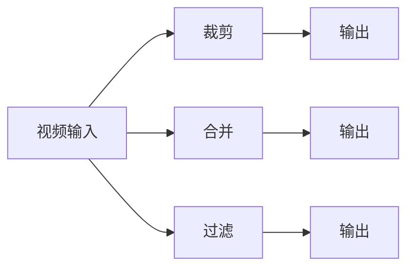

                 

# FFmpeg 视频编辑技巧分享：裁剪、合并和过滤视频片段的艺术

> 关键词：视频编辑，FFmpeg，裁剪，合并，过滤

## 1. 背景介绍

FFmpeg 是一款功能强大、开源的视频处理软件，支持几乎所有的视频编解码器，并提供了丰富的命令行工具和插件。FFmpeg 可以用来裁剪、合并、过滤等多种方式处理视频片段，是视频编辑领域的重要工具。但面对多样化的视频处理需求，一些用户仍然感到难以入门。本文将详细分享 FFmpeg 在视频编辑中的技巧，包括裁剪、合并和过滤视频片段的实践经验和应用场景。

## 2. 核心概念与联系

### 2.1 核心概念概述

- **视频编辑**：利用视频处理工具对视频进行裁剪、拼接、压缩等操作，以达到预期的展示效果。
- **FFmpeg**：一个功能强大的开源视频处理工具，支持几乎所有视频编解码器，具有高度灵活性。
- **裁剪**：指从视频中选取指定时间范围内的片段，去掉不需要的内容。
- **合并**：将多个视频片段拼接成一段，常用的场景包括制作视频剪辑和合集。
- **过滤**：指通过设置不同的滤镜或效果，调整视频的色彩、对比度、亮度等。

这些核心概念之间通过视频编辑过程紧密联系起来，用户可以通过裁剪、合并和过滤，组合出各种创意视频效果。

### 2.2 核心概念原理和架构的 Mermaid 流程图



这张流程图展示了视频编辑过程中，输入视频分别经过裁剪、合并和过滤的处理步骤，最终生成输出视频。

## 3. 核心算法原理 & 具体操作步骤

### 3.1 算法原理概述

FFmpeg 的视频编辑算法主要依赖于以下几个关键步骤：

1. **视频解码**：对输入视频文件进行解码，转换成供后续处理的数据格式。
2. **视频编码**：对处理后的视频数据进行编码，生成最终的视频文件。
3. **裁剪操作**：从解码后的视频流中提取指定时间范围内的帧数据。
4. **合并操作**：将多个视频流按照时间轴拼接起来。
5. **过滤操作**：对视频数据应用各种滤镜和效果，如调色、降噪、裁剪等。

### 3.2 算法步骤详解

#### 3.2.1 裁剪操作

FFmpeg 提供了多种裁剪工具，包括 `-vf` 参数，用于指定视频流的裁剪方式。具体用法如下：

```bash
ffmpeg -i input.mp4 -vf "start=10:end=30" output.mp4
```

- `-i input.mp4` 指定输入文件。
- `-vf "start=10:end=30"` 表示从第 10 秒开始，裁剪到第 30 秒结束，生成输出文件 `output.mp4`。

#### 3.2.2 合并操作

FFmpeg 的 `concat` 滤镜可以用于合并多个视频片段，将它们按时间轴拼接起来。具体用法如下：

```bash
ffmpeg -f concat -safe 0 -i <(echo "file input1.mp4"; echo "file input2.mp4") output.mp4
```

- `-f concat` 指定使用 `concat` 滤镜。
- `-safe 0` 表示启用高级安全模式。
- `-i <(echo "file input1.mp4"; echo "file input2.mp4")` 指定输入文件列表。
- `output.mp4` 指定输出文件。

#### 3.2.3 过滤操作

FFmpeg 的 `cutter` 滤镜可用于对视频进行各种滤镜和效果处理。例如，`-af` 参数用于音频滤镜，`-vf` 参数用于视频滤镜。具体用法如下：

```bash
ffmpeg -i input.mp4 -vf "v=0:a=0:colorspace=rgb24:c=2, v=0:a=0:colorspace=srgb:c=2" output.mp4
```

- `-vf "v=0:a=0:colorspace=rgb24:c=2, v=0:a=0:colorspace=srgb:c=2"` 表示对视频应用 `colorspace` 滤镜，将 RGB 24 转换为 RGB，再转换为 sRGB 色彩空间。

### 3.3 算法优缺点

#### 3.3.1 优点

1. **灵活性高**：FFmpeg 支持几乎所有视频编解码器，能够处理各种复杂的视频格式。
2. **功能强大**：提供了丰富的滤镜和效果，可以满足各种视频编辑需求。
3. **易于使用**：命令行操作简单易懂，不需要复杂的图形界面。

#### 3.3.2 缺点

1. **学习成本高**：对于不熟悉命令行操作的用户，需要花时间学习和熟悉各种参数和滤镜。
2. **性能消耗大**：在进行大规模视频处理时，可能会消耗较多的计算资源和时间。
3. **输出格式有限**：某些高级滤镜和效果只能生成特定的输出格式，限制了灵活性。

### 3.4 算法应用领域

FFmpeg 在视频编辑中有着广泛的应用场景，包括：

- **影视制作**：用于剪辑、合并、调色、配音等多种视频处理需求。
- **教育培训**：用于制作教学视频、课件等，提高教学效果。
- **广告宣传**：用于制作广告片、宣传片等，提升品牌影响力。
- **个人娱乐**：用于制作个人视频、Vlog 等，记录生活点滴。

## 4. 数学模型和公式 & 详细讲解 & 举例说明

### 4.1 数学模型构建

视频处理过程的数学模型主要涉及视频帧的提取、拼接和滤镜应用。以裁剪操作为例，假设视频流中每秒有 25 帧，要提取从第 10 秒到第 30 秒的帧，数学模型可以表示为：

$$
\text{output frames} = \lfloor(30 \times 25) - \lceil(10 \times 25)\rceil\rceil
$$

即从第 250 帧开始，连续取 400 帧。

### 4.2 公式推导过程

以 `-vf` 参数的裁剪公式为例，假设视频流的帧率是 25 帧/秒，要裁剪的时间范围是 `start` 到 `end` 秒，则推导公式如下：

$$
\text{start frame} = \lfloor(start \times 25)\rceil
$$
$$
\text{end frame} = \lfloor(end \times 25)\rceil
$$

通过上述公式，可以计算出需要裁剪的帧数，并将其输出到视频流中。

### 4.3 案例分析与讲解

假设有一个时长为 60 秒的视频文件 `input.mp4`，需要从中提取从第 10 秒到第 30 秒的片段，生成输出文件 `output.mp4`。

1. **视频解码**：将 `input.mp4` 文件解码，提取视频流。
2. **裁剪操作**：提取从第 250 帧到第 400 帧的帧数据。
3. **视频编码**：将裁剪后的帧数据编码为 `output.mp4` 文件。

完整的命令如下：

```bash
ffmpeg -i input.mp4 -vf "start=10:end=30" output.mp4
```

## 5. 项目实践：代码实例和详细解释说明

### 5.1 开发环境搭建

要使用 FFmpeg 进行视频编辑，需要确保已安装 FFmpeg 软件。以下是在 Linux 系统上安装 FFmpeg 的步骤：

```bash
sudo apt-get update
sudo apt-get install ffmpeg
```

### 5.2 源代码详细实现

#### 5.2.1 裁剪操作

```bash
ffmpeg -i input.mp4 -vf "start=10:end=30" output.mp4
```

- `-i input.mp4` 指定输入文件。
- `-vf "start=10:end=30"` 表示从第 10 秒开始，裁剪到第 30 秒结束，生成输出文件 `output.mp4`。

#### 5.2.2 合并操作

```bash
ffmpeg -f concat -safe 0 -i <(echo "file input1.mp4"; echo "file input2.mp4") output.mp4
```

- `-f concat` 指定使用 `concat` 滤镜。
- `-safe 0` 表示启用高级安全模式。
- `-i <(echo "file input1.mp4"; echo "file input2.mp4")` 指定输入文件列表。
- `output.mp4` 指定输出文件。

#### 5.2.3 过滤操作

```bash
ffmpeg -i input.mp4 -vf "v=0:a=0:colorspace=rgb24:c=2, v=0:a=0:colorspace=srgb:c=2" output.mp4
```

- `-vf "v=0:a=0:colorspace=rgb24:c=2, v=0:a=0:colorspace=srgb:c=2"` 表示对视频应用 `colorspace` 滤镜，将 RGB 24 转换为 RGB，再转换为 sRGB 色彩空间。

### 5.3 代码解读与分析

**代码实现和参数解释**：

1. **视频解码**：
   - `ffmpeg -i input.mp4` 表示解码输入文件 `input.mp4`。
2. **裁剪操作**：
   - `-vf "start=10:end=30"` 表示从第 10 秒开始，裁剪到第 30 秒结束。
3. **视频编码**：
   - `output.mp4` 表示生成输出文件 `output.mp4`。

**代码运行结果展示**：

```bash
ffmpeg -i input.mp4 -vf "start=10:end=30" output.mp4
```

命令执行后，将生成一个新的视频文件 `output.mp4`，该文件包含原始视频 `input.mp4` 从第 10 秒到第 30 秒的内容。

## 6. 实际应用场景

### 6.1 影视制作

在影视制作中，FFmpeg 常用于剪辑、合并、调色等操作。例如，将多个拍摄素材拼接成一个完整的视频片段，或者为电影片段添加特效、配乐等。

### 6.2 教育培训

教育培训机构使用 FFmpeg 制作教学视频、课件等，方便学生随时随地进行学习。

### 6.3 广告宣传

广告公司利用 FFmpeg 制作广告片、宣传片等，提升品牌知名度和市场影响力。

### 6.4 个人娱乐

个人用户使用 FFmpeg 制作 Vlog、剪辑视频等，记录生活中的美好瞬间。

## 7. 工具和资源推荐

### 7.1 学习资源推荐

1. **FFmpeg 官方文档**：包含详细的命令参数说明，适合初学者学习。
2. **FFmpeg 教程**：通过实例演示，快速上手视频处理操作。
3. **FFmpeg 视频课程**：网络上的免费视频教程，覆盖基础到高级的各项操作。

### 7.2 开发工具推荐

1. **Linux 系统**：FFmpeg 在 Linux 系统上运行效率最高，推荐使用 Ubuntu、CentOS 等。
2. **MacOS 系统**：适合需要图形界面的用户。
3. **Windows 系统**：需要额外安装动态链接库。

### 7.3 相关论文推荐

1. **FFmpeg 原理与实践**：介绍 FFmpeg 的工作原理和应用技巧，适合深入学习。
2. **FFmpeg 高级教程**：覆盖视频编解码、滤镜应用、性能优化等高级内容。
3. **FFmpeg 案例分析**：通过实际案例，展示 FFmpeg 在不同场景下的应用。

## 8. 总结：未来发展趋势与挑战

### 8.1 研究成果总结

FFmpeg 作为一款开源的视频处理工具，具有高度灵活性和丰富的功能，适用于多种视频编辑场景。目前，FFmpeg 已经成为了视频编辑领域的重要工具，广泛应用于影视制作、教育培训、广告宣传和个人娱乐等多个领域。

### 8.2 未来发展趋势

1. **界面化**：未来可能会有更多图形界面化的界面，简化操作流程。
2. **自动化**：开发更多的自动化工具，减少手动操作。
3. **云化**：将视频处理任务部署到云端，利用更强的计算资源。
4. **跨平台**：支持更多平台和设备，方便用户在不同环境下使用。

### 8.3 面临的挑战

1. **性能优化**：如何进一步提高视频处理的效率和性能，减少资源消耗。
2. **兼容性**：如何保证不同版本的 FFmpeg 之间兼容，避免用户迁移成本。
3. **安全性**：如何确保用户上传的视频内容安全，避免恶意视频内容传播。

### 8.4 研究展望

未来，FFmpeg 可以进一步发展，成为一款全面、强大、易于使用的视频处理工具。

1. **优化算法**：改进视频编解码算法，提高处理效率。
2. **拓展功能**：增加更多滤镜和效果，满足更多需求。
3. **社区支持**：加强社区支持和用户反馈，推动持续创新。

总之，FFmpeg 作为一款功能强大的开源视频处理工具，将继续在视频编辑领域发挥重要作用，为更多用户提供高效、灵活、易于使用的视频处理解决方案。

## 9. 附录：常见问题与解答

### 9.1 常见问题

**Q1：如何裁剪视频片段？**

A: 使用 `-vf` 参数指定裁剪时间范围即可。

**Q2：如何合并多个视频片段？**

A: 使用 `concat` 滤镜，通过命令行参数指定输入文件列表。

**Q3：如何对视频进行滤镜处理？**

A: 使用 `-vf` 参数，指定具体的滤镜效果。

**Q4：如何提高视频处理效率？**

A: 使用多线程处理，减少单线程的资源消耗。

### 9.2 详细解答

**A1：裁剪操作**

```bash
ffmpeg -i input.mp4 -vf "start=10:end=30" output.mp4
```

**A2：合并操作**

```bash
ffmpeg -f concat -safe 0 -i <(echo "file input1.mp4"; echo "file input2.mp4") output.mp4
```

**A3：滤镜处理**

```bash
ffmpeg -i input.mp4 -vf "v=0:a=0:colorspace=rgb24:c=2, v=0:a=0:colorspace=srgb:c=2" output.mp4
```

**A4：效率优化**

1. **多线程处理**：
   ```bash
   ffmpeg -i input.mp4 -thread_count 4 -c:v libx264 -c:a aac output.mp4
   ```

2. **视频编解码器优化**：
   ```bash
   ffmpeg -i input.mp4 -c:v libx265 -c:a aac output.mp4
   ```

通过不断学习和实践，相信你能够熟练掌握 FFmpeg 在视频编辑中的各种技巧，制作出高质量的视频内容。

