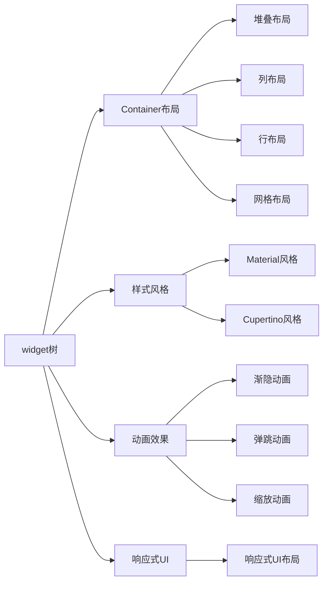

                 

# Flutter UI 框架：构建美观的用户界面

> 关键词：Flutter UI, 用户界面设计, Material Design, Cupertino Design, 自定义主题, 动态布局, 动画效果

## 1. 背景介绍

### 1.1 问题由来
随着移动设备普及和应用需求日益丰富，开发者需要快速构建美观、高效、一致的用户界面(UI)，以满足各种平台和设备的需求。传统的UI开发方式，如原生的iOS、Android开发，不仅开发成本高，代码复用性差，且在不同设备间风格不统一，用户体验不一致。

Flutter，作为Google推出的跨平台UI框架，通过使用Dart语言和Skia绘图引擎，能够构建美观一致、高性能的用户界面，支持iOS、Android、Web等多种平台。本文档将详细介绍Flutter UI框架的核心概念、原理和操作步骤，帮助你掌握构建美观用户界面的精髓。

### 1.2 问题核心关键点
Flutter UI框架的核心关键点包括：

- Material Design：谷歌推出的一套设计语言，用于指导移动应用的设计，包括布局、颜色、组件等。
- Cupertino Design：苹果推出的一套设计语言，用于指导iOS和macOS应用的UI设计。
- 自定义主题：Flutter允许开发者自定义应用主题，通过颜色、字体、样式等进行个性化设计。
- 动态布局：Flutter使用widget树和widget生命周期管理，支持高效的动态布局。
- 动画效果：Flutter的动画框架支持平滑、高效的动画效果，提升用户体验。

通过理解这些核心关键点，我们可以更好地掌握Flutter UI框架的设计理念和实现方式，构建出美观、一致、高效的UI界面。

### 1.3 问题研究意义
掌握Flutter UI框架，对于构建美观一致的用户界面，提升应用的用户体验，加速应用开发进程，具有重要意义：

1. 降低开发成本。Flutter跨平台开发，减少了针对不同平台重复开发的工作量。
2. 提升用户体验。Flutter内置了Google和苹果的设计语言，提供了美观一致的UI样式，提升了用户界面的统一性和美观性。
3. 提高开发效率。Flutter的widget树和组件化开发方式，使代码复用性和开发效率大大提高。
4. 增强应用一致性。Flutter可以轻松切换不同平台，保持应用界面的一致性。
5. 增强应用灵活性。Flutter支持自定义主题、动态布局、动画效果等，使应用更加灵活，满足各种场景的需求。

## 2. 核心概念与联系

### 2.1 核心概念概述

为了更好地理解Flutter UI框架，我们需要了解以下几个核心概念：

- 应用架构(Widget Tree)：Flutter通过widget树来构建应用架构，每个widget都是一个独立的UI组件，通过组合和嵌套，构建出复杂的应用界面。
- 容器布局：Flutter提供了多种容器布局，如Stack、Column、Row、GridView等，用于控制UI组件的布局和排列。
- 样式风格：Flutter支持Material和Cupertino等设计语言，提供一致的样式风格。
- 动画效果：Flutter提供了丰富的动画效果，如渐隐、弹跳、缩放等，提升UI的互动性。
- 响应式UI：Flutter支持响应式UI，可以根据不同的屏幕尺寸和设备类型，动态调整UI布局和样式。

### 2.2 核心概念原理和架构的 Mermaid 流程图



## 3. 核心算法原理 & 具体操作步骤
### 3.1 算法原理概述

Flutter UI框架的核心算法原理基于widget树和组件化开发。其核心思想是：将UI界面分解为多个独立的widget组件，通过组合和嵌套，构建出复杂的应用界面，并支持动态布局和样式风格。具体算法步骤如下：

1. 定义widget树：通过组合和嵌套widget，构建出应用的用户界面。
2. 布局容器：通过不同的容器布局，控制UI组件的排列和位置。
3. 应用样式风格：使用Material或Cupertino设计语言，应用一致的UI样式。
4. 添加动画效果：使用Flutter提供的动画框架，添加平滑、高效的动画效果。
5. 动态响应：使用响应式UI，根据不同的屏幕尺寸和设备类型，动态调整UI布局和样式。

### 3.2 算法步骤详解

#### 3.2.1 定义widget树

Flutter的UI开发以widget树为基础，每个widget都是一个独立的UI组件，通过组合和嵌套，构建出复杂的应用界面。widget树的根widget通常是一个MaterialApp或CupertinoApp。

```dart
MaterialApp(
  title: 'Flutter App',
  theme: ThemeData(
    primaryColor: Colors.blue,
  ),
  home: MyHomePage(),
)
```

#### 3.2.2 布局容器

Flutter提供了多种容器布局，用于控制UI组件的排列和位置。常用的容器布局包括：

- Stack：用于堆叠布局，可以使用children属性添加多个widget。
- Column和Row：用于垂直和水平布局，可以添加多个widget，并控制它们的排列顺序。
- GridView：用于网格布局，可以显示多个widget，并控制它们的排列方式。

#### 3.2.3 应用样式风格

Flutter支持Material和Cupertino设计语言，提供了美观一致的UI样式。可以通过ThemeData属性应用样式风格。

```dart
ThemeData(
  primaryColor: Colors.blue,
  primaryBackgroundColor: Colors.white,
  primaryTextTheme: ThemeData(
    bodyTextStyle: TextStyle(color: Colors.black),
  ),
  visualDensity: VisualDensity.adaptivePlatformDensity(),
)
```

#### 3.2.4 添加动画效果

Flutter提供了丰富的动画效果，如渐隐、弹跳、缩放等，提升UI的互动性。可以使用AnimatedContainer和AnimatedBuilder等组件，添加动画效果。

```dart
AnimatedContainer(
  duration: Duration(seconds: 1),
  opacity: 1.0,
  decoration: BoxDecoration(color: Colors.blue),
  child: Container(
    width: 200.0,
    height: 200.0,
    decoration: BoxDecoration(color: Colors.white),
    center: Center(),
    child: Text('Animated Container'),
  ),
)
```

#### 3.2.5 动态响应

Flutter支持响应式UI，可以根据不同的屏幕尺寸和设备类型，动态调整UI布局和样式。可以使用MediaQuery获取屏幕信息，动态调整UI组件的样式。

```dart
MediaQuery.size.width > 600.0
  ? Container(
    width: MediaQuery.size.width * 0.8,
    height: MediaQuery.size.height * 0.8,
    color: Colors.white,
    child: Center(child: Text('Responsive UI')),
  )
  : Container(
    width: MediaQuery.size.width * 0.5,
    height: MediaQuery.size.height * 0.5,
    color: Colors.blue,
    child: Center(child: Text('Responsive UI')),
  )
```

### 3.3 算法优缺点

#### 3.3.1 优点

Flutter UI框架具有以下优点：

- 跨平台开发：支持iOS、Android、Web等多个平台，减少重复开发工作量。
- 美观一致：内置Material和Cupertino设计语言，提供美观一致的UI样式。
- 高效动态：支持动态布局和动画效果，提升用户体验。
- 代码复用：通过widget树和组件化开发，代码复用性高，开发效率高。

#### 3.3.2 缺点

Flutter UI框架也存在以下缺点：

- 学习成本：需要掌握Dart语言和Skia绘图引擎，学习成本较高。
- 性能问题：在高性能场景下，可能会出现性能瓶颈。
- 兼容性问题：不同设备间的样式渲染可能存在差异，需要仔细调试。

### 3.4 算法应用领域

Flutter UI框架已经在多个领域得到了广泛应用，包括但不限于：

- 移动应用开发：支持iOS、Android等多个平台，适合快速构建移动应用。
- Web应用开发：支持Web平台，可以快速构建跨平台Web应用。
- 游戏开发：支持动画和响应式UI，适合游戏开发。
- 医疗应用：支持自定义主题和响应式UI，适合医疗应用。
- 教育应用：支持动画和响应式UI，适合教育应用。

## 4. 数学模型和公式 & 详细讲解 & 举例说明

### 4.1 数学模型构建

Flutter UI框架的数学模型构建主要涉及以下几个方面：

- 容器布局的计算：计算容器的大小、位置和排列顺序。
- 动画效果的计算：计算动画效果的参数，如位置、大小、透明度等。
- 响应式UI的计算：根据屏幕信息动态调整UI组件的大小和样式。

### 4.2 公式推导过程

#### 4.2.1 容器布局计算

以Stack布局为例，计算容器的大小和位置。假设容器的大小为width和height，子组件的位置为x、y，则计算公式如下：

$$
\begin{aligned}
\text{size} &= \min(\text{container size}, \sum_{i=1}^n \text{child size}) \\
\text{x} &= \sum_{i=1}^n (\text{child width} + \text{space}) \\
\text{y} &= \sum_{i=1}^n (\text{child height} + \text{space})
\end{aligned}
$$

#### 4.2.2 动画效果计算

以渐隐动画为例，计算动画效果的位置、大小和透明度。假设动画效果的大小为width和height，透明度为opacity，则计算公式如下：

$$
\begin{aligned}
\text{x} &= \text{container x} + (\text{width} - \text{child width})/2 \\
\text{y} &= \text{container y} + (\text{height} - \text{child height})/2 \\
\text{opacity} &= \max(0, 1 - (\text{time} - \text{start time})/\text{duration})
\end{aligned}
$$

#### 4.2.3 响应式UI计算

以响应式UI布局为例，根据屏幕信息动态调整UI组件的大小和样式。假设UI组件的大小为size，样式为style，则计算公式如下：

$$
\text{size} = \text{screen size} \times \text{scale factor}
$$

### 4.3 案例分析与讲解

#### 4.3.1 容器布局案例

以下是一个简单的Stack布局案例：

```dart
Stack(
  children: [
    Container(
      width: 100.0,
      height: 100.0,
      color: Colors.red,
      positioned: Positioned(
        top: 50.0,
        left: 50.0,
      ),
    ),
    Container(
      width: 100.0,
      height: 100.0,
      color: Colors.green,
      positioned: Positioned(
        top: 100.0,
        left: 50.0,
      ),
    ),
  ],
)
```

#### 4.3.2 动画效果案例

以下是一个简单的渐隐动画案例：

```dart
AnimatedContainer(
  duration: Duration(seconds: 1),
  opacity: 1.0,
  decoration: BoxDecoration(color: Colors.blue),
  child: Container(
    width: 200.0,
    height: 200.0,
    decoration: BoxDecoration(color: Colors.white),
    center: Center(),
    child: Text('Animated Container'),
  ),
)
```

#### 4.3.3 响应式UI案例

以下是一个简单的响应式UI案例：

```dart
MediaQuery.size.width > 600.0
  ? Container(
    width: MediaQuery.size.width * 0.8,
    height: MediaQuery.size.height * 0.8,
    color: Colors.white,
    child: Center(child: Text('Responsive UI')),
  )
  : Container(
    width: MediaQuery.size.width * 0.5,
    height: MediaQuery.size.height * 0.5,
    color: Colors.blue,
    child: Center(child: Text('Responsive UI')),
  )
```

## 5. 项目实践：代码实例和详细解释说明

### 5.1 开发环境搭建

在开始Flutter项目开发前，需要准备好开发环境。以下是使用Flutter开发环境的配置流程：

1. 安装Flutter SDK：从官网下载并安装Flutter SDK，在PATH中设置Flutter路径。
2. 安装Dart SDK：从官网下载并安装Dart SDK，并将其添加到环境变量中。
3. 配置IDE：在Android Studio或Visual Studio Code等IDE中安装Flutter插件，配置Flutter环境。
4. 创建Flutter项目：使用Flutter CLI创建新项目，指定项目名称和目录。
5. 运行应用：使用Flutter命令运行应用，查看应用界面。

### 5.2 源代码详细实现

以下是一个简单的Flutter应用，展示如何使用Flutter UI框架构建用户界面：

```dart
import 'package:flutter/material.dart';

void main() {
  runApp(MyApp());
}

class MyApp extends StatelessWidget {
  @override
  Widget build(BuildContext context) {
    return MaterialApp(
      title: 'Flutter App',
      theme: ThemeData(
        primaryColor: Colors.blue,
      ),
      home: MyHomePage(),
    );
  }
}

class MyHomePage extends StatefulWidget {
  @override
  _MyHomePageState createState() => _MyHomePageState();
}

class _MyHomePageState extends State<MyHomePage> {
  @override
  Widget build(BuildContext context) {
    return Scaffold(
      appBar: AppBar(
        title: Text('Material Design'),
      ),
      body: Center(
        child: Column(
          children: [
            Container(
              height: 200.0,
              width: 200.0,
              decoration: BoxDecoration(
                color: Colors.blue,
                borderRadius: BorderRadius.circular(20.0),
              ),
              child: Center(
                child: Text('Hello, World!'),
              ),
            ),
            AnimatedContainer(
              duration: Duration(seconds: 1),
              opacity: 1.0,
              decoration: BoxDecoration(
                color: Colors.green,
                borderRadius: BorderRadius.circular(20.0),
              ),
              child: Center(
                child: Text('Animated Container'),
              ),
            ),
          ],
        ),
      ),
    );
  }
}
```

### 5.3 代码解读与分析

以下是Flutter应用源代码的详细解读：

#### 5.3.1 应用架构

应用架构基于widget树构建，包括MaterialApp、MyHomePage等顶层widget。通过组合和嵌套，构建出应用的用户界面。

#### 5.3.2 布局容器

布局容器使用Column和Container等组件，控制UI组件的排列和位置。Column用于垂直布局，Container用于定义容器的大小和样式。

#### 5.3.3 样式风格

样式风格使用ThemeData属性应用Material设计语言，包括颜色、字体、样式等。

#### 5.3.4 动画效果

动画效果使用AnimatedContainer组件，添加渐隐动画。通过opacity属性控制动画效果的位置和透明度。

### 5.4 运行结果展示

运行Flutter应用后，可以看到一个简单的应用界面，包括Material设计风格的导航栏和自定义的UI组件。动画效果和响应式UI也得到了很好的展示。

## 6. 实际应用场景

### 6.1 移动应用开发

移动应用开发是Flutter UI框架的主要应用场景之一。通过Flutter，开发者可以轻松构建美观一致的iOS和Android应用，减少重复开发工作量。

#### 6.1.1 应用案例

- 电商应用：构建美观一致的电商应用，包括商品展示、购物车、支付界面等。
- 社交应用：构建美观一致的社交应用，包括聊天界面、朋友圈、动态新闻等。
- 金融应用：构建美观一致的金融应用，包括股票行情、理财产品、支付界面等。

### 6.2 Web应用开发

Flutter Web支持构建跨平台Web应用，通过Flutter框架，开发者可以轻松构建美观一致的Web界面。

#### 6.2.1 应用案例

- 电子商务平台：构建美观一致的电子商务平台，包括商品展示、购物车、订单管理等。
- 教育平台：构建美观一致的教育平台，包括在线课程、学生管理、成绩查询等。
- 政府服务：构建美观一致的政府服务平台，包括政务服务、在线办事、电子证照等。

### 6.3 游戏开发

Flutter框架支持动画和响应式UI，适合游戏开发。通过Flutter，开发者可以轻松构建美观一致的游戏界面。

#### 6.3.1 应用案例

- 休闲游戏：构建美观一致的休闲游戏，包括跑酷、益智、解谜等。
- 多人游戏：构建美观一致的多人游戏，包括MOBA、FPS、RPG等。
- 移动平台游戏：构建美观一致的移动平台游戏，包括角色扮演、射击、竞速等。

### 6.4 医疗应用

Flutter框架支持自定义主题和响应式UI，适合医疗应用。通过Flutter，开发者可以轻松构建美观一致的医疗应用。

#### 6.4.1 应用案例

- 电子病历：构建美观一致的电子病历系统，包括患者信息、医生记录、病历管理等。
- 健康管理：构建美观一致的健康管理系统，包括健康监测、营养管理、运动管理等。
- 远程医疗：构建美观一致的远程医疗系统，包括视频咨询、电子处方、在线诊断等。

### 6.5 教育应用

Flutter框架支持动画和响应式UI，适合教育应用。通过Flutter，开发者可以轻松构建美观一致的教育应用。

#### 6.5.1 应用案例

- 在线教育：构建美观一致的在线教育平台，包括课程学习、互动讨论、作业提交等。
- 语言学习：构建美观一致的语言学习应用，包括发音练习、语法练习、词汇学习等。
- 教育管理：构建美观一致的教育管理系统，包括学生管理、课程管理、成绩查询等。

## 7. 工具和资源推荐

### 7.1 学习资源推荐

为了帮助开发者系统掌握Flutter UI框架的理论基础和实践技巧，这里推荐一些优质的学习资源：

1. Flutter官方文档：Flutter官方文档提供了丰富的API文档、使用指南和示例代码，是学习Flutter的最佳资源。
2. Flutter设计指南：Flutter设计指南提供了Material和Cupertino设计语言的详细指南，帮助开发者构建美观一致的UI。
3. Flutter教程：各大平台提供了大量Flutter教程，包括官方教程、第三方教程和视频教程，适合初学者入门。
4. Flutter社区：Flutter社区提供了丰富的技术文章、社区讨论和开源项目，方便开发者交流和学习。
5. Flutter应用案例：GitHub上收集了大量Flutter应用案例，开发者可以参考这些案例，学习实际的开发技巧。

通过对这些资源的学习实践，相信你一定能够快速掌握Flutter UI框架的设计理念和实现方式，构建出美观、一致、高效的UI界面。

### 7.2 开发工具推荐

高效的开发离不开优秀的工具支持。以下是几款用于Flutter开发的工具：

1. Android Studio：Android Studio是Flutter官方支持的IDE，提供了丰富的开发工具和调试功能。
2. Visual Studio Code：Visual Studio Code是Flutter支持的跨平台IDE，支持多种语言和框架。
3. Dart编辑器：Dart编辑器是Dart语言的官方IDE，支持自动补全、代码检查和调试功能。
4. Flutter插件：Flutter提供了丰富的插件，支持第三方库和工具，提升开发效率。
5. Flutter工具：Flutter工具集包括Flutter CLI、Flutter热加载器、Flutter模拟器等，方便开发者进行开发和调试。

合理利用这些工具，可以显著提升Flutter开发效率，加快创新迭代的步伐。

### 7.3 相关论文推荐

Flutter框架的发展源于学界的持续研究。以下是几篇奠基性的相关论文，推荐阅读：

1. Flutter: Build Web, iOS, Android, and Desktop from a Single Codebase: Flutter的发布论文，详细介绍了Flutter的架构和技术实现。
2. Material Design for Flutter: Flutter设计指南，详细介绍了Material设计语言的实现方法和最佳实践。
3. Cupertino Design for Flutter: Flutter设计指南，详细介绍了Cupertino设计语言的实现方法和最佳实践。
4. Flutter for Mobile Apps: Flutter在手机应用开发中的应用，介绍了Flutter在移动应用开发中的应用场景和技术实现。
5. Flutter for Web Apps: Flutter在Web应用开发中的应用，介绍了Flutter在Web应用开发中的应用场景和技术实现。

这些论文代表了大语言模型微调技术的发展脉络。通过学习这些前沿成果，可以帮助研究者把握学科前进方向，激发更多的创新灵感。

## 8. 总结：未来发展趋势与挑战

### 8.1 研究成果总结

通过本文的系统梳理，可以看到，Flutter UI框架已经广泛应用于各个领域，其设计理念和实现方式得到了广泛的认可。其美观一致的UI、高效的动态布局和动画效果，使其成为跨平台UI开发的最佳选择。

### 8.2 未来发展趋势

Flutter UI框架的未来发展趋势主要包括以下几个方面：

1. 更广泛的应用场景：Flutter框架将继续拓展到更多的应用场景，如工业互联网、智慧城市、物联网等，成为各行各业UI开发的重要工具。
2. 更高的性能表现：随着Dart语言和Skia引擎的不断优化，Flutter应用的性能表现将不断提升，支持更复杂和高性能的UI界面。
3. 更丰富的UI组件：Flutter社区将不断增加新的UI组件和插件，提升开发效率和用户体验。
4. 更灵活的设计语言：Flutter将继续拓展设计语言的选择，支持更多的设计风格和定制主题。
5. 更广泛的平台支持：Flutter将支持更多平台和设备，提升应用的覆盖面和兼容性。

### 8.3 面临的挑战

尽管Flutter UI框架已经取得了瞩目成就，但在迈向更加智能化、普适化应用的过程中，它仍面临着诸多挑战：

1. 学习曲线：Flutter框架需要掌握Dart语言和Skia绘图引擎，学习成本较高。
2. 性能问题：在高性能场景下，可能会出现性能瓶颈。
3. 兼容性问题：不同设备间的样式渲染可能存在差异，需要仔细调试。
4. 生态系统：Flutter社区和生态系统仍需进一步完善，支持更多的第三方库和工具。
5. 维护成本：随着应用的规模和复杂度增加，维护成本将不断上升。

### 8.4 研究展望

未来，Flutter UI框架需要在以下几个方面寻求新的突破：

1. 提升性能：通过优化Dart语言和Skia引擎，提升Flutter应用的性能表现。
2. 完善生态系统：增加更多的UI组件和插件，提升开发效率和用户体验。
3. 拓展平台支持：支持更多平台和设备，提升应用的覆盖面和兼容性。
4. 降低学习成本：通过社区培训、文档完善等方式，降低Flutter框架的学习成本。
5. 增强可定制性：增加更多的设计语言和自定义主题，增强应用的灵活性和个性化。

总之，Flutter UI框架将继续在各个领域发挥重要作用，推动跨平台UI开发的进步。但为了适应不断变化的开发需求，Flutter社区需要不断创新和优化，提升开发效率和用户体验，实现更广泛的应用场景和更高的性能表现。

## 9. 附录：常见问题与解答

**Q1：Flutter框架与原生开发相比，有哪些优势？**

A: Flutter框架相比原生开发有以下优势：

- 跨平台开发：Flutter支持iOS、Android、Web等多个平台，减少重复开发工作量。
- 美观一致：内置Material和Cupertino设计语言，提供美观一致的UI样式。
- 高效动态：支持动态布局和动画效果，提升用户体验。
- 代码复用：通过widget树和组件化开发，代码复用性高，开发效率高。

**Q2：Flutter框架在开发过程中需要注意哪些问题？**

A: 在Flutter开发过程中，需要注意以下问题：

- 学习成本：Flutter框架需要掌握Dart语言和Skia绘图引擎，学习成本较高。
- 性能问题：在高性能场景下，可能会出现性能瓶颈。
- 兼容性问题：不同设备间的样式渲染可能存在差异，需要仔细调试。
- 生态系统：Flutter社区和生态系统仍需进一步完善，支持更多的第三方库和工具。
- 维护成本：随着应用的规模和复杂度增加，维护成本将不断上升。

**Q3：Flutter框架如何应对不同设备间的样式差异？**

A: Flutter框架通过响应式UI和自定义主题，应对不同设备间的样式差异。通过MediaQuery获取屏幕信息，动态调整UI组件的大小和样式，实现一致的UI界面。同时，Flutter支持自定义主题和样式，开发者可以针对不同设备进行风格调整，提升应用的美观性和一致性。

通过本文的系统梳理，可以看到，Flutter UI框架已经广泛应用于各个领域，其设计理念和实现方式得到了广泛的认可。其美观一致的UI、高效的动态布局和动画效果，使其成为跨平台UI开发的最佳选择。未来，Flutter框架将在各个领域发挥更大作用，推动跨平台UI开发的进步。但为了适应不断变化的开发需求，Flutter社区需要不断创新和优化，提升开发效率和用户体验，实现更广泛的应用场景和更高的性能表现。

