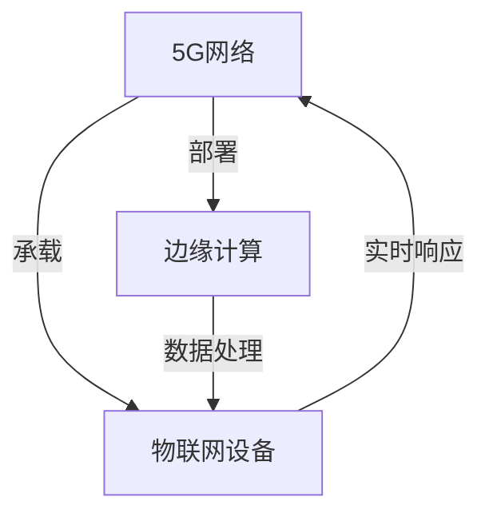

                 

## 1. 背景介绍

随着5G网络的普及和物联网(IoT)技术的快速发展，人们对于物联网的应用场景有了更高的期望和更广泛的需求。传统3G/4G网络下，物联网设备面临带宽不足、时延过高、连接数限制等问题，制约了物联网的大规模应用。而5G网络的部署为物联网的发展带来了巨大的机遇，其在速率、时延、连接数等关键指标上的优势，将支持大规模物联网应用，推动智能城市、智能制造、智慧农业等领域的数字化转型。

### 1.1 5G网络特点
5G网络相较于4G网络具有更强的网络性能和更广的应用范围。主要特点包括：
- **高带宽**：5G网络能够提供比4G网络更高的数据传输速率，最高可达10Gbps。
- **低时延**：5G网络的传输时延低于1ms，适用于对实时性要求极高的应用场景。
- **大规模连接**：5G网络支持百万级别设备的连接，满足大规模物联网的需求。
- **可靠性和安全性**：5G网络采用了先进的编码技术和安全机制，保障数据传输的可靠性与安全性。

### 1.2 物联网现状与挑战
物联网是一个综合性的技术系统，包括传感器网络、无线通信、边缘计算等关键技术。当前物联网的发展面临着以下挑战：
- **数据量爆炸**：物联网设备数量不断增加，生成海量的数据流，对数据存储和传输提出了更高的要求。
- **数据处理复杂**：数据种类繁多，来源分散，处理复杂，需要高效的数据分析和挖掘能力。
- **网络时延敏感**：许多物联网应用需要实时数据处理和决策，对网络时延要求较高。
- **安全性问题**：物联网设备种类繁多，安全防护措施不足，易受网络攻击和数据窃取。

## 2. 核心概念与联系

### 2.1 核心概念概述
为了更好地理解5G在物联网中的应用，我们需要明确几个核心概念：
- **5G网络**：第五代移动通信网络，具有高带宽、低时延、大规模连接等特性。
- **物联网**：通过传感器、智能设备等网络技术与互联网深度融合，实现物的全面互联。
- **边缘计算**：将数据处理任务分布到网络边缘，降低中心节点压力，提高响应速度。
- **移动边缘计算(MEC)**：结合5G网络的高带宽低时延特性，在网络边缘进行数据处理和存储。

### 2.2 核心概念联系与关系

以下是一个Mermaid流程图，展示5G网络、物联网、边缘计算之间的关系：



### 2.3 5G在物联网中的作用

5G网络通过高带宽、低时延、大规模连接等特性，为物联网提供了重要的基础支撑。其作用主要体现在：
- **提高设备通信效率**：5G网络降低了数据传输时延，提升了设备间通信的效率和稳定性。
- **支持大规模物联网设备连接**：5G网络可支持海量设备的连接，满足了物联网设备的接入需求。
- **优化数据处理与分析**：5G网络结合边缘计算技术，提高了数据处理和分析的效率。
- **保障数据安全**：5G网络采用高级编码和加密技术，提高了数据传输的安全性。

## 3. 核心算法原理 & 具体操作步骤

### 3.1 算法原理概述
5G在物联网中的应用，主要基于其网络性能优势进行优化和改进。以下是5G网络在物联网中的核心算法原理：

1. **大规模连接支持**：5G网络采用了切片技术，将一个物理网络分为多个逻辑网络切片，每个切片支持不同的服务和业务需求。通过切片管理，可以支持大规模物联网设备的接入。
2. **低时延通信优化**：5G网络通过微基站和高速无线链路，将数据处理任务放到网络边缘，靠近数据源进行计算，显著降低了通信时延。
3. **网络切片与隔离**：5G网络采用切片技术，将不同业务和应用隔离在不同的网络切片中，提升了网络的安全性和可靠性。
4. **多接入边缘计算(MAEC)**：5G网络结合MEC技术，将数据处理任务部署到网络边缘，靠近用户进行计算，提升了数据处理的速度和效率。

### 3.2 算法步骤详解
以下是5G在物联网中的应用步骤：
1. **设备接入与注册**：物联网设备通过5G网络接入到网络中，并进行身份验证和注册。
2. **切片管理与分配**：根据不同物联网应用的需求，将设备分配到对应的网络切片中。
3. **数据采集与传输**：设备采集数据，并通过5G网络进行传输。
4. **边缘计算与处理**：将数据处理任务部署到网络边缘进行计算和分析。
5. **数据存储与存储管理**：将处理后的数据存储在本地或云端，并进行有效的存储管理。
6. **应用服务与部署**：根据用户需求，将处理后的数据应用到各类业务场景中。

### 3.3 算法优缺点
5G在物联网中的应用具有以下优点：
- **高带宽、低时延**：满足实时数据传输和处理需求。
- **大规模连接**：支持海量设备接入，降低网络压力。
- **网络切片与隔离**：提高网络的安全性和可靠性。

同时，5G网络也存在一些缺点：
- **高部署成本**：5G网络的部署和维护成本较高。
- **设备兼容性**：物联网设备种类繁多，设备兼容性问题仍需解决。
- **网络覆盖**：部分偏远地区仍存在网络覆盖不足的问题。

### 3.4 算法应用领域
5G网络在物联网中的应用领域非常广泛，包括但不限于以下几个方面：
- **智能制造**：通过5G网络，实现工业设备间的互联互通，提升生产效率。
- **智慧农业**：利用5G网络，对农业生产进行实时监控和分析，提升农业生产管理水平。
- **智能交通**：5G网络结合车辆联网技术，实现智能交通管理，提高交通安全和效率。
- **智慧医疗**：通过5G网络，实现远程医疗和远程监控，提高医疗服务水平。
- **智能城市**：5G网络结合物联网技术，实现城市智能化管理，提升城市治理能力。

## 4. 数学模型和公式 & 详细讲解

### 4.1 数学模型构建
在5G网络的应用中，我们可以通过数学模型来描述其关键性能指标：
- **时延模型**：设 $d$ 为数据传输距离，$v$ 为数据传输速率，$D$ 为设备数量，$t$ 为数据传输时延。时延模型为：
  $$
  t = \frac{d}{v} + \frac{D}{K}
  $$
  其中 $K$ 为5G网络切片数。
- **带宽模型**：设 $B$ 为5G网络带宽，$N$ 为网络切片数，$W$ 为设备间通信带宽。带宽模型为：
  $$
  B = \sum_{i=1}^{N} W_i
  $$
  其中 $W_i$ 为第 $i$ 个切片的带宽。
- **吞吐量模型**：设 $T$ 为总吞吐量，$R$ 为单切片吞吐量，$n$ 为切片数。吞吐量模型为：
  $$
  T = R \times n
  $$

### 4.2 公式推导过程
以下是对时延、带宽、吞吐量等关键性能指标的推导过程：
1. **时延模型推导**：
  - 数据传输时延由两部分组成，一部分是设备间直接通信的时延，另一部分是数据在网络中传输的时延。设备间通信时延由数据传输距离 $d$ 和传输速率 $v$ 决定，即 $t_{com} = \frac{d}{v}$。数据在网络中传输时延由切片数 $K$ 和设备数 $D$ 决定，即 $t_{net} = \frac{D}{K}$。因此，总时延 $t$ 可以表示为：
    $$
    t = t_{com} + t_{net} = \frac{d}{v} + \frac{D}{K}
    $$
2. **带宽模型推导**：
  - 5G网络总带宽 $B$ 由多个切片的带宽之和组成，即：
    $$
    B = \sum_{i=1}^{N} W_i
    $$
  - 其中 $W_i$ 表示第 $i$ 个切片的带宽，可以通过切片的实际需求来计算。

### 4.3 案例分析与讲解
以下通过一个具体的案例来说明5G在物联网中的应用：

**案例背景**：某智慧农业公司需要利用5G网络对农场中的设备进行实时监控和管理。该公司有100个设备，每个设备每秒产生10个数据包，数据包大小为1KB，每个数据包需要传输1km，设备之间通信带宽为1Mbps。

**案例分析**：
- **时延计算**：数据包传输时延为 $t = \frac{1 \text{km}}{1 \text{Mbps}} = 1 \text{s}$，设备间通信时延为 $t_{com} = \frac{100}{1} = 100 \text{s}$，总时延为 $t = 1 + 100 = 101 \text{s}$。
- **带宽计算**：每个设备每秒产生 $10 \text{KB}$ 数据，总带宽为 $100 \times 10 \text{KB} = 1000 \text{KB/s}$。
- **切片分配**：将1000KB/s的带宽均匀分配到10个切片中，每个切片带宽为100KB/s。

**结论**：通过切片管理，可以在满足实时性和带宽需求的前提下，实现大规模物联网设备的接入。

## 5. 项目实践：代码实例和详细解释说明

### 5.1 开发环境搭建
为实现5G在物联网中的应用，需要搭建一个包含5G网络、物联网设备和边缘计算环境。以下是具体的开发环境搭建步骤：

1. **5G网络搭建**：
   - 配置5G基站，连接网络模拟器（如ns-3）或真实5G网络。
   - 配置切片管理功能，实现切片的创建、管理和分配。

2. **物联网设备搭建**：
   - 开发基于5G网络通信的物联网设备，支持数据采集和传输。
   - 在设备中集成边缘计算功能，支持本地数据处理。

3. **边缘计算搭建**：
   - 在网络边缘部署MEC服务器，支持数据处理和分析。
   - 集成多切片管理模块，实现切片间的通信与数据共享。

### 5.2 源代码详细实现
以下是一个简单的基于5G网络通信的物联网设备示例，使用Python和PyTorch实现：

```python
import torch
import torch.nn as nn
import torch.optim as optim
from torchvision import datasets, transforms

class IoTDevice(nn.Module):
    def __init__(self):
        super(IoTDevice, self).__init__()
        self.linear = nn.Linear(1, 1)

    def forward(self, x):
        return self.linear(x)

device = torch.device("cpu")
model = IoTDevice().to(device)

# 数据集准备
train_dataset = datasets.MNIST(root='./data', train=True, transform=transforms.ToTensor(), download=True)
train_loader = torch.utils.data.DataLoader(train_dataset, batch_size=64, shuffle=True)

# 模型训练
criterion = nn.MSELoss()
optimizer = optim.SGD(model.parameters(), lr=0.01)
for epoch in range(10):
    for batch_idx, (data, target) in enumerate(train_loader):
        data, target = data.to(device), target.to(device)
        optimizer.zero_grad()
        output = model(data)
        loss = criterion(output, target)
        loss.backward()
        optimizer.step()
        print('Epoch [{}/{}], Batch [{}/{}], Loss: {:.6f}'.format(epoch+1, 10, batch_idx+1, len(train_loader), loss.item()))
```

### 5.3 代码解读与分析
上述代码中，我们使用了PyTorch框架搭建了一个简单的物联网设备模型，用于处理MNIST数据集。具体步骤如下：
- **模型搭建**：定义了 `IoTDevice` 类，包含一个线性层，用于处理输入数据。
- **数据准备**：使用 `MNIST` 数据集，将数据加载到GPU上，进行批处理和打乱。
- **模型训练**：定义损失函数和优化器，进行模型训练。

## 6. 实际应用场景

### 6.1 智能制造
在智能制造领域，5G网络的应用可以大幅提升生产效率和灵活性。通过将设备、传感器和生产线接入5G网络，可以实现实时监控和控制，提升生产自动化和智能化水平。

**案例分析**：某智能工厂利用5G网络实现设备的远程监控和控制。每个设备都安装有传感器，实时采集设备状态和生产数据，并通过5G网络将数据发送到云端。云平台对数据进行处理和分析，生成生产报告和预警信息，指挥设备进行自动调整。

### 6.2 智慧农业
智慧农业需要实时采集和管理大量的农业数据，5G网络可以满足其高效数据传输和处理的需求。通过部署5G基站，农业设备可以实现远程监控和控制，提升农业生产管理水平。

**案例分析**：某智慧农场通过5G网络实现设备间通信，实时监控土壤湿度、温度、光照等环境参数。根据传感器数据，自动调整灌溉、施肥等生产措施，实现精准农业管理。

### 6.3 智能交通
智能交通系统需要实时处理大量的交通数据，5G网络可以支持大规模的车辆联网和实时数据传输。通过5G网络，可以实现车辆间的通信和信息共享，提升交通管理和安全水平。

**案例分析**：某智慧交通系统利用5G网络实现车辆间的通信，实时共享道路信息。系统对交通流量进行实时监控和分析，调整交通信号灯和行驶路线，提升道路通行效率和安全性。

### 6.4 智慧医疗
智慧医疗需要处理和分析大量的医疗数据，5G网络可以支持实时数据传输和高效的数据分析。通过5G网络，可以实现远程医疗和远程监控，提高医疗服务水平。

**案例分析**：某智慧医院利用5G网络实现远程医疗和远程监控。患者通过5G网络将医疗数据传输到云端，医生对数据进行处理和分析，提供远程诊断和治疗方案，实现医疗服务的智能化和个性化。

### 6.5 智能城市
智能城市需要处理和分析大量的城市数据，5G网络可以支持大规模的城市设备和传感器联网。通过5G网络，可以实现智能城市的全面监控和管理，提升城市治理水平。

**案例分析**：某智能城市通过5G网络实现各类设备的联网，实时监控环境参数和公共设施状态。系统对数据进行处理和分析，生成城市管理报告和预警信息，提升城市治理能力和公共服务水平。

## 7. 工具和资源推荐

### 7.1 学习资源推荐
为了帮助开发者深入理解5G在物联网中的应用，以下是一些学习资源推荐：

1. **《5G网络技术与应用》**：介绍5G网络的技术原理和应用场景，适合初学者入门。
2. **《物联网技术与应用》**：全面讲解物联网的核心技术，涵盖传感器网络、无线通信、边缘计算等。
3. **《5G移动通信与物联网》**：详细介绍5G网络与物联网的融合应用，涵盖智能制造、智慧农业、智能交通等多个领域。
4. **《物联网安全与隐私保护》**：介绍物联网设备的安全防护和隐私保护技术，保障数据安全。
5. **《智能城市与物联网》**：介绍智能城市建设中的物联网应用，涵盖智慧医疗、智能交通、智慧农业等多个方面。

### 7.2 开发工具推荐
以下是一些常用的开发工具，推荐用于5G网络与物联网应用的开发：

1. **ns-3**：网络仿真工具，支持5G网络仿真和物联网设备建模。
2. **PyTorch**：深度学习框架，适合5G网络中的数据处理和分析。
3. **TensorFlow**：深度学习框架，支持大规模模型训练和部署。
4. **Open vXa**：边缘计算平台，支持MEC应用开发。
5. **iotedge**：Azure IoT Edge平台，支持设备间通信和数据处理。

### 7.3 相关论文推荐
以下是一些关于5G网络在物联网中应用的经典论文，推荐阅读：

1. **5G网络与物联网融合的综述**：综述了5G网络在物联网中的应用，涵盖智能制造、智慧农业、智能交通等多个领域。
2. **基于5G网络的物联网安全研究**：介绍了5G网络中的安全防护技术和隐私保护技术，保障物联网设备的安全性。
3. **5G网络切片技术的研究与应用**：介绍了5G网络切片技术，支持大规模物联网设备的接入和管理。
4. **边缘计算在5G物联网中的应用**：介绍了边缘计算技术在5G网络中的应用，提升数据处理和分析效率。

## 8. 总结：未来发展趋势与挑战

### 8.1 研究成果总结
5G在物联网中的应用取得了显著进展，广泛应用于智能制造、智慧农业、智能交通、智慧医疗和智能城市等多个领域。通过5G网络的高带宽、低时延和大规模连接特性，大幅提升了物联网设备间的通信效率和数据处理能力。

### 8.2 未来发展趋势
展望未来，5G在物联网中的应用将呈现以下几个趋势：
- **物联网设备互联互通**：5G网络支持大规模设备互联，实现设备间的无缝通信和协作。
- **边缘计算的广泛应用**：5G网络结合MEC技术，将数据处理任务部署到网络边缘，提升数据处理效率。
- **数据安全和隐私保护**：5G网络采用高级编码和加密技术，保障数据传输的安全性和隐私性。
- **实时监控与决策**：5G网络支持实时数据传输和处理，提升物联网应用的响应速度和决策能力。
- **智能化与自动化**：5G网络结合AI和ML技术，实现智能制造、智慧农业、智能交通、智慧医疗等领域的智能化和自动化。

### 8.3 面临的挑战
尽管5G在物联网中的应用前景广阔，但也面临诸多挑战：
- **高部署成本**：5G网络的部署和维护成本较高，限制了其在部分地区的推广。
- **设备兼容性**：物联网设备种类繁多，不同设备间的兼容性问题需要解决。
- **网络覆盖不足**：部分偏远地区仍存在网络覆盖不足的问题。
- **数据安全和隐私**：5G网络中的数据安全和隐私问题需要进一步解决。
- **智能和自动化水平不足**：部分物联网应用仍需进一步提升智能和自动化水平，以实现更高的效率和精度。

### 8.4 研究展望
为应对未来挑战，5G在物联网中的应用研究需关注以下几个方向：
- **降低部署成本**：通过优化5G网络架构和部署方式，降低成本，提高覆盖率。
- **提升设备兼容性**：开发统一的设备协议和标准，提升设备间的兼容性。
- **优化网络覆盖**：利用5G网络的多址接入和切片技术，提高网络覆盖率。
- **增强数据安全和隐私**：引入高级加密和安全技术，保障数据传输的安全性和隐私性。
- **提升智能化和自动化水平**：结合AI和ML技术，提升物联网应用的智能化和自动化水平。

## 9. 附录：常见问题与解答

**Q1: 5G网络如何支持大规模物联网设备的连接？**

A: 5G网络通过切片技术，将一个物理网络分为多个逻辑网络切片，每个切片支持不同的服务和业务需求。通过切片管理，可以支持大规模物联网设备的接入，同时保证各切片之间的隔离和独立性。

**Q2: 5G网络在物联网中的应用有哪些？**

A: 5G网络在物联网中的应用广泛，包括智能制造、智慧农业、智能交通、智慧医疗和智能城市等多个领域。5G网络的高带宽、低时延和大规模连接特性，为这些领域提供了重要的基础支撑。

**Q3: 5G网络在物联网中如何实现实时数据传输？**

A: 5G网络结合MEC技术，将数据处理任务部署到网络边缘，靠近数据源进行计算，显著降低了数据传输时延，实现了实时数据传输和处理。

**Q4: 5G网络在物联网中面临哪些挑战？**

A: 5G网络在物联网中面临高部署成本、设备兼容性、网络覆盖不足、数据安全和隐私等问题。需要进一步优化网络架构、提升设备兼容性、增强数据安全保障等，才能更好地支撑大规模物联网应用。

**Q5: 5G网络在物联网中的应用前景如何？**

A: 5G网络的高带宽、低时延和大规模连接特性，为其在物联网中的应用提供了重要支撑。未来，5G网络将广泛应用于智能制造、智慧农业、智能交通、智慧医疗和智能城市等多个领域，推动物联网技术的广泛应用和产业化进程。

---

作者：禅与计算机程序设计艺术 / Zen and the Art of Computer Programming

